# Table of Contents

- [Foreword](#foreword)
- [Preface](#preface)
- [About the Book](#about-the-book)
- [Summary of Chapters](#summary-of-chapters)
- [Acknowledgments](#acknowledgments)
- [About the Author](#about-the-author)
- [Chapter 1. Introduction](#chapter-1-introduction)
- [Chapter 2. A Peek Inside the Kernel](#chapter-2-a-peek-inside-the-kernel)
- [Chapter 3. Kernel Facilities](#chapter-3-kernel-facilities)
- [Chapter 4. Laying the Groundwork](#chapter-4-laying-the-groundwork)
- [Chapter 5. Character Drivers](#chapter-5-character-drivers)
- [Chapter 6. Serial Drivers](#chapter-6-serial-drivers)
- [Chapter 7. Input Drivers](#chapter-7-input-drivers)
- [Chapter 8. The Inter-Integrated Circuit Protocol](#chapter-8-the-inter-integrated-circuit-protocol)
- [Chapter 9. PCMCIA and Compact Flash](#chapter-9-pcmcia-and-compact-flash)
- [Chapter 10. Peripheral Component Interconnect](#chapter-10-peripheral-component-interconnect)
- [Chapter 11. Universal Serial Bus](#chapter-11-universal-serial-bus)
- [Chapter 12. Video Drivers](#chapter-12-video-drivers)
- [Chapter 17. Memory Technology Devices](#chapter-17-memory-technology-devices)
- [Chapter 18. Embedding Linux](#chapter-18-embedding-linux)
- [Chapter 19. Drivers in User Space](#chapter-19-drivers-in-user-space)
- [Chapter 20. More Devices and Drivers](#chapter-20-more-devices-and-drivers)
- [Chapter 21. Debugging Device Drivers](#chapter-21-debugging-device-drivers)
- [Chapter 22. Maintenance and Delivery](#chapter-22-maintenance-and-delivery)
- [Chapter 23. Shutting Down](#chapter-23-shutting-down)

---

# **Foreword**

If you're holding this book, you may be asking yourself: Why "yet another" Linux device driver book? Aren't there already a bunch of them?

The answer is: This book is a quantum leap ahead of the others.

First, it is up-to-date, covering recent 2.6 kernels. Second, and more important, this book is *thorough*. Most device driver books just cover the topics described in standard Unix internals books or operating system books, such as serial lines, disk drives, and filesystems, and, if you're lucky, the networking stack.

This book goes much further; it doesn't shy away from the hard stuff that you have to deal with on modern PC and embedded hardware, such as PCMCIA, USB, I2C, video, audio, flash memory, wireless communications, and so on. You name it, if the Linux kernel talks to it, then this book tells you about it.

No stone is left unturned; no dark corner is left unilluminated.

Furthermore, the author has earned his stripes: It's a thrill ride just to read his description of putting Linux on a wristwatch in the late 1990s!

I'm pleased and excited to have this book as part of the Prentice Hall Open Source Software Development Series. It is a shining example of the exciting things happening in the Open Source world. I hope that you will find here what you need for your work on the kernel, and that you will enjoy the process, too!

*Arnold Robbins Series Editor*

# **Preface**

It was the late 1990s, and at IBM we were putting the Linux kernel on a wristwatch. The target device was tiny, but the task was turning out to be tough. The Memory Technology Devices subsystem didn't exist in the kernel, which meant that before a filesystem could start life on the watch's flash memory, we had to develop the necessary storage driver from scratch. Interfacing the watch's touch screen with user applications was complicated because the kernel's *input* event driver interface hadn't been conceived yet. Getting X Windows to run on the watch's LCD wasn't easy because it didn't work well with frame buffer drivers. Of what use is a waterproof Linux wristwatch if you can't stream stock quotes from your bathtub? Bluetooth integration with Linux was several years away, and months were spent porting a proprietary Bluetooth stack to Internet-enable the watch. Power management support was good enough only to squeeze a few hours of juice from the watch's battery; hence we had work cut out on that front, too. Linux-Infrared was still unstable, so we had to coax the stack before we could use an Infrared keyboard for data entry. And we had to compile the compiler and crosscompile a compact application-set because there were no accepted distributions in the consumer electronics space.

Fast forward to the present: The baby penguin has grown into a healthy teenager. What took thousands of lines of code and a year in development back then can be accomplished in a few days with the current kernels. But to become a versatile kernel engineer who can magically weave solutions, you need to understand the myriad features and facilities that Linux offers today.

# **About the Book**

Among the various subsystems residing in the kernel source tree, the *drivers/* directory constitutes the single largest chunk and is several times bigger than the others. With new and diverse technologies arriving in popular form factors, the development of new device drivers in the kernel is accelerating steadily. The latest kernels support more than 70 device driver families.

This book is about writing Linux device drivers. It covers the design and development of major device classes supported by the kernel, including those I missed during my Linux-on-Watch days. The discussion of each driver family starts by looking at the corresponding technology, moves on to develop a practical example, and ends by looking at relevant kernel source files. Before foraying into the world of device drivers, however, this book introduces you to the kernel and discusses the important features of 2.6 Linux, emphasizing those portions that are of special interest to device driver writers.

## **Audience**

This book is intended for the intermediate-level programmer eager to tweak the kernel to enable new devices. You should have a working knowledge of operating system concepts. For example, you should know what a system call is and why concurrency issues have to be factored in while writing kernel code. The book assumes that you have downloaded Linux on your system, poked through the kernel sources, and at least skimmed through some related documentation. And you should be pretty good in C.

# **Summary of Chapters**

The first 4 chapters prepare you to digest the rest of the book. The next 16 chapters discuss drivers for different device families. A chapter that describes device driver debugging techniques comes next. The penultimate chapter provides perspective on maintenance and delivery. We shut down by walking through a checklist that summarizes how to set forth on your way to Linux-enablement when you get hold of a new device.

Chapter 1, "Introduction," starts our tryst with Linux. It hurries you through downloading the kernel sources, making trivial code changes, and building a bootable kernel image.

- Chapter 2, "A Peek Inside the Kernel," takes a brisk look into the innards of the Linux kernel and teaches you some must-know kernel concepts. It first takes you through the boot process and then describes kernel services particularly relevant to driver development, such as kernel timers, concurrency management, and memory allocation.
- Chapter 3, "Kernel Facilities," examines several kernel services that are useful components in the toolbox of driver developers. The chapter starts by looking at kernel threads, which is a way to implement background tasks inside the kernel. It then moves on to helper interfaces such as linked lists, work queues, completion functions, and notifier chains. These helper facilities simplify your code, weed out redundancies from the kernel, and help long-term maintenance.
- Chapter 4, "Laying the Groundwork," builds the foundation for mastering the art of writing Linux device drivers. It introduces devices and drivers by giving you a bird's-eye view of the architecture of a typical PC-compatible system and an embedded device. It then looks at basic driver concepts such as interrupt handling and the kernel's device model.
- Chapter 5, "Character Drivers," looks at the architecture of character device drivers. Several concepts introduced in this chapter, such as polling, asynchronous notification, and I/O control, are relevant to subsequent chapters, too, because many device classes discussed in the rest of the book are "super" character devices.
- Chapter 6, "Serial Drivers," explains the kernel layer that handles serial devices.
- Chapter 7, "Input Drivers," discusses the kernel's input subsystem that is responsible for servicing devices such as keyboards, mice, and touch-screen controllers.
- Chapter 8, "The Inter-Integrated Circuit Protocol," dissects drivers for devices such as EEPROMs that are connected to a system's I2C bus or SMBus. This chapter also looks at other serial interfaces such as SPI bus and 1-wire bus.
- Chapter 9, "PCMCIA and Compact Flash," delves into the PCMCIA subsystem. It teaches you to write drivers for devices having a PCMCIA or Compact Flash form factor.
- Chapter 10, "Peripheral Component Interconnect," looks at kernel support for PCI and its derivatives.
- Chapter 11, "Universal Serial Bus," explores USB architecture and explains how you can use the services of the Linux-USB subsystem to write drivers for USB devices.
- Chapter 12, "Video Drivers," examines the Linux-Video subsystem. It finds out the advantages offered by the frame buffer abstraction and teaches you to write frame buffer drivers.
- Chapter 13, "Audio Drivers," describes the Linux-Audio framework and explains how to implement audio drivers.
- Chapter 14, "Block Drivers," focuses on drivers for storage devices such as hard disks. In this chapter, you also learn about the different I/O schedulers supported by the Linux-Block subsystem.
- Chapter 15, "Network Interface Cards," is devoted to network device drivers. You learn about kernel networking data structures and how to interface network drivers with protocol layers.
- Chapter 16, "Linux Without Wires," looks at driving different wireless technologies such as Bluetooth, Infrared, WiFi, and cellular communication.
- Chapter 17, "Memory Technology Devices," discusses flash memory enablement on embedded devices. The chapter ends by examining drivers for the Firmware Hub found on PC systems.
- Chapter 18, "Embedding Linux," steps into the world of embedded Linux. It takes you through the main firmware components of an embedded solution such as bootloader, kernel, and device drivers. Given the soaring popularity of Linux in the embedded space, it's more likely that you will use the device driver skills that you

acquire from this book to enable embedded systems.

Chapter 19, "Drivers in User Space," looks at driving different types of devices from user space. Some device drivers, especially ones that are heavy on policy and light on performance requirements, are better off residing in user land. This chapter also explains how the Linux process scheduler affects the response times of user mode drivers.

Chapter 20, "More Devices and Drivers," takes a tour of a potpourri of driver families not covered thus far, such as *Error Detection And Correction* (EDAC), FireWire, and ACPI.

Chapter 21, "Debugging Device Drivers," teaches about different types of debuggers that you can use to debug kernel code. In this chapter, you also learn to use trace tools, kernel probes, crash-dump, and profilers. When you develop a driver, be armed with the driver debugging skills that you learn in this chapter.

Chapter 22, "Maintenance and Delivery," provides perspective on the software development life cycle.

Chapter 23, "Shutting Down," takes you through a checklist of work items when you embark on Linux-enabling a new device. The book ends by pondering *What next?*

Device drivers sometimes need to implement code snippets in assembly, so Appendix A, "Linux Assembly," takes a look at the different facets of assembly programming on Linux. Some device drivers on x86-based systems depend directly or indirectly on the BIOS, so Appendix B, "Linux and the BIOS," teaches you how Linux interacts with the BIOS. Appendix C, "Seq Files," describes seq files, a kernel helper interface introduced in the 2.6 kernel that device drivers can use to monitor and trend data points.

The book is generally organized according to device and bus complexity, coupled with practical reasons of dependencies between chapters. So, we start off with basic device classes such as character, serial, and input. Next, we look at simple serial buses such as I2C and SMBus. External I/O buses such as PCMCIA, PCI, and USB follow. Video, audio, block, and network devices usually interface with the processor via these I/O buses, so we look at them soon after. The next portions of the book are oriented toward embedded Linux and cover technologies such as wireless networking and flash memory. User-space drivers are discussed toward the end of the book.

## **Kernel Version**

This book is generally up to date as of the 2.6.23/2.6.24 kernel versions. Most code listings in this book have been tested on a 2.6.23 kernel. If you are using a later version, look at Linux websites such as lwn.net to learn about the kernel changes since 2.6.23/24.

## **Book Website**

I've set up a website at elinuxdd.com to provide updates, errata, and other information related to this book.

## **Conventions Used**

Source code, function names, and shell commands are written like this. The shell prompt used is **bash>**. Filename are written in italics, *like this.* Italics are also used to introduce new terms.

Some chapters modify original kernel source files while implementing code examples. To clearly point out the changes, newly inserted code lines are prefixed with **+**, and any deleted code lines with -.

Sometimes, for simplicity, the book uses generic references. So if the text points you to the *arch/your-arch/* directory, it should be translated, for example, to *arch/x86/* if you are compiling the kernel for the x86 architecture. Similarly, any mention of the *include/asm-your-arch/* directory should be read as *include/asmarm/* if you are, for instance, building the kernel for the ARM architecture. The \* symbol and *X* are occasionally used as wildcard characters in filenames. So, if a chapter asks you to look at *include/linux/time\*.h*, look at the

header files, *time.h, timer.h, times.h*, and *timex.h* residing in the *include/linux/* directory. If a section talks about */dev/input/eventX* or */sys/devices/platform/i8042/serioX/, X* is the interface number that the kernel assigns to your device in the context of your system configuration.

The symbol is sometimes inserted between command or kernel output to attach explanations.

Simple regular expressions are occasionally used to compactly list function prototypes. For example, the section "Direct Memory Access" in Chapter 10, "Peripheral Component Interconnect," refers to pci\_[map|unmap|dma\_sync]\_single() instead of explicitly citing pci\_map\_single(), pci\_umap\_single(), and pci\_dma\_sync\_single().

Several chapters refer you to user-space configuration files. For example, the section that describes the boot process opens */etc/rc.sysinit*, and the chapter that discusses Bluetooth refers to */etc/bluetooth/pin*. The exact names and locations of such files might, however, vary according to the Linux distribution you use.

# **Acknowledgments**

First, I raise my hat to my editors at Prentice Hall: Debra Williams Cauley, Anne Goebel, and Keith Cline. Without their supporting work, this book would not have materialized. I thank Mark Taub for his interest in this project and for initiating it.

Several sources have contributed to my learning in the past decade: the many teammates with whom I worked on Linux projects, the mighty kernel sources, mailing lists, and the Internet. All these have played a part in helping me write this book.

Martin Streicher of *Linux Magazine* changed me from a full-time coder to a spare-time writer when he offered me the magazine's "Gearheads" kernel column. I gratefully acknowledge the many lessons in technical writing that I've learned from him.

I owe a special debt of gratitude to my technical reviewers. Vamsi Krishna patiently read through each chapter of the manuscript. His numerous suggestions have made this a better book. Jim Lieb provided valuable feedback on several chapters. Arnold Robbins reviewed the first few chapters and provided insightful comments.

Finally, I thank my parents and my wife for their love and support. And thanks to my baby daughter for constantly reminding me to spend cycles on the book by her wobbly walk that bears an uncanny resemblance to that of a penguin.

# **About the Author**

**Sreekrishnan Venkateswaran** has a master's degree in computer science from the Indian Institute of Technology, Kanpur, India. During the past 12 years that he has been working for IBM, he has ported Linux to various embedded devices such as a wristwatch, handheld, music player, VoIP phone, pacemaker programmer, and remote patient monitoring system. Sreekrishnan was a contributing editor and kernel columnist to the *Linux Magazine* for more than 2 years. Currently, he manages the embedded solutions group at IBM India.

# **Chapter 1. Introduction**

| In This Chapter             |    |
|-----------------------------|----|
| Evolution                   | 2  |
| The GNU Copyleft            | 3  |
| Kernel.org                  | 4  |
| Mailing Lists and<br>Forums | 4  |
| Linux Distributions         | 5  |
| Looking at the Sources      | 6  |
| Building the Kernel         | 10 |
| Loadable Modules            | 12 |
| Before Starting             | 14 |

Linux lures. It has the enticing aroma of an internationalist project where people of all nationalities, creed, and gender collaborate. Free availability of source code and a well-understood UNIX-like application programming environment have contributed to its runaway success. Highquality support from experts available instantly over the Internet at no charge has also played a major role in stitching together a huge Linux community.

Developers get incredibly excited about working on technologies where they have access to all the sources because that lets them create innovative solutions. You can, for example, hack the sources and customize Linux to boot in a few seconds on your device, a feat that is hard to achieve with a proprietary operating system.

# **Evolution**

Linux started as the hobby of a Finnish college student named Linus Torvalds in 1991, but quickly metamorphed into an advanced operating system popular all over the planet. From its first release for the Intel 386 processor, the kernel has gradually grown in complexity to support numerous architectures, multiprocessor hardware, and high-performance clusters. The full list of supported CPUs is long, but some of the major supported architectures are x86, IA64, ARM, PowerPC, Alpha, s390, MIPS, and SPARC. Linux has been ported to hundreds of hardware platforms built around these processors. The kernel is continuously getting better, and the evolution is progressing at a frantic pace.

Although it started life as a desktop-operating system, Linux has penetrated the embedded and enterprise worlds and is touching our daily lives. When you push the buttons on your handheld, flip your remote to the weather channel, or visit the hospital for a physical checkup, it's increasingly likely that some Linux code is being set into motion to come to your service. Linux's free availability is helping its evolution as much as its technical superiority. Whether it's an initiative to develop sub-\$100 computers to enable the world's poor or pricing pressure in the consumer electronics space, Linux is today's operating system of choice, because proprietary operating systems sometimes cost more than the desired price of the computers themselves.

# **Chapter 2. A Peek Inside the Kernel**

| In This Chapter                          |    |
|------------------------------------------|----|
| Booting Up                               | 18 |
| Kernel Mode and User Mode                | 30 |
| Process Context and Interrupt<br>Context | 30 |
| Kernel Timers                            | 31 |
| Concurrency in the Kernel                | 39 |
| Process Filesystem                       | 49 |
| Allocating Memory                        | 49 |
| Looking at the Sources                   | 52 |

Before we start our journey into the mystical world of Linux device drivers, let's familiarize ourselves with some basic kernel concepts by looking at several kernel regions through the lens of a driver developer. We learn about kernel timers, synchronization mechanisms, and memory allocation. But let's start our expedition by getting a view from the top; let's skim through boot messages emitted by the kernel and hit the breaks whenever something looks interesting.

# **Booting Up**

Figure 2.1 shows the Linux boot sequence on an x86-based computer. Linux boot on x86-based hardware is set into motion when the BIOS loads the *Master Boot Record* (MBR) from the boot device. Code resident in the MBR looks at the partition table and reads a Linux bootloader such as GRUB, LILO, or SYSLINUX from the active

partition. The final stage of the bootloader loads the compressed kernel image and passes control to it. The kernel uncompresses itself and turns on the ignition.

```
+------------------+
|     Power On     |
+------------------+
          |
          v
+------------------+
|       BIOS       |
+------------------+
          |
          v
+---------------------------+
| Bootloader (GRUB/LILO/..)|
+---------------------------+
          |
          v
+---------------------------+
|    Real Mode Kernel       |   <- x86 Real Mode
+---------------------------+
          |
          |  switch to Protected Mode
          |  (arch/x86/boot/pm.c)
          v
+---------------------------+
| Protected Mode Kernel     |   <- x86 Protected Mode
+---------------------------+
          |
          v
+---------------------------+
|      The init Process     |
+---------------------------+
          |
          v
+---------------------------+
| User Processes & Daemons  |
+---------------------------+
```

**Figure 2.1. Linux boot sequence on x86-based hardware.**

x86-based processors have two modes of operation, *real* mode and *protected* mode. In real mode, you can access only the first 1MB of memory, that too without any protection. Protected mode is sophisticated and lets you tap into many advanced features of the processor such as paging. The CPU has to pass through real mode en route to protected mode. This road is a one-way street, however. You can't switch back to real mode from protected mode.

The first-level kernel initializations are done in real mode assembly. Subsequent startup is performed in protected mode by the function start\_kernel() defined in *init/main.c*, the source file you modified in the previous chapter. start\_kernel() begins by initializing the CPU subsystem. Memory and process management are put in place soon after. Peripheral buses and I/O devices are started next. As the last step in the boot sequence, the *init* program, the parent of all Linux processes, is invoked. Init executes user-space scripts that start necessary kernel services. It finally spawns terminals on consoles and displays the login prompt.

Each following section header is a message from Figure 2.2 generated during boot progression on an x86-based

laptop. The semantics and the messages may change if you are booting the kernel on other architectures. If some explanations in this section sound rather cryptic, don't worry; the intent here is only to give you a picture from 100 feet above and to let you savor a first taste of the kernel's flavor. Many concepts mentioned here in passing are covered in depth later on.

**Figure 2.2. Kernel boot messages.**

```
Linux version 2.6.23.1y (root@localhost.localdomain) (gcc version 4.1.1 20061011 (Red
Hat 4.1.1-30)) #7 SMP PREEMPT Thu Nov 1 11:39:30 IST 2007
BIOS-provided physical RAM map:
 BIOS-e820: 0000000000000000 - 000000000009f000 (usable)
 BIOS-e820: 000000000009f000 - 00000000000a0000 (reserved)
 ...
758MB LOWMEM available.
...
Kernel command line: ro root=/dev/hda1
...
Console: colour VGA+ 80x25
...
Calibrating delay using timer specific routine.. 1197.46 BogoMIPS (lpj=2394935)
...
CPU: L1 I cache: 32K, L1 D cache: 32K
CPU: L2 cache: 1024K
...
Checking 'hlt' instruction... OK.
...
Setting up standard PCI resources
...
NET: Registered protocol family 2
IP route cache hash table entries: 32768 (order: 5, 131072 bytes)
TCP established hash table entries: 131072 (order: 9, 2097152 bytes)
...
checking if image is initramfs... it is
Freeing initrd memory: 387k freed
...
io scheduler noop registered
io scheduler anticipatory registered (default)
...
00:0a: ttyS0 at I/O 0x3f8 (irq = 4) is a NS16550A
...
Uniform Multi-Platform E-IDE driver Revision: 7.00alpha2
ide: Assuming 33MHz system bus speed for PIO modes; override with idebus=xx
ICH4: IDE controller at PCI slot 0000:00:1f.1
Probing IDE interface ide0...
hda: HTS541010G9AT00, ATA DISK drive
hdc: HL-DT-STCD-RW/DVD DRIVE GCC-4241N, ATAPI CD/DVD-ROM drive
...
serio: i8042 KBD port at 0x60,0x64 irq 1
mice: PS/2 mouse device common for all mice
...
Synaptics Touchpad, model: 1, fw: 5.9, id: 0x2c6ab1, caps: 0x884793/0x0
...
agpgart: Detected an Intel 855GM Chipset.
...
Intel(R) PRO/1000 Network Driver - version 7.3.20-k2
...
ehci_hcd 0000:00:1d.7: EHCI Host Controller
...
```

```
Yenta: CardBus bridge found at 0000:02:00.0 [1014:0560]
...
Non-volatile memory driver v1.2
...
kjournald starting. Commit interval 5 seconds
EXT3 FS on hda2, internal journal
EXT3-fs: mounted filesystem with ordered data mode.
...
INIT: version 2.85 booting
...
```

### **BIOS-Provided Physical RAM Map**

The kernel assembles the system memory map from the BIOS, and this is one of the first boot messages you will see:

```
BIOS-provided physical RAM map:
BIOS-e820: 0000000000000000 - 000000000009f000 (usable)
...
BIOS-e820: 00000000ff800000 - 0000000100000000 (reserved)
```

Real mode initialization code uses the BIOS int 0x15 service with function number 0xe820(hence the string BIOS-e820 in the preceding message) to obtain the system memory map. The memory map indicates reserved and usable memory ranges, which is subsequently used by the kernel to create its free memory pool. We discuss more on the BIOS-supplied memory map in the section "Real Mode Calls" in Appendix B, "Linux and the BIOS."

### **758MB LOWMEM Available**

The normally addressable kernel memory region (< 896MB) is called *low memory.* The kernel memory allocator, kmalloc(), returns memory from this region. Memory beyond 896MB (called *high memory*) can be accessed only using special mappings.

During boot, the kernel calculates and displays the total pages present in these memory zones. We take a deeper look at memory zones later in this chapter.

### **Kernel Command Line: ro root=/dev/hda1**

Linux bootloaders usually pass a command line to the kernel. Arguments in the command line are similar to the argv[] list passed to the main() function in C programs, except that they are passed to the kernel instead. You may add command-line arguments to the bootloader configuration file or supply them from the bootloader prompt at runtime.[1] If you are using the GRUB bootloader, the configuration file is either */boot/grub/grub.conf* or */boot/grub/menu.lst* depending on your distribution. If you are a LILO user, the configuration file is */etc/lilo.conf.* An example *grub.conf* file (with comments added) is listed here. You can figure out the genesis of the preceding boot message if you look at the line following title kernel 2.6.23:

<sup>[1]</sup> Bootloaders on embedded devices are usually "slim" and do not support configuration files or equivalent mechanisms. Because of this, many non-x86 architectures support a kernel configuration option called CONFIG\_CMDLINE that you can use to supply the kernel command line at build time.

```
timeout 5 #5 second to alter boot order or parameters
title kernel 2.6.23 #Boot Option 1
 #The boot image resides in the first partition of the first disk
 #under the /boot/ directory and is named vmlinuz-2.6.23. 'ro'
 #indicates that the root partition should be mounted read-only.
 kernel (hd0,0)/boot/vmlinuz-2.6.23 ro root=/dev/hda1
 #Look under section "Freeing initrd memory:387k freed"
 initrd (hd0,0)/boot/initrd
#...
```

Command-line arguments affect the code path traversed during boot. As a simple example, assume that the command-line argument of interest is called bootmode. If this parameter is set to 1, you would like to print some debug messages during boot and switch to a runlevel of 3 at the end of the boot. (Wait until the boot messages are printed out by the init process to learn the semantics of runlevels.) If bootmode is instead set to 0, you would prefer the boot to be relatively laconic, and the runlevel set to 2. Because you are already familiar with *init/main.c*, let's add the following modification to it:

```
static unsigned int bootmode = 1;
static int __init
is_bootmode_setup(char *str)
{
 get_option(&str, &bootmode);
 return 1;
}
/* Handle parameter "bootmode=" */
__setup("bootmode=", is_bootmode_setup);
if (bootmode) {
 /* Print verbose output */
 /* ... */
}
/* ... */
/* If bootmode is 1, choose an init runlevel of 3, else
 switch to a run level of 2 */
if (bootmode) {
 argv_init[++args] = "3";
} else {
 argv_init[++args] = "2";
}
/* ... */
```

Rebuild the kernel as you did earlier and try out the change. We discuss more about kernel command-line arguments in the section "Memory Layout" in Chapter 18, "Embedding Linux."

## **Calibrating Delay...1197.46 BogoMIPS (lpj=2394935)**

During boot, the kernel calculates the number of times the processor can execute an internal delay loop in one *jiffy*, which is the time interval between two consecutive ticks of the system timer. As you would expect, the calculation has to be calibrated to the processing speed of your CPU. The result of this calibration is stored in a kernel variable called loops\_per\_jiffy. One place where the kernel makes use of loops\_per\_jiffy is when a device driver desires to delay execution for small durations in the order of microseconds.

To understand the delay-loop calibration code, let's take a peek inside calibrate\_delay(), defined in *init/calibrate.c.* This function cleverly derives floating-point precision using the integer kernel. The following snippet (with some comments added) shows the initial portion of the function that carves out a coarse value for loops\_per\_jiffy:

```
loops_per_jiffy = (1 << 12); /* Initial approximation = 4096 */
printk(KERN_DEBUG "Calibrating delay loop... ");
while ((loops_per_jiffy <<= 1) != 0) {
ticks = jiffies; /* As you will find out in the section, "Kernel
 Timers," the jiffies variable contains the
 number of timer ticks since the kernel
 started, and is incremented in the timer
 interrupt handler */
 while (ticks == jiffies); /* Wait until the start
 of the next jiffy */
 ticks = jiffies;
 /* Delay */
 __delay(loops_per_jiffy);
 /* Did the wait outlast the current jiffy? Continue if
 it didn't */
 ticks = jiffies - ticks;
 if (ticks) break;
}
loops_per_jiffy >>= 1; /* This fixes the most significant bit and is
 the lower-bound of loops_per_jiffy */
```

The preceding code begins by assuming that loops\_per\_jiffy is greater than 4096, which translates to a processor speed of roughly one *million instructions per second* (MIPS). It then waits for a fresh jiffy to start and executes the delay loop, \_\_delay(loops\_per\_jiffy). If the delay loop outlasts the jiffy, the previous value of loops\_per\_jiffy (obtained by bitwise right-shifting it by one) fixes its *most significant bit* (MSB). Otherwise, the function continues by checking whether it will obtain the MSB by bitwise left-shifting loops\_per\_jiffy. When the kernel thus figures out the MSB of loops\_per\_jiffy, it works on the lower-order bits and fine-tunes its precision as follows:

```
loopbit = loops_per_jiffy;
/* Gradually work on the lower-order bits */
while (lps_precision-- && (loopbit >>= 1)) {
 loops_per_jiffy |= loopbit;
 ticks = jiffies;
 while (ticks == jiffies); /* Wait until the start
 of the next jiffy */
ticks = jiffies;
```

```
 /* Delay */
 __delay(loops_per_jiffy);
 if (jiffies != ticks) /* longer than 1 tick */
 loops_per_jiffy &= ~loopbit;
}
```

The preceding snippet figures out the exact combination of the lower bits of loops\_per\_jiffy when the delay loop crosses a jiffy boundary. This calibrated value is used to derive an unscientific measure of the processor speed, known as *BogoMIPS.* You can use the BogoMIPS rating as a relative measurement of how fast a CPU can run. On a 1.6GHz Pentium M-based laptop, the delay-loop calibration yielded a value of 2394935 for loops\_per\_jiffy as announced by the preceding boot message. The BogoMIPS value is obtained as follows:

BogoMIPS = loops\_per\_jiffy \* Number of jiffies in 1 second \* Number of instructions consumed by the internal delay loop in units of 1 million

```
= (2394935 * HZ * 2) / (1 million)
= (2394935 * 250 * 2) / (1000000)
= 1197.46 (as displayed in the preceding boot message)
```

We further discuss jiffies, HZ, and loops\_per\_jiffy in the section "Kernel Timers" later in this chapter.

## **Checking HLT Instruction**

Because the Linux kernel is supported on a variety of hardware platforms, the boot code checks for architecture-dependent bugs. Verifying the sanity of the *halt* (HLT) instruction is one such check.

The HLT instruction supported by x86 processors puts the CPU into a low-power sleep mode that continues until the next hardware interrupt occurs. The kernel uses the HLT instruction when it wants to put the CPU in the idle state (see function cpu\_idle() defined in *arch/x86/kernel/process\_32.c*).

For problematic CPUs, the no-hlt kernel command-line argument can be used to disable the HLT instruction. If no-hlt is turned on, the kernel busy-waits while it's idle, rather than keep the CPU cool by putting it in the HLT state.

The preceding boot message is generated when the startup code in *init/main.c* calls check\_bugs() defined in *include/asm-your-arch/bugs.h*.

#### **NET: Registered Protocol Family 2**

The Linux socket layer is a uniform interface through which user applications access various networking protocols. Each protocol registers itself with the socket layer using a unique family number (defined in *include/linux/socket.h*) assigned to it. Family 2 in the preceding message stands for AF\_INET (Internet Protocol).

Another registered protocol family often found in boot messages is AF\_NETLINK (Family 16). Netlink sockets offer a method to communicate between user processes and the kernel. Functionalities accomplished via netlink sockets include accessing the routing table and the *Address Resolution Protocol* (ARP) table (see *include/linux/netlink.h* for the full usage list). Netlink sockets are more suitable than system calls to accomplish such tasks because they are asynchronous, simpler to implement, and dynamically linkable.

Another protocol family commonly enabled in the kernel is AF\_UNIX or UNIX-domain sockets. Programs such as X Windows use them for interprocess communication on the same system.

### **Freeing Initrd Memory: 387k Freed**

*Initrd* is a memory-resident virtual disk image loaded by the bootloader. It's mounted as the initial root filesystem after the kernel boots, to hold additional dynamically loadable modules required to mount the disk partition that holds the actual root filesystem. Because the kernel runs on different hardware platforms that use diverse storage controllers, it's not feasible for distributions to enable device drivers for all possible disk drives in the base kernel image. Drivers specific to your system's storage device are packed inside initrd and loaded after the kernel boots, but before the root filesystem is mounted. To create an initrd image, use the mkinitrd command.

The 2.6 kernel includes a feature called *initramfs* that bring several benefits over initrd. Whereas the latter emulates a disk (hence called *initramdisk* or *initrd*) and suffers the overheads associated with the Linux block I/O subsystem such as caching, the former essentially gets the cache itself mounted like a filesystem (hence called *initramfs*).

Initramfs, like the page cache over which it's built, grows and shrinks dynamically unlike initrd and, hence, reduces memory wastage. Also, unlike initrd, which requires you to include the associated filesystem driver (e.g., EXT2 drivers if you have an EXT2 filesystem on your initrd), initramfs needs no filesystem support. The initramfs code is tiny because it's just a small layer on top of the page cache.

You can pack your initial root filesystem into a compressed *cpio* archive[2] and pass it to the kernel command line using the initrd= argument or build it as part of the kernel image using the INITRAMFS\_SOURCE menu option during kernel configuration. With the latter, you may either provide the filename of a cpio archive or the path name to a directory tree containing your initramfs layout. During boot, the kernel extracts the files into an initramfs root filesystem (also called *rootfs*) and executes a top-level */init* program if it finds one. This method of obtaining an initial rootfs is especially useful for embedded platforms, where all system resources are at a premium. To create an initramfs image, use mkinitramfs. Look at *Documentation/filesystems/ramfs-rootfsinitramfs.txt* for more documentation.

[2] cpio is a UNIX file archival format. You can download it from www.gnu.org/software/cpio.

In this case, we are using initramfs by supplying a compressed cpio archive of the initial root filesystem to the kernel using the initrd= command-line argument. After unpacking the contents of the archive into rootfs, the kernel frees the memory where the archive resides (387K in this case) and announces the above boot message. The freed pages are then doled out to other parts of the kernel that request memory.

As discussed in Chapter 18, initrd and initramfs are sometimes used to hold the actual root filesystem on embedded devices during development.

### **IO Scheduler Anticipatory Registered (Default)**

The main goal of an I/O scheduler is to increase system throughput by minimizing disk seek times, which is the latency to move the disk head from its existing position to the disk sector of interest. The 2.6 kernel provides four different I/O schedulers: *Deadline, Anticipatory, Complete Fair Queuing*, and *Noop.* As the preceding kernel message indicates, the kernel sets *Anticipatory* as the default I/O scheduler. We look at I/O scheduling in Chapter 14, "Block Drivers."

#### **Setting Up Standard PCI Resources**

The next phase of the boot process probes and initializes I/O buses and peripheral controllers. The kernel probes PCI hardware by walking the PCI bus, and then initializes other I/O subsystems. Take a look at the boot messages in Figure 2.3 to see announcements regarding the initialization of the SCSI subsystem, the USB controller, the video chip (part of the 855 North Bridge chipset in the messages below), the serial port (8250 UART in this case), PS/2 keyboard and mouse, floppy drives, ramdisk, the loopback device, the IDE controller

(part of the ICH4 South Bridge chipset in this example), the touchpad, the Ethernet controller (e1000 in this case), and the PCMCIA controller. The identity of the corresponding I/O device is labeled against .

**Figure 2.3. Initializing buses and peripheral controllers during boot.**

```

SCSI subsystem initialized                        -> SCSI
usbcore: registered new driver hub                -> USB
agpgart: Detected an Intel 855 Chipset.           -> Video
[drm] Initialized drm 1.0.0 20040925
PS/2 Controller [PNP0303:KBD, PNP0f13:MOU]
  at 0x60,0x64 irq 1,12 serio: i8042 KBD port     -> Keyboard
serial8250: ttyS0 at I/O 0x3f8 (irq = 4)
  is a NS16550A                                   -> Serial Port
Floppy drive(s): fd0 is 1.44M                     -> Floppy
RAMDISK driver initialized: 16 RAM disks
  of 4096K size 1024 blocksize                    -> Ramdisk
loop: loaded (max 8 devices)                      -> Loop back
ICH4: IDE controller at PCI slot 0000:00:1f.1     -> Hard Disk
...

input: SynPS/2 Synaptics TouchPad as
  /class/input/input1                             -> Touchpad
e1000: eth0: e1000_probe: Intel PRO/1000
  Network Connection                              -> Ethernet
Yenta: CardBus bridge found at
  0000:02:00.0 [1014:0560]                        -> PCMCIA/CardBus
...
```

This book discusses many of these driver subsystems in separate chapters. Note that some of these messages might manifest only later on in the boot process if the drivers are dynamically linked to the kernel as loadable modules.

#### **EXT3-fs: Mounted Filesystem**

The EXT3 filesystem has become the de facto filesystem on Linux. It adds a journaling layer on top of the veteran EXT2 filesystem to facilitate quick recovery after a crash. The aim is to regain a consistent filesystem state without having to go through a time-consuming filesystem check (fsck) operation. EXT2 remains the work engine, while the EXT3 layer additionally logs file transactions on a memory area called *journal* before committing the actual changes to disk. EXT3 is backward-compatible with EXT2, so you can add an EXT3 coating to your existing EXT2 filesystem or peel off the EXT3 to get back your original EXT2 filesystem.

### EXT4

The latest version in the EXT filesystem series is EXT4, which has been included in the mainline kernel starting with the 2.6.19 release, with a tag of "experimental" and a name of ext4dev. EXT4 is largely backward-compatible with EXT3. The home page of the EXT4 project is at www.bullopensource.org/ext4.

EXT3 starts a kernel helper thread (we will have an in-depth discussion on kernel threads in the next chapter)

called *kjournald* to assist in journaling. When EXT3 is operational, the kernel mounts the root filesystem and gets ready for business:

```
EXT3-fs: mounted filesystem with ordered data mode
kjournald starting. Commit interval 5 seconds
VFS: Mounted root (ext3 filesystem).
INIT: Version 2.85 Booting
```

*Init*, the parent of all Linux processes, is the first program to run after the kernel finishes its boot sequence. In the last few lines of *init/main.c*, the kernel searches different locations in its attempt to locate init:

```
if (ramdisk_execute_command) { /* Look for /init in initramfs */
 run_init_process(ramdisk_execute_command);
}
if (execute_command) { /* You may override init and ask the kernel
 to execute a custom program using the
 "init=" kernel command-line argument. If
 you do that, execute_command points to the
 specified program */
 run_init_process(execute_command);
}
/* Else search for init or sh in the usual places .. */
run_init_process("/sbin/init");
run_init_process("/etc/init");
run_init_process("/bin/init");
run_init_process("/bin/sh");
panic("No init found. Try passing init= option to kernel.");
```

Init receives directions from */etc/inittab*. It first executes system initialization scripts present in */etc/rc.sysinit.* One of the important responsibilities of this script is to activate the swap partition, which triggers a boot message such as this:

```
Adding 1552384k swap on /dev/hda6
```

Let's take a closer look at what this means. Linux user processes own a virtual address space of 3GB (see the section "Allocating Memory"). Out of this, the pages constituting the "working set" are kept in RAM. However, when there are too many programs demanding memory resources, the kernel frees up some used RAM pages by storing them in a disk partition called *swap space.* According to a rule of thumb, the size of the swap partition should be twice the amount of RAM. In this case, the swap space lives in the disk partition */dev/hda6* and has a size of 1552384K bytes.

Init then goes on to run scripts present in the */etc/rc.d/rcX.d/* directory, where *X* is the runlevel specified in inittab. A runlevel is an execution state corresponding to the desired boot mode. For example, multiuser text mode corresponds to a runlevel of 3, while X Windows associates with a runlevel of 5. So, if you see the message, INIT: Entering runlevel 3, init has started executing scripts in the */etc/rc.d/rc3.d/* directory. These scripts start the dynamic device-naming subsystem udev (which we discuss in Chapter 4, "Laying the Groundwork") and load kernel modules responsible for driving networking, audio, storage, and so on:

```
Starting udev: [ OK ]
Initializing hardware... network audio storage [Done]
...
```

Init finally spawns terminals on virtual consoles. You can now log in.

# **Kernel Mode and User Mode**

Some operating systems, such as MS-DOS, always execute in a single CPU mode, but UNIX-like operating systems use dual modes to effectively implement time-sharing. On a Linux machine, the CPU is either in a trusted *kernel mode* or in a restricted *user mode.* All user processes execute in user mode, whereas the kernel itself executes in kernel mode.

Kernel mode code has unrestricted access to the entire processor instruction set and to the full memory and I/O space. If a user mode process needs these privileges, it has to channel requests through device drivers or other kernel mode code via system calls. User mode code is allowed to page fault, however, whereas kernel mode code isn't.

In 2.4 and earlier kernels, only user mode processes could be context switched out and replaced by other processes. Kernel mode code could monopolize the processor until either

It voluntarily relinquished the CPU.

or

An interrupt or an exception occurred.

With the introduction of kernel preemption in the 2.6 release, most kernel mode code can also be context switched.

# **Process Context and Interrupt Context**

The kernel accomplishes useful work using a combination of process contexts and interrupt contexts. Kernel code that services system calls issued by user applications runs on behalf of the corresponding application processes and is said to execute in process context. Interrupt handlers, on the other hand, run asynchronously in interrupt context. Processes contexts are not tied to any interrupt context and vice versa.

Kernel code running in process context is preemptible. An interrupt context, however, always runs to completion and is not preemptible. Because of this, there are restrictions on what can be done from interrupt context. Code executing from interrupt context cannot do the following:

- Go to sleep or relinquish the processor
- Acquire a mutex
- Perform time-consuming tasks
- Access user space virtual memory

Look at section "Interrupt Handing" in Chapter 4 for a full discussion of the interrupt context.

# **Kernel Timers**

The working of many parts of the kernel is critically dependent on the passage of time. The Linux kernel makes use of different timers provided by the hardware to provide time-dependent services such as busy-waiting and sleep-waiting. The processor wastes cycles while it busy-waits but relinquishes the CPU when it sleep-waits. Naturally, the former is done only when the latter is not feasible. The kernel also facilitates scheduling of functions that desire to run after a specified time duration has elapsed.

Let's first discuss the semantics of some important kernel timer variables such as jiffies, HZ, and xtime. Next, let's measure execution times on a Pentium-based system using the Pentium *Time Stamp Counter* (TSC). Let's also see how Linux uses the *Real Time Clock* (RTC).

### **HZ and Jiffies**

System timers interrupt the processor (or "pop") at programmable frequencies. This frequency, or the number of timer ticks per second, is contained in the kernel variable HZ. Choosing a value for HZ is a trade-off. A large HZ results in finer timer granularity, and hence better scheduling resolution. However, bigger values of HZ also result in larger overhead and higher power consumption, because more cycles are burnt in the timer interrupt context.

The value of HZ is architecture-dependent. On x86 systems, HZ used to be set to 100 in 2.4 kernels by default. With 2.6, this value changed to 1000, but with 2.6.13, it was lowered to 250. On ARM-based platforms, 2.6 kernels set HZ to 100. With current kernels, you can choose a value for HZ at build time through the configuration menu. The default setting for this option depends on your distribution.

The 2.6.21 kernel introduced support for a tickless kernel (CONFIG\_NO\_HZ), which dynamically triggers timer interrupts depending on system load. The tickless system implementation is outside the scope of this chapter.

jiffies holds the number of times the system timer has popped since the system booted. The kernel increments the jiffies variable, HZ times every second. Thus, on a kernel with a HZ value of 100, a jiffy is a 10-millisecond duration, whereas on a kernel with HZ set to 1000, a jiffy is only 1-millisecond long.

To better understand HZ and jiffies, consider the following code snippet from the IDE driver (*drivers/ide/ide.c*) that polls disk drives for busy status:

```
unsigned long timeout = jiffies + (3*HZ);
while (hwgroup->busy) {
 /* ... */
 if (time_after(jiffies, timeout)) {
 return -EBUSY;
 }
 /* ... */
}
return SUCCESS;
```

The preceding code returns SUCCESS if the busy condition gets cleared in less than 3 seconds, and -EBUSY otherwise. 3\*HZ is the number of jiffies present in 3 seconds. The calculated timeout, (jiffies + 3\*HZ), is thus the new value of jiffies after the 3-second timeout elapses. The time\_after() macro compares the current value of jiffies with the requested timeout, taking care to account for wraparound due to overflows. Related functions available for doing similar comparisons are time\_before(), time\_before\_eq(), and time\_after\_eq().

jiffies is defined as *volatile*, which asks the compiler not to optimize access to the variable. This ensures that jiffies, which is updated by the timer interrupt handler during each tick, is reread during each pass through the loop.

For the reverse conversion from jiffies to seconds, take a look at this snippet from the USB host controller driver, *drivers/usb/host/ehci-sched.c*:

```
if (stream->rescheduled) {
 ehci_info(ehci, "ep%ds-iso rescheduled " "%lu times in %lu
 seconds\n", stream->bEndpointAddress, is_in? "in":
 "out", stream->rescheduled,
 ((jiffies – stream->start)/HZ));
}
```

The preceding debug statement calculates the amount of time in seconds within which this USB endpoint stream (we discuss USB in Chapter 11, "Universal Serial Bus") was rescheduled stream->rescheduled times. (jiffies-stream->start) is the number of jiffies that elapsed since the rescheduling started. The division by HZ converts that value into seconds.

The 32-bit jiffies variable overflows in approximately 50 days, assuming a HZ value of 1000. Because system uptimes can be many times that duration, the kernel provides a variable called jiffies\_64 to hold 64-bit (u64) jiffies. The linker positions jiffies\_64 such that its bottom 32 bits collocate with jiffies. On 32-bit machines, the compiler needs two instructions to assign one u64 variable to another, so reading jiffies\_64 is not atomic. To get around this problem, the kernel provides a function, get\_jiffies\_64(). Look at cpufreq\_stats\_update() defined in *drivers/cpufreq/cpufreq\_stats.c* for a usage example.

#### **Long Delays**

In kernel terms, delays in the order of jiffies are considered long durations. A possible, but nonoptimal, way to accomplish long delays is by busy-looping. A function that busy-waits has a dog-in-the-manger attitude. It neither uses the processor for doing useful work nor lets others use it. The following code hogs the processor for 1 second:

```
unsigned long timeout = jiffies + HZ;
while (time_before(jiffies, timeout)) continue;
```

A better approach is to sleep-wait, instead of busy-wait. Your code yields the processor to others, while waiting for the time delay to elapse. This is done using schedule\_timeout():

```
unsigned long timeout = jiffies + HZ;
schedule_timeout(timeout); /* Allow other parts of the
 kernel to run */
```

The delay guarantee is only on the lower bound of the timeout. Whether from kernel space or from user space, it's difficult to get more precise control over timeouts than the granularity of HZ because process time slices are updated by the kernel scheduler only during timer ticks. Also, even if your process is scheduled to run after the

specified timeout, the scheduler can decide to pick another process from the run queue based on priorities.[3]

[3] These scheduler properties have changed with the advent of the CFS scheduler in the 2.6.23 kernel. Linux process schedulers are discussed in Chapter 19, "Drivers in User Space."

Two other functions that facilitate sleep-waiting are wait\_event\_timeout() and msleep(). Both of them are implemented with the help of schedule\_timeout(). wait\_event\_timeout() is used when your code desires to resume execution if a specified condition becomes true or if a timeout occurs. msleep() sleeps for the specified number of milliseconds.

Such long-delay techniques are suitable for use only from process context. Sleep-waiting cannot be done from interrupt context because interrupt handlers are not allowed to schedule() or sleep. (See "Interrupt Handling" in Chapter 4 for a list of do's and don'ts for code executing in interrupt context.) Busy-waiting for a short duration is possible from interrupt context, but long busy-waiting in that context is considered a mortal sin. Equally taboo is long busy-waiting with interrupts disabled.

The kernel also provides timer APIs to execute a function at a point of time in the future. You can dynamically define a timer using init\_timer() or statically create one with DEFINE\_TIMER(). After this is done, populate a timer\_list with the address and parameters of your handler function, and register it using add\_timer():

```
#include <linux/timer.h>
struct timer_list my_timer;
init_timer(&my_timer); /* Also see setup_timer() */
my_timer.expire = jiffies + n*HZ; /* n is the timeout in number
 of seconds */
my_timer.function = timer_func; /* Function to execute
 after n seconds */
my_timer.data = func_parameter; /* Parameter to be passed
 to timer_func */
add_timer(&my_timer); /* Start the timer */
```

Note that this is a one-shot timer. If you want to run timer\_func() periodically, you also need to add the preceding code inside timer\_func() to schedule itself after the next timeout:

```
static void timer_func(unsigned long func_parameter)
{
 /* Do work to be done periodically */
 /* ... */
 init_timer(&my_timer);
 my_timer.expire = jiffies + n*HZ;
 my_timer.data = func_parameter;
 my_timer.function = timer_func;
 add_timer(&my_timer);
}
```

You may use mod\_timer() to change the expiration of my\_timer, del\_timer() to cancel my\_timer, and timer\_pending() to see whether my\_timer is pending at the moment. If you look at *kernel/timer.c*, you will find that schedule\_timeout() internally uses these same APIs.

User-space functions such as clock\_settime() and clock\_gettime() are used to access kernel timer services from user space. A user application may use setitimer() and getitimer() to control the delivery of an alarm signal when a specified timeout expires.

### **Short Delays**

In kernel terms, sub-jiffy delays qualify as short durations. Such delays are commonly requested from both process and interrupt contexts. Because it is not possible to use jiffy-based methods to implement sub-jiffy delays, the methods discussed in the previous section to sleep-wait cannot be used for small timeouts. The only solution is to busy-wait.

Kernel APIs that implement short delays are mdelay(), udelay(), and ndelay(), which support millisecond, microsecond, and nanosecond delays, respectively. The actual implementations of these functions are architecture-specific and may not be available on all platforms.

Busy-waiting for short durations is accomplished by measuring the time the processor takes to execute an instruction and looping for the necessary number of iterations. As discussed earlier in this chapter, the kernel performs this measurement during boot and stores the value in a variable called loops\_per\_jiffy. The shortdelay APIs use loops\_per\_jiffy to decide the number of times they need to busy-loop. To achieve a 1 microsecond delay during a handshake process, the USB host controller driver, *drivers/usb/host/ehci-hcd.c*, calls udelay(), which internally uses loops\_per\_jiffy:

```
do {
 result = ehci_readl(ehci, ptr);
 /* ... */
 if (result == done) return 0;
 udelay(1); /* Internally uses loops_per_jiffy */
 usec--;
} while (usec > 0);
```

### **Pentium Time Stamp Counter**

The *Time Stamp Counter* (TSC) is a 64-bit register present in Pentium-compatible processors that counts the number of clock cycles consumed by the processor since startup. Because the TSC gets incremented at the rate of the processor cycle speed, it provides a high-resolution timer. The TSC is commonly used for profiling and instrumenting code. It is accessed using the rdtsc instruction to measure execution time of intervening code with microsecond precision. TSC ticks can be converted to seconds by dividing by the CPU clock speed, which can be read from the kernel variable, cpu\_khz.

In the following snippet, low\_tsc\_ticks contains the lower 32 bits of the TSC, while high\_tsc\_ticks contains the higher 32 bits. The lower 32 bits overflow in a few seconds depending on your processor speed but is sufficient for many code instrumentation purposes as shown here:

```
unsigned long low_tsc_ticks0, high_tsc_ticks0;
unsigned long low_tsc_ticks1, high_tsc_ticks1;
unsigned long exec_time;
rdtsc(low_tsc_ticks0, high_tsc_ticks0); /* Timestamp
 before */
printk("Hello World\n"); /* Code to be
 profiled */
rdtsc(low_tsc_ticks1, high_tsc_ticks1); /* Timestamp after */
exec_time = low_tsc_ticks1 - low_tsc_ticks0;
```

exec\_time measured 871 (or half a microsecond) on a 1.8GHz Pentium box.

Support for high-resolution timers (CONFIG\_HIGH\_RES\_TIMERS) has been merged with the 2.6.21 kernel. It makes use of hardware-specific high-speed timers to provide high-precision capabilities to APIs such as nanosleep(). On Pentium-class machines, the kernel leverages the TSC to offer this capability.

## **Real Time Clock**

The RTC tracks absolute time in nonvolatile memory. On x86 PCs, RTC registers constitute the top few locations of a small chunk of battery-powered[4] *complementary metal oxide semiconductor* (CMOS) memory. Look at Figure 5.1 in Chapter 5, "Character Drivers," for the location of the CMOS in the legacy PC architecture. On embedded systems, the RTC might be internal to the processor, or externally connected via the I2C or SPI buses discussed in Chapter 8, "The Inter-Integrated Circuit Protocol."

[4] RTC batteries last for many years and usually outlive the life span of computers, so you should never have to replace them.

You may use the RTC to do the following:

- Read and set the absolute clock, and generate interrupts during clock updates.
- Generate periodic interrupts with frequencies ranging from 2HZ to 8192HZ.
- Set alarms

Many applications need the concept of absolute time or *wall time.* Because jiffies is relative to the time when the system booted, it does not contain wall time. The kernel maintains wall time in a variable called xtime. During boot, xtime is initialized to the current wall time by reading the RTC. When the system halts, the wall time is written back to the RTC. You can use do\_gettimeofday() to read wall time with the highest resolution supported by the hardware:

```
#include <linux/time.h>
static struct timeval curr_time;
do_gettimeofday(&curr_time);
my_timestamp = cpu_to_le32(curr_time.tv_sec); /* Record timestamp */
```

There are also a bunch of functions available to user-space code to access wall time. They include the following:

- time(), which returns the calendar time, or the number of seconds since Epoch (00:00:00 on January 1, 1970)
- localtime(), which returns the calendar time in broken-down format
- mktime(), which does the reverse of localtime()

gettimeofday(), which returns the calendar time with microsecond precision if your platform supports it

Another way to use the RTC from user space is via the character device, */dev/rtc.* Only one process is allowed to access this device at a time.

We discuss more about RTC drivers in Chapter 5 and Chapter 8. In Chapter 19, we develop an example user application that uses */dev/rtc* to perform periodic work with microsecond precision.

# **Concurrency in the Kernel**

With the arrival of multicore laptops, *Symmetric Multi Processing* (SMP) is no longer confined to the realm of hitech users. SMP and kernel preemption are scenarios that generate multiple threads of execution. These threads can simultaneously operate on shared kernel data structures. Because of this, accesses to such data structures have to be serialized.

Let's discuss the basics of protecting shared kernel resources from concurrent access. We start with a simple example and gradually introduce complexities such as interrupts, kernel preemption, and SMP.

#### **Spinlocks and Mutexes**

A code area that accesses shared resources is called a *critical* section. Spinlocks and mutexes (short for *mutual exclusion*) are the two basic mechanisms used to protect critical sections in the kernel. Let's look at each in turn.

A spinlock ensures that only a single thread enters a critical section at a time. Any other thread that desires to enter the critical section has to remain spinning at the door until the first thread exits. Note that we use the term *thread* to refer to a thread of execution, rather than a kernel thread.

The basic usage of spinlocks is as follows:

```
#include <linux/spinlock.h>
spinlock_t mylock = SPIN_LOCK_UNLOCKED; /* Initialize */
/* Acquire the spinlock. This is inexpensive if there
 * is no one inside the critical section. In the face of
 * contention, spinlock() has to busy-wait.
 */
spin_lock(&mylock);
/* ... Critical Section code ... */
spin_unlock(&mylock); /* Release the lock */
```

In contrast to spinlocks that put threads into a spin if they attempt to enter a busy critical section, mutexes put contending threads to sleep until it's their turn to occupy the critical section. Because it's a bad thing to consume processor cycles to spin, mutexes are more suitable than spinlocks to protect critical sections when the estimated wait time is long. In mutex terms, anything more than two context switches is considered long, because a mutex has to switch out the contending thread to sleep, and switch it back in when it's time to wake it up.

In many cases, therefore, it's easy to decide whether to use a spinlock or a mutex:

- If the critical section needs to sleep, you have no choice but to use a mutex. It's illegal to schedule, preempt, or sleep on a wait queue after acquiring a spinlock.
- Because mutexes put the calling thread to sleep in the face of contention, you have no choice but to use spinlocks inside interrupt handlers. (You will learn more about the constraints of the interrupt context in Chapter 4.)

Basic mutex usage is as follows:

```
#include <linux/mutex.h>
/* Statically declare a mutex. To dynamically
 create a mutex, use mutex_init() */
static DEFINE_MUTEX(mymutex);
/* Acquire the mutex. This is inexpensive if there
 * is no one inside the critical section. In the face of
 * contention, mutex_lock() puts the calling thread to sleep.
 */
mutex_lock(&mymutex);
/* ... Critical Section code ... */
mutex_unlock(&mymutex); /* Release the mutex */
```

To illustrate the use of concurrency protection, let's start with a critical section that is present only in process context and gradually introduce complexities in the following order:

- Critical section present only in process context on a Uniprocessor (UP) box running a nonpreemptible kernel. **1.**
- Critical section present in process and interrupt contexts on a UP machine running a nonpreemptible kernel. **2.**
- **3.** Critical section present in process and interrupt contexts on a UP machine running a preemptible kernel.
- Critical section present in process and interrupt contexts on an SMP machine running a preemptible kernel. **4.**

### The Old Semaphore Interface

The mutex interface, which replaces the older semaphore interface, originated in the –rt tree and was merged into the mainline with the 2.6.16 kernel release. The semaphore interface is still around, however. Basic usage of the semaphore interface is as follows:

```
#include <asm/semaphore.h> /* Architecture dependent
 header */
/* Statically declare a semaphore. To dynamically
 create a semaphore, use init_MUTEX() */
static DECLARE_MUTEX(mysem);
down(&mysem); /* Acquire the semaphore */
/* ... Critical Section code ... */
up(&mysem); /* Release the semaphore */
```

Semaphores can be configured to allow a predetermined number of threads into the critical section simultaneously. However, semaphores that permit more than a single holder at a time are rarely used.

#### **Case 1: Process Context, UP Machine, No Preemption**

This is the simplest case and needs no locking, so we won't discuss this further.

#### **Case 2: Process and Interrupt Contexts, UP Machine, No Preemption**

In this case, you need to disable only interrupts to protect the critical region. To see why, assume that A and B are process context threads, and C is an interrupt context thread, all vying to enter the same critical section, as shown in Figure 2.4.

**Figure 2.4. Process and interrupt context threads inside a critical section.**

```
                 Process Context                  Process Context                Interrupt Context
                    Thread A                         Thread B                        Thread C
                     (A)                             (B)                             (C)
                      |                               |                               |
                      |                               |                               |
                      v                               v                               v
                    +---+                           +---+                            +---+
                    | A |                           | B |                            | C |
                    +---+                           +---+                            +---+
                      |                               |                               |  ^
                      |                               |                               |  |
                      |-------------------------------.-------------------------------|  |
                                      \               |              /                   |
                                       \  ____________|             /                    |
                           _____________v v                         v                    |
                          |        +-----|---------------------------------+             |
                          |        |     |       CRITICAL SECTION          |             |
                          |        +-----|---------------------------------+             |
                          |             / \                                              |
                          |     Thread A   Thread B                                      |
    Disable Interrupts <--|                                                              |     
                                                                                         |
              Restore Interrupt State <--------------------------------------------------|
```

Because Thread C is executing in interrupt context and always runs to completion before yielding to Thread A or Thread B, it need not worry about protection. Thread A, for its part, need not be concerned about Thread B (and vice versa) because the kernel is not preemptible. Thus, Thread A and Thread B need to guard against only the possibility of Thread C stomping through the critical section while they are inside the same section. They achieve this by disabling interrupts prior to entering the critical section:

```
Point A:
 local_irq_disable(); /* Disable Interrupts in local CPU */
 /* ... Critical Section ... */
 local_irq_enable(); /* Enable Interrupts in local CPU */
```

However, if interrupts were already disabled when execution reached Point A, local\_irq\_enable() creates the unpleasant side effect of reenabling interrupts, rather than restoring interrupt state. This can be fixed as follows:

```
unsigned long flags;
Point A:
 local_irq_save(flags); /* Disable Interrupts */
 /* ... Critical Section ... */
 local_irq_restore(flags); /* Restore state to what
 it was at Point A */
```

This works correctly irrespective of the interrupt state at Point A.

**Case 3: Process and Interrupt Contexts, UP Machine, Preemption**

If preemption is enabled, mere disabling of interrupts won't protect your critical region from being trampled over. There is the possibility of multiple threads simultaneously entering the critical section in process context. Referring back to Figure 2.4 in this scenario, Thread A and Thread B now need to protect themselves against each other in addition to guarding against Thread C. The solution apparently, is to disable kernel preemption before the start of the critical section and reenable it at the end, in addition to disabling/reenabling interrupts.

For this, Thread A and Thread B use the *irq* variant of spinlocks:

```
unsigned long flags;
Point A:
 /* Save interrupt state.
 * Disable interrupts - this implicitly disables preemption */
 spin_lock_irqsave(&mylock, flags);
 /* ... Critical Section ... */
 /* Restore interrupt state to what it was at Point A */
 spin_unlock_irqrestore(&mylock, flags);
```

Preemption state need not be explicitly restored to what it was at Point A because the kernel internally does that for you via a variable called the *preemption counter.* The counter gets incremented whenever preemption is disabled (using preempt\_disable()) and gets decremented whenever preemption is enabled (using preempt\_enable()). Preemption kicks in only if the counter value is zero.

#### **Case 4: Process and Interrupt Contexts, SMP Machine, Preemption**

Let's now assume that the critical section executes on an SMP machine. Your kernel has been configured with CONFIG\_SMP and CONFIG\_PREEMPT turned on.

In the scenarios discussed this far, spinlock primitives have done little more than enable/disable preemption and interrupts. The actual locking functionality has been compiled away. In the presence of SMP, the locking logic gets compiled in, and the spinlock primitives are rendered SMP-safe. The SMP-enabled semantics is as follows:

```
unsigned long flags;
Point A:
 /*
 - Save interrupt state on the local CPU
 - Disable interrupts on the local CPU. This implicitly disables
 preemption.
 - Lock the section to regulate access by other CPUs
 */
 spin_lock_irqsave(&mylock, flags);
 /* ... Critical Section ... */
 /*
 - Restore interrupt state and preemption to what it
 was at Point A for the local CPU
 - Release the lock
 */
 spin_unlock_irqrestore(&mylock, flags);
```

On SMP systems, only interrupts on the local CPU are disabled when a spinlock is acquired. So, a process context thread (say Thread A in Figure 2.4) might be running on one CPU, while an interrupt handler (say Thread C in Figure 2.4) is executing on another CPU. An interrupt handler on a nonlocal processor thus needs to spin-wait until the process context code on the local processor exits the critical section. The interrupt context code calls spin\_lock()/spin\_unlock() to do this:

```
spin_lock(&mylock);
/* ... Critical Section ... */
spin_unlock(&mylock);
```

Similar to the irq variants, spinlocks also have *bottom half* (BH) flavors. spin\_lock\_bh() disables bottom halves when the lock is acquired, whereas spin\_unlock\_bh() reenables bottom halves when the lock is released. We discuss bottom halves in Chapter 4.

```
The –rt tree
```

The real time (-rt) tree, also called the CONFIG\_PREEMPT\_RT patch-set, implements low-latency modifications to the kernel. The patch-set, downloadable from www.kernel.org/pub/linux/kernel/projects/rt, allows most of the kernel to be preempted, partly by replacing many spinlocks with mutexes. It also incorporates high-resolution timers. Several -rt features have been integrated into the mainline kernel. You will find detailed documentation at the project's wiki hosted at [http://rt.wiki.kernel.org/.](http://rt.wiki.kernel.org/)

The kernel has specialized locking primitives in its repertoire that help improve performance under specific conditions. Using a mutual-exclusion scheme tailored to your needs makes your code more powerful. Let's take a look at some of the specialized exclusion mechanisms.

## **Atomic Operators**

*Atomic operators* are used to perform lightweight one-shot operations such as bumping counters, conditional increments, and setting bit positions. Atomic operations are guaranteed to be serialized and do not need locks for protection against concurrent access. The implementation of atomic operators is architecture-dependent.

To check whether there are any remaining data references before freeing a kernel network buffer (called an skbuff), the skb\_release\_data() routine defined in *net/core/skbuff.c* does the following:

```
if (!skb->cloned ||
 /* Atomically decrement and check if the returned value is zero */
 !atomic_sub_return(skb->nohdr ? (1 << SKB_DATAREF_SHIFT) + 1 :
 1,&skb_shinfo(skb)->dataref)) {
 /* ... */
 kfree(skb->head);
}
```

While skb\_release\_data() is thus executing, another thread using skbuff\_clone() (defined in the same file) might be simultaneously incrementing the data reference counter:

```
/* ... */
/* Atomically bump up the data reference count */
atomic_inc(&(skb_shinfo(skb)->dataref));
/* ... */
```

The use of atomic operators protects the data reference counter from being trampled by these two threads. It

also eliminates the hassle of using locks to protect a single integer variable from concurrent access.

The kernel also supports operators such as set\_bit(), clear\_bit(), and test\_and\_set\_bit() to atomically engage in bit manipulations. Look at *include/asm-your-arch/atomic.h* for the atomic operators supported on your architecture.

### **Reader-Writer Locks**

Another specialized concurrency regulation mechanism is a reader-writer variant of spinlocks. If the usage of a critical section is such that separate threads either read from or write to a shared data structure, but don't do both, these locks are a natural fit. Multiple reader threads are allowed inside a critical region simultaneously. Reader spinlocks are defined as follows:

```
rwlock_t myrwlock = RW_LOCK_UNLOCKED;
read_lock(&myrwlock); /* Acquire reader lock */
/* ... Critical Region ... */
read_unlock(&myrwlock); /* Release lock */
```

However, if a writer thread enters a critical section, other reader or writer threads are not allowed inside. To use writer spinlocks, you would write this:

```
rwlock_t myrwlock = RW_LOCK_UNLOCKED;
write_lock(&myrwlock); /* Acquire writer lock */
/* ... Critical Region ... */
write_unlock(&myrwlock); /* Release lock */
```

Look at the IPX routing code present in *net/ipx/ipx\_route.c* for a real-life example of a reader-writer spinlock. A reader-writer lock called ipx\_routes\_lock protects the IPX routing table from simultaneous access. Threads that need to look up the routing table to forward packets request reader locks. Threads that need to add or delete entries from the routing table acquire writer locks. This improves performance because there are usually far more instances of routing table lookups than routing table updates.

Like regular spinlocks, reader-writer locks also have corresponding irq variants—namely, read\_lock\_irqsave(), read\_lock\_irqrestore(), write\_lock\_irqsave(), and write\_lock\_irqrestore(). The semantics of these functions are similar to those of regular spinlocks.

Sequence locks or *seqlocks*, introduced in the 2.6 kernel, are reader-writer locks where writers are favored over readers. This is useful if write operations on a variable far outnumber read accesses. An example is the jiffies\_64 variable discussed earlier in this chapter. Writer threads do not wait for readers who may be inside a critical section. Because of this, reader threads may discover that their entry inside a critical section has failed and may need to retry:

```
u64 get_jiffies_64(void) /* Defined in kernel/time.c */
{
 unsigned long seq;
 u64 ret;
 do {
 seq = read_seqbegin(&xtime_lock);
 ret = jiffies_64;
 } while (read_seqretry(&xtime_lock, seq));
 return ret;
}
```

Writers protect critical regions using write\_seqlock() and write\_sequnlock().

The 2.6 kernel introduced another mechanism called *Read-Copy Update* (RCU), which yields improved performance when readers far outnumber writers. The basic idea is that reader threads can execute without locking. Writer threads are more complex. They perform update operations on a copy of the data structure and replace the pointer that readers see. The original copy is maintained until the next context switch on all CPUs to ensure completion of all ongoing read operations. Be aware that using RCU is more involved than using the primitives discussed thus far and should be used only if you are sure that it's the right tool for the job. RCU data structures and interface functions are defined in *include/linux/rcupdate.h.* There is ample documentation in *Documentation/RCU/\**.

For an RCU usage example, look at *fs/dcache.c.* On Linux, each file is associated with directory entry information (stored in a structure called *dentry*), metadata information (stored in an inode), and actual data (stored in data blocks). Each time you operate on a file, the components in the file path are parsed, and the corresponding dentries are obtained. The dentries are kept cached in a data structure called the *dcache*, to speed up future operations. At any time, the number of dcache lookups is much more than dcache updates, so references to the dcache are protected using RCU primitives.

### **Debugging**

Concurrency-related problems are generally hard to debug because they are usually difficult to reproduce. It's a good idea to enable SMP (CONFIG\_SMP) and preemption (CONFIG\_PREEMPT) while compiling and testing your code, even if your production kernel is going to run on a UP machine with preemption disabled. There is a kernel configuration option under *Kernel hacking* called *Spinlock and rw-lock debugging* (CONFIG\_DEBUG\_SPINLOCK) that can help you catch some common spinlock errors. Also available are tools such as lockmeter [\(http://oss.sgi.com/projects/lockmeter/](http://oss.sgi.com/projects/lockmeter/)) that collect lock-related statistics.

A common concurrency problem occurs when you forget to lock an access to a shared resource. This results in different threads "racing" through that access in an unregulated manner. The problem, called a *race condition*, might manifest in the form of occasional strange code behavior.

Another potential problem arises when you miss releasing held locks in certain code paths, resulting in deadlocks. To understand this, consider the following example:

```
spin_lock(&mylock); /* Acquire lock */
/* ... Critical Section ... */
if (error) { /* This error condition occurs rarely */
 return -EIO; /* Forgot to release the lock! */
}
spin_unlock(&mylock); /* Release lock */
```

After the occurrence of the error condition, any thread trying to acquire mylock gets deadlocked, and the kernel might freeze.

If the problem first manifests months or years after you write the code, it'll be all the more tough to go back and debug it. (There is a related debugging example in the section "Kdump" in Chapter 21, "Debugging Device Drivers.") To avoid such unpleasant encounters, concurrency logic should be designed when you architect your software.

# **Process Filesystem**

The process filesystem (*procfs*) is a virtual filesystem that creates windows into the innards of the kernel. The data you see when you browse procfs is generated by the kernel on-the-fly. Files in procfs are used to configure kernel parameters, look at kernel structures, glean statistics from device drivers, and get general system information.

Procfs is a pseudo filesystem. This means that files resident in procfs are not associated with physical storage devices such as hard disks. Instead, data in those files is dynamically created on demand by the corresponding entry points in the kernel. Because of this, file sizes in procfs get shown as zero. Procfs is usually mounted under the */proc* directory during kernel boot; you can see this by invoking the mount command.

To get a first feel of the capabilities of procfs, examine the contents of */proc/cpuinfo*, */proc/meminfo*, */proc/interrupts*, */proc/tty/driver/serial*, */proc/bus/usb/devices*, and */proc/stat.* Certain kernel parameters can be changed at runtime by writing to files under */proc/sys/*. For example, you can change kernel printk log levels by echoing a new set of values to */proc/sys/kernel/printk*. Many utilities (such as ps) and system performance monitoring tools (such as sysstat) internally derive information from files residing under */proc*.

*Seq files*, introduced in the 2.6 kernel, simplify large procfs operations. They are described in Appendix C, "Seq Files."

# **Allocating Memory**

Some device drivers have to be aware of the existence of *memory zones.* In addition, many drivers need the services of memory-allocation functions. In this section, let's briefly discuss both.

The kernel organizes physical memory into *pages.* The page size depends on the architecture. On x86-based machines, it's 4096 bytes. Each page in physical memory has a struct page (defined in *include/linux/mm\_types.h*) associated with it:

```
struct page {
 unsigned long flags; /* Page status */
 atomic_t _count; /* Reference count */
 /* ... */
 void * virtual; /* Explained later on */
};
```

On 32-bit x86 systems, the default kernel configuration splits the available 4GB address space into a 3GB virtual memory space for user processes and a 1GB space for the kernel, as shown in Figure 2.5. This imposes a 1GB limit on the amount of physical memory that the kernel can handle. In reality, the limit is 896MB because 128MB of the address space is occupied by kernel data structures. You may increase this limit by changing the 3GB/1GB split during kernel configuration, but you will incur the displeasure of memory-intensive applications if you reduce the virtual address space of user processes.

```
        4GB                                        4GB
+----------------------+                +----------------------+
|      ZONE_HIGH       |                |    KERNEL SPACE      |
|   (896MB -> 4GB)     |                |   (3GB  ->  4GB)     |
+----------------------+ 896MB          +----------------------+
|     ZONE_NORMAL      |                |                      |
|   (16MB -> 896MB)    |                |                      |
+----------------------+ 16MB           |                      |
|      ZONE_DMA        |                |     USER SPACE       |
|    (0  -> 16MB)      |                |   (0    ->  3GB)     |
+----------------------+ 0              +----------------------+
  Physical Address Space                 Virtual Address Space
```

**Figure 2.5. Default address space split on a 32-bit PC system.**

Kernel addresses that map the low 896MB differ from physical addresses by a constant offset and are called *logical addresses.* With "high memory" support, the kernel can access memory beyond 896MB by generating *virtual addresses* for those regions using special mappings. All logical addresses are kernel virtual addresses, but not vice versa.

This leads us to the following kernel memory zones:

- ZONE\_DMA (<16MB), the zone used for *Direct Memory Access* (DMA). Because legacy ISA devices have 24 address lines and can access only the first 16MB, the kernel tries to dedicate this area for such devices. **1.**
- ZONE\_NORMAL (16MB to 896MB), the normally addressable region, also called low memory. The "virtual" field in struct page for low memory pages contains the corresponding logical addresses. **2.**
- ZONE\_HIGH (>896MB), the space that the kernel can access only after mapping resident pages to regions in ZONE\_NORMAL (using kmap() and kunmap()). The corresponding kernel addresses are virtual and not logical. The "virtual" field in struct page for high memory pages points to NULL if the page is not kmapped. **3.**

kmalloc() is a memory-allocation function that returns contiguous memory from ZONE\_NORMAL. The prototype is as follows:

```
void *kmalloc(int count, int flags);
```

Where count is the number of bytes to allocate, and flags is a mode specifier. All supported flags are listed in *include/linux./gfp.h* (gfp stands for *get free pages*), but these are the commonly used ones:

- GFP\_KERNEL Used by process context code to allocate memory. If this flag is specified, kmalloc() is allowed to go to sleep and wait for pages to get freed up. **1.**
- GFP\_ATOMIC Used by interrupt context code to get hold of memory. In this mode, kmalloc() is not allowed to sleep-wait for free pages, so the probability of successful allocation with GFP\_ATOMIC is lower than with GFP\_KERNEL. **2.**

Because memory returned by kmalloc() retains the contents from its previous incarnation, there could be a security risk if it's exposed to user space. To get zeroed kmalloced memory, use kzalloc().

If you need to allocate large memory buffers, and you don't require the memory to be physically contiguous, use vmalloc() rather than kmalloc():

```
void *vmalloc(unsigned long count);
```

Here count is the requested allocation size. The function returns kernel virtual addresses.

vmalloc() enjoys bigger allocation size limits than kmalloc() but is slower and can't be called from interrupt context. Moreover, you cannot use the physically discontiguous memory returned by vmalloc() to perform *Direct Memory Access* (DMA). High-performance network drivers commonly use vmalloc() to allocate large descriptor rings when the device is opened.

The kernel offers more sophisticated memory allocation techniques. These include *look aside buffers*, *slabs*, and *mempools*, which are beyond the scope of this chapter.

# **Looking at the Sources**

Kernel boot starts with the execution of real mode assembly code living in the *arch/x86/boot/* directory. Look at *arch/x86/kernel/setup\_32.c* to see how the protected mode kernel obtains information gleaned by the real mode kernel.

The first boot message is printed by code residing in *init/main.c.* Dig inside *init/calibrate.c* to learn more about BogoMIPS calibration and *include/asm-your-arch/bugs.h* for an insight into architecture-dependent checks.

Timer services in the kernel consist of architecture-dependent portions that live in *arch/your-arch/kernel/* and generic portions implemented in *kernel/timer.c.* For related definitions, look at the header files, *include/linux/time\*.h*.

jiffies is defined in *linux/jiffies.h.* The value for HZ is processor-dependent and can be found in *include/asmyour-arch/param.h*.

Memory management sources reside in the top-level *mm/* directory.

Table 2.1 contains a summary of the main data structures used in this chapter and the location of their definitions in the source tree. Table 2.2 lists the main kernel programming interfaces that you used in this chapter along with the location of their definitions.

**Table 2.1. Summary of Data Structures**

| Data Structure              | Location                             | Description                                                                                             |
|-----------------------------|--------------------------------------|---------------------------------------------------------------------------------------------------------|
| HZ                          | include/asm-your-arch/param.h        | Number of times the system timer ticks<br>in 1 second                                                   |
| loops_per_jiffy init/main.c |                                      | Number of times the processor executes<br>an internal delay-loop in 1 jiffy                             |
| timer_list                  | include/linux/timer.h                | Used to hold the address of a routine<br>that you want to execute at some point<br>in the future        |
| timeval                     | include/linux/time.h                 | Timestamp                                                                                               |
| spinlock_t                  | include/linux/spinlock_types.h       | A busy-locking mechanism to ensure that<br>only a single thread enters a critical<br>section            |
| semaphore                   | include/asm-your<br>arch/semaphore.h | A sleep-locking mechanism that allows a<br>predetermined number of users to enter<br>a critical section |
| mutex                       | include/linux/mutex.h                | The new interface that replaces<br>semaphore                                                            |
| rwlock_t                    | include/linux/spinlock_types.h       | Reader-writer spinlock                                                                                  |
| page                        | include/linux/mm_types.h             | Kernel's representation of a physical<br>memory page                                                    |

**Table 2.2. Summary of Kernel Programming Interfaces**

| Kernel Interface                                                    | Location                                                       | Description                                                                                                                                     |
|---------------------------------------------------------------------|----------------------------------------------------------------|-------------------------------------------------------------------------------------------------------------------------------------------------|
| time_after()<br>time_after_eq()<br>time_before()<br>ime_before_eq() | include/linux/jiffies.h                                        | Compares the current value of jiffies with a<br>specified future value                                                                          |
| schedule_timeout()                                                  | kernel/timer.c                                                 | Schedules a process to run after a specified<br>timeout has elapsed                                                                             |
| wait_event_timeout()                                                | include/linux/wait.h                                           | Resumes execution if a specified condition<br>becomes true or if a timeout occurs                                                               |
| DEFINE_TIMER()                                                      | include/linux/timer.h                                          | Statically defines a timer                                                                                                                      |
| init_timer()                                                        | kernel/timer.c                                                 | Dynamically defines a timer                                                                                                                     |
| add_timer()                                                         | include/linux/timer.h                                          | Schedules the timer for execution after the<br>timeout has elapsed                                                                              |
| mod_timer()                                                         | kernel/timer.c                                                 | Changes timer expiration                                                                                                                        |
| timer_pending()                                                     | include/linux/timer.h                                          | Checks if a timer is pending at the moment                                                                                                      |
| udelay()                                                            | include/asm-your<br>arch/delay.h arch/your<br>arch/lib/delay.c | Busy-waits for the specified number of<br>microseconds                                                                                          |
| rdtsc()                                                             | include/asm-x86/msr.h                                          | Gets the value of the TSC on Pentium-compatible<br>processors                                                                                   |
| do_gettimeofday()                                                   | kernel/time.c                                                  | Obtains wall time                                                                                                                               |
| local_irq_disable()                                                 | include/asm-your<br>arch/system.h                              | Disables interrupts on the local CPU                                                                                                            |
| local_irq_enable()                                                  | include/asm-your<br>arch/system.h                              | Enables interrupts on the local CPU                                                                                                             |
| local_irq_save()                                                    | include/asm-your<br>arch/system.h                              | Saves interrupt state and disables interrupts                                                                                                   |
| local_irq_restore()                                                 | include/asm-your<br>arch/system.h                              | Restores interrupt state to what it was when the<br>matching local_irq_save() was called                                                        |
| spin_lock()                                                         | include/linux/spinlock.h<br>kernel/spinlock.c                  | Acquires a spinlock.                                                                                                                            |
| spin_unlock()                                                       | include/linux/spinlock.h                                       | Releases a spinlock                                                                                                                             |
| spin_lock_irqsave()                                                 | include/linux/spinlock.h<br>kernel/spinlock.c                  | Saves interrupt state, disables interrupts and<br>preemption on local CPU, and locks their critical<br>section to regulate access by other CPUs |
| spin_unlock_irqrestore() include/linux/spinlock.h                   | kernel/spinlock.c                                              | Restores interrupt state and preemption and<br>releases the lock                                                                                |
| DEFINE_MUTEX()                                                      | include/linux/mutex.h                                          | Statically declares a mutex                                                                                                                     |
| mutex_init()                                                        | include/linux/mutex.h                                          | Dynamically declares a mutex                                                                                                                    |
| mutex_lock()                                                        | kernel/mutex.c                                                 | Acquires a mutex                                                                                                                                |

| Kernel Interface                                                                                                                                                   | Location                                      | Description                                                                                  |
|--------------------------------------------------------------------------------------------------------------------------------------------------------------------|-----------------------------------------------|----------------------------------------------------------------------------------------------|
| mutex_unlock()                                                                                                                                                     | kernel/mutex.c                                | Releases a mutex                                                                             |
| DECLARE_MUTEX()                                                                                                                                                    | include/asm-your<br>arch/semaphore.h          | Statically declares a semaphore                                                              |
| init_MUTEX()                                                                                                                                                       | include/asm-your<br>arch/semaphore.h          | Dynamically declares a semaphore                                                             |
| up()                                                                                                                                                               | arch/your<br>arch/kernel/semaphore.c          | Acquires a semaphore                                                                         |
| down()                                                                                                                                                             | arch/your<br>arch/kernel/semaphore.c          | Releases a semaphore                                                                         |
| atomic_inc()<br>atomic_inc_and_test()<br>atomic_dec()<br>atomic_dec_and_test()<br>clear_bit()<br>set_bit()<br>test_bit()<br>test_and_set_bit()                     | include/asm-your<br>arch/atomic.h             | Atomic operators to perform lightweight<br>operations                                        |
| read_lock()<br>read_unlock()<br>read_lock_irqsave()<br>read_lock_irqrestore()<br>write_lock()<br>write_unlock()<br>write_lock_irqsave()<br>write_lock_irqrestore() | include/linux/spinlock.h<br>kernel/spinlock.c | Reader-writer variant of spinlocks                                                           |
| down_read()<br>up_read()<br>down_write()<br>up_write()                                                                                                             | kernel/rwsem.c                                | Reader-writer variant of semaphores                                                          |
| read_seqbegin()<br>read_seqretry()<br>write_seqlock()<br>write_sequnlock()                                                                                         | include/linux/seqlock.h                       | Seqlock operations                                                                           |
| kmalloc()                                                                                                                                                          | include/linux/slab.h<br>mm/slab.c             | Allocates physically contiguous memory from<br>ZONE_NORMAL                                   |
| kzalloc()                                                                                                                                                          | include/linux/slab.h<br>mm/util.c             | Obtains zeroed kmalloced memory                                                              |
| kfree()                                                                                                                                                            | mm/slab.c                                     | Releases kmalloced memory                                                                    |
| vmalloc()                                                                                                                                                          | mm/vmalloc.c                                  | Allocates virtually contiguous memory that is not<br>guaranteed to be physically contiguous. |

# **Chapter 3. Kernel Facilities**

# **In This Chapter** Kernel Threads 56 Helper Interfaces 65 Looking at the Sources 85

In this chapter, let's look at some kernel facilities that are useful components in a driver developer's toolbox. We start this chapter by looking at a kernel facility that is similar to user processes; kernel threads are programming abstractions oriented toward concurrent processing.

The kernel offers several helper interfaces that simplify your code, eliminate redundancies, increase code readability, and help in long-term maintenance. We will look at linked lists, hash lists, work queues, notifier chains, completion functions, and error-handling aids. These helpers are bug free and optimized, so your driver also inherits those benefits for free.

## **Kernel Threads**

A *kernel thread* is a way to implement background tasks inside the kernel. The task can be busy handling asynchronous events or sleep-waiting for an event to occur. Kernel threads are similar to user processes, except that they live in kernel space and have access to kernel functions and data structures. Like user processes, kernel threads have the illusion of monopolizing the processor because of preemptive scheduling. Many device drivers utilize the services of kernel threads to implement assistant or helper tasks. For example, the *khubd* kernel thread, which is part of the Linux USB driver core (covered in Chapter 11, "Universal Serial Bus") monitors USB hubs and configures USB devices when they are hot-plugged into the system.

## **Creating a Kernel Thread**

Let's learn about kernel threads with the help of an example. While developing the example thread, you will also learn about kernel concepts such as process states, wait queues, and user mode helpers. When you are comfortable with kernel threads, you can use them as a test vehicle for carrying out various experiments within the kernel.

Assume that you would like the kernel to asynchronously invoke a user mode program to send you an email or pager alert, whenever it senses that the health of certain key kernel data structures is deteriorating. (For instance, free space in network receive buffers has dipped below a low watermark.)

This is a candidate for being implemented as a kernel thread for the following reasons:

- It's a background task because it has to wait for asynchronous events.
- It needs access to kernel data structures because the actual detection of events is done by other parts of the kernel.
- It has to invoke a user mode helper program, which is a time-consuming operation.

#### Built-In Kernel Threads

To see the kernel threads (also called *kernel processes*) running on your system, run the ps command. Names of kernel threads are surrounded by square brackets:

| bash> ps -ef |      |  |                        |                        |
|--------------|------|--|------------------------|------------------------|
| UID          |      |  | PID PPID C STIME TTY   | TIME CMD               |
| root         | 1    |  | 0 0 22:36 ?            | 00:00:00 init [3]      |
| root         | 2    |  | 0 0 22:36 ?            | 00:00:00 [kthreadd]    |
| root         | 3    |  | 2 0 22:36 ?            | 00:00:00 [ksoftirqd/0] |
| root         | 4    |  | 2 0 22:36 ?            | 00:00:00 [events/0]    |
| root         | 38   |  | 2 0 22:36 ?            | 00:00:00 [pdflush]     |
| root         | 39   |  | 2 0 22:36 ?            | 00:00:00 [pdflush]     |
| root         | 29   |  | 2 0 22:36 ?            | 00:00:00 [khubd]       |
| root         | 695  |  | 2 0 22:36 ?            | 00:00:00 [kjournald]   |
|              |      |  |                        |                        |
| root         | 3914 |  | 2 0 22:37 ?            | 00:00:00 [nfsd]        |
| root         | 3915 |  | 2 0 22:37 ?            | 00:00:00 [nfsd]        |
|              |      |  |                        |                        |
| root         |      |  | 4015 3364 0 22:55 tty3 | 00:00:00 -bash         |
| root         |      |  | 4066 4015 0 22:59 tty3 | 00:00:00 ps -ef        |

The *[ksoftirqd/0]* kernel thread is an aid to implement *softirqs.* Softirqs are raised by interrupt handlers to request "bottom half" processing of portions of the handler whose execution can be deferred. We take a detailed look at bottom halves and softirqs in Chapter 4, "Laying the Groundwork," but the basic idea here is to allow as little code as possible to be present inside interrupt handlers. Having small interrupt handlers reduces interrupt-off times in the system, resulting in lower latencies. *Ksoftirqd*'s job is to ensure that a high load of softirqs neither starves the softirqs nor overwhelms the system. On *Symmetric Multi Processing* (SMP) machines where multiple thread instances can run on different processors in parallel, one instance of ksoftirqd is created per CPU to improve throughput (*ksoftirqd/n*, where *n* is the CPU number).

The *events/n* threads (where *n* is the CPU number) help implement *work queues*, which are another way of deferring work in the kernel. Parts of the kernel that desire deferred execution of work can either create their own work queue or make use of the default *events/n* worker thread. Work queues are also dissected in Chapter 4.

The task of the *pdflush* kernel thread is to flush out dirty pages from the page cache. The page cache buffers accesses to the disk. To improve performance, actual writes to the disk are delayed until the pdflush daemon writes out dirtied data to disk. This is done if the available free memory dips below a threshold, or if the page has remained dirty for a sufficiently long time. In 2.4 kernels, these two tasks were respectively performed by separate kernel threads, *bdflush* and

*kupdated.* You might have noticed two instances of pdflush in the ps output. A new instance is created if the kernel senses that existing instances have their hands full, servicing disk queues. This improves throughput, especially if your system has multiple disks and many of them are busy.

As you saw in the preceding chapter, kjournald is the generic kernel journaling thread, which is used by filesystems such as EXT3.

The Linux *Network File System* (NFS) server is implemented using a set of kernel threads named *nfsd*.

Our example kernel thread relinquishes the processor until it gets woken up by parts of the kernel responsible for monitoring the data structures of interest. When awake, it invokes a user mode helper program and passes appropriate identity codes in its environment.

To create a kernel thread, use kernel\_thread():

```
ret = kernel_thread(mykthread, NULL,
 CLONE_FS | CLONE_FILES | CLONE_SIGHAND | SIGCHLD);
```

The flags specify the resources to be shared between the parent and child threads. CLONE\_FILES specifies that open files are to be shared, and CLONE\_SIGHAND requests that signal handlers be shared.

Listing 3.1 shows the example implementation. Because kernel threads usually act as helpers to device drivers, they are created when the driver is initialized. In this case, however, the example thread can be created from any suitable place, for instance, *init/main.c*.

The thread starts by invoking daemonize(), which performs initial housekeeping and changes the parent of the calling thread to a kernel thread called *kthreadd.* Each Linux thread has a single parent. If a parent process dies without waiting for its child to exit, the child becomes a *zombie* process and wastes resources. Reparenting the child to kthreadd, avoids this and ensures proper cleanup when the thread exits.[1]

[1] In 2.6.21 and earlier kernels, daemonize() reparents the calling thread to the init task by calling reparent\_to\_init().

Because daemonize() blocks all signals by default, use allow\_signal() to enable delivery if your thread desires to handle a particular signal. There are no signal handlers inside the kernel, so use signal\_pending() to check for signals and take appropriate action. For debugging purposes, the code in Listing 3.1 requests delivery of SIGKILL and dies if it's received.

kernel\_thread() is depreciated in favor of the higher-level *kthread* API, which is built over the former. We will look at kthreads later on.

**Listing 3.1. Implementing a Kernel Thread**

```
static DECLARE_WAIT_QUEUE_HEAD(myevent_waitqueue);
rwlock_t myevent_lock;
extern unsigned int myevent_id; /* Holds the identity of the
 troubled data structure.
 Populated later on */
static int mykthread(void *unused)
{
 unsigned int event_id = 0;
 DECLARE_WAITQUEUE(wait, current);
 /* Become a kernel thread without attached user resources */
 daemonize("mykthread");
 /* Request delivery of SIGKILL */
 allow_signal(SIGKILL);
 /* The thread sleeps on this wait queue until it's
 woken up by parts of the kernel in charge of sensing
 the health of data structures of interest */
 add_wait_queue(&myevent_waitqueue, &wait);
 for (;;) {
 /* Relinquish the processor until the event occurs */
 set_current_state(TASK_INTERRUPTIBLE);
 schedule(); /* Allow other parts of the kernel to run */
 /* Die if I receive SIGKILL */
 if (signal_pending(current)) break;
 /* Control gets here when the thread is woken up */
 read_lock(&myevent_lock); /* Critical section starts */
 if (myevent_id) { /* Guard against spurious wakeups */
 event_id = myevent_id;
 read_unlock(&myevent_lock); /* Critical section ends */
 /* Invoke the registered user mode helper and
 pass the identity code in its environment */
 run_umode_handler(event_id); /* Expanded later on */
 } else {
 read_unlock(&myevent_lock);
 }
 }
 set_current_state(TASK_RUNNING);
 remove_wait_queue(&myevent_waitqueue, &wait);
 return 0;
}
```

If you compile and run this as part of the kernel, you can see the newly created thread, *mykthread*, in the ps output:

```
bash> ps -ef
 UID PID PPID C STIME TTY TIME CMD
 root 1 0 0 21:56 ? 00:00:00 init [3]
 root 2 1 0 22:36 ? 00:00:00 [ksoftirqd/0]
 ...
 root 111 1 0 21:56 ? 00:00:00 [mykthread]
 ...
```

Before we delve further into the thread implementation, let's write a code snippet that monitors the health of a data structure of interest and awakens mykthread if a problem condition is detected:

```
/* Executed by parts of the kernel that own the
 data structures whose health you want to monitor */
/* ... */
if (my_key_datastructure looks troubled) {
 write_lock(&myevent_lock); /* Serialize */
 /* Fill in the identity of the data structure */
 myevent_id = datastructure_id;
 write_unlock(&myevent_lock);
 /* Wake up mykthread */
 wake_up_interruptible(&myevent_waitqueue);
}
/* ... */
```

Listing 3.1 executes in process context, whereas the preceding snippet runs from either process or interrupt context. Process and interrupt contexts communicate via kernel data structures. Our example uses myevent\_id and myevent\_waitqueue for this communication. myevent\_id contains the identity of the data structure in trouble. Access to myevent\_id is serialized using locks.

Note that kernel threads are preemptible only if CONFIG\_PREEMPT is turned on at compile time. If CONFIG\_PREEMPT is off, or if you are still running a 2.4 kernel without the preemption patch, your thread will freeze the system if it does not go to sleep. If you comment out schedule() in Listing 3.1 and disable CONFIG\_PREEMPT in your kernel configuration, your system will lock up.

You will learn how to obtain soft real-time responses from kernel threads when we discuss scheduling policies in Chapter 19, "Drivers in User Space."

**Process States and Wait Queues**

Here's the code region from Listing 3.1 that puts mykthread to sleep while waiting for events:

```
add_wait_queue(&myevent_waitqueue, &wait);
for (;;) {
 /* ... */
 set_current_state(TASK_INTERRUPTIBLE);
 schedule(); /* Relinquish the processor */
 /* Point A */
 /* ... */
}
set_current_state(TASK_RUNNING);
remove_wait_queue(&myevent_waitqueue, &wait);
```

The operation of the preceding snippet is based on two concepts: *wait queues* and *process states*.

Wait queues hold threads that need to wait for an event or a system resource. Threads in a wait queue go to sleep until they are woken up by another thread or an interrupt handler that is responsible for detecting the event. Queuing and dequeuing are respectively done using add\_wait\_queue() and remove\_wait\_queue(), and waking up queued tasks is accomplished via wake\_up\_interruptible().

A kernel thread (or a normal process) can be in any of the following process states: *running*, *interruptible*, *uninterruptible*, *zombie*, *stopped*, *traced*, or *dead*. These states are defined in *include*/*linux*/*sched*.*h*:

- A process in the **running** state (TASK\_RUNNING) is in the scheduler run queue and is a candidate for getting CPU time allotted by the scheduler.
- A task in the **interruptible** state (TASK\_INTERRUPTIBLE) is waiting for an event to occur and is not in the scheduler run queue. When the task gets woken up, or if a signal is delivered to it, it re-enters the run queue.
- The **uninterruptible** state (TASK\_UNINTERRUPTIBLE) is similar to the **interruptible** state except that receipt of a signal will not put the task back into the run queue.
- A **stopped** task (TASK\_STOPPED) has stopped execution due to receipt of certain signals.
- If an application such as strace is using the ptrace support in the kernel to intercept a task, it'll be in the **traced** state (TASK\_TRACED).
- A task in the **zombie** state (EXIT\_ZOMBIE) has terminated, but its parent did not wait for the task to complete. An exiting task is either in the EXIT\_ZOMBIE state or the dead (EXIT\_DEAD) state.

You can use set\_current\_state() to set the run state of your kernel thread.

Let's now turn back to the preceding code snippet. mykthread sleeps on a wait queue (myevent\_waitqueue) and changes its state to TASK\_INTERRUPTIBLE, signaling its desire to opt out of the scheduler run queue. The call to schedule() asks the scheduler to choose and run a new task from its run queue. When code responsible for health monitoring wakes up mykthread using wake\_up\_interruptible(&myevent\_waitqueue), the thread is put back into the scheduler run queue. The process state also gets simultaneously changed to TASK\_RUNNING, so there is no race condition even if the wake up occurs between the time the task state is set to TASK\_INTERRUPTIBLE and the time schedule() is called. The thread also gets back into the run queue if a SIGKILL signal is delivered to it. When the scheduler subsequently picks mykthread from the run queue, execution resumes from Point A.

#### **User Mode Helpers**

Mykthread invokes run\_umode\_handler() in Listing 3.1 to notify user space about detected events:

#### Code View: /\* Called from Listing 3.1 \*/ static void run\_umode\_handler(int event\_id) { int i = 0; char \*argv[2], \*envp[4], \*buffer = NULL;

```
 int value;
 argv[i++] = myevent_handler; /* Defined in
 kernel/sysctl.c */
 /* Fill in the id corresponding to the data structure
 in trouble */
 if (!(buffer = kmalloc(32, GFP_KERNEL))) return;
 sprintf(buffer, "TROUBLED_DS=%d", event_id);
 /* If no user mode handlers are found, return */
 if (!argv[0]) return; argv[i] = 0;
 /* Prepare the environment for /path/to/helper */
 i = 0;
 envp[i++] = "HOME=/";
 envp[i++] = "PATH=/sbin:/usr/sbin:/bin:/usr/bin";
 envp[i++] = buffer; envp[i] = 0;
 /* Execute the user mode program, /path/to/helper */
 value = call_usermodehelper(argv[0], argv, envp, 0);
 /* Check return values */
 kfree(buffer);
}
```

The kernel supports a mechanism for requesting user mode programs to help perform certain functions. run\_umode\_handler() uses this facility by invoking call\_usermodehelper().

You have to register the user mode program invoked by run\_umode\_handler() via a node in the */proc/sys/* directory. To do so, make sure that CONFIG\_SYSCTL (files that are part of the */proc/sys/* directory are collectively known as the *sysctl* interface) is enabled in your kernel configuration and add an entry to the kern\_table array in *kernel/sysctl.c*:

```
{
 .ctl_name = KERN_MYEVENT_HANDLER, /* Define in
 include/linux/sysctl.h */
 .procname = "myevent_handler",
 .data = &myevent_handler,
 .maxlen = 256,
 .mode = 0644,
 .proc_handler = &proc_dostring,
 .strategy = &sysctl_string,
},
```

This creates the node */proc/sys/kernel/myevent\_handler* in the process filesystem. To register your user mode helper, do the following:

**bash> echo /path/to/helper > /proc/sys/kernel/myevent\_handler**

This results in */path/to/helper* getting executed when mykthread invokes run\_umode\_handler().

Mykthread passes the identity of the troubled kernel data structure to the user mode helper through the environment variable TROUBLED\_DS. The helper can be a simple script like the following that sends you an email alert containing the information it gleaned from its environment:

#### **bash> cat /path/to/helper**

#!/bin/bash

echo Kernel datastructure \$TROUBLED\_DS is in trouble | mail -s Alert root

call\_usermodehelper() has to be executed from process context and runs with root privileges. It's implemented using a work queue, which we will soon discuss.

# **In This Chapter** Kernel Threads 56 Helper Interfaces 65 Looking at the Sources 85

In this chapter, let's look at some kernel facilities that are useful components in a driver developer's toolbox. We start this chapter by looking at a kernel facility that is similar to user processes; kernel threads are programming abstractions oriented toward concurrent processing.

The kernel offers several helper interfaces that simplify your code, eliminate redundancies, increase code readability, and help in long-term maintenance. We will look at linked lists, hash lists, work queues, notifier chains, completion functions, and error-handling aids. These helpers are bug free and optimized, so your driver also inherits those benefits for free.

## **Kernel Threads**

A *kernel thread* is a way to implement background tasks inside the kernel. The task can be busy handling asynchronous events or sleep-waiting for an event to occur. Kernel threads are similar to user processes, except that they live in kernel space and have access to kernel functions and data structures. Like user processes, kernel threads have the illusion of monopolizing the processor because of preemptive scheduling. Many device drivers utilize the services of kernel threads to implement assistant or helper tasks. For example, the *khubd* kernel thread, which is part of the Linux USB driver core (covered in Chapter 11, "Universal Serial Bus") monitors USB hubs and configures USB devices when they are hot-plugged into the system.

## **Creating a Kernel Thread**

Let's learn about kernel threads with the help of an example. While developing the example thread, you will also learn about kernel concepts such as process states, wait queues, and user mode helpers. When you are comfortable with kernel threads, you can use them as a test vehicle for carrying out various experiments within the kernel.

Assume that you would like the kernel to asynchronously invoke a user mode program to send you an email or pager alert, whenever it senses that the health of certain key kernel data structures is deteriorating. (For instance, free space in network receive buffers has dipped below a low watermark.)

This is a candidate for being implemented as a kernel thread for the following reasons:

- It's a background task because it has to wait for asynchronous events.
- It needs access to kernel data structures because the actual detection of events is done by other parts of the kernel.
- It has to invoke a user mode helper program, which is a time-consuming operation.

#### Built-In Kernel Threads

To see the kernel threads (also called *kernel processes*) running on your system, run the ps command. Names of kernel threads are surrounded by square brackets:

| bash> ps -ef |      |  |                        |                        |
|--------------|------|--|------------------------|------------------------|
| UID          |      |  | PID PPID C STIME TTY   | TIME CMD               |
| root         | 1    |  | 0 0 22:36 ?            | 00:00:00 init [3]      |
| root         | 2    |  | 0 0 22:36 ?            | 00:00:00 [kthreadd]    |
| root         | 3    |  | 2 0 22:36 ?            | 00:00:00 [ksoftirqd/0] |
| root         | 4    |  | 2 0 22:36 ?            | 00:00:00 [events/0]    |
| root         | 38   |  | 2 0 22:36 ?            | 00:00:00 [pdflush]     |
| root         | 39   |  | 2 0 22:36 ?            | 00:00:00 [pdflush]     |
| root         | 29   |  | 2 0 22:36 ?            | 00:00:00 [khubd]       |
| root         | 695  |  | 2 0 22:36 ?            | 00:00:00 [kjournald]   |
|              |      |  |                        |                        |
| root         | 3914 |  | 2 0 22:37 ?            | 00:00:00 [nfsd]        |
| root         | 3915 |  | 2 0 22:37 ?            | 00:00:00 [nfsd]        |
|              |      |  |                        |                        |
| root         |      |  | 4015 3364 0 22:55 tty3 | 00:00:00 -bash         |
| root         |      |  | 4066 4015 0 22:59 tty3 | 00:00:00 ps -ef        |

The *[ksoftirqd/0]* kernel thread is an aid to implement *softirqs.* Softirqs are raised by interrupt handlers to request "bottom half" processing of portions of the handler whose execution can be deferred. We take a detailed look at bottom halves and softirqs in Chapter 4, "Laying the Groundwork," but the basic idea here is to allow as little code as possible to be present inside interrupt handlers. Having small interrupt handlers reduces interrupt-off times in the system, resulting in lower latencies. *Ksoftirqd*'s job is to ensure that a high load of softirqs neither starves the softirqs nor overwhelms the system. On *Symmetric Multi Processing* (SMP) machines where multiple thread instances can run on different processors in parallel, one instance of ksoftirqd is created per CPU to improve throughput (*ksoftirqd/n*, where *n* is the CPU number).

The *events/n* threads (where *n* is the CPU number) help implement *work queues*, which are another way of deferring work in the kernel. Parts of the kernel that desire deferred execution of work can either create their own work queue or make use of the default *events/n* worker thread. Work queues are also dissected in Chapter 4.

The task of the *pdflush* kernel thread is to flush out dirty pages from the page cache. The page cache buffers accesses to the disk. To improve performance, actual writes to the disk are delayed until the pdflush daemon writes out dirtied data to disk. This is done if the available free memory dips below a threshold, or if the page has remained dirty for a sufficiently long time. In 2.4 kernels, these two tasks were respectively performed by separate kernel threads, *bdflush* and

*kupdated.* You might have noticed two instances of pdflush in the ps output. A new instance is created if the kernel senses that existing instances have their hands full, servicing disk queues. This improves throughput, especially if your system has multiple disks and many of them are busy.

As you saw in the preceding chapter, kjournald is the generic kernel journaling thread, which is used by filesystems such as EXT3.

The Linux *Network File System* (NFS) server is implemented using a set of kernel threads named *nfsd*.

Our example kernel thread relinquishes the processor until it gets woken up by parts of the kernel responsible for monitoring the data structures of interest. When awake, it invokes a user mode helper program and passes appropriate identity codes in its environment.

To create a kernel thread, use kernel\_thread():

```
ret = kernel_thread(mykthread, NULL,
 CLONE_FS | CLONE_FILES | CLONE_SIGHAND | SIGCHLD);
```

The flags specify the resources to be shared between the parent and child threads. CLONE\_FILES specifies that open files are to be shared, and CLONE\_SIGHAND requests that signal handlers be shared.

Listing 3.1 shows the example implementation. Because kernel threads usually act as helpers to device drivers, they are created when the driver is initialized. In this case, however, the example thread can be created from any suitable place, for instance, *init/main.c*.

The thread starts by invoking daemonize(), which performs initial housekeeping and changes the parent of the calling thread to a kernel thread called *kthreadd.* Each Linux thread has a single parent. If a parent process dies without waiting for its child to exit, the child becomes a *zombie* process and wastes resources. Reparenting the child to kthreadd, avoids this and ensures proper cleanup when the thread exits.[1]

[1] In 2.6.21 and earlier kernels, daemonize() reparents the calling thread to the init task by calling reparent\_to\_init().

Because daemonize() blocks all signals by default, use allow\_signal() to enable delivery if your thread desires to handle a particular signal. There are no signal handlers inside the kernel, so use signal\_pending() to check for signals and take appropriate action. For debugging purposes, the code in Listing 3.1 requests delivery of SIGKILL and dies if it's received.

kernel\_thread() is depreciated in favor of the higher-level *kthread* API, which is built over the former. We will look at kthreads later on.

**Listing 3.1. Implementing a Kernel Thread**

```
static DECLARE_WAIT_QUEUE_HEAD(myevent_waitqueue);
rwlock_t myevent_lock;
extern unsigned int myevent_id; /* Holds the identity of the
 troubled data structure.
 Populated later on */
static int mykthread(void *unused)
{
 unsigned int event_id = 0;
 DECLARE_WAITQUEUE(wait, current);
 /* Become a kernel thread without attached user resources */
 daemonize("mykthread");
 /* Request delivery of SIGKILL */
 allow_signal(SIGKILL);
 /* The thread sleeps on this wait queue until it's
 woken up by parts of the kernel in charge of sensing
 the health of data structures of interest */
 add_wait_queue(&myevent_waitqueue, &wait);
 for (;;) {
 /* Relinquish the processor until the event occurs */
 set_current_state(TASK_INTERRUPTIBLE);
 schedule(); /* Allow other parts of the kernel to run */
 /* Die if I receive SIGKILL */
 if (signal_pending(current)) break;
 /* Control gets here when the thread is woken up */
 read_lock(&myevent_lock); /* Critical section starts */
 if (myevent_id) { /* Guard against spurious wakeups */
 event_id = myevent_id;
 read_unlock(&myevent_lock); /* Critical section ends */
 /* Invoke the registered user mode helper and
 pass the identity code in its environment */
 run_umode_handler(event_id); /* Expanded later on */
 } else {
 read_unlock(&myevent_lock);
 }
 }
 set_current_state(TASK_RUNNING);
 remove_wait_queue(&myevent_waitqueue, &wait);
 return 0;
}
```

If you compile and run this as part of the kernel, you can see the newly created thread, *mykthread*, in the ps output:

```
bash> ps -ef
 UID PID PPID C STIME TTY TIME CMD
 root 1 0 0 21:56 ? 00:00:00 init [3]
 root 2 1 0 22:36 ? 00:00:00 [ksoftirqd/0]
 ...
 root 111 1 0 21:56 ? 00:00:00 [mykthread]
 ...
```

Before we delve further into the thread implementation, let's write a code snippet that monitors the health of a data structure of interest and awakens mykthread if a problem condition is detected:

```
/* Executed by parts of the kernel that own the
 data structures whose health you want to monitor */
/* ... */
if (my_key_datastructure looks troubled) {
 write_lock(&myevent_lock); /* Serialize */
 /* Fill in the identity of the data structure */
 myevent_id = datastructure_id;
 write_unlock(&myevent_lock);
 /* Wake up mykthread */
 wake_up_interruptible(&myevent_waitqueue);
}
/* ... */
```

Listing 3.1 executes in process context, whereas the preceding snippet runs from either process or interrupt context. Process and interrupt contexts communicate via kernel data structures. Our example uses myevent\_id and myevent\_waitqueue for this communication. myevent\_id contains the identity of the data structure in trouble. Access to myevent\_id is serialized using locks.

Note that kernel threads are preemptible only if CONFIG\_PREEMPT is turned on at compile time. If CONFIG\_PREEMPT is off, or if you are still running a 2.4 kernel without the preemption patch, your thread will freeze the system if it does not go to sleep. If you comment out schedule() in Listing 3.1 and disable CONFIG\_PREEMPT in your kernel configuration, your system will lock up.

You will learn how to obtain soft real-time responses from kernel threads when we discuss scheduling policies in Chapter 19, "Drivers in User Space."

**Process States and Wait Queues**

Here's the code region from Listing 3.1 that puts mykthread to sleep while waiting for events:

```
add_wait_queue(&myevent_waitqueue, &wait);
for (;;) {
 /* ... */
 set_current_state(TASK_INTERRUPTIBLE);
 schedule(); /* Relinquish the processor */
 /* Point A */
 /* ... */
}
set_current_state(TASK_RUNNING);
remove_wait_queue(&myevent_waitqueue, &wait);
```

The operation of the preceding snippet is based on two concepts: *wait queues* and *process states*.

Wait queues hold threads that need to wait for an event or a system resource. Threads in a wait queue go to sleep until they are woken up by another thread or an interrupt handler that is responsible for detecting the event. Queuing and dequeuing are respectively done using add\_wait\_queue() and remove\_wait\_queue(), and waking up queued tasks is accomplished via wake\_up\_interruptible().

A kernel thread (or a normal process) can be in any of the following process states: *running*, *interruptible*, *uninterruptible*, *zombie*, *stopped*, *traced*, or *dead*. These states are defined in *include*/*linux*/*sched*.*h*:

- A process in the **running** state (TASK\_RUNNING) is in the scheduler run queue and is a candidate for getting CPU time allotted by the scheduler.
- A task in the **interruptible** state (TASK\_INTERRUPTIBLE) is waiting for an event to occur and is not in the scheduler run queue. When the task gets woken up, or if a signal is delivered to it, it re-enters the run queue.
- The **uninterruptible** state (TASK\_UNINTERRUPTIBLE) is similar to the **interruptible** state except that receipt of a signal will not put the task back into the run queue.
- A **stopped** task (TASK\_STOPPED) has stopped execution due to receipt of certain signals.
- If an application such as strace is using the ptrace support in the kernel to intercept a task, it'll be in the **traced** state (TASK\_TRACED).
- A task in the **zombie** state (EXIT\_ZOMBIE) has terminated, but its parent did not wait for the task to complete. An exiting task is either in the EXIT\_ZOMBIE state or the dead (EXIT\_DEAD) state.

You can use set\_current\_state() to set the run state of your kernel thread.

Let's now turn back to the preceding code snippet. mykthread sleeps on a wait queue (myevent\_waitqueue) and changes its state to TASK\_INTERRUPTIBLE, signaling its desire to opt out of the scheduler run queue. The call to schedule() asks the scheduler to choose and run a new task from its run queue. When code responsible for health monitoring wakes up mykthread using wake\_up\_interruptible(&myevent\_waitqueue), the thread is put back into the scheduler run queue. The process state also gets simultaneously changed to TASK\_RUNNING, so there is no race condition even if the wake up occurs between the time the task state is set to TASK\_INTERRUPTIBLE and the time schedule() is called. The thread also gets back into the run queue if a SIGKILL signal is delivered to it. When the scheduler subsequently picks mykthread from the run queue, execution resumes from Point A.

#### **User Mode Helpers**

Mykthread invokes run\_umode\_handler() in Listing 3.1 to notify user space about detected events:

#### Code View: /\* Called from Listing 3.1 \*/ static void run\_umode\_handler(int event\_id) { int i = 0; char \*argv[2], \*envp[4], \*buffer = NULL;

```
 int value;
 argv[i++] = myevent_handler; /* Defined in
 kernel/sysctl.c */
 /* Fill in the id corresponding to the data structure
 in trouble */
 if (!(buffer = kmalloc(32, GFP_KERNEL))) return;
 sprintf(buffer, "TROUBLED_DS=%d", event_id);
 /* If no user mode handlers are found, return */
 if (!argv[0]) return; argv[i] = 0;
 /* Prepare the environment for /path/to/helper */
 i = 0;
 envp[i++] = "HOME=/";
 envp[i++] = "PATH=/sbin:/usr/sbin:/bin:/usr/bin";
 envp[i++] = buffer; envp[i] = 0;
 /* Execute the user mode program, /path/to/helper */
 value = call_usermodehelper(argv[0], argv, envp, 0);
 /* Check return values */
 kfree(buffer);
}
```

The kernel supports a mechanism for requesting user mode programs to help perform certain functions. run\_umode\_handler() uses this facility by invoking call\_usermodehelper().

You have to register the user mode program invoked by run\_umode\_handler() via a node in the */proc/sys/* directory. To do so, make sure that CONFIG\_SYSCTL (files that are part of the */proc/sys/* directory are collectively known as the *sysctl* interface) is enabled in your kernel configuration and add an entry to the kern\_table array in *kernel/sysctl.c*:

```
{
 .ctl_name = KERN_MYEVENT_HANDLER, /* Define in
 include/linux/sysctl.h */
 .procname = "myevent_handler",
 .data = &myevent_handler,
 .maxlen = 256,
 .mode = 0644,
 .proc_handler = &proc_dostring,
 .strategy = &sysctl_string,
},
```

This creates the node */proc/sys/kernel/myevent\_handler* in the process filesystem. To register your user mode helper, do the following:

**bash> echo /path/to/helper > /proc/sys/kernel/myevent\_handler**

This results in */path/to/helper* getting executed when mykthread invokes run\_umode\_handler().

Mykthread passes the identity of the troubled kernel data structure to the user mode helper through the environment variable TROUBLED\_DS. The helper can be a simple script like the following that sends you an email alert containing the information it gleaned from its environment:

#### **bash> cat /path/to/helper**

#!/bin/bash

echo Kernel datastructure \$TROUBLED\_DS is in trouble | mail -s Alert root

call\_usermodehelper() has to be executed from process context and runs with root privileges. It's implemented using a work queue, which we will soon discuss.

# **Helper Interfaces**

Several useful helper interfaces exist in the kernel to make life easier for device driver developers. One example is the implementation of the doubly linked list library. Many drivers need to maintain and manipulate linked lists of data structures. The kernel's *list* interface routines eliminate the need for chasing list pointers and debugging messy problems related to list maintenance. Let's learn to use helper interfaces such as lists, hlists, work queues, completion functions, notifier blocks, and kthreads.

There are equivalent ways to do what the helper facilities offer. You can, for example, implement your own list manipulation routines instead of using the list library, or use kernel threads to defer work instead of submitting it to work queues. Using standard kernel helper interfaces, however, simplifies your code, weeds out redundancies from the kernel, increases code readability, and helps long-term maintenance.

Because the kernel is vast, you can always find parts that do not yet take advantage of these helper mechanisms, so updating those code regions might be a good way to start contributing to kernel development.

### **Linked Lists**

To weave doubly linked lists of data structures, use the functions provided in *include/linux/list.h.* Essentially, you embed a struct list\_head inside your data structure:

```
#include <linux/list.h>
struct list_head {
 struct list_head *next, *prev;
};
struct mydatastructure {
 struct list_head mylist; /* Embed */
 /* ... */ /* Actual Fields */
};
```

mylist is the link that chains different instances of mydatastructure. If you have multiple list\_heads embedded inside mydatastructure, each of them constitutes a link that renders mydatastructure a member of a new list. You can use the list library to add or delete membership from individual lists.

To get the lay of the land before the detail, let's summarize the linked list programming interface offered by the list library. This is done in Table 3.1.

**Table 3.1. Linked List Manipulation Functions**

| Function         | Purpose                             |
|------------------|-------------------------------------|
| INIT_LIST_HEAD() | Initializes the list head           |
| list_add()       | Adds an element after the list head |

| Function                                             | Purpose                                           |
|------------------------------------------------------|---------------------------------------------------|
| list_add_tail()                                      | Adds an element to the tail of the list           |
| list_del()                                           | Deletes an element from the list                  |
| list_replace()                                       | Replaces an element in the list with another      |
| list_entry()                                         | Loops through all nodes in the list               |
| list_for_each_entry()/<br>list_for_each_entry_safe() | Simpler list iteration interfaces                 |
| list_empty()                                         | Checks whether there are any elements in the list |
| list_splice()                                        | Joins one list with another                       |

To illustrate list usage, let's implement an example. The example also serves as a foundation to understand the concept of work queues, which is discussed in the next section. Assume that your kernel driver needs to perform a heavy-duty task from an entry point. An example is a task that forces the calling thread to sleep-wait. Naturally, your driver doesn't like to block until the task finishes, because that slows down the responsiveness of applications relying on it. So, whenever the driver needs to perform this expensive work, it defers execution by adding the corresponding routine to a linked list of work functions. The actual work is performed by a kernel thread, which traverses the list and executes the work functions in the background. The driver submits work functions to the tail of the list, while the kernel thread ploughs its way from the head of the list, thus ensuring that work queued first gets done first. Of course, the rest of the driver needs to be designed to suit this scheme of deferred execution. Before understanding this example, however, be aware that we will use the work queue interface in Listing 3.5 to implement the same task in a simpler manner.

Let's first introduce the key driver data structures used by our example:

```
static struct _mydrv_wq {
 struct list_head mydrv_worklist; /* Work List */
 spinlock_t lock; /* Protect the list */
 wait_queue_head_t todo; /* Synchronize submitter
 and worker */
} mydrv_wq;
struct _mydrv_work {
 struct list_head mydrv_workitem; /* The work chain */
 void (*worker_func)(void *); /* Work to perform */
 void *worker_data; /* Argument to worker_func */
 /* ... */ /* Other fields */
} mydrv_work;
```

mydrv\_wq is global to all work submissions. Its members include a pointer to the head of the work list, and a wait queue to communicate between driver functions that submit work and the kernel thread that performs the work. The list helper functions do not protect accesses to list members, so you need to use concurrency mechanisms to serialize simultaneous pointer references. This is done using a spinlock that is also a part of mydrv\_wq. The driver initialization routine mydrv\_init() in Listing 3.2 initializes the spinlock, the list head, and the wait queue, and kick starts the worker thread.

#### **Listing 3.2. Initialize Data Structures**

```
static int __init
mydrv_init(void)
{
 /* Initialize the lock to protect against
 concurrent list access */
 spin_lock_init(&mydrv_wq.lock);
 /* Initialize the wait queue for communication
 between the submitter and the worker */
 init_waitqueue_head(&mydrv_wq.todo);
 /* Initialize the list head */
 INIT_LIST_HEAD(&mydrv_wq.mydrv_worklist);
 /* Start the worker thread. See Listing 3.4 */
 kernel_thread(mydrv_worker, NULL,
 CLONE_FS | CLONE_FILES | CLONE_SIGHAND | SIGCHLD);
 return 0;
}
```

Before examining the worker thread that executes submitted work, let's look at work submission itself. Listing 3.3 implements a function that other parts of the kernel can use to submit work. It uses list\_add\_tail() to add a work function to the tail of the list. Look at Figure 3.1 to see the physical structure of the work list.

```
mvd rv worklist-------------------------------------------
     |                                                   |
     v                                                   |
+-----------------+                                      |
|    mydrv_wq     |                                      |
+-----------------+                                      |
        ^                                                |
        |                                                |
        v                                                |
+-----------------+    <---->   +-----------------+      |
|    mydrv_work   | <---------> |    mydrv_work   |<-----|
|                 |             |                 |
+-----------------+             +-----------------+
                                         ^
                                         |
                                         |
                                         v
                          Membership in another list
                          (Not shown in structure definition)
```

**Figure 3.1. Linked list of work functions.**

**Listing 3.3. Submitting Work to Be Executed Later**

```
int
submit_work(void (*func)(void *data), void *data)
{
 struct _mydrv_work *mydrv_work;
 /* Allocate the work structure */
 mydrv_work = kmalloc(sizeof(struct _mydrv_work), GFP_ATOMIC);
 if (!mydrv_work) return -1;
 /* Populate the work structure */
 mydrv_work->worker_func = func; /* Work function */
 mydrv_work->worker_data = data; /* Argument to pass */
 spin_lock(&mydrv_wq.lock); /* Protect the list */
 /* Add your work to the tail of the list */
 list_add_tail(&mydrv_work->mydrv_workitem,
 &mydrv_wq.mydrv_worklist);
 /* Wake up the worker thread */
 wake_up(&mydrv_wq.todo);
 spin_unlock(&mydrv_wq.lock);
 return 0;
}
```

To submit a work function void job(void \*) from a driver entry point, do this:

```
submit_work(job, NULL);
```

After submitting the work function, Listing 3.3 wakes up the worker thread. The general structure of the worker thread shown in Listing 3.4 is similar to standard kernel threads discussed in the previous section. The thread uses list\_entry() to work its way through all nodes in the list. list\_entry() returns the container data structure inside which the list node is embedded. Take a closer look at the relevant line in Listing 3.4:

```
mydrv_work = list_entry(mydrv_wq.mydrv_worklist.next,
 struct _mydrv_work, mydrv_workitem);
```

mydrv\_workitem is embedded inside mydrv\_work, so list\_entry() returns a pointer to the corresponding mydrv\_work structure. The parameters passed to list\_entry() are the address of the embedded list node, the type of the container structure, and the field name of the embedded list node.

After executing a submitted work function, the worker thread removes the corresponding node from the list using list\_del(). Note that mydrv\_wq.lock is released and reacquired in the time window when the submitted work function is executed. This is because work functions can go to sleep resulting in potential deadlocks if newly scheduled code tries to acquire the same spinlock.

#### **Listing 3.4. The Worker Thread**

```
static int
mydrv_worker(void *unused)
{
 DECLARE_WAITQUEUE(wait, current);
 void (*worker_func)(void *);
 void *worker_data;
 struct _mydrv_work *mydrv_work;
 set_current_state(TASK_INTERRUPTIBLE);
 /* Spin until asked to die */
 while (!asked_to_die()) {
 add_wait_queue(&mydrv_wq.todo, &wait);
 if (list_empty(&mydrv_wq.mydrv_worklist)) {
 schedule();
 /* Woken up by the submitter */
 } else {
 set_current_state(TASK_RUNNING);
 }
 remove_wait_queue(&mydrv_wq.todo, &wait);
 /* Protect concurrent access to the list */
 spin_lock(&mydrv_wq.lock);
 /* Traverse the list and plough through the work functions
 present in each node */
 while (!list_empty(&mydrv_wq.mydrv_worklist)) {
 /* Get the first entry in the list */
 mydrv_work = list_entry(mydrv_wq.mydrv_worklist.next,
 struct _mydrv_work, mydrv_workitem);
 worker_func = mydrv_work->worker_func;
 worker_data = mydrv_work->worker_data;
 /* This node has been processed. Throw it
 out of the list */
 list_del(mydrv_wq.mydrv_worklist.next);
 kfree(mydrv_work); /* Free the node */
 /* Execute the work function in this node */
 spin_unlock(&mydrv_wq.lock); /* Release lock */
 worker_func(worker_data);
 spin_lock(&mydrv_wq.lock); /* Re-acquire lock */
 }
 spin_unlock(&mydrv_wq.lock);
 set_current_state(TASK_INTERRUPTIBLE);
 }
 set_current_state(TASK_RUNNING);
 return 0;
}
```

For simplicity, the example code does not perform error handling. For example, if the call to kernel\_thread() in Listing 3.2 fails, you need to free memory allocated for the corresponding work structure. Also, asked\_to\_die() in Listing 3.4 is left unwritten. It essentially breaks out of the loop if it either detects a delivered signal or receives a communication from the release() entry point that the module is about to be unloaded from the kernel.

Before ending this section, let's take a look at another useful list library routine, list\_for\_each\_entry(). With this macro, iteration becomes simpler and more readable because you don't have to use list\_entry() inside the loop. Use the list\_for\_each\_entry\_safe() variant if you will delete list elements inside the loop. You can replace the following snippet in Listing 3.4:

```
while (!list_empty(&mydrv_wq.mydrv_worklist)) {
 mydrv_work = list_entry(mydrv_wq.mydrv_worklist.next,
 struct _mydrv_work, mydrv_workitem);
 /* ... */
}
with:
struct _mydrv_work *temp;
list_for_each_entry_safe(mydrv_work, temp,
 &mydrv_wq.mydrv_worklist,
 mydrv_workitem) {
 /* ... */
}
```

You can't use list\_for\_each\_entry() in this case because you are removing the entry pointed to by mydrv\_work inside the loop in Listing 3.4. list\_for\_each\_entry\_safe() solves this problem using the temporary variable passed as the second argument (temp) to save the address of the next entry in the list.

### **Hash Lists**

The doubly linked list implementation discussed previously is not optimal for cases where you want to implement linked data structures such as hash tables. This is because hash tables need only a list head containing a single pointer. To reduce memory overhead for such applications, the kernel provides hash lists (or *hlists*), a variation of lists. Unlike lists, which use the same structure for the list head and list nodes, hlists have separate definitions:

```
struct hlist_head {
 struct hlist_node *first;
};
struct hlist_node {
 struct hlist_node *next, **pprev;
};
```

To suit the scheme of a single-pointer hlist head, the nodes maintain the address of the pointer to the previous node, rather than the pointer itself.

Hash tables are implemented using an array of hlist\_heads. Each hlist\_head sources a doubly linked list of hlist\_nodes. A hash function is used to locate the index (or bucket) in the hlist\_head array. When that is done, you may use hlist helper routines (also defined in *include/linux/list.h*) to operate on the list of hlist\_nodes linked to the chosen bucket. Look at the implementation of the directory cache (dcache) in

*fs/dcache.c* for an example.

### **Work Queues**

Work queues are a way to defer work inside the kernel.[2] Deferring work is useful in innumerable situations. Examples include the following:

[2] Softirqs and tasklets are two other mechanisms available for deferring work inside the kernel. Table 4.1 of Chapter 4 compares softirqs, tasklets, and work queues.

- Triggering restart of a network adapter in response to an error interrupt
- Filesystem tasks such as syncing disk buffers
- Sending a command to a disk and following through with the storage protocol state machine

The functionality of work queues is similar to the example described in Listings 3.2 to 3.4. However, work queues can help you accomplish the same task in a simpler manner.

The work queue helper library exposes two interface structures to users: a workqueue\_struct and a work\_struct. Follow these steps to use work queues:

- **1.** Create a work queue (or a workqueue\_struct) with one or more associated kernel threads. To create a kernel thread to service a workqueue\_struct, use create\_singlethread\_workqueue(). To create one worker thread per CPU in the system, use the create\_workqueue() variant. The kernel also has default per-CPU worker threads (*events/n*, where *n* is the CPU number) that you can timeshare instead of requesting a separate worker thread. Depending on your application, you might incur a performance hit if you don't have a dedicated worker thread.
- **2.** Create a work element (or a work\_struct). A work\_struct is initialized using INIT\_WORK(), which populates it with the address and argument of your work function.
- **3.** Submit the work element to the work queue. A work\_struct can be submitted to a dedicated queue using queue\_work(), or to the default kernel worker thread using schedule\_work().

Let's rewrite Listings 3.2 to 3.4 to take advantage of the work queue interface. This is done in Listing 3.5. The entire kernel thread, as well as the spinlock and the wait queue, vanish inside the work queue interface. Even the call to create\_singlethread\_workqueue() goes away if you are using the default kernel worker thread.

**Listing 3.5. Using Work Queues to Defer Work**

```
#include <linux/workqueue.h>
struct workqueue_struct *wq;
/* Driver Initialization */
static int __init
mydrv_init(void)
{
 /* ... */
 wq = create_singlethread_workqueue("mydrv");
 return 0;
}
 /* Work Submission. The first argument is the work function, and
 the second argument is the argument to the work function */
 int
 submit_work(void (*func)(void *data), void *data)
 {
 struct work_struct *hardwork;
 hardwork = kmalloc(sizeof(struct work_struct), GFP_KERNEL);
 /* Init the work structure */
 INIT_WORK(hardwork, func, data);
 /* Enqueue Work */
 queue_work(wq, hardwork);
 return 0;
}
```

If you are using work queues, you will get linker errors unless you declare your module as licensed under GPL. This is because the kernel exports these functions only to GPLed code. If you look at the kernel work queue implementation, you will see this restriction expressed in statements such as this:

```
EXPORT_SYMBOL_GPL(queue_work);
```

To announce that your module is *copyleft*-ed under GPL, declare the following:

```
MODULE_LICENSE("GPL");
```

### **Notifier Chains**

*Notifier chains* are used to send status change messages to code regions that request them. Unlike hard-coded mechanisms, notifiers offer a versatile technique for getting alerted when events of interest are generated. Notifiers were originally added for passing network events to concerned sections of the kernel but are now used for many other purposes. The kernel implements predefined notifiers for significant events. Examples of such notifications include the following:

- **Die notification**, which is sent when a kernel function triggers a trap or a fault, caused by an "oops," page fault, or a breakpoint hit. If you are, for example, writing a device driver for a medical grade card, you might want to register yourself with the die notifier so that you can attempt to turn off the medical electronics if a kernel panic occurs.
- **Net device notification**, which is generated when a network interface goes up or down.
- **CPU frequency notification**, which is dispatched when there is a transition in the processor frequency.
- **Internet address notification**, which is sent when a change is detected in the IP address of a network interface.

An example user of notifiers is the *High-level Data Link Control* (HDLC) protocol driver *drivers/net/wan/hdlc.c*, which registers itself with the net device notifier chain to sense carrier changes.

To attach your code to a notifier chain, you have to register an event handler with the associated chain. An event identifier and a notifier-specific argument are passed as arguments to the handler routine when the concerned event is generated. To define a custom notifier chain, you have to additionally implement the infrastructure to ignite the chain when the event is detected.

Listing 3.6 contains examples of using predefined and user-defined notifiers. Table 3.2 contains a brief description of the notifier chains used by Listing 3.6 and the events they propagate, so look at the listing and the table in tandem.

**Table 3.2. Notifier Chains and the Events They Propagate**

| Notifier Chain | Description |
|----------------|-------------|
|----------------|-------------|

**Die Notifier Chain** (die\_chain) my\_die\_event\_handler() attaches to the die notifier chain, die\_chain, using register\_die\_notifier(). To trigger invocation of my\_die\_event\_handler(), introduce an invalid dereference somewhere in your code, such as the following:

int \*q = 0; \*q = 1;

When this code snippet is executed, my\_die\_event\_handler() gets called, and you will see a message like this:

```
my_die_event_handler: OOPs! at EIP=f00350e7
```

The die event notifier passes the die\_args structure to the registered event handler. This argument contains a pointer to the regs structure, which carries a snapshot of processor register contents when the fault occurred. my\_die\_event\_handler() prints the contents of the instruction pointer register.

**Netdevice Notifier Chain**(netdev\_chain) my\_dev\_event\_handler() attaches to the net device notifier chain, netdev\_chain, using register\_netdevice\_notifier(). You can generate this event by changing the state of a network interface such as Ethernet (ethX) or loopback (lo):

**bash> ifconfig eth0 up**

This results in the execution of my\_dev\_event\_handler(). The handler is passed a pointer to struct net\_device as argument, which contains the name of the network interface. my\_dev\_event\_handler() uses this information to produce the following message:

```
my_dev_event_handler: Val=1, Interface=eth0
```

Val=1 corresponds to the NETDEV\_UP event as defined in *include/linux/notifier.h*.

**User-Defined Notifier Chain** Listing 3.6 also implements a user-defined notifier chain, my\_noti\_chain. Assume that you want an event to be generated whenever a user reads from a particular file in the process filesystem. Add the following in the associated procfs read routine: blocking\_notifier\_call\_chain(&my\_noti\_chain, 100, NULL);

> This results in the invocation of my\_event\_handler() whenever you read from the corresponding */proc* file and results in the following message:

```
my_event_handler: Val=100
```

Val contains the identity of the generated event, which is 100 for this example. The function argument is left unused.

You have to unregister event handlers from notifier chains when your module is released from the kernel. For example, if you *up* or *down* a network interface after unloading the code in Listing 3.6, you will be rankled by an "oops," unless you perform an unregister\_netdevice\_notifier(&my\_dev\_notifier) from the module's release() method. This is because the notifier chain continues to think that the handler code is valid, even though it has been pulled out of the kernel.

#### **Listing 3.6. Notifier Event Handlers**

```
#include <linux/notifier.h>
#include <asm/kdebug.h>
#include <linux/netdevice.h>
#include <linux/inetdevice.h>
/* Die Notifier Definition */
static struct notifier_block my_die_notifier = {
 .notifier_call = my_die_event_handler,
};
/* Die notification event handler */
int
my_die_event_handler(struct notifier_block *self,
 unsigned long val, void *data)
{
 struct die_args *args = (struct die_args *)data;
 if (val == 1) { /* '1' corresponds to an "oops" */
 printk("my_die_event: OOPs! at EIP=%lx\n", args->regs->eip);
```

```
 } /* else ignore */
 return 0;
}
/* Net Device notifier definition */
static struct notifier_block my_dev_notifier = {
 .notifier_call = my_dev_event_handler,
};
/* Net Device notification event handler */
int my_dev_event_handler(struct notifier_block *self,
 unsigned long val, void *data)
{
 printk("my_dev_event: Val=%ld, Interface=%s\n", val,
 ((struct net_device *) data)->name);
 return 0;
}
/* User-defined notifier chain implementation */
static BLOCKING_NOTIFIER_HEAD(my_noti_chain);
static struct notifier_block my_notifier = {
 .notifier_call = my_event_handler,
};
/* User-defined notification event handler */
int my_event_handler(struct notifier_block *self,
 unsigned long val, void *data)
{
 printk("my_event: Val=%ld\n", val);
 return 0;
}
/* Driver Initialization */
static int __init
my_init(void)
{
 /* ... */
 /* Register Die Notifier */
 register_die_notifier(&my_die_notifier);
 /* Register Net Device Notifier */
 register_netdevice_notifier(&my_dev_notifier);
 /* Register a user-defined Notifier */
 blocking_notifier_chain_register(&my_noti_chain, &my_notifier);
 /* ... */
}
```

my\_noti\_chain in Listing 3.6 is declared as a blocking notifier using BLOCKING\_NOTIFIER\_HEAD() and is registered via blocking\_notifier\_chain\_register(). This means that the notifier handler is always invoked from process context. So, the handler function, my\_event\_handler(), is allowed to go to sleep. If your notifier handler can be called from interrupt context, declare the notifier chain using ATOMIC\_NOTIFIER\_HEAD(), and register it via atomic\_notifier\_chain\_register().

#### The Old Notifier Interface

Kernel releases earlier than 2.6.17 supported only a general-purpose notifier chain. The notifier registration function notifier\_chain\_register() was internally protected using a spinlock, but the routine that walked the notifier chain dispatching events to notifier handlers (notifier\_call\_chain()) was lockless. The lack of locking was because of the possibility that the handler functions may go to sleep, unregister themselves while running, or get called from interrupt context. The lockless implementation introduced race conditions, however. The new notifier API is built over the original interface and is intended to overcome its limitations.

### **Completion Interface**

Many parts of the kernel initiate certain activities as separate execution threads and then wait for them to complete. The *completion* interface is an efficient and easy way to implement such code patterns.

Some example usage scenarios include the following:

- Your driver module is assisted by a kernel thread. If you rmmod the module, the release() method is invoked before removing the module code from kernel space. The release routine asks the thread to kill itself and blocks until the thread completes its exit. Listing 3.7 implements this case.
- You are writing a portion of a block device driver (discussed in Chapter 14, "Block Drivers") that queues a read request to a device. This triggers a state machine change implemented as a separate thread or work queue. The driver wants to wait until the operation completes before proceeding with another activity. Look at *drivers/block/floppy.c* for an example.
- An application requests an *Analog-to-Digital Converter* (ADC) driver for a data sample. The driver initiates a conversion request waits, until an interrupt signals completion of conversion, and returns the data.

#### **Listing 3.7. Synchronizing Using Completion Functions**

```
static DECLARE_COMPLETION(my_thread_exit); /* Completion */
static DECLARE_WAIT_QUEUE_HEAD(my_thread_wait); /* Wait Queue */
int pink_slip = 0; /* Exit Flag */
/* Helper thread */
static int
my_thread(void *unused)
{
 DECLARE_WAITQUEUE(wait, current);
 daemonize("my_thread");
 add_wait_queue(&my_thread_wait, &wait);
 while (1) {
 /* Relinquish processor until event occurs */
```

```
 set_current_state(TASK_INTERRUPTIBLE);
 schedule();
 /* Control gets here when the thread is woken
 up from the my_thread_wait wait queue */
 /* Quit if let go */
 if (pink_slip) {
 break;
 }
 /* Do the real work */
 /* ... */
 }
 /* Bail out of the wait queue */
 __set_current_state(TASK_RUNNING);
 remove_wait_queue(&my_thread_wait, &wait);
 /* Atomically signal completion and exit */
 complete_and_exit(&my_thread_exit, 0);
}
/* Module Initialization */
static int __init
my_init(void)
{
 /* ... */
 /* Kick start the thread */
 kernel_thread(my_thread, NULL,
 CLONE_FS | CLONE_FILES | CLONE_SIGHAND | SIGCHLD);
 /* ... */
}
/* Module Release */
static void __exit
my_release(void)
{
 /* ... */
 pink_slip = 1; /* my_thread must go */
 wake_up(&my_thread_wait); /* Activate my_thread */
 wait_for_completion(&my_thread_exit); /* Wait until my_thread
 quits */
 /* ... */
}
```

A completion object can be declared statically using DECLARE\_COMPLETION() or created dynamically with init\_completion(). A thread can signal completion with the help of complete() or complete\_all(). A caller can wait for completion via wait\_for\_completion().

In Listing 3.7, my\_release() raises an exit request flag by setting pink\_slip before waking up my\_thread(). It then calls wait\_for\_completion() to wait until my\_thread() completes its exit. my\_thread(), on its part, wakes up to find pink\_slip set, and does the following:

- **1.** Signals completion to my\_release()
- **2.** Kills itself

my\_thread() accomplishes these two steps atomically using complete\_and\_exit(). Using complete\_and\_exit() shuts the window between module exit and thread exit that opens if you separately invoke complete() and exit().

We will use the completion API when we develop an example telemetry driver in Chapter 11.

### **Kthread Helpers**

*Kthread helpers* add a coating over the raw thread creation routines and simplify the task of thread management.

Listing 3.8 rewrites Listing 3.7 using the kthread helper interface. my\_init() now uses kthread\_create() rather than kernel\_thread(). You can pass the thread's name to kthread\_create() rather than explicitly call daemonize() within the thread.

The kthread interface provides you free access to a built-in exit synchronization mechanism implemented using the completion interface. So, as my\_release() does in Listing 3.8, you may directly call kthread\_stop() instead of laboriously setting pink\_slip, waking up my\_thread(), and waiting for it to complete using wait\_for\_completion(). Similarly, my\_thread() can make a neat call to kthread\_should\_stop() to check whether it ought to call it a day.

**Listing 3.8. Synchronizing Using Kthread Helpers**

```
/* '+' and '-' show the differences from Listing 3.7 */
#include <linux/kthread.h>
/* Assistant Thread */
static int
my_thread(void *unused)
{
 DECLARE_WAITQUEUE(wait, current);
- daemonize("my_thread");
- while (1) {
+ /* Continue work if no other thread has
+ * invoked kthread_stop() */
+ while (!kthread_should_stop()) {
 /* ... */
- /* Quit if let go */
- if (pink_slip) {
- break;
- }
 /* ... */
 }
 __set_current_state(TASK_RUNNING);
 remove_wait_queue(&my_thread_wait, &wait);
```

```
- complete_and_exit(&my_thread_exit, 0);
+ return 0;
 }
+ struct task_struct *my_task;
 /* Module Initialization */
 static int __init
 my_init(void)
 {
 /* ... */
- kernel_thread(my_thread, NULL,
- CLONE_FS | CLONE_FILES | CLONE_SIGHAND |
 SIGCHLD);
+ my_task = kthread_create(my_thread, NULL, "%s", "my_thread");
+ if (my_task) wake_up_process(my_task);
 /* ... */
 }
 /* Module Release */
 static void __exit
 my_release(void)
 {
 /* ... */
- pink_slip = 1;
- wake_up(&my_thread_wait);
- wait_for_completion(&my_thread_exit);
+ kthread_stop(my_task);
 /* ... */
 }
```

Instead of creating the thread using kthread\_create() and activating it via wake\_up\_process() as done in Listing 3.8, you may use the following single call:

```
kthread_run(my_thread, NULL, "%s", "my_thread");
```

#### **Error-Handling Aids**

Several kernel functions return pointer values. Whereas callers usually check for failure by comparing the return value with NULL, they typically need more information to decipher the exact nature of the error that has occurred. Because kernel addresses have redundant bits, they can be overloaded to encode error semantics. This is done with the help of a set of helper routines. Listing 3.9 implements a simple usage example.

#### **Listing 3.9. Using Error-Handling Aids**

```
#include <linux/err.h>
char *
collect_data(char *userbuffer)
{
 char *buffer;
 /* ... */
 buffer = kmalloc(100, GFP_KERNEL);
 if (!buffer) { /* Out of memory */
 return ERR_PTR(-ENOMEM);
 }
 /* ... */
 if (copy_from_user(buffer, userbuffer, 100)) {
 return ERR_PTR(-EFAULT);
 }
 /* ... */
 return(buffer);
}
int
my_function(char *userbuffer)
{
 char *buf;
 /* ... */
 buf = collect_data(userbuffer);
 if (IS_ERR(buf)) {
 printk("Error returned is %d!\n", PTR_ERR(buf));
 }
 /* ... */
}
```

If kmalloc() fails inside collect\_data() in Listing 3.9, you will get the following message:

```
Error returned is -12!
```

However, if collect\_data() is successful, it returns a valid pointer to a data buffer. As another example, let's add error handling using IS\_ERR() and PTR\_ERR() to the thread creation code in Listing 3.8:

```
 my_task = kthread_create(my_thread, NULL, "%s", "mydrv");
+ if (!IS_ERR(my_task)) {
+ /* Success */
 wake_up_process(my_task);
+ } else {
+ /* Failure */
```

```
+ printk("Error value returned=%d\n", PTR_ERR(my_task));
+ }
```

# **Looking at the Sources**

The ksoftirqd, pdflush, and khubd kernel threads live in *kernel/softirq.c*, *mm/pdflush.c*, and *drivers/usb/core/hub.c*, respectively.

The daemonize() function can be found in *kernel/exit.c.* For the implementation of user mode helpers, look at *kernel/kmod.c*.

The list and hlist library routines reside in *include/linux/list.h*. They are used all over the kernel, so you will find usage examples in most subdirectories. An example is the request\_queue structure defined in *include/linux/blkdev.h*, which holds a linked list of disk I/O requests. We look at this data structure in Chapter 14.

Go to www.ussg.iu.edu/hypermail/linux/kernel/0007.3/0805.html and follow the discussion thread in the mailing list for an interesting debate between Linus Torvalds and Andi Kleen about the pros and cons of complementing the list library with hlist helper routines.

The kernel work queue implementation lives in *kernel/workqueue.c.* To understand the real-world use of work queues, look at the PRO/Wireless 2200 network driver, *drivers/net/wireless/ipw2200.c*.

The kernel notifier chain implementation lives in *kernel/sys.c* and *include/linux/notifier.h.* Look at *kernel/sched.c* and *include/linux/completion.h* for the guts of the completion interface. *kernel/kthread.c* contains the source code for kthread helpers, and *include/linux/err.h* includes definitions of error handling aids.

Table 3.3 contains a summary of the main data structures used in this chapter and the location of their definitions in the source tree. Table 3.4 lists the main kernel programming interfaces that you used in this chapter along with the location of their definitions.

|                | Table 3.3. Summary of Data Structures |                                                                                                                     |  |  |
|----------------|---------------------------------------|---------------------------------------------------------------------------------------------------------------------|--|--|
| Data Structure | Location                              | Description                                                                                                         |  |  |
| wait_queue_t   | include/linux/wait.h                  | Used by threads that desire to wait for<br>an event or a system resource                                            |  |  |
| list_head      | include/linux/list.h                  | Kernel structure to weave a doubly<br>linked list of data structures                                                |  |  |
| hlist_head     | include/linux/list.h                  | Kernel structure to implement hash<br>tables                                                                        |  |  |
| work_struct    |                                       | include/linux/workqueue.h Implements work queues, which are a<br>way to defer work inside the kernel                |  |  |
| notifier_block | include/linux/notifier.h              | Implements notifier chains, which are<br>used to send status changes to code<br>regions that request them           |  |  |
| completion     |                                       | include/linux/completion.h Used to initiate activities as separate<br>threads and then wait for them to<br>complete |  |  |

**Table 3.4. Summary of Kernel Programming Interfaces**

| Kernel Interface                                | Location                               | Description                                                                                                                                                                              |
|-------------------------------------------------|----------------------------------------|------------------------------------------------------------------------------------------------------------------------------------------------------------------------------------------|
| DECLARE_WAITQUEUE()                             | include/linux/wait.h                   | Declares a wait queue.                                                                                                                                                                   |
| add_wait_queue()                                | kernel/wait.c                          | Queues a task to a wait queue.<br>The task goes to sleep until it's<br>woken up by another thread or<br>interrupt handler.                                                               |
| remove_wait_queue()                             | kernel/wait.c                          | Dequeues a task from a wait<br>queue.                                                                                                                                                    |
| wake_up_interruptible()                         | include/linux/wait.h<br>kernel/sched.c | Wakes up a task sleeping inside<br>a wait queue and puts it back<br>into the scheduler run queue.                                                                                        |
| schedule()                                      | kernel/sched.c                         | Relinquishes the processor and<br>allows other parts of the kernel<br>to run.                                                                                                            |
| set_current_state()                             | include/linux/sched.h                  | Sets the run state of a process.<br>The state can be one of<br>TASK_RUNNING,<br>TASK_INTERRUPTIBLE,<br>TASK_UNINTERRUPTIBLE,<br>TASK_STOPPED, TASK_TRACED,<br>EXIT_ZOMBIE, or EXIT_DEAD. |
| kernel_thread()                                 | arch/your<br>arch/kernel/process.c     | Creates a kernel thread.                                                                                                                                                                 |
| daemonize()                                     | kernel/exit.c                          | Activates a kernel thread<br>without attaching user resources<br>and changes the parent of the<br>calling thread to kthreadd.                                                            |
| allow_signal()                                  | kernel/exit.c                          | Enables delivery of a specified<br>signal.                                                                                                                                               |
| signal_pending()                                | include/linux/sched.h                  | Checks whether a signal has<br>been delivered. There are no<br>signal handlers inside the kernel,<br>so you have to explicitly check<br>whether a signal has been<br>delivered.          |
| call_usermodehelper()                           | include/linux/kmod.h<br>kernel/kmod.c  | Executes a user mode program.                                                                                                                                                            |
| Linked list library functions                   | include/linux/list.h                   | See Table 3.1.                                                                                                                                                                           |
| register_die_notifier()                         | arch/your<br>arch/kernel/traps.c       | Registers a die notifier.                                                                                                                                                                |
| register_netdevice_notifier()                   | net/core/dev.c                         | Registers a netdevice notifier.                                                                                                                                                          |
| register_inetaddr_notifier()                    | net/ipv4/devinet.c                     | Registers an inetaddr notifier.                                                                                                                                                          |
| BLOCKING_NOTIFIER_HEAD()                        | include/linux/notifier.h               | Creates a user-defined blocking<br>notifier.                                                                                                                                             |
| blocking_notifier_chain_register() kernel/sys.c |                                        | Registers a blocking notifier.                                                                                                                                                           |

| Kernel Interface                 | Location                                          | Description                                                                                                                  |
|----------------------------------|---------------------------------------------------|------------------------------------------------------------------------------------------------------------------------------|
| blocking_notifier_call_chain()   | kernel/sys.c                                      | Dispatches an event to a<br>blocking notifier chain.                                                                         |
| ATOMIC_NOTIFIER_HEAD()           | include/linux/notifier.h                          | Creates an atomic notifier.                                                                                                  |
| atomic_notifier_chain_register() | kernel/sys.c                                      | Registers an atomic notifier.                                                                                                |
| DECLARE_COMPLETION()             |                                                   | include/linux/completion.h Statically declares a completion<br>object.                                                       |
| init_completion()                | include/linux/completion.h Dynamically declares a | completion object.                                                                                                           |
| complete()                       | kernel/sched.c                                    | Announces completion.                                                                                                        |
| wait_for_completion()            | kernel/sched.c                                    | Waits until the completion object<br>completes.                                                                              |
| complete_and_exit()              | kernel/exit.c                                     | Atomically signals completion<br>and exit.                                                                                   |
| kthread_create()                 | kernel/kthread.c                                  | Creates a kernel thread.                                                                                                     |
| kthread_stop()                   | kernel/kthread.c                                  | Asks a kernel thread to stop.                                                                                                |
| kthread_should_stop()            | kernel/kthread.c                                  | A kernel thread can poll on this<br>function to detect whether<br>another thread has asked it to<br>stop via kthread_stop(). |
| IS_ERR()                         | include/linux/err.h                               | Finds out whether the return<br>value is an error code.                                                                      |

# **Chapter 4. Laying the Groundwork**

| In This Chapter                 |     |
|---------------------------------|-----|
| Introducing Devices and Drivers | 90  |
| Interrupt Handling              | 92  |
| The Linux Device Model          | 103 |
| Memory Barriers                 | 114 |
| Power Management                | 114 |
| Looking at the Sources          | 115 |
|                                 |     |

We are now within whispering distance of writing a device driver. Before doing that, however, let's equip ourselves with some driver concepts. We start the chapter by getting an idea of the book's problem statement; we will look at the typical devices and I/O interfaces present on PC-compatible systems and embedded computers. Interrupt handling is an integral part of most drivers, so we next cover the art of writing interrupt handlers. We then turn our attention to the new device model introduced in the 2.6 kernel. The new model is built around abstractions such as *sysfs*, *kobjects*, *device classes*, and *udev*, which distill commonalities from device drivers. The new device model also weeds policies out of kernel space and pushes them to user space, resulting in a total revamp of features such as */dev* node management, hotplug, coldplug, module autoload, and firmware download.

# **Introducing Devices and Drivers**

User applications cannot directly communicate with hardware because that entails possessing privileges such as executing special instructions and handling interrupts. Device drivers assume the burden of interacting with hardware and export interfaces that applications and the rest of the kernel can use to access devices. Applications operate on devices via nodes in the */dev* directory and glean device information using nodes in the */sys* directory.[1]

[1] As you'll learn later, networking applications route their requests to the underlying driver using a different mechanism.

Figure 4.1 shows the hardware block diagram of a typical PC-compatible system. As you can see, the system supports diverse devices and interface technologies such as memory, video, audio, USB, PCI, WiFi, PCMCIA, I2C, IDE, Ethernet, serial port, keyboard, mouse, floppy drive, parallel port, and Infrared. The memory controller and the graphics controller are part of a *North Bridge* chipset in the PC architecture, whereas peripheral buses are sourced out of a *South Bridge*.

**Figure 4.1. Hardware block diagram of a PC-compatible system.**

```
                              +-----------+
                              | Processor |
                              +-----------+
                                     |
                                     v
                         +------------------------+
                         |      North Bridge      |
                         | +--------------------+ |
 DRAM -------------------| | Memory Controller  | |
                         | +--------------------+ |
                         | +--------------------+ |
 Display Unit ---------- | | Graphics Control.  | |
                         | +--------------------+ |
                         +------------------------+
                                     |
                                     v
                         +------------------------+
                         |      South Bridge      |
                         +------------------------+
                                     |
                                     v
                           +------------------+
                           |  Hub Interface   |
                           +------------------+
          _____________________|_______________________________________________________________________________________________________________________________________________________
         /          |           |          |       |      \                                                     |                                                                    |
        v           v           v          v       v       v                                                    V                                                                    v

+-----------+  +---------+  +------+   +-----------+   +-----------+                                        +----------+      +----------------------+      +------------+         +-----------------+      +------------------+
| RTC/CMOS |   |  PCI    |  | IDE  |   |   I²C     |   |   LPC     |-----------------|                      |  USB     |----> |  External PCI Intf. |---->  | Ethernet   |         | AC'97 Controller|----> |  Audio CODEC     |----> Speaker / MIC
+-----------+  +---------+  +------+   +-----------+   +-----------+                 |                      +----------+      +----------------------+      +------------+         +-----------------+      +------------------+
                                |            |              |                        |                        |   |                     |
                                v            v              v                        v                        |   |                     v
                           +----------+  +--------+   +------------------+    +------------------------+      |   +--> WiFi Chipset     +--> CardBus Controller --> CardBus Card
                           | Hard Disk|  | EEPROM |   |  Super I/O       |    | Firmware Hub (BIOS)    |      |                         |
                           +----------+  +--------+   +------------------+    +------------------------+      +--> SCSI Host Adapter    +---------------------------> PCMCIA Card
                                                         | 
                                                         v
          -------------------------------------------------------------------------------------
          |    Serial Port | PS/2 Keyboard | PS/2 Mouse | Parallel | Floppy Drive | Infrared  |
          |                                |            |  Port    |              |           |
          |                                |            |          |              |           |
          |                                |            |          |              |           |
          |                                |            |          |              |           |
          -------------------------------------------------------------------------------------

```

Figure 4.2 illustrates a similar block diagram for a hypothetical embedded device. This diagram contains several interfaces not typical in the PC world such as flash memory, LCD, touch screen, and cellular modem.

**Figure 4.2. Hardware block diagram of an embedded system.**

```
                   +--------------------------------------------------+
                   | Domain-specific electronics /                    |
                   | Bluetooth / Infrared / GSM / GPRS / GPS /        |
                   | 3G / Biometrics / SmartCard / Encryption         |
                   +--------------------------------------------------+
                                 ^
                                 |      
                                 |
                    UART / USB / I2C / SPI / CAN                     Embedded SoC 
                         +-----------------------------------------------------------------------+
                         |                                                                       |
           SDRAM ------> |                  ADDR/Data/Chipselect     NAND UART                   | <----- Flash Memory
     Connectivity ---->  |  CPU Core                                        Controller           | <----- Debug Serial Port
                         |      |                     Internal Local Bus       |                 |
                   |-----|     --------------|--------------------------------------  GPIO Ports |
                   |     |  LCD Controller   |         |           |        |     |              |
                   |     |                   |         |           |        |     |              |    +-------------------+
                   |     |                   |         |           |        |     |              |----|Keys, Buttons, LEDS|
                   |     |                                                                       |    +-------------------+
                   |     |     I2C          I2S       SPI       USB OTG     SD   PCMCIA          |
                   |     +-----------------------------------------------------------------------+
                   |            |            |         |          |       |   |    |         +---------+
           +----------------+   |            |         |          |       |   |    |---------|CF Slot  |
           | LCD Panel      |   |        +---------+   |          |       |   |              +---------+
           +----------------+   |--------| CODEC   |   |     +---------+  |  +---------+
           | Touch Panel    |   |        +---------+   |     |USB Host |  |  |SD Slot  |
           +----------------+   |        +---------+   |     |  Port   |  |  +---------+
                  |   |         |        |   RTC   |---|     +---------+  |
                  |   |         |        +---------+   |  +---------+   +-----------+
                  |   |         |        +---------+   |--|  EEPROM |   | USB Device|
                  |   |         |        |         |   |  |         |   | Port      |        
           +-----------------+  |--------| Smart   |   |  +---------+   +-----------+
           |                 |  |        | Battery |
           | Touch Controller|  |        +---------+ 
           +-----------------+   
              |
              V
     SPI/USB/Serial/ADC
```

Naturally, the capability to access peripheral devices is a crucial part of a system's functioning. Device drivers provide the engine to achieve this. The rest of the chapters in this book will zoom in on a device interface and teach you how to implement the corresponding device driver.

# **Interrupt Handling**

Because of the indeterminate nature of I/O, and speed mismatches between I/O devices and the processor, devices request the processor's attention by asserting certain hardware signals asynchronously. These hardware signals are called *interrupts.* Each interrupting device is assigned an associated identifier called an *interrupt request* (IRQ) number. When the processor detects that an interrupt has been generated on an IRQ, it abruptly stops what it's doing and invokes an *interrupt service routine* (ISR) registered for the corresponding IRQ. *Interrupt handlers* (ISRs) execute in interrupt context.

## **Interrupt Context**

ISRs are critical pieces of code that directly converse with the hardware. They are given the privilege of instant execution in the larger interest of system performance. However, if ISRs are not quick and lightweight, they contradict their own philosophy. VIPs are given preferential treatment, but it's incumbent on them to minimize the resulting inconvenience to the public. To compensate for rudely interrupting the current thread of execution, ISRs have to politely execute in a restricted environment called interrupt context (or *atomic context*).

Here is a list of do's and don'ts for code executing in interrupt context:

- It's a jailable offense if your interrupt context code goes to sleep. Interrupt handlers cannot relinquish the processor by calling sleepy functions such as schedule\_timeout(). Before invoking a kernel API from your interrupt handler, penetrate the nested invocation train and ensure that it does not internally trigger a blocking wait. For example, input\_register\_device() looks harmless from the surface, but tosses a call to kmalloc() under the hood specifying GFP\_KERNEL as an argument. As you saw in Chapter 2, "A Peek Inside the Kernel," if your system's free memory dips below a watermark, kmalloc() sleep-waits for memory to get freed up by the swapper, if you invoke it in this manner. **1.**
- For protecting critical sections inside interrupt handlers, you can't use mutexes because they may go to sleep. Use spinlocks instead, and use them only if you must. **2.**
- Interrupt handlers cannot directly exchange data with user space because they are not connected to user land via process contexts. This brings us to another reason why interrupt handlers cannot sleep: The scheduler works at the granularity of processes, so if interrupt handlers sleep and are scheduled out, how can they be put back into the run queue? **3.**
- Interrupt handlers are supposed to get out of the way quickly but are expected to get the job done. To circumvent this Catch-22, interrupt handlers usually split their work into two. The slim *top half* of the handler flags an acknowledgment claiming that it has serviced the interrupt but, in reality, offloads all the hard work to a fat *bottom half.* Execution of the bottom half is deferred to a later point in time when all interrupts are enabled. You will learn to develop bottom halves while discussing *softirqs* and *tasklets* later. **4.**
- You need not design interrupt handlers to be reentrant. When an interrupt handler is running, the corresponding IRQ is disabled until the handler returns. So, unlike process context code, different instances of the same handler will not run simultaneously on multiple processors. **5.**
- Interrupt handlers can be interrupted by handlers associated with IRQs that have higher priority. You can prevent this nested interruption by specifically requesting the kernel to treat your interrupt handler as a **6.**

*fast* handler. Fast handlers run with all interrupts disabled on the local processor. Before disabling interrupts or labeling your interrupt handler as fast, be aware that interrupt-off times are bad for system performance. More the interrupt-off times, more is the interrupt latency, or the delay before a generated interrupt is serviced. Interrupt latency is inversely proportional to the real time responsiveness of the system.

A function can check the value returned by in\_interrupt() to find out whether it's executing in interrupt context.

Unlike asynchronous interrupts generated by external hardware, there are classes of interrupts that arrive synchronously. Synchronous interrupts are so called because they don't occur unexpectedly—the processor itself generates them by executing an instruction. Both external and synchronous interrupts are handled by the kernel using identical mechanisms.

Examples of synchronous interrupts include the following:

- Exceptions, which are used to report grave runtime errors
- Software interrupts such as the int 0x80 instruction used to implement system calls on the x86 architecture

### **Assigning IRQs**

Device drivers have to connect their IRQ number to an interrupt handler. For this, they need to know the IRQ assigned to the device they're driving. IRQ assignments can be straightforward or may require complex probing. In the PC architecture, for example, timer interrupts are assigned IRQ 0, and RTC interrupts answer to IRQ 8. Modern bus technologies such as PCI are sophisticated enough to respond to queries regarding their IRQs (assigned by the BIOS when it walks the bus during boot). PCI drivers can poke into earmarked regions in the device's configuration space and figure out the IRQ. For older devices such as *Industries Standard Architecture* (ISA)-based cards, the driver might have to leverage hardware-specific knowledge to probe and decipher the IRQ.

Take a look at */proc/interrupts* for a list of active IRQs on your system.

#### **Device Example: Roller Wheel**

Now that you have learned the basics of interrupt handling, let's implement an interrupt handler for an example roller wheel device. Roller wheels can be found on some phones and PDAs for easy menu navigation and are capable of three movements: clockwise rotation, anticlockwise rotation, and key-press. Our imaginary roller wheel is wired such that any of these movements interrupt the processor on IRQ 7. Three low order bits of *General Purpose I/O* (GPIO) Port D of the processor are connected to the roller device. The waveforms generated on these pins corresponding to different wheel movements are shown in Figure 4.3. The job of the interrupt handler is to decipher the wheel movements by looking at the Port D GPIO data register.

**Figure 4.3. Sample wave forms generated by the roller wheel.**

```
Anticlockwise Rotation
----------------------

PORT D0:  ___■■■___■■■___■■■___
PORT D1: ______■■■___■■■___■■■_
PORT D2: _______________________   

Clockwise Rotation
------------------

PORT D0: ______■■■___■■■___■■■_
PORT D1:  ___■■■___■■■___■■■___
PORT D2: _______________________   (luôn mức thấp)

Key Press
---------

PORT D0: _________________________
PORT D1: _________________________
PORT D2: ______■■■■■■■■■■■■______   (xung mức cao dài khi nhấn phím)
```

The driver has to first request the IRQ and associate an interrupt handler with it:

```
#define ROLLER_IRQ 7
static irqreturn_t roller_interrupt(int irq, void *dev_id);
if (request_irq(ROLLER_IRQ, roller_interrupt, IRQF_DISABLED |
 IRQF_TRIGGER_RISING, "roll", NULL)) {
 printk(KERN_ERR "Roll: Can't register IRQ %d\n", ROLLER_IRQ);
 return -EIO;
}
```

Let's look at the arguments passed to request\_irq(). The IRQ number is not queried or probed but hard-coded to ROLLER\_IRQ in this simple case as per the hardware connection. The second argument, roller\_interrupt(), is the interrupt handler routine. Its prototype specifies a return type of irqreturn\_t, which can be IRQ\_HANDLED if the interrupt is handled successfully or IRQ\_NONE if it isn't. The return value assumes more significance for I/O technologies such as PCI, where multiple devices can share the same IRQ.

The IRQF\_DISABLED flag specifies that this interrupt handler has to be treated as a fast handler, so the kernel

has to disable interrupts while invoking the handler. IRQF\_TRIGGER\_RISING announces that the roller wheel generates a rising edge on the interrupt line when it wants to signal an interrupt. In other words, the roller wheel is an *edge-sensitive* device. Some devices are instead *level-sensitive* and keep the interrupt line asserted until the CPU services it. To flag an interrupt as level-sensitive, use the IRQF\_TRIGGER\_HIGH flag. Other possible values for this argument include IRQF\_SAMPLE\_RANDOM (used in the section, "Pseudo Char Drivers" in Chapter 5, "Character Drivers") and IRQF\_SHARED (used to specify that this IRQ is shared among multiple devices).

The next argument, "roll", is used to identify this device in data generated by files such as */proc/interrupts.* The final parameter, set to NULL in this case, is relevant only for shared interrupt handlers and is used to identify each device sharing the IRQ line.

Starting with the 2.6.19 kernel, there have been some changes to the interrupt handler interface. Interrupt handlers used to take a third argument (struct pt\_regs \*) that contained a pointer to CPU registers, but this has been removed starting with the 2.6.19 kernel. Also, the IRQF\_xxx family of interrupt flags replaced the SA\_xxx family. For example, with earlier kernels, you had to use SA\_INTERRUPT rather than IRQF\_DISABLED to mark an interrupt handler as fast.

Driver initialization is not a good place for requesting an IRQ because that can hog that valuable resource even when the device is not in use. So, device drivers usually request the IRQ when the device is opened by an application. Similarly, the IRQ is freed when the application closes the device and not while exiting the driver module. Freeing an IRQ is done as follows:

```
free_irq(int irq, void *dev_id);
```

Listing 4.1 shows the implementation of the roller interrupt handler. roller\_interrupt() takes two arguments: the IRQ and the device identifier passed as the final argument to the associated request\_irq(). Look at Figure 4.3 side by side with this listing.

#### **Listing 4.1. The Roller Interrupt Handler**

```
spinlock_t roller_lock = SPIN_LOCK_UNLOCKED;
static DECLARE_WAIT_QUEUE_HEAD(roller_poll);
static irqreturn_t
roller_interrupt(int irq, void *dev_id)
{
 int i, PA_t, PA_delta_t, movement = 0;
 /* Get the waveforms from bits 0, 1 and 2
 of Port D as shown in Figure 4.3 */
 PA_t = PORTD & 0x07;
 /* Wait until the state of the pins change.
 (Add some timeout to the loop) */
 for (i=0; (PA_t==PA_delta_t); i++){
 PA_delta_t = PORTD & 0x07;
 }
 movement = determine_movement(PA_t, PA_delta_t); /* See below */
```

```
 spin_lock(&roller_lock);
 /* Store the wheel movement in a buffer for
 later access by the read()/poll() entry points */
 store_movements(movement);
 spin_unlock(&roller_lock);
 /* Wake up the poll entry point that might have
 gone to sleep, waiting for a wheel movement */
 wake_up_interruptible(&roller_poll);
 return IRQ_HANDLED;
}
int
determine_movement(int PA_t, int PA_delta_t)
{
 switch (PA_t){
 case 0:
 switch (PA_delta_t){
 case 1:
 movement = ANTICLOCKWISE;
 break;
 case 2:
 movement = CLOCKWISE;
 break;
 case 4:
 movement = KEYPRESSED;
 break;
 }
 break;
 case 1:
 switch (PA_delta_t){
 case 3:
 movement = ANTICLOCKWISE;
 break;
 case 0:
 movement = CLOCKWISE;
 break;
 }
 break;
 case 2:
 switch (PA_delta_t){
 case 0:
 movement = ANTICLOCKWISE;
 break;
 case 3:
 movement = CLOCKWISE;
 break;
 }
 break;
 case 3:
 switch (PA_delta_t){
 case 2:
 movement = ANTICLOCKWISE;
 break;
 case 1:
 movement = CLOCKWISE;
 break;
```

```
 }
 case 4:
 movement = KEYPRESSED;
 break;
 }
}
```

Driver entry points such as read() and poll() operate in tandem with roller\_interrupt(). For example, when the handler deciphers wheel movement, it wakes up any waiting poll() threads that may have gone to sleep in response to a select() system call issued by an application such as X Windows. Revisit Listing 4.1 and implement the complete roller driver after learning the internals of character drivers in Chapter 5.

Listing 7.3 in Chapter 7, "Input Drivers," takes advantage of the kernel's *input* interface to convert this roller wheel into a roller mouse.

Let's end this section by introducing some functions that enable and disable interrupts on a particular IRQ. enable\_irq(ROLLER\_IRQ) enables interrupt generation when the roller wheel moves, while disable\_irq(ROLLER\_IRQ) does the reverse. disable\_irq\_nosync(ROLLER\_IRQ) disables roller interrupts but does not wait for any currently executing instance of roller\_interrupt() to return. This nosync flavor of disable\_irq() is faster but can potentially cause race conditions. Use this only when you know that there can be no races. An example user of disable\_irq\_nosync() is *drivers/ide/ide-io.c*, which blocks interrupts during initialization, because some systems have trouble with that.

### **Softirqs and Tasklets**

As discussed previously, interrupt handlers have two conflicting requirements: They are responsible for the bulk of device data processing, but they have to exit as fast as possible. To bail out of this situation, interrupt handlers are designed in two parts: a hurried and harried top half that interacts with the hardware, and a relaxed bottom half that does most of the processing with all interrupts enabled. Unlike interrupts, bottom halves are synchronous because the kernel decides when to execute them. The following mechanisms are available in the kernel to defer work to a bottom half: softirqs, tasklets, and work queues.

Softirqs are the basic bottom half mechanism and have strong locking requirements. They are used only by a few performance-sensitive subsystems such as the networking layer, SCSI layer, and kernel timers. Tasklets are built on top of softirqs and are easier to use. It's recommended to use tasklets unless you have crucial scalability or speed requirements. A primary difference between a softirq and a tasklet is that the former is reentrant whereas the latter isn't. Different instances of a softirq can run simultaneously on different processors, but that is not the case with tasklets.

To illustrate the usage of softirqs and tasklets, assume that the roller wheel in the previous example has inherent hardware problems due to the presence of moving parts (say, the wheel gets stuck occasionally) resulting in the generation of out-of-spec waveforms. A stuck wheel can continuously generate spurious interrupts and potentially freeze the system. To get around this problem, capture the wave stream, run some analysis on it, and dynamically switch from interrupt mode to a polled mode if the wheel looks stuck, and vice versa if it's unstuck. Capture the wave stream from the interrupt handler and perform the analysis from a bottom half. Listing 4.2 implements this using softirqs, and Listing 4.3 uses tasklets. Both are simplified variants of Listing 4.1. This reduces the handler to two functions: roller\_capture() that obtains a wave snippet from GPIO Port D, and roller\_analyze() that runs an algorithmic analysis on the wave and switches to polled mode if required.

**Listing 4.2. Using Softirqs to Offload Work from Interrupt Handlers**

```
void __init
roller_init()
{
 /* ... */
 /* Open the softirq. Add an entry for ROLLER_SOFT_IRQ in
 the enum list in include/linux/interrupt.h */
 open_softirq(ROLLER_SOFT_IRQ, roller_analyze, NULL);
}
/* The bottom half */
void
roller_analyze()
{
 /* Analyze the waveforms and switch to polled mode if required */
}
/* The interrupt handler */
static irqreturn_t
roller_interrupt(int irq, void *dev_id)
{
 /* Capture the wave stream */
 roller_capture();
 /* Mark softirq as pending */
 raise_softirq(ROLLER_SOFT_IRQ);
 return IRQ_HANDLED;
}
```

To define a softirq, you have to statically add an entry to *include/linux/interrupt.h.* You can't define one dynamically. raise\_softirq() announces that the corresponding softirq is pending execution. The kernel will execute it at the next available opportunity. This can be during exit from an interrupt handler or via the *ksoftirqd* kernel thread.

**Listing 4.3. Using Tasklets to Offload Work from Interrupt Handlers**

```
struct roller_device_struct { /* Device-specific structure */
 /* ... */
 struct tasklet_struct tsklt;
 /* ... */
}
void __init roller_init()
{
 struct roller_device_struct *dev_struct;
 /* ... */
 /* Initialize tasklet */
 tasklet_init(&dev_struct->tsklt, roller_analyze, dev);
}
/* The bottom half */
void
roller_analyze()
{
/* Analyze the waveforms and switch to
 polled mode if required */
}
/* The interrupt handler */
static irqreturn_t
roller_interrupt(int irq, void *dev_id)
{
 struct roller_device_struct *dev_struct;
 /* Capture the wave stream */
 roller_capture();
 /* Mark tasklet as pending */
 tasklet_schedule(&dev_struct->tsklt);
 return IRQ_HANDLED;
}
```

tasklet\_init() dynamically initializes a tasklet. The function does not allocate memory for a tasklet\_struct, rather you have to pass the address of an allocated one. tasklet\_schedule() announces that the corresponding tasklet is pending execution. Like for interrupts, the kernel offers a bunch of functions to control the execution state of tasklets on systems having multiple processors:

- tasklet\_enable() enables tasklets.
- tasklet\_disable() disables tasklets and waits until any currently executing tasklet instance has exited.
- tasklet\_disable\_nosync() has semantics similar to disable\_irq\_nosync(). The function does not wait for active instances of the tasklet to finish execution.

You have seen the differences between interrupt handlers and bottom halves, but there are a few similarities, too. Interrupt handlers and tasklets are both not reentrant. And neither of them can go to sleep. Also, interrupt handlers, tasklets, and softirqs cannot be preempted.

Work queues are a third way to defer work from interrupt handlers. They execute in process context and are allowed to sleep, so they can use drowsy functions such as mutexes. We discussed work queues in the preceding chapter when we looked at various kernel helper facilities. Table 4.1 compares softirqs, tasklets, and work queues.

**Table 4.1. Comparing Softirqs, Tasklets, and Work Queues**

|                      | Softirqs                                                                                                  | Tasklets                                                                                                     | Work Queues                                  |
|----------------------|-----------------------------------------------------------------------------------------------------------|--------------------------------------------------------------------------------------------------------------|----------------------------------------------|
| Execution<br>context | Deferred work runs in<br>interrupt context.                                                               | Deferred work runs in<br>interrupt context.                                                                  | Deferred work runs in<br>process context.    |
| Reentrancy           | Can run simultaneously<br>on different CPUs.                                                              | Cannot run<br>simultaneously on<br>different CPUs. Different<br>CPUs can run different<br>tasklets, however. | Can run simultaneously<br>on different CPUs. |
| Sleep<br>semantics   | Cannot go to sleep.                                                                                       | Cannot go to sleep.                                                                                          | May go to sleep.                             |
| Preemption           | Cannot be<br>preempted/scheduled.                                                                         | Cannot be<br>preempted/scheduled.                                                                            | May be<br>preempted/scheduled.               |
| Ease of use          | Not easy to use.                                                                                          | Easy to use.                                                                                                 | Easy to use.                                 |
| When to use          | If deferred work will not<br>go to sleep and if you<br>have crucial scalability<br>or speed requirements. | If deferred work will not<br>go to sleep.                                                                    | If deferred work may go<br>to sleep.         |

There is an ongoing debate in LKML on the feasibility of getting rid of the tasklet interface. Tasklets enjoy more priority than process context code, so they present latency problems. Moreover, as you learned, they are constrained not to sleep and to execute on the same CPU. It's being suggested that all existing tasklets be converted to softirqs or work queues on a case-by-case basis.

The –rt patch-set alluded to in Chapter 2 moves interrupt handling to kernel threads to achieve wider preemption coverage.

# **The Linux Device Model**

The new Linux device model introduces C++-like abstractions that factor out commonalities from device drivers into bus and core layers. Let's look at the different components constituting the device model such as *udev*, *sysfs*, *kobjects*, and *device classes* and their effects on key kernel subsystems such as */dev* node management, hotplug, firmware download, and module autoload. *Udev* is the best vantage point to view the benefits of the device model, so let's start from there.

### **Udev**

Years ago when Linux was young, it was not fun to administer device nodes. All the needed nodes (which could run into thousands) had to be statically created under the */dev* directory. This problem, in fact, dated all the way back to original UNIX systems. With the advent of the 2.4 kernels came *devfs*, which introduced dynamic device node creation. Devfs provided services to generate device nodes in an in-memory filesystem, but the onus of naming the nodes still rested with device drivers. Device naming policy is administrative and does not mix well with the kernel, however. The place for policy is in header files, kernel module parameters, or user space. Udev arrived on the scene to push device management to user space.

Udev depends on the following to do its work:

- Kernel *sysfs* support, which is an important part of the Linux device model. Sysfs is an in-memory filesystem mounted under */sys* at boot time (look at */etc/fstab* for the specifier). We will look at sysfs in the next section, but for now, take the corresponding sysfs file accesses for granted. **1.**
- **2.** A set of user-space daemons and utilities such as *udevd* and *udevinfo*.
- User-specified rules located in the */etc/udev/rules.d/* directory. You may frame rules to get a consistent view of your devices. **3.**

To understand how to use udev, let's look at an example. Assume that you have a USB DVD drive and a USB CD-RW drive. Depending on the order in which you hotplug these devices, one of them is assigned the name */dev/sr0*, and the other gets the name */dev/sr1.* During pre-udev days, you had to figure out the associated names before you could use the devices. But with udev, you can consistently view the DVD (as say, */dev/usbdvd)* and the CD-RW (as say, */dev/usbcdrw*) irrespective of the order in which they are plugged in or out.

First, pull product attributes from corresponding files in sysfs. Assume that the (Targus) DVD drive has been assigned the device node */dev/sr0* and that the (Addonics) CD-RW drive has been given the name */dev/sr1*. Use udevinfo to collect device information:

```
bash> udevinfo -a -p /sys/block/sr0
...
looking at the device chain at
'/sys/devices/pci0000:00/0000:00:1d.7/usb1/1-4':
 BUS=»usb»
 ID=»1-4»
 SYSFS{bConfigurationValue}=»1»
 ...
```

```
 SYSFS{idProduct}=»0701»
 SYSFS{idVendor}=»05e3»
 SYSFS{manufacturer}=»Genesyslogic»
 SYSFS{maxchild}=»0»
 SYSFS{product}=»USB Mass Storage Device»
 ...
bash> udevinfo -a -p /sys/block/sr1
 ...
 looking at the device chain at
 '/sys/devices/pci0000:00/0000:00:1d.7/usb1/1-3':
 BUS=»usb»
 ID=»1-3»
 SYSFS{bConfigurationValue}=»2»
 ...
 SYSFS{idProduct}=»0302»
 SYSFS{idVendor}=»0dbf»
 SYSFS{manufacturer}=»Addonics»
 SYSFS{maxchild}=»0»
 SYSFS{product}=»USB to IDE Cable»
 ...
```

Next, let's use the product information gleaned to identify the devices and add udev naming rules. Create a file called */etc/udev/rules.d/40-cdvd.rules* and add the following rules to it:

```
BUS="usb", SYSFS{idProduct}="0701", SYSFS{idVendor}="05e3",
KERNEL="sr[0-9]*", NAME="%k", SYMLINK="usbdvd"
BUS="usb", SYSFS{idProduct}="0302", SYSFS{idVendor}="0dbf",
KERNEL="sr[0-9]*", NAME="%k", SYMLINK="usbcdrw"
```

The first rule tells udev that whenever it finds a USB device with a product ID of 0x0701, vendor ID of 0x05e3, and a name starting with *sr*, it should create a node of the same name under */dev* and produce a symbolic link named *usbdvd* to the created node. Similarly, the second rule orders creation of a symbolic link named *usbcdrw* for the CD-RW drive.

To test for syntax errors in your rules, run udevtest on */sys/block/sr\**. To turn on verbose messages in */var/log/messages*, set udev\_log to "yes" in */etc/udev/udev.conf*. To repopulate the */dev* directory with newly added rules on-the-fly, restart udev using udevstart. When this is done, your DVD drive consistently appears to the system as */dev/usbdvd*, and your CD-RW drive always appears as */dev/usbcdrw.* You can deterministically mount them from shell scripts using commands such as these:

```
mount /dev/usbdvd /mnt/dvd
```

Consistent naming of device nodes (and network interfaces) is not the sole capability of udev. It has metamorphed into the Linux hotplug manager, too. Udev is also in charge of automatically loading modules on demand and downloading microcode onto devices that need them. But before digging into those capabilities, let's obtain a basic understanding of the innards of the device model.

**Sysfs, Kobjects, and Device Classes**

Sysfs, kobjects, and device classes are the building blocks of the device model but are publicity shy and prefer to remain behind the scenes. They are mostly in the usage domain of bus and core implementations, and hide inside APIs that provide services to device drivers.

Sysfs is the user-space manifestation of the kernel's structured device model. It's similar to procfs in that both are in-memory filesystems containing information about kernel data structures. Whereas procfs is a generic window into kernel internals, sysfs is specific to the device model. Sysfs is, hence, not a replacement for procfs. Information such as process descriptors and sysctl parameters belong to procfs and not sysfs. As will be apparent soon, udev depends on sysfs for most of its extended functions.

Kobjects introduce an encapsulation of common object properties such as usage reference counts. They are usually embedded within larger structures. The following are the main fields of a kobject, which is defined in *include/linux/kobject.h*:

A *kref* object that performs reference count management. The kref\_init() interface initializes a kref, kref\_get() increments the reference count associated with the kref, and kref\_put() decrements the reference count and frees the object if there are no remaining references. The URB structure (explained in Chapter 11, "Universal Serial Bus"), for example, contains a kref to track the number of references to it.[2] **1.**

```
[2] The usb_alloc_urb() interface calls kref_init(), usb_submit_urb() invokes kref_get(), and usb_free_urb() calls
kref_put().
```

- **2.** A pointer to a *kset*, which is an object set to which the kobject belongs.
- **3.** A *kobj\_type*, which is an object type that describes the kobject.

Kobjects are intertwined with sysfs. Every kobject instantiated within the kernel has a sysfs representation.

The concept of device classes is another feature of the device model and is an interface you're more likely to use in a driver. The class interface abstracts the idea that each device falls under a broader class (or category) of devices. A USB mouse, a PS/2 keyboard, and a joystick all fall under the *input* class and own entries under */sys/class/input/*.

Figure 4.4 shows the sysfs hierarchy on a laptop that has an external USB mouse connected to it. The top-level *bus*, *class*, and *device* directories are expanded to show that sysfs provides a view of the USB mouse based on its device type as well as its physical connection. The mouse is an input class device but is physically a USB device answering to two endpoint addresses, a control endpoint *ep00*, and an interrupt endpoint, *ep81.* The USB port in question belongs to the USB host controller on bus 2, and the USB host controller itself is bridged to the CPU via the PCI bus. If these details are not making much sense at this point, don't worry; rewind to this section after reading the chapters that teach input drivers (Chapter 7), PCI drivers (Chapter 10, "Peripheral Component Interconnect"), and USB drivers (Chapter 11).

**Figure 4.4. Sysfs hierarchy of a USB mouse.**

```
[/sys]
 +[block]
 -[bus]—[usb]—[devices]—[usb2]—[2-2]—[2-2:1.0]-[usbendpoint:usbdev2.2-ep81]
 -[class]-[input]—[mouse2]—[device]—[bus]—[usbendpoint:usbdev2.2-ep81]
 -[usb_device]—[usbdev2.2]—[device]—[bus]
 -[usb_endpoint]—[usbdev2.2-ep00]—[device]
 —[usbdev2.2-ep81]—[device]
 -[devices]—[pci0000:00]—[0000:00:1d:1]—[usb2]—[2-2]—[2-2:1.0]
 +[firmware]
 +[fs]
 +[kernel]
 +[module]
 +[power]
```

Browse through */sys* looking for entries that associate with another device (for example, your network card) to get a better feel of its hierarchical organization. The section "Addressing and Identification" in Chapter 10 illustrates how sysfs mirrors the physical connection of a CardBus Ethernet-Modem card on a laptop.

The class programming interface is built on top of kobjects and sysfs, so it's a good place to start digging to understand the end-to-end interactions between the components of the device model. Let's turn to the RTC driver for an example. The RTC driver (*drivers/char/rtc.c*) is a miscellaneous (or "misc") driver. We discuss misc drivers in detail when we look at character device drivers in Chapter 5.

Insert the RTC driver module and look at the nodes created under */sys* and */dev:*

```
bash> modprobe rtc
bash> ls -lR /sys/class/misc
drwr-xr-x 2 root root 0 Jan 15 01:23 rtc
/sys/class/misc/rtc:
total 0
-r--r--r-- 1 root root 4096 Jan 15 01:23 dev
--w------- 1 root root 4096 Jan 15 01:23 uevent
bash> ls -l /dev/rtc
crw-r--r-- 1 root root 10, 135 Jan 15 01:23 /dev/rtc
```

*/sys/class/misc/rtc/dev* contains the major and minor numbers (discussed in the next chapter) assigned to this device, */sys/class/misc/rtc/uevent* is used for coldplugging (discussed in the next section), and */dev/rtc* is used by applications to access the RTC driver.

Let's understand the code flow through the device model. Misc drivers utilize the services of misc\_register() during initialization, which looks like this if you peel off some code:

```
/* ... */
dev = MKDEV(MISC_MAJOR, misc->minor);
misc->class = class_device_create(misc_class, NULL, dev,
 misc->dev,
 "%s", misc->name);
if (IS_ERR(misc->class)) {
 err = PTR_ERR(misc->class);
 goto out;
```

```
}
/* ... */
```

Figure 4.5 continues to peel off more layers to get to the bottom of the device modeling. It illustrates the transitions that ripple through classes, kobjects, sysfs, and udev, which result in the generation of the */sys* and */dev* files listed previously.

```
User Space                     Kernel Space
-----------                    -------------------------------

modprobe rtc  ---------------->  rtc_init()
                                   |
                                   v
                           misc_register(&rtc_dev)
                                   |
                                   v
                           class_device_register()
                                   |
        -----------------------------------------------------------------------------
        |                         |                  |                              |
        v                         |                  v                              v
   kobject_add()                  |      class_device_add_attrs()        kobject_uevent(KOBJ_ADD)
        |                         |                  |                             |
        v                         v                  |                             v
sysfs_create_dir()   class_device_create_file()      |                     kobject_uevent_env()
        |                         |                  v                             |
        v                         v        class_device_create_file()              v
/sys/class/misc/rtc/      sysfs_create_file()        |                     udevd receives the uevent via 
                                |                    |                     netlink sockets and creates /dev
                                v                    v                     nodes after consulting its rules
                   /sys/class/misc/rtc/uevent    sysfs_create_file()       database
                                                         |                         |
                                                         v                         v
                                             /sys/class/misc/rtc/dev             /dev/rtc
```

**Figure 4.5. Tying the pieces of the device model.**

Look at the parallel port LED driver (Listing 5.6 in the section "Talking to the Parallel Port" in Chapter 5) and the virtual mouse input driver (Listing 7.2 in the section "Device Example: Virtual Mouse" in Chapter 7) for examples on creating device control files inside sysfs.

Another abstraction that is part of the device model is the *bus-device-driver* programming interface. Kernel device support is cleanly structured into buses, devices, and drivers. This renders the individual driver implementations simpler and more general. *Bus* implementations can, for example, search for drivers that can handle a particular device.

Consider the kernel's I2C subsystem (explored in Chapter 8, "The Inter-Integrated Circuit Protocol"). The I2C layer consists of a core infrastructure, device drivers for bus adapters, and drivers for client devices. The I2C

core layer registers each detected I2C bus adapter using bus\_register(). When an I2C client device (say, an *Electrically Erasable Programmable Read-Only Memory* [EEPROM] chip) is probed and detected, its existence is recorded via device\_register(). Finally, the I2C EEPROM client driver registers itself using driver\_register(). These registrations are performed indirectly using service functions offered by the I2C core.

bus\_register() adds a corresponding entry to */sys/bus/*, while device\_register() adds entries under */sys/devices/.* struct bus\_type, struct device, and struct device\_driver are the main data structures used respectively by buses, devices, and drivers. Take a peek inside *include/linux/device.h* for their definitions.

## **Hotplug and Coldplug**

Devices connected to a running system on-the-fly are said to be *hotplugged*, whereas those connected prior to system boot are considered to be *coldplugged.* Earlier, the kernel used to notify user space about hotplug events by invoking a helper program registered via the */proc* filesystem. But when current kernels detect hotplug, they dispatch uevents to user space via netlink sockets. Netlink sockets are an efficient mechanism to communicate between kernel space and user space using socket APIs. At the user-space end, udevd, the daemon that manages device node creation and removal, receives the uevents and manages hotplug.

To see how hotplug handling has evolved recently, let's consider progressive levels of udev running different versions of the 2.6 kernel:

With a *udev-039* package and a 2.6.9 kernel, when the kernel detects a hotplug event, it invokes the user space helper registered with */proc/sys/kernel/hotplug.* This defaults to */sbin/hotplug*, which receives attributes of the hotplugged device in its environment. */sbin/hotplug* looks inside the hotplug configuration directory (usually */etc/hotplug.d/default/*) and runs, for example, */etc/hotplug.d/default/10-udev.hotplug*, after executing other scripts under */etc/hotplug/*. **1.**

```
bash> ls -l /etc/hotplug.d/default/
...
lrwcrwxrwx 1 root root 14 May 11 2005 10-udev.hotplug -> /sbin/udevsend
...
```

When */sbin/udevsend* thus gets executed, it passes the hotplugged device information to udevd.

With udev-058 and a 2.6.11 kernel, the story changes somewhat. The udevsend utility replaces /*sbin/hotplug*: **2.**

```
bash> cat /proc/sys/kernel/hotplug
/sbin/udevsend
```

With the latest levels of udev and the kernel, udevd assumes full responsibility of managing hotplug without depending on udevsend. It now pulls hotplug events directly from the kernel via netlink sockets (see Figure 4.4). */proc/sys/kernel/hotplug* contains nothing: **3.**

```
bash> cat /proc/sys/kernel/hotplug
bash>
```

Udev also handles coldplug. Because udev is part of user space and is started only after the kernel boots, a special mechanism is needed to emulate hotplug events over coldplugged devices. At boot time, the kernel creates a file named *uevent* under sysfs for all devices and emits coldplug events to those files. When udev starts, it reads all the *uevent* files from */sys* and generates hotplug uevents for each coldplugged device.

#### **Microcode Download**

You have to feed microcode to some devices before they can get ready for action. The microcode gets executed by an on-card microcontroller. Device drivers used to store microcode inside static arrays in header files. But this has become untenable because microcode is usually distributed as proprietary binary images by device vendors, and that doesn't mix homogeneously with the GPL-ed kernel. Another reason against mixing firmware with kernel sources is that they run on different release time lines. The solution apparently is to separately maintain microcode in user space and pass it down to the kernel when required. Sysfs and udev provide an infrastructure to achieve this.

Let's take the example of the Intel PRO/Wireless 2100 WiFi mini PCI card found on several laptops. The card is built around a microcontroller that needs to execute externally supplied microcode for normal operation. Let's walk through the steps that the Linux driver follows to download microcode to the card. Assume that you have obtained the required microcode image (*ipw2100-1.3.fw*) from <http://ipw2100.sourceforge.net/firmware.php> and saved it under */lib/firmware/* on your system and that you have inserted the driver module *ipw2100.ko*:

**1.** During initialization, the driver invokes the following:

```
request_firmware(..,"ipw2100-1.3.fw",..);
```

- **2.** This dispatches a hotplug uevent to user space, along with the identity of the requested microcode image.
- **3.** Udevd receives the uevent and responds by invoking */sbin/firmware\_helper.* For this, it uses a rule similar to the following from a file under /*etc/udev/rules.d/*:

```
ACTION=="add", SUBSYSTEM=="firmware", RUN="/sbin/firmware_helper"
```

- **4.** */sbin/firmware\_helper* looks inside /*lib/firmware/* and locates the requested microcode image *ipw2100- 1.3.fw.* It dumps the image to */sys/class/0000:02:02.0/data*. (0000:02:02 is the PCI *bus:device:function* identifier of the WiFi card in this case.)
- **5.** The driver receives the microcode and downloads it onto the device. When done, it calls release\_firmware() to free the corresponding data structures.
- **6.** The driver goes through the rest of the initializations and the WiFi adapter beacons.

## **Module Autoload**

Automatically loading kernel modules on demand is a convenient feature that Linux supports. To understand how the kernel emits a "module fault" and how udev handles it, let's insert a Xircom CardBus Ethernet adapter into a laptop's PC Card slot:

**1.** During compile time, the identity of supported devices is generated as part of the driver module object. Take a peek at the driver that supports the Xircom CardBus Ethernet combo card (*drivers/net/tulip/xircom\_cb.c*) and find this snippet:

```
static struct pci_device_id xircom_pci_table[] = {
 {0x115D, 0x0003, PCI_ANY_ID, PCI_ANY_ID,},
 {0,},
};
/* Mark the device table */
MODULE_DEVICE_TABLE(pci, xircom_pci_table);
```

This declares that the driver can support any card having a PCI vendor ID of 0x115D and a PCI device ID of 0x0003 (more on this in Chapter 10). When you install the driver module, the depmod utility looks inside the module image and deciphers the IDs present in the device table. It then adds the following entry to */lib/modules/kernel-version/modules.alias*:

```
alias pci:v0000115Dd00000003sv*sd*bc*sc*i* xircom_cb
```

where v stands for VendorID, d for DeviceID, sv for subvendorID, and \* for wildcard match.

**2.** When you hotplug the Xircom card into a CardBus slot, the kernel generates a uevent that announces the identity of the newly inserted device. You may look at the generated uevent using udevmonitor:

```
bash> udevmonitor --env
 ...
 MODALIAS=pci:v0000115Dd00000003sv0000115Dsd00001181bc02sc00i00
 ...
```

**3.** Udevd receives the uevent via a netlink socket and invokes modprobe with the above MODALIAS that the kernel passed up to it:

```
modprobe pci:v0000115Dd00000003sv0000115Dsd00001181bc02sc00i00
```

**4.** Modprobe finds the matching entry in */lib/modules/kernel-version/modules.alias* created during Step 1, and proceeds to insert *xircom\_cb:*

### **bash> lsmod** Module Size Used by xircom\_cb 10433 0 ...

The card is now ready to surf.

You may want to revisit this section after reading Chapter 10.

### Udev on Embedded Devices

One school of thought deprecates the use of udev in favor of statically created device nodes on embedded devices for the following reasons:

- Udev creates */dev* nodes during each reboot, compared to static nodes that are created only once during software install. If your embedded device uses flash storage, flash pages that hold */dev* nodes suffer an erase-write cycle on each boot in the case of the former, and this reduces flash life span. (Flash memory is discussed in detail in Chapter 17, "Memory Technology Devices.") You do have the option of mounting */dev* over a RAM-based filesystem, however.
- Udev contributes to increased boot time.
- Udev features such as dynamic creation of */dev* nodes and autoloading of modules create a degree of indeterminism that some solution designers prefer to avoid on special-purpose embedded devices, especially ones that do not interact with the outside world via hotpluggable buses. According to this point of view, static node creation and boot-time insertion of any modules provide more control over the system and make it easier to test.

# **Memory Barriers**

Many processors and compilers reorder instructions to achieve optimal execution speeds. The reordering is done such that the new instruction stream is semantically equivalent to the original one. However, if you are, for example, writing to memory mapped registers on an I/O device, instruction reordering can generate unexpected side effects. To prevent the processor from reordering instructions, you can insert a barrier in your code. The wmb() function inserts a road block that prevents writes from moving through it, rmb() provides a read barricade that disallows reads from crossing it, and mb() results in a read-write barrier.

In addition to the CPU-to-hardware interactions referred to previously, memory barriers are also relevant for CPU-to-CPU interactions on SMP systems. If your CPU's data cache is operating in write-back mode (in which data is not copied from cache to memory until it's absolutely necessary), you might want to stall the instruction stream until the cache-to-memory queue is drained. This is relevant, for example, when you encounter instructions that acquire or release locks. Barriers are used in this scenario to obtain a consistent perception across CPUs.

We revisit memory barriers when we discuss PCI drivers in Chapter 10 and flash map drivers in Chapter 17. In the meanwhile, stop by *Documentation/memory-barriers.txt* for an explanation of different kinds of memory barriers.

# **Power Management**

Power management is critical on devices running on battery, such as laptops and handhelds. Linux drivers need to be aware of power states and have to transition across states in response to events such as *standby, sleep*, and *low battery.* Drivers utilize power-saving features supported by the underlying hardware when they switch to modes that consume less power. For example, the storage driver spins down the disk, whereas the video driver blanks the display.

Power-aware code in device drivers is only one piece of the overall power management framework. Power management also features participation from user space daemons, utilities, configuration files, and boot firmware. Two popular power management mechanisms are APM (discussed in the section, "Protected Mode Calls" in Appendix B, "Linux and the BIOS") and *Advanced Configuration and Power Interface* (ACPI). APM is getting obsolete, and ACPI has emerged as the de facto power management strategy on Linux systems. ACPI is further discussed in Chapter 20, "More Devices and Drivers."

# **Looking at the Sources**

The core interrupt handling code is generic and is in the *kernel/irq/* directory. The architecture-specific portions can be found in *arch/your-arch/kernel/irq.c.* The function do\_IRQ() defined in this file is a good place to start your journey into the kernel interrupt handling mechanism.

The kernel softirq and tasklet implementations live in *kernel/softirq.c.* This file also contains additional functions that offer more fine-grained control over softirqs and tasklets. Look at *include/linux/interrupt.h* for softirq vector enumerations and prototypes required to implement your interrupt handler. For a real-life example of writing interrupt handlers and bottom halves, start from the handler that is part of *drivers/net/lib8390.c* and follow the trail into the networking stack.

The kobject implementation and related programming interfaces live in *lib/kobject.c* and *include/linux/kobject.h.* Look at *drivers/base/sys.c* for the sysfs implementation. You will find device class APIs in *drivers/base/class.c.* Dispatching hotplug uevents via netlink sockets is done by *lib/kobject\_uevent.c.* You may download udev sources and documentation from www.kernel.org/pub/linux/utils/kernel/hotplug/udev.html.

For a fuller understanding of how APM is implemented on x86 Linux, look at *arch/x86/kernel/apm\_32.c, include/linux/apm\_bios.h*, and *include/asm-x86/mach-default/apm.h* in the kernel tree. If you are curious to know how APM is implemented on BIOS-less architectures such as ARM, look at *include/linux/apm-emulation.h* and its users. The kernel's ACPI implementation lives in *drivers/acpi/*.

Table 4.2 contains a summary of the main data structures used in this chapter and the location of their definitions in the source tree. Table 4.3 lists the main kernel programming interfaces that you used in this chapter along with the location of their definitions.

**Table 4.2. Summary of Data Structures**

| Data Structure Location     |                                          | Description                                                        |
|-----------------------------|------------------------------------------|--------------------------------------------------------------------|
|                             | tasklet_struct include/linux/interrupt.h | Manages a tasklet, which is a method to<br>implement bottom halves |
| kobject                     | include/linux/kobject.h                  | Encapsulates common properties of a<br>kernel object               |
| kset                        | include/linux/kobject.h                  | An object set to which a kobject belongs                           |
| kobj_type                   | include/linux/kobject.h                  | An object type that describes a kobject                            |
| class                       | include/linux/device.h                   | Abstracts the idea that a driver falls<br>under a broader category |
| bus device<br>device_driver | include/linux/device.h                   | Structures that form the pillars under the<br>Linux device model   |

**Table 4.3. Summary of Kernel Programming Interfaces**

| Kernel Interface | Location            | Description                                                    |
|------------------|---------------------|----------------------------------------------------------------|
| request_irq()    | kernel/irq/manage.c | Requests an IRQ and associates an<br>interrupt handler with it |
| free_irq()       | kernel/irq/manage.c | Frees an IRQ                                                   |

| Kernel Interface                                                                                                                                                 | Location                                                                       | Description                                                                                                                                             |
|------------------------------------------------------------------------------------------------------------------------------------------------------------------|--------------------------------------------------------------------------------|---------------------------------------------------------------------------------------------------------------------------------------------------------|
| disable_irq()                                                                                                                                                    | kernel/irq/manage.c                                                            | Disables the interrupt associated with<br>a supplied IRQ                                                                                                |
| disable_irq_nosync()                                                                                                                                             | kernel/irq/manage.c                                                            | Disables the interrupt associated with<br>a supplied IRQ without waiting for<br>any currently executing instances of<br>the interrupt handler to return |
| enable_irq()                                                                                                                                                     | kernel/irq/manage.c                                                            | Re-enables the interrupt that has<br>been disabled using disable_irq()<br>or disable_irq_nosync()                                                       |
| open_softirq()                                                                                                                                                   | kernel/softirq.c                                                               | Opens a softirq                                                                                                                                         |
| raise_softirq()                                                                                                                                                  | kernel/softirq.c                                                               | Marks the softirq as pending<br>execution                                                                                                               |
| tasklet_init()                                                                                                                                                   | kernel/softirq.c                                                               | Dynamically initializes a tasklet                                                                                                                       |
| tasklet_schedule()                                                                                                                                               | include/linux/interrupt.hkernel/softirq.c Marks a tasklet as pending execution |                                                                                                                                                         |
| tasklet_enable()                                                                                                                                                 | include/linux/interrupt.h                                                      | Enables a tasklet                                                                                                                                       |
| tasklet_disable()                                                                                                                                                | include/linux/interrupt.h                                                      | Disables a tasklet                                                                                                                                      |
| tasklet_disable_nosync()                                                                                                                                         | include/linux/interrupt.h                                                      | Disables a tasklet without waiting for<br>active instances to finish execution                                                                          |
| class_device_register()                                                                                                                                          | drivers/base/class.c                                                           | Family of functions in the Linux                                                                                                                        |
| kobject_add()                                                                                                                                                    | lib/kobject.c                                                                  | device model that create/destroy a<br>class, device class, and associated                                                                               |
| sysfs_create_dir()                                                                                                                                               | lib/kobject_uevent.c                                                           | kobjects and sysfs files                                                                                                                                |
| class_device_create()                                                                                                                                            | fs/sysfs/dir.c                                                                 |                                                                                                                                                         |
| class_device_destroy()<br>class_create()<br>class_destroy()<br>class_device_create_file()<br>sysfs_create_file()<br>class_device_add_attrs()<br>kobject_uevent() | fs/sysfs/file.c                                                                |                                                                                                                                                         |

This finishes our exploration of device driver concepts. You might want to dip back into this chapter while developing your driver.

# **Chapter 5. Character Drivers**

| In This Chapter              |     |
|------------------------------|-----|
| Char Driver Basics           | 120 |
| Device Example: System CMOS  | 121 |
| Sensing Data Availability    | 139 |
| Talking to the Parallel Port | 145 |
| RTC Subsystem                | 156 |
| Pseudo Char Drivers          | 157 |
| Misc Drivers                 | 160 |
| Character Caveats            | 166 |
| Looking at the Sources       | 167 |
|                              |     |

You are now all set to make a foray into writing simple, albeit real-world, device drivers. In this chapter, let's look at the internals of a character (or char) device driver, which is kernel code that sequentially accesses data from a device. Char drivers can capture raw data from several types of devices: printers, mice, watchdogs, tapes, memory, RTCs, and so on. They are however, not suitable for managing data residing on block devices capable of random access such as hard disks, floppies, or compact discs.

# **Char Driver Basics**

Let's start with a top-down view. To access a char device, a system user invokes a suitable application program. The application is responsible for talking to the device, but to do that, it needs to elicit the identity of a suitable driver. The contact details of the driver are exported to user space via the */dev* directory:

#### **bash> ls -l /dev**

```
total 0
crw------- 1 root root 5, 1 Jul 16 10:02 console
...
lrwxrwxrwx 1 root root 3 Oct 6 10:02 cdrom -> hdc
...
brw-rw---- 1 root disk 3, 0 Oct 6 2007 hda
brw-rw---- 1 root disk 3, 1 Oct 6 2007 hda1
...
crw------- 1 root tty 4, 1 Oct 6 10:20 tty1
crw------- 1 root tty 4, 2 Oct 6 10:02 tty2
```

The first character in each line of the ls output denotes the driver type: c signifies a char driver, b stands for a block driver, and l denotes a symbolic link. The numbers in the fifth column are called *major* numbers, and those in the sixth column are *minor* numbers. A major number broadly identifies the driver, whereas a minor number pinpoints the exact device serviced by the driver. For example, the IDE block storage driver */dev/hda* owns a major number of 3 and is in charge of handling the hard disk on your system, but when you further specify a minor number of 1 (*/dev/hda1*), that narrows it down to the first disk partition. Char and block drivers occupy different spaces, so you can have same major number assigned to a char as well as a block driver.

Let's take a step further and peek inside a char driver. From a code-flow perspective, char drivers have the following:

- An initialization (or init()) routine that is responsible for initializing the device and seamlessly tying the driver to the rest of the kernel via registration functions.
- A set of entry points (or methods) such as open(), read(), ioctl(), llseek(), and write(), which directly correspond to I/O system calls invoked by user applications over the associated */dev* node.
- Interrupt routines, bottom halves, timer handlers, helper kernel threads, and other support infrastructure. These are largely transparent to user applications.

From a data-flow perspective, char drivers own the following key data structures:

- **1.** A per-device structure. This is the information repository around which the driver revolves.
- struct cdev, a kernel abstraction for character drivers. This structure is usually embedded inside the perdevice structure referred previously. **2.**
- **3.** struct file\_operations, which contains the addresses of all driver entry points.
- **4.** struct file, which contains information about the associated */dev* node.

# **Chapter 6. Serial Drivers**

```
In This Chapter

• Layered Architecture .......... 173
• UART Drivers .................. 176
• TTY Drivers ................... 192
• Line Disciplines  ............. 194
• Looking at the Sources ........ 205
```

The serial port is a basic communication channel used by a slew of technologies and applications. A chip known as the *Universal Asynchronous Receiver Transmitter* (UART) is commonly used to implement serial communication. On PC-compatible hardware, the UART is part of the Super I/O chipset, as shown in Figure 6.1.

**Figure 6.1. Connection diagram of the PC serial port.**

```
           +-----------+
           | Processor |
           +-----------+
                 ^
                 |
                 v
           +--------------+
           | North Bridge |
           +--------------+
                 ^
                 |
                 v
           +--------------+
           | South Bridge |
           +--------------+
                 |
               LPC Bus
                 |
        +----------------+
        |    Super I/O   |
        +----------------+
                 |
               UART
                 |
        +----------------------+
        | RS-232 Line Shifter |
        +----------------------+
                 |
           +-------------+
           | Serial Port |
           +-------------+
```

Though RS-232 communication channels are the common type of serial hardware, the kernel's serial subsystem is architected in a generic manner to serve diverse users. You will touch the serial subsystem if you

- Run a terminal session over an RS-232 serial link
- Connect to the Internet via a dialup, cellular, or software modem
- Interface with devices such as touch controllers, smart cards, Bluetooth chips, or Infrared dongles, which use a serial transport
- Emulate a serial port using a USB-to-serial converter
- Communicate over an RS-485 link, which is a multidrop variant of RS-232 that has larger range and better noise immunity

In this chapter, let's find out how the kernel structures the serial subsystem. We will use the example of a Linux cell phone to learn about low-level UART drivers and the example of a serial touch controller to discover the implementation details of higher-level line disciplines.

The UART usually found on PCs is National Semiconductor's 16550, or compatible chips from other vendors, so you will find references to "16550-type UART" in code and documentation. The 8250 chip is the predecessor of the 16550, so the Linux driver for PC UARTs is named *8250.c*.

# **Layered Architecture**

As you just saw, the users of the serial subsystem are many and different. This has motivated kernel developers to structure a layered serial architecture using the following building blocks:

- **1.** Low-level drivers that worry about the internals of the UART or other underlying serial hardware.
- A tty driver layer that interfaces with the low-level driver. A tty driver insulates higher layers from the intricacies of the hardware. **2.**
- Line disciplines that "cook" data exchanged with the tty driver. Line disciplines shape the behavior of the serial layer and help reuse lower layers to support different technologies. **3.**

To help custom driver implementations, the serial subsystem also provides core APIs that factor commonalities out of these layers.

Figure 6.2 shows the connection between the layers. N\_TTY, N\_IRDA, and N\_PPP are drop-in line disciplines that mold the serial subsystem to respectively support terminals, Infrared, and dialup networking. Figure 6.3 maps the serial subsystem to kernel source files.

**Figure 6.2. Connection between the layers in the serial subsystem.**

```
                       /dev/ttySX        /dev/ircommX          ppp0
                          ^                  ^                  ^
                          |                  |                  |
+-------------------+   +------+          +------+          +------+
|   TTY I/O Core    |---| N_TTY|----------|N_IRDA|----------|N_PPP |
+-------------------+   +------+          +------+          +------+
         ^                                               Line Disciplines
         |
         v
+-------------+
| TTY Driver  |
+-------------+
       ^
       |
       v
+----------------------+
| UART/Low-Level Driver|
+----------------------+
       ^
       |
       v
+----------------------------+
| Serial Port/Low-Level HW   |
+----------------------------+
```

**Figure 6.3. Serial layers mapped to kernel sources.**

[View full size image]

```
------------------ User Applications (System call interface) ------------------

                +-----------------+          +-----------------+     |    +-------------------+
                |     N_TTY       |          |     N_IRDA      |     |--->|     tty_io.c      |
                |    (n_tty.c)    |          |  (irtty_sir.c)  |     |    |    (Core Module)  |
                +-----------------+          +-----------------+     |    +-------------------+
                        ^
                        |
------------------------|-- Line Discipline Layer -----------------------------------
                        |
                +-----------------+                                         
                |  serial_core.c  |                                              +-----------------+  
                +-----------------+                                              |  usb-serial.c   | 
                        ^                       +--------------------------+     | (Core Module)   |
                        |                       |  USB-Serial Converter    |<--->+-----------------+
------------------------|------ TTY Layer ------|          Driver          |----------
                        |                       +--------------------------+
                +-----------------+                              ^
                |     8250.c      |                              |
                +-----------------+                              |
                        ^                                        |
------------------------|--- Low-Level driver -------------------|-------------
                        v                                        v
          16550-type UART           Infrared            USB-Serial Converter
                                                                 
                

------------------------------ Physical Layer --------------------------------
```

To illustrate the advantages of a layered serial architecture, let's use an example. Assume that you are using a USB-to-serial adapter to obtain serial capabilities on a laptop that does not have a serial port. One possible scenario is when you are debugging the kernel on a target embedded device from a host laptop using kgdb (kgdb is discussed in Chapter 21, "Debugging Device Drivers"), as shown in Figure 6.4.

**Figure 6.4. Using a USB-to-serial converter.**

```
[Host Laptop] --USB--> [USB–UART Adapter] --UART--> [Target Embedded Device]
```

As shown in Figure 6.3, you first need a suitable USB physical layer driver (the USB counterpart of the UART driver) on your host laptop. This is present in the kernel USB subsystem, *drivers/usb/.* Next, you need a tty driver to sit on top of the USB physical layer. The *usbserial* driver (*drivers/usb/serial/usb-serial.c*) is the core layer that implements a generic tty over USB-serial converters. This driver, in tandem with device-specific tty methods registered by the converter driver (*drivers/usb/serial/keyspan.c* if you are using a Keyspan adapter, for example), constitutes the tty layer. Last, but not the least, you need the N\_TTY line discipline for terminal I/O processing.

The tty driver insulates the line discipline and higher layers from the internals of USB. In fact, the line discipline still thinks it's running over a conventional UART. This is so because the tty driver pulls data from *USB Request Blocks* or URBs (discussed in Chapter 11, "Universal Serial Bus") and encapsulates it in the format expected by the N\_TTY line discipline. The layered architecture thus renders the implementation simpler—all blocks from the line discipline upward can be reused unchanged.

The preceding example uses a technology-specific tty driver and a generic line discipline. The reverse usage is also common. The Infrared stack, discussed in Chapter 16, "Linux Without Wires," uses a generic tty driver and a technology-specific line discipline called N\_IRDA.

As you might have noticed in Figure 6.2 and Figure 6.3, although UART drivers are char drivers, they do not directly expose interfaces to kernel system calls like regular char drivers that we saw in the preceding chapter. Rather, UART drivers (like keyboard drivers discussed in the next chapter) service another kernel layer, the tty layer. I/O system calls start their journey above top-level line disciplines and finally ripple down to UART drivers through the tty layer.

In the rest of this chapter, let's take a closer look at the different driver components of the serial layer. We start at the bottom of the serial stack with low-level UART drivers, move on to middle-level tty drivers, and then proceed to top-level line discipline drivers.

UART drivers revolve around three key data structures. All three are defined in *include/linux/serial\_core.h* :

The per-UART driver structure, struct uart\_driver : **1.**

```
struct uart_driver {
 struct module *owner; /* Module that owns this
 struct */
 const char *driver_name; /* Name */
 const char *dev_name; /* /dev node name
 such as ttyS */
 /* ... */
 int major; /* Major number */
 int minor; /* Minor number */
 /* ... */
 struct tty_driver *tty_driver; /* tty driver */
};
```

The comments against each field explain the associated semantics. The owner field allows the same benefits as that discussed in the previous chapter for the file\_operations structure.

struct uart\_port . One instance of this structure exists for each port owned by the UART driver: **2.**

```
struct uart_port {
 spinlock_t lock; /* port lock */
 unsigned int iobase; /* in/out[bwl]*/
 unsigned char __iomem *membase; /* read/write[bwl]*/
 unsigned int irq; /* irq number */
 unsigned int uartclk; /* base uart clock */
 unsigned char fifosize; /* tx fifo size */
 unsigned char x_char; /* xon/xoff flow
 control */
 /* ... */
};
```

struct uart\_ops . This is a superset of entry points that each UART driver has to support and describes the operations that can be done on physical hardware. The methods in this structure are invoked by the tty layer: **3.**

```
struct uart_ops {
 uint (*tx_empty)(struct uart_port *); /* Is TX FIFO empty? */
 void (*set_mctrl)(struct uart_port *,
 unsigned int mctrl); /* Set modem control params */
 uint (*get_mctrl)(struct uart_port *); /* Get modem control params */
 void (*stop_tx)(struct uart_port *); /* Stop xmission */
 void (*start_tx)(struct uart_port *); /* Start xmission */
 /* ... */
 void (*shutdown)(struct uart_port *); /* Disable the port */
```

```
 void (*set_termios)(struct uart_port *,
 struct termios *new,
 struct termios *old); /* Set terminal interface
 params */
 /* ... */
 void (*config_port)(struct uart_port *,
 int); /* Configure UART port */
 /* ... */
};
```

There are two important steps that a UART driver has to do to tie itself with the kernel: **1.**

Register with the serial core by calling

```
uart_register_driver(struct uart_driver *);
```

**2.** Invoke uart\_add\_one\_port(struct uart\_driver \* , struct uart\_port \*) to register each individual port that it supports. If your serial hardware is hotplugged, the ports are registered with the core from the entry point that probes the presence of the device. Look at the CardBus Modem driver in Listing 10.4 in Chapter 10 , "Peripheral Component Interconnect," for an example where the serial device is plugged hot. Note that some drivers use the wrapper registration function serial8250\_register\_port(struct uart\_port \*) , which internally invokes uart\_add\_one\_port() .

These data structures and registration functions constitute the least common denominator present in all UART drivers. Armed with these structures and routines, let's develop a sample UART driver.

## **Device Example: Cell Phone**

Consider a Linux cell phone built around an embedded *System-on-Chip* (SoC). The SoC has two built-in UARTs, but as shown in Figure 6.5 , both of them are used up, one for communicating with a cellular modem, and the other for interfacing with a Bluetooth chipset. Because there are no free UARTs for debug purposes, the phone uses two USB-to-serial converter chips, one to provide a debug terminal to a PC host, and the other to obtain a spare port. USB-to-serial converters, as you saw earlier in this chapter, let you connect serial devices to your PC via USB. We discuss more on USB-to-serial converters in Chapter 11 .

**Figure 6.5. USB\_UART ports on a Linux cell phone.**

[View full size image]

```
                            Linux Cell Phone
     --------------------------------------------------------------------------|
     |                                                                         |          
     |   +----------+       UART1                        /dev/ttyUU1           |
     |   |GSM/GPRS  |<------------------------------.        ^                 |
     |   +----------+                               |        |                 |
     |                                              |        |                 |
     |   +-------------+        UART3          +-----------------------+       |
     |   | Embedded SoC|<--------------------->|         CPLD          |       |
     |   +-------------+        UART4          +-----------------------+       |
     |                                              ^            ^             |
     |   +----------+       UART2                   | Serial     | Serial      |
     |   |Bluetooth |<------------------------------'            |             |
     |   +----------+                                            |             |
     |                                              +-----------------------+  |
     |                                              | USB‑to‑Serial chip     |  |
     |                              USB <---------->|                       |  |
     |                                              +-----------------------+  |
     |                                              +-----------------------+  |
     |                                              | USB‑to‑Serial chip     |  |
     |                              USB <---------->|                       |  |
     |                                              +-----------------------+  |
     |                                      /dev/ttyUU0                     |  |
     ---------------------------------------------------------------------------
                                          |
                                          |
                                     /dev/ttyUSB0
                                          |
                                   +---------------+
                                   | Host Laptop   |
                                   +---------------+
```

The serial sides of the two USB-to-serial converter chips are connected to the SoC via a *Complex Programmable Logic Device* or CPLD (see the section "CPLD/FPGA " in Chapter 18 , "Embedding Linux"). The CPLD creates two virtual UARTs (or USB\_UART s) by providing a three-register interface to access each USB-to-serial converter, as shown in Table 6.1 : a status register, a read-data register, and a write-data register. To write a character to a USB\_UART , loop on a bit in the status register that clears when there is space in the chip's internal transmit *first-in first-out* (FIFO) memory and then write the byte to the write-data register. To read a character, wait until a specified bit in the status register shows presence of data in the receive FIFO and then read from the read-data register.

#### UU\_STATUS\_REGISTER

Bits to check whether the transmit FIFO is full or whether the receive FIFO is empty 0x0

UU\_READ\_DATA\_REGISTER

Read a character from the USB\_UART

0x1

UU\_WRITE\_DATA\_REGISTER

Write a character to the USB\_UART 0x2

**Table 6.1. Register Layout of the USB\_UART**

| Register Name | Description | Offset from USB_UART |
|---------------|-------------|----------------------|
|               |             | Memory Base          |

At the PC end, use the appropriate Linux *usbserial* driver (for example, *drivers/usb/serial/ftdi\_sio.c* if you are using an FT232AM chip on the cell phone) to create and manage */dev/ttyUSBX* device nodes that correspond to the USB-serial ports. You may run terminal emulators such as *minicom* over one of these device nodes to obtain a console or debug terminal from the cell phone. At the cell phone end, we have to implement a UART driver for the USB\_UART s. This driver creates and manages */dev/ttyUUX* nodes that are responsible for communication at the device side of the link.

The cell phone shown in Figure 6.5 can act as an intelligent gateway for Bluetooth devices—to the GSM network and, hence, to the Internet. The phone can, for example, ferry data from your Bluetooth blood pressure monitor to your health-care provider's server on the Internet. Or it can alert a doctor if it detects a problem while communicating with your Bluetooth-enabled heart-rate monitor. The Bluetooth

MP3 player used in Chapter 13 , "Audio Drivers," and the Bluetooth pill dispenser used in Chapter 16 are also examples of devices that can use the Linux cell phone to get Internet-enabled.

Listing 6.1 implements the USB\_UART driver. It's implemented as a *platform driver.* A platform is a pseudo bus usually used to tie lightweight devices integrated into SoCs, with the Linux device model. A platform consists of

A platform device. The architecture-specific setup code adds the platform device using platform\_device\_register() or its simpler version, platform\_device\_register\_simple() . You may also register multiple platform devices at one shot using platform\_add\_devices() . The platform\_device structure defined in *include/linux/platform\_device.h* represents a platform device: **1.**

```
struct platform_device {
 const char *name; /* Device Name */
 u32 id; /* Use this field to register multiple
 instances of a platform device. In
 this example, the two USB_UARTs
 have different IDs. */
 struct device dev; /* Contains a release() method and
 platform data */
 /* ... */
};
```

A platform driver. The platform driver registers itself into the platform using platform\_driver\_register() . The platform\_driver structure, also defined in *include/linux/platform\_device.h* , represents a platform driver: **2.**

```
struct platform_driver {
 int (*probe)(struct platform_device *); /*Probe method*/
 int (*remove)(struct platform_device *);/*Remove method*/
 /* ... */
 /* The name field in the following structure should match
 the name field in the associated platform_device
 structure */
 struct device_driver driver;
};
```

See *Documentation/driver-model/platform.txt* for more on platform devices and drivers. For simplicity, our sample driver registers both the platform device and the platform driver.

During initialization, the USB\_UART driver first registers itself with the serial core using uart\_register\_driver() . When this is done, you will find a new line starting with usb\_uart in */proc/tty/drivers* . Next, the driver registers two platform devices (one per USB\_UART ) using platform\_device\_register\_simple() . As mentioned earlier, platform device registrations are usually done during boot-time board setup. Following this, the driver registers platform driver entry points (probe() , remove() , suspend() , and resume() ) using platform\_driver\_register() . The USB\_UART platform driver ties into both the above platform devices and has a matching name (usb\_uart ). After this step, you will see two new directories appearing in sysfs, each corresponding to a USB\_UART port: */sys/devices/platform/usb\_uart.0/* and */sys/devices/platform/usb\_uart.1/* .

Because the Linux device layer now detects a platform driver matching the name of the registered USB\_UART platform devices, it invokes the probe() entry point[1] (usb\_uart\_probe() ) belonging to the platform driver, once for each USB\_UART . The probe entry point adds the associated USB\_UART port using uart\_add\_one\_port() . This triggers invocation of the config\_port() entry point (part of the uart\_ops structure discussed earlier) that claims and maps the USB\_UART register space. If both USB\_UART ports are successfully added, the serial core emits the following kernel messages:

[1] Such platform devices usually cannot be hotplugged. This invocation semantics of the probe() method is different from what you will learn in later chapters for hotpluggable devices such as PCMCIA, PCI, and USB, but the similar structure of driver entry points helps the Linux device model to have a uniform and consistent view of all devices.

```
ttyUU0 at MMIO 0xe8000000 (irq = 3) is a USB_UART
ttyUU1 at MMIO 0xe9000000 (irq = 4) is a USB_UART
```

Claiming the IRQ, however, is deferred until an application opens the USB\_UART port. The IRQ is freed when the application closes the USB\_UART . Table 6.2 traces the driver's code path for claiming and freeing memory regions and IRQs.

```
Module Insert
usb_uart_init()
uart_register_driver()
usb_uart_probe()
uart_add_one_port()
usb_uart_config_port()
request_mem_region()
Module Unload
usb_uart_exit()
usb_unregister_driver()
usb_uart_remove()
uart_remove_one_port()
usb_uart_release_port()
release_mem_region()
Open /dev/ttyUUX
usb_uart_startup()
request_irq()
Close /dev/ttyUUX
usb_uart_shutdown()
free_irq()
Table 6.2.
Claiming
   and
 Freeing
 Memory
 and IRQ
Resources
```

In the transmit path, the driver collects egress data from the circular buffer associated with the UART port. Data is present in port->info->xmit.buf[port->info->xmit.tail] as is evident from the UART driver's start\_tx() entry point, usb\_uart\_start\_tx() .

In the receive path, the driver pushes data collected from the USB\_UART to the associated tty driver using tty\_insert\_flip\_char() and tty\_flip\_buffer\_push() . This is done in the receive interrupt handler, usb\_uart\_rxint() . Revisit this routine after reading the next section, "TTY Drivers ."

Listing 6.1 uses comments to explain the purpose of driver entry points and their operation. It leaves some of the entry points in the uart\_ops structure unimplemented to cut out extra detail.

#### **Listing 6.1. USB\_UART Driver for the Linux Cell Phone**

```
#include <linux/console.h>
#include <linux/platform_device.h>
#include <linux/tty.h>
#include <linux/tty_flip.h>
#include <linux/serial_core.h>
#include <linux/serial.h>
#include <asm/irq.h>
#include <asm/io.h>
#define USB_UART_MAJOR 200 /* You've to get this assigned */
#define USB_UART_MINOR_START 70 /* Start minor numbering here */
#define USB_UART_PORTS 2 /* The phone has 2 USB_UARTs */
#define PORT_USB_UART 30 /* UART type. Add this to
 include/linux/serial_core.h */
/* Each USB_UART has a 3-byte register set consisting of
 UU_STATUS_REGISTER at offset 0, UU_READ_DATA_REGISTER at
 offset 1, and UU_WRITE_DATA_REGISTER at offset 2 as shown
 in Table 6.1 */
#define USB_UART1_BASE 0xe8000000 /* Memory base for USB_UART1 */
#define USB_UART2_BASE 0xe9000000 /* Memory base for USB_UART2 */
#define USB_UART_REGISTER_SPACE 0x3
/* Semantics of bits in the status register */
#define USB_UART_TX_FULL 0x20 /* TX FIFO is full */
#define USB_UART_RX_EMPTY 0x10 /* TX FIFO is empty */
#define USB_UART_STATUS 0x0F /* Parity/frame/overruns? */
#define USB_UART1_IRQ 3 /* USB_UART1 IRQ */
#define USB_UART2_IRQ 4 /* USB_UART2 IRQ */
#define USB_UART_FIFO_SIZE 32 /* FIFO size */
#define USB_UART_CLK_FREQ 16000000
static struct uart_port usb_uart_port[]; /* Defined later on */
/* Write a character to the USB_UART port */
static void
usb_uart_putc(struct uart_port *port, unsigned char c)
{
 /* Wait until there is space in the TX FIFO of the USB_UART.
 Sense this by looking at the USB_UART_TX_FULL bit in the
 status register */
 while (__raw_readb(port->membase) & USB_UART_TX_FULL);
 /* Write the character to the data port*/
 __raw_writeb(c, (port->membase+1));
}
/* Read a character from the USB_UART */
static unsigned char
usb_uart_getc(struct uart_port *port)
{
 /* Wait until data is available in the RX_FIFO */
 while (__raw_readb(port->membase) & USB_UART_RX_EMPTY);
 /* Obtain the data */
```

```
 return(__raw_readb(port->membase+2));
}
/* Obtain USB_UART status */
static unsigned char
usb_uart_status(struct uart_port *port)
{
 return(__raw_readb(port->membase) & USB_UART_STATUS);
}
/*
 * Claim the memory region attached to USB_UART port. Called
 * when the driver adds a USB_UART port via uart_add_one_port().
 */
static int
usb_uart_request_port(struct uart_port *port)
{
 if (!request_mem_region(port->mapbase, USB_UART_REGISTER_SPACE,
 "usb_uart")) {
 return -EBUSY;
 }
 return 0;
}
/* Release the memory region attached to a USB_UART port.
 * Called when the driver removes a USB_UART port via
 * uart_remove_one_port().
 */
static void
usb_uart_release_port(struct uart_port *port)
{
 release_mem_region(port->mapbase, USB_UART_REGISTER_SPACE);
}
/*
 * Configure USB_UART. Called when the driver adds a USB_UART port.
 */
static void
usb_uart_config_port(struct uart_port *port, int flags)
{
 if (flags & UART_CONFIG_TYPE && usb_uart_request_port(port) == 0)
 {
 port->type = PORT_USB_UART;
 }
}
/* Receive interrupt handler */
static irqreturn_t
usb_uart_rxint(int irq, void *dev_id)
{
 struct uart_port *port = (struct uart_port *) dev_id;
 struct tty_struct *tty = port->info->tty;
 unsigned int status, data;
 /* ... */
 do {
 /* ... */
 /* Read data */
 data = usb_uart_getc(port);
```

```
 /* Normal, overrun, parity, frame error? */
 status = usb_uart_status(port);
 /* Dispatch to the tty layer */
 tty_insert_flip_char(tty, data, status);
 /* ... */
 } while (more_chars_to_be_read()); /* More chars */
 /* ... */
 tty_flip_buffer_push(tty);
 return IRQ_HANDLED;
}
/* Called when an application opens a USB_UART */
static int
usb_uart_startup(struct uart_port *port)
{
 int retval = 0;
 /* ... */
 /* Request IRQ */
 if ((retval = request_irq(port->irq, usb_uart_rxint, 0,
 "usb_uart", (void *)port))) {
 return retval;
 }
 /* ... */
 return retval;
}
/* Called when an application closes a USB_UART */
static void
usb_uart_shutdown(struct uart_port *port)
{
 /* ... */
 /* Free IRQ */
 free_irq(port->irq, port);
 /* Disable interrupts by writing to appropriate
 registers */
 /* ... */
}
/* Set UART type to USB_UART */
static const char *
usb_uart_type(struct uart_port *port)
{
 return port->type == PORT_USB_UART ? "USB_UART" : NULL;
}
/* Start transmitting bytes */
static void
usb_uart_start_tx(struct uart_port *port)
{
 while (1) {
 /* Get the data from the UART circular buffer and
 write it to the USB_UART's WRITE_DATA register */
 usb_uart_putc(port,
 port->info->xmit.buf[port->info->xmit.tail]);
 /* Adjust the tail of the UART buffer */
 port->info->xmit.tail = (port->info->xmit.tail + 1) &
 (UART_XMIT_SIZE - 1);
 /* Statistics */
```

```
 port->icount.tx++;
 /* Finish if no more data available in the UART buffer */
 if (uart_circ_empty(&port->info->xmit)) break;
 }
 /* ... */
}
/* The UART operations structure */
static struct uart_ops usb_uart_ops = {
 .start_tx = usb_uart_start_tx, /* Start transmitting */
 .startup = usb_uart_startup, /* App opens USB_UART */
 .shutdown = usb_uart_shutdown, /* App closes USB_UART */
 .type = usb_uart_type, /* Set UART type */
 .config_port = usb_uart_config_port, /* Configure when driver
 adds a USB_UART port */
 .request_port = usb_uart_request_port,/* Claim resources
 associated with a
 USB_UART port */
 .release_port = usb_uart_release_port,/* Release resources
 associated with a
 USB_UART port */
#if 0 /* Left unimplemented for the USB_UART */
 .tx_empty = usb_uart_tx_empty, /* Transmitter busy? */
 .set_mctrl = usb_uart_set_mctrl, /* Set modem control */
 .get_mctrl = usb_uart_get_mctrl, /* Get modem control
 .stop_tx = usb_uart_stop_tx, /* Stop transmission */
 .stop_rx = usb_uart_stop_rx, /* Stop reception */
 .enable_ms = usb_uart_enable_ms, /* Enable modem status
 signals */
 .set_termios = usb_uart_set_termios, /* Set termios */
#endif
};
static struct uart_driver usb_uart_reg = {
 .owner = THIS_MODULE, /* Owner */
 .driver_name = "usb_uart", /* Driver name */
 .dev_name = "ttyUU", /* Node name */
 .major = USB_UART_MAJOR, /* Major number */
 .minor = USB_UART_MINOR_START, /* Minor number start */
 .nr = USB_UART_PORTS, /* Number of UART ports */
 .cons = &usb_uart_console, /* Pointer to the console
 structure. Discussed in Chapter
 12, "Video Drivers" */
};
/* Called when the platform driver is unregistered */
static int
usb_uart_remove(struct platform_device *dev)
{
 platform_set_drvdata(dev, NULL);
 /* Remove the USB_UART port from the serial core */
 uart_remove_one_port(&usb_uart_reg, &usb_uart_port[dev->id]);
 return 0;
}
/* Suspend power management event */
static int
usb_uart_suspend(struct platform_device *dev, pm_message_t state)
```

```
{
 uart_suspend_port(&usb_uart_reg, &usb_uart_port[dev->id]);
 return 0;
}
/* Resume after a previous suspend */
static int
usb_uart_resume(struct platform_device *dev)
{
 uart_resume_port(&usb_uart_reg, &usb_uart_port[dev->id]);
 return 0;
}
/* Parameters of each supported USB_UART port */
static struct uart_port usb_uart_port[] = {
 {
 .mapbase = (unsigned int) USB_UART1_BASE,
 .iotype = UPIO_MEM, /* Memory mapped */
 .irq = USB_UART1_IRQ, /* IRQ */
 .uartclk = USB_UART_CLK_FREQ, /* Clock HZ */
 .fifosize = USB_UART_FIFO_SIZE, /* Size of the FIFO */
 .ops = &usb_uart_ops, /* UART operations */
 .flags = UPF_BOOT_AUTOCONF, /* UART port flag */
 .line = 0, /* UART port number */
 },
 {
 .mapbase = (unsigned int)USB_UART2_BASE,
 .iotype = UPIO_MEM, /* Memory mapped */
 .irq = USB_UART2_IRQ, /* IRQ */
 .uartclk = USB_UART_CLK_FREQ, /* CLock HZ */
 .fifosize = USB_UART_FIFO_SIZE, /* Size of the FIFO */
 .ops = &usb_uart_ops, /* UART operations */
 .flags = UPF_BOOT_AUTOCONF, /* UART port flag */
 .line = 1, /* UART port number */
 }
};
/* Platform driver probe */
static int __init
usb_uart_probe(struct platform_device *dev)
{
 /* ... */
 /* Add a USB_UART port. This function also registers this device
 with the tty layer and triggers invocation of the config_port()
 entry point */
 uart_add_one_port(&usb_uart_reg, &usb_uart_port[dev->id]);
 platform_set_drvdata(dev, &usb_uart_port[dev->id]);
 return 0;
}
struct platform_device *usb_uart_plat_device1; /* Platform device
 for USB_UART 1 */
struct platform_device *usb_uart_plat_device2; /* Platform device
 for USB_UART 2 */
static struct platform_driver usb_uart_driver = {
 .probe = usb_uart_probe, /* Probe method */
 .remove = __exit_p(usb_uart_remove), /* Detach method */
```

```
 .suspend = usb_uart_suspend, /* Power suspend */
 .resume = usb_uart_resume, /* Resume after a suspend */
 .driver = {
 .name = "usb_uart", /* Driver name */
 },
};
/* Driver Initialization */
static int __init
usb_uart_init(void)
{
 int retval;
 /* Register the USB_UART driver with the serial core */
 if ((retval = uart_register_driver(&usb_uart_reg))) {
 return retval;
 }
 /* Register platform device for USB_UART 1. Usually called
 during architecture-specific setup */
 usb_uart_plat_device1 =
 platform_device_register_simple("usb_uart", 0, NULL, 0);
 if (IS_ERR(usb_uart_plat_device1)) {
 uart_unregister_driver(&usb_uart_reg);
 return PTR_ERR(usb_uart_plat_device1);
 }
 /* Register platform device for USB_UART 2. Usually called
 during architecture-specific setup */
 usb_uart_plat_device2 =
 platform_device_register_simple("usb_uart", 1, NULL, 0);
 if (IS_ERR(usb_uart_plat_device2)) {
 uart_unregister_driver(&usb_uart_reg);
 platform_device_unregister(usb_uart_plat_device1);
 return PTR_ERR(usb_uart_plat_device2);
 }
 /* Announce a matching driver for the platform
 devices registered above */
 if ((retval = platform_driver_register(&usb_uart_driver))) {
 uart_unregister_driver(&usb_uart_reg);
 platform_device_unregister(usb_uart_plat_device1);
 platform_device_unregister(usb_uart_plat_device2);
 }
 return 0;
}
/* Driver Exit */
static void __exit
usb_uart_exit(void)
{
 /* The order of unregistration is important. Unregistering the
 UART driver before the platform driver will crash the system */
 /* Unregister the platform driver */
 platform_driver_unregister(&usb_uart_driver);
 /* Unregister the platform devices */
 platform_device_unregister(usb_uart_plat_device1);
```

```
 platform_device_unregister(usb_uart_plat_device2);
 /* Unregister the USB_UART driver */
 uart_unregister_driver(&usb_uart_reg);
}
module_init(usb_uart_init);
module_exit(usb_uart_exit);
```

# **RS-485**

RS-485 is not a standard PC interface like RS-232, but in the embedded space, you may come across computers that use RS-485 connections to reliably communicate with control systems. RS-485 uses differential signals that let it exchange data over distances of up to a few thousand feet, unlike RS-232 that has a range of only a few dozen feet. On the processor side, the RS-485 interface is a UART operating in half-duplex mode. So, before sending data from the transmit FIFO to the wire, the UART device driver needs to additionally enable the RS-485 transmitter and disable the receiver, possibly by wiggling associated GPIO pins. To obtain data from the wire to the receive FIFO, the UART driver has to perform the reverse operation.

You have to enable/disable the RS-485 transmitter/receiver at the right places in the serial layer. If you disable the transmitter too soon, it might not get sufficient time to drain the last bytes from the transmit FIFO, and this can result in data truncation. If you disable the transmitter too late, on the other hand, you prevent data reception for that much time, which might lead to receive data loss.

RS-485 supports multidrop, so the higher-layer protocol must implement a suitable addressing mechanism if you have multiple devices connected to the bus. RS-485 does not support hardware flow control lines using *Request To Send* (RTS) and *Clear To Send* (CTS).

# **TTY Drivers**

Let's now take a look at the structures and registration functions that lie at the heart of tty drivers. Three structures are important for their operation:

struct tty\_struct defined in *include/linux/tty.h.* This structure contains all state information associated with an open tty. It's an enormous structure, but here are some important fields: **1.**

```
 struct tty_struct {
 int magic; /* Magic marker */
 struct tty_driver *driver; /* Pointer to the tty
 driver */
 struct tty_ldisc ldisc; /* Attached Line
 discipline */
 /* ... */
 struct tty_flip_buffer flip; /* Flip Buffer. See
 below. */
 /* ... */
 wait_queue_head_t write_wait; /* See the section
 "Line Disciplines" */
 wait_queue_head_t read_wait; /* See the section
 "Line Disciplines" */
 /* ... */
 };
```

struct tty\_flip\_buffer or the *flip buffer* embedded inside tty\_struct. This is the centerpiece of the data collection and processing mechanism: **2.**

```
 struct tty_flip_buffer {
 /* ... */
 struct semaphore pty_sem; /* Serialize */
 char *char_buf_ptr; /* Pointer to the flip
 buffer */
 /* ... */
 unsigned char char_buf[2*TTY_FLIPBUF_SIZE]; /* The flip
 buffer */
 /* ... */
 };
```

The low-level serial driver uses one half of the flip buffer for gathering data, while the line discipline uses the other half for processing the data. The buffer pointers used by the serial driver and the line discipline are then flipped, and the process continues. Have a look at the function flush\_to\_ldisc() in *drivers/char/tty\_io.c* to see the flip in action.

In recent kernels, the tty\_flip\_buffer structure has been somewhat redesigned. It's now made up of a buffer header (tty\_bufhead) and a buffer list (tty\_buffer):

```
struct tty_bufhead {
 /* ... */
 struct semaphore pty_sem; /* Serialize */
```

```
 struct tty_buffer *head, tail, free; /* See below */
 /* ... */
};
struct tty_buffer {
 struct tty_buffer *next;
 char *char_buf_ptr; /* Pointer to the flip buffer */
 /* ... */
 unsigned long data[0]; /* The flip buffer, memory for
 which is dynamically
 allocated */
};
```

struct tty\_driver defined in *include/linux/tty\_driver.h.* This specifies the programming interface between tty drivers and higher layers: **3.**

```
struct tty_driver {
 int magic; /* Magic number */
 /* ... */
 int major; /* Major number */
 int minor_start; /* Start of minor number */
 /* ... */
 /* Interface routines between a tty driver and higher
 layers */
 int (*open)(struct tty_struct *tty, struct file *filp);
 void (*close)(struct tty_struct *tty, struct file *filp);
 int (*write)(struct tty_struct *tty,
 const unsigned char *buf, int count);
 void (*put_char)(struct tty_struct *tty,
 unsigned char ch);
 /* ... */
};
```

Like a UART driver, a tty driver needs to perform two steps to register itself with the kernel:

- **1.** Call tty\_register\_driver(struct tty\_driver \*tty\_d) to register itself with the tty core.
- **2.** Call

```
tty_register_device(struct tty_driver *tty_d,
 unsigned device_index,
 struct device *device)
```

to register each individual tty that it supports.

We won't develop a sample tty driver, but here are some common ones used on Linux:

- Serial emulation over Bluetooth, discussed in Chapter 16, is implemented in the form of a tty driver. This driver (*drivers/net/bluetooth/rfcomm/tty.c*) calls tty\_register\_driver() during initialization and tty\_register\_device() while handling each incoming Bluetooth connection.
- To work with a system console on a Linux desktop, you need the services of *virtual terminals* (VTs) if you

are in text mode or *pseudo terminals* (PTYs) if you are in graphics mode. VTs and PTYs are implemented as tty drivers and live in *drivers/char/vt.c* and *drivers/char/pty.c*, respectively.

- The tty driver used over conventional UARTs resides in *drivers/serial/serial\_core.c*.
- The USB-serial tty driver is in *drivers/usb/serial/usb-serial.c*.

# **Line Disciplines**

Line disciplines provide an elegant mechanism that lets you use the same serial driver to run different technologies. The low-level physical driver and the tty driver handle the transfer of data to and from the hardware, while line disciplines are responsible for processing the data and transferring it between kernel space and user space.

The serial subsystem supports 17 standard line disciplines. The default line discipline that gets attached when you open a serial port is N\_TTY, which implements terminal I/O processing. N\_TTY is responsible for "cooking" characters received from the keyboard. Depending on user request, it maps the control character to newline, converts lowercase to uppercase, expands tabs, and echoes characters to the associated VT. N\_TTY also supports a *raw* mode used by editors, which leaves all the preceding processing to user applications. See Figure 7.3 in the next chapter, "Input Drivers," to learn how the keyboard subsystem is connected to N\_TTY. The example tty drivers listed at the end of the previous section, "TTY Drivers," use N\_TTY by default.

Line disciplines also implement network interfaces over serial transport protocols. For example, line disciplines that are part of the *Point-to-Point Protocol* (N\_PPP) and the *Serial Line Internet Protocol* (N\_SLIP) subsystems, frame packets, allocate and populate associated networking data structures, and pass the data on to the corresponding network protocol stack. Other line disciplines handle *Infrared Data* (N\_IRDA) and the *Bluetooth Host Control Interface* (N\_HCI).

### **Device Example: Touch Controller**

Let's take a look at the internals of a line discipline by implementing a simple line discipline for a serial touchscreen controller. Figure 6.6 shows how the touch controller is connected on an embedded laptop derivative. The *Finite State Machine* (FSM) of the touch controller is a candidate for being implemented as a line discipline because it can leverage the facilities and interfaces offered by the serial layer.

**Figure 6.6. Connection diagram of a touch controller on a PC-derivative.**

#### **Open and Close**

To create a line discipline, define a struct tty\_ldisc and register a prescribed set of entry points with the kernel. Listing 6.2 contains a code snippet that performs both these operations for the example touch controller.

#### **Listing 6.2. Line Discipline Operations**

```
struct tty_ldisc n_touch_ldisc = {
 TTY_LDISC_MAGIC, /* Magic */
 "n_tch", /* Name of the line discipline */
 N_TCH, /* Line discipline ID number */
 n_touch_open, /* Open the line discipline */
 n_touch_close, /* Close the line discipline */
 n_touch_flush_buffer, /* Flush the line discipline's read
 buffer */
 n_touch_chars_in_buffer, /* Get the number of processed characters in
 the line discipline's read buffer */
 n_touch_read, /* Called when data is requested
 from user space */
 n_touch_write, /* Write method */
 n_touch_ioctl, /* I/O Control commands */
 NULL, /* We don't have a set_termios
 routine */
 n_touch_poll, /* Poll */
 n_touch_receive_buf, /* Called by the low-level driver
 to pass data to user space*/
 n_touch_receive_room, /* Returns the room left in the line
 discipline's read buffer */
 n_touch_write_wakeup /* Called when the low-level device
 driver is ready to transmit more
 data */
};
/* ... */
if ((err = tty_register_ldisc(N_TCH, &n_touch_ldisc))) {
 return err;
}
```

In Listing 6.2, n\_tch is the name of the line discipline, and N\_TCH is the line discipline identifier number. You have to specify the value of N\_TCH in *include/linux/tty.h*, the header file that contains all line discipline definitions. Line disciplines active on your system can be found in */proc/tty/ldiscs*.

Line disciplines gather data from their half of the tty flip buffer, process it, and copy the resulting data to a local *read* buffer. For N\_TCH, n\_touch\_receive\_room() returns the memory left in the read buffer, while n\_touch\_chars\_in\_buffer() returns the number of processed characters in the read buffer that are ready to be delivered to user space. n\_touch\_write() and n\_touch\_write\_wakeup() do nothing because N\_TCH is a read-only device. n\_touch\_open() takes care of allocating memory for the main line discipline data structures, as shown in Listing 6.3.

#### **Listing 6.3. Opening the Line Discipline**

```
/* Private structure used to implement the Finite State Machine
(FSM) for the touch controller. The controller and the processor
communicate using a specific protocol that the FSM implements */
struct n_touch {
 int current_state; /* Finite State Machine */
 spinlock_t touch_lock; /* Spinlock */
 struct tty_struct *tty; /* Associated tty */
 /* Statistics and other housekeeping */
 /* ... */
} *n_tch;
/* Device open() */
static int
n_touch_open(struct tty_struct *tty)
{
 /* Allocate memory for n_tch */
 if (!(n_tch = kmalloc(sizeof(struct n_touch), GFP_KERNEL))) {
 return -ENOMEM;
 }
 memset(n_tch, 0, sizeof(struct n_touch));
 tty->disc_data = n_tch; /* Other entry points now
 have direct access to n_tch */
 /* Allocate the line discipline's local read buffer
 used for copying data out of the tty flip buffer */
 tty->read_buf = kmalloc(BUFFER_SIZE, GFP_KERNEL);
 if (!tty->read_buf) return -ENOMEM;
 /* Clear the read buffer */
 memset(tty->read_buf, 0, BUFFER_SIZE);
 /* Initialize lock */
 spin_lock_init(&ntch->touch_lock);
 /* Initialize other necessary tty fields.
 See drivers/char/n_tty.c for an example */
 /* ... */
 return 0;
}
```

You might want to set N\_TCH as the default line discipline (rather than N\_TTY) when-ever the serial port connected to the touch controller is opened. See the section "Changing Line Disciplines" to see how to change line disciplines from user space.

#### **Read Path**

For interrupt-driven devices, the read data path usually consists of two threads working in tandem:

**1.** A top thread originating from the user process requesting the read

**2.** A bottom thread springing from the interrupt service routine that collects data from the device

Figure 6.7 shows these threads associated with the read data flow. The interrupt handler queues the receive\_buf() method (n\_touch\_receive\_buf() in our example) as a task. You can override this behavior by setting the tty->low\_latency flag.

```
                             read()

        Terminal I/O                           Network I/O
          (TTY, TCH)                 (PPP, SLIP, Bluetooth, IrDA)
               \                                  /
                \                                /
                 v                              v
              tty_read()              Networking Protocols
                 ^                             ^
                 |                             |
      ------------ User Space / Kernel Space boundary ------------

                         Line Discipline Layer
      -----------------------------------------------------------------
      { Local Read Buffer (tty->read_buf) }          { sk_buff }

            ldisc.read()  --read_wait_queue-->  ldisc.receive_buf()
                    |                             ^         |
                    | Unthrottle                  |         |Throttle
                    v                             |         v 
             ldisc.chars_in_buf()                 |     ldisc.receive_room()
                                                  |
                                                  |
                                  ----------- queue_task -------------
                                                   ^
                                                   |
                                                   |
                                        tty_flip_buffer_push()      { Flip Buffer (tty->flip.char_buf) }
                                                   ^
                                                   |
                                                Serial ISR
```

**Figure 6.7. Line discipline read path.**

The touch controller and the processor communicate using a specific protocol described in the controller's data sheet. The driver implements this communication protocol using an FSM as indicated earlier. Listing 6.4 encodes this FSM as part of the receive\_buf() entry point, n\_touch\_receive\_buf().

**Listing 6.4. The n\_touch\_receive\_buf() Method**

```
static void
n_touch_receive_buf(struct tty_struct *tty,
 const unsigned char *cp, char *fp, int count)
{
 /* Work on the data in the line discipline's half of
 the flip buffer pointed to by cp */
 /* ... */
 /* Implement the Finite State Machine to interpret commands/data
 arriving from the touch controller and put the processed data
 into the local read buffer */
....................................................................................
 /* Datasheet-dependent Code Region */
 switch (tty->disc_data->current_state) {
 case RESET:
 /* Issue a reset command to the controller */
 tty->driver->write(tty, 0, mode_stream_command,
 sizeof(mode_stream_command));
 tty->disc_data->current_state = STREAM_DATA;
 /* ... */
 break;
 case STREAM_DATA:
 /* ... */
 break;
 case PARSING:
 /* ... */
 tty->disc_data->current_state = PARSED;
 break;
 case PARSED:
 /* ... */
 }
....................................................................................
 if (tty->disc_data->current_state == PARSED) {
 /* If you have a parsed packet, copy the collected coordinate
 and direction information into the local read buffer */
 spin_lock_irqsave(&tty->disc_data->touch_lock, flags);
 for (i=0; i < PACKET_SIZE; i++) {
 tty->disc_data->read_buf[tty->disc_data->read_head] =
 tty->disc_data->current_pkt[i];
 tty->disc_data->read_head =
 (tty->disc_data->read_head + 1) & (BUFFER_SIZE - 1);
 tty->disc_data->read_cnt++;
 }
 spin_lock_irqrestore(&tty->disc_data->touch_lock, flags);
 /* ... */ /* See Listing 6.5 */
 }
}
```

n\_touch\_receive\_buf() processes the data arriving from the serial driver. It exchanges a series of commands and responses with the touch controller and puts the received coordinate and direction (press/release)

information into the line discipline's read buffer. Accesses to the read buffer have to be serialized using a spinlock because it's used by both ldisc.receive\_buf() and ldisc.read() threads shown in Figure 6.7 (n\_touch\_receive\_buf() and n\_touch\_read(), respectively, in our example). As you can see in Listing 6.4, n\_touch\_receive\_buf() dispatches commands to the touch controller by directly calling the write() entry point of the serial driver.

n\_touch\_receive\_buf() needs to do a couple more things:

- The top read() thread in Figure 6.7 puts the calling process to sleep if no data is available. So, n\_touch\_receive\_buf() has to wake up that thread and let it read the data that was just processed. **1.**
- If the line discipline is running out of read buffer space, n\_touch\_receive\_buf() has to request the serial driver to throttle data arriving from the device. ldisc.read() is responsible for requesting the corresponding unthrottling when it ferries the data to user space and frees memory in the read buffer. The serial driver uses software or hardware flow control mechanisms to achieve the throttling and unthrottling. **2.**

Listing 6.5 performs these two operations.

#### **Listing 6.5. Waking Up the Read Thread and Throttling the Serial Driver**

```
/* n_touch_receive_buf() continued.. */
/* Wake up any threads waiting for data */
if (waitqueue_active(&tty->read_wait) &&
 (tty->read_cnt >= tty->minimum_to_wake))
 wake_up_interruptible(&tty->read_wait);
}
/* If we are running out of buffer space, request the
 serial driver to throttle incoming data */
if (n_touch_receive_room(tty) < TOUCH_THROTTLE_THRESHOLD) {
 tty->driver.throttle(tty);
}
/* ... */
```

A wait queue (tty->read\_wait) is used to synchronize between the ldisc.read() and ldisc.receive\_buf() threads. ldisc.read() adds the calling process to the wait queue when it does not find data to read, while ldisc.receive\_buf() wakes the ldisc.read() thread when there is data available to be read. So, n\_touch\_read() does the following:

- If there is no data to be read yet, put the calling process to sleep on the read\_wait queue. The process gets woken by n\_touch\_receive\_buf() when data arrives.
- If data is available, collect it from the local read buffer (tty->read\_buf[tty->read\_tail]) and dispatch it to user space.
- If the serial driver has been throttled and if enough space is available in the read buffer after this read, ask the serial driver to unthrottle.

Networking line disciplines usually allocate an sk\_buff (the basic Linux networking data structure discussed in Chapter 15, "Network Interface Cards") and use this as the read buffer. They don't have a read() method, because the corresponding receive\_buf() copies received data into the allocated sk\_buff and directly passes it to the associated protocol stack.

#### **Write Path**

A line discipline's write() entry point performs any post processing that is required before passing the data down to the low-level driver.

If the underlying driver is not able to accept all the data that the line discipline offers, the line discipline puts the requesting thread to sleep. The driver's interrupt handler wakes the line discipline when it is ready to receive more data. To do this, the driver calls the write\_wakeup() method registered by the line discipline. The associated synchronization is done using a wait queue (tty->write\_wait), and the operation is similar to that of the read\_wait queue described in the previous section.

Many networking line disciplines have no write() methods. The protocol implementation directly transmits the frames down to the serial device driver. However, these line disciplines usually still have a write\_wakeup() entry point to respond to the serial driver's request for more transmit data.

N\_TCH does not need a write() method either, because the touch controller is a read-only device. As you saw in Listing 6.4, routines in the receive path directly talk to the low-level UART driver when they need to send command frames to the controller.

#### **I/O Control**

A user program can send commands to a device via ioctl() calls, as discussed in Chapter 5, "Character Drivers." When an application opens a serial device, it can usually issue three classes of ioctls to it:

- Commands supported by the serial device driver, such as TIOCMSET that sets modem information
- Commands supported by the tty driver, such as TIOCSETD that changes the attached line discipline
- Commands supported by the attached line discipline, such as a command to reset the touch controller in the case of N\_TCH

The ioctl() implementation for N\_TCH is largely standard. Supported commands depend on the protocol described in the touch controller's data sheet.

#### **More Operations**

Another line discipline operation is flush\_buffer(), which is used to flush any data pending in the read buffer. flush\_buffer() is also called when a line discipline is closed. It wakes up any read threads that are waiting for more data as follows:

```
if (tty->link->packet){
 wake_up_interruptible(&tty->disc_data->read_wait);
}
```

Yet another entry point (not supported by N\_TCH) is set\_termios(). The N\_TTY line discipline supports the

set\_termios() interface, which is used to set options specific to line discipline data processing. For example, you may use set\_termios() to put the line discipline in raw mode or "cooked" mode. Some options specific to the touch controller (such as changing the baud rate, parity, and number of stop bits) are implemented by the set\_termios() method of the underlying device driver.

The remaining entry points such as poll() are fairly standard, and you can return to Chapter 5 in case you need assistance.

You may compile your line discipline as part of the kernel or dynamically load it as a module. If you choose to compile it as a module, you must, of course, also provide functions to be called during module initialization and exit. The former is usually the same as the init() method. The latter needs to clean up private data structures and unregister the line discipline. Unregistering the discipline is a one-liner:

```
tty_unregister_ldisc(N_TCH);
```

An easier way to drive a serial touch controller is by leveraging the services offered by the kernel's *input* subsystem and the built-in *serport* line discipline. We look at that technique in the next chapter.

#### **Changing Line Disciplines**

N\_TCH gets bound to the low-level serial driver when a user space program opens the serial port connected to the touch controller. But sometimes, a user-space application might want to attach a different line discipline to the device. For instance, you might want to write a program that dumps raw data received from the touch controller without processing it. Listing 6.6 opens the touch controller and changes the line discipline to N\_TTY to dump the data that is coming in.

#### **Listing 6.6. Changing a Line Discipline from User Space**

```
fd = open("/dev/ttySX", O_RDONLY | O_NOCTTY);
/* At this point, N_TCH is attached to /dev/ttySX, the serial port used
 by the touch controller. Switch to N_TTY */
ldisc = N_TTY;
ioctl(fd, TIOCSETD, &ldisc);
/* Set termios to raw mode and dump the data coming in */
/* ... */
```

The TIOCSETD ioctl() closes the current line discipline and opens the newly requested line discipline.

# **Looking at the Sources**

The serial core resides in *drivers/serial/*, but tty implementations and low-level drivers are scattered across the source tree. The driver files referred to in Figure 6.3, for example, live in four different directories: *drivers/serial/, drivers/char/, drivers/usb/serial/*, and *drivers/net/irda/.* The *drivers/serial/* directory, which now also contains UART drivers, didn't exist in the 2.4 kernel; UART-specific code used to be dispersed between *drivers/char/* and *arch/your-arch/* directories. The present code partitioning is more logical because UART drivers are not the only folks that access the serial layer—devices such as USB-to-serial converters and IrDA dongles also need to talk to the serial core.

Look at *drivers/serial/imx.c* for a real-world, low-level UART driver. It handles UARTs that are part of Freescale's i.MX series of embedded controllers.

For a list of line disciplines supported on Linux, see *include/linux/tty.h.* To get a feel of networking line disciplines, look at the corresponding source files for PPP (*drivers/net/ppp\_async.c*), Bluetooth (*drivers/bluetooth/hci\_ldisc.c*), Infrared (*drivers/net/irda/irtty-sir.c*), and SLIP (*drivers/net/slip.c*).

Table 6.3 contains a summary of the main data structures used in this chapter and the location of their definitions in the source tree. Table 6.4 lists the main kernel programming interfaces that you used in this chapter along with the location of their definitions.

**Table 6.3. Summary of Data Structures**

| Data Structure             | Location                        | Description                                                                 |
|----------------------------|---------------------------------|-----------------------------------------------------------------------------|
| uart_driver                | include/linux/serial_core.h     | Representation of a low-level<br>UART driver.                               |
| uart_port                  | include/linux/serial_core.h     | Representation of a UART port.                                              |
| uart_ops                   | include/linux/serial_core.h     | Entry points supported by UART<br>drivers.                                  |
| platform_device            | include/linux/platform_device.h | Representation of a platform<br>device.                                     |
| platform_driver            | include/linux/platform_device.h | Representation of a platform<br>driver.                                     |
| tty_struct                 | include/linux/tty.h             | State information about a tty.                                              |
| tty_bufhead,<br>tty_buffer | include/linux/tty.h             | These two structures implement<br>the flip buffer associated with a<br>tty. |
| tty_driver                 | include/linux/tty_driver.h      | Programming interface between<br>tty drivers and higher layers.             |
| tty_ldisc                  | include/linux/tty_ldisc.h       | Entry points supported by a line<br>discipline.                             |

**Table 6.4. Summary of Kernel Programming Interfaces**

| Kernel Interface                                                                          | Location                      | Description                                                            |
|-------------------------------------------------------------------------------------------|-------------------------------|------------------------------------------------------------------------|
| uart_register_driver()                                                                    | drivers/serial/sderial_core.c | Registers a UART driver with the<br>serial core                        |
| uart_add_one_port()                                                                       | drivers/serial/sderial_core.c | Registers a UART port supported<br>by the UART driver                  |
| uart_unregister_driver()                                                                  | drivers/serial/sderial_core.c | Removes a UART driver from the<br>serial core                          |
| platform_device register()<br>platform_device_register_simple()<br>platform_add_devices() | drivers/base/platform.c       | Registers a platform device                                            |
| platform_device_unregister()                                                              | drivers/base/platform.c       | Unregisters a platform device                                          |
| platform_driver_register()/<br>platform_driver_unregister()                               | drivers/base/platform.c       | Registers/unregisters a platform<br>driver                             |
| tty_insert_flip_char()                                                                    | include/linux/tty_flip.h      | Adds a character to the tty flip<br>buffer                             |
| tty_flip_buffer_push()                                                                    | drivers/char/tty_io.c         | Queues a request to push the<br>flip buffer to the line discipline     |
| tty_register_driver()                                                                     | drivers/char/tty_io.c         | Registers a tty driver with the<br>serial core                         |
| tty_unregister_driver()                                                                   | drivers/char/tty_io.c         | Removes a tty driver from the<br>serial core                           |
| tty_register_ldisc()                                                                      | drivers/char/tty_io.c         | Creates a line discipline by<br>registering prescribed entry<br>points |
| tty_unregister_ldisc()                                                                    | drivers/char/tty_io.c         | Removes a line discipline from<br>the serial core                      |

Some serial data transfer scenarios are complex. You might need to mix and match different serial layer blocks, as you saw in Figure 6.3. Some situations may necessitate a data path passing through multiple line disciplines. For example, setting up a dialup connection over Bluetooth involves the movement of data through the HCI line discipline as well as the PPP line discipline. If you can, establish such a connection and step through the code flow using a kernel debugger.

Look at the implementation of mousedev (*drivers/input/mousedev.c*) for a complete example.

# **Chapter 7. Input Drivers**

# **In This Chapter**

Input Event Drivers

Input Device Drivers

Debugging

Looking at the Sources

The kernel's *input* subsystem was created to unify scattered drivers that handle diverse classes of data-input devices such as keyboards, mice, trackballs, joysticks, roller wheels, touch screens, accelerometers, and tablets. The input subsystem brings the following advantages to the table:

- Uniform handling of functionally similar input devices even when they are physically different. For example, all mice, such as PS/2, USB or Bluetooth, are treated alike.
- An easy *event* interface for dispatching input reports to user applications. Your driver does not have to create and manage */dev* nodes and related access methods. Instead, it can simply invoke input APIs to send mouse movements, key presses, or touch events upstream to user land. Applications such as X Windows work seamlessly over the event interfaces exported by the input subsystem.
- Extraction of common portions out of input drivers and a resulting abstraction that simplifies the drivers and introduces consistency. For example, the input subsystem offers a collection of low-level drivers called *serio* that provides access to input hardware such as serial ports and keyboard controllers.

Figure 7.1 illustrates the operation of the input subsystem. The subsystem contains two classes of drivers that work in tandem: *event* drivers and *device* drivers. Event drivers are responsible for interfacing with applications, whereas device drivers are responsible for low-level communication with input devices. The mouse event generator, *mousedev*, is an example of the former, and the PS/2 mouse driver is an example of the latter. Both event drivers and device drivers can avail the services of an efficient, bug-free, reusable core, which lies at the heart of the input subsystem.

```
                          Figure 7.1 – The input subsystem

        +-----------+   +-----+   +-----+   +-------------------+
        | X Windows |   | Qt  |   | gpm |   | Custom Application|
        +-----------+   +-----+   +-----+   +-------------------+
                ^         ^         ^                 ^
                |         |         |                 |
                +---------+---------+-----------------+
                              |
                   +------------------------------------+
                   |  /dev/input/mice                   |
                   |  /dev/input/eventX                 |
                   |  /dev/input/js                     |
                   +------------------------------------+           
                              ^                     ^               
                              |                     |               
------------------- User Space / Kernel Space ------|------------------
                                                    |               
                       +-------------+              |        +---------+         
                       |  Input Core |--------|     |        | Console |         
                       +-------------+        |     |        +---------+         
                             |                |     |              ^
                             |                |     |              |
                             |                |     |  +--------------------------+                 
                             |                |     |  |      Virtual Terminal    |           
                             |                |     |  |      (keyboard input)    |                
                             |                |     |  +--------------------------+                
                             |                |     |              ^
                             v                V     |              |
                  +-------------------+   +-----------------------------+
                  | Input Device      |   | Input Event Drivers         |
                  | Drivers           |   | (mousedev, evdev,           |
                  +-------------------+   |  joydev, keyboard)          |
                       ^                  +-----------------------------+
                       |
                       |          
   ---------+-------------+----------------------------+-------------+----------------------+----------+----
            |             |                            |             |                      |          |                  
      +-------+        +--------+                +-----------+   +-----+                +------+   +-----+
      | Serio |        | USB Hid|                | Bluetooth |   | SPI |                |ISA/LPC|  |GPIO |
      +-------+        +--------+                |  Hidp     |   +-----+                +------+   +-----+
                                                 +-----------+
         ^                 ^                           ^             ^                      ^          ^
---------|-----------------|---------------------------|-------------|----------------------|----------|--------- Kernel Space / Hardware boundary
                      
 +----------------+   +----------------+   +----------------+   +------------+   +---------------+   +------------------+
 | PS/2 Keyboard, |   | USB Mouse and  |   | Bluetooth Mouse|   | SPI Touch  |   | Accelerometer |   | Roller Wheeler   |
 | PS/2 Mouse,    |   | Keyboard       |   | and Keyboard   |   | Controller |   +---------------+   +------------------+
 | Serial Touch   |   +----------------+   +----------------+   +------------+
 | Controller     |
 +----------------+      
```

Because event drivers are standardized and available for all input classes, you are more likely to implement a device driver than an event driver. Your device driver can use a suitable existing event driver via the input core to interface with user applications. Note that this chapter uses the term *device driver* to refer to an input device driver as opposed to an input event driver.

# **Input Event Drivers**

The event interfaces exported by the input subsystem have evolved into a standard that many graphical windowing systems understand. Event drivers offer a hardware-independent abstraction to talk to input devices, just as the frame buffer interface (discussed in Chapter 12, "Video Drivers") presents a generic mechanism to communicate with display devices. Event drivers, in tandem with frame buffer drivers, insulate *graphical user interfaces* (GUIs) from the vagaries of the underlying hardware.

## **The Evdev Interface**

*Evdev* is a generic input event driver. Each event packet produced by evdev has the following format, defined in *include/linux/input.h*:

```
struct input_event {
 struct timeval time; /* Timestamp */
 __u16 type; /* Event Type */
 __u16 code; /* Event Code */
 __s32 value; /* Event Value */
};
```

To learn how to use evdev, let's implement an input device driver for a virtual mouse.

#### **Device Example: Virtual Mouse**

This is how our virtual mouse works: An application (*coord.c*) emulates mouse movements and dispatches coordinate information to the virtual mouse driver (*vms.c*) via a sysfs node, */sys/devices/platform/vms/coordinates.* The virtual mouse driver (*vms* driver for short) channels these movements upstream via evdev. Figure 7.2 shows the details.

**Figure 7.2. An input driver for a virtual mouse.**

[View full size image]

```
                         Simulated Mouse (User Space)
                         ----------------------------

                         +---------------------------+
                         | Coordinate Generator      |
                         |        (coord.c)          |
                         +-------------+-------------+
                                       |
                                       v
                         /sys/.../vms/coordinates
                                       |
=========================== User Space / Kernel Space ===========================

                                       v
                         +---------------------------+
                         |   Virtual Mouse Driver    |
                         |          (vms.c)          |
                         +-------------+-------------+
                                       |
                                       |
                                       |    Input Core
                                       |    /     \
                                       v   v       v
                                      Virtual    evdev
                                      input dev     |
                                                    v
                                           /dev/input/eventX
                                                    |
                                                    v
                                                   gpm
                                                    |
                                                    v
                                                 Console
```

*General-purpose mouse* (*gpm*) is a server that lets you use a mouse in text mode without assistance from an X server. Gpm understands evdev messages, so the vms driver can directly communicate with it. After you have everything in place, you can see the cursor dancing over your screen to the tune of the virtual mouse movements streamed by *coord.c*.

Listing 7.1 contains *coord.c*, which continuously generates random X and Y coordinates. Mice, unlike joysticks or touch screens, produce relative coordinates, so that is what *coord.c* does. The vms driver is shown in Listing 7.2.

**Listing 7.1. Application to Simulate Mouse Movements (coord.c)**

```
#include <fcntl.h>
int
main(int argc, char *argv[])
{
 int sim_fd;
 int x, y;
 char buffer[10];
 /* Open the sysfs coordinate node */
 sim_fd = open("/sys/devices/platform/vms/coordinates", O_RDWR);
 if (sim_fd < 0) {
 perror("Couldn't open vms coordinate file\n");
 exit(-1);
 }
 while (1) {
 /* Generate random relative coordinates */
 x = random()%20;
 y = random()%20;
 if (x%2) x = -x; if (y%2) y = -y;
 /* Convey simulated coordinates to the virtual mouse driver */
 sprintf(buffer, "%d %d %d", x, y, 0);
 write(sim_fd, buffer, strlen(buffer));
 fsync(sim_fd);
 sleep(1);
 }
 close(sim_fd);
}
```

#### **Listing 7.2. Input Driver for the Virtual Mouse (vms.c)**

```
#include <linux/fs.h>
#include <asm/uaccess.h>
#include <linux/pci.h>
#include <linux/input.h>
#include <linux/platform_device.h>
struct input_dev *vms_input_dev; /* Representation of an input device */
static struct platform_device *vms_dev; /* Device structure */
 /* Sysfs method to input simulated
 coordinates to the virtual
 mouse driver */
static ssize_t
write_vms(struct device *dev,
 struct device_attribute *attr,
 const char *buffer, size_t count)
{
 int x,y;
 sscanf(buffer, "%d%d", &x, &y);
```

```
 /* Report relative coordinates via the
 event interface */
 input_report_rel(vms_input_dev, REL_X, x);
 input_report_rel(vms_input_dev, REL_Y, y);
 input_sync(vms_input_dev);
 return count;
}
/* Attach the sysfs write method */
DEVICE_ATTR(coordinates, 0644, NULL, write_vms);
/* Attribute Descriptor */
static struct attribute *vms_attrs[] = {
 &dev_attr_coordinates.attr,
 NULL
};
/* Attribute group */
static struct attribute_group vms_attr_group = {
 .attrs = vms_attrs,
};
/* Driver Initialization */
int __init
vms_init(void)
{
 /* Register a platform device */
 vms_dev = platform_device_register_simple("vms", -1, NULL, 0);
 if (IS_ERR(vms_dev)) {
 PTR_ERR(vms_dev);
 printk("vms_init: error\n");
 }
 /* Create a sysfs node to read simulated coordinates */
 sysfs_create_group(&vms_dev->dev.kobj, &vms_attr_group);
 /* Allocate an input device data structure */
 vms_input_dev = input_allocate_device();
 if (!vms_input_dev) {
 printk("Bad input_alloc_device()\n");
 }
 /* Announce that the virtual mouse will generate
 relative coordinates */
 set_bit(EV_REL, vms_input_dev->evbit);
 set_bit(REL_X, vms_input_dev->relbit);
 set_bit(REL_Y, vms_input_dev->relbit);
 /* Register with the input subsystem */
 input_register_device(vms_input_dev);
 printk("Virtual Mouse Driver Initialized.\n");
 return 0;
}
/* Driver Exit */
void
```

```
vms_cleanup(void)
{
 /* Unregister from the input subsystem */
 input_unregister_device(vms_input_dev);
 /* Cleanup sysfs node */
 sysfs_remove_group(&vms_dev->dev.kobj, &vms_attr_group);
 /* Unregister driver */
 platform_device_unregister(vms_dev);
 return;
}
module_init(vms_init);
module_exit(vms_cleanup);
```

Let's take a closer look at Listing 7.2. During initialization, the vms driver registers itself as an input device driver. For this, it first allocates an input\_dev structure using the core API, input\_allocate\_device():

```
vms_input_dev = input_allocate_device();
```

It then announces that the virtual mouse generates relative events:

```
set_bit(EV_REL, vms_input_dev->evbit); /* Event Type is EV_REL */
```

Next, it declares the event codes that the virtual mouse produces:

```
set_bit(REL_X, vms_input_dev->relbit); /* Relative 'X' movement */
set_bit(REL_Y, vms_input_dev->relbit); /* Relative 'Y' movement */
```

If your virtual mouse is also capable of generating button clicks, you need to add this to vms\_init():

```
set_bit(EV_KEY, vms_input_dev->evbit); /* Event Type is EV_KEY */
set_bit(BTN_0, vms_input_dev->keybit); /* Event Code is BTN_0 */
```

Finally, the registration:

```
input_register_device(vms_input_dev);
```

write\_vms() is the sysfs store() method that attaches to */sys/devices/platform/vms/coordinates.* When *coord.c* writes an X/Y pair to this file, write\_vms() does the following:

```
input_report_rel(vms_input_dev, REL_X, x);
input_report_rel(vms_input_dev, REL_Y, y);
input_sync(vms_input_dev);
```

The first statement generates a REL\_X event or a relative device movement in the X direction. The second produces a REL\_Y event or a relative movement in the Y direction. input\_sync() indicates that this event is complete, so the input subsystem collects these two events into a single evdev packet and sends it out of the door through */dev/input/eventX*, where *X* is the interface number assigned to the vms driver. An application reading this file will receive event packets in the input\_event format described earlier. To request gpm to attach to this event interface and accordingly chase the cursor around your screen, do this:

#### **bash> gpm -m /dev/input/eventX -t evdev**

The ADS7846 touch controller driver and the accelerometer driver, discussed respectively under the sections "Touch Controllers" and "Accelerometers" later, are also evdev users.

#### **More Event Interfaces**

The vms driver utilizes the generic evdev event interface, but input devices such as keyboards, mice, and touch controllers have custom event drivers. We will look at them when we discuss the corresponding device drivers.

To write your own event driver and export it to user space via */dev/input/mydev*, you have to populate a structure called input\_handler and register it with the input core as follows:

```
static struct input_handler my_event_handler = {
 .event = mydev_event, /* Handle event reports sent by
 input device drivers that use
 this event driver's services */
 .fops = &mydev_fops, /* Methods to manage
 /dev/input/mydev */
 .minor = MYDEV_MINOR_BASE, /* Minor number of
                          /dev/input/mydev */
 .name = "mydev", /* Event driver name */
 .id_table = mydev_ids, /* This event driver can handle
 requests from these IDs */
 .connect = mydev_connect, /* Invoked if there is an
 ID match */
 .disconnect = mydev_disconnect, /* Called when the driver unregisters
 */
};
/* Driver Initialization */
static int __init
mydev_init(void)
{
 /* ... */
 input_register_handler(&my_event_handler);
 /* ... */
 return 0;
}
```

Look at the implementation of mousedev (*drivers/input/mousedev.c*) for a complete example.

# **Input Device Drivers**

Let's turn our attention to drivers for common input devices such as keyboards, mice, and touch screens. But first, let's take a quick look at an off-the-shelf hardware access facility available to input drivers.

## **Serio**

The *serio* layer offers library routines to access legacy input hardware such as i8042-compatible keyboard controllers and the serial port. PS/2 keyboards and mice interface with the former, whereas serial touch controllers connect to the latter. To communicate with hardware serviced by serio, for example, to send a command to a PS/2 mouse, register prescribed callback routines with serio using serio\_register\_driver().

To add a new driver as part of serio, register open()/close()/start()/stop()/write() entry points using serio\_register\_port (). Look at *drivers/input/serio/serport.c* for an example.

As you can see in Figure 7.1, serio is only one route to access low-level hardware. Several input device drivers instead rely on low-level support from bus layers such as USB or SPI.

### **Keyboards**

Keyboards come in different flavors—legacy PS/2, USB, Bluetooth, Infrared, and so on. Each type has a specific input device driver, but all use the same keyboard event driver, thus ensuring a consistent interface to their users. The keyboard event driver, however, has a distinguishing feature compared to other event drivers: It passes data to another kernel subsystem (the tty layer), rather than to user space via */dev* nodes.

#### **PC Keyboards**

The PC keyboard (also called PS/2 keyboard or AT keyboard) interfaces with the processor via an i8042 compatible keyboard controller. Desktops usually have a dedicated keyboard controller, but on laptops, keyboard interfacing is one of the responsibilities of a general-purpose embedded controller (see the section "Embedded Controllers" in Chapter 20, "More Devices and Drivers"). When you press a key on a PC keyboard, this is the road it takes:

- The keyboard controller (or the embedded controller) scans and decodes the keyboard matrix and takes care of nuances such as key debouncing. **1.**
- The keyboard device driver, with the help of serio, reads raw *scancodes* from the keyboard controller for each key press and release. The difference between a press and a release is in the most significant bit, which is set for the latter. A push on the "a" key, for example, yields a pair of scancodes, 0x1e and 0x9e. Special keys are escaped using 0xE0, so a jab on the right-arrow key produces the sequence, (0xE0 0x4D 0xE0 0xCD). You may use the *showkey* utility to observe scancodes emanating from the controller (the symbol attaches explanations): **2.**

```
bash> showkey -s
kb mode was UNICODE
[ if you are trying this under X, it might not work since
 the X server is also reading /dev/console ]
 press any key (program terminates 10s after last
 keypress)...
```

```
 ...
 0x1e 0x9e A push of the "a" key
```

The keyboard device driver converts received scancodes to *keycodes*, based on the input mode. To see the keycode corresponding to the "a" key: **3.**

```
bash> showkey
...
keycode 30 press A push of the "a" key
keycode 30 release Release of the "a" key
```

To report the keycode upstream, the driver generates an input event, which passes control to the keyboard event driver.

The keyboard event driver undertakes keycode translation depending on the loaded key map. (See man pages of *loadkeys* and the map files present in */lib/kbd/keymaps.*) It checks whether the translated keycode is tied to actions such as switching the virtual console or rebooting the system. To glow the CAPSLOCK and NUMLOCK LEDs instead of rebooting the system in response to a Ctrl+Alt+Del push, add the following to the Ctrl+Alt+Del handler of the keyboard event driver, *drivers/char/keyboard.c*: **4.**

```
static void fn_boot_it(struct vc_data *vc,
 struct pt_regs *regs)
{
+ set_vc_kbd_led(kbd, VC_CAPSLOCK);
+ set_vc_kbd_led(kbd, VC_NUMLOCK);
- ctrl_alt_del();
}
```

For regular keys, the translated keycode is sent to the associated virtual terminal and the N\_TTY line discipline. (We discussed virtual terminals and line disciplines in Chapter 6, "Serial Drivers.") This is done as follows by *drivers/char/keyboard.c*: **5.**

```
/* Add the keycode to flip buffer */
tty_insert_flip_char(tty, keycode, 0);
/* Schedule */
con_schedule_flip(tty);
```

The N\_TTY line discipline processes the input thus received from the keyboard, echoes it to the virtual console, and lets user-space applications read characters from the */dev/ttyX* node connected to the virtual terminal.

Figure 7.3 shows the data flow from the time you push a key on your keyboard until the time it's echoed on your virtual console. The left half of the figure is hardware-specific, and the right half is generic. As per the design goal of the input subsystem, the underlying hardware interface is transparent to the keyboard event driver and the tty layer. The input core and the clearly defined event interfaces thus insulate input users from the intricacies of the hardware.

**Figure 7.3. Data flow from a PS/2-compatible keyboard.**

[View full size image]

```
                     Hardware-Specific Half                          Generic Half

   ------------------------------                          ----------------------------
   | Input Hardware              |                         | Input User               |
   |                             |                         |                          |
   |  +----------------------+   |                         |   +------------------+   |
   |  | Keyboard Controller  |   |                         |   |   N_TTY          |   |
   |  | (Desktops)           |   |                         |   | Line Discipline  |   |
   |  | Embedded Controller  |   |                         |   +------------------+   |
   |  | (Laptops)            |   |                         |            ^             |
   |  +----------------------+   |                         |            |             |
   ------------------------------                          |   +------------------+   |
                 |                                         |   | Virtual Terminal |   |
                 |                                         |   +------------------+   |
              (keyboard)                                   |            ^             |
                 v                                         |            |             |
          ---------------------                            | +----------------------+ |
          |       Serio        |                           | | Key Handlers for     | |
          ---------------------                            | | Sysrq, Reboot,       | |
                 |                                         | | Scroll, Meta,        | |
                 |                                         | | Console switch,      | |
                 v                                         | | Caps...              | |
          ---------------------                            | +----------------------+ |
          |       ISR          |                           |            ^             |
          ---------------------                            |            |             |
                 |                                         | +--------------------+   |
                 v                                         | | Keyboard           |   |
          ---------------------                            | | Translation Tables |   |
          |     Scancode       |                           | +--------------------+   |
          ---------------------                            |            ^             |
                 |                                         |            |             |
                 v                                         |   +------------------+   |
          ---------------------                            |   |   Event Handler  |   |
          |     Keycode        |                           |   +------------------+   |
          ---------------------                            |            ^             |
                                                           |            |             |
                                                           | Input Event Driver       |
   ------------------------------                          | (drivers/char/           |
   | Input Device Driver        |                          |   keyboard.c)            |
   | (drivers/input/keyboard/   |                          ----------------------------
   |          atkbd.c)          |
   ------------------------------

                             \                             /
                              \                           /
                                   +----------------+
                                   |   Input Core   |
                                   +----------------+
```

**USB and Bluetooth Keyboards**

The USB specifications related to *human interface devices* (HID) stipulate the protocol that USB keyboards, mice, keypads, and other input peripherals use for communication. On Linux, this is implemented via the *usbhid* USB client driver, which is responsible for the USB HID class (0x03). Usbhid registers itself as an input device driver. It conforms to the input API and reports input events appropriate to the connected HID.

To understand the code path for a USB keyboard, revert to Figure 7.3 and modify the hardware-specific left half. Replace the keyboard controller in the Input Hardware box with a USB controller, serio with the USB core layer, and the Input Device Driver box with the usbhid driver.

For a Bluetooth keyboard, replace the keyboard controller in Figure 7.3 with a Bluetooth chipset, serio with the Bluetooth core layer, and the Input Device Driver box with the Bluetooth hidp driver.

USB and Bluetooth are discussed in detail in Chapter 11, "Universal Serial Bus," and Chapter 16, "Linux Without Wires," respectively.

## **Mice**

Mice, like keyboards, come with different capabilities and have different interfacing options. Let's look at the common ones.

#### **PS/2 Mice**

Mice generate relative movements in the X and Y axes. They also possess one or more buttons. Some have scroll wheels, too. The input device driver for PS/2-compatible legacy mice relies on the serio layer to talk to the underlying controller. The input event driver for mice, called *mousedev*, reports mouse events to user applications via */dev/input/mice*.

#### **Device Example: Roller Mouse**

To get a feel of a real-world mouse device driver, let's convert the roller wheel discussed in Chapter 4, "Laying the Groundwork," into a variation of the generic PS/2 mouse. The "roller mouse" generates one-dimensional movement in the Y-axis. Clockwise and anticlockwise turns of the wheel produce positive and negative relative Y coordinates respectively (like the scroll wheel in mice), while pressing the roller wheel results in a left button mouse event. The roller mouse is thus ideal for navigating menus in devices such as smart phones, handhelds, and music players.

The roller mouse device driver implemented in Listing 7.3 works with windowing systems such as X Windows. Look at roller\_mouse\_init() to see how the driver declares its mouse-like capabilities. Unlike the roller wheel driver in Listing 4.1 of Chapter 4, the roller mouse driver needs no read() or poll() methods because events are reported using input APIs. The roller interrupt handler roller\_isr() also changes accordingly. Gone are the housekeepings done in the interrupt handler using a wait queue, a spinlock, and the store\_movement() routine to support read() and poll().

In Listing 7.3, the leading **+** and - denote the differences from the roller wheel driver implemented in Listing 4.1 of Chapter 4.

#### **Listing 7.3. The Roller Mouse Driver**

```
+ #include <linux/input.h>
+ #include <linux/interrupt.h>
+ /* Device structure */
+ struct {
+ /* ... */
+ struct input_dev dev;
+ } roller_mouse;
+ static int __init
+ roller_mouse_init(void)
+ {
+ /* Allocate input device structure */
+ roller_mouse->dev = input_allocate_device();
+
```

```
+ /* Can generate a click and a relative movement */
+ roller_mouse->dev->evbit[0] = BIT(EV_KEY) | BIT(EV_REL);
+ /* Can move only in the Y-axis */
+ roller_mouse->dev->relbit[0] = BIT(REL_Y);
+
+ /* My click should be construed as the left button
+ press of a mouse */
+ roller_mouse->dev->keybit[LONG(BTN_MOUSE)] = BIT(BTN_LEFT);
+ roller_mouse->dev->name = "roll";
+
+ /* For entries in /sys/class/input/inputX/id/ */
+ roller_mouse->dev->id.bustype = ROLLER_BUS;
+ roller_mouse->dev->id.vendor = ROLLER_VENDOR;
+ roller_mouse->dev->id.product = ROLLER_PROD;
+ roller_mouse->dev->id.version = ROLLER_VER;
+ /* Register with the input subsystem */
+ input_register_device(roller_mouse->dev);
+}
/* Global variables */
- spinlock_t roller_lock = SPIN_LOCK_UNLOCKED;
- static DECLARE_WAIT_QUEUE_HEAD(roller_poll);
/* The Roller Interrupt Handler */
static irqreturn_t
roller_interrupt(int irq, void *dev_id)
{
 int i, PA_t, PA_delta_t, movement = 0;
 /* Get the waveforms from bits 0, 1 and 2
 of Port D as shown in Figure 7.1 */
 PA_t = PORTD & 0x07;
 /* Wait until the state of the pins change.
 (Add some timeout to the loop) */
 for (i=0; (PA_t==PA_delta_t); i++){
 PA_delta_t = PORTD & 0x07;
 }
 movement = determine_movement(PA_t, PA_delta_t);
- spin_lock(&roller_lock);
-
- /* Store the wheel movement in a buffer for
- later access by the read()/poll() entry points */
- store_movements(movement);
-
- spin_unlock(&roller_lock);
-
- /* Wake up the poll entry point that might have
- gone to sleep, waiting for a wheel movement */
- wake_up_interruptible(&roller_poll);
-
+ if (movement == CLOCKWISE) {
+ input_report_rel(roller_mouse->dev, REL_Y, 1);
+ } else if (movement == ANTICLOCKWISE) {
```

```
+ input_report_rel(roller_mouse->dev, REL_Y, -1);
+ } else if (movement == KEYPRESSED) {
+ input_report_key(roller_mouse->dev, BTN_LEFT, 1);
+ }
+ input_sync(roller_mouse->dev);
 return IRQ_HANDLED;
}
```

#### **Trackpoints**

A *trackpoint* is a pointing device that comes integrated with the PS/2-type keyboard on several laptops. This device includes a joystick located among the keys and mouse buttons positioned under the spacebar. A trackpoint essentially functions as a mouse, so you can operate it using the PS/2 mouse driver.

Unlike a regular mouse, a trackpoint offers more movement control. You can command the trackpoint controller to change properties such as sensitivity and inertia. The kernel has a special driver, *drivers/input/mouse/trackpoint.c*, to create and manage associated sysfs nodes. For the full set of track point configuration options, look under */sys/devices/platform/i8042/serioX/serioY/*.

#### **Touchpads**

A *touchpad* is a mouse-like pointing device commonly found on laptops. Unlike conventional mice, a touchpad does not have moving parts. It can generate mouse-compatible relative coordinates but is usually used by operating systems in a more powerful mode that produces absolute coordinates. The communication protocol used in absolute mode is similar to the PS/2 mouse protocol, but not compatible with it.

The basic PS/2 mouse driver is capable of supporting devices that conform to different variations of the bare PS/2 mouse protocol. You may add support for a new mouse protocol to the base driver by supplying a protocol driver via the psmouse structure. If your laptop uses the Synaptics touchpad in absolute mode, for example, the base PS/2 mouse driver uses the services of a Synaptics protocol driver to interpret the streaming data. For an end-to-end understanding of how the Synaptics protocol works in tandem with the base PS/2 driver, look at the following four code regions collected in Listing 7.4:

- The PS/2 mouse driver, *drivers/input/mouse/psmouse-base.c*, instantiates a psmouse\_protocol structure with information regarding supported mouse protocols (including the Synaptics touchpad protocol).
- The psmouse structure, defined in *drivers/input/mouse/psmouse.h*, ties various PS/2 protocols together.
- synaptics\_init() populates the psmouse structure with the address of associated protocol functions.
- The protocol handler function synaptics\_process\_byte(), populated in synaptics\_init(), gets called from interrupt context when serio senses mouse movement. If you unfold synaptics\_process\_byte(), you will see touchpad movements being reported to user applications via mousedev.

#### **Listing 7.4. PS/2 Mouse Protocol Driver for the Synaptics Touchpad**

```
drivers/input/mouse/psmouse-base.c:
/* List of supported PS/2 mouse protocols */
static struct psmouse_protocol psmouse_protocols[] = {
 {
 .type = PSMOUSE_PS2, /* The bare PS/2 handler */
 .name = "PS/2",
 .alias = "bare",
 .maxproto = 1,
 .detect = ps2bare_detect,
 },
 /* ... */
 {
 .type = PSMOUSE_SYNAPTICS, /* Synaptics TouchPad Protocol */
 .name = "SynPS/2",
 .alias = "synaptics",
 .detect = synaptics_detect, /* Is the protocol detected? */
 .init = synaptics_init, /* Initialize Protocol Handler */
 },
 /* ... */
}
drivers/input/mouse/psmouse.h:
/* The structure that ties various mouse protocols together */
struct psmouse {
 struct input_dev *dev; /* The input device */
 /* ... */
 /* Protocol Methods */
 psmouse_ret_t (*protocol_handler)
 (struct psmouse *psmouse, struct pt_regs *regs);
 void (*set_rate)(struct psmouse *psmouse, unsigned int rate);
 void (*set_resolution)
 (struct psmouse *psmouse, unsigned int resolution);
 int (*reconnect)(struct psmouse *psmouse);
 void (*disconnect)(struct psmouse *psmouse);
 /* ... */
};
drivers/input/mouse/synaptics.c:
/* init() method of the Synaptics protocol */
int synaptics_init(struct psmouse *psmouse)
{
 struct synaptics_data *priv;
 psmouse->private = priv = kmalloc(sizeof(struct synaptics_data),
 GFP_KERNEL);
 /* ... */
 /* This is called in interrupt context when mouse
 movement is sensed */
 psmouse->protocol_handler = synaptics_process_byte;
 /* More protocol methods */
 psmouse->set_rate = synaptics_set_rate;
 psmouse->disconnect = synaptics_disconnect;
 psmouse->reconnect = synaptics_reconnect;
 /* ... */
```

```
}
drivers/input/mouse/synaptics.c:
/* If you unfold synaptics_process_byte() and look at
 synaptics_process_packet(), you can see the input
 events being reported to user applications via mousedev */
static void synaptics_process_packet(struct psmouse *psmouse)
{
 /* ... */
 if (hw.z > 0) {
 /* Absolute X Coordinate */
 input_report_abs(dev, ABS_X, hw.x);
 /* Absolute Y Coordinate */
 input_report_abs(dev, ABS_Y,
 YMAX_NOMINAL + YMIN_NOMINAL - hw.y);
 }
 /* Absolute Z Coordinate */
 input_report_abs(dev, ABS_PRESSURE, hw.z);
 /* ... */
 /* Left TouchPad button */
 input_report_key(dev, BTN_LEFT, hw.left);
 /* Right TouchPad button */
 input_report_key(dev, BTN_RIGHT, hw.right);
 /* ... */
}
```

#### **USB and Bluetooth Mice**

USB mice are handled by the same input driver (*usbhid*) that drives USB keyboards. Similarly, the *hidp* driver that implements support for Bluetooth keyboards also takes care of Bluetooth mice.

As you would expect, USB and Bluetooth mice drivers channel device data through mousedev.

## **Touch Controllers**

In Chapter 6, we implemented a device driver for a serial touch controller in the form of a line discipline called N\_TCH. The input subsystem offers a better and easier way to implement that driver. Refashion the finite state machine in N\_TCH as an input device driver with the following changes:

- Serio offers a line discipline called *serport* for accessing devices connected to the serial port. Use serport's services to talk to the touch controller. **1.**
- Instead of passing coordinate information to the tty layer, generate input reports via evdev as you did in Listing 7.2 for the virtual mouse. **2.**

With this, the touch screen is accessible to user space via */dev/input/eventX.* The actual driver implementation is left as an exercise.

An example of a touch controller that does not interface via the serial port is the Analog Devices ADS7846 chip, which communicates over a *Serial Peripheral Interface* (SPI). The driver for this device uses the services of the SPI core rather than serio. The section "The Serial Peripheral Interface Bus" in Chapter 8, "The Inter-Integrated Circuit Protocol," discusses SPI. Like most touch drivers, the ADS7846 driver uses the evdev interface to dispatch touch information to user applications.

Some touch controllers interface over USB. An example is the 3M USB touch controller, driven by *drivers/input/touchscreen/usbtouchscreen.c*.

Many PDAs have four-wire resistive touch panels superimposed on their LCDs. The X and Y plates of the panel (two wires for either axes) connect to an analog-to-digital converter (ADC), which provides a digital readout of the analog voltage difference arising out of touching the screen. An input driver collects the coordinates from the ADC and dispatches it to user space.

Different instances of the same touch panel may produce slightly different coordinate ranges (maximum values in the X and Y directions) due to the nuances of manufacturing processes. To insulate applications from this variation, touch screens are *calibrated* prior to use. Calibration is usually initiated by the GUI by displaying cross-marks at screen boundaries and other vantage points, and requesting the user to touch those points. The generated coordinates are programmed back into the touch controller using appropriate commands if it supports self-calibration, or used to scale the coordinate stream in software otherwise.

The input subsystem also contains an event driver called *tsdev* that generates coordinate information according to the Compaq touch-screen protocol. If your system reports touch events via *tsdev*, applications that understand this protocol can elicit touch input from */dev/input/tsX.* This driver is, however, scheduled for removal from the mainline kernel in favor of the user space *tslib* library. *Documentation/feature-removalschedule.txt* lists features that are going away from the kernel source tree.

## **Accelerometers**

An accelerometer measures acceleration. Several IBM/Lenovo laptops have an accelerometer that detects sudden movement. The generated information is used to protect the hard disk from damage using a mechanism called *Hard Drive Active Protection System* (HDAPS), analogous to the way a car airbag shields a passenger from injury. The HDAPS driver is implemented as a platform driver that registers with the input subsystem. It uses evdev to stream the X and Y components of the detected acceleration. Applications can read acceleration events via */dev/input/eventX* to detect conditions, such as shock and vibe, and perform a defensive action, such as parking the hard drive's head. The following command spews output if you move the laptop (assume that event3 is assigned to HDAPS):

**bash> od –x /dev/input/event3** 0000000 a94d 4599 1f19 0007 0003 0000 ffed ffff ...

The accelerometer also provides information such as temperature, keyboard activity, and mouse activity, all of which can be gleaned via files in */sys/devices/platform/hdaps/.* Because of this, the HDAPS driver is part of the hardware monitoring (*hwmon*) subsystem in the kernel sources. We talk about hardware monitoring in the section "Hardware Monitoring with LM-Sensors" in the next chapter.

### **Output Events**

Some input device drivers also handle output events. For example, the keyboard driver can glow the CAPSLOCK

LED, and the PC speaker driver can sound a beep. Let's zoom in on the latter. During initialization, the speaker driver declares its output capability by setting appropriate *evbits* and registering a callback routine to handle the output event:

```
drivers/input/misc/pcspkr.c:
static int __devinit pcspkr_probe(struct platform_device *dev)
{
 /* ... */
 /* Capability Bits */
 pcspkr_dev->evbit[0] = BIT(EV_SND);
 pcspkr_dev->sndbit[0] = BIT(SND_BELL) | BIT(SND_TONE);
 /* The Callback routine */
 pcspkr_dev->event = pcspkr_event;
 err = input_register_device(pcspkr_dev);
 /* ... */
}
/* The callback routine */
static int pcspkr_event(struct input_dev *dev, unsigned int type,
 unsigned int code, int value)
{
 /* ... */
 /* I/O programming to sound a beep */
 outb_p(inb_p(0x61) | 3, 0x61);
 /* set command for counter 2, 2 byte write */
 outb_p(0xB6, 0x43);
 /* select desired HZ */
 outb_p(count & 0xff, 0x42);
 outb((count >> 8) & 0xff, 0x42);
 /* ... */
}
```

To sound the beeper, the keyboard event driver generates a sound event (EV\_SND) as follows:

```
input_event(handle->dev, EV_SND, /* Type */
 SND_TONE, /* Code */
 hz /* Value */);
```

This triggers execution of the callback routine, pcspkr\_event(), and you hear the beep.

# **Debugging**

You can use the *evbug* module as a debugging aid if you're developing an input driver. It dumps the (*type*, *code*, *value*) tuple (see struct input\_event defined previously) corresponding to events generated by the input subsystem. Figure 7.4 contains data captured by evbug while operating some input devices:

**Figure 7.4. Evbug output.**

```
/* Touchpad Movement */
evbug.c Event. Dev: isa0060/serio1/input0: Type: 3, Code: 28, Value: 0
evbug.c Event. Dev: isa0060/serio1/input0: Type: 1, Code: 325, Value: 0
evbug.c Event. Dev: isa0060/serio1/input0: Type: 0, Code: 0, Value: 0
/* Trackpoint Movement */
evbug.c Event. Dev: synaptics-pt/serio0/input0: Type: 2, Code: 0, Value: -1
evbug.c Event. Dev: synaptics-pt/serio0/input0: Type: 2, Code: 1, Value: -2
evbug.c Event. Dev: synaptics-pt/serio0/input0: Type: 0, Code: 0, Value: 0
/* USB Mouse Movement */
evbug.c Event. Dev: usb-0000:00:1d.1-2/input0: Type: 2, Code: 1, Value: -1
evbug.c Event. Dev: usb-0000:00:1d.1-2/input0: Type: 0, Code: 0, Value: 0
evbug.c Event. Dev: usb-0000:00:1d.1-2/input0: Type: 2, Code: 0, Value: 1
evbug.c Event. Dev: usb-0000:00:1d.1-2/input0: Type: 0, Code: 0, Value: 0
/* PS/2 Keyboard keypress 'a' */
evbug.c Event. Dev: isa0060/serio0/input0: Type: 4, Code: 4, Value: 30
evbug.c Event. Dev: isa0060/serio0/input0: Type: 1, Code: 30, Value: 0
evbug.c Event. Dev: isa0060/serio0/input0: Type: 0, Code: 0, Value: 0
/* USB keyboard keypress 'a' */
evbug.c Event. Dev: usb-0000:00:1d.1-1/input0: Type: 1, Code: 30, Value: 1
evbug.c Event. Dev: usb-0000:00:1d.1-1/input0: Type: 0, Code: 0, Value: 0
evbug.c Event. Dev: usb-0000:00:1d.1-2/input0: Type: 1, Code: 30, Value: 0
evbug.c Event. Dev: usb-0000:00:1d.1-2/input0: Type: 0, Code: 0, Value: 0
```

To make sense of the dump in Figure 7.4, remember that touchpads generate absolute coordinates (EV\_ABS) or event type 0x03, trackpoints produce relative coordinates (EV\_REL) or event type 0x02, and keyboards emit key events (EV\_KEY) or event type 0x01. Event type 0x0 corresponds to an invocation of input\_sync(), which does the following:

```
input_event(dev, EV_SYN, SYN_REPORT, 0);
```

This translates to a (*type, code, value*) tuple of (0x0, 0x0, 0x0) and completes each input event.

# **Looking at the Sources**

Most input event drivers are present in the *drivers/input/* directory. The keyboard event driver, however, lives in *drivers/char/keyboard.c*, because it's connected to virtual terminals and not to device nodes under */dev/input/*.

You can find input device drivers in several places. Drivers for legacy keyboards, mice, and joysticks, reside in separate subdirectories under *drivers/input/.* Bluetooth input drivers live in *net/bluetooth/hidp/.* You can also find input drivers in regions such as *drivers/hwmon/* and *drivers/media/video/.* Event types, codes, and values, are defined in *include/linux/input.h*.

The serio subsystem stays in *drivers/input/serio/.* Sources for the serport line discipline is in *drivers/input/serio/serport.c. Documentation/input/* contains more details on different input interfaces.

Table 7.1 summarizes the main data structures used in this chapter and their location inside the source tree. Table 7.2 lists the main kernel programming interfaces that you used in this chapter along with the location of their definitions.

**Table 7.1. Summary of Data Structures**

| Data Structure | Location                                            | Description                                                  |
|----------------|-----------------------------------------------------|--------------------------------------------------------------|
| input_event    | include/linux/input.h                               | Each event packet produced by<br>evdev has this format.      |
| input_dev      | include/linux/input.h                               | Representation of an input<br>device.                        |
| input_handler  | include/linux/serial_core.h                         | Contains the entry points<br>supported by an event driver.   |
|                | psmouse_protocol drivers/input/mouse/psmouse-base.c | Information about a supported<br>PS/2 mouse protocol driver. |
| psmouse        | drivers/input/mouse/psmouse.h                       | Methods supported by a PS/2<br>mouse driver.                 |

**Table 7.2. Summary of Kernel Programming Interfaces**

| Kernel Interface          | Location              | Description                                                   |
|---------------------------|-----------------------|---------------------------------------------------------------|
| input_register_device()   | drivers/input/input.c | Registers a device with the input<br>core                     |
| input_unregister_device() | drivers/input/input.c | Removes a device from the input<br>core                       |
| input_report_rel()        | include/linux/input.h | Generates a relative movement<br>in a specified direction     |
| input_report_abs()        | include/linux/input.h | Generates an absolute<br>movement in a specified<br>direction |
| input_report_key()        | include/linux/input.h | Generates a key or a button<br>press                          |

| Kernel Interface                                          | Location                 | Description                                                                                                                                                 |
|-----------------------------------------------------------|--------------------------|-------------------------------------------------------------------------------------------------------------------------------------------------------------|
| input_sync()                                              | include/linux/input.h    | Indicates that the input<br>subsystem can collect previously<br>generated events into an evdev<br>packet and send it to user space<br>via /dev/input/inputX |
| input_register_handler()                                  | drivers/input/input.c    | Registers a custom event driver                                                                                                                             |
| sysfs_create_group()                                      | fs/sysfs/group.c         | Creates a sysfs node group with<br>specified attributes                                                                                                     |
| sysfs_remove_group()                                      | fs/sysfs/group.c         | Removes a sysfs group created<br>using sysfs_create_group()                                                                                                 |
| tty_insert_flip_char()                                    | include/linux/tty_flip.h | Sends a character to the line<br>discipline layer                                                                                                           |
| platform_device_register_simple() drivers/base/platform.c |                          | Creates a simple platform device                                                                                                                            |
| platform_device_unregister()                              | drivers/base/platform.c  | Unregisters a platform device                                                                                                                               |

# **Chapter 8. The Inter-Integrated Circuit Protocol**

| In This Chapter                         |     |
|-----------------------------------------|-----|
| What's I2C/SMBus?                       | 234 |
| 2C Core<br>I                            | 235 |
| Bus Transactions                        | 237 |
| Device Example: EEPROM                  | 238 |
| Device Example: Real Time Clock         | 247 |
| I2C-dev                                 | 251 |
| Hardware Monitoring Using LM<br>Sensors | 251 |
| The Serial Peripheral Interface Bus     | 251 |
| The 1-Wire Bus                          | 254 |
| Debugging                               | 254 |
| Looking at the Sources                  | 255 |

The Inter-Integrated Circuit, or I2C (pronounced *I squared C*) bus and its subset, the *System Management Bus* (SMBus), are synchronous serial interfaces that are ubiquitous on desktops and embedded devices. Let's find out how the kernel supports I2C/SMBus host adapters and client devices by implementing example drivers to access an I2C EEPROM and an I2C RTC. And before wrapping up this chapter, let's also peek at two other serial interfaces supported by the kernel: the *Serial Peripheral Interface* or SPI (often pronounced *spy*) bus and the 1-wire bus.

All these serial interfaces (I2C, SMBus, SPI, and 1-wire) share two common characteristics:

- The amount of data exchanged is small.
- The required data transfer rate is low.

# **What's I2C/SMBus?**

I <sup>2</sup>C is a serial bus that is widely used in desktops and laptops to interface the processor with devices such as EEPROMs, audio codecs, and specialized chips that monitor parameters such as temperature and power-supply voltage. In addition, I2C is widely used in embedded devices to communicate with RTCs, smart battery circuits, multiplexers, port expanders, optical transceivers, and other similar devices. Because I2C is supported by a large number of microcontrollers, there are loads of cheap I2C devices available in the market today.

I <sup>2</sup>C and SMBus are master-slave protocols where communication takes place between a *host adapter* (or *host controller*) and *client devices* (or *slaves*). The host adapter is usually part of the South Bridge chipset on desktops and part of the microcontroller on embedded devices. Figure 8.1 shows an example I2C bus on PCcompatible hardware.

**Figure 8.1. I2C/SMBus on PC-compatible hardware.**

```
+-----------+
| Processor |
+-----------+
      ^
      |
      v
+-------------+
| North Bridge|
+-------------+
      ^    |---------->I²C/SMBus Host Adapter
      |    |                    +--------+ 
      v    |               |----| EEPROM |-----------------------------|
+-------------+  I2C       |    +--------+                             |
| South Bridge|--------------------------------------------------------|-------------  (bus)
+-------------+         |Control            |                          v
      |                 |                   |                   I²C/SMBus Client Devices
      |  AC'97          |                   |                      ^   ^
      |              +-------+      +----------------------+       |   |
      |--------------| CODEC |      | Temperature Sensor   |-------|   |
                     +-------+      |        Chip          |           |
                          |         +----------------------+           |
                          |____________________________________________|
```

I <sup>2</sup>C and its subset SMBus are 2-wire interfaces originally developed by Philips and Intel, respectively. The two wires are *clock* and bidirectional *data*, and the corresponding lines are called *Serial CLock* (SCL) and *Serial DAta* (SDA). Because the I2C bus needs only a pair of wires, it consumes less space on the circuit board. However, the supported bandwidths are also low. I2C allows up to 100Kbps in the standard mode and 400Kbps in a fast mode. (SMBus supports only up to 100Kbps, however.) The bus is thus suitable only for slow peripherals. Even though I2C supports bidirectional exchange, the communication is half duplex because there is only a single data wire.

I <sup>2</sup>C and SMBus devices own 7-bit addresses. The protocol also supports 10-bit addresses, but many devices respond only to 7-bit addressing, which yields a maximum of 127 devices on the bus. Due to the master-slave nature of the protocol, device addresses are also known as *slave addresses*.

#### **I <sup>2</sup>C Core**

The I2C core is a code base consisting of routines and data structures available to host adapter drivers and client drivers. Common code in the core makes the driver developer's job easier. The core also provides a level of indirection that renders client drivers independent of the host adapter, allowing them to work unchanged even if the client device is used on a board that has a different I2C host adapter. This philosophy of a core layer and its attendant benefits is also relevant for many other device driver classes in the kernel, such as PCMCIA, PCI, and USB.

In addition to the core, the kernel I2C infrastructure consists of the following:

- Device drivers for I2C host adapters. They fall in the realm of bus drivers and usually consist of an *adapter* driver and an *algorithm* driver. The former uses the latter to talk to the I2C bus.
- Device drivers for I2C client devices.
- i2c-dev, which allows the implementation of user mode I2C client drivers.

You are more likely to implement client drivers than adapter or algorithm drivers because there are a lot more I <sup>2</sup>C devices than there are I2C host adapters. So, we will confine ourselves to client drivers in this chapter.

Figure 8.2 illustrates the Linux I2C subsystem. It shows I2C kernel modules talking to a host adapter and a client device on an I2C bus.

**Figure 8.2. The Linux I2C subsystem.**

[View full size image]

```
                          User Space
           +--------------------+                             +--------------------------+
           |   User Application |                             | I²C User Mode            |
           +--------------------+                             |   Device Driver          |
                     |                                        +--------------------------+
                     |                                                   ^
---------------------|----------Kernel Space / User Space ---------------|----------------------------------------
                     v                                                   |
                 +-----------+                                           |
                 | /sys,/dev |                                           |
                 +-----------+                                           |
                     ^                                                   |
                     |                                                   |
                     v                                                   v
              +----------------+          +----------------+       +----------------+
              | I²C Client     |<---------|   i2c-core     |<----->|   i2c-dev      |
              |   Driver       |          +----------------+       +----------------+
              +----------------+                |
                      ^                         V
                      |                 +-------------------+
                      |                 | I²C Adapter/Algo  |
                      |                 |       Driver      |
                      |                 +-------------------+
                      |                             ^
----------------------|-----------------------------|------------- Hardware / Kernel Space ---------------------------
                      v                             v
             +-------------+     I²C Bus      +--------------------+
             | I²C Device  |==================| I²C Host Controller|
             +-------------+                  +--------------------+
```

Because SMBus is a subset of I2C, using only SMBus commands to talk to your device yields a driver that works with both SMBus and I2C adapters. Table 8.1 lists the SMBus-compatible data transfer routines provided by the I <sup>2</sup>C core.

**Table 8.1. SMBus-Compatible Data Access Functions Provided by the I2C Core**

| Function                    | Purpose                                                                                                                                |
|-----------------------------|----------------------------------------------------------------------------------------------------------------------------------------|
| i2c_smbus_read_byte()       | Reads a single byte from the device without<br>specifying a location offset. Uses the same offset<br>as the previously issued command. |
| i2c_smbus_write_byte()      | Sends a single byte to the device at the same<br>memory offset as the previously issued<br>command.                                    |
| i2c_smbus_write_quick()     | Sends a single bit to the device (in place of the<br>Rd/Wr bit shown in Listing 8.1).                                                  |
| i2c_smbus_read_byte_data()  | Reads a single byte from the device at a specified<br>offset.                                                                          |
| i2c_smbus_write_byte_data() | Sends a single byte to the device at a specified<br>offset.                                                                            |
| i2c_smbus_read_word_data()  | Reads 2 bytes from the specified offset.                                                                                               |
| i2c_smbus_write_word_data() | Sends 2 bytes to the specified offset.                                                                                                 |

| Function                     | Purpose                                                         |
|------------------------------|-----------------------------------------------------------------|
| i2c_smbus_read_block_data()  | Reads a block of data from the specified offset.                |
| i2c_smbus_write_block_data() | Sends a block of data (<= 32 bytes) to the<br>specified offset. |

# **Bus Transactions**

Before implementing an example driver, let's get a better understanding of the I2C protocol by peering at the wires through a magnifying glass. Listing 8.1 shows a code snippet that talks to an I2C EEPROM and the corresponding transactions that occur on the bus. The transactions were captured by connecting an I2C bus analyzer while running the code snippet. The code uses user mode I2C functions. (We talk more about user mode I2C programming in Chapter 19, "Drivers in User Space.")

**Listing 8.1. Transactions on the I2C Bus**

```
/* ... */
/*
 * Connect to the EEPROM. 0x50 is the device address.
 * smbus_fp is a file pointer into the SMBus device.
 */
ioctl(smbus_fp, 0x50, slave);
/* Write a byte (0xAB) at memory offset 0 on the EEPROM */
i2c_smbus_write_byte_data(smbus_fp, 0, 0xAB);
/*
 * This is the corresponding transaction observed
 * on the bus after the write:
 * S 0x50 Wr [A] 0 [A] 0xAB [A] P
 *
 * S is the start bit, 0x50 is the 7-bit slave address (0101000b),
 * Wr is the write command (0b), A is the Accept bit (or
 * acknowledgment) received by the host from the slave, 0 is the
 * address offset on the slave device where the byte is to be
 * written, 0xAB is the data to be written, and P is the stop bit.
 * The data enclosed within [] is sent from the slave to the
 * host, while the rest of the bits are sent by the host to the
 * slave.
 */
/* Read a byte from offset 0 on the EEPROM */
res = i2c_smbus_read_byte_data(smbus_fp, 0);
/*
 * This is the corresponding transaction observed
 * on the bus after the read:
 * S 0x50 Wr [A] 0 [A] S 0x50 Rd [A] [0xAB] NA P
 *
 * The explanation of the bits is the same as before, except that
 * Rd stands for the Read command (1b), 0xAB is the data received
 * from the slave, and NA is the Reverse Accept bit (or the
 * acknowledgment sent by the host to the slave).
 */
```

# **Device Example: EEPROM**

Our first example client device is an EEPROM sitting on an I2C bus, as shown in Figure 8.1. Almost all laptops and desktops have such an EEPROM for storing BIOS configuration information. The example EEPROM has two memory banks. The driver exports */dev* interfaces corresponding to each bank: */dev/eep/0* and */dev/eep/1.* Applications operate on these nodes to exchange data with the EEPROM.

Each I2C/SMBus client device is assigned a slave address that functions as the device identifier. The EEPROM in the example answers to two slave addresses, SLAVE\_ADDR1 and SLAVE\_ADDR2, one per bank.

The example driver uses I2C commands that are compatible with SMBus, so it works with both I2C and SMBus EEPROMs.

## **Initializing**

As is the case with all driver classes, I2C client drivers also own an init() entry point. Initialization entails allocating data structures, registering the driver with the I2C core, and hooking up with sysfs and the Linux device model. This is done in Listing 8.2.

#### **Listing 8.2. Initializing the EEPROM Driver**

```
/* Driver entry points */
static struct file_operations eep_fops = {
 .owner = THIS_MODULE,
 .llseek = eep_llseek,
 .read = eep_read,
 .ioctl = eep_ioctl,
 .open = eep_open,
 .release = eep_release,
 .write = eep_write,
};
static dev_t dev_number; /* Allotted Device Number */
static struct class *eep_class; /* Device class */
/* Per-device client data structure for each
 * memory bank supported by the driver
 */
struct eep_bank {
 struct i2c_client *client; /* I2C client for this bank */
 unsigned int addr; /* Slave address of this bank */
 unsigned short current_pointer; /* File pointer */
 int bank_number; /* Actual memory bank number */
 /* ... */ /* Spinlocks, data cache for
 slow devices,.. */
};
#define NUM_BANKS 2 /* Two supported banks */
#define BANK_SIZE 2048 /* Size of each bank */
struct ee_bank *ee_bank_list; /* List of private data
 structures, one per bank */
```

```
/*
 * Device Initialization
 */
int __init
eep_init(void)
{
 int err, i;
 /* Allocate the per-device data structure, ee_bank */
 ee_bank_list = kmalloc(sizeof(struct ee_bank)*NUM_BANKS,
 GFP_KERNEL);
 memset(ee_bank_list, 0, sizeof(struct ee_bank)*NUM_BANKS);
 /* Register and create the /dev interfaces to access the EEPROM
 banks. Refer back to Chapter 5, "Character Drivers" for
 more details */
 if (alloc_chrdev_region(&dev_number, 0,
 NUM_BANKS, "eep") < 0) {
 printk(KERN_DEBUG "Can't register device\n");
 return -1;
 }
 eep_class = class_create(THIS_MODULE, DEVICE_NAME);
 for (i=0; i < NUM_BANKS;i++) {
 /* Connect the file operations with cdev */
 cdev_init(&ee_bank[i].cdev, &ee_fops);
 /* Connect the major/minor number to the cdev */
 if (cdev_add(&ee_bank[i].cdev, (dev_number + i), 1)) {
 printk("Bad kmalloc\n");
 return 1;
 }
 class_device_create(eep_class, NULL, (dev_number + i),
 NULL, "eeprom%d", i);
 }
 /* Inform the I2C core about our existence. See the section
 "Probing the Device" for the definition of eep_driver */
 err = i2c_add_driver(&eep_driver);
 if (err) {
 printk("Registering I2C driver failed, errno is %d\n", err);
 return err;
 }
 printk("EEPROM Driver Initialized.\n");
 return 0;
}
```

Listing 8.2 initiates creation of the device nodes, but to complete their production, add the following to an appropriate rule file under */etc/udev/rules.d/*:

```
KERNEL:"eeprom[0-1]*", NAME="eep/%n"
```

This creates */dev/eep/0* and */dev/eep/1* in response to reception of the corresponding uevents from the kernel. A user mode program that needs to read from the nth memory bank can then operate on */dev/eep/n*.

Listing 8.3 implements the open() method for the EEPROM driver. The kernel calls eep\_open() when an application opens */dev/eep/X.* eep\_open() stores the per-device data structure in a private area so that it's directly accessible from the rest of the driver methods.

#### **Listing 8.3. Opening the EEPROM Driver**

```
 int
eep_open(struct inode *inode, struct file *file)
{
 /* The EEPROM bank to be opened */
 n = MINOR(file->f_dentry->d_inode->i_rdev);
 file->private_data = (struct ee_bank *)ee_bank_list[n];
 /* Initialize the fields in ee_bank_list[n] such as
 size, slave address, and the current file pointer */
 /* ... */
}
```

## **Probing the Device**

The I2C client driver, in partnership with the host controller driver and the I2C core, attaches itself to a slave device as follows:

During initialization, it registers a probe() method, which the I2C core invokes when an associated host controller is detected. In Listing 8.2, eep\_init() registered eep\_probe() by invoking i2c\_add\_driver(): **1.**

```
static struct i2c_driver eep_driver =
{
 .driver = {
 .name = "EEP", /* Name */
 },
 .id = I2C_DRIVERID_EEP, /* ID */
 .attach_adapter = eep_probe, /* Probe Method */
 .detach_client = eep_detach, /* Detach Method */
};
i2c_add_driver(&eep_driver); `
```

The driver identifier, I2C\_DRIVERID\_EEP, should be unique for the device and should be defined in *include/linux/i2c-id.h*.

When the core calls the driver's probe() method signifying the presence of a host adapter, it, in turn, invokes i2c\_probe() with arguments specifying the addresses of the slave devices that the driver is responsible for and an associated attach() routine. **2.**

Listing 8.4 implements eep\_probe(), the probe() method of the EEPROM driver. normal\_i2c specifies the EEPROM bank addresses and is populated as part of the i2c\_client\_address\_data structure. Additional fields in this structure can be used to request finer addressing control. You can ask the I2C core to ignore a range of addresses using the ignore field. Or you may use the probe field to specify (*adapter, slave address*) pairs if you want to bind a slave address to a particular host adapter. This will be useful, for example, if your processor supports two I2C host adapters, and you have an EEPROM on bus 1 and a temperature sensor on bus 2, both answering to the same slave address.

- The host controller walks the bus looking for the slave devices specified in Step 2. To do this, it generates a bus transaction such as S SLAVE\_ADDR Wr, where S is the start bit, SLAVE\_ADDR is the associated 7-bit slave address as specified in the device's datasheet, and Wr is the write command, as described in the section "Bus Transactions." If a working slave device exists on the bus, it'll respond by sending an acknowledgment bit ([A]). **3.**
- If the host adapter detects a slave in Step 3, the I2C core invokes the attach() routine supplied via the third argument to i2c\_probe() in Step 2. For the EEPROM driver, this routine is eep\_attach(), which registers a per-device client data structure, as shown in Listing 8.5. If your device expects an initial programming sequence (for example, registers on an I2C Digital Visual Interface transmitter chip have to be initialized before the chip can start functioning), perform those operations in this routine. **4.**

### **Listing 8.4. Probing the Presence of EEPROM Banks**

```
#include <linux/i2c.h>
/* The EEPROM has two memory banks having addresses SLAVE_ADDR1
 * and SLAVE_ADDR2, respectively
 */
static unsigned short normal_i2c[] = {
 SLAVE_ADDR1, SLAVE_ADDR2, I2C_CLIENT_END
};
static struct i2c_client_address_data addr_data = {
 .normal_i2c = normal_i2c,
 .probe = ignore,
 .ignore = ignore,
 .forces = ignore,
};
static int
eep_probe(struct i2c_adapter *adapter)
{
 /* The callback function eep_attach(), is shown
 * in Listing 8.5
 */
 return i2c_probe(adapter, &addr_data, eep_attach);
}
```

**Listing 8.5. Attaching a Client**

```
int
eep_attach(struct i2c_adapter *adapter, int address, int kind)
{
 static struct i2c_client *eep_client;
 eep_client = kmalloc(sizeof(*eep_client), GFP_KERNEL);
 eep_client->driver = &eep_driver; /* Registered in Listing 8.2 */
 eep_client->addr = address; /* Detected Address */
 eep_client->adapter = adapter; /* Host Adapter */
 eep_client->flags = 0;
 strlcpy(eep_client->name, "eep", I2C_NAME_SIZE);
 /* Populate fields in the associated per-device data structure */
 /* ... */
 /* Attach */
 i2c_attach_client(new_client);
}
```

## **Checking Adapter Capabilities**

Each host adapter might be limited by a set of constraints. An adapter might not support all the commands that Table 8.1 contains. For example, it might allow the SMBus read\_word command but not the read\_block command. A client driver has to check whether a command is supported by the adapter before using it.

The I2C core provides two functions to do this:

- **1.** i2c\_check\_functionality() checks whether a particular function is supported.
- **2.** i2c\_get\_functionality() returns a mask containing all supported functions.

See *include/linux/i2c.h* for the list of possible functionalities.

## **Accessing the Device**

To read data from the EEPROM, first glean information about its invocation thread from the private data field associated with the device node. Next, use SMBus-compatible data access routines provided by the I2C core (Table 8.1 shows the available functions) to read the data. Finally, send the data to user space and increment the internal file pointer so that the next read()/write() operation starts from where the last one ended. These steps are performed by Listing 8.6. The listing omits sanity and error checks for convenience.

#### **Listing 8.6. Reading from the EEPROM**

```
ssize_t
eep_read(struct file *file, char *buf,
 size_t count, loff_t *ppos)
{
 int i, transferred, ret, my_buf[BANK_SIZE];
 /* Get the private client data structure for this bank */
 struct ee_bank *my_bank =
 (struct ee_bank *)file->private_data;
 /* Check whether the smbus_read_word() functionality is
 supported */
 if (i2c_check_functionality(my_bank->client,
 I2C_FUNC_SMBUS_READ_WORD_DATA)) {
 /* Read the data */
 while (transferred < count) {
 ret = i2c_smbus_read_word_data(my_bank->client,
 my_bank->current_pointer+i);
 my_buf[i++] = (u8)(ret & 0xFF);
 my_buf[i++] = (u8)(ret >> 8);
 transferred += 2;
 }
 /* Copy data to user space and increment the internal
 file pointer. Sanity checks are omitted for simplicity */
 copy_to_user(buffer, (void *)my_buf, transferred);
 my_bank->current_pointer += transferred;
 }
 return transferred;
}
```

Writing to the device is done similarly, except that an i2c\_smbus\_write\_XXX() function is used instead.

Some EEPROM chips have a Radio Frequency Identification (RFID) transmitter to wirelessly transmit stored information. This is used to automate supply-chain processes such as inventory monitoring and asset tracking. Such EEPROMs usually implement safeguards via an access protection bank that controls access permissions to the data banks. In such cases, the driver has to wiggle corresponding bits in the access protection bank before it can operate on the data banks.

To access the EEPROM banks from user space, develop applications that operate on */dev/eep/n.* To dump the contents of the EEPROM banks, use od:

```
bash> od –a /dev/eep/0
0000000 S E R # dc4 ff soh R P nul nul nul nul nul nul nul
0000020 @ 1 3 R 1 1 5 3 Z J 1 V 1 L 4 6
0000040 5 1 0 H sp 1 S 2 8 8 8 7 J U 9 9
```

```
0000060 H 0 0 6 6 nul nul nul bs 3 8 L 5 0 0 3
0000100 Z J 1 N U B 4 6 8 6 V 7 nul nul nul nul
0000120 nul nul nul nul nul nul nul nul nul nul nul nul nul nul nul nul
*
0000400
```

As an exercise, take a stab at modifying the EEPROM driver to create */sys* interfaces to the EEPROM banks rather than the */dev* interfaces. You may reuse code from Listing 5.7, "Using Sysfs to Control the Parallel LED Board," in Chapter 5 to help you in this endeavor.

## **More Methods**

To obtain a fully functional driver, you need to add a few remaining entry points. These are hardly different from those of normal character drivers discussed in Chapter 5, so the code listings are not shown:

- To support the lseek() system call that assigns a new value to the internal file pointer, implement the llseek() driver method. The internal file pointer stores state information about EEPROM access.
- To verify data integrity, the EEPROM driver can support an ioctl() method to adjust and verify checksums of stored data.
- The poll() and fsync() methods are not relevant for the EEPROM.
- If you choose to compile the driver as a module, you have to supply an exit() method to unregister the device and clean up client-specific data structures. Unregistering the driver from the I2C core is a oneliner:

```
i2c_del_driver(&eep_driver);
```

# **Device Example: Real Time Clock**

Let's now take the example of an RTC chip connected to an embedded controller over the I2C bus. The connection diagram is shown in Figure 8.3.

```
+-------------------+         I²C Bus (SDA/SCL)          +---------+
| Embedded          | <================================> |   RTC   |
| Controller        |                                    +---------+
+-------------------+                                         |
                                                              | Battery Backup
                                                              |
                                                             ===
                                                             GND

                             [RTC also has a CLK pin output at the bottom labeled "CLK"]
```

**Figure 8.3. An I2C RTC on an embedded system.**

Assume that the I2C slave address of the RTC is 0x60 and that its register space is organized as shown in Table 8.2.

**Table 8.2. Register Layout on the I2C RTC**

| Register Name   | Description                | Offset |  |
|-----------------|----------------------------|--------|--|
| RTC_HOUR_REG    | Hour counter               | 0x0    |  |
| RTC_MINUTE_REG  | Minute counter             | 0x1    |  |
| RTC_SECOND_REG  | Second counter             | 0x2    |  |
| RTC_STATUS_REG  | Flags and interrupt status | 0x3    |  |
| RTC_CONTROL_REG | Enable/disable RTC         | 0x4    |  |

Let's base our driver for this chip on the EEPROM driver discussed previously. We will take the I2C client driver architecture, slave registration, and I2C core functions for granted and implement only the code that communicates with the RTC.

When the I2C core detects a device having the RTC's slave address (0x60) on the I2C bus, it invokes myrtc\_attach(). The invocation train is similar to that for eep\_attach() in Listing 8.5. Assume that you have to perform the following chip initializations in myrtc\_attach():

**1.** Clear the RTC status register (RTC\_STATUS\_REG).

Start the RTC (if it is not already running) by turning on appropriate bits in the RTC control register (RTC\_CONTROL\_REG). **2.**

To do this, let's build an i2c\_msg and generate I2C transactions on the bus using i2c\_transfer(). This transfer mechanism is exclusive to I2C and is not SMBus-compatible. To write to the two RTC registers referred to previously, you have to build two i2c\_msg messages. The first message sets the register offset. In our case, it's 3, the offset of RTC\_STATUS\_REG. The second message carries the desired number of bytes to the specified offset. In this context, it ferries 2 bytes, one each to RTC\_STATUS\_REG and RTC\_CONTROL\_REG.

```
```

```
#include <linux/i2c.h> /* For struct i2c_msg */
int
myrtc_attach(struct i2c_adapter *adapter, int addr, int kind)
{
 u8 buf[2];
 int offset = RTC_STATUS_REG; /* Status register lives here */
 struct i2c_msg rtc_msg[2];
 /* Write 1 byte of offset information to the RTC */
 rtc_msg[0].addr = addr; /* Slave address. In our case,
 this is 0x60 */
 rtc_msg[0].flags = I2C_M_WR; /* Write Command */
 rtc_msg[0].buf = &offset; /* Register offset for
 the next transaction */
 rtc_msg[0].len = 1; /* Offset is 1 byte long */
 /* Write 2 bytes of data (the contents of the status and
 control registers) at the offset programmed by the previous
 i2c_msg */
 rtc_msg[1].addr = addr; /* Slave address */
 rtc_msg[1].flags = I2C_M_WR; /* Write command */
 rtc_msg[1].buf = &buf[0]; /* Data to be written to control
 and status registers */
 rtc_msg[1].len = 2; /* Two register values */
 buf[0] = 0; /* Zero out the status register */
 buf[1] |= ENABLE_RTC; /* Turn on control register bits
 that start the RTC */
 /* Generate bus transactions corresponding to the two messages */
 i2c_transfer(adapter, rtc_msg, 2);
 /* ... */
 printk("My RTC Initialized\n");
}
```

Now that the RTC is initialized and ticking, you can glean the current time by reading the contents of RTC\_HOUR\_REG, RTC\_MINUTE\_REG, and RTC\_SECOND\_REG. This is done as follows:

```
#include <linux/rtc.h> /* For struct rtc_time */
int
```

```
myrtc_gettime(struct i2c_client *client, struct rtc_time *r_t)
{
 u8 buf[3]; /* Space to carry hour/minute/second */
 int offset = 0; /* Time-keeping registers start at offset 0 */
 struct i2c_msg rtc_msg[2];
 /* Write 1 byte of offset information to the RTC */
 rtc_msg[0].addr = addr; /* Slave address */
 rtc_msg[0].flags = 0; /* Write Command */
 rtc_msg[0].buf = &offset; /* Register offset for
 the next transaction */
 rtc_msg[0].len = 1; /* Offset is 1 byte long */
 /* Read current time by getting 3 bytes of data from offset 0
 (i.e., from RTC_HOUR_REG, RTC_MINUTE_REG, and RTC_SECOND_REG) */
 rtc_msg[1].addr = addr; /* Slave address */
 rtc_msg[1].flags = I2C_M_RD; /* Read command */
 rtc_msg[1].buf = &buf[0]; /* Data to be read from hour, minute
 and second registers */
 rtc_msg[1].len = 3; /* Three registers to read */
 /* Generate bus transactions corresponding to the above
 two messages */
 i2c_transfer(adapter, rtc_msg, 2);
 /* Read the time */
 r_t->tm_hour = BCD2BIN(buf[0]); /* Hour */
 r_t->tm_min = BCD2BIN(buf[1]); /* Minute */
 r_t->tm_sec = BCD2BIN(buf[2]); /* Second */
 return(0);
}
```

myrtc\_gettime() implements the bus-specific bottom layer of the RTC driver. The top layer of the RTC driver should conform to the kernel RTC API, as discussed in the section "RTC Subsystem" in Chapter 5. The advantage of this scheme is that applications can run unchanged irrespective of whether your RTC is internal to the South Bridge of a PC or externally connected to an embedded controller as in this example.

RTCs usually store time in *Binary Coded Decimal* (BCD), where each nibble represents a number between 0 and 9 (rather than between 0 and 15). The kernel provides a macro called BCD2BIN() to convert from BCD encoding to decimal and BIN2BCD() to perform the reverse operation. myrtc\_gettime() uses the former while reading time from RTC registers.

Look at *drivers/rtc/rtc-ds1307.c* for an example RTC driver that handles the -Dallas/Maxim DS13XX series of I2C RTC chips.

Being a 2-wire bus, the I2C bus does not have an interrupt request line that slave devices can assert, but some I <sup>2</sup>C host adapters have the capability to interrupt the processor to signal completion of data-transfer requests. This interrupt-driven operation is, however, transparent to I2C client drivers and is hidden inside the service routines offered by the I2C core. Assuming that the I2C host controller that is part of the embedded SoC in Figure 8.3 has the capability to interrupt the processor, the invocation of i2c\_transfer() in myrtc\_attach() might be doing the following under the hood:

Build a transaction corresponding to rtc\_msg[0] and write it to the bus using the services of the host

controller device driver.

- Wait until the host controller asserts a transmit complete interrupt signaling that rtc\_msg[0] is now on the wire.
- Inside the interrupt handler, look at the I2C host controller status register to see whether an acknowledgment has been received from the RTC slave.
- Return error if the host controller status and control registers indicate that all's not well.
- Repeat the same for rtc\_msg[1].

# **I2C-dev**

Sometimes, when you need to enable support for a large number of slow I2C devices, it makes sense to drive them wholly from user space. The I2C layer supports a driver called i2c-dev to achieve this. Fast forward to the section "User Mode I2C" in Chapter 19 for an example that implements a user mode I2C driver using i2c-dev.

# **Hardware Monitoring Using LM-Sensors**

The *LM-Sensors* project, hosted at www.lm-sensors.org, brings hardware-monitoring capabilities to Linux. Several computer systems use sensor chips to monitor parameters such as temperature, power supply voltage, and fan speed. Periodically tracking these parameters can be critical. A blown CPU fan can manifest in the form of strange and random software problems. Imagine the consequences if the system is a medical grade device!

LM-Sensors comes to the rescue with device drivers for many sensor chips, a utility called *sensors* to generate a health report, and a script called *sensors-detect* to scan your system and help you generate appropriate configuration files.

Most chips that offer hardware monitoring interface to the CPU via I2C/SMBus. Device drivers for such devices are normal I2C client drivers but reside in the *drivers/hwmon/* directory, rather than *drivers/i2c/chips/*. An example is National Semiconductor's LM87 chip, which can monitor multiple voltages, temperatures, and fans. Have a look at *drivers/hwmon/lm87.c* for its driver implementation. I2C driver IDs from 1000 to 1999 are reserved for sensor chips (look at *include/linux/i2c-id.h*).

Several sensor chips interface to the CPU via the ISA/LPC bus rather than I2C/SMBus. Others emit analog output that reaches the CPU through an *Analog-to-Digital Converter* (ADC). Drivers for such chips share the *drivers/hwmon/* directory with I2C sensor drivers. An example of a non-I2C sensor driver is *drivers/hwmon/hdaps.c*, the driver for the accelerometer present in several IBM/Lenovo laptops that we discussed in Chapter 7, "Input Drivers." Another example of a non-I2C sensor is the Winbond 83627HF Super I/O chip, which is driven by *drivers/hwmon/w83627hf.c*.

# **The Serial Peripheral Interface Bus**

The *Serial Peripheral Interface* (SPI) bus is a serial master-slave interface similar to I <sup>2</sup>C and comes built in on many microcontrollers. It uses four wires (compared to two on I <sup>2</sup>C): *Serial CLocK* (SCLK), *Chip Select* (CS), *Master Out Slave In* (MOSI), and *Master In Slave Out* (MISO). MOSI is used for shifting data into the slave device, and MISO is used for shifting data out of the slave device. Because the SPI bus has dedicated wires for transmitting and receiving data, it can operate in full-duplex mode, unlike the I2C bus. The typical speed of operation of SPI is in the low-megahertz range, unlike the mid-kilohertz range on I2C, so the former yields higher throughput.

SPI peripherals available in the market today include *Radio Frequency* (RF) chips, smart card interfaces, EEPROMs, RTCs, touch sensors, and ADCs.

The kernel provides a core API for exchanging messages over the SPI bus. A typical SPI client driver does the following:

Registers probe() and remove() methods with the SPI core. Optionally registers suspend() and resume() methods: **1.**

```
 #include <linux/spi/spi.h>
 static struct spi_driver myspi_driver = {
 .driver = {
 .name = "myspi",
 .bus = &spi_bus_type,
 .owner = THIS_MODULE,
 },
 .probe = myspidevice_probe,
 .remove = __devexit_p(myspidevice_remove),
 }
 spi_register_driver(&myspi_driver);
```

The SPI core creates an spi\_device structure corresponding to this device and passes this as an argument when it invokes the registered driver methods.

Exchanges messages with the SPI device using access functions such as spi\_sync() and spi\_async(). The former waits for the operation to complete, whereas the latter asynchronously triggers invocation of a registered callback routine when message transfer completes. These data access routines are invoked from suitable places such as the SPI interrupt handler, a sysfs method, or a timer handler. The following code snippet illustrates SPI message submission: **2.**

```
#include <linux/spi/spi.h>
struct spi_device *spi; /* Representation of a
 SPI device */
struct spi_transfer xfer; /* Contains transfer buffer
 details */
struct spi_message sm; /* Sequence of spi_transfer
 segments */
u8 *command_buffer; /* Data to be transferred */
```

```
int len; /* Length of data to be
 transferred */
spi_message_init(&sm); /* Initialize spi_message */
xfer.tx_buf = command_buffer; /* Device-specific data */
xfer.len = len; /* Data length */
spi_message_add_tail(&xfer, &sm); /* Add the message */
spi_sync(spi, &sm); /* Blocking transfer request */
```

For an example SPI device, consider the ADS7846 touch-screen controller that we briefly discussed in Chapter 7. This driver does the following:

- Registers probe(), remove(), suspend(), and resume() methods with the SPI core using spi\_register\_driver(). **1.**
- The probe() method registers the driver with the input subsystem using input\_register\_device() and requests an IRQ using request\_irq(). **2.**
- The driver gathers touch coordinates from its interrupt handler using spi\_async(). This function triggers invocation of a registered callback routine when the SPI message transfer completes. **3.**
- The callback function in turn, reports touch coordinates and clicks via the input event interface, */dev/input/eventX*, using input\_report\_abs() and input\_report\_key(), as discussed in Chapter 7. Applications such as X Windows and gpm seamlessly work with the event interface and respond to touch input. **4.**

A driver that wiggles I/O pins to get them to talk a protocol is called a *bit-banging* driver. For an example SPI bit-banging driver, look at *drivers/spi/spi\_butterfly.c*, which is a driver to talk to DataFlash chips that are present on *Butterfly* boards built by Atmel around their AVR processor family. For this, connect your host system's parallel port to the AVR Butterfly using a specially made dongle and use the *spi\_butterfly* driver do the bit banging. Look at *Documentation/spi/butterfly* for a detailed description of this driver.

Currently there is no support for user space SPI drivers à la i2c-dev. You only have the option of writing a kernel driver to talk to your SPI device.

In the embedded world, you may come across solutions where the processor uses a companion chip that integrates various functions. An example is the Freescale MC13783 Power Management and Audio Component (PMAC) used in tandem with the ARM9-based i.MX27 controller. The PMAC integrates an RTC, a battery charger, a touch-screen interface, an ADC module, and an audio codec. The processor and the PMAC communicate over SPI. The SPI bus does not contain an interrupt line, so the PMAC has the capability to externally interrupt the processor using a GPIO pin configured for this purpose.

# **The 1-Wire Bus**

The *1-wire protocol* developed by Dallas/Maxim uses a 1-wire (or *w1*) bus that carries both power and signal; the return ground path is provided using some other means. It provides a simple way to interface with slow devices by reducing space, cost, and complexity. An example device that works using this protocol is the *ibutton* (www.ibutton.com), which is used for sensing temperature, carrying data, or holding unique IDs.

Another w1 chip that interfaces through a single port pin of an embedded controller is the DS2433 4kb 1-wire EEPROM from Dallas/Maxim. The driver for this chip, *drivers/w1/slaves/w1\_ds2433.c*, exports access to the EEPROM via a sysfs node.

The main data structures associated with a w1 device driver are w1\_family and w1\_family\_ops, both defined in *w1\_family.h*.

# **Debugging**

To collect I2C-specific debugging messages, turn on a relevant combination of *I2C Core debugging messages*, *I2C Algorithm debugging messages*, *I2C Bus debugging messages*, and *I2C Chip debugging messages* under *Device Drivers I2C Support* in the kernel configuration menu. Similarly, for SPI debugging, turn on *Debug Support for SPI drivers* under *Device Drivers SPI Support*

To understand the flow of I2C packets on the bus, connect an I2C bus analyzer to your board as we did while running Listing 8.1. The lm-sensors package contains a tool called i2cdump that dumps register contents of devices on the I2C bus.

There is a mailing list dedicated to Linux I2C at <http://lists.lm-sensors.org/mailman/listinfo/i2c>.

# **Looking at the Sources**

In the 2.4 kernel source tree, a single directory (*drivers/i2c/*) contained all the I2C/SMBus-related sources. The I <sup>2</sup>C code in 2.6 kernels is organized hierarchically: The *drivers/i2c/busses/* directory contains adapter drivers, the *drivers/i2c/algos/* directory has algorithm drivers, and the *drivers/i2c/chips/* directory contains client drivers. You can find client drivers in other regions of the source tree, too. The *drivers/sound/* directory, for example, includes drivers for audio chipsets that use an I2C control interface. Take a look inside the *Documentation/i2c/* directory for tips and more examples.

Kernel SPI service functions live in *drivers/spi/spi.c.* The SPI driver for the ADS7846 touch controller is implemented in *drivers/input/touchscreen/ads7846.c.* The MTD subsystem discussed in Chapter 17, "Memory Technology Devices," implements drivers for SPI flash chips. An example is *drivers/mtd/devices/mtd\_dataflash.c*, the driver to access Atmel DataFlash SPI chips.

The *drivers/w1/* directory contains kernel support for the w1 protocol. Drivers for the host controller side of the w1 interface live in *drivers/w1/masters/*, and drivers for w1 slaves reside in *drivers/w1/slaves/*.

Table 8.3 summarizes the main data structures used in this chapter and their location in the kernel tree. Table 8.4 lists the main kernel programming interfaces that you used in this chapter along with the location of their definitions.

**Table 8.3. Summary of Data Structures**

| Data Structure          | Location                | Description                                                                            |
|-------------------------|-------------------------|----------------------------------------------------------------------------------------|
| i2c_driver              | include/linux/i2c.h     | Representation of an I2C driver                                                        |
| i2c_client_address_data | include/linux/i2c.h     | Slave addresses that an I2C<br>client driver is responsible for                        |
| i2c_client              | include/linux/i2c.h     | Identifies a chip connected to an<br>2C bus<br>I                                       |
| i2c_msg                 | include/linux/i2c.h     | Information pertaining to a<br>transaction that you want to<br>generate on the I2C bus |
| spi_driver              | include/linux/spi/spi.h | Representation of an SPI driver                                                        |
| spi_device              | include/linux/spi/spi.h | Representation of an SPI device                                                        |
| spi_transfer            | include/linux/spi/spi.h | Details of an SPI transfer buffer                                                      |
| spi_message             | include/linux/spi/spi.h | Sequence of spi_transfer<br>segments                                                   |
| w1_family               |                         | drivers/w1/w1_family.h Representation of a w1 slave<br>driver                          |
| w1_family_ops           |                         | drivers/w1/w1_family.h A w1 slave driver's entry points                                |

**Table 8.4. Summary of Kernel Programming Interfaces**

| Kernel Interface                                   | Location                                      | Description                                                                                                                                                                                              |
|----------------------------------------------------|-----------------------------------------------|----------------------------------------------------------------------------------------------------------------------------------------------------------------------------------------------------------|
| i2c_add_driver()                                   | include/linux/l2c.h<br>drivers/l2c/l2c-core.c | Registers driver entry points with the I <sup>2</sup> C core.                                                                                                                                            |
| 2c_del_driver()                                    | drivers/l2c/l2c-core.c                        | Removes a driver from the I <sup>2</sup> C core.                                                                                                                                                         |
| 2c_probe()                                         | drivers/i2c/i2c-core.c                        | Specifies the addresses of slave devices that the driver is responsible for and an associated attach() routine to be invoked if one of the specified addresses is detected by the I <sup>2</sup> C core. |
| c_attach_client()                                  | drivers/i2c/i2c-core.c                        | Adds a new client to the list of clients serviced by the associated I <sup>2</sup> C host adapter.                                                                                                       |
| c_detach_client()                                  | drivers/i2c/i2c-core.c                        | Detaches an active client. Usually done when the client driver or the associated host adapter unregisters.                                                                                               |
| c_check_functionality()                            | include/linux/i2c.h                           | Verifies whether a particular function is supported by the host adapter.                                                                                                                                 |
| c_get_functionality()                              | include/linux/i2c.h                           | Obtains a mask containing all functions supported by the host adapter.                                                                                                                                   |
| c_add_adapter()                                    | drivers/i2c/i2c-core.c                        | Registers a host adapter.                                                                                                                                                                                |
| _del_adapter()                                     | drivers/i2c/i2c-core.c                        | Unregisters a host adapter.                                                                                                                                                                              |
| us-compatible I <sup>2</sup> C data<br>ss routines | drivers/i2c/i2c-core.c                        | See Table 8.1.                                                                                                                                                                                           |
| _transfer()                                        | drivers/i2c/i2c-core.c                        | Sends an i2c_msg over the I <sup>2</sup> C bus. This function is not SMBuscompatible.                                                                                                                    |
| i_register_driver()                                | drivers/spi/spi.c                             | Registers driver entry points with the SPI core.                                                                                                                                                         |
| _unregister_driver()                               | include/linux/spi/spi.h                       | Unregisters an SPI driver.                                                                                                                                                                               |
| _message_init()                                    | include/linux/spi/spi.h                       | Initializes an SPI message.                                                                                                                                                                              |
| _message_add_tail()                                | include/linux/spi/spi.h                       | Adds an SPI message to a transfer list.                                                                                                                                                                  |
| i_sync()                                           | drivers/spi/spi.c                             | Synchronously transfers data over the SPI bus. This function blocks until completion.                                                                                                                    |
| pi_async()                                         | include/linux/spi/spi.h                       | Asynchronously transfers data over the SPI bus using a completion callback mechanism.                                                                                                                    |
|                                                    |                                               |                                                                                                                                                                                                          |

# **Chapter 9. PCMCIA and Compact Flash**

| In This Chapter           |     |
|---------------------------|-----|
| What's PCMCIA/CF?         | 258 |
| Linux-PCMCIA Subsystem    | 260 |
| Host Controller Drivers   | 262 |
| PCMCIA Core               | 263 |
| Driver Services           | 263 |
| Client Drivers            | 264 |
| Tying the Pieces Together | 271 |
| PCMCIA Storage            | 272 |
| Serial PCMCIA             | 272 |
| Debugging                 | 273 |
| Looking at the Sources    | 275 |
|                           |     |

Today's popular technologies such as wireless and wired Ethernet, *General Packet Radio Service* (GPRS), *Global Positioning System* (GPS), miniature storage, and modems are ubiquitous in the form factor of PCMCIA (an acronym for *Personal Computer Memory Card International Association*) or CF (*Compact Flash*) cards. Most laptops and many embedded devices support PCMCIA or CF interfaces, thus instantly enabling them to take advantage of these technologies. On embedded systems, PCMCIA/CF slots offer a technology upgrade path without the need to re-spin the board. A cost-reduced version of an Internet-enabled device can, for example, use a PCMCIA dialup modem, while a higher-end flavor can have WiFi.

The Linux kernel supports PCMCIA devices on a variety of architectures. In this chapter, let's explore the support present in the kernel for PCMCIA/CF host adapters and client devices.

# **What's PCMCIA/CF?**

PCMCIA is a 16-bit data-transfer interface specification originally used by memory cards. CF cards are smaller, but compatible with PCMCIA, and are frequently used in handheld devices such as PDAs and digital cameras. CF cards have only 50 pins but can be slipped into your laptop's 68-pin PCMCIA slot using a passive CF-to-PCMCIA adapter. PCMCIA and CF have been confined to the laptop and handheld space and have not made inroads into desktops and higher-end machines.

The PCMCIA specification has now grown to include support for higher speeds in the form of 32-bit *CardBus* cards. The term *PC Card* is used while referring to either PCMCIA or CardBus devices. CardBus is closer to the PCI bus, so the kernel has moved support for CardBus devices from the PCMCIA layer to the PCI layer. The latest technology specification from the PCMCIA industry standards group is the *ExpressCard*, which is compatible with *PCI Express*, a new bus technology based on PCI concepts. We look at CardBus and ExpressCard when we discuss PCI in the next chapter.

PC cards come in three flavors in the increasing order of thickness: Type I (3.3mm), Type II (5mm), and Type III (10.5mm).

Figure 9.1 shows PCMCIA bus connection on a laptop, and Figure 9.2 illustrates PCMCIA on an embedded device. As you might have noticed, the PCMCIA host controller bridges the PCMCIA card with the system bus. Laptops and their derivatives generally have a PCMCIA host controller chip connected to the PCI bus, while several embedded controllers have a PCMCIA host controller built in to their silicon. The controller maps card memory to host I/O and memory windows and routes interrupts generated by the card to a suitable processor interrupt line.

**Figure 9.1. PCMCIA on a laptop.**

```
                    +-----------+
                    | Processor |
                    +-----------+
                          ^
                          |                              +-------------+
                          v                              | PCMCIA Card |
                    +-------------+                      +-------------+
                    | North Bridge|                             |
                    +-------------+                             v
                          ^                                 +--------+
                          |                                 | Socket |
                          |                                 +--------+
                          v                                   |    |
                    +-------------+                 +----------------------------------+
                    | South Bridge|           ------| PCMCIA / CardBus Controller      |
                    +-------------+           |     +----------------------------------+     
                          |                   |
                          |  PCI Bus          |
                          |                   |
        --------------------------------------|------------
        |                         |                      |
        v                         v                      v
   +-----------+             +-----------+          +-----------+
   | PCI Slot  |             | PCI Slot  |          |  ...      |
   +-----------+             +-----------+          +-----------+

```

**Figure 9.2. PCMCIA on an embedded system.**

```
            Embedded Controller
       +--------------------------------------------------+
       |                                                  |
       |          [ CPU Core ]                            |
       |                |      Internal Local Bus         |
       |      -------------------------------------       |
       |        |             |                |          |
       |  [ PCMCIA   ...   [ LCD                          |
       |  Controller ]     Controller ]                   |
       +--------------------------------------------------+
                ^
                |
                v
             [ Socket ]  <--  [ PCMCIA Card ]
```

# **Linux-PCMCIA Subsystem**

Linux-PCMCIA support is available on Intel-based laptops as well as on architectures such as ARM, MIPS, and PowerPC. The PCMCIA subsystem consists of device drivers for PCMCIA host controllers, client drivers for different cards, a daemon that aids hotplugging, user mode utilities, and a *Card Services* module that interacts with all of these.

Figure 9.3 illustrates the interaction between the modules that constitute the Linux-PCMCIA subsystem.

```
========================= USER SPACE =========================

                                +-----------------+                                      +------------------+
                                |  pcmciautils    |                                      |  XX-Applications |
                                +-----------------+                                      +------------------+
                                         |                                                      ^
                                         |                                                      |
                                         v                                                      |
========================= KERNEL SPACE =======================                                  |
                                                                                                |
                    +----------------------------------+                                        |
                    |          PCMCIA Core             |                                        v
                    |----------------------------------|                                 +------------------+
                    |  CIS Routines                    |        +------------------+     | XX-Dependent     |
                    |                                  |<------>| Driver Services  |     | Layers           |
                    |  +----------------------------+  |        |      (ds)        |     +------------------+
                    |  |      Card Services         |  |        +------------------+            ^
                    |  |        (pccardd)           |  |                    ^                   |
                    |  +----------------------------+  |                    |                   |
                    |                                  |                    |                   |
                    |  sysfs / udev Interface          |                    |                   |
                    +----------------------------------+                    |                   |
                           __________|_________                             |                   |
                          |                   |                             |                   |
                          v                   v                             |                   v
        +----------------------+          +-------------------+             |             +---------+
        | Host Controller      |          |      XX_cs        |<------------|             | XX      |
        | Driver               |<-------->| (Client Driver)   |<------------------------->+---------+
        +----------------------+          +-------------------+         IRQ, I/O, Mem         ^
                 |                                      ^                                     |
                 |                                      | CIS Space                           |
                 |                                      |-----------------------------|       | Data
=================|======= HARDWARE ============================                       |       |
                 v                                                                    v       v
   +------------------------------------------+     +----------------+          +----------------+
   | PCMCIA/CardBus Host Controller Bridge    |-----| PCMCIA Socket  |<---------| PCMCIA Card XX |   
   +------------------------------------------+     +----------------+          +----------------+

```

**Figure 9.3. The Linux-PCMCIA subsystem.**

## The Old Linux-PCMCIA Subsystem

The Linux-PCMCIA subsystem has recently undergone an overhaul. To get PCMCIA working with 2.6.13 and newer kernels, you need the *pcmciautils* package [\(http://kernel.org/pub/linux/utils/kernel/pcmcia/howto.html\)](http://kernel.org/pub/linux/utils/kernel/pcmcia/howto.html), which obsoletes the *pcmcia-cs* package ([http://pcmcia-cs.sourceforge.net\)](http://pcmcia-cs.sourceforge.net) used with earlier kernels. Internal kernel programming interfaces and data structures have also changed. Earlier kernels relied on a user space daemon called *cardmgr* to support hotplugging, but the new PCMCIA implementation handles hotplug using *udev*, just as other bus subsystems do. So with new setups, you don't need *cardmgr* and should make sure that it is not started. There is a migration guide at <http://kernel.org/pub/linux/utils/kernel/pcmcia/cardmgr-to-pcmciautils.html>.

### Figure 9.3 contains the following components:

- Host controller device drivers that implement low-level routines for communicating with the PCMCIA host controller. Your handheld and laptop have different host controllers and, hence, use different host controller drivers. Each PCMCIA slot that the host controller supports is called a *socket*.
- PCMCIA client drivers (XX\_cs in Figure 9.3) that respond to socket events such as card insertion and ejection. This is the driver that you are most likely to implement when you attempt to Linux-enable a PCMCIA card. The XX\_cs driver usually works in tandem with a generic driver (XX in Figure 9.3) that is not PCMCIA-specific. In relation to Figure 9.3, if your device is a PCMCIA IDE disk, XX is the IDE disk driver, XX\_cs is the ide\_cs driver, XX-dependent layers are filesystem layers, and XX-applications are programs that access data files. XX\_cs configures the generic driver (XX) with resources such as IRQs, I/O base addresses, and memory windows.
- The PCMCIA core that provides services to host controller drivers and client drivers. The core provides an infrastructure that makes driver implementations simpler and adds a level of indirection that renders client drivers independent of host controllers. Irrespective of whether you are using your Bluetooth CF card on an XScale-based handheld or an x86-based laptop, the same client drivers can be pressed into service.
- A *driver services* module (*ds*) that offers registration interfaces and bus services to client drivers.
- The *pcmciautils* package, which contains tools such as *pccardctl* that control the state of PCMCIA sockets and select between different card-configuration schemes.

Figure 9.4 glues kernel modules on top of Figure 9.1 to illustrate how the Linux-PCMCIA subsystem interacts with hardware on a PC-compatible system.

**Figure 9.4. Relating PCMCIA driver components with PC hardware.**

[View full size image]

```
                                                                     +----------------------------+
                                                                     |  Higher Layers/Applications|
                                                                     +----------------------------+
   +-----------+              +---------------------+                             ^                               +-------------+
   | Processor |              | Host Controller     |<----------------------------|------------------------------>| PCMCIA Core |
   +-----------+              | Driver              |                +------------+------------+                  +-------------+
         ^                    +---------------------+                |         XX.ko           |<----------------|      ^
         |                        ^                                  +------------+------------+                 |      |
         v                        | Interrupts that monitor                       ^                              |      |
   +------------+                 | card status                         Device    |                   Resources  |      |
   | NorthBridge|                 |                                   Interrupts  |                              |      |
   +------------+                 |                                               v                              |      v
         ^                    +---------------------------+                     +----------------+             +-------------+
         |                    | PCMCIA / CardBus          |   +--------+<-------| PCMCIA Card XX |<----------->|  XX_cs.ko   |
         v                    | Controller                |---| Socket |        +----------------+             +-------------+
   +------------+             +---------------------------+   +--------+
   | SouthBridge|                   |
   +------------+-------------------|---------|------------------|----------
                  PCI Bus         PCI Slot    |         PCI Slot |

```

In the following sections, let's take a closer look at the components constituting the Linux-PCMCIA subsystem. To better understand the role of these components and their interaction, we will insert a PCMCIA WiFi card into a laptop and trace the code flow in the section "Tying the Pieces Together."

# **Host Controller Drivers**

Whereas the generic card driver (XX) is responsible for handling interrupts generated by the card function (say, receive interrupts when a PCMCIA network card receives data packets), the host controller driver is responsible for handling bus-specific interrupts triggered by events such as card insertion and ejection.

Figure 9.2 shows the block diagram of an embedded device designed around an embedded controller that has built-in PCMCIA support. Even if you are using a controller supported by the kernel PCMCIA layer, you might need to tweak the host controller driver (for example, to configure GPIO lines used for detecting card insertion events or switching power to the socket) depending on your board's design. If you are porting the kernel to a StrongARM-based handheld, for example, tailor *drivers/pcmcia/sa1100\_assabet.c* to suit your hardware.

This chapter does not cover the implementation of host controller device drivers.

# **PCMCIA Core**

Card Services is the main constituent of the PCMCIA core. It offers a set of services to client drivers and host controller drivers. It contains a kernel thread called *pccardd* that polls for socket-related events. Pccardd notifies the Driver Services event handler (discussed in the next section) when the host controller reports events such as card insertion and card removal.

Another component of the PCMCIA core is a library that manipulates the *Card Information Structure* (CIS) that is part of PCMCIA cards. PCMCIA/CF cards have two memory spaces: *Attribute* memory and *Common* memory. Attribute memory contains the CIS and card configuration registers. Attribute memory of a PCMCIA IDE disk, for example, contains its CIS and registers that specify the sector count and the cylinder number. Common memory in this case contains the memory array that holds disk data. The PCMCIA core offers CIS manipulation routines such as pccard\_get\_first\_tuple(), pccard\_get\_next\_tuple(), and pccard\_parse\_tuple() to client drivers. Listing 9.2 uses the assistance of some of these functions.

The PCMCIA core passes CIS information to user space via sysfs and udev. Utilities such as pccardctl, part of the pcmciautils package, depend on sysfs and udev for their operation. This simplifies the earlier design approach that relied on a custom infrastructure when these facilities were absent in the kernel.

# **Driver Services**

Driver Services provides an infrastructure that offers the following:

- A handler that catches event alerts dispatched by the pccardd kernel thread. The handler scans and validates the card's CIS space and triggers the load of an appropriate client driver.
- A layer that has the task of communicating with the kernel's bus core. To this end, Driver Services implements the pcmcia\_bus\_type and related bus operations.
- Service routines such as pcmcia\_register\_driver() that client drivers use to register themselves with the PCMCIA core. The example driver in Listing 9.1 uses some of these routines.

# **Client Drivers**

The client device driver (XX\_cs in Figure 9.3) looks at the card's CIS space and configures the card depending on the information it gathers.

## **Data Structures**

Before proceeding to develop an example PCMCIA client driver, let's meet some related data structures:

A PCMCIA device is identified by the pcmcia\_device\_id structure defined in *include/linux/mod\_devicetable.h*: **1.**

```
struct pcmcia_device_id {
 /* ... */
 __u16 manf_id; /* Manufacturer ID */
 __u16 card_id; /* Card ID */
 __u8 func_id; /* Function ID */
 /* ... */
};
```

manf\_id, card\_id, and func\_id hold the card's manufacturer ID, card ID, and function ID, respectively. The PCMCIA core offers a macro called PCMCIA\_DEVICE\_MANF\_CARD() that creates a pcmcia\_device\_id structure from the manufacturer and card IDs supplied to it. Another kernel macro called MODULE\_DEVICE\_TABLE() marks the supported pcmcia\_device\_ids in the module image so that the module can be loaded on demand when the card is inserted and the PCMCIA subsystem gleans matching manufacturer/card/function IDs from the card's CIS space. We explored this mechanism in the section "Module Autoload" in Chapter 4, "Laying the Groundwork." This procedure is analogous to that used by device drivers for two other popular I/O buses that support hotplugging: PCI and USB. Table 9.1 gives a heads-up on the similarities between drivers for these three bus technologies. Don't worry if that is hard to digest; we will have a detailed discussion on PCI and USB in the following chapters.

**Table 9.1. Device IDs and Hotplug Methods for PCMCIA, PCI, and USB**

|                                | PCMCIA                                 | PCI                     | USB                                 |
|--------------------------------|----------------------------------------|-------------------------|-------------------------------------|
| Device ID table<br>structure   | pcmcia_device_id                       | pci_device_id           | usb_device_id                       |
| Macro to create<br>a device ID | PCMCIA_DEVICE_MANF_CARD() PCI_DEVICE() |                         | USB_DEVICE()                        |
| Device<br>representation       | struct pcmcia_device                   | struct pci_dev          | struct usb_device                   |
| Driver<br>representation       | struct pcmcia_driver                   |                         | struct pci_driver struct usb_driver |
| Hotplug<br>methods             | probe() and remove()                   | probe() and<br>remove() | probe() and<br>disconnect()         |
| Hotplug event<br>detection     | pccardd kthread                        | PCI-family<br>dependent | khubd kthread                       |

PCMCIA client drivers need to associate their pcmcia\_device\_id table with their probe() and remove() methods. This tie up is achieved by the pcmcia\_driver structure: **2.**

```
struct pcmcia_driver {
 int (*probe)(struct pcmcia_device *dev); /* Probe
 method */
 void (*remove)(struct pcmcia_device *dev); /* Remove
 method */
 /* ... */
 struct pcmcia_device_id *id_table; /* Device ID
 table */
 /* ... */
};
```

struct pcmcia\_device internally represents a PCMCIA device and is defined as follows in *drivers/pcmcia/ds.h*: **3.**

```
struct pcmcia_device {
 /* ... */
 io_req_t io; /* I/O attributes*/
 irq_req_t irq; /* IRQ settings */
 config_req_t conf; /* Configuration */
 /* ... */
 struct device dev; /* Connection to device model */
 /* ... */
};
```

CIS manipulation routines use a tuple\_t structure defined in *include/pcmcia/cistpl.h* to hold a CIS information unit. A CISTPL\_LONGLINK\_MFC tuple type, for example, contains information related to a multifunction card. For the full list of tuples and their descriptions, look at *include/pcmcia/cistpl.h* and <http://pcmcia-cs.sourceforge.net/ftp/doc/PCMCIA-PROG.html>. **4.**

```
typedef struct tuple_t {
 /* ... */
 cisdata_t TupleCode; /* See
 include/pcmcia/cistpl.h */
 /* ... */
 cisdata_t DesiredTuple; /* Identity of the desired
 tuple */
 /* ... */
 cisdata_t *TupleData; /* Buffer space */
};
```

The CIS contains configuration table entries for each configuration that the card supports. cistpl\_cftable\_entry\_t, defined in *include/pcmcia/cistpl.h*, holds such an entry: **5.**

```
typedef struct cistpl_cftable_entry_t {
 /* ... */
 cistpl_power_t vcc, vpp1, vpp2; /* Voltage level */
 cistpl_io_t io; /* I/O attributes */
 cistpl_irq_t irq; /* IRQ settings */
 cistpl_mem_t mem; /* Memory window */
 /* ... */
};
```

cisparse\_t, also defined in *include/pcmcia/cistpl.h*, holds a tuple parsed by the PCMCIA core: **6.**

```
typedef union cisparse_t {
 /* ... */
 cistpl_manfid_t manfid; /* Manf ID */
 /* ... */
 cistpl_cftable_entry_t cftable_entry; /* Configuration
 table entry */
 /* ... */
} cisparse_t;
```

## **Device Example: PCMCIA Card**

Let's develop a skeletal client device driver (because too many details will make it a loaded discussion) to learn the workings of the PCMCIA subsystem. The implementation is general, so you may use it as a template irrespective of whether your card implements networking, storage, or some other technology. Only the XX\_cs driver is implemented; the generic XX driver is assumed to be available off the shelf.

As alluded to earlier, PCMCIA drivers contain probe() and remove() methods to support hotplugging. Listing 9.1 registers the driver's probe() method, remove() method, and pcmcia\_device\_id table with the PCMCIA core. XX\_probe() gets invoked when the associated PCMCIA card is inserted, and XX\_remove() is called when the card is ejected.

**Listing 9.1. Registering a Client Driver**

```
#include <pcmcia/ds.h> /* Definition of struct pcmcia_device */
static struct pcmcia_driver XX_cs_driver = {
 .owner = THIS_MODULE,
 .drv = {
 .name = "XX_cs", /* Name */
 },
 .probe = XX_probe, /* Probe */
 .remove = XX_remove, /* Release */
 .id_table = XX_ids, /* ID table */
 .suspend = XX_suspend, /* Power management */
 .resume = XX_resume, /* Power management */
};
#define XX_MANFUFACTURER_ID 0xABCD /* Device's manf_id */
#define XX_CARD_ID 0xCDEF /* Device's card_id */
/* Identity of supported cards */
static struct pcmcia_device_id XX_ids[] = {
 PCMCIA_DEVICE_MANF_CARD(XX_MANFUFACTURER_ID, XX_CARD_ID),
 PCMCIA_DEVICE_NULL,
};
MODULE_DEVICE_TABLE(pcmcia, XX_ids); /* For module autoload */
/* Initialization */
static int __init
init_XX_cs(void)
{
 return pcmcia_register_driver(&XX_cs_driver);
}
```

```
/* Probe Method */
static int
XX_probe(struct pcmcia_device *link)
{
 /* Populate the pcmcia_device structure allotted for this card by
 the core. First fill in general information */
 /* ... */
 /* Fill in attributes related to I/O windows and
 interrupt levels */
 XX_config(link); /* See Listing 9.2 */
}
```

Listing 9.2 shows the routine that configures the generic device driver (XX) with resource information such as I/O and memory window base addresses. After this step, data flow to and from the PCMCIA card passes through XX and is transparent to the rest of the layers. Any interrupts generated by the PCMCIA card, such as those related to data reception or transmit completion for network cards, are handled by the interrupt handler that is part of XX. Listing 9.2 is loosely based on *drivers/net/wireless/airo\_cs.c*, the client driver for the Cisco Aironet 4500 and 4800 series of PCMCIA WiFi cards. The listing uses the services of the PCMCIA core to do the following:

- Obtain a suitable configuration table entry tuple from the card's CIS
- Parse the tuple
- Glean card configuration information such as I/O base addresses and power settings from the parsed tuple
- Request allocation of an interrupt line

It then configures the chipset-specific driver (XX) with the information previously obtained.

### **Listing 9.2. Configuring the Generic Device Driver**

```
#include <pcmcia/cistpl.h>
#include <pcmcia/ds.h>
#include <pcmcia/cs.h>
#include <pcmcia/cisreg.h>
/* This makes the XX device available to the system. XX_config()
 is based on airo_config(), defined in
 drivers/net/wireless/airo_cs.c */
static int
XX_config(struct pcmcia_device *link)
{
 tuple_t tuple;
 cisparse_t parse;
 u_char buf[64];
 /* Populate a tuple_t structure with the identity of the desired
 tuple. In this case, we're looking for a configuration table
```

```
 entry */
 tuple.DesiredTuple = CISTPL_CFTABLE_ENTRY;
 tuple.Attributes = 0;
 tuple.TupleData = buf;
 tuple.TupleDataMax = sizeof(buf);
 /* Walk the CIS for a matching tuple and glean card configuration
 information such as I/O window base addresses */
 /* Get first tuple */
 CS_CHECK(GetFirstTuple, pcmcia_get_first_tuple(link, &tuple));
 while (1){
 cistpl_cftable_entry_t dflt = {0};
 cistpl_cftable_entry_t *cfg = &(parse.cftable_entry);
 /* Read a configuration tuple from the card's CIS space */
 if (pcmcia_get_tuple_data(link, &tuple) != 0 ||
 pcmcia_parse_tuple(link, &tuple, &parse) != 0) {
 goto next_entry;
 }
 /* We have a matching tuple! */
 /* Configure power settings in the pcmcia_device based on
 what was found in the parsed tuple entry */
 if (cfg->vpp1.present & (1<<CISTPL_POWER_VNOM))
 link->conf.Vpp = cfg->vpp1.param[CISTPL_POWER_VNOM]/10000;
 /* ... */
 /* Configure I/O window settings in the pcmcia_device based on
 what was found in the parsed tuple entry */
 if ((cfg->io.nwin > 0) || (dflt.io.nwin > 0)) {
 cistpl_io_t *io = (cfg->io.nwin) ? &cfg->io : &dflt.io;
 /* ... */
 if (!(io->flags & CISTPL_IO_8BIT)) {
 link->io.Attributes1 = IO_DATA_PATH_WIDTH_16;
 }
 link->io.BasePort1 = io->win[0].base;
 /* ... */
 }
 /* ... */
 break;
 next_entry:
 CS_CHECK(GetNextTuple, pcmcia_get_next_tuple(link, &tuple);
 }
 /* Allocate IRQ */
 if (link->conf.Attributes & CONF_ENABLE_IRQ) {
 CS_CHECK(RequestIRQ, pcmcia_request_irq(link, &link->irq));
 }
 /* ... */
 /* Invoke init_XX_card(), which is part of the generic
 XX driver (so, not shown in this listing), and pass
 the I/O base and IRQ information obtained above */
 init_XX_card(link->irq.AssignedIRQ, link->io.BasePort1,
 1, &handle_to_dev(link));
```

```
 /* The chip-specific (form factor independent) driver is ready
 to take responsibility of this card from now on! */
}
```

# **Tying the Pieces Together**

As you saw in Figure 9.3, the PCMCIA layer consists of various components. The data-flow path between the components can sometimes get complicated. Let's trace the code path from the time you insert a PCMCIA card until an application starts transferring data to the card. Assume that a Cisco Aironet PCMCIA card is inserted onto a laptop having an 82365-compatible PCMCIA host controller:

- **1.** The PCMCIA host controller driver (*drivers/pcmcia/yenta\_socket.c*) detects the insertion event via its interrupt service routine and makes note of it using suitable data structures.
- **2.** The pccardd kernel thread that is part of Card Services (*drivers/pcmcia/cs.c*) sleeps on a wait queue until the host controller driver wakes it up when it detects the card insertion in Step 1.
- **3.** Card Services dispatches an insertion event to Driver Services (*drivers/pcmcia/ds.c*). This triggers execution of the event handler registered by Driver Services during initialization.
- **4.** Driver Services validates the card's CIS space, determines information about the inserted device such as its manufacturer ID and card ID, and registers the device with the kernel. The appropriate client device driver (*drivers/net/wireless/airo\_cs.c*) is then loaded. Revisit our previous discussion on MODULE\_DEVICE\_TABLE() to see how this is accomplished.
- **5.** The client driver (*airo\_cs.c*) loaded in Step 4 initializes and registers itself using pcmcia\_register\_driver(), as shown in Listing 9.1. This registration interface internally sets the bus type of the device to pcmcia\_bus\_type. PCMCIA bus operations such as probe() and remove(), defined by Driver Services (*ds.c*), are also internally registered.
- **6.** The kernel invokes the bus probe() operation registered by Driver Services in Step 5. This in turn, invokes the probe() method owned by the matching client driver (airo\_probe()), also registered in Step 5. The client probe() routine populates settings, such as I/O windows and interrupt lines, and configures the generic chipset-specific driver (*drivers/net/wireless/airo.c*), as shown in Listing 9.2.
- **7.** The chipset driver (*airo.c*) creates a network interface (ethX) and is responsible for normal operation from this point onward. It's this driver that handles interrupts generated by the card in response to packet reception and transmit completion. The form factor of the device (for example, whether it's a PCMCIA or a PCI card) is transparent to the chipset driver as well as to the applications that operate over ethX.

# **PCMCIA Storage**

Today's PCMCIA/CF storage support densities in the gigabyte realm. The storage cards come in different flavors:

- Miniature IDE disk drives or microdrives. These are tiny versions of mechanical hard drives that use magnetic media. Their data transfer rates are typically higher than solid state memory devices, but IDE drives have spin-up and seek latencies before data can be transferred. The IDE Card Services driver *ide\_cs*, in conjunction with legacy IDE drivers, is used to communicate with such memory cards.
- Solid-state memory cards that emulate IDE. Such cards have no moving parts and are usually based on flash memory, which is transparent to the operating system because of the IDE emulation. Because these drives are effectively IDE-based, the same IDE Card Services driver (ide\_cs) can be used to talk to them.
- Memory cards that use flash memory, but without IDE emulation. The *memory\_cs* Card Services driver provides block and character interfaces over such cards. The block interface is used to put a filesystem onto card memory, whereas the character interface is used to access raw data. You may also use memory\_cs to read the attribute memory space of any PCMCIA card.

# **Serial PCMCIA**

Many networking technologies such as *General Packet Radio Service* (GPRS), *Global System for Mobile Communications* (GSM), *Global Positioning System* (GPS), and Bluetooth use a serial transport mechanism to communicate with host systems. In this section, let's find out how the PCMCIA layer handles cards that feature such technologies. Note that this section is only to help you understand the bus interface part of GPRS, GSM, and Bluetooth cards having a PCMCIA/CF form factor. The technologies themselves are discussed in detail in Chapter 16, "Linux Without Wires."

The generic serial Card Services driver, *serial\_cs*, allows the rest of the operating system to see the PCMCIA/CF card as a serial device. The first unused serial device, */dev/ttySX*, gets allotted to the card. serial\_cs thus emulates a serial port over GPRS, GSM, and GPS cards. It also allows Bluetooth PCMCIA/CF cards that use a serial transport to transfer *Host Control Interface* (HCI) packets to Bluetooth protocol layers.

Figure 9.5 illustrates how kernel modules implementing different networking technologies interact with serial\_cs to communicate with their respective cards.

**Figure 9.5. Networking with PCMCIA/CF cards that use serial transport.**

[View full size image]

```
                       User Space
-----------------------------------------------------------------
 [ Bluetooth Networking ]   [ Phone Dialers, Networking Apps    ]
                            [ (WEP Browsing..)                  ]   [ GPS Applications ]
          ^                             ^                                   ^                  
          |                             |                                   |
          v                             v                                   |
 [ BlueZ Bluetooth Stack ]      [ GPRS/GSM Setup ]                          |
          ^                             ^                                   |
          |                             |                                   |
          v                             v                                   |
 [ HCI Line Discipline ]        [ PPP Stack ]                               |
          ^                             ^                                   |
          |                             |                                   |
          v                             v                                   |
      (Bluetooth)               [ PPP Line Discipline ]                     |
                 \                    ^                                     |
                  \                  /                                      |
                   \                /                                       |
                    \              /                                        |
                     \            /                                         |
                      \          /     |------------------------------------|
                       v        v      v
                        [ Serial Driver ] 

                             ^  \
                             |   \  IRQ, I/O Windows
                             |    v
                             |  [ serial_cs ]<-------------------|
                             |        ^                          |
                             |        |                          |
                             |        v                          |
                             |   [ PCMCIA Core ]                 |
                             |                                   |
                             v                                   |
                     [ Serial PCMCIA Card ]<---------------------|
                             |
                             v
                        [ PCMCIA Socket ]
                             |
                             |
        [ PCMCIA/CardBus Host Controller Bridge ]

```

The *Point-to-Point Protocol* (PPP) allows networking protocols such as TCP/IP to run over a serial link. In the context of Figure 9.5, PPP gets TCP/IP applications running over GPRS and GSM dialup. The PPP daemon, *pppd*, attaches over virtual serial ports emulated by serial\_cs. The PPP kernel modules—*ppp\_generic, ppp\_async*, and *slhc*—have to be loaded for pppd to work. Invoke pppd as follows:

### **bash> pppd ttySX call connection-script**

where *connection-script* is a file containing command sequences that pppd exchanges with the service provider to establish a link. The connection script depends on the particular card that is being used. A GPRS card would need a context string to be sent as part of the connection script, whereas a GSM card might need an exchange of passwords. An example connection script is described in the section "GPRS" in Chapter 16.

# **Debugging**

To effectively debug PCMCIA/CF client drivers, you need to see debug messages emitted by the PCMCIA core. For this, enable CONFIG\_PCMCIA\_DEBUG (*Bus options PCCARD support Enable PCCARD debugging*) during kernel configuration. Verbosity levels of the debug output can be controlled either via the pcmcia\_core.pc\_debug kernel command-line argument or using the pc\_debug module insertion parameter.

Information about PC Card client drivers is available in the process filesystem entry, */proc/bus/pccard/drivers*. Look at */sys/bus/pcmcia/devices/\** for card-specific information such as manufacturer and card IDs. Take a look inside */proc/bus/pci/* to know more about your PCMCIA host controller if your system uses a PCI-to-PCMCIA bridge. */proc/interrupts* lists IRQs active on your system, including those used by the PCMCIA layer.

There is a mailing list dedicated to Linux-PCMCIA at [http://lists.infradead.org/mailman/listinfo/linux-pcmcia.](http://lists.infradead.org/mailman/listinfo/linux-pcmcia)

# **Looking at the Sources**

In the Linux source tree, the *drivers/pcmcia/* directory contains the sources for Card Services, Driver Services, and host controller drivers. Look at *drivers/pcmcia/yenta\_socket.c* for the host controller driver that runs on many x86-based laptops. Header files present in *include/pcmcia/* contain PCMCIA-related structure definitions.

Client drivers live alongside other drivers belonging to the associated device class. So, you will find drivers for PCMCIA networking cards inside *drivers/net/pcmcia/*. The client driver for PCMCIA memory devices that emulate IDE is *drivers/ide/legacy/ ide-cs.c*. See *drivers/serial/serial\_cs.c* for the client driver used by PCMCIA modems.

Table 9.2 summarizes the main data structures used in this chapter and their location in the kernel tree. Table 9.3 lists the main kernel programming interfaces that you used in this chapter along with the location of their definitions.

**Table 9.2. Summary of Data Structures**

| Data Structure                                 | Location                                                   | Description                                                                  |
|------------------------------------------------|------------------------------------------------------------|------------------------------------------------------------------------------|
| pcmcia_device_id                               | include/linux/mod_devicetable.h Identity of a PCMCIA card. |                                                                              |
| pcmcia_device                                  | include/pcmcia/ds.h                                        | Representation of a PCMCIA<br>device.                                        |
| pcmcia_driver                                  | include/pcmcia/ds.h                                        | Representation of a PCMCIA<br>client driver.                                 |
| tuple_t                                        | include/pcmcia/cistpl.h                                    | CIS manipulation routines use a<br>tuple_t structure to hold<br>information. |
| cistpl_cftable_entry_t include/pcmcia/cistpl.h |                                                            | Configuration table entry in the<br>CIS space.                               |
| cisparse_t                                     | include/pcmcia/cistpl.h                                    | A parsed CIS tuple.                                                          |

**Table 9.3. Summary of Kernel Programming Interfaces**

| Kernel Interface                                                            | Location                                                    | Description                                  |
|-----------------------------------------------------------------------------|-------------------------------------------------------------|----------------------------------------------|
| pcmcia_register_driver()                                                    | drivers/pcmcia/ds.c                                         | Registers a driver with the<br>PCMCIA core   |
| pcmcia_unregister_driver() drivers/pcmcia/ds.c                              |                                                             | Unregisters a driver from the<br>PCMCIA core |
| pcmcia_get_first_tuple()<br>pcmcia_get_tuple_data()<br>pcmcia_parse_tuple() | include/pcmcia/cistpl.h<br>drivers/pcmcia/cistpl.c          | Library routines to manipulate<br>CIS space  |
| pcmcia_request_irq()                                                        | drivers/pcmcia/pcmcia_resource.c Gets an IRQ assigned for a | PCMCIA card                                  |

# **Chapter 10. Peripheral Component Interconnect**

| In This Chapter                        |     |
|----------------------------------------|-----|
| The PCI Family                         | 278 |
| Addressing and Identification          | 281 |
| Accessing PCI Regions                  | 285 |
| Direct Memory Access                   | 288 |
| Device Example: Ethernet-Modem<br>Card | 292 |
| Debugging                              | 308 |
| Looking at the Sources                 | 308 |

*Peripheral Component Interconnect* (PCI) is an omnipresent I/O backbone. Whether you are backing up data on a storage server, capturing video from your desktop, or surfing the web from your laptop, PCI might be serving you in some avatar or the other. PCI, and form factors adapted or derived from PCI such as Mini PCI, CardBus, PCI Extended, PCI Express, PCI Express Mini Card, and Express Card have become de facto peripheral connection technologies on today's computers.

# **The PCI Family**

PCI is a high-speed bus used for communication between the CPU and I/O devices. The PCI specification enables transfer of 32 bits of data in parallel at 33MHz or 66MHz, yielding a peak throughput of 266MBps.

CardBus is a derivative of PCI and has the form factor of a PC Card. CardBus cards are also 32-bits wide and run at 33MHz. Even though CardBus and PCMCIA cards use the same 68-pin connectors, CardBus devices support 32 data lines compared to 16 for PCMCIA by multiplexing address and data lines as done in the PCI bus.

Mini PCI, also a 33MHz 32-bit bus, is another adaptation of PCI found in small-footprint computers such as laptops. A PCI card can talk via a Mini PCI slot using a compatible connector.

An extension to PCI called PCI Extended (or PCI-X) expands the bus width to 64 bits, frequency to 133MHz, and the throughput to about 1GBps. PCI-X 2.0 is the current version of the standard.

PCI Express (PCIe or PCI-E) is the present generation of the PCI family. Unlike the parallel PCI bus, PCIe uses a serial protocol to transfer data. PCIe supports a maximum of 32 serial *links.* Each PCIe link (in the commonly used version 1.1 of the specification) yields a throughput of 250MBps in each transfer direction, thus producing a maximum PCIe data rate of 8GBps in each direction. PCIe 2.0 is the current version of the standard and supports higher data rates.

Serial communication is faster and cheaper than parallel data transfer due to the absence of factors such as signal interference, so the industry trend is to move from parallel buses to serial technologies. PCIe and its adaptations aim to replace PCI and its derivatives, and this shift is also part of the methodology change from parallel to serial communication. Several I/O interfaces discussed in this book, such as RS-232, USB, FireWire, SATA, Ethernet, Fibre Channel, and InfiniBand, are serial communication architectures.

The CardBus equivalent in the PCIe family is the Express Card. Express Cards directly connect to the system bus via a PCIe link or USB 2.0 (discussed in the next chapter), and circumvent middlemen such as CardBus controllers. Mini PCI's cousin in the PCIe family is PCI Express Mini Card.

Recent laptops support Express Card slots instead of (or in addition to) CardBus, and PCI Express Mini Card slots in place of Mini PCI. The former two have smaller footprints and higher speeds compared to the latter two.

Table 10.1 summarizes the important relatives of PCI. From the kernel's perspective, all these technologies are compatible with one another. A kernel PCI driver will work with all related technologies mentioned previously; so even though we base example code in this chapter on a CardBus card, the concepts apply to other PCI derivatives, too.

**Table 10.1. PCI's Siblings, Children, and Cousins**

| Bus Name              | Characteristics                                                                                                           | Form Factor                                                                                                               |
|-----------------------|---------------------------------------------------------------------------------------------------------------------------|---------------------------------------------------------------------------------------------------------------------------|
| PCI                   | 32-bit bus at 33MHz or 66MHz;<br>yields up to 266MBps.                                                                    | Internal slot in desktops and<br>servers.                                                                                 |
| Mini PCI              | 32-bit bus at 33MHz.                                                                                                      | Internal slot in laptops.                                                                                                 |
| CardBus               | 32-bit bus at 33MHz.                                                                                                      | External PC card slot in laptops.<br>Compatible with PCI.                                                                 |
| PCI Extended (PCI-X)  | 64-bit bus at 133 MHz, yielding<br>up to 1GBps.                                                                           | Internal slot in desktops and<br>servers. Wider than PCI, but a<br>PCI card can be plugged into a<br>PCI-X slot.          |
| PCI Express (PCIe)    | 250MBps per PCIe link in each<br>transfer direction, yielding a<br>maximum throughput of 8GBps<br>in each direction.      | Replaces the internal PCI slot in<br>newer systems. PCIe is a serial<br>protocol unlike native PCI, which<br>is parallel. |
| PCI Express Mini Card | 250MBps in each direction if the<br>interface is based on a PCIe link;<br>60MBps if the interface is based<br>on USB 2.0. | Replaces Mini PCI as the internal<br>slot in newer laptops. Smaller<br>form factor than Mini PCI.                         |

| Bus Name     | Characteristics                                                                                                           | Form Factor                                                                                                             |
|--------------|---------------------------------------------------------------------------------------------------------------------------|-------------------------------------------------------------------------------------------------------------------------|
| Express Card | 250MBps in each direction if the<br>interface is based on a PCIe link;<br>60MBps if the interface is based<br>on USB 2.0. | Thin external slot in newer<br>laptops that replaces CardBus.<br>Interfaces with the system bus<br>via PCIe or USB 2.0. |

Solutions based on the PCI family are available for a vast spectrum of hardware domains:

- Networking technologies such as Gigabit Ethernet, WiFi, ATM, Token Ring, and ISDN.
- Host adapters for storage technologies, such as SCSI.
- Host controllers for I/O buses such as USB, FireWire, IDE, I2C, and PCMCIA. On PC-compatible systems, these host controllers function as bridges between the PCI controller on the South Bridge and the bus technology they source. Verify this by running *lspci* (discussed later).
- Graphics, video streaming, and data capture.
- Serial port and parallel port cards.
- Sound cards.
- Devices such as Watchdogs, EDAC-capable memory controllers, and game ports.

For the driver developer, the PCI family offers an attractive advantage: a system of automatic device configuration. Unlike drivers for the older ISA generation, PCI drivers need not implement complex probing logic. During boot, the BIOS-type boot firmware (or the kernel itself if so configured) walks the PCI bus and assigns resources such as interrupt levels and I/O base addresses. The device driver gleans this assignment by peeking at a memory region called the PCI configuration space. PCI devices possess 256 bytes of configuration memory. The top 64 bytes of the configuration space is standardized and holds registers that contain details such as the status, interrupt line, and I/O base addresses. PCIe and PCI-X 2.0 offer an extended configuration space of 4KB. We will learn how to operate on the PCI configuration space later.

Figure 10.1 shows PCI in a PC-compatible system. Components integrated into the South Bridge such as controller silicon for USB, IDE, I2C, LPC, and Ethernet reside off the PCI bus. Some of these controllers contain an internal PCI-to-PCI bridge to source a dedicated PCI bus for the respective I/O technology. The South Bridge additionally contains an external PCI bus to connect I/O peripherals such as CardBus controllers and WiFi chipsets. Figure 10.1 also shows PCI address tuples corresponding to each connected subsystem. This will get clearer when we learn about PCI addressing next.

**Figure 10.1. PCI inside a PC South Bridge.**

```
=========================== CPU & CHIPSET ============================

           +-----------+
           | Processor |
           +-----------+
                 |
                 v
           +-------------+
           | North Bridge|
           +-------------+
                 |
                 v
           +----------------------------------+
           |           South Bridge           |
           |----------------------------------|
           | Hub Interface        0:1e.0      |
           |                                  |
           | IDE                 0:1f.0       |
           | I2C                 0:1f.1       |
           | LPC                 0:1f.2       |
           | Firewire            0:1f.3       |
           |                                  |
           | USB                 0:1d.X       |
           | Ethernet            1:0.0        |
           | External PCI IF     0:1e.0       |
           | AC'97 Audio         0:1f.1       |
           +----------------------------------+

=========================== PCI BUS ============================

                    (External PCI Interface)
                               |
                               v
        --------------------------------------------------
        |                     |                        |
        v                     v                        v

   +----------------+   +------------------+    +-------------------+
   | WiFi Chipset   |   | CardBus Ctrl     |    | SCSI Host Adapter|
   |    2:X.Y       |   |    2:0.0         |    |                   |
   +----------------+   +------------------+    +-------------------+
                                |
                                v
                          +------------------------+
                          | Ethernet-Modem Card    |
                          | 3:0.0  &  3:0.1        |
                          +------------------------+
```

# **Addressing and Identification**

PCI devices are addressed using *bus*, *device*, and *function* numbers, and they are identified via *vendorIDs*, *deviceIDs*, and *class codes*. Let's learn these concepts with the help of the *lspci* utility that is part of the *PCI Utilities* package downloadable from [http://mj.ucw.cz/pciutils.shtml.](http://mj.ucw.cz/pciutils.shtml)

Assume that you're using a Xircom Ethernet-Modem multifunction CardBus card on a Pentium-class laptop served by a Texas Instruments PCI4510 CardBus controller, as shown in Figure 10.1. Run lspci:

### **bash>lspci**

```
00:00.0 Host bridge: Intel Corporation 82852/82855 GM/GME/PM/GMV Processor to I/O
Controller (rev 02)
...
02:00.0 CardBus bridge: Texas Instruments PCI4510 PC card Cardbus Controller (rev 03)
...
03:00.0 Ethernet controller: Xircom Cardbus Ethernet 10/100 (rev 03)
03:00.1 Serial controller: Xircom Cardbus Ethernet + 56k Modem (rev 03)
```

Consider the tuple (XX:YY.Z) at the beginning of each entry in the preceding output. XX stands for the PCI bus number. A PCI domain can host up to 256 buses. In the laptop used previously, the CardBus bridge is connected to PCI bus 2. This bridge sources another PCI bus numbered 3 that hosts the Xircom card.

YY is the PCI device number. Each bus can connect to a maximum of 32 PCI devices. Each device can, in turn, implement up to eight functions represented by Z. The Xircom card can simultaneously perform two functions. Thus, 03:00.0 addresses the Ethernet function of the card, while 03:00.1 corresponds to its modem communication function. Issue lspci –t to elicit a tree-like layout of the PCI buses and devices on your system:

```
bash> lspci –t
```

```
-[0000:00]-+-00.0
 +-00.1
 +-00.3
 +-02.0
 +-02.1
 +-1d.0
 +-1d.1
 +-1d.2
 +-1d.7
 +-1e.0-[0000:02-05]--+-[0000:03]-+-00.0
 | | \-00.1
 | \-[0000:02]-+-00.0
 | +-00.1
 | +-01.0
 | \-02.0
 +-1f.0
```

As you can see from the preceding output (and in Figure 10.1), to walk the PCI bus and reach the Xircom modem (03:00.01) or Ethernet controller (03:00.0), you have to start from your PCI domain (labeled 0000 in the preceding output), traverse a PCI-to-PCI bridge (00:1e.0), and then cross a PCI-to-CardBus host controller (02:0.0). The sysfs representation of the PCI subsystem mirrors this layout:

```
bash> ls /sys/devices/pci0000:00/0000:00:1e.0/0000:02:00.0/0000:03:00.0/
...
net:eth2 Ethernet
...
bash> ls /sys/devices/pci0000:00/0000:00:1e.0/0000:02:00.0/0000:03:00.1/
...
tty:ttyS1 Modem
...
```

As you saw earlier, PCI devices possess a 256-byte memory region that holds configuration registers. This space is the key to identify the make and capabilities of PCI cards. Let's take a peek inside the configuration spaces of the CardBus controller and the Xircom dual-function card previously used. The Xircom card has two configuration spaces, one per supported function:

## Code View:

```
bash> lspci –x
00:00.0 Host bridge: Intel Corporation 82852/82855 GM/GME/PM/GMV Processor to I/O
Controller (rev 02)
00: 86 80 80 35 06 01 90 20 02 00 00 06 00 00 80 00
10: 08 00 00 00 00 00 00 00 00 00 00 00 00 00 00 00
20: 00 00 00 00 00 00 00 00 00 00 00 00 14 10 5c 05
30: 00 00 00 00 40 00 00 00 00 00 00 00 00 00 00 00
...
02:00.0 CardBus bridge: Texas Instruments PCI4510 PC card Cardbus Controller (rev 03)
00: 4c 10 44 ac 07 00 10 02 03 00 07 06 20 a8 82 00
10: 00 00 00 b0 a0 00 00 22 02 03 04 b0 00 00 00 f0
20: 00 f0 ff f1 00 00 00 d2 00 f0 ff d3 00 30 00 00
30: fc 30 00 00 00 34 00 00 fc 34 00 00 0b 01 00 05
...
03:00.0 Ethernet controller: Xircom Cardbus Ethernet 10/100 (rev 03)
00: 5d 11 03 00 07 00 10 02 03 00 00 02 00 40 80 00
10: 01 30 00 00 00 00 00 d2 00 08 00 d2 00 00 00 00
20: 00 00 00 00 00 00 00 00 07 01 00 00 5d 11 81 11
30: 00 00 00 00 dc 00 00 00 00 00 00 00 0b 01 14 28
03:00.1 Serial controller: Xircom Cardbus Ethernet + 56k Modem (rev 03)
00: 5d 11 03 01 03 00 10 02 03 02 00 07 00 00 80 00
10: 81 30 00 00 00 10 00 d2 00 18 00 d2 00 00 00 00
20: 00 00 00 00 00 00 00 00 07 02 00 00 5d 11 81 11
30: 00 00 00 00 dc 00 00 00 00 00 00 00 0b 01 00 00
```

PCI registers are little-endian, so factor that while interpreting the preceding output. You may also dump PCI configuration regions via sysfs. So, to look at the configuration space of the Ethernet function of the Xircom card, do this:

```
bash> od -x /sys/devices/pci0000:00/0000:00:1e.0/0000:02:00.0/0000:03:00.1/config
0000000 115d 0003 0007 0210 0003 0200 4000 0080
0000020 3001 0000 0000 d200 0800 d200 0000 0000
0000040 0000 0000 0000 0000 0107 0000 115d 1181
```

...

Table 10.2 explains some of the values shown in the preceding dump. The first two bytes contain the vendor ID, which identifies the company that manufactured the card. PCI vendor IDs are maintained and assigned globally. (Point your browser to www.pcidatabase.com for a database.) As you can decipher from the preceding output, Intel, Texas Instruments, and Xircom (now acquired by Intel) own vendor IDs of 0x8086, 0x104C, and 0x115D, respectively. The next two bytes are specific to the functionality of the card and constitute its device ID. From the preceding output, the Ethernet functionality of the Xircom card owns a device ID of 0x0003, while the modem answers to a device ID of 0x0103. PCI cards additionally possess subvendor and subdevice IDs (see words at offsets 44 and 46 in the preceding dump) to further pinpoint their identity.

**Table 10.2. PCI Configuration Space Semantics**

| Configuration Space Offset | Semantics                                  | Values from the Dump Output<br>for the Xircom Card |
|----------------------------|--------------------------------------------|----------------------------------------------------|
| 0                          | Vendor ID                                  | 0x115D                                             |
| 2                          | Device ID                                  | 0x0003                                             |
| 10                         | Class code                                 | 0x0200                                             |
| 16 to 39                   | Base address register 0<br>(BAR 0) to BAR5 | 0x30010000                                         |
| 44                         | Subvendor ID                               | 0x115D                                             |
| 46                         | Subdevice ID                               | 0x1181                                             |

Ten bytes into the configuration space lies the code that describes the class of the device. PCI bridges have a class code starting with 0x06, network devices possess a class code beginning with 0x02, and communication devices own a class code commencing with 0x07. Thus, in the preceding example, the CardBus bridge, the Ethernet card, and the serial modem own class codes of 0x0607, 0x0200, and 0x0700, respectively. You can find class code definitions in *include/linux/pci\_ids.h*.

PCI drivers register the vendor IDs, device IDs, and class codes that they support with the PCI subsystem. Using this database, the PCI subsystem binds an inserted card to the appropriate device driver after gleaning its identity from its configuration space. We will see how this is done when we implement an example driver later.

# **Accessing PCI Regions**

PCI devices contain three addressable regions: configuration space, I/O ports, and device memory. Let's learn how to access these memory regions from a device driver.

## **Configuration Space**

The kernel offers a set of six functions that your driver can use to operate on PCI configuration space:

```
pci_read_config_[byte|word|dword](struct pci_dev *pdev,
 int offset, int *value);
and
pci_write_config_[byte|word|dword](struct pci_dev *pdev,
 int offset, int value);
```

In the argument list, struct pci\_dev is the PCI device structure, and offset is the byte position in the configuration space that you want to access. For read functions, value is a pointer to a supplied data buffer, and for write routines, it contains the data to be written.

Let's consider some examples:

To decipher the IRQ number assigned to a card function, use the following:

```
unsigned char irq;
pci_read_config_byte(pdev, PCI_INTERRUPT_LINE, &irq);
```

As per the PCI specification, offset 60 inside the PCI configuration space holds the IRQ number assigned to the card. All configuration register offsets are expressively defined in *include/linux/pci\_regs.h*, so use PCI\_INTERRUPT\_LINE rather than 60 to specify this offset. Similarly, to read the PCI status register (two bytes at offset six in the configuration space), do this:

```
unsigned short status;
pci_read_config_word(pdev, PCI_STATUS, &status);
```

Only the first 64 bytes of the configuration space are standardized. The device manufacturer defines desired semantics to the rest. The Xircom card used earlier, assigns four bytes at offset 64 for power management purposes. To disable power management, the Xircom CardBus driver, *drivers/net/tulip/xircom\_cb.c*, does this:

```
#define PCI_POWERMGMT 0x40
pci_write_config_dword(pdev, PCI_POWERMGMT, 0x0000);
```

## **I/O and Memory**

PCI cards have up to six I/O or memory regions. I/O regions contain registers, and memory regions hold data. Video cards, for example, have I/O spaces that accommodate control registers and memory regions that map to frame buffers. Not all cards have addressable memory regions, however. The semantics of I/O and memory spaces are hardware-dependent and can be obtained from the device data sheet.

Like for configuration memory, the kernel offers a set of helpers to operate on I/O and memory regions of PCI devices:

```
```

```
unsigned long pci_resource_[start|len|end|flags] (struct pci_dev *pdev, int bar);
```

To operate on an I/O region such as the device control registers of a PCI video card, the driver needs to do the following:

**1.** Get the I/O base address from the appropriate base address register (bar) in the configuration space:

```
unsigned long io_base = pci_resource_start(pdev, bar);
```

This assumes that the device control registers for this card are mapped to the memory region associated with bar, whose value can range from 0 through 5, as shown in Table 10.2.

**2.** Mark this region as being spoken for, using the kernel's request\_region() regulatory mechanism discussed in Chapter 5, "Character Drivers":

```
request_region(io_base, length, "my_driver");
```

Here, length is the size of the control register space and my\_driver identifies the region's owner. Look for the entry containing my\_driver in */proc/ioports* to spot this memory region.

You may instead use the wrapper function pci\_request\_region(), defined in *drivers/pci/pci.c*.

**3.** Add the register's offset obtained from the data-sheet, to the base address gleaned in Step 1. Operate on this address using the inb() and outb() family of functions discussed in Chapter 5:

```
/* Read */
register_data = inl(io_base + REGISTER_OFFSET);
/* Use */
/* ... */
/* Write */
outl(register_data, iobase + REGISTER_OFFSET);
```

To operate on a memory region such as the frame buffer on the above PCI video card, follow these steps:

**1.** Get the base address, length, and flags associated with the memory region:

```
unsigned long mmio_base = pci_resource_start(pdev, bar);
unsigned long mmio_length = pci_resource_length(pdev, bar);
unsigned long mmio_flags = pci_resource_flags(pdev, bar);
```

This assumes that this memory is mapped to the base address register, bar.

**2.** Mark ownership of this region using the kernel's request\_mem\_region() regulatory mechanism:

```
request_mem_region(mmio_base, mmio_length, "my_driver");
```

You may instead use the wrapper function pci\_request\_region(), mentioned previously.

**3.** Obtain CPU access to the device memory obtained in Step 1. Certain memory regions, such as the ones that hold registers, need to guard against side effects, so they are marked as not being prefetchable (or cacheable) by the CPU. Other regions, such as the one used in this example, can be cached. Depending on the access flag, use the appropriate function to obtain kernel virtual addresses corresponding to the mapped region:

```
void __iomem *buffer;
if (flags & IORESOURCE_CACHEABLE) {
 buffer = ioremap(mmio_base, mmio_length);
} else {
 buffer = ioremap_nocache(mmio_base, mmio_length);
}
```

To be safe, and to avoid performing the preceding checks, use the services of pci\_iomap() defined in *lib/iomap.c* instead:

```
buffer = pci_iomap(pdev, bar, mmio_length);
```

# **Direct Memory Access**

*Direct Memory Access* (DMA) is the capability to transfer data from a peripheral to main memory without the CPU's intervention. DMA boosts the performance of peripherals manyfold, because it doesn't burn CPU cycles to move data. PCI networking cards and IDE disk drives are common examples of peripherals relying on DMA for data transfer.

DMA is initiated by a DMA master. The PC motherboard has a DMA controller on the South Bridge that can master the I/O bus and initiate DMA to or from a peripheral. This is usually the case for legacy ISA cards. However, buses such as PCI can master the bus and initiate DMA transfers. CardBus cards are similar to PCI and also support DMA mastering. PCMCIA devices, on the other hand, do not support DMA mastering, but the PCMCIA controller, which is usually wired to a PCI bus, might have DMA mastering capabilities.

The issue of *cache coherency* is synonymous with DMA. For optimum performance, processors cache recently accessed bytes, so data passing between the CPU and main memory streams through the processor cache. During DMA, however, data travels directly between the DMA controller and main memory and, hence, bypasses the processor cache. This evasion has the potential to introduce inconsistencies because the processor might work on stale data living in its cache. Some architectures automatically synchronize the cache with main memory using a technique called *bus snooping.* Many others rely on software to achieve coherency, however. We will learn how to perform coherent DMA operations after introducing a few more topics.

DMA can occur *synchronously* or *asynchronously.* An example of the former is DMA from a system frame buffer to an LCD controller. A user application writes pixel data to a DMA-mapped frame buffer via */dev/fbX*, while the LCD controller uses DMA to collect this data synchronously at timed intervals. We discuss more about this in Chapter 12, "Video Drivers." An example of asynchronous DMA is the transmit and receive of data frames between the CPU and a network card discussed in Chapter 15, "Network Interface Cards."

System memory regions that are the source or destination of DMA transfers are called DMA buffers. If a bus interface has addressing limitations, that'll affect the memory range that can hold DMA buffers. So, DMA buffers suitable for a 24-bit bus such as ISA can live only in the bottom 16MB of system memory called ZONE\_DMA (see the section "Allocating Memory" in Chapter 2, "A Peek Inside the Kernel"). PCI buses are 32-bits wide by default, so you won't usually face such limitations on 32-bit platforms. To inform the kernel about any special needs of DMA-able buffers, use the following:

```
dma_set_mask(struct device *dev, u64 mask);
```

If this function returns success, you may DMA to any address that is mask bits in length. For example, the e1000 PCI-X Gigabit Ethernet driver (*drivers/net/e1000/e1000\_main.c*) does the following:

```
if (!(err = pci_set_dma_mask(pdev, DMA_64BIT_MASK))) {
 /* System supports 64-bit DMA */
 pci_using_dac = 1;
} else {
 /* See if 32-bit DMA is supported */
 if ((err = pci_set_dma_mask(pdev, DMA_32BIT_MASK))) {
 /* No, let's abort */
 E1000_ERR("No usable DMA configuration, aborting\n");
 return err;
 }
 /* 32-bit DMA */
 pci_using_dac = 0;
}
```

I/O devices view DMA buffers through the lens of the bus controller and any intervening *I/O memory management unit* (IOMMU). Because of this, I/O devices work with *bus* addresses, rather than physical or kernel virtual addresses. So, when you inform a PCI card about the location of a DMA buffer, you have to let it know the buffer's bus address. DMA service routines map the kernel virtual address of DMA buffers to bus addresses so that both the device and the CPU can access the buffers. Bus addresses are of type dma\_addr\_t, defined in *include/asm-your-arch/types.h*.

There are a couple more concepts worth knowing about DMA. One is the idea of *bounce buffers.* Bounce buffers reside in DMA-able regions and are used as temporary memory when DMA is requested to/from non-DMA-able memory regions. An example is DMA to an address higher than 4GB from a 32-bit PCI peripheral when there is no intervening IOMMU. Data is first transferred to a bounce buffer and then copied to the final destination. The second concept is a flavor of DMA called *scatter-gather.* When data to be DMA'ed is spread over discontinuous regions, scatter*-*gather capability enables the hardware to gather contents of the scattered buffers at one go. The reverse occurs when data is DMA'ed from the card to buffers scattered in memory. Scatter-gather capability boosts performance by eliminating the need to service multiple DMA requests.

The kernel features a healthy API that masks many of the internal details of configuring DMA. This API gets simpler if you are writing a driver for a PCI card that supports bus mastering. (Most PCI cards do.) PCI DMA routines are essentially wrappers around the generic DMA service routines and are defined in *include/asmgeneric/pci-dma-compat.h.* In this chapter, we use only the PCI DMA API.

The kernel provides two classes of DMA service routines to PCI drivers:

*Consistent* (or coherent) DMA access methods. These routines guarantee data coherency in the face of DMA activity. If both the PCI device and the CPU are likely to frequently operate on a DMA buffer, consistency is crucial, so use the consistent API. The trade-off is a degree of performance penalty. To obtain a consistent DMA buffer, call this service routine: **1.**

```
void *pci_alloc_consistent(struct pci_dev *pdev,
 size_t size,
 dma_addr_t *dma_handle);
```

This function allocates a DMA buffer, generates its bus address, and returns the associated kernel virtual address. The first two arguments respectively hold the PCI device structure (which is discussed later) and the size of the requested DMA buffer. The third argument, dma\_handle, is a pointer to the bus address that the function call generates. The following snippet allocates and frees a consistent DMA buffer:

```
/* Allocate */
void *vaddr = pci_alloc_consistent(pdev, size,
 &dma_handle);
/* Use */
/* ... */
/* Free */
pci_free_consistent(pdev, size, vaddr, dma_handle);
```

*Streaming* DMA access methods. These routines do not guarantee consistency and are faster as a result. They are useful when there is not much need for shared access between the CPU and the I/O device. When a streamed buffer has been mapped for device access, the driver has to explicitly unmap (or sync) it before the CPU can reliably operate on it. There are two families of streaming access routines: pci\_[map|unmap|dma\_sync]\_single() and pci\_[map|unmap|dma\_sync]\_sg(). **2.**

The first function family maps, unmaps, and synchronizes a single preallocated DMA buffer. pci\_map\_single() is prototyped as follows:

```
dma_addr_t pci_map_single(struct pci_dev *pdev, void *ptr,
```

```
 size_t size, int direction);
```

The first three arguments respectively hold the PCI device structure, the kernel virtual address of a preallocated DMA buffer, and the size of the supplied buffer. The fourth argument, direction, can be one of the following: PCI\_DMA\_BIDIRECTION, PCI\_DMA\_TODEVICE, PCI\_DMA\_FROMDEVICE, or PCI\_DMA\_NONE. The names are self-explanatory, but the first option is expensive, and the last is for debugging. We discuss streamed DMA mapping further when we develop an example driver later.

The second function family maps, unmaps, and synchronizes a scatter-gather list of DMA buffers. pci\_map\_sg() is prototyped as follows:

```
int pci_map_sg(struct pci_dev *pdev,
 struct scatterlist *sgl,
 int num_entries, int direction);
```

The scattered list is specified using the second argument, struct scatterlist, defined in *include/asmyour-arch/scatterlist.h.* num\_entries is the number of entries in the scatterlist. The first and last arguments are the same as that described for pci\_map\_single(). The function returns the number of mapped entries:

```
num_mapped = pci_map_sg(pdev, sgl, num_entries,
 PCI_DMA_TODEVICE);
for (i=0; i<num_mapped; i++) {
 /* sg_dma_address(&sgl[i]) returns the bus address
 of this entry */
 /* sg_dma_len(&sgl[i]) returns the length of this region
 */
}
```

Let's summarize the characteristics of coherent and streaming DMA to help you decide their suitability for your usage scenario:

- Coherent mappings are simple to code but expensive to use. Streaming mappings have the reverse characteristic.
- Coherent mappings are preferred when both the CPU and the I/O device need to frequently manipulate the DMA buffer. This is usually the case for synchronous DMA. An example is the frame buffer driver mentioned previously, where each DMA operates on the same buffer. Because the CPU and the video controller are constantly accessing the frame buffer, it makes sense to use coherent mappings in this situation.
- Use streaming mappings when the I/O device owns the buffer for long durations. Streamed DMA is common for asynchronous operation when each DMA operates on a different buffer. An example is a network driver, where the buffers that carry transmit packets are mapped and unmapped on-the-fly.
- DMA descriptors are good candidates for coherent mapping. DMA descriptors contain metadata about DMA buffers such as their address and length and are frequently accessed by both the CPU and the device. Mapping descriptors on-the-fly is expensive because that entails frequent unmappings and remappings (or sync operations).

# **Device Example: Ethernet-Modem Card**

Armed with the knowledge acquired so far, let's venture to write a skeletal device driver for a fictitious Ethernet-Modem dual-function CardBus card and see how it can be used for networking on a LAN and for establishing a dialup connection to an Internet service provider. You will essentially need one device driver per supported function. Assuming you already have a serial driver (we learned to write serial drivers in Chapter 6, "Serial Drivers") and an Ethernet driver (we will learn to implement network drivers in Chapter 15) that support the chipsets used on the card, let's tinker with those drivers and get them to work with the CardBus interface. The example here is generic but is loosely based on the kernel driver for the Xircom card that we used previously. The Ethernet and modem portions of the Xircom driver live separately in *drivers/net/tulip/xircom\_cb.c* and *drivers/serial/8250\_pci.c*, respectively.

## **Initializing and Probing**

PCI drivers use an array of pci\_device\_id structures defined in *include/linux/mod\_devicetable.h* to describe the identity of the cards they support:

```
struct pci_device_id {
 __u32 vendor, device; /* Vendor and Device IDs */
 __u32 subvendor, subdevice; /* Subvendor and Subdevice IDs */
 __u32 class, classmask; /* Class and class mask */
 kernel_ulong_t driver_data; /* Private data */
};
```

The semantics of the first six fields in pci\_device\_id conform to the PCI parlance discussed previously. The last field driver\_data is private to the driver and is commonly used to co-relate configuration information if the driver supports multiple cards.

The Ethernet-Modem card has a device ID and a configuration space corresponding to each of its two functions. Because the two card functions are unconnected, you need separate PCI drivers to handle them. The *drivers/net/* directory is a good place to hold the Ethernet driver, and *drivers/serial/* is the right location to place its serial counterpart. The Ethernet driver in Listing 10.1 supports the network function and announces a set of associated IDs in its pci\_device\_id table. The serial driver in Listing 10.2 is similar, except that it's responsible for the modem function. The associated class codes and class masks are left unstated by both drivers because the vendor ID/device ID combination itself uniquely identifies their functionality.

The PCI subsystem provides macros such as PCI\_DEVICE() and PCI\_DEVICE\_CLASS() to ease the creation of the pci\_device\_id table. PCI\_DEVICE(), for example, creates a pci\_device\_id element from the specified vendor ID and device ID. So you may rewrite network\_device\_pci\_table in Listing 10.1 as follows:

```
struct pci_device_id network_driver_pci_table[] __devinitdata = {
 {PCI_DEVICE(MY_VENDOR_ID, MY_DEVICE_ID_NET)
 .driver_data = (unsigned long)network_driver_private_data},
 {0},
};
```

The MODULE\_DEVICE\_TABLE() macro in Listing 10.1 and Listing 10.2 marks the pci\_device\_id table in the module image. This information loads the module on demand when the CardBus card is inserted. We explored this mechanism in the section "Module Autoload" in Chapter 4, "Laying the Groundwork," and used it in the context of pcmcia\_device\_id in Chapter 9, "PCMCIA and Compact Flash."

When the PCI hotplug layer senses the presence of a card with properties matching the ones announced by the

pci\_device\_id table of a driver, it invokes the probe() method belonging to that driver. This gives an opportunity to the driver to claim the card. Obviously, PCI drivers have to associate their pci\_device\_id table with their probe() method. This tie up is achieved by the pci\_driver structure that drivers register with the PCI subsystem during initialization. To perform this registration, drivers call pci\_register\_driver().

**Listing 10.1. Registering the Network Function**

```
#include <linux/pci.h>
#define MY_VENDOR_ID 0xABCD
#define MY_DEVICE_ID_NET 0xEF01
/* The set of PCI cards that this driver supports. Only a single
 entry in our case. Look at include/linux/mod_devicetable.h for
 the definition of pci_device_id */
struct pci_device_id network_driver_pci_table[] __devinitdata = {
{
 { MY_VENDOR_ID, /* Interface chip manufacturer ID */
 MY_DEVICE_ID_NET, /* Device ID for the network
 function */
 PCI_ANY_ID, /* Subvendor ID wild card */
 PCI_ANY_ID, /* Subdevice ID wild card */
 0, 0, /* class and classmask are
 unspecified */
 network_driver_private_data /* Use this to co-relate
 configuration information if the
 driver supports multiple
 cards. Can be an enumerated type. */
 }, {0},
};
/* struct pci_driver is defined in include/linux/pci.h */
struct pci_driver network_pci_driver = {
 .name = "ntwrk", /* Unique name */
 .probe = net_driver_probe, /* See Listing 10.3 */
 .remove = __devexit_p(net_driver_remove),/* See Listing 10.3 */
 .id_table = network_driver_pci_table, /* See above */
 /* suspend() and resume() methods that implement power
 management are not used by this driver */
};
/* Ethernet driver initialization */
static int __init
network_driver_init(void)
{
 pci_register_driver(&network_pci_driver);
 return 0;
}
/* Ethernet driver exit */
static void __exit
network_driver_exit(void)
{
 pci_unregister_driver(&network_pci_driver);
}
```

```
module_init(network_driver_init);
module_exit(network_driver_exit);
MODULE_DEVICE_TABLE(pci, network_driver_pci_table);
```

### **Listing 10.2. Registering the Modem Function**

```
#include <linux/pci.h>
#define MY_VENDOR_ID 0xABCD
#define MY_DEVICE_ID_MDM 0xEF02
/* The set of PCI cards that this driver supports */
struct pci_device_id modem_driver_pci_table[] __devinitdata = {
{
 { MY_VENDOR_ID, /* Interface chip manufacturer ID */
 MY_DEVICE_ID_MDM, /* Device ID for the modem
 function */
 PCI_ANY_ID, /* Subvendor ID wild card */
 PCI_ANY_ID, /* Subdevice ID wild card */
 0, 0, /* class and classmask are
 unspecified */
 modem_driver_private_data /* Use this to co-relate
 configuration information if the driver
 supports multiple cards. Can be an
 enumerated type. */
 }, {0},
};
struct pci_driver modem_pci_driver = {
 .name = "mdm", /* Unique name */
 .probe = modem_driver_probe, /* See Listing 10.4 */
 .remove = __devexit_p(modem_driver_remove),/* See Listing 10.4 */
 .id_table = modem_driver_pci_table, /* See above */
 /* suspend() and resume() methods that implement power
 management are not used by this driver */
};
/* Modem driver initialization */
static int __init
modem_driver_init(void)
{
 pci_register_driver(&modem_pci_driver);
 return 0;
}
/* Modem driver exit */
static void __exit
modem_driver_exit(void)
{
 pci_unregister_driver(&modem_pci_driver);
}
module_init(modem_driver_init);
module_exit(modem_driver_exit);
```

```
MODULE_DEVICE_TABLE(pci, modem_driver_pci_table);
```

Listing 10.3 implements the probe() method for the network function. This

- Enables the PCI device
- Discovers resource information such as I/O base addresses and IRQ
- Allocates and populates a networking data structure associated with this device
- Registers itself with the kernel networking layer

Listing 10.4 performs similar work for the modem function. In this case, the driver registers with the kernel serial layer instead of the networking layer.

Listings 10.3 and 10.4 also implement remove() methods, which are invoked when the CardBus card is ejected or when the driver module is unloaded. remove() is the reverse of probe(); it frees resources and unregisters the driver from relevant subsystems. The \_\_devexit\_p() macro that Listing 10.1 uses to declare the remove() method discards the supplied function at compile time if you haven't enabled hotplug support and if the driver is not a dynamically loadable module.

The PCI subsystem calls probe() with two arguments:

- A pointer to pci\_dev, the data structure that describes this PCI device. This structure, defined in *include/linux/pci.h*, is maintained by the PCI subsystem for each PCI device on your system. **1.**
- A pointer to pci\_device\_id, the entry in the driver's pci\_device\_id table that matches the information found in the configuration space of the inserted card. **2.**

### **Listing 10.3. Probing the Network Function**

```
#include <linux/pci.h>
unsigned long ioaddr;
/* Probe method */
static int __devinit
net_driver_probe(struct pci_dev *pdev,
 const struct pci_device_id *id)
{
 /* The net_device structure is defined in include/linux/netdevice.h.
 See Chapter 15, "Network Interface Cards", for the description */
```

```
 struct net_device *net_dev;
 /* Ask low-level PCI code to enable I/O and memory regions for
 this device. Look up the IRQ for the device that the PCI
 subsystem allotted when it walked the bus */
 pci_enable_device(pdev);
 /* Use this device in bus mastering mode, since the network
 function of this card is capable of DMA */
 pci_set_master(pdev);
 /* Allocate an Ethernet interface and fill in generic values in
 the net_dev structure. prv_data is the private driver data
 structure that contains buffers, locks, and so on. This is
 left undefined. Wait until Chapter 15 for more on
 alloc_etherdev() */
 net_dev = alloc_etherdev(sizeof(struct prv_data));
 /* Populate net_dev with your network device driver methods */
 net_dev->hard_start_xmit = &mydevice_xmit; /* See Listing 10.6 */
 /* More net_dev initializations */
 /* ... */
 /* Get the I/O address for this PCI region. All card registers
 specified in Table 10.3 are assumed to be in bar 0 */
 ioaddr = pci_resource_start(pdev, 0);
 /* Claim a 128-byte I/O region */
 request_region(ioaddr, 128, "ntwrk");
 /* Fill in resource information obtained from the PCI layer */
 net_dev->base_addr = ioaddr;
 net_dev->irq = pdev->irq;
 /* ... */
 /* Setup DMA. Defined in Listing 10.5 */
 dma_descriptor_setup(pdev);
 /* Register the driver with the network layer. This will allot
 an unused ethX interface */
 register_netdev(net_dev);
 /* ... */
}
/* Remove method */
static void __devexit
net_driver_remove(struct pci_dev *pdev)
{
 /* Free transmit and receive DMA buffers.
 Defined in Listing 10.5 */
 dma_descriptor_release(pdev);
 /* Release memory regions */
 /* ... */
 /* Unregister from the networking layer */
 unregister_netdev(dev);
 free_netdev(dev);
```

```
 /* ... */
}
```

### **Listing 10.4. Probing the Modem Function**

```
/* Probe method */
static int __devinit
modem_driver_probe(struct pci_dev *pdev,
 const struct pci_device_id *id)
{
 struct uart_port port; /* See Chapter 6, "Serial Drivers" */
 /* Ask low-level PCI code to enable I/O and memory regions
 for this PCI device */
 pci_enable_device(pdev);
 /* Get the PCI IRQ and I/O address to be used and populate the
 uart_port structure (see Chapter 6) with these resources. Look at
 include/linux/pci.h for helper functions */
 /* ... */
 /* Register this information with the serial layer and get an
 unused ttySX port allotted to the card. Look at Chapter 6 for
 more on serial drivers */
 serial8250_register_port(&port);
 /* ... */
}
/* Remove method */
static void __devexit
modem_driver_remove(struct pci_dev *dev)
{
 /* Unregister the port from the serial layer */
 serial8250_unregister_port(&port);
 /* Disable device */
 pci_disable_device(dev);
}
```

To recap, let's trace the code path from the time you insert the Ethernet-Modem CardBus card until you are allotted a network interface (ethX) and a serial port (*/dev/ttySX*):

For each supported CardBus function, the corresponding driver initialization routine registers a pci\_device\_id table of supported cards and a probe() routine. This is shown in Listing 10.1 and Listing 10.2. **1.**

- The PCI hotplug layer detects card insertion and gleans the vendor ID and device ID of each device function from the card's PCI configuration space. **2.**
- Because the IDs match with those registered by the card's Ethernet and serial drivers, the corresponding probe() methods are invoked. This results in the invocation of net\_driver\_probe() and modem\_driver\_probe() described respectively in Listing 10.3 and Listing 10.4. **3.**
- The probe() methods configure the Ethernet and modem portions of the PCI driver with resource information. This leads to the allocation of a networking interface (ethX) and a serial port (ttySX) to the card. From this point on, application data flows over these interfaces. **4.**

## **Data Transfer**

The network function belonging to the sample CardBus device uses the following strategy for data transfer: The card expects the device driver to supply it with an array of two receive DMA descriptors and an array of two transmit DMA descriptors. Each DMA descriptor contains the address of an associated data buffer, its length, and a control word. You can use the control word to tell the device whether the descriptor contains valid data. For a transmit descriptor, you may also program it to request an interrupt after data transmission. The card looks for a valid descriptor and DMA's data to/from the associated data buffer. To suit this elementary scheme, the example driver uses only the coherent DMA interface. The driver coherently allocates a large buffer that holds the descriptors and their associated data buffers. The receive and transmit buffers are 1536 bytes long to match the *maximum transmission unit* (MTU) of Ethernet frames. The descriptors and buffers are pictorially shown in Figure 10.2. The top 24 bytes of each array in the figure hold two 12-byte DMA descriptors, and the rest of the memory is occupied by two 1536-byte DMA buffers. The 12-byte descriptor layout shown in the figure is assumed to match the format specified in the card's data sheet.

**Figure 10.2. DMA descriptors and buffers for the CardBus device.**

```
Receive DMA Descriptors and Buffers                                             Transmit DMA Descriptors and Buffers
(dma_buffer_rx / dma_bus_rx)                                                        (dma_buffer_tx / dma_bus_tx)

     |--------------+----------------------------------+         |--------------+----------------------------------+
     |              | Bus Addr of DMA Buffer 1         |  0      |              | Bus Addr of DMA Buffer 1         |  0
     |              +----------------------------------+         |              +----------------------------------+
     |              | Length of DMA Buffer 1           |  4      |              | Length of DMA Buffer 1           |  4
     |              +----------------------------------+         |              +----------------------------------+
     |              | Control Word 1                   |  8      |              | Control Word 1                   |  8
     |              +----------------------------------+         |              +----------------------------------+
     |      |-------| Bus Addr of DMA Buffer 2         | 12      |      |-------| Bus Addr of DMA Buffer 2         | 12
     |      |       +----------------------------------+         |      |       +----------------------------------+
     |      |       | Length of DMA Buffer 2           | 16      |      |       | Length of DMA Buffer 2           | 16
     |------|------>+----------------------------------+         |------|------>+----------------------------------+
            |       | Control Word 2                   | 20             |       | Control Word 2                   | 20
            |       +----------------------------------+                |       +----------------------------------+
            |       | 1536-byte RX DMA Buffer 1        | 24             |       | 1536-byte TX DMA Buffer 1        | 24
            |       +----------------------------------+                |       +----------------------------------+
            |       | 1536-byte RX DMA Buffer 2        |1560            |       | 1536-byte TX DMA Buffer 2        |1560
            |------>+----------------------------------+                |------>+----------------------------------+
                                                        3096                                                        3096
```

Table 10.3 shows the register layout of the card's network function.

**Table 10.3. Register Layout of the Card's Network Function**

| Register Name   | Description                                                                                  | Offset into I/O Space |
|-----------------|----------------------------------------------------------------------------------------------|-----------------------|
| DMA_RX_REGISTER | Holds the bus address of the receive DMA<br>descriptor array (dma_bus_rx)                    | 0x0                   |
| DMA_TX_REGISTER | Holds the bus address of the transmit DMA<br>descriptor array (dma_bus_tx)                   | 0x4                   |
|                 | CONTROL_REGISTER Control word that commands the card to initiate<br>DMA, stop DMA, and so on | 0x8                   |

**Listing 10.5. Setting Up DMA Descriptors and Buffers**

```
/* Device-specific data structure for the Ethernet Function */
struct device_data {
 struct pci_dev *pdev; /* The PCI Device structure */
 struct net_device *ndev; /* The Net Device structure */
 void *dma_buffer_rx; /* Kernel virtual address of the
 receive descriptor */
```

```
 dma_addr_t dma_bus_rx; /* Bus address of the receive
 descriptor */
 void *dma_buffer_tx; /* Kernel virtual address of the
 transmit descriptor */
 dma_addr_t dma_bus_tx; /* Bus address of the transmit
 descriptor */
 /* ... */
 spin_lock_t device_lock; /* Serialize */
} *mydev_data;
/* On-card registers related to DMA */
#define DMA_RX_REGISTER_OFFSET 0x0 /* Offset of the register
 holding the bus address
 of the RX descriptor */
#define DMA_TX_REGISTER_OFFSET 0x4 /* Offset of the register
 holding the bus address
 of the TX descriptor */
#define CONTROL_REGISTER 0x8 /* Offset of the control
 register */
/* Control Register Defines */
#define INITIATE_XMIT 0x1
/* Descriptor control word definitions */
#define FREE_FLAG 0x1 /* Free Descriptor */
#define INTERRUPT_FLAG 0x2 /* Assert interrupt after DMA */
/* Invoked from Listing 10.3 */
static void
dma_descriptor_setup(struct pci_dev *pdev)
{
 /* Allocate receive DMA descriptors and buffers */
 mydev_data->dma_buffer_rx =
 pci_alloc_consistent(pdev, 3096, &mydev_data->dma_bus_rx);
 /* Fill the two receive descriptors as shown in Figure 10.2 */
 /* RX descriptor 1 */
 mydev_data->dma_buffer_rx[0] = cpu_to_le32((unsigned long)
 (mydev_data->dma_bus_rx + 24)); /* Buffer address */
 mydev_data->dma_buffer_rx[1] = 1536; /* Buffer length */
 mydev_data->dma_buffer_rx[2] = FREE_FLAG; /* Descriptor is free */
 /* RX descriptor 2 */
 mydev_data->dma_buffer_rx[3] = cpu_to_le32((unsigned long)
 (mydev_data->dma_bus_rx + 1560)); /* Buffer address */
 mydev_data->dma_buffer_rx[4] = 1536; /* Buffer length */
 mydev_data->dma_buffer_rx[5] = FREE_FLAG; /* Descriptor is free */
 wmb(); /* Write Memory Barrier */
 /* Write the address of the receive descriptor to the appropriate
 register in the card. The I/O base address, ioaddr, was populated
 in Listing 10.3 */
 outl(cpu_to_le32((unsigned long)mydev_data->dma_bus_rx),
 ioaddr + DMA_RX_REGISTER_OFFSET);
 /* Allocate transmit DMA descriptors and buffers */
 mydev_data->dma_buffer_tx =
 pci_alloc_consistent(pdev, 3096, &mydev_data->dma_bus_tx);
 /* Fill the two transmit descriptors as shown in Figure 10.2 */
 /* TX descriptor 1 */
```

```
 mydev_data->dma_buffer_tx[0] = cpu_to_le32((unsigned long)
 (mydev_data->dma_bus_tx + 24)); /* Buffer address */
 mydev_data->dma_buffer_tx[1] = 1536; /* Buffer length */
 /* Valid descriptor. Generate an interrupt
 after completing the DMA */
 mydev_data->dma_buffer_tx[2] = (FREE_FLAG | INTERRUPT_FLAG);
 /* TX descriptor 2 */
 mydev_data->dma_buffer_tx[3] = cpu_to_le32((unsigned long)
 (mydev_data->dma_bus_tx + 1560)); /* Buffer address */
 mydev_data->dma_buffer_tx[4] = 1536; /* Buffer length */
 mydev_data->dma_buffer_tx[5] = (FREE_FLAG | INTERRUPT_FLAG);
 wmb(); /* Write Memory Barrier */
 /* Write the address of the transmit descriptor to the appropriate
 register in the card. The I/O base, ioaddr, was populated in
 Listing 10.3 */
 outl(cpu_to_le32((unsigned long)mydev_data->dma_bus_tx),
 ioaddr + DMA_TX_REGISTER_OFFSET);
}
/* Invoked from Listing 10.3 */
static void
dma_descriptor_release(struct pci_dev *pdev)
{
 pci_free_consistent(pdev, 3096, mydev_data->dma_bus_tx);
 pci_free_consistent(pdev, 3096, mydev_data->dma_bus_rx);
}
```

Listing 10.5 enforces a write barrier by calling wmb() to prevent the CPU from reordering the outl() before populating the DMA descriptor. On an x86 processor, wmb() reduces to a NOP because Intel CPUs enforce writes in program order. When writing the DMA descriptor address to the card and when populating the buffer's bus address inside the DMA descriptor, the driver converts the native byte order to PCI little-endian format using cpu\_to\_le32(). On Intel CPUs, this again has no effect because both PCI and Intel processors communicate in little-endian. On several other architectures, for example, an ARM9 CPU running in the big-endian mode, both wmb() and cpu\_to\_le32() assume significance.

Now that you have the descriptors and buffers mapped and ready to go, it's time to look at how data is exchanged between the system and the CardBus device, as shown in Listing 10.6. We won't dwell on the network interfaces and networking data structures because Chapter 15 is devoted to doing that.

**Listing 10.6. Receiving and Transmitting Data**

```
/* The interrupt handler */
static irqreturn_t
mydevice_interrupt(int irq, void *devid)
{
 struct sk_buff *skb;
 /* ... */
 /* If this is a receive interrupt, collect the packet and pass it
 on to higher layers. Look at the control word in each RX DMA
 descriptor to figure out whether it contains data. Assume for
 convenience that the first RX descriptor was used by the card
```

```
 to DMA this received packet */
 packet_size = mydev_data->dma_buffer_rx[1];
 /* In real world drivers, the sk_buff is pre-allocated, stream-
 mapped, and supplied to the card after setting the FREE_FLAG
 during device open(). The received data is directly
 DMA'ed to this sk_buff instead of the memcpy() performed here,
 as you will learn in Chapter 15. The card clears the FREE_FLAG
 before the DMA */
 skb = dev_alloc_skb(packet_size); /* See Figure 15.2 of Chapter 15 */
 skb->dev = mydev_data->ndev; /* Owner network device */
 memcpy(skb, mydev_data->dma_buffer_rx[24], packet_size);
 /* Pass the received data to higher-layer protocols */
 skb_put(skb, packet_size);
 netif_rx(skb);
 /* ... */
 /* Make the descriptor available to the card again */
 mydev_data->dma_buffer_rx[2] |= FREE_FLAG;
}
/* This function is registered in Listing 10.3 and is called from
 the networking layer. More on network device interfaces in
 Chapter 15 */
static int
mydevice_xmit(struct sk_buff *skb, struct net_device *dev)
{
 /* Use a valid TX descriptor. Look at Figure 10.2 */
 /* Locking has been omitted for simplicity */
 if (mydev_data->dma_buffer_tx[2] & FREE_FLAG) {
 /* Use first TX descriptor */
 /* In the real world, DMA occurs directly from the sk_buff as
 you will learn later on! */
 memcpy(mydev_data->dma_buffer_tx[24], skb->data, skb->len);
 mydev_data->dma_buffer_tx[1] = skb->len;
 mydev_data->dma_buffer_tx[2] &= ~FREE_FLAG;
 mydev_data->dma_buffer_tx[2] |= INTERRUPT_FLAG;
 } else if (mydev_data->dma_buffer[5] & FREE_FLAG) {
 /* Use second TX descriptor */
 memcpy(mydev_data->dma_buffer_tx[1560], skb->data, skb->len);
 mydev_data->dma_buffer_tx[4] = skb->len;
 mydev_data->dma_buffer_tx[5] &= ~FREE_FLAG;
 mydev_data->dma_buffer_tx[5] |= INTERRUPT_FLAG;
 } else {
 return –EIO; /* Signal error to the caller */
 }
 wmb(); /* Don't reorder writes across this barrier */
 /* Ask the card to initiate DMA. ioaddr is defined
 in Listing 10.3 */
 outl(INITIATE_XMIT, ioaddr + CONTROL_REGISTER);
}
```

When the CardBus device receives an Ethernet packet, it DMAs it to a free RX descriptor and interrupts the CPU. The interrupt handler mydevice\_interrupt() collects the packet from the receive DMA buffer, copies it to a networking data structure (sk\_buff), and passes it on to higher protocol layers.

The transmit routine my\_device\_xmit() is responsible for initiating DMA in the reverse direction. It DMAs transmit packets to card memory. For this, my\_device\_xmit() chooses a TX DMA descriptor that is unused by the card (or whose FREE\_FLAG is set) and uses the associated transmit buffer for data transfer. FREE\_FLAG is cleared soon after, signaling that the descriptor now belongs to the card. The descriptor is released in the interrupt handler (FREE\_FLAG is set again) when the card asserts an interrupt after completing the transmit (not shown in Listing 10.6).

This example driver uses a simplified buffer management scheme that is not performance-sensitive. High-speed network drivers implement a more elaborate plan that employs a combination of coherent and streaming DMA mappings. They maintain linked lists of transmit and receive descriptors and implement free and in-use pools for buffer management. Their receive and transmit data structures look like this:

```
/* Ring of receive buffers */
struct rx_list {
 void *dma_buffer_rx; /* Kernel virtual address of the
 transmit descriptor */
 dma_addr_t dma_bus_rx; /* Bus address of the transmit
 descriptor */
 unsigned int size; /* Buffer size */
 struct list_head next_desc; /* Pointer to the next element */
 struct sk_buff *skb; /* Network Packet */
 dma_addr_t sk_bus; /* Bus address of network packet */
} *rxlist;
/* Ring of transmit buffers */
struct tx_list {
 void *dma_buffer_tx; /* Kernel virtual address of the
 receive descriptor */
 dma_addr_t dma_bus_tx; /* Bus address of the transmit
 descriptor */
 unsigned int size; /* Buffer size */
 struct list_head next_desc; /* Pointer to the next element */
 struct sk_buff *skb; /* Network Packet */
 dma_addr_t sk_bus; /* Bus address of network packet */
} *txlist;
```

The receive and transmit DMA descriptors (rxlist->dma\_buffer\_rx and txlist->dma\_buffer\_tx) are mapped coherently as done in Listing 10.5. The payload buffers (rxlist->skb->data and txlist->skb->data) are, however, mapped using streaming DMA. The receive buffers are preallocated and stream mapped into a free pool during device open, while the transmit buffers are mapped on-the-fly. This avoids the extra data copy performed by mydevice\_interrupt() from the coherently mapped receive DMA buffer to the network buffer (and the extra copy done by mydevice\_xmit() in the reverse direction).

```
/* Preallocating/replenishing receive buffers. Also see the section, "Buffer
 Management and Concurrency Control" in Chapter 15 */
/* ... */
struct sk_buff *skb = dev_alloc_skb();
skb_reserve(skb, NET_IP_ALIGN);
/* Map using streaming DMA */
rxlist->sk_bus = pci_map_single(pdev, rxlist->skb->data,
 rxlist->skb->len, PCI_DMA_TODEVICE);
```

```
/* Allocate a DMA descriptor and populate it with the address mapped above. Add the descriptor to the receive descriptor ring */ ^{\prime } ... */
```

 $\langle \cdot \rangle$ 

# **Debugging**

Enable *Bus Options PCI Support PCI Debugging* in the kernel configuration menu to ask the PCI core to emit debug messages. Explore */proc/bus/pci/devices* and */sys/devices/pciX:Y/* for information about PCI devices on your system such as the CardBus Ethernet-Modem card discussed in this chapter. */proc/interrupts* lists IRQs active on your system, including those used by the PCI layer.

As you saw, lspci gleans information about all PCI buses and devices on your system. You may also use it to dump the configuration space of PCI cards.

A PCI bus analyzer can help debug low-level problems and tune performance.

# **Looking at the Sources**

PCI core and bus access routines live in *drivers/pci/.* To obtain a list of helper routines offered by the PCI subsystem, search for EXPORT\_SYMBOL inside this directory. For definitions and prototypes related to the PCI layer, look at *include/linux/pci\*.h*.

You can spot several PCI device drivers in subdirectories under *drivers/net/*, *drivers/scsi/*, and *drivers/video/.* To locate all PCI drivers, recursively grep the *drivers/* tree for pci\_register\_driver().

If you do not find a good starting point to develop a custom PCI network driver, begin with the skeletal PCI network driver *drivers/net/pci-skeleton.c.* For a brief tutorial on PCI programming, look at *Documentation/pci.txt.* For a description of the PCI DMA API, read *Documentation/DMA-mapping.txt*.

Table 10.4 summarizes the main data structures used in this chapter. Table 10.5 lists the main kernel programming interfaces that you used in this chapter along with the location of their definitions.

**Table 10.4. Summary of Data Structures**

| Data Structure | Location                            | Description                                                                 |
|----------------|-------------------------------------|-----------------------------------------------------------------------------|
| pci_dev        | include/linux/pci.h                 | Representation of a PCI device                                              |
| pci_driver     | include/linux/pci.h                 | Representation of a PCI driver                                              |
| pci_device_id  | include/linux/mod_devicetable.h     | Identity of a PCI card                                                      |
| dma_addr_t     | include/asm-your-arch/types.h       | Bus address of a DMA buffer                                                 |
| scatterlist    | include/asm-your-arch/scatterlist.h | Scatter-gather list of DMA<br>buffers                                       |
| sk_buff        | include/linux/skbuff.h              | Main networking data structure<br>(see Chapter 15 for more<br>explanations) |

**Table 10.5. Summary of Kernel Programming Interfaces**

| Kernel Interface                                                                                                                                              | Location                                    | Description                                                                                                                       |
|---------------------------------------------------------------------------------------------------------------------------------------------------------------|---------------------------------------------|-----------------------------------------------------------------------------------------------------------------------------------|
| pci_read_config_byte()<br>pci_read_config_word()<br>pci_read_config_dword()<br>pci_write_config_byte()<br>pci_write_config_word()<br>pci_write_config_dword() | include/linux/pci.h<br>drivers/pci/access.c | Routines to operate on the PCI<br>configuration space.                                                                            |
| pci_resource_start()<br>pci_resource_len()<br>pci_resource_end()<br>pci_resource_flags()                                                                      | include/linux/pci.h                         | These routines operate on PCI<br>I/O and memory regions to<br>obtain the base address, length,<br>end address, and control flags. |
| pci_request_region()                                                                                                                                          | drivers/pci/pci.c                           | Reserves PCI I/O or memory<br>regions.                                                                                            |

| Kernel Interface                                    | Location                                                                             | Description                                                                                                  |
|-----------------------------------------------------|--------------------------------------------------------------------------------------|--------------------------------------------------------------------------------------------------------------|
| ioremap()<br>ioremap_nocache()<br>pci_iomap()       | include/asm-your<br>arch/io.h                                                        | Obtains CPU access to device<br>memory.                                                                      |
|                                                     | arch/your<br>arch/mm/ioremap.c                                                       |                                                                                                              |
|                                                     | lib/iomap.c                                                                          |                                                                                                              |
| pci_set_dma_mask()                                  | drivers/pci/pci.c                                                                    | If this function returns success,<br>you may DMA to any address<br>within the mask specified as<br>argument. |
| pci_alloc_consistent()                              | include/asm<br>generic/pci-dma<br>compat.h include/asm<br>your-arch/dma<br>mapping.h | Obtains a cache-coherent DMA<br>buffermapping.                                                               |
| pci_free_consistent()                               | include/asm<br>generic/pci-dma<br>compat.h include/asm<br>your-arch/dma<br>mapping.h | Unmaps a cache-coherent DMA<br>buffer.                                                                       |
| pci_map_single()                                    | include/asm<br>generic/pci-dma<br>compat.h include/asm<br>your-arch/dma<br>mapping.h | Obtains a streaming DMA buffer<br>mapping.                                                                   |
| pci_unmap_single()                                  | include/asm<br>generic/pci-dma<br>compat.h include/asm<br>your-arch/dma<br>mapping.h | Unmaps a streaming DMA buffer.                                                                               |
| pci_dma_sync_single()                               | include/asm<br>generic/pci-dma<br>compat.h include/asm<br>your-arch/dma<br>mapping.h | Synchronizes a streaming DMA<br>buffer so that the CPU can<br>reliably operate on it.                        |
| pci_map_sg()<br>pci_unmap_sg()<br>pci_dma_sync_sg() | include/asm<br>generic/pci-dma<br>compat.h include/asm<br>your-arch/dma<br>mapping.h | Maps/unmaps/synchronizes a<br>scatter-gather list of streaming<br>DMA buffers.                               |
| pci_register_driver()                               | include/linux/pci.h<br>drivers/pci/pci-driver.c                                      | Registers a driver with the PCI<br>core.                                                                     |
| pci_unregister_driver()                             | drivers/pci/pci-driver.c                                                             | Unregisters a driver from the PCI<br>core.                                                                   |
| pci_enable_device()                                 | drivers/pci/pci.c                                                                    | Asks low-level PCI code to<br>enable I/O and memory regions<br>for this device.                              |

| Kernel Interface     | Location          | Description                                   |
|----------------------|-------------------|-----------------------------------------------|
| pci_disable_device() | drivers/pci/pci.c | Reverse of<br>pci_enable_device().            |
| pci_set_master()     | drivers/pci/pci.c | Sets the device in DMA bus<br>mastering mode. |

# **Chapter 11. Universal Serial Bus**

| In This Chapter                |     |
|--------------------------------|-----|
| USB Architecture               | 312 |
| Linux-USB Subsystem            | 317 |
| Driver Data Structures         | 317 |
| Enumeration                    | 324 |
| Device Example: Telemetry Card | 324 |
| Class Drivers                  | 338 |
| Gadget Drivers                 | 348 |
| Debugging                      | 349 |
| Looking at the Sources         | 351 |
|                                |     |

U*niversal serial bus* (USB) is the de facto external bus in today's computers. USB, with its support for hotplugging, generic class drivers, and versatile data-transfer modes, is the usual route in the consumer electronics space to bring a diverse spectrum of technologies to computer systems. Its sweeping popularity and the accompanying economics of volume have played a part in fueling the adoption and acceptance of computer peripheral technologies around the world.

**USB Architecture**

USB is a master-slave protocol where a host controller communicates with client devices. Figure 11.1 shows USB in the PC environment. The USB host controller is part of the South Bridge chipset and communicates with the processor over the PCI bus.

```
                 [ Processor ]
                       ^
                       |
                       v
                 [ North Bridge ]
                       ^
                       |
                       v
                 +---------------------------+
                 |            [ USB Host     |[ South Bridge ]
                 | PCI Bus ->   Controller ] |
                 +---------------------------+
                             |
                             |  
                 |-----------|---------------------|
                 |                                 |
                 |                                 |
      [ USB Host Transceiver ]            [ USB Host Transceiver ]
                 |                                   |
                 v                                   v
           [ 'A' Connector ]                   [ 'A' Connector ]
                 ^                                   ^
                 |                                   |
           [ USB Device ]                       [ USB Device ]
```

**Figure 11.1. USB in the PC environment.**

Figure 11.2 illustrates USB on an embedded device. The SoC in the figure has built-in USB controller silicon that supports four buses and three modes of operation:

- Bus 1 runs in host mode and is wired to an A-type receptacle via a USB transceiver (see the sidebar "USB Receptacles and Transceivers"). You can connect a USB pen drive or a keyboard to this port.
- Bus 2 also functions in host mode but the associated transceiver is connected to an internal USB device rather than to a receptacle. Examples of internal USB devices are biometric scanners, cryptographic engines, printers, *Disk-On-Chips* (DOCs), touch controllers, and telemetry cards.
- Bus 3 runs in device mode and is wired to a B-type receptacle through a transceiver. The B-type receptacle connects to a host computer via a B-to-A cable. In this mode, the embedded device functions as, for example, a USB pen drive, and exports a storage partition to the outside world. Embedded devices such as MP3 players and cell phones are more likely than PC systems to be at the device side of USB, so many embedded SoCs support a USB device controller in addition to a host controller.
- Bus 4 is driven by an *On-The-Go* (OTG) controller. You can use this port, for example, to either connect a pen drive to your system or to turn your system into a pen drive and connect it to a host. Unlike buses 1

to 3, bus 4 uses an intelligent transceiver that exchanges control information with the processor over I2C. The transceiver is wired to a Mini-AB OTG receptacle. If two embedded devices support OTG, they can directly communicate without the intervention of a host computer.

```
+------------------------------------------------------------------+
|                        Embedded SoC                              |
|                                                                  |
|   +------------------+                                           |
|   |     CPU Core     |                                           |
|   +------------------+                                           |
|            |                                                     |
|      Internal Local Bus                                          |
|            |                                                     |
|   +------------------+                                           |
|   | LCD Controller   |                                           |
|   +------------------+                                           |
|                                                                  |
|   +----------------------------------------------------------+   |
|   |                     USB Controller                       |   |
|   |----------------------------------------------------------|   |
|   | Host Controller  (Bus 1)                                |---+----> USB Host Transceiver
|   | Host Controller  (Bus 2)                                |---+----> USB Host Transceiver
|   | Device Controller (Bus 3)                               |---+----> USB Device Transceiver
|   | OTG Controller    (Bus 4)                               |---+----> USB OTG Transceiver
|   +----------------------------------------------------------+   |
|                               |                                  |
|                               +---- I2C (ULPI/PHY control)       |
+------------------------------------------------------------------+

USB Host Controller (Bus 1)
        |
        v
+---------------------+
| USB Host Transceiver|
+---------------------+
        |
       D+ / D-
        |
   'A' Connector
        |
     USB Pen Drive
     
USB Host Controller (Bus 2)
        |
        v
+---------------------+
| USB Host Transceiver|
+---------------------+
        |
     Internal USB
        |
Telemetry cards / Printers / RF cards /
Encryption engines / Disk-on-Chip /
Internal hubs / Bluetooth chips

USB Device Controller (Bus 3)
        |
        v
+-----------------------+
| USB Device Transceiver|
+-----------------------+
        |
       D+ / D-
        |
    'B' Connector
        |
       Host PC
       
USB OTG Controller (Bus 4)
        |
        v
+-------------------+
| USB OTG Transceiver|
+-------------------+
        |
     D+ / D- / ID
        |
   Mini-AB Connector
        |
   (Pen Drive or Host PC)    
```

**Figure 11.2. USB on an embedded system.**

Most of this chapter is written from the perspective of a system residing at the host-side of USB. We briefly look at the device function in the section "Gadget Drivers." Mainstream *host controller drivers* (HCDs) are already available, so in this chapter we further confine ourselves to drivers for USB devices (also called *client drivers*).

## USB Receptacles and Transceivers

USB hosts use four-pin A-type rectangular receptacles, whereas USB devices connect via four-pin B-type square receptacles. In both cases, the four pins are differential data signals D+ and D-, a voltage line VBUS, and ground. VBUS is used to supply power from USB hosts to USB devices. VBUS is thus pulled high on an A connector but receives power on a B connector. USB OTG controllers connect to five-pin Mini-AB rectangular receptacles having a smaller form factor. Four of the Mini-AB pins are identical to what we discussed previously; the fifth is an ID pin used to detect whether the connected peripheral is a host or a device.

The same transceiver chip (such as TUSB1105 from Texas Instruments) can be used on USB hosts and devices. You may thus choose to use the same transceiver part on buses 1 through 3 in Figure 11.2. OTG requires a special-purpose transceiver chip (such as ISP1301 from Philips Semiconductors), however.

## **Bus Speeds**

USB supports three operational speeds. The original USB 1.0 specification supports 1.5MBps, referred to as lowspeed USB. USB 1.1, the next version of the specification, handles 12MBps, called full-speed USB. The current level of the specification is USB 2.0, which supports 480MBps, or high-speed USB. USB 2.0 is backwardcompatible with the earlier versions of the specification. Peripherals such as USB keyboards and mice are examples of low-speed devices, and USB storage drives are examples of full-speed and high-speed devices. Today's PC systems are USB 2.0-compliant and allow all three target speeds, but some embedded controllers adhere to USB 1.1 and support only full-speed and low-speed modes of operation.

## **Host Controllers**

USB host controllers conform to one of a few standards:

- **Universal Host Controller Interface (UHCI):** The UHCI specification was initiated by Intel, so your PC is likely to have this controller if it's Intel-based.
- **Open Host Controller Interface (OHCI):** The OHCI specification originated from companies such as Compaq and Microsoft. An OHCI-compatible controller has more intelligence built in to hardware than UHCI, so an OHCI HCD is relatively simpler than a UHCI HCD.
- **Enhanced Host Controller Interface (EHCI):** This is the host controller that supports high-speed USB 2.0 devices. EHCI controllers usually have either a UHCI or OHCI companion controller to handle slower devices.
- **USB OTG controllers:** They are getting increasingly popular in embedded microcontrollers. With OTG support, each communicating end can act as a *dual-role device* (DRD). By initiating a dialog using the *Host Negotiation Protocol* (HNP), a DRD can switch itself to host mode or device mode based on the desired functionality.

In addition to these mainstream USB host controllers, Linux supports a few more controllers. An example is the HCD for the ISP116x chip.

Host controllers have a built-in hardware component called the *root hub.* The root hub is a virtual hub that sources USB ports. The ports, in turn, can connect to external or internal physical hubs and source more ports, yielding a tree topology.

## **Transfer Types**

Data exchange with a USB device can be one of four types:

- Control transfers, used to carry configuration and control information
- Bulk transfers that ferry large quantities of time-insensitive data
- Interrupt transfers that exchange small quantities of time-sensitive data
- Isochronous transfers for real-time data at predictable bit rates

A USB storage drive, for example, uses control transfers to issue disk access commands and bulk transfers to exchange data. A keyboard uses interrupt transfers to carry key strokes within predictable delays. A device that needs to stream audio data in real time uses isochronous transfers. The responsibilities of the four transfer types for USB Bluetooth devices are discussed in the section "Device Example: USB Adapter" in Chapter 16, "Linux Without Wires."

## **Addressing**

Each addressable unit in a USB device is called an *endpoint.* The address assigned to an endpoint is called an *endpoint address.* Each endpoint address has an associated data transfer type. If an endpoint is responsible for bulk data transfer, for example, it's called a *bulk endpoint.* Endpoint address 0 is used exclusively for device configuration. A control pipe is attached to this endpoint for device enumeration (see the section "Enumeration").

An endpoint can be associated with upstream or downstream data transfer. Data arriving upstream from a device is called an IN transfer, whereas data flowing downstream to a device is an OUT transfer. IN and OUT transfers own separate address spaces. So, you can have a bulk IN endpoint and a bulk OUT endpoint answering to the same address.

USB resembles I2C on some counts and PCI on others as summarized in Table 11.1. USB's device addressing is similar to I2C, while it supports hotplugging like PCI. USB device addresses, like standard I2C, do not consume a portion of the CPU's address space. Rather, they reside in a private space ranging from 1 to 127.

**Table 11.1. USB's Similarities with I2C and PCI**

### USB's similarities with I2C:

- USB and I2C are master-slave protocols.
- Device addresses reside in a private 7-bit space.
- Device-resident memory is not mapped to the CPU's memory or I/O space, so it does not consume CPU resources.

### USB's similarities with PCI:

- Devices can be hotplugged.
- Device driver architecture resembles PCI drivers. Both classes of drivers own probe()/disconnect()[1] methods and ID tables identifying the devices they support.
- Supports high speeds. Slower than PCI, however. See Table 10.1 in Chapter 10, "Peripheral Component Interconnect," for the speeds supported by different members of the PCI family.
- USB host controllers, like PCI controllers, usually have built-in DMA engines that can master the bus.
- Supports multifunction devices. USB supports interface descriptors per function. Each PCI device function has its own device ID and configuration space.

[1] disconnect() is called remove() in PCI parlance.

# **Linux-USB Subsystem**

Look at Figure 11.3 to understand the architecture of the Linux-USB subsystem. The constituent pieces of the subsystem are as follows:

- The USB core. Like the core layers of driver subsystems that you saw in previous chapters, the USB core is a code base consisting of routines and structures available to HCDs and client drivers. The core also provides a level of indirection that renders client drivers independent of host controllers.
- HCDs that drive different host controllers.
- A hub driver for the root hub (and physical hubs) and a helper kernel thread *khubd* that monitors all ports connected to the hub. Detecting port status changes and configuring hotplugged devices is timeconsuming and is best accomplished using a helper thread for reasons you learned in Chapter 3, "Kernel Facilities." The khubd thread is asleep by default. The hub driver wakes khubd whenever it detects a status change on a USB port connected to it.
- Device drivers for USB client devices.
- The USB filesystem *usbfs* that lets you drive USB devices from user space. We discuss user mode USB drivers in Chapter 19, "Drivers in User Space."

**Figure 11.3. The Linux-USB subsystem.**

[View full size image]

```
+-----------------------------+         +--------------------+
| USB User Mode Device Driver |         |  User Applications |
+-----------------------------+         +--------------------+
                          User Space          
-----------------------------------------------------------------
                          Kernel Space   
                
                  +---------+
                  |  usbfs  |
                  +---------+
                       ^
                       |
                       v
                  +---------+
    |------------>| usbcore |
    |             +---------+
    |                ^    ^
    |                |    |
    |                |    +---------------------------+
    |                |                                |
    |                v                                v
    |   +------------------------+       +-----------------------+
    |   | USB Host Controller    |       | USB Client Driver     |
    |   | Driver (HCD)           |       | (Class / Device drv)  |
    |   +------------------------+       +-----------------------+
    |                                                ^
    |                                                |
    |                                                |
    |             +---------+                  +----------------------+
    |-------------|  khubd  |                  | Other Kernel Layers  |
                  +---------+                  | (SCSI, Serial, Net,  |
                                               |  Input, Bluetooth...)|
                                               +----------------------+
                          Kernel Space          
-----------------------------------------------------------------
                          Hardware               
+-----------------------+          +------------------+
| USB Host Controller   | <------> |    USB Device    |
| (EHCI/OHCI/XHCI HW)   |          | (Flash, HID...)  |
+-----------------------+          +------------------+                        
```

For end-to-end operation, the USB subsystem calls on various other kernel layers for assistance. To support USB mass storage devices, for example, the USB subsystem works in tandem with SCSI drivers, as shown in Figure 11.3. To drive USB-Bluetooth keyboards, the stakeholders are fourfold: the USB subsystem, the Bluetooth layer, the input subsystem, and the tty layer.

# **Driver Data Structures**

When you write a USB client driver, you have to work with several data structures. Let's look at the important ones.

## **The usb\_device Structure**

Each device driver subsystem relies on a special-purpose data structure to internally represent a device. The usb\_device structure is to the USB subsystem, what pci\_dev is to the PCI layer, and what net\_device is to the network driver layer. usb\_device is defined in *include/linux/usb.h* as follows:

```
struct usb_device {
 /* ... */
 enum usb_device_state state; /* Configured, Not Attached, etc */
 enum usb_device_speed speed; /* High/full/low (or error) */
 /* ... */
 struct usb_device *parent; /* Our hub, unless we're the root */
 /* ... */
 struct usb_device_descriptor descriptor; /* Descriptor */
 struct usb_host_config *config; /* All of the configs */
 struct usb_host_config *actconfig; /* The active config */
 /* ... */
 int maxchild; /* No: of ports if hub */
 struct usb_device *children[USB_MAXCHILDREN]; /* Child devices */
 /* ... */
};
```

We use this structure when we develop an example driver for a USB telemetry card later.

## **USB Request Blocks**

*USB Request Block* (URB) is the centerpiece of the USB data transfer mechanism. A URB is to the USB stack, what an sk\_buff (discussed in Chapter 15, "Network Interface Cards") is to the networking stack.

Let's take a peek inside a URB. The following definition is from *include/linux/usb.h*, omitting fields not of particular interest to device drivers:

```
```

```
struct urb
{
 struct kref kref; /* Reference count of the URB */
 /* ... */
 struct usb_device *dev; /* (in) pointer to associated
 device */
 unsigned int pipe; /* (in) pipe information */
 int status; /* (return) non-ISO status */
 unsigned int transfer_flags; /* (in) URB_SHORT_NOT_OK | ...*/
 void *transfer_buffer; /* (in) associated data buffer */
 dma_addr_t transfer_dma; /* (in) dma addr for
 transfer_buffer */
 int transfer_buffer_length; /* (in) data buffer length */
```

```
 /* ... */
 unsigned char *setup_packet; /* (in) setup packet */
 /* ... */
 int interval; /* (modify) transfer interval
 (INT/ISO) */
 /* ... */
 void *context; /* (in) context for completion */
 usb_complete_t complete; /* (in) completion routine */
 /* ... */
};
```

There are three steps to using a URB: create, populate, and submit. To create a URB, use usb\_alloc\_urb(). This function allocates and zeros-out URB memory, initializes a kobject associated with the URB, and initializes a spinlock to protect the URB.

To populate a URB, use the following helper routines offered by the USB core:

```
void usb_fill_[control|int|bulk]_urb(
 struct urb *urb, /* URB pointer */
 struct usb_device *usb_dev, /* USB device structure */
 unsigned int pipe, /* Pipe encoding */
 unsigned char *setup_packet, /* For Control URBs only! */
 void *transfer_buffer, /* Buffer for I/O */
 int buffer_length, /* I/O buffer length */
 usb_complete_t completion_fn, /* Callback routine */
 void *context, /* For use by completion_fn */
 int interval); /* For Interrupt URBs only! */
```

The semantics of the previous routines will get clearer when we develop the example driver later on. These helper routines are available to control, interrupt, and bulk URBs but not to isochronous ones.

To submit a URB for data transfer, use usb\_submit\_urb(). URB submission is asynchronous. The usb\_fill\_[control|int|bulk]\_urb() functions listed previously take the address of a callback function as argument. The callback routine executes after the URB submission completes and accomplishes things such as checking submission status and freeing the data-transfer buffer.

The USB core also offers wrapper interfaces that provide a façade of synchronous URB submission:

```
int usb_[control|interrupt|bulk]_msg(struct usb_device *usb_dev,
 unsigned int pipe, ...);
```

usb\_bulk\_msg (), for example, builds a bulk URB, submits it, and blocks until the operation completes. You don't have to supply a callback function because a generic completion routine serves that purpose. You don't need to explicitly create and populate the URB either, because usb\_bulk\_msg() does that for you at no additional cost. We will use this interface in our example driver.

usb\_free\_urb() is used to free a reference to a completed URB, whereas usb\_unlink\_urb() cancels a pending URB operation.

As mentioned in the section "Sysfs, Kobjects, and Device Classes" in Chapter 4, "Laying the Groundwork," a URB contains a kref object to track references to it. usb\_submit\_urb() increments the reference count using kref\_get(). usb\_free\_urb() decrements the reference count using kref\_put() and performs the free

operation only if there are no remaining references.

A URB is associated with an abstraction called a *pipe*, which we discuss next.

## **Pipes**

A pipe is an integer encoding of a combination of the following:

- The endpoint address
- The direction of data transfer (IN or OUT)
- The type of data transfer (control, interrupt, bulk, or isochronous)

A pipe is the address element of each USB data transfer and is an important field in the URB structure. To help populate this field, the USB core provides the following helper macros:

```
usb_[rcv|snd][ctrl|int|bulk|isoc]pipe(struct usb_device *usb_dev,
 __u8 endpointAddress);
```

where usb\_dev is a pointer to the associated usb\_device structure, and endpointAddress is the assigned endpoint address between 1 and 127. To create a bulk pipe in the OUT direction, for example, call usb\_sndbulkpipe(). For a control pipe in the IN direction, invoke usb\_rcvctrlpipe().

While referring to a URB, it's often qualified by the transfer type of the associated pipe. If a URB is attached to a bulk pipe, for example, it's called a *bulk URB*.

## **Descriptor Structures**

The USB specification defines a series of *descriptors* to hold information about a device. The Linux-USB core defines data structures corresponding to each descriptor. Descriptors are of four types:

- *Device descriptors* contain general information such as the product ID and vendor ID of the device. usb\_device\_descriptor is the structure corresponding to device descriptors.
- *Configuration descriptors* are used to describe different configuration modes such as bus-powered and self-powered operation. usb\_config\_descriptor is the data structure associated with configuration descriptors.
- *Interface descriptors* allow USB devices to support multiple functions. usb\_interface\_descriptor defines interface descriptors.
- *Endpoint descriptors* carry information associated with the final endpoints of a device. usb\_endpoint\_descriptor is the structure in question.

These descriptor formats are defined in Chapter 9 of the USB specification, whereas the matching structures are

defined in *include/linux/usb/ch9.h.* Listing 11.1 shows the hierarchical topology of the descriptors and prints all endpoint addresses associated with a USB device. To this end, it traverses the tree consisting of the four types of descriptors described previously. The following is the output generated by Listing 11.1 for a USB CD drive:

```
Endpoint Address = 1
Endpoint Address = 82
Endpoint Address = 83
```

The first address belongs to a bulk IN endpoint, the second address is owned by a bulk OUT endpoint, and the third addresses an interrupt IN endpoint.

There are more data structures associated with USB client drivers, such as usb\_device\_id, usb\_driver, and usb\_class\_driver. We will meet them when we do hands-on development in the section "Device Example: Telemetry Card."

**Listing 11.1. Print All USB Endpoint Addresses on a Device**

[View full size image]

```
/* ... */
/* USB device */
struct usb device *udevice;
/* ... */
struct usb_device_descriptor(u d desc) = udevice->descriptor;
/* Device's active configuration
struct usb_host_config *uconfig;
struct usb_config_desriptor u c desc;
/* Interfaces in the active configuration
struct usb interface *uinterface;
/* Alternate Setting for this interface */
struct usb host interface *ualtsetting;
struct usb_interface_descriptor u i desc;
/* Endpoints for this altsetting */
struct usb_host_endpoint *uendpoint;
struct usb endpoint descriptor u e desc;
uconfig = udevice->actconfig;
                                                              Device Descriptor
u c desc = uconfig->desc;
for (i = 0; i < (u c desc) bNumInterfaces;
     i++) {
  uinterface = udevice->actconfig->interface[1];
                                                          Configuration
  for (j = 0; j < uinterface->num_altsetting; j++) {
ualtsetting = &uinterface->altsetting[j];
 \begin{array}{llllllllllllllllllllllllllllllllllll
   uendpoint = &ualtsetting->endpoint[k];
                                                        Interface
    u e desc = uendpoint->desc;
                                                        Descriptor
    printk ("Endpoint Address = %d\n",
            u e desc. EndpointAddress\n");
                                                     Endooint
                                                    Descriptor
```

# **Enumeration**

The life of a hotplugged USB device starts with a process called *enumeration* by which the host learns about the device's capabilities and configures it. The hub driver is the component in the Linux-USB subsystem responsible for enumeration. Let's look at the sequence of steps that achieve device enumeration when you plug in a USB pen drive into a host computer:

- **1.** The root hub reports a change in the port's current due to the device attachment. The hub driver detects this status change, called a USB\_PORT\_STAT\_C\_CONNECTION in Linux-USB terminology, and awakens khubd.
- **2.** Khubd deciphers the identity of the USB port subjected to the status change. In this case, it's the port where you plugged in the pen drive.
- **3.** Next, khubd chooses a device address between 1 and 127 and assigns it to the pen drive's bulk endpoint using a control URB attached to endpoint 0.
- **4.** Khubd uses the above control URB attached to endpoint 0 to obtain the device descriptor from the pen drive. It then requests the device's configuration descriptors and selects a suitable one. In the case of the pen drive, only a single configuration descriptor is on offer.
- **5.** Khubd requests the USB core to bind a matching client driver to the inserted device.

When enumeration is complete and the device is bound to a driver, khubd invokes the associated client driver's probe() method. In this case, khubd calls storage\_probe() defined in *drivers/usb/storage/usb.c.* From this point on, the mass storage driver is responsible for normal device operation.

# **Device Example: Telemetry Card**

Now that you know the basics of Linux-USB, it's time to look at an example device. Consider a system equipped with a telemetry card connected to the processor via internal USB, as shown in bus 2 of Figure 11.2. The card acquires data from a remote device and ferries it to the processor over USB. An example telemetry card is a medical-grade board that monitors or programs an implanted device.

Let's assume that our example telemetry card has the following endpoints having the semantics described in Table 11.2:

- A control endpoint attached to an on-card configuration register
- A bulk IN endpoint that passes remote telemetry information collected by the card to the processor
- A bulk OUT endpoint that transfers data in the reverse direction

**Table 11.2. Register Space in the Telemetry Card**

| Register                         | Associated Endpoint                                                               |
|----------------------------------|-----------------------------------------------------------------------------------|
| Telemetry Configuration Register | Control endpoint 0 (register offset 0xA).                                         |
| Telemetry Data-In Register       | Bulk IN endpoint. The endpoint address is<br>assigned during device enumeration.  |
| Telemetry Data-Out Register      | Bulk OUT endpoint. The endpoint address is<br>assigned during device enumeration. |

Let's build a minimal driver for this card partly based on the USB skeleton driver, *drivers/usb/usb-skeleton.c*.

Because PCMCIA, PCI, and USB devices have similar characteristics such as hotplug support, some driver methods and data structures belonging to these subsystems resemble each other. This is especially true for the portions responsible for initializing and probing. As we progress through the telemetry driver and notice parallels with what we learned for PCI drivers in Chapter 10, we will pause and take note.

## **Initializing and Probing**

Like PCI and PCMCIA drivers, USB drivers have probe()/disconnect()[2] methods to support hotplugging, and a table that contains the identity of devices they support. A USB device is identified by the usb\_device\_id structure defined in *include/linux/mod\_devicetable.h*. You may recall from the previous chapter that the pci\_device\_id structure, also defined in the same header file, identifies PCI devices.

[2] disconnect() is called remove() in PCI and PCMCIA parlance.

```
struct usb_device_id {
 /* ... */
 __u16 idVendor; /* Vendor ID */
```

```
 __u16 idProduct; /* Device ID */
 /* ... */
 __u8 bDeviceClass; /* Device class */
 __u8 bDeviceSubClass; /* Device subclass */
 __u8 bDeviceProtocol; /* Device protocol */
 /* ... */
};
```

idVendor and idProduct, respectively, hold the manufacturer ID and product ID, whereas bDeviceClass, bDeviceSubClass, and bDeviceProtocol categorize the device based on its functionality. This classification, determined by the USB specification, allows implementation of generic client drivers as discussed in the section "Class Drivers" later.

Listing 11.2 implements the telemetry driver's initialization routine, usb\_tele\_init(), which calls on usb\_register() to register its usb\_driver structure with the USB core. As shown in the listing, usb\_driver ties the driver's probe() method, disconnect() method, and usb\_device\_id table together. usb\_driver is similar to pci\_driver, except that the disconnect() method in the former is named remove() in the latter.

### **Listing 11.2. Initializing the Driver**

```
#define USB_TELE_VENDOR_ID 0xABCD /* Manufacturer's Vendor ID */
#define USB_TELE_PRODUCT_ID 0xCDEF /* Device's Product ID */
/* USB ID Table specifying the devices that this driver supports */
static struct usb_device_id tele_ids[] = {
 { USB_DEVICE(USB_TELE_VENDOR_ID, USB_TELE_PRODUCT_ID) },
 { } /* Terminate */
};
MODULE_DEVICE_TABLE(usb, tele_ids);
/* The usb_driver structure for this driver */
static struct usb_driver tele_driver
{
 .name = "tele", /* Unique name */
 .probe = tele_probe, /* See Listing 11.3 */
 .disconnect = tele_disconnect, /* See Listing 11.3 */
 .id_table = tele_ids, /* See above */
};
/* Module Initialization */
static int __init
usb_tele_init(void)
{
 /* Register with the USB core */
 result = usb_register(&tele_driver);
 /* ... */
 return 0;
}
/* Module Exit */
static void __exit
usb_tele_exit(void)
{
 /* Unregister from the USB core */
```

```
 usb_deregister(&tele_driver);
 return;
}
module_init(usb_tele_init);
module_exit(usb_tele_exit);
```

The USB\_DEVICE() macro creates a usb\_device\_id from the vendor and product IDs supplied to it. This is analogous to the PCI\_DEVICE() macro discussed in the previous chapter. The MODULE\_DEVICE\_TABLE() macro marks tele\_ids in the module image so that the module can be loaded on demand if the card is hotplugged. This is again similar to what we discussed for PCMCIA and PCI devices in the previous two chapters.

When the USB core detects a device with properties matching the ones declared in the usb\_device\_id table belonging to a client driver, it invokes the probe() method registered by that driver. When the device is unplugged or if the module is unloaded, the USB core invokes the driver's disconnect() method.

Listing 11.3 implements the probe() and disconnect() methods of the telemetry driver. It starts by defining a device-specific structure, tele\_device\_t, which contains the following fields:

- A pointer to the associated usb\_device.
- A pointer to the usb\_interface. Revisit Listing 11.1 to see this structure in use.
- A control URB (ctrl\_urb) to communicate with the telemetry configuration register, and a ctrl\_req to formulate programming requests to this register. These fields are described in the next section "Accessing Registers."
- The card has a bulk IN endpoint through which you can glean the collected telemetry information. Associated with this endpoint are three fields: bulk\_in\_addr, which holds the endpoint address; bulk\_in\_buf, which stores received data; and bulk\_in\_len, which contains the size of the receive data buffer.
- The card has a bulk OUT endpoint to facilitate downstream data transfer. tele\_device\_t has a field called bulk\_out\_addr to store the address of this endpoint. There are fewer data structures in the OUT direction because in this simple case we use a synchronous URB submission interface that hides several implementation details.

Khubd invokes the card's probe() method, tele\_probe(), soon after enumeration. tele\_probe() performs three tasks:

- **1.** Allocates memory for the device-specific structure, tele\_device\_t.
- **2.** Initializes the following fields in tele\_device\_t related to the device's bulk endpoints: bulk\_in\_buf, bulk\_in\_len, bulk\_in\_addr, and bulk\_out\_addr. For this, it uses the data collected by the hub driver during enumeration. This data is available in descriptor structures discussed in the section "Descriptor Structures."
- **3.** Exports the character device */dev/tele* to user space. Applications operate over */dev/tele* to exchange data with the telemetry card. tele\_probe() invokes usb\_register\_dev() and supplies it the file\_operations that form the underlying pillars of the */dev/tele* interface via the usb\_class\_driver structure.

The address of the device-specific structure allocated in Step 1 has to be saved so that other methods can access it. To achieve this, the telemetry driver uses a threefold strategy depending on the function arguments available to various driver routines. To save this structure pointer between the probe() and open() invocation threads, the driver uses the device's driver\_data field via the pair of functions, usb\_set\_intfdata() and usb\_get\_intfdata(). To save the address of the structure pointer between the open() thread and other entry points, open() stores it in the */dev/tele*'s file->private\_data field. This is because the kernel supplies these char entry points with */dev/tele*'s inode pointer as argument rather than the usb\_interface pointer. To glean the address of the device-specific structure from URB callback functions, the associated submission threads use the URB's context field as the storage area. Look at Listings 11.3, 11.4, and 11.5 to see these mechanisms in action.

All USB character devices answer to major number 180. If you enable CONFIG\_USB\_DYNAMIC\_MINORS during kernel configuration, the USB core dynamically selects a minor number from the available pool. This behavior is similar to registering misc drivers after specifying MISC\_DYNAMIC\_MINOR in the miscdevice structure (as discussed in the section "Misc Drivers" in Chapter 5, "Character Drivers"). If you choose not to enable CONFIG\_USB\_DYNAMIC\_MINORS, the USB subsystem selects an available minor number starting at the minor base set in the usb\_class\_driver structure.

**Listing 11.3. Probing and Disconnecting**

```
/* Device-specific structure */
typedef struct {
 struct usb_device *usbdev; /* Device representation */
 struct usb_interface *interface; /* Interface representation*/
 struct urb *ctrl_urb; /* Control URB for
 register access */
 struct usb_ctrlrequest ctrl_req; /* Control request
 as per the spec */
 unsigned char *bulk_in_buf; /* Receive data buffer */
 size_t bulk_in_len; /* Receive buffer size */
 __u8 bulk_in_addr; /* IN endpoint address */
 __u8 bulk_out_addr; /* OUT endpoint address */
 /* ... */ /* Locks, waitqueues,
 statistics.. */
} tele_device_t;
#define TELE_MINOR_BASE 0xAB /* Assigned by the Linux-USB
 subsystem maintainer */
/* Conventional char driver entry points.
 See Chapter 5, "Character Drivers." */
static struct file_operations tele_fops =
{
 .owner = THIS_MODULE, /* Owner */
```

```
 .read = tele_read, /* Read method */
 .write = tele_write, /* Write method */
 .ioctl = tele_ioctl, /* Ioctl method */
 .open = tele_open, /* Open method */
 .release = tele_release, /* Close method */
};
static struct usb_class_driver tele_class = {
 .name = "tele",
 .fops = &tele_fops, /* Connect with /dev/tele */
 .minor_base = TELE_MINOR_BASE, /* Minor number start */
};
/* The probe() method is invoked by khubd after device
 enumeration. The first argument, interface, contains information
 gleaned during the enumeration process. id is the entry in the
 driver's usb_device_id table that matches the values read from
 the telemetry card. tele_probe() is based on skel_probe()
 defined in drivers/usb/usb-skeleton.c */
static int
tele_probe(struct usb_interface *interface,
 const struct usb_device_id *id)
{
 struct usb_host_interface *iface_desc;
 struct usb_endpoint_descriptor *endpoint;
 tele_device_t *tele_device;
 int retval = -ENOMEM;
 /* Allocate the device-specific structure */
 tele_device = kzalloc(sizeof(tele_device_t), GFP_KERNEL);
 /* Fill the usb_device and usb_interface */
 tele_device->usbdev =
 usb_get_dev(interface_to_usbdev(interface));
 tele_device->interface = interface;
 /* Set up endpoint information from the data gleaned
 during device enumeration */
 iface_desc = interface->cur_altsetting;
 for (int i = 0; i < iface_desc->desc.bNumEndpoints; ++i) {
 endpoint = &iface_desc->endpoint[i].desc;
 if (!tele_device->bulk_in_addr &&
 usb_endpoint_is_bulk_in(endpoint)) {
 /* Bulk IN endpoint */
 tele_device->bulk_in_len =
 le16_to_cpu(endpoint->wMaxPacketSize);
 tele_device->bulk_in_addr = endpoint->bEndpointAddress;
 tele_device->bulk_in_buf =
 kmalloc(tele_device->bulk_in_len, GFP_KERNEL);
 }
 if (!tele_device->bulk_out_addr &&
 usb_endpoint_is_bulk_out(endpoint)) {
 /* Bulk OUT endpoint */
 tele_device->bulk_out_addr = endpoint->bEndpointAddress;
 }
 }
```

```
 if (!(tele_device->bulk_in_addr && tele_device->bulk_out_addr)) {
 return retval;
 }
 /* Attach the device-specific structure to this interface.
 We will retrieve it from tele_open() */
 usb_set_intfdata(interface, tele_device);
 /* Register the device */
 retval = usb_register_dev(interface, &tele_class);
 if (retval) {
 usb_set_intfdata(interface, NULL);
 return retval;
 }
 printk("Telemetry device now attached to /dev/tele\n");
 return 0;
}
/* Disconnect method. Called when the device is unplugged or when the module is
 unloaded */
static void
tele_disconnect(struct usb_interface *interface)
{
 tele_device_t *tele_device;
 /* ... */
 /* Reverse of usb_set_intfdata() invoked from tele_probe() */
 tele_device = usb_get_intfdata(interface);
 /* Zero out interface data */
 usb_set_intfdata(interface, NULL);
 /* Release /dev/tele */
 usb_deregister_dev(interface, &tele_class);
 /* NULL the interface. In the real world, protect this
 operation using locks */
 tele_device->interface = NULL;
 /* ... */
}
```

# **Accessing Registers**

The open() method initializes the on-card telemetry configuration register when an application opens */dev/tele.* To set the contents of this register, tele\_open() submits a control URB attached to the default endpoint 0. When you submit a control URB, you have to supply an associated control request. The structure that sends a control request to a USB device has to conform to Chapter 9 of the USB specification and is defined as follows in *include/linux/usb/ch9.h*:

```
struct usb_ctrlrequest {
 __u8 bRequestType;
 __u8 bRequest;
```

```
 __le16 wValue;
 __le16 wIndex;
 __le16 wLength;
} __attribute__ ((packed));
```

Let's take a look at the components that make up a usb\_ctrlrequest. The bRequest field identifies the control request. bRequestType qualifies the request by encoding the data transfer direction, the request category, and whether the recipient is a device, interface, endpoint, or something else. bRequest can either belong to a set of standard values or be vendor-defined. In our example, the bRequest for writing to the telemetry configuration register is a vendor-defined one. wValue holds the data to be written to the register, wIndex is the desired offset into the register space, and wLength is the number of bytes to be transferred.

Listing 11.4 implements tele\_open(). Its main task is to program the telemetry configuration register with appropriate values. Before browsing the listing, revisit the tele\_device\_t structure defined in Listing 11.3 focusing on two fields: ctrl\_urb and ctrl\_req. The former is a control URB for communicating with the configuration register, whereas the latter is the associated usb\_ctrlrequest.

To program the telemetry configuration register, tele\_open() does the following:

- **1.** Allocates a control URB to prepare for the register write.
- **2.** Creates a usb\_ctrlrequest and populates it with the request identifier, request type, register offset, and the value to be programmed.
- **3.** Creates a control pipe attached to endpoint 0 of the telemetry card to carry the control URB.
- **4.** Because tele\_open() submits the URB asynchronously, it needs to wait for the associated callback function to finish before returning to its caller. To this end, tele\_open() calls on the kernel's completion API for assistance using init\_completion(). Step 7 calls the matching wait\_for\_completion() that waits until the callback function invokes complete(). We discussed the completion API in the section "Completion Interface" in Chapter 3.
- **5.** Initializes fields in the control URB using usb\_fill\_control\_urb(). This includes the usb\_ctrlrequest populated in Step 2.
- **6.** Submits the URB to the USB core using usb\_submit\_urb().
- **7.** Waits until the callback function signals that the register programming is complete.
- **8.** Returns the status.

### **Listing 11.4. Initialize the Telemetry Configuration Register**

```
/* Offset of the Telemetry configuration register
 within the on-card register space */
#define TELEMETRY_CONFIG_REG_OFFSET 0x0A
/* Value to program in the configuration register */
#define TELEMETRY_CONFIG_REG_VALUE 0xBC
/* The vendor-defined bRequest for programming the
 configuration register */
```

```
#define TELEMETRY_REQUEST_WRITE 0x0D
/* The vendor-defined bRequestType */
#define TELEMETRY_REQUEST_WRITE_REGISTER 0x0E
/* Open method */
static int
tele_open(struct inode *inode, struct file *file)
{
 struct completion tele_config_done;
 tele_device_t *tele_device;
 void *tele_ctrl_context;
 char *tmp;
 __le16 tele_config_index = TELEMETRY_CONFIG_REG_OFFSET;
 unsigned int tele_ctrl_pipe;
 struct usb_interface *interface;
 /* Obtain the pointer to the device-specific structure.
 We saved it using usb_set_intfdata() in tele_probe() */
 interface = usb_find_interface(&tele_driver, iminor(inode));
 tele_device = usb_get_intfdata(interface);
 /* Allocate a URB for the control transfer */
 tele_device->ctrl_urb = usb_alloc_urb(0, GFP_KERNEL);
 if (!tele_device->ctrl_urb) {
 return -EIO;
 }
 /* Populate the Control Request */
 tele_device->ctrl_req.bRequestType = TELEMETRY_REQUEST_WRITE;
 tele_device->ctrl_req.bRequest =
 TELEMETRY_REQUEST_WRITE_REGISTER;
 tele_device->ctrl_req.wValue =
 cpu_to_le16(TELEMETRY_CONFIG_REG_VALUE);
 tele_device->ctrl_req.wIndex =
 cpu_to_le16p(&tele_config_index);
 tele_device->ctrl_req.wLength = cpu_to_le16(1);
 tele_device->ctrl_urb->transfer_buffer_length = 1;
 tmp = kmalloc(1, GFP_KERNEL);
 *tmp = TELEMETRY_CONFIG_REG_VALUE;
 /* Create a control pipe attached to endpoint 0 */
 tele_ctrl_pipe = usb_sndctrlpipe(tele_device->usbdev, 0);
 /* Initialize the completion mechanism */
 init_completion(&tele_config_done);
 /* Set URB context. The context is part of the URB that is passed
 to the callback function as an argument. In this case, the
 context is the completion structure, tele_config_done */
 tele_ctrl_context = (void *)&tele_config_done;
 /* Initialize the fields in the control URB */
 usb_fill_control_urb(tele_device->ctrl_urb, tele_device->usbdev,
 tele_ctrl_pipe,
 (char *) &tele_device->ctrl_req,
 tmp, 1, tele_ctrl_callback,
 tele_ctrl_context);
 /* Submit the URB */
```

```
 usb_submit_urb(tele_device->ctrl_urb, GFP_ATOMIC);
 /* Wait until the callback returns indicating that the telemetry
 configuration register has been successfully initialized */
 wait_for_completion(&tele_config_done);
 /* Release our reference to the URB */
 usb_free_urb(urb);
 kfree(tmp);
 /* Save the device-specific object to the file's private_data
 so that you can directly retrieve it from other entry points
 such as tele_read() and tele_write() */
 file->private_data = tele_device;
 /* Return the URB transfer status */
 return(tele_device->ctrl_urb->status);
}
/* Callback function */
static void
tele_ctrl_callback(struct urb *urb)
{
 complete((struct completion *)urb->context);
}
```

You can render tele\_open() simpler using usb\_control\_msg(), a blocking version of usb\_submit\_urb() that internally hides synchronization and callback details for control URBs. We preferred the asynchronous approach for learning purposes.

## **Data Transfer**

Listing 11.5 implements the read() and write() entry points of the telemetry driver. These methods perform the real work when an application reads or writes to */dev/tele.* tele\_read() performs synchronous URB submission because the calling process wants to block until telemetry data is available. tele\_write(), however, uses asynchronous submission and returns to the calling thread without waiting for a confirmation that the data accepted by the driver has been successfully transferred to the device.

Because asynchronous transfers go hand in hand with a callback routine, Listing 11.5 implements tele\_write\_callback(). This routine examines urb->status to decipher the submission status. It also frees the transfer buffer allocated by tele\_write().

### **Listing 11.5. Data Exchange with the Telemetry Card**

```
/* Read entry point */
static ssize_t
tele_read(struct file *file, char *buffer,
 size_t count, loff_t *ppos)
{
```

```
 int retval, bytes_read;
 tele_device_t *tele_device;
 /* Get the address of tele_device */
 tele_device = (tele_device_t *)file->private_data;
 /* ... */
 /* Synchronous read */
 retval = usb_bulk_msg(tele_device->usbdev, /* usb_device */
 usb_rcvbulkpipe(tele_device->usbdev,
 tele_device->bulk_in_addr), /* Pipe */
 tele_device->bulk_in_buf, /* Read buffer */
 min(tele_device->bulk_in_len, count), /* Bytes to read */
 &bytes_read, /* Bytes read */
 5000); /* Timeout in 5 sec */
 /* Copy telemetry data to user space */
 if (!retval) {
 if (copy_to_user(buffer, tele_device->bulk_in_buf,
 bytes_read)) {
 return -EFAULT;
 } else {
 return bytes_read;
 }
 }
 return retval;
}
/* Write entry point */
static ssize_t
tele_write(struct file *file, const char *buffer,
 size_t write_count, loff_t *ppos)
{
 char *tele_buf = NULL;
 struct urb *urb = NULL;
 tele_device_t *tele_device;
 /* Get the address of tele_device */
 tele_device = (tele_device_t *)file->private_data;
 /* ... */
 /* Allocate a bulk URB */
 urb = usb_alloc_urb(0, GFP_KERNEL);
 if (!urb) {
 return -ENOMEM;
 }
 /* Allocate a DMA-consistent transfer buffer and copy in
 data from user space. On return, tele_buf contains
 the buffer's CPU address, while urb->transfer_dma
 contains the DMA address */
 tele_buf = usb_buffer_alloc(tele_dev->usbdev, write_count,
 GFP_KERNEL, &urb->transfer_dma);
 if (copy_from_user(tele_buf, buffer, write_count)) {
 usb_buffer_free(tele_device->usbdev, write_count,
 tele_buf, urb->transfer_dma);
 usb_free_urb(urb);
```

```
 return -EFAULT
 }
 /* Populate bulk URB fields */
 usb_fill_bulk_urb(urb, tele_device->usbdev,
 usb_sndbulkpipe(tele_device->usbdev,
 tele_device->bulk_out_addr),
 tele_buf, write_count, tele_write_callback,
 tele_device);
 /* urb->transfer_dma is valid, so preferably utilize
 that for data transfer */
 urb->transfer_flags |= URB_NO_TRANSFER_DMA_MAP;
 /* Submit URB asynchronously */
 usb_submit_urb(urb, GFP_KERNEL);
 /* Release URB reference */
 usb_free_urb(urb);
 return(write_count);
}
/* Write callback */
static void
tele_write_callback(struct urb *urb)
{
 tele_device_t *tele_device;
 /* Get the address of tele_device */
 tele_device = (tele_device_t *)urb->context;
 /* urb->status contains the submission status. It's 0 if
 successful. Resubmit the URB in case of errors other than
 -ENOENT, -ECONNRESET, and -ESHUTDOWN */
 /* ... */
 /* Free the transfer buffer. usb_buffer_free() is the
 release-counterpart of usb_buffer_alloc() called
 from tele_write() */
 usb_buffer_free(urb->dev, urb->transfer_buffer_length,
 urb->transfer_buffer, urb->transfer_dma);
}
```

# **Class Drivers**

The USB specification introduces the concept of device classes and describes the functionality of each class driver. Examples of standard device classes include mass storage, networking, hubs, serial converters, audio, video, imaging, modems, printers, and *human interface devices* (HIDs). Class drivers are generic and let you plug and play a wide array of cards without the need for developing and installing drivers for every single device. The Linux-USB subsystem includes support for major class drivers.

Each USB device has a class and a subclass code. The mass storage class (0x08), for example, supports subclasses such as compact disc (0x02), tape (0x03), and solid-state storage (0x06). As you saw previously, device drivers populate the usb\_device\_id structure with the classes and subclasses they support. You can glean a device's class and subclass information by looking at the "I:" lines in the */proc/bus/usb/devices* output.

Let's take a look at some important class drivers.

## **Mass Storage**

In USB parlance, mass storage refers to USB hard disks, pen drives, CD-ROMs, floppy drives, and similar storage devices. USB mass storage devices adhere to the *Small Computer System Interface* (SCSI) protocol to communicate with host systems. Block access to USB storage devices is hence routed through the kernel's SCSI subsystem. Figure 11.4 provides you an overview of the interaction between USB storage and SCSI subsystems. As shown in the figure, the SCSI subsystem is architected into three layers:

- **1.** Top-level drivers for devices such as disks (*sd.c*) and CD-ROMs (*sr.c*)
- **2.** A middle-level layer that scans the bus, configures devices, and glues top-level drivers to low-level drivers
- **3.** Low-level SCSI adapter drivers

**Figure 11.4. USB mass storage and SCSI.**

[View full size image]

```
                        User Space
-----------------------------------------------------------------
           "mount /dev/sda1 /mnt"
                         |
                         v
                    /dev/sd*, /dev/sr*
                         ^
                         |
                         v
+---------------------------------------------------------------+
|          Disk (sd), CDROM (sr) drivers                        |--> Upper-level SCSI
+---------------------------------------------------------------+
                         ^
                         |
                         v
+---------------------------------------------------------------+
|          Scan, Configure, Glue logic                          |--> Mid-level SCSI
+---------------------------------------------------------------+
                         ^
                         |
                 SCSI Command Queue
                         |
                         v

          ---------------- Mass Storage Driver -------------
          |                                                |
          |   [ USB Mass Storage                           |
          |     Virtual SCSI Adapter ]  --> Low-level SCSI |
          |            ^        |          Adapter Driver  |
          |            |        |                          |
          |            |        |                          |
          |            |        v                          |
          |        [ Transport Layer ]                     |<------> [ USB Core ] 
          |                                                |
          --------------------------------------------------
                         ^
                         |
                        URBs
                         v
-----------------------------------------------------------------
                        Kernel Space / Hardware
-----------------------------------------------------------------
                      [ USB Storage Device ]
```

The mass storage driver registers itself as a virtual SCSI adapter. The virtual adapter communicates upstream via SCSI commands and downstream using URBs. A USB disk appears to higher layers as a SCSI device attached to this virtual adapter.

To better understand the interactions between the USB and SCSI layers, let's implement a modification to the USB mass storage driver. The *usbfs* node */proc/bus/usb/devices*, contains the properties and connection details of all USB devices attached to the system. The "T:" line in the */proc/bus/usb/devices* output, for example, contains the bus number, the device's depth from the root hub, operational speed, and so on. The "P:" line contains the vendor ID, product ID, and revision number of the device. All the information available in */proc/bus/usb/devices* is managed by the USB subsystem, but there is one piece missing that is under the jurisdiction of the SCSI subsystem. The */dev* node name associated with the USB storage device (*sd[a-z][1-9]*

for disks and *sr[0-9]* for CD-ROMs) is not available in */proc/bus/usb/devices.* To overcome this limitation, let's add an "N:" line that displays the */dev* node name associated with the device. Listing 11.6 shows the necessary code changes in the form of a source patch to the 2.6.23.1 kernel tree.

### **Listing 11.6. Adding a Disk's** */dev* **Name to usbfs**

```
include/scsi/scsi_host.h:
struct Scsi_Host {
 /* ... */
 void *shost_data;
+ char snam[8]; /* /dev node name for this disk */
 /* ... */
};
drivers/usb/storage/usb.h:
struct us_data {
 /* ... */
+ char magic[4];
};
include/linux/usb.h:
struct usb_interface {
 /* ... */
+ void *private_data;
};
drivers/usb/storage/usb.c:
static int storage_probe(struct usb_interface *intf,
 const struct usb_device_id *id)
{
 /* ... */
 memset(us, 0, sizeof(struct us_data));
+ intf->private_data = (void *) us;
+ strncpy(us->magic, "disk", 4);
 mutex_init(&(us->dev_mutex));
 /* ... */
}
drivers/scsi/sd.c:
static int sd_probe(struct device *dev)
{
 /* ... */
 add_disk(gd);
+ memset(sdp->host->snam,0, sizeof(sdp->host->snam));
+ strncpy(sdp->host->snam, gd->disk_name, 3);
 sdev_printk(KERN_NOTICE, sdp, "Attached scsi %sdisk %s\n",
 sdp->removable ? "removable " : "", gd->disk_name);
 /* ... */
}
drivers/scsi/sr.c:
static int sr_probe(struct device *dev)
{
```

```
 /* ... */
 add_disk(disk);
+ memset(sdev->host->snam,0, sizeof(sdev->host->snam));
+ strncpy(sdev->host->snam, cd->cdi.name, 3);
 sdev_printk(KERN_DEBUG, sdev, "Attached scsi CD-ROM %s\n",
 cd->cdi.name);
 /* ... */
}
drivers/usb/core/devices.c:
 /* ... */
 #include <asm/uaccess.h>
+ #include <scsi/scsi_host.h>
+ #include "../storage/usb.h"
static ssize_t usb_device_dump(char __user **buffer, size_t *nbytes,
 loff_t *skip_bytes, loff_t *file_offset,
 struct usb_device *usbdev,
 struct usb_bus *bus, int level,
 int index, int count)
{
 /* ... */
 ssize_t total_written = 0;
+ struct us_data *us_d;
+ struct Scsi_Host *s_h;
 /* ... */
 data_end = pages_start + sprintf(pages_start, format_topo,
 bus->busnum, level,
 parent_devnum,
 index, count, usbdev->devnum,
 speed, usbdev->maxchild);
+ /* Assume this device supports only one interface */
+ us_d = (struct us_data *)
+ (usbdev->actconfig->interface[0]->private_data);
+
+ if ((us_d) && (!strncmp(us_d->magic, "disk", 4))) {
+ s_h = (struct Scsi_Host *) container_of((void *)us_d,
+ struct Scsi_Host,
+ hostdata);
+ data_end += sprintf(data_end, "N: ");
+ data_end += sprintf(data_end, "Device=%.100s",s_h->snam);
+ if (!strncmp(s_h->snam, "sr", 2)) {
+ data_end += sprintf(data_end, " (CDROM)\n");
+ } else if (!strncmp(s_h->snam, "sd", 2)) {
+ data_end += sprintf(data_end, " (Disk)\n");
+ }
+ }
 /* ... */
}
```

To understand Listing 11.6, let's first trace the code flow, continuing from where we left off in the section "Enumeration." In that section, we inserted a USB pen drive and followed the execution train until the invocation of storage\_probe(), the probe() method of the mass storage driver. Moving further:

- **1.** storage\_probe() registers a virtual SCSI adapter by calling scsi\_add\_host(), supplying a private data structure called us\_data as argument. scsi\_add\_host() returns a Scsi\_Host structure for this virtual adapter, with space at the end for us\_data.
- **2.** It starts a kernel thread called *usb-storage* to handle all SCSI commands queued to the virtual adapter.
- **3.** It schedules a kernel thread called *usb-stor-scan* that requests the SCSI middle-level layer to scan the bus for attached devices.
- **4.** The device scan initiated in Step 3 discovers the presence of the inserted pen drive and binds the upperlevel SCSI disk driver (*sd.c*) to the device. This results in the invocation of the SCSI disk driver's probe method, sd\_probe().
- **5.** The *sd* driver allocates a */dev/sd\** node to the disk. From this point on, applications use this interface to access the USB disk. The SCSI subsystem queues disk commands to the virtual adapter, which the usbstorage kernel thread handles using appropriate URBs.

Now that you know the basics, let's dissect Listing 11.6, looking at the data structure additions first. The listing adds a snam field to the Scsi\_Host structure to hold the associated SCSI */dev* name that we are interested in. It also adds a private field to the usb\_interface structure to associate each USB interface with its us\_data. Because us\_data is relevant only for storage devices, we need to ensure the validity of the private field of a USB interface before accessing it as us\_data. For this, Listing 11.6 adds a magic string, "disk," to us\_data.

The *usbfs* modification in Listing 11.6 (to *drivers/usb/core/devices.c*) pulls out the us\_data associated with each interface via the private data field of its usb\_interface. It then latches on to the associated Scsi\_Host using the container\_of() function, because as you saw in Step 1 previously, usb\_data is glued to the end of the corresponding Scsi\_Host. As you further saw in Step 5, Scsi\_Host contains the */dev* node names that the sd and sr drivers populate. Usbfs stitches together an "N:" line using this information.

The following is the */proc/bus/usb/devices* output after integrating the changes in Listing 11.6 and attaching a PNY USB pen drive, an Addonics CD-ROM drive, and a Seagate hard disk to a laptop via a USB hub. The "N:" lines announce the identity of the */dev* node corresponding to each device:

### **bash> cat /proc/bus/usb/devices**

```
...
T: Bus=04 Lev=02 Prnt=02 Port=00 Cnt=01 Dev#= 3 Spd=480 MxCh= 0
N: Device=sda(Disk)
D: Ver= 2.00 Cls=00(>ifc ) Sub=00 Prot=00 MxPS=64 #Cfgs= 1
P: Vendor=154b ProdID=0002 Rev= 1.00
S: Manufacturer=PNY
S: Product=USB 2.0 FD
S: SerialNumber=6E5C07005B4F
C:* #Ifs= 1 Cfg#= 1 Atr=80 MxPwr= 0mA
I:* If#= 0 Alt= 0 #EPs= 2 Cls=08(stor.) Sub=06 Prot=50 Driver=usb-
 storage
E: Ad=81(I) Atr=02(Bulk) MxPS= 512 Ivl=0ms
E: Ad=02(O) Atr=02(Bulk) MxPS= 512 Ivl=0ms
T: Bus=04 Lev=02 Prnt=02 Port=01 Cnt=02 Dev#= 5 Spd=480 MxCh= 0
N: Device=sr0(CDROM)
D: Ver= 2.00 Cls=00(>ifc ) Sub=00 Prot=00 MxPS=64 #Cfgs= 1
P: Vendor=0bf6 ProdID=a002 Rev= 3.00
S: Manufacturer=Addonics
```

```
S: Product=USB to IDE Cable
S: SerialNumber=1301011002A9AFA9
C:* #Ifs= 1 Cfg#= 2 Atr=c0 MxPwr= 98mA
I:* If#= 0 Alt= 0 #EPs= 3 Cls=08(stor.) Sub=06 Prot=50 Driver=usb-
 storage
E: Ad=01(O) Atr=02(Bulk) MxPS= 512 Ivl=125us
E: Ad=82(I) Atr=02(Bulk) MxPS= 512 Ivl=0ms
E: Ad=83(I) Atr=03(Int.) MxPS= 2 Ivl=32ms
T: Bus=04 Lev=02 Prnt=02 Port=02 Cnt=03 Dev#= 4 Spd=480 MxCh= 0
N: Device=sdb(Disk)
D: Ver= 2.00 Cls=00(>ifc ) Sub=00 Prot=00 MxPS=64 #Cfgs= 1
P: Vendor=0bc2 ProdID=0501 Rev= 0.01
S: Manufacturer=Seagate
S: Product=USB Mass Storage
S: SerialNumber=000000062459
C:* #Ifs= 1 Cfg#= 1 Atr=c0 MxPwr= 0mA
I:* If#= 0 Alt= 0 #EPs= 2 Cls=08(stor.) Sub=06 Prot=50 Driver=usb-
 storage
E: Ad=02(O) Atr=02(Bulk) MxPS= 512 Ivl=0ms
E: Ad=88(I) Atr=02(Bulk) MxPS= 512 Ivl=0ms
...
```

As you can see, the SCSI subsystem has allotted *sda* to the pen drive, *sr0* to the CD-ROM, and *sdb* to the hard disk. User-space applications operate on these nodes to communicate with the respective devices. As you saw in Chapter 4, with the arrival of udev, however, you have the option of creating higher-level abstractions to identify each device without relying on the identity of the */dev* names allocated by the SCSI subsystem.

## **USB-Serial**

USB-to-serial converters bring serial port capabilities to your computer via USB. You can use a USB-to-serial converter, for example, to get a serial debug console from an embedded device on a development laptop that has no serial ports.

In Chapter 6, "Serial Drivers," you learned the benefits of the kernel's layered serial architecture. Figure 11.5 illustrates how the USB-Serial layer fits into the kernel's serial framework.

**Figure 11.5. The USB-Serial layer.**

[View full size image]

```
               User Applications (System Call Interface)
-----------------------------------------------------------------

                  [ N_TTY (n_tty.c) ]   -----------> [ USB-Serial Converter Driver ]  <---- [ USB-Serial Converter ]
                            ^                                   |             |
                            |       Line Discipline Layer       v             |
                            |                             [ usb_serial.c ]    |
                     [ serial_core.c ]                                        |
                            ^                                                 |
                            |           TTY Layer                             |
                            |                                                 |
                        [ 8250.c ]                                            |
                            ^                                                 v
                            |        Low-Level Driver                   [The USB Core]
                            |
                   [ 16550-type UART ]
                            ^
                            |
                     Physical Layer
```

A USB-serial driver is similar to other USB client drivers except that it avails the services of a USB-Serial core in addition to the USB core. The USB-Serial core provides the following:

- A tty driver that insulates low-level USB-to-serial converter drivers from higher serial layers such as line disciplines.
- Generic probe() and disconnect() routines that individual USB-serial drivers can leverage.
- Device nodes to access USB-serial ports from user space. Applications operate on USB-serial ports via */dev/ttyUSBX*, where *X* is the serial port number. Terminal emulators such as *minicom* and protocols such as PPP run unchanged over these interfaces.

A low-level USB-to-serial converter driver essentially does the following:

Registers a usb\_serial\_driver structure with the USB-Serial core using usb\_serial\_register(). The entry points supplied as part of usb\_serial\_driver form the crux of the driver. **1.**

Populates a usb\_driver structure and registers it with the USB core using usb\_register(). This is similar to what the example telemetry driver does, except that a serial converter driver can count on the generic probe() and disconnect() routines provided by the USB-Serial core. **2.**

Listing 11.7 contains snippets from the FTDI driver (*drivers/usb/serial/ftdi\_sio.c*) that accomplish these two registrations for USB-to-serial converters based on FTDI chipsets.

**Listing 11.7. A Snippet from the FTDI Driver**

```
/* The usb_driver structure */
static struct usb_driver ftdi_driver = {
 .name = "ftdi_sio", /* Name */
 .probe = usb_serial_probe, /* Provided by the
 USB-Serial core */
 .disconnect = usb_serial_disconnect,/* Provided by the
 USB-Serial core */
 .id_table = id_table_combined, /* List of supported
 devices built
 around the FTDI chip */
 .no_dynamic_id = 1, /* Supported ids cannot be
 added dynamically */
};
/* The usb_serial_driver structure */
static struct usb_serial_driver ftdi_sio_device = {
 /* ... */
 .num_ports = 1,
 .probe = ftdi_sio_probe,
 .port_probe = ftdi_sio_port_probe,
 .port_remove = ftdi_sio_port_remove,
 .open = ftdi_open,
 .close = ftdi_close,
 .throttle = ftdi_throttle,
 .unthrottle = ftdi_unthrottle,
 .write = ftdi_write,
 .write_room = ftdi_write_room,
 .chars_in_buffer = ftdi_chars_in_buffer,
 .read_bulk_callback = ftdi_read_bulk_callback,
 .write_bulk_callback = ftdi_write_bulk_callback,
 /* ... */
};
/* Driver Initialization */
static int __init ftdi_init(void)
{
 /* ... */
 /* Register with the USB-Serial core */
 retval = usb_serial_register(&ftdi_sio_device);
 /* ... */
 /* Register with the USB core */
 retval = usb_register(&ftdi_driver);
 /* ... */
}
```

## **Human Interface Devices**

Devices such as keyboards and mice are called *human interface devices* (HIDs). Take a look at the section "USB and Bluetooth Keyboards" in Chapter 7, "Input Drivers," for a discussion on the USB HID class.

## **Bluetooth**

A USB-Bluetooth dongle is a quick way to Bluetooth-enable your computer so that it can communicate with Bluetooth-equipped devices such as cell phones, mice, or handhelds. Chapter 16 discusses the USB Bluetooth class.

# **Gadget Drivers**

In a typical usage scenario, an embedded device connects to a PC host over USB. Embedded computers usually belong to the device side of USB, unlike PC systems that function as USB hosts. Because Linux runs on both embedded and PC systems, it needs support to run on either end of USB. The USB Gadget project brings USB device mode capability to embedded Linux systems. Bus 3 of the embedded Linux device in Figure 11.2 can, for example, use a *gadget driver* to let the device function as a mass storage drive when connected to a host computer.

Before proceeding, let's briefly look at some related terminology. The USB controller at the device side is variously called a *device controller*, *peripheral controller*, *client controller*, or *function controller*. The terms *gadget* and *gadget driver* are commonly used rather than the heavily overloaded words *device* and *device driver*.

USB gadget support is now part of the mainline kernel and contains the following:

- Drivers for USB device controllers integrated into SoC families such as Intel PXA, Texas Instruments OMAP, and Atmel AT91. These drivers additionally provide a *gadget API* that gadget drivers can use.
- Gadget drivers for device classes such as storage, networking, and serial converters. These drivers answer to their class when they receive enumeration requests from host-side software. A storage gadget driver, for example, identifies itself as a class 0x08 (mass storage class) device and exports a storage partition to the host. You can specify the associated block device node or filename via a module-insertion parameter. Because the exported region has to appear to the host as a mass storage device, the gadget driver implements the SCSI interactions required by the USB mass storage protocol. Gadget drivers are also available for Ethernet and serial devices.
- A skeletal gadget driver, *drivers/usb/gadget/zero.c*, that you may use to test device controller drivers.

Gadget drivers use the services of the gadget API provided by device controller drivers. They populate a usb\_gadget\_driver structure and register it with the kernel using usb\_gadget\_register\_driver(). Hardware specifics are hidden inside the gadget API implementation offered by individual device controller drivers, so the gadget drivers themselves are hardware independent.

*Documentation/DocBook/gadget.tmpl* provides an overview of the gadget API. Have a look at [http://linux](http://linux-)usb.org/gadget/ for more on the gadget project.

# **Debugging**

A USB bus analyzer magnifies the goings-on in the bus and is useful for debugging low-level problems. If you can't get hold of an analyzer, you might be able to make do with the kernel's soft USB tracer, *usbmon.* This tool captures traffic between USB host controllers and devices. To collect a trace, read from the *debugfs*[3] file */sys/kernel/debug/usbmon/Xt*, where *X* is the bus number to which your device is connected.

[3] An in-memory filesystem to export kernel debug data to user space.

For example, consider a USB disk connected to a PC. From the associated "T:" line in */proc/bus/usb/devices*, you can see that the drive is attached to bus 1:

```
T: Bus=01 Lev=01 Prnt=01 Port=03 Cnt=01 Dev#= 2 Spd=480 MxCh= 0
```

Ensure that you have enabled *debugfs* (CONFIG\_DEBUG\_FS) and usbmon (CONFIG\_USB\_MON) support in your kernel. This is a snapshot of usbmon output while copying a file from the disk:

```
bash> mount -t debugfs none_debugs /sys/kernel/debug/
bash> cat /sys/kernel/debug/usbmon/1u
...
ee6a5c40 3718782540 S Bi:1:002:1 -115 20480 <
ee6a5cc0 3718782567 S Bi:1:002:1 -115 65536 <
ee6a5d40 3718782595 S Bi:1:002:1 -115 36864 <
ee6a5c40 3718788189 C Bi:1:002:1 0 20480 = 0f846801 118498f\ 15c60500 01680106
5e846801 608498fe 6f280087 68000000
ee6a5cc0 3718800994 C Bi:1:002:1 0 65536 = 118498fe 15c60500\ 01680106 5e846801
608498fe 6f280087 68000000 00884800
ee6a5d40 3718801001 C Bi:1:002:1 0 36864 = 13608498 fe4f4a01\ 00514a01 006f2800
87680000 00008848 00000100 b7f00100
...
```

Each output line starts with the URB address, followed by an event timestamp. An *S* in the next column indicates URB submission, and a *C* announces a callback. The following field has the format URBType:Bus#:DeviceAddress:Endpoint#. In the preceding output, a URBType of Bi stands for a bulk URB in the IN direction. After this, usbmon dumps the URB status, data length, a data tag (= or < in the preceding output), and the data words (if the tag is =). The last three lines in the preceding output are callbacks associated with bulk URBs submitted in earlier lines. You can match the callbacks with the related submissions using the URB addresses. *Documentation/usb/usbmon.txt* details usbmon syntax and contains example code to parse the output into human readable form.

If you turn on *Device Drivers USB Support USB Verbose Debug Messages* during kernel configuration, the kernel will emit the contents of all dev\_dbg() statements present in the USB subsystem.

You can glean device and bus specific information from the USB filesystem (*usbfs*) node, */proc/bus/usb/devices*. And as we discuss in Chapter 19, "Drivers in User Space," usbfs also lets you implement USB device drivers in user space. Even when the final destination of your USB driver is inside the kernel, starting with a user-space driver can ease debugging and testing.

The linux-usb-devel mailing list is the forum to discuss questions related to USB device drivers. Visit https://lists.sourceforge.net/lists/listinfo/linux-usb-devel for subscription and archive retrieval information. Read www.linux-usb.org/usbtest for ideas on USB testing.

The home page of the Linux-USB project is www.linux-usb.org. You may download the USB 2.0 specification, OTG supplement, and other related standards from www.usb.org/developers/docs.

# **Looking at the Sources**

The USB core layer lives in *drivers/usb/core/.* This directory also contains URB manipulation routines and the usbfs implementation. The hub driver and khubd are part of *drivers/usb/core/hub.c.* The *drivers/usb/host/* directory contains host controller device drivers. USB-related header definitions reside in *include/linux/usb\*.h.* The usbmon tracer is in *drivers/usb/mon/.* Look inside *Documentation/usb/* for Linux-USB documentation.

USB class drivers stay in various subdirectories under *drivers/usb/.* The mass storage driver *drivers/usb/storage/*, in tandem with the SCSI subsystem *drivers/scsi/*, implements the USB mass storage protocol. The *drivers/input/*[4] directory tree includes drivers for USB input devices such as keyboards and mice; *drivers/usb/serial/* has drivers for USB-to-serial converters; *drivers/usb/media/* supports USB multimedia devices; *drivers/net/usb/*[5] has drivers for USB Ethernet dongles; and *drivers/usb/misc/* contains drivers for miscellaneous USB devices such as LEDs, LCDs, and fingerprint sensors. Look at *drivers/usb/usb-skeleton.c* for a starting point driver template if you can't zero in on a closer match.

[4] Before the 2.6.22 kernel release, USB input device drivers used to reside in *drivers/usb/input/*.

[5] Before the 2.6.22 kernel release, USB network device drivers used to reside in *drivers/usb/net/*.

The USB gadget subsystem is in *drivers/usb/gadget/.* This directory contains USB device controller drivers, and gadget drivers for mass storage (*file\_storage.c*), serial converters (*serial.c*), and Ethernet networking (*ether.c*).

Table 11.3 contains the main data structures used in this chapter and their location in the source tree. Table 11.4 lists the main kernel programming interfaces that you used in this chapter along with the location of their definitions.

|                                                                                                       | Table 11.3. Summary of Data Structures                   |                                                         |
|-------------------------------------------------------------------------------------------------------|----------------------------------------------------------|---------------------------------------------------------|
| Data Structure                                                                                        | Location                                                 | Description                                             |
| urb                                                                                                   | include/linux/usb.h                                      | Centerpiece of the USB data transfer<br>mechanism       |
| pipe                                                                                                  | include/linux/usb.h                                      | Address element of a URB                                |
| usb_device_descriptor<br>usb_config_descriptor<br>usb_interface_descriptor<br>usb_endpoint_descriptor | include/linux/usb/ch9.h                                  | Descriptors that hold information about a<br>USB device |
| usb_device                                                                                            | include/linux/usb.h                                      | Representation of a USB device                          |
| usb_device_id                                                                                         | include/linux/mod_devicetable.h Identity of a USB device |                                                         |
| usb_driver                                                                                            | include/linux/usb.h                                      | Representation of a USB client driver                   |
| usb_gadget_driver                                                                                     | include/linux/usb_gadget.h                               | Representation of a USB gadget driver                   |

**Table 11.4. Summary of Kernel Programming Interfaces**

| Kernel Interface                                            | Location                                            | Description                                                           |
|-------------------------------------------------------------|-----------------------------------------------------|-----------------------------------------------------------------------|
| usb_register()                                              | include/linux/usb.h<br>drivers/usb/core/driver.c    | Registers a usb_driver with the<br>USB core                           |
| usb_deregister()                                            | drivers/usb/core/driver.c                           | Unregisters a usb_driver from the<br>USB core                         |
| usb_set_intfdata()                                          | include/linux/usb.h                                 | Attaches device-specific data to a<br>usb_interface                   |
| usb_get_intfdata()                                          | include/linux/usb.h                                 | Detaches device-specific data from<br>a usb_interface                 |
| usb_register_dev()                                          | drivers/usb/core/file.c                             | Associates a character interface<br>with a USB client driver          |
| usb_deregister_dev()                                        | drivers/usb/core/file.c                             | Dissociates a character interface<br>from a USB client driver         |
| usb_alloc_urb()                                             | drivers/usb/core/urb.c                              | Allocates a URB                                                       |
| usb_fill_[control int bulk]_urb()                           | include/linux/usb.h                                 | Populates a URB                                                       |
| usb_[control interrupt bulk]_msg()                          |                                                     | drivers/usb/core/message.c Wrappers for synchronous URB<br>submission |
| usb_submit_urb()                                            | drivers/usb/core/urb.c                              | Submits a URB to the USB core                                         |
| usb_free_urb()                                              | drivers/usb/core/urb.c                              | Frees references to a completed<br>URB                                |
| usb_unlink_urb()                                            | drivers/usb/core/urb.c                              | Frees references to a pending URB                                     |
| usb_[rcv snd][ctrl int bulk isoc]pipe() include/linux/usb.h |                                                     | Creates a USB pipe                                                    |
| usb_find_interface()                                        | drivers/usb/core/usb.c                              | Gets the usb_interface<br>associated with a USB client driver         |
| usb_buffer_alloc()                                          | drivers/usb/core/usb.c                              | Allocates a consistent DMA transfer<br>buffer                         |
| usb_buffer_free()                                           | drivers/usb/core/usb.c                              | Frees a buffer that was allocated<br>using usb_buffer_alloc()         |
| usb_serial_register()                                       | drivers/usb/serial/usb<br>serial.c                  | Registers a driver with the USB<br>Serial core                        |
| usb_serial_deregister()                                     | drivers/usb/serial/usb<br>serial.c                  | Unregisters a driver from the USB<br>Serial core                      |
| usb_gadget_register_driver()                                | Device controller drivers in<br>drivers/usb/gadget/ | Registers a gadget with a device<br>controller driver                 |

# **Chapter 12. Video Drivers**

```
In This Chapter

• Display Architecture ................ 356
• Linux-Video Subsystem ............... 359
• Display Parameters .................. 361
• The Frame Buffer API ................ 362
• Frame Buffer Drivers ................ 365
• Console Drivers ..................... 380
• Debugging ........................... 387
• Looking at the Sources .............. 388
```

Video hardware generates visual output for a computer system to display. In this chapter, let's find out how the kernel supports video controllers and discover the advantages offered by the frame buffer abstraction. Let's also learn to write console drivers that display messages emitted by the kernel.

# **Display Architecture**

Figure 12.1 shows the display assembly on a PC-compatible system. The graphics controller that is part of the North Bridge (see the sidebar "The North Bridge") connects to different types of display devices using several interface standards (see the sidebar "Video Cabling Standards").

**Figure 12.1. Display connection on a PC system.**

*Video Graphics Array* (VGA) is the original display standard introduced by IBM, but it's more of a resolution specification today. VGA refers to a resolution of 640x480, whereas newer standards such as *eXtended Graphics Array* (XGA) and *Super Video Graphics Array* (SVGA) support higher resolutions of 800x600 and 1024x768. *Quarter VGA* (QVGA) panels having a resolution of 320x240 are common on embedded devices, such as handhelds and smart phones.

Graphics controllers in the x86 world compatible with VGA and its derivatives offer a character-based text mode and a pixel-based graphics mode. The non-x86 embedded space is non-VGA, however, and has no concept of a dedicated text mode.

### The North Bridge

In earlier chapters, you learned about peripheral buses such as LPC, I2C, PCMCIA, PCI, and USB, all of which are sourced from the South Bridge on PC-centric systems. Display architecture, however, takes us inside the North Bridge. A North Bridge in the Intel-based PC architecture is either a *Graphics and Memory Controller Hub* (GMCH) or a *Memory Controller Hub* (MCH). The former contains a memory controller, a *Front Side Bus* (FSB) controller, and a graphics controller. The latter lacks an integrated graphics controller but provides an *Accelerated Graphics Port* (AGP) channel to connect external graphics hardware.

Consider, for example, the Intel 855 GMCH North Bridge chipset. The FSB controller in the 855 GMCH interfaces with Pentium M processors. The memory controller supports *Dual Data Rate* (DDR) SDRAM memory chips. The integrated graphics controller lets you connect to display devices using analog VGA, LVDS, or DVI (see the sidebar "Video Cabling Standards"). The 855 GMCH enables you to simultaneously send output to two displays, so you can, for example, dispatch similar or separate information to your laptop's LCD panel and an external CRT monitor at the same time.

Recent North Bridge chipsets, such as the AMD 690G, include support for HDMI (see the following sidebar) in addition to VGA and DVI.

### Video Cabling Standards

Several interfacing standards specify the connection between video controllers and display devices. Display devices and the cabling technologies they use follow:

- An analog display such as a *cathode ray tube* (CRT) monitor that has a standard VGA connector.
- A digital flat-panel display such as a laptop *Thin Film Transistor* (TFT) LCD that has a *lowvoltage differential signaling* (LVDS) connector.
- A display monitor that complies with the *Digital Visual Interface* (DVI) specification. DVI is a standard developed by the *Digital Display Working Group* (DDWG) for carrying high-quality video. There are three DVI subclasses: *digital-only* (DVI-D), *analog-only* (DVI-A), and *digital-and-analog* (DVI-I).
- A display monitor that complies with the *High-Definition Television* (HDTV) specification using the *High-Definition Multimedia Interface* (HDMI). HDMI is a modern digital audio-video cable standard that supports high data rates. Unlike video-only standards such as DVI, HDMI can carry both picture and sound.

Embedded SoCs usually have an on-chip LCD controller, as shown in Figure 12.2. The output emanating from the LCD controller are TTL (*Transistor-Transistor Logic*) signals that pack 18 bits of flat-panel video data, six each for the three primary colors, red, green, and blue. Several handhelds and phones use QVGA-type internal LCD panels that directly receive the TTL flat-panel video data sourced by LCD controllers.

```
                     Embedded Controller
        +---------------------------------------------+
        |                 [ CPU Core ]                |
        |                        |                    |
        |              Internal Local Bus             |
        |        _________|______________             |
        |       |                      |              |
        |  [ USB Controller ]  ....[ LCD Controller ] |
        |                                |            |
        +--------------------------------|------------+
                                         |
                                         |
                                 18-bit Flat Panel data
                                         v
                                   [ QVGA LCD Panel ]
```

**Figure 12.2. Display connection on an embedded system.**

The embedded device, as in Figure 12.3, supports dual display panels: an internal LVDS flat-panel LCD and an

external DVI monitor. The internal TFT LCD takes an LVDS connector as input, so an LVDS transmitter chip is used to convert the flat-panel signals to LVDS. An example of an LVDS transmitter chip is DS90C363B from National Semiconductor. The external DVI monitor takes only a DVI connector, so a DVI transmitter is used to convert the 18-bit video signals to DVI-D. An I2C interface is provided so that the device driver can configure the DVI transmitter registers. An example of a DVI transmitter chip is SiI164 from Silicon Image.

[View full size image]

**Figure 12.3. LVDS and DVI connections on an embedded system.**

# **Linux-Video Subsystem**

The concept of frame buffers is central to video on Linux, so let's first find out what that offers.

Because video adapters can be based on different hardware architectures, the implementation of higher kernel layers and applications might need to vary across video cards. This results in nonuniform schemes to handle different video cards. The ensuing nonportability and extra code necessitate greater investment and maintenance. The frame buffer concept solves this problem by describing a general abstraction and specifying a programming interface that allows applications and higher kernel layers to be written in a platform-independent manner. Figure 12.4 shows you the frame buffer advantage.

```
      [ GUIs, Consoles, Movie players, ... ]
                        |
                        v
            [ Common Framebuffer API ]
                 /                 \
                /                   \
               v                     v
      [ Framebuffer Driver I ]   [ Framebuffer Driver N ]
               |                         |
               v                         v
        [ Video Card I ]   ...  [ Video Card N ]

       (Video cards having different graphics controllers)
```

**Figure 12.4. The frame buffer advantage.**

The kernel's frame buffer interface thus allows applications to be independent of the vagaries of the underlying graphics hardware. Applications run unchanged over diverse types of video hardware if they and the display drivers conform to the frame buffer interface. As you will soon find out, the common frame buffer programming interface also brings hardware independence to kernel layers, such as the frame buffer console driver.

Today, several applications, such as web browsers and movie players, work directly over the frame buffer interface. Such applications can do graphics without help from a windowing system.

The X Windows server (Xfbdev) is capable of working over the frame buffer interface, as shown in Figure 12.5.

[View full size image]

**Figure 12.5. Linux-Video subsystem.**

The Linux-Video subsystem shown in Figure 12.5 is a collection of low-level display drivers, middle-level frame buffer and console layers, a high-level virtual terminal driver, user mode drivers part of X Windows, and utilities to configure display parameters. Let's trace the figure top down:

- The X Windows GUI has two options for operating over video cards. It can use either a suitable built-in user-space driver for the card or work over the frame buffer subsystem.
- Text mode consoles function over the virtual terminal character driver. Virtual terminals, introduced in the section "TTY Drivers" in Chapter 6, "Serial Drivers," are full-screen text-based terminals that you get when you logon in text mode. Like X Windows, text consoles have two operational choices. They can either work over a card-specific console driver, or use the generic frame buffer console driver (*fbcon*) if the kernel supports a low-level frame buffer driver for the card in question.

# **Display Parameters**

Sometimes, configuring the properties associated with your display panel might be the only driver changes that you need to make to enable video on your device, so let's start learning about video drivers by looking at common display parameters. We will assume that the associated driver conforms to the frame buffer interface, and use the *fbset* utility to obtain display characteristics:

### **bash> fbset**

```
mode "1024x768-60"
 # D: 65.003 MHz, H: 48.365 kHz, V: 60.006 Hz
 geometry 1024 768 1024 768 8
 timings 15384 168 16 30 2 136 6
 hsync high
 vsync high
 rgba 8/0,8/0,8/0,0/0
endmode
```

The D: value in the output stands for the *dotclock*, which is the speed at which the video hardware draws pixels on the display. The value of 65.003MHz in the preceding output means that it'll take (1/65.003\*1000000) or about 15,384 picoseconds for the video controller to draw a single pixel. This duration is called the *pixclock* and is shown as the first numeric parameter in the line starting with timings. The numbers against "geometry" announce that the visible and virtual resolutions are 1024x768 (SVGA) and that the bits required to store information pertaining to a pixel is 8.

The H: value specifies the horizontal scan rate, which is the number of horizontal display lines scanned by the video hardware in one second. This is the inverse of the pixclock times the X-resolution. The V: value is the rate at which the entire display is refreshed. This is the inverse of the pixclock times the visible X-resolution times the visible Y-resolution, which is around 60Hz in this example. In other words, the LCD is refreshed 60 times in a second.

Video controllers issue a horizontal sync (HSYNC) pulse at the end of each line and a vertical sync (VSYNC) pulse after each display frame. The durations of HSYNC (in terms of pixels) and VSYNC (in terms of pixel lines) are shown as the last two parameters in the line starting with "timings." The larger your display, the bigger the likely values of HSYNC and VSYNC. The four numbers before the HSYNC duration in the timings line announce the length of the right display margin (or horizontal front porch), left margin (or horizontal back porch), lower margin (or vertical front porch), and upper margin (or vertical back porch), respectively. *Documentation/fb/framebuffer.txt* and the man page of *fb.modes* pictorially show these parameters.

To tie these parameters together, let's calculate the pixclock value for a given refresh rate, which is 60.006Hz in our example:

```
dotclock = (X-resolution + left margin + right margin
 + HSYNC length) * (Y-resolution + upper margin
 + lower margin + VSYNC length) * refresh rate
 = (1024 + 168 + 16 + 136) * (768 + 30 + 2 + 6) * 60.006
 = 65.003 MHz
pixclock = 1/dotclock
 = 15384 picoseconds (which matches with the fbset output
 above)
```

# **The Frame Buffer API**

Let's next wet our feet in the frame buffer API. The frame buffer core layer exports device nodes to user space so that applications can access each supported video device. */dev/fbX* is the node associated with frame buffer device *X.* The following are the main data structures that interest users of the frame buffer API. Inside the kernel, they are defined in *include/linux/fb.h*, whereas in user land, their definitions reside in */usr/include/linux/fb.h*:

Variable information pertaining to the video card that you saw in the fbset output in the previous section is held in struct fb\_var\_screeninfo. This structure contains fields such as the X-resolution, Y-resolution, bits required to hold a pixel, pixclock, HSYNC duration, VSYNC duration, and margin lengths. These values are programmable by the user: **1.**

```
struct fb_var_screeninfo {
 __u32 xres; /* Visible resolution in the X axis */
 __u32 yres; /* Visible resolution in the Y axis */
 /* ... */
 __u32 bits_per_pixel; /* Number of bits required to hold a
 pixel */
 /* ... */
 __u32 pixclock; /* Pixel clock in picoseconds */
 __u32 left_margin; /* Time from sync to picture */
 __u32 right_margin; /* Time from picture to sync */
 /* ... */
 __u32 hsync_len; /* Length of horizontal sync */
 __u32 vsync_len; /* Length of vertical sync */
 /* ... */
};
```

Fixed information about the video hardware, such as the start address and size of frame buffer memory, is held in struct fb\_fix\_screeninfo. These values cannot be altered by the user: **2.**

```
struct fb_fix_screeninfo {
 char id[16]; /* Identification string */
 unsigned long smem_start; /* Start of frame buffer memory */
 __u32 smem_len; /* Length of frame buffer memory */
 /* ... */
};
```

The fb\_cmap structure specifies the color map, which is used to convey the user's definition of colors to the underlying video hardware. You can use this structure to define the RGB (Red, Green, Blue) ratio that you desire for different colors: **3.**

```
struct fb_cmap {
 __u32 start; /* First entry */
 __u32 len; /* Number of entries */
 __u16 *red; /* Red values */
 __u16 *green; /* Green values */
 __u16 *blue; /* Blue values */
 __u16 *transp; /* Transparency. Discussed later on */
};
```

Listing 12.1 is a simple application that works over the frame buffer API. The program clears the screen by operating on */dev/fb0*, the frame buffer device node corresponding to the display. It first deciphers the visible resolutions and the *bits per pixel* in a hardware-independent manner using the frame buffer API, FBIOGET\_VSCREENINFO. This interface command gleans the display's variable parameters by operating on the fb\_var\_screeninfo structure. The program then goes on to mmap() the frame buffer memory and clears each constituent pixel bit.

**Listing 12.1. Clear the Display in a Hardware-Independent Manner**

```
#include <stdio.h>
#include <fcntl.h>
#include <linux/fb.h>
#include <sys/mman.h>
#include <stdlib.h>
struct fb_var_screeninfo vinfo;
int
main(int argc, char *argv[])
{
 int fbfd, fbsize, i;
 unsigned char *fbbuf;
 /* Open video memory */
 if ((fbfd = open("/dev/fb0", O_RDWR)) < 0) {
 exit(1);
 }
 /* Get variable display parameters */
 if (ioctl(fbfd, FBIOGET_VSCREENINFO, &vinfo)) {
 printf("Bad vscreeninfo ioctl\n");
 exit(2);
 }
 /* Size of frame buffer =
 (X-resolution * Y-resolution * bytes per pixel) */
 fbsize = vinfo.xres*vinfo.yres*(vinfo.bits_per_pixel/8);
 /* Map video memory */
 if ((fbbuf = mmap(0, fbsize, PROT_READ|PROT_WRITE,
 MAP_SHARED, fbfd, 0)) == (void *) -1){
 exit(3);
 }
 /* Clear the screen */
 for (i=0; i<fbsize; i++) {
 *(fbbuf+i) = 0x0;
 }
 munmap(fbbuf, fbsize);
 close(fbfd);
}
```

We look at another frame buffer application when we learn to access memory regions from user space in Chapter 19, "Drivers in User Space."

# **Frame Buffer Drivers**

Now that you have an idea of the frame buffer API and how it provides hardware independence, let's discover the architecture of a low-level frame buffer device driver using the example of a navigation system.

## **Device Example: Navigation System**

Figure 12.6 shows video operation on an example vehicle navigation system built around an embedded SoC. A GPS receiver streams coordinates to the SoC via a UART interface. An application produces graphics from the received location information and updates a frame buffer in system memory. The frame buffer driver DMAs this picture data to display buffers that are part of the SoC's LCD controller. The controller forwards the pixel data to the QVGA LCD panel for display.

```
                       Embedded SoC
      ----------------------------------------------------
      |                    [ CPU Core ]                  |
      |                          |                       |
      |                    Internal Local Bus            |
      |                _________|__________              |
      |               |                    |             |
      |            [ UART ]          [ LCD Controller ]  |
      |               ^                 [ Buffer ]----------> [ QVGA LCD Panel ]
      ----------------|-----------------------------------
                      |                     ^
         GPS Receiver |                     |
                 [ GPS Receiver ]           |
                                            |
                 Frame Buffer               |   DMA
        [ DRAM ] ---------------------------'
             ^ 
             | 
             '------------------> [ CPU Core ]
```

**Figure 12.6. Display on a Linux navigation device.**

Our goal is to develop the video software for this system. Let's assume that Linux supports the SoC used on this navigation device and that all architecture-dependent interfaces such as DMA are supported by the kernel.

One possible hardware implementation of the device shown in Figure 12.6 is by using a Freescale i.MX21 SoC. The CPU core in that case is an ARM9 core, and the on-chip video controller is the Liquid Crystal Display Controller (LCDC). SoCs commonly have a high-performance internal local bus that connects to controllers such as DRAM and video. In the case of the iMX.21, this bus is called the Advanced High-Performance Bus (AHB). The LCDC connects to the AHB.

The navigation system's video software is broadly architected as a GPS application operating over a low-level frame buffer driver for the LCD controller. The application fetches location coordinates from the GPS receiver by reading */dev/ttySX*, where *X* is the UART number connected to the receiver. It then translates the geographic fix information into a picture and writes the pixel data to the frame buffer associated with the LCD controller. This is done on the lines of Listing 12.1, except that picture data is dispatched rather than zeros to clear the screen.

The rest of this section focuses only on the low-level frame buffer device driver. Like many other driver subsystems, the full complement of facilities, modes, and options offered by the frame buffer core layer are complex and can be learned only with coding experience. The frame buffer driver for the example navigation system is relatively simplistic and is only a starting point for deeper explorations.

Table 12.1 describes the register model of the LCD controller shown in Figure 12.6. The frame buffer driver in Listing 12.2 operates over these registers.

**Table 12.1. Register Layout of the LCD Controller Shown in Figure 12.6**

| Register Name | Used to Configure                                                                                           |
|---------------|-------------------------------------------------------------------------------------------------------------|
| SIZE_REG      | LCD panel's maximum X and Y dimensions                                                                      |
| HSYNC_REG     | HSYNC duration                                                                                              |
| VSYNC_REG     | VSYNC duration                                                                                              |
| CONF_REG      | Bits per pixel, pixel polarity, clock dividers for generating<br>pixclock, color/monochrome mode, and so on |
| CTRL_REG      | Enable/disable LCD controller, clocks, and DMA                                                              |
| DMA_REG       | Frame buffer's DMA start address, burst length, and<br>watermark sizes                                      |
| STATUS_REG    | Status values                                                                                               |
| CONTRAST_REG  | Contrast level                                                                                              |

Our frame buffer driver (called *myfb*) is implemented as a platform driver in Listing 12.2. As you learned in Chapter 6, a platform is a pseudo bus usually used to connect lightweight devices integrated into SoCs, with the kernel's device model. Architecture-specific setup code (in *arch/your-arch/your-platform/*) adds the platform using platform\_device\_add(); but for simplicity, the probe() method of the myfb driver performs this before registering itself as a platform driver. Refer back to the section "Device Example: Cell Phone" in Chapter 6 for the general architecture of a platform driver and associated entry points.

## **Data Structures**

Let's take a look at the major data structures and methods associated with frame buffer drivers and then zoom in on myfb. The following two are the main structures:

struct fb\_info is the centerpiece data structure of frame buffer drivers. This structure is defined in *include/linux/fb.h* as follows: **1.**

```
struct fb_info {
 /* ... */
 struct fb_var_screeninfo var; /* Variable screen information.
```

```
 Discussed earlier. */
 struct fb_fix_screeninfo fix; /* Fixed screen information.
 Discussed earlier. */
 /* ... */
 struct fb_cmap cmap; /* Color map.
 Discussed earlier. */
 /* ... */
 struct fb_ops *fbops; /* Driver operations.
 Discussed next. */
 /* ... */
 char __iomem *screen_base; /* Frame buffer's
 virtual address */
 unsigned long screen_size; /* Frame buffer's size */
 /* ... */
 /* From here on everything is device dependent */
 void *par; /* Private area */
};
```

Memory for fb\_info is allocated by framebuffer\_alloc(), a library routine provided by the frame buffer core. This function also takes the size of a private area as an argument and appends that to the end of the allocated fb\_info. This private area can be referenced using the par pointer in the fb\_info structure. The semantics of fb\_info fields such as fb\_var\_screeninfo and fb\_fix\_screeninfo were discussed in the section "The Frame Buffer API."

The fb\_ops structure contains the addresses of all entry points provided by the low-level frame buffer driver. The first few methods in fb\_ops are necessary for the functioning of the driver, while the remaining are optional ones that provide for graphics acceleration. The responsibility of each function is briefly explained within comments: **2.**

```
struct fb_ops {
 struct module *owner;
 /* Driver open */
 int (*fb_open)(struct fb_info *info, int user);
 /* Driver close */
 int (*fb_release)(struct fb_info *info, int user);
 /* ... */
 /* Sanity check on video parameters */
 int (*fb_check_var)(struct fb_var_screeninfo *var,
 struct fb_info *info);
 /* Configure the video controller registers */
 int (*fb_set_par)(struct fb_info *info);
 /* Create pseudo color palette map */
 int (*fb_setcolreg)(unsigned regno, unsigned red,
 unsigned green, unsigned blue,
 unsigned transp, struct fb_info *info);
 /* Blank/unblank display */
 int (*fb_blank)(int blank, struct fb_info *info);
 /* ... */
 /* Accelerated method to fill a rectangle with pixel lines */
 void (*fb_fillrect)(struct fb_info *info,
 const struct fb_fillrect *rect);
 /* Accelerated method to copy a rectangular area from one
 screen region to another */
 void (*fb_copyarea)(struct fb_info *info,
```

```
 const struct fb_copyarea *region);
 /* Accelerated method to draw an image to the display */
 void (*fb_imageblit)(struct fb_info *info,
 const struct fb_image *image);
 /* Accelerated method to rotate the display */
 void (*fb_rotate)(struct fb_info *info, int angle);
 /* Ioctl interface to support device-specific commands */
 int (*fb_ioctl)(struct fb_info *info, unsigned int cmd,
 unsigned long arg);
 /* ... */
};
```

Let's now look at the driver methods that Listing 12.2 implements for the myfb driver.

### **Checking and Setting Parameters**

The fb\_check\_var() method performs a sanity check of variables such as X-resolution, Y-resolution, and bits per pixel. So, if you use fbset to set an X-resolution less than the minimum supported by the LCD controller (64 in our example), this function will limit it to the minimum allowed by the hardware.

fb\_check\_var() also sets the appropriate RGB format. Our example uses 16 bits per pixel, and the controller maps each data word in the frame buffer into the commonly used RGB565 code: 5 bits for red, 6 bits for green, and 5 bits for blue. The offsets into the data word for each of the three colors are also set accordingly.

The fb\_set\_par() method configures the registers of the LCD controller depending on the values found in fb\_info.var. This includes setting

- Horizontal sync duration, left margin, and right margin in HSYNC\_REG
- Vertical sync duration, upper margin, and lower margin in VSYNC\_REG
- The visible X and Y resolutions in SIZE\_REG
- DMA parameters in DMA\_REG

Assume that the GPS application attempts to alter the resolution of the QVGA display to 50x50. The following is the train of events:

The display is initially at QVGA resolution: **1.**

```
bash> fbset
mode "320x240-76"
 # D: 5.830 MHz, H: 18.219 kHz, V: 75.914 Hz
 geometry 320 240 320 240 16
 timings 171521 0 0 0 0 0 0
 rgba 5/11,6/5,5/0,0/0
```

### endmode

The application does something like this: **2.**

```
struct fb_var_screeninfo vinfo;
fbfd = open("/dev/fb0", O_RDWR);
vinfo.xres = 50;
vinfo.yres = 50;
vinfo.bits_per_pixel = 8;
ioctl(fbfd, FBIOPUT_VSCREENINFO, &vinfo);
Note that this is equivalent to the command fbset -xres 50 -yres 50 -depth 8.
```

The FBIOPUT\_VSCREENINFO ioctl in the previous step triggers invocation of myfb\_check\_var(). This driver method expresses displeasure and rounds up the requested resolution to the minimum supported by the hardware, which is 64x64 in this case. **3.**

- myfb\_set\_par() is invoked by the frame buffer core, which programs the new display parameters into LCD controller registers. **4.**
- fbset now outputs new parameters: **5.**

```
bash> fbset
mode "64x64-1423"
 # D: 5.830 MHz, H: 91.097 kHz, V: 1423.386 Hz
 geometry 64 64 320 240 16
 timings 171521 0 0 0 0 0 0
 rgba 5/11,6/5,5/0,0/0
endmode
```

### **Color Modes**

Common color modes supported by video hardware include *pseudo color* and *true color.* In the former, index numbers are mapped to RGB pixel encodings. By choosing a subset of available colors and by using the indices corresponding to the colors instead of the pixel values themselves, you can reduce demands on frame buffer memory. Your hardware needs to support this scheme of a modifiable color set (or *palette*), however.

In true color mode (which is what our example LCD controller supports), modifiable palettes are not relevant. However, you still have to satisfy the demands of the frame buffer console driver, which uses only 16 colors. For this, you have to create a pseudo palette by encoding the corresponding 16 raw RGB values into bits that can be directly fed to the hardware. This pseudo palette is stored in the pseudo\_palette field of the fb\_info structure. In Listing 12.2, myfb\_setcolreg() populates it as follows:

```
((u32*)(info->pseudo_palette))[color_index] =
 (red << info->var.red.offset) |
 (green << info->var.green.offset) |
 (blue << info->var.blue.offset) |
 (transp << info->var.transp.offset);
```

Our LCD controller uses 16 bits per pixel and the RGB565 format, so as you saw earlier, the fb\_check\_var() method ensures that the red, green and blue values reside at bit offsets 11, 5, and 0, respectively. In addition to the color index and the red, blue, and green values, fb\_setcolreg() takes in an argument transp, to specify desired transparency effects. This mechanism, called *alpha blending*, combines the specified pixel value with the background color. The LCD controller in this example does not support alpha blending, so myfb\_check\_var() sets the transp offset and length to zero.

The frame buffer abstraction is powerful enough to insulate applications from the characteristics of the display panel—whether it's RGB or BGR or something else. The red, blue, and green offsets set by fb\_check\_var() percolate to user space via the fb\_var\_screeninfo structure populated by the FBIOGET\_VSCREENINFO ioctl(). Because applications such as X Windows are frame buffer-compliant, they paint pixels into the frame buffer according to the color offsets returned by this ioctl().

Bit lengths used by the RGB encoding (5+6+5=16 in this case) is called the *color depth*, which is used by the frame buffer console driver to choose the logo file to display during boot (see the section "Boot Logo").

### **Screen Blanking**

The fb\_blank() method provides support for blanking and unblanking the display. This is mainly used for power management. To blank the navigation system's display after a 10-minute period of inactivity, do this:

### **bash> setterm -blank 10**

This command percolates down the layers to the frame buffer layer and results in the invocation of myfb\_blank(), which programs appropriate bits in CTRL\_REG.

### **Accelerated Methods**

If your user interface needs to perform heavy-duty video operations such as blending, stretching, moving bitmaps, or dynamic gradient generation, you likely require graphics acceleration to obtain acceptable performance. Let's briefly visit the fb\_ops methods that you can leverage if your video hardware supports graphics acceleration.

The fb\_imageblit() method draws an image to the display. This entry point provides an opportunity to your driver to leverage any special capabilities that your video controller might possess to hasten this operation. cfb\_imageblit() is a generic library function provided by the frame buffer core to achieve this if you have nonaccelerated hardware. It's used, for instance, to output a logo to the screen during boot up. fb\_copyarea() copies a rectangular area from one screen region to another. cfb\_copyarea() provides an optimized way of doing this if your graphics controller does not possess any magic to accelerate this operation. The fb\_fillrect() method speedily fills a rectangle with pixel lines. cfb\_fillrect() offers a generic nonaccelerated way to achieve this. The LCD controller in our navigation system does not provide for acceleration, so the example driver populates these methods using the generic software-optimized routines offered by the frame buffer core.

### DirectFB

DirectFB (www.directfb.org) is a library built on top of the frame buffer interface that provides a simple window manager framework and hooks for hardware graphics acceleration and virtual interfaces that allow coexistence of multiple frame buffer applications. DirectFB, along with an accelerated frame buffer device driver downstream and a DirectFB-aware rendering engine such as Cairo (www.cairographics.org) upstream, is sometimes used on graphics-intensive embedded devices instead of more traditional solutions such as X Windows.

## **DMA from the Frame Buffer**

The LCD controller in the navigation system contains a DMA engine that fetches picture frames from system memory. The controller dispatches the obtained graphics data to the display panel. The rate of DMA sustains the refresh rate of the display. A non-cacheable frame buffer suitable for coherent access is allocated using dma\_alloc\_coherent() from myfb\_probe(). (We discussed coherent DMA mapping in Chapter 10, "Peripheral Component Interconnect.") myfb\_set\_par() writes this allocated DMA address to the DMA\_REG register in the LCD controller.

When the driver enables DMA by calling myfb\_enable\_controller(), the controller starts ferrying pixel data from the frame buffer to the display using synchronous DMA. So, when the GPS application maps the frame buffer (using mmap()) and writes location information to it, the pixels gets painted onto the LCD.

### **Contrast and Backlight**

The LCD controller in the navigation system supports contrast control using the CONTRAST\_REG register. The driver exports this to user space via myfb\_ioctl(). The GPS application controls contrast as follows:

```
unsigned int my_fd, desired_contrast_level = 100;
/* Open the frame buffer */
my_fd = open("/dev/fb0", O_RDWR);
ioctl(my_fd, MYFB_SET_BRIGHTNESS, &desired_contrast_level);
```

The LCD panel on the navigation system is illuminated using a backlight. The processor controls the backlight inverter through GPIO lines, so you can turn the light on or off by wiggling the corresponding pins. The kernel abstracts a generic backlight interface via sysfs nodes. To tie with this interface, your driver has to populate a backlight\_ops structure with methods for obtaining and updating backlight brightness, and register it with the kernel using backlight\_device\_register(). Look inside *drivers/video/backlight/* for the backlight interface sources and recursively grep the *drivers/* tree for backlight\_device\_register() to locate video drivers that use this interface. Listing 12.2 does not implement backlight manipulation operations.

### **Listing 12.2. Frame Buffer Driver for the Navigation System**

```
#include <linux/fb.h>
#include <linux/dma-mapping.h>
#include <linux/platform_device.h>
/* Address map of LCD controller registers */
#define LCD_CONTROLLER_BASE 0x01000D00
#define SIZE_REG (*(volatile u32 *)(LCD_CONTROLLER_BASE))
#define HSYNC_REG (*(volatile u32 *)(LCD_CONTROLLER_BASE + 4))
#define VSYNC_REG (*(volatile u32 *)(LCD_CONTROLLER_BASE + 8))
#define CONF_REG (*(volatile u32 *)(LCD_CONTROLLER_BASE + 12))
```

```
#define CTRL_REG (*(volatile u32 *)(LCD_CONTROLLER_BASE + 16))
#define DMA_REG (*(volatile u32 *)(LCD_CONTROLLER_BASE + 20))
#define STATUS_REG (*(volatile u32 *)(LCD_CONTROLLER_BASE + 24))
#define CONTRAST_REG (*(volatile u32 *)(LCD_CONTROLLER_BASE + 28))
#define LCD_CONTROLLER_SIZE 32
/* Resources for the LCD controller platform device */
static struct resource myfb_resources[] = {
 [0] = {
 .start = LCD_CONTROLLER_BASE,
 .end = LCD_CONTROLLER_SIZE,
 .flags = IORESOURCE_MEM,
 },
};
/* Platform device definition */
static struct platform_device myfb_device = {
 .name = "myfb",
 .id = 0,
 .dev = {
 .coherent_dma_mask = 0xffffffff,
 },
 .num_resources = ARRAY_SIZE(myfb_resources),
 .resource = myfb_resources,
};
/* Set LCD controller parameters */
static int
myfb_set_par(struct fb_info *info)
{
 unsigned long adjusted_fb_start;
 struct fb_var_screeninfo *var = &info->var;
 struct fb_fix_screeninfo *fix = &info->fix;
 /* Top 16 bits of HSYNC_REG hold HSYNC duration, next 8 contain
 the left margin, while the bottom 8 house the right margin */
 HSYNC_REG = (var->hsync_len << 16) |
 (var->left_margin << 8)|
 (var->right_margin);
 /* Top 16 bits of VSYNC_REG hold VSYNC duration, next 8 contain
 the upper margin, while the bottom 8 house the lower margin */
 VSYNC_REG = (var->vsync_len << 16) |
 (var->upper_margin << 8)|
 (var->lower_margin);
 /* Top 16 bits of SIZE_REG hold xres, bottom 16 hold yres */
 SIZE_REG = (var->xres << 16) | (var->yres);
 /* Set bits per pixel, pixel polarity, clock dividers for
 the pixclock, and color/monochrome mode in CONF_REG */
 /* ... */
 /* Fill DMA_REG with the start address of the frame buffer
 coherently allocated from myfb_probe(). Adjust this address
 to account for any offset to the start of screen area */
 adjusted_fb_start = fix->smem_start +
 (var->yoffset * var->xres_virtual + var->xoffset) *
 (var->bits_per_pixel) / 8;
 __raw_writel(adjusted_fb_start, (unsigned long *)DMA_REG);
```

```
 /* Set the DMA burst length and watermark sizes in DMA_REG */
 /* ... */
 /* Set fixed information */
 fix->accel = FB_ACCEL_NONE; /* No hardware acceleration */
 fix->visual = FB_VISUAL_TRUECOLOR; /* True color mode */
 fix->line_length = var->xres_virtual * var->bits_per_pixel/8;
 return 0;
}
/* Enable LCD controller */
static void
myfb_enable_controller(struct fb_info *info)
{
 /* Enable LCD controller, start DMA, enable clocks and power
 by writing to CTRL_REG */
 /* ... */
}
/* Disable LCD controller */
static void
myfb_disable_controller(struct fb_info *info)
{
 /* Disable LCD controller, stop DMA, disable clocks and power
 by writing to CTRL_REG */
 /* ... */
}
/* Sanity check and adjustment of variables */
static int
myfb_check_var(struct fb_var_screeninfo *var, struct fb_info *info)
{
 /* Round up to the minimum resolution supported by
 the LCD controller */
 if (var->xres < 64) var->xres = 64;
 if (var->yres < 64) var->yres = 64;
 /* ... */
 /* This hardware supports the RGB565 color format.
 See the section "Color Modes" for more details */
 if (var->bits_per_pixel == 16) {
 /* Encoding Red */
 var->red.length = 5;
 var->red.offset = 11;
 /* Encoding Green */
 var->green.length = 6;
 var->green.offset = 5;
 /* Encoding Blue */
 var->blue.length = 5;
 var->blue.offset = 0;
 /* No hardware support for alpha blending */
 var->transp.length = 0;
 var->transp.offset = 0;
 }
 return 0;
}
/* Blank/unblank screen */
static int
```

```
myfb_blank(int blank_mode, struct fb_info *info)
{
 switch (blank_mode) {
 case FB_BLANK_POWERDOWN:
 case FB_BLANK_VSYNC_SUSPEND:
 case FB_BLANK_HSYNC_SUSPEND:
 case FB_BLANK_NORMAL:
 myfb_disable_controller(info);
 break;
 case FB_BLANK_UNBLANK:
 myfb_enable_controller(info);
 break;
 }
 return 0;
}
/* Configure pseudo color palette map */
static int
myfb_setcolreg(u_int color_index, u_int red, u_int green,
 u_int blue, u_int transp, struct fb_info *info)
{
 if (info->fix.visual == FB_VISUAL_TRUECOLOR) {
 /* Do any required translations to convert red, blue, green and
 transp, to values that can be directly fed to the hardware */
 /* ... */
 ((u32 *)(info->pseudo_palette))[color_index] =
 (red << info->var.red.offset) |
 (green << info->var.green.offset) |
 (blue << info->var.blue.offset) |
 (transp << info->var.transp.offset);
 }
 return 0;
}
/* Device-specific ioctl definition */
#define MYFB_SET_BRIGHTNESS _IOW('M', 3, int8_t)
/* Device-specific ioctl */
static int
myfb_ioctl(struct fb_info *info, unsigned int cmd,
 unsigned long arg)
{
 u32 blevel ;
 switch (cmd) {
 case MYFB_SET_BRIGHTNESS :
 copy_from_user((void *)&blevel, (void *)arg,
 sizeof(blevel)) ;
 /* Write blevel to CONTRAST_REG */
 /* ... */
 break;
 default:
 return –EINVAL;
 }
 return 0;
}
/* The fb_ops structure */
static struct fb_ops myfb_ops = {
```

```
 .owner = THIS_MODULE,
 .fb_check_var = myfb_check_var,/* Sanity check */
 .fb_set_par = myfb_set_par, /* Program controller registers */
 .fb_setcolreg = myfb_setcolreg,/* Set color map */
 .fb_blank = myfb_blank, /* Blank/unblank display */
 .fb_fillrect = cfb_fillrect, /* Generic function to fill
 rectangle */
 .fb_copyarea = cfb_copyarea, /* Generic function to copy area */
 .fb_imageblit = cfb_imageblit, /* Generic function to draw */
 .fb_ioctl = myfb_ioctl, /* Device-specific ioctl */
};
/* Platform driver's probe() routine */
static int __init
myfb_probe(struct platform_device *pdev)
{
 struct fb_info *info;
 struct resource *res;
 info = framebuffer_alloc(0, &pdev->dev);
 /* ... */
 /* Obtain the associated resource defined while registering the
 corresponding platform_device */
 res = platform_get_resource(pdev, IORESOURCE_MEM, 0);
 /* Get the kernel's sanction for using the I/O memory chunk
 starting from LCD_CONTROLLER_BASE and having a size of
 LCD_CONTROLLER_SIZE bytes */
 res = request_mem_region(res->start, res->end - res->start + 1,
 pdev->name);
 /* Fill the fb_info structure with fixed (info->fix) and variable
 (info->var) values such as frame buffer length, xres, yres,
 bits_per_pixel, fbops, cmap, etc */
 initialize_fb_info(info, pdev); /* Not expanded */
 info->fbops = &myfb_ops;
 fb_alloc_cmap(&info->cmap, 16, 0);
 /* DMA-map the frame buffer memory coherently. info->screen_base
 holds the CPU address of the mapped buffer,
 info->fix.smem_start carries the associated hardware address */
 info->screen_base = dma_alloc_coherent(0, info->fix.smem_len,
 (dma_addr_t *)&info->fix.smem_start,
 GFP_DMA | GFP_KERNEL);
 /* Set the information in info->var to the appropriate
 LCD controller registers */
 myfb_set_par(info);
 /* Register with the frame buffer core */
 register_framebuffer(info);
 return 0;
}
/* Platform driver's remove() routine */
static int
myfb_remove(struct platform_device *pdev)
{
 struct fb_info *info = platform_get_drvdata(pdev);
 struct resource *res;
```

```
 /* Disable screen refresh, turn off DMA,.. */
 myfb_disable_controller(info);
 /* Unregister frame buffer driver */
 unregister_framebuffer(info);
 /* Deallocate color map */
 fb_dealloc_cmap(&info->cmap);
 kfree(info->pseudo_palette);
 /* Reverse of framebuffer_alloc() */
 framebuffer_release(info);
 /* Release memory region */
 res = platform_get_resource(pdev, IORESOURCE_MEM, 0);
 release_mem_region(res->start, res->end - res->start + 1);
 platform_set_drvdata(pdev, NULL);
 return 0;
}
/* The platform driver structure */
static struct platform_driver myfb_driver = {
 .probe = myfb_probe,
 .remove = myfb_remove,
 .driver = {
 .name = "myfb",
 },
};
/* Module Initialization */
int __init
myfb_init(void)
{
 platform_device_add(&myfb_device);
 return platform_driver_register(&myfb_driver);
}
/* Module Exit */
void __exit
myfb_exit(void)
{
 platform_driver_unregister(&myfb_driver);
 platform_device_unregister(&myfb_device);
}
module_init(myfb_init);
module_exit(myfb_exit);
```

# **Console Drivers**

A *console* is a device that displays printk() messages generated by the kernel. If you look at Figure 12.5, you can see that console drivers lie in two tiers: a top level constituting drivers such as the virtual terminal driver, the printer console driver, and the example USB\_UART console driver (discussed soon), and bottom-level drivers that are responsible for advanced operations. Consequently, there are two main interface definition structures used by console drivers. Top-level console drivers revolve around struct console, which defines basic operations such as setup() and write(). Bottom-level drivers center on struct consw that specifies advanced operations such as setting cursor properties, console switching, blanking, resizing, and setting palette information. These structures are defined in *include/linux/console.h* as follows:

```
struct console {
   char name[8];
   void (*write)(struct console *, const char *, unsigned);
   int (*read)(struct console *, char *, unsigned);
   /* ... */
   void (*unblank)(void);
   int (*setup)(struct console *, char *);
   /* ... */
  };
1.
  struct consw {
   struct module *owner;
   const char *(*con_startup)(void);
   void (*con_init)(struct vc_data *, int);
   void (*con_deinit)(struct vc_data *);
   void (*con_clear)(struct vc_data *, int, int, int, int);
   void (*con_putc)(struct vc_data *, int, int, int);
   void (*con_putcs)(struct vc_data *,
   const unsigned short *, int, int, int);
   void (*con_cursor)(struct vc_data *, int);
   int (*con_scroll)(struct vc_data *, int, int, int, int);
   /* ... */
  };
2.
```

As you might have guessed by looking at Figure 12.5, most console devices need both levels of drivers working in tandem. The *vt* driver is the top-level console driver in many situations. On PC-compatible systems, the VGA console driver (*vgacon*) is usually the bottom-level console driver; whereas on embedded devices, the frame buffer console driver (*fbcon*) is often the bottom-level driver. Because of the indirection offered by the frame buffer abstraction, fbcon, unlike other bottom-level console drivers, is hardware-independent.

Let's briefly look at the architecture of both levels of console drivers:

The top-level driver populates a struct console with prescribed entry points and registers it with the kernel using register\_console(). Unregistering is accomplished using unregister\_console(). This is the driver that interacts with printk(). The entry points belonging to this driver call on the services of the associated bottom-level console driver.

The bottom-level console driver populates a struct consw with specified entry points and registers it with the kernel using register\_con\_driver(). Unregistering is done using unregister\_con\_driver(). When the system supports multiple console drivers, the driver might instead invoke take\_over\_console() to register itself and take over the existing console. give\_up\_console() accomplishes the reverse. For conventional displays, bottom-level drivers interact with the top-level vt console driver and the *vc\_screen* character driver that allows access to virtual console memory.

Some simple consoles, such as line printers and the USB\_UART discussed next, need only a top-level console driver.

The fbcon driver in the 2.6 kernel also supports console rotation. Display panels on PDAs and cell phones are usually mounted in portrait orientation, whereas automotive dashboards and IP phones are examples of systems where the display panel is likely to be in landscape mode. Sometimes, due to economics or other factors, an embedded device may require a landscape LCD to be mounted in portrait mode or vice versa. Console rotation support comes handy in such situations. Because fbcon is hardware-independent, the console rotation implementation is also generic. To enable console rotation, enable CONFIG\_FRAMEBUFFER\_CONSOLE\_ROTATION during kernel configuration and add fbcon=rotate:X to the kernel command line, where X is 0 for normal orientation, 1 for 90-degree rotation, 2 for 180-degree rotation, and 3 for 270-degree rotation.

## **Device Example: Cell Phone Revisited**

To learn how to write console drivers, let's revisit the Linux cell phone that we used in Chapter 6. Our task in this section is to develop a console driver that operates over the USB\_UARTs in the cell phone. For convenience, Figure 12.7 reproduces the cell phone from Figure 6.5 in Chapter 6. Let's write a console driver that gets printk() messages out of the door via a USB\_UART. The messages are picked up by a PC host and displayed to the user via a terminal emulator session.

```
                         Linux Cell Phone
      ---------------------------------------------------------
      |                                                       |
      |   [ GSM/GPRS ]                                        |
      |       ^  ^                                            |
      |       |  |  UART1                                     |
      |     (2-way)                                           |
      |       |  |          UART3/UART4                       |
      |   [ Embedded SoC ] <-----------> [ CPLD ]             |
      |       ^  ^                         ^  ^               |
      |       |  |  UART2                  |   \ Serial       |
      |     (2-way)                        |    \             |
      |       |  |                         |     v            |
      |   [ Bluetooth ]                    |  [ USB-to-Serial |
      |                                    |    Converter ]   |
      |                                    |        |         |
      |                                    |       USB        |
      |                                    |        v         |
      |                                    |    /dev/ttyUU1   |
      |                                    |                  |
      |                                    |->[ USB-to-Serial |
      |                                         Converter ]   |
      |                                             |         |
      |                                            USB        |
      |                                             v         |
      |                                         /dev/ttyUU0   |
      ---------------------------------------------------------

/dev/ttyUSB0  (trên PC/laptop)  <--- "Cell Phone's console over USB"
```

**Figure 12.7. Console over USB\_UART.**

Listing 12.3 develops the console driver that works over the USB\_UARTs. The usb\_uart\_port[] structure and a

few definitions used by the USB\_UART driver in Chapter 6 are included in this listing, too, to create a complete driver. Comments associated with the listing explain the driver's operation.

Figure 12.7 shows the position of our example USB\_UART console driver within the Linux-Video subsystem. As you can see, the USB\_UART is a simple device that needs only a top-level console driver.

**Listing 12.3. Console over USB\_UART**

```
#include <linux/console.h>
#include <linux/serial_core.h>
#include <asm/io.h>
#define USB_UART_PORTS 2 /* The cell phone has 2
 USB_UART ports */
/* Each USB_UART has a 3-byte register set consisting of
 UU_STATUS_REGISTER at offset 0, UU_READ_DATA_REGISTER at
 offset 1, and UU_WRITE_DATA_REGISTER at offset 2, as shown
 in Table One of Chapter 6, "Serial Drivers" */
#define USB_UART1_BASE 0xe8000000 /* Memory base for USB_UART1 */
#define USB_UART2_BASE 0xe9000000 /* Memory base for USB_UART1 */
#define USB_UART_REGISTER_SPACE 0x3
/* Semantics of bits in the status register */
#define USB_UART_TX_FULL 0x20
#define USB_UART_RX_EMPTY 0x10
#define USB_UART_STATUS 0x0F
#define USB_UART1_IRQ 3
#define USB_UART2_IRQ 4
#define USB_UART_CLK_FREQ 16000000
#define USB_UART_FIFO_SIZE 32
/* Parameters of each supported USB_UART port */
static struct uart_port usb_uart_port[] = {
 {
 .mapbase = (unsigned int)USB_UART1_BASE,
 .iotype = UPIO_MEM, /* Memory mapped */
 .irq = USB_UART1_IRQ, /* IRQ */
 .uartclk = USB_UART_CLK_FREQ, /* Clock HZ */
 .fifosize = USB_UART_FIFO_SIZE, /* Size of the FIFO */
 .flags = UPF_BOOT_AUTOCONF, /* UART port flag */
 .line = 0, /* UART Line number */
 },
 {
 .mapbase = (unsigned int)USB_UART2_BASE,
 .iotype = UPIO_MEM, /* Memory mapped */
 .irq = USB_UART2_IRQ, /* IRQ */
 .uartclk = USB_UART_CLK_FREQ, /* CLock HZ */
 .fifosize = USB_UART_FIFO_SIZE, /* Size of the FIFO */
 .flags = UPF_BOOT_AUTOCONF, /* UART port flag */
 .line = 1, /* UART Line number */
 }
};
/* Write a character to the USB_UART port */
static void
usb_uart_putc(struct uart_port *port, unsigned char c)
{
```

```
 /* Wait until there is space in the TX FIFO of the USB_UART.
 Sense this by looking at the USB_UART_TX_FULL
 bit in the status register */
 while (__raw_readb(port->membase) & USB_UART_TX_FULL);
 /* Write the character to the data port*/
 __raw_writeb(c, (port->membase+1));
}
/* Console write */
static void
usb_uart_console_write(struct console *co, const char *s,
 u_int count)
{
 int i;
 /* Write each character */
 for (i = 0; i < count; i++, s++) {
 usb_uart_putc(&usb_uart_port[co->index], *s);
 }
}
/* Get communication parameters */
static void __init
usb_uart_console_get_options(struct uart_port *port,
 int *baud, int *parity, int *bits)
{
 /* Read the current settings (possibly set by a bootloader)
 or return default values for parity, number of data bits,
 and baud rate */
 *parity = 'n';
 *bits = 8;
 *baud = 115200;
}
/* Setup console communication parameters */
static int __init
usb_uart_console_setup(struct console *co, char *options)
{
 struct uart_port *port;
 int baud, bits, parity, flow;
 /* Validate port number and get a handle to the
 appropriate structure */
 if (co->index == -1 || co->index >= USB_UART_PORTS) {
 co->index = 0;
 }
 port = &usb_uart_port[co->index];
 /* Use functions offered by the serial layer to parse options */
 if (options) {
 uart_parse_options(options, &baud, &parity, &bits, &flow);
 } else {
 usb_uart_console_get_options(port, &baud, &parity, &bits);
 }
 return uart_set_options(port, co, baud, parity, bits, flow);
}
/* Populate the console structure */
```

```
static struct console usb_uart_console = {
 .name = "ttyUU", /* Console name */
 .write = usb_uart_console_write, /* How to printk to the
 console */
 .device = uart_console_device, /* Provided by the serial core */
 .setup = usb_uart_console_setup, /* How to setup the console */
 .flags = CON_PRINTBUFFER, /* Default flag */
 .index = -1, /* Init to invalid value */
};
/* Console Initialization */
static int __init
usb_uart_console_init(void)
{
 /* ... */
 /* Register this console */
 register_console(&usb_uart_console);
 return 0;
}
console_initcall(usb_uart_console_init); /* Mark console init */
```

After this driver has been built as part of the kernel, you can activate it by appending console=ttyUUX (where X is 0 or 1) to the kernel command line.

## **Boot Logo**

A popular feature offered by the frame buffer subsystem is the boot logo. To display a logo, enable CONFIG\_LOGO during kernel configuration and select an available logo. You may also add a custom logo image in the *drivers/video/logo/* directory.

*CLUT224* is a commonly used boot logo image format that supports 224 colors. The working of this format is similar to pseudo palettes described in the section "Color Modes." A CLUT224 image is a C file containing two structures:

- A CLUT (*Color Look Up Table*), which is a character array of 224 RGB tuples (thus having a size of 224\*3 bytes). Each 3-byte CLUT element is a combination of red, green, and blue colors.
- A data array whose each byte is an index into the CLUT. The indices start at 32 and extend until 255 (thus supporting 224 colors). Index 32 refers to the first element in the CLUT. The logo manipulation code (in *drivers/video/fbmem.c*) creates frame buffer pixel data from the CLUT tuple corresponding to each index in the data array. Image display is accomplished using the low-level frame buffer driver's fb\_imageblit() method, as indicated in the section "Accelerated Methods."

Other supported logo formats are the 16-color *vga16* and the black-and-white *mono*. Scripts are available in the top-level *scripts/* directory to convert standard *Portable Pixel Map* (PPM) files to the supported logo formats.

If the frame buffer device is also the console, boot messages scroll under the logo. You may prefer to disable console messages on production-level systems (by adding console=/dev/null to the kernel command line) and display a customer-supplied CLUT224 "splash screen" image as the boot logo.

# **Debugging**

The virtual frame buffer driver, enabled by setting CONFIG\_FB\_VIRTUAL in the configuration menu, operates over a pseudo graphics adapter. You can use this driver's assistance to debug the frame buffer subsystem.

Some frame buffer drivers, such as *intelfb*, offer an additional configuration option that you may enable to generate driver-specific debug information.

To discuss issues related to frame buffer drivers, subscribe to the linux-fbdev-devel mailing list, https://lists.sourceforge.net/lists/listinfo/linux-fbdev-devel/.

Debugging console drivers is not an easy job because you can't call printk() from inside the driver. If you have a spare console device such as a serial port, you can implement a UART/tty form factor of your console driver first (as we did in Chapter 6 for the USB\_UART device used in this chapter) and debug that driver by operating on */dev/tty* and printing messages to the spare console. You can then repackage the debugged code regions in the form of a console driver.

# **Looking at the Sources**

The frame buffer core layer and low-level frame buffer drivers reside in the *drivers/video/* directory. Generic frame buffer structures are defined in *include/linux/fb.h*, whereas chipset-specific headers stay inside *include/video/.* The fbmem driver, *drivers/video/fbmem.c*, creates the */dev/fbX* character devices and is the front end for handling frame buffer ioctl commands issued by user applications.

The intelfb driver, *drivers/video/intelfb/\**, is the low-level frame buffer driver for several Intel graphics controllers such as the one integrated with the 855 GME North Bridge. The radeonfb driver, *drivers/video/aty/\**, is the frame buffer driver for Radeon Mobility AGP graphics hardware from ATI technologies. The source files, *drivers/video/\*fb.c*, are all frame buffer drivers for graphics controllers, including those integrated into several SoCs. You can use *drivers/video/skeletonfb.c* as the starting point if you are writing a custom low-level frame buffer driver. Look at *Documentation/fb/\** for more documentation on the frame buffer layer.

The home page of the Linux frame buffer project is www.linux-fbdev.org. This website contains HOWTOs, links to frame buffer drivers and utilities, and pointers to related web pages.

Console drivers, both frame buffer-based and otherwise, live inside *drivers/video/console/.* To find out how printk() logs kernel messages to an internal buffer and calls console drivers, look at *kernel/printk.c*.

Table 12.2 contains the main data structures used in this chapter and their location in the source tree. Table 12.3 lists the main kernel programming interfaces that you used in this chapter with the location of their definitions.

| Table 12.2. Summary of Data Structures |                         |                                                                                                                                       |
|----------------------------------------|-------------------------|---------------------------------------------------------------------------------------------------------------------------------------|
| Data Structure                         | Location                | Description                                                                                                                           |
| fb_info                                | include/linux/fb.h      | Central data structure used by low-level<br>frame buffer drivers                                                                      |
| fb_ops                                 | include/linux/fb.h      | Contains addresses of all entry points<br>provided by low-level frame buffer<br>drivers                                               |
| fb_var_screeninfo                      | include/linux/fb.h      | Contains variable information pertaining<br>to video hardware such as the X<br>resolution, Y-resolution, and<br>HYSNC/VSYNC durations |
| fb_fix_screeninfo                      | include/linux/fb.h      | Fixed information about video hardware<br>such as the start address of the frame<br>buffer                                            |
| fb_cmap                                | include/linux/fb.h      | The RGB color map for a frame buffer<br>device                                                                                        |
| console                                | include/linux/console.h | Representation of a top-level console<br>driver                                                                                       |
| consw                                  | include/linux/console.h | Representation of a bottom-level console<br>driver                                                                                    |

**Table 12.3. Summary of Kernel Programming Interfaces**

| Kernel Interface                               | Location                             | Description                                                                                  |
|------------------------------------------------|--------------------------------------|----------------------------------------------------------------------------------------------|
| register_framebuffer()                         | drivers/video/fbmem.c                | Registers a low-level frame buffer<br>device.                                                |
| unregister_framebuffer() drivers/video/fbmem.c |                                      | Releases a low-level frame buffer<br>device.                                                 |
| framebuffer_alloc()                            | drivers/video/fbsysfs.c              | Allocates memory for an fb_info<br>structure.                                                |
| framebuffer_release()                          | drivers/video/fbsysfs.c              | Reverse of framebuffer_alloc().                                                              |
| fb_alloc_cmap()                                | drivers/video/fbcmap.c               | Allocates color map.                                                                         |
| fb_dealloc_cmap()                              | drivers/video/fbcmap.c               | Frees color map.                                                                             |
| dma_alloc_coherent()                           | include/asm<br>generic/dma-mapping.h | Allocates and maps a coherent DMA<br>buffer. See<br>pci_alloc_consistent() in Chapter<br>10. |
| dma_free_coherent()                            | include/asm<br>generic/dma-mapping.h | Frees a coherent DMA buffer. See<br>pci_free_consistent() in Chapter<br>10.                  |
| register_console()                             | kernel/printk.c                      | Registers a top-level console driver.                                                        |
| unregister_console()                           | kernel/printk.c                      | Unregisters a top-level console<br>driver.                                                   |
| register_con_driver()<br>take_over_console()   | drivers/char/vt.c                    | Registers/binds a bottom-level<br>console driver.                                            |
| unregister_con_driver()<br>give_up_console()   | drivers/char/vt.c                    | Unregisters/unbinds a bottom-level<br>console driver.                                        |

## **Chapter 13. Audio Drivers**

# **In This Chapter** Audio Architecture 392 Linux-Sound Subsystem 394 Device Example: MP3 Player 396 Debugging 412 Looking at the Sources 412

Audio hardware provides computer systems the capability to generate and capture sound. Audio is an integral component in both the PC and the embedded space, for chatting on a laptop, making a call from a cell phone, listening to an MP3 player, streaming multimedia from a set-top box, or announcing instructions on a medical-grade system. If you run Linux on any of these devices, you need the services offered by the Linux-Sound subsystem.

In this chapter, let's find out how the kernel supports audio controllers and codecs. Let's learn the architecture of the Linux-Sound subsystem and the programming model that it exports.

## **Audio Architecture**

Figure 13.1 shows audio connection on a PC-compatible system. The audio controller on the South Bridge, together with an external codec, interfaces with analog audio circuitry.

**Figure 13.1. Audio in the PC environment.**

[View full size image]

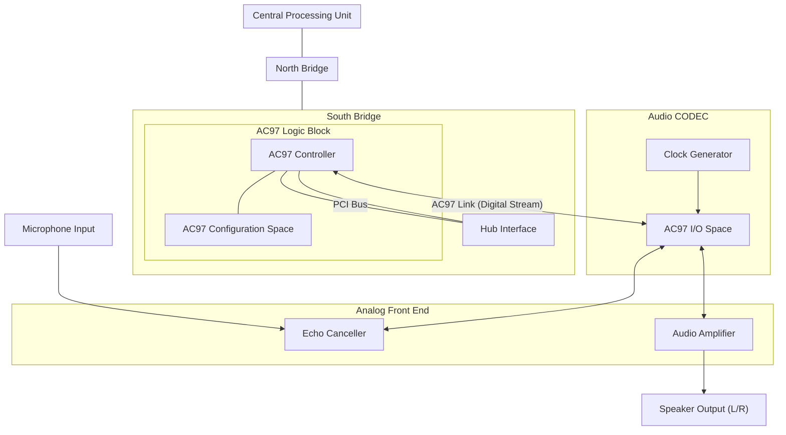

An *audio codec* converts digital audio data to analog sound signals for playing through speakers and performs the reverse operation for recording through a microphone. Other common audio inputs and outputs that interface with a codec include headsets, earphones, handsets, hands-free, line-in, and line-out. A codec also offers *mixer* functionality that connects it to a combination of these audio inputs and outputs, and controls the volume gain of associated audio signals.[1]

[1] This definition of a mixer is from a software perspective. *Sound mixing* or *data mixing* refers to the capability of some codecs to mix multiple sound streams and generate a single stream. This is needed, for example, if you want to superimpose an announcement while a voice communication is in progress on an IP phone. The alsa-lib library, discussed in the latter part of this chapter, supports a plug-in feature called *dmix* that performs data mixing in software if your codec does not have the capability to perform this operation in hardware.

Digital audio data is obtained by sampling analog audio signals at specific bit rates using a technique called *pulse code modulation* (PCM). CD quality is, for example, sound sampled at 44.1KHz, using 16 bits to hold each sample. A codec is responsible for recording audio by sampling at supported PCM bit rates and for playing audio originally sampled at different PCM bit rates.

A sound card may support one or more codecs. Each codec may, in turn, support one or more audio substreams in mono or stereo.

The Audio Codec'97 (AC'97) and the Inter-IC Sound (I2S) bus are examples of industry standard interfaces that connect audio controllers to codecs:

- The Intel AC'97 specification, downloadable from [http://download.intel.com/,](http://download.intel.com/) specifies the semantics and locations of audio registers. Configuration registers are part of the audio controller, while the I/O register space is situated inside the codec. Requests to operate on I/O registers are forwarded by the audio controller to the codec over the AC'97 link. The register that controls line-in volume, for example, lives at offset 0x10 within the AC'97 I/O space. The PC system in Figure 13.1 uses AC'97 to communicate with an external codec.
- The I2S specification, downloadable from www.nxp.com/acrobat\_download/various/I2SBUS.pdf, is a codec

interface standard developed by Philips. The embedded device shown in Figure 13.2 uses I2S to send audio data to the codec. Programming the codec's I/O registers is done via the I2C bus.

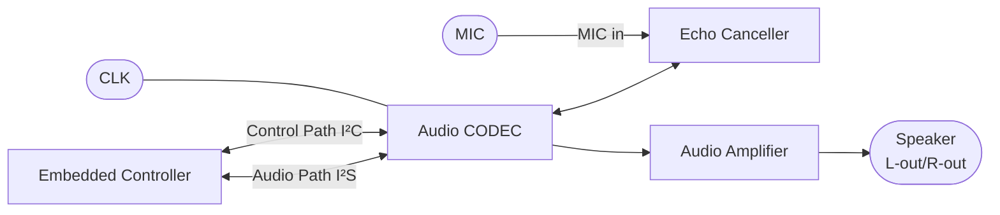

**Figure 13.2. Audio connection on an embedded system.**

AC'97 has limitations pertaining to the number of supported channels and bit rates. Recent South Bridge chipsets from Intel feature a new technology called High Definition (HD) Audio that offers higher-quality, surround sound, and multistreaming capabilities.

#
# **In This Chapter** Audio Architecture 392 Linux-Sound Subsystem 394 Device Example: MP3 Player 396 Debugging 412 Looking at the Sources 412

Audio hardware provides computer systems the capability to generate and capture sound. Audio is an integral component in both the PC and the embedded space, for chatting on a laptop, making a call from a cell phone, listening to an MP3 player, streaming multimedia from a set-top box, or announcing instructions on a medical-grade system. If you run Linux on any of these devices, you need the services offered by the Linux-Sound subsystem.

In this chapter, let's find out how the kernel supports audio controllers and codecs. Let's learn the architecture of the Linux-Sound subsystem and the programming model that it exports.

## **Audio Architecture**

Figure 13.1 shows audio connection on a PC-compatible system. The audio controller on the South Bridge, together with an external codec, interfaces with analog audio circuitry.

**Figure 13.1. Audio in the PC environment.**

[View full size image]

An *audio codec* converts digital audio data to analog sound signals for playing through speakers and performs the reverse operation for recording through a microphone. Other common audio inputs and outputs that interface with a codec include headsets, earphones, handsets, hands-free, line-in, and line-out. A codec also offers *mixer* functionality that connects it to a combination of these audio inputs and outputs, and controls the volume gain of associated audio signals.[1]

[1] This definition of a mixer is from a software perspective. *Sound mixing* or *data mixing* refers to the capability of some codecs to mix multiple sound streams and generate a single stream. This is needed, for example, if you want to superimpose an announcement while a voice communication is in progress on an IP phone. The alsa-lib library, discussed in the latter part of this chapter, supports a plug-in feature called *dmix* that performs data mixing in software if your codec does not have the capability to perform this operation in hardware.

Digital audio data is obtained by sampling analog audio signals at specific bit rates using a technique called *pulse code modulation* (PCM). CD quality is, for example, sound sampled at 44.1KHz, using 16 bits to hold each sample. A codec is responsible for recording audio by sampling at supported PCM bit rates and for playing audio originally sampled at different PCM bit rates.

A sound card may support one or more codecs. Each codec may, in turn, support one or more audio substreams in mono or stereo.

The Audio Codec'97 (AC'97) and the Inter-IC Sound (I2S) bus are examples of industry standard interfaces that connect audio controllers to codecs:

- The Intel AC'97 specification, downloadable from [http://download.intel.com/,](http://download.intel.com/) specifies the semantics and locations of audio registers. Configuration registers are part of the audio controller, while the I/O register space is situated inside the codec. Requests to operate on I/O registers are forwarded by the audio controller to the codec over the AC'97 link. The register that controls line-in volume, for example, lives at offset 0x10 within the AC'97 I/O space. The PC system in Figure 13.1 uses AC'97 to communicate with an external codec.
- The I2S specification, downloadable from www.nxp.com/acrobat\_download/various/I2SBUS.pdf, is a codec

interface standard developed by Philips. The embedded device shown in Figure 13.2 uses I2S to send audio data to the codec. Programming the codec's I/O registers is done via the I2C bus.

**Figure 13.2. Audio connection on an embedded system.**

AC'97 has limitations pertaining to the number of supported channels and bit rates. Recent South Bridge chipsets from Intel feature a new technology called High Definition (HD) Audio that offers higher-quality, surround sound, and multistreaming capabilities.

## **Linux-Sound Subsystem**

*Advanced Linux Sound Architecture* (ALSA) is the sound subsystem of choice in the 2.6 kernel. *Open Sound System* (OSS), the sound layer in the 2.4 kernel, is now obsolete and depreciated. To help the transition from OSS to ALSA, the latter provides OSS emulation that allows applications conforming to the OSS API to run unchanged over ALSA. Linux-Sound frameworks such as ALSA and OSS render audio applications independent of the underlying hardware, just as codec standards such as AC'97 and I2S do away with the need of writing separate audio drivers for each sound card.

Take a look at Figure 13.3 to understand the architecture of the Linux-Sound subsystem. The constituent pieces of the subsystem are as follows:

- The sound core, which is a code base consisting of routines and structures available to other components of the Linux-Sound layer. Like the core layers belonging to other driver subsystems, the sound core provides a level of indirection that renders each component in the sound subsystem independent of the others. The core also plays an important role in exporting the ALSA API to higher applications. The following */dev/snd/\** device nodes shown in Figure 13.3 are created and managed by the ALSA core: */dev/snd/controlC0* is a control node (that applications use for controlling volume gain and such), */dev/snd/pcmC0D0p* is a playback device (*p* at the end of the device name stands for playback), and */dev/snd/pcmC0D0c* is a recording device (*c* at the end of the device name stands for capture). In these device names, the integer following *C* is the card number, and that after *D* is the device number. An ALSA driver for a card that has a voice codec for telephony and a stereo codec for music might export */dev/snd/pcmC0D0p* to read audio streams destined for the former and */dev/snd/pcmC0D1p* to channel music bound for the latter.
- Audio controller drivers specific to controller hardware. To drive the audio controller present in the Intel ICH South Bridge chipsets, for example, use the *snd\_intel8x0* driver.
- Audio codec interfaces that assist communication between controllers and codecs. For AC'97 codecs, use the *snd\_ac97\_codec* and *ac97\_bus* modules.
- An OSS emulation layer that acts as a conduit between OSS-aware applications and the ALSA-enabled kernel. This layer exports */dev* nodes that mirror what the OSS layer offered in the 2.4 kernels. These nodes, such as */dev/dsp*, */dev/adsp*, and */dev/mixer*, allow OSS applications to run unchanged over ALSA. The OSS */dev/dsp* node maps to the ALSA nodes */dev/snd/pcmC0D0\**, */dev/adsp* corresponds to */dev/snd/pcmC0D1\**, and */dev/mixer* associates with */dev/snd/controlC0*.
- Procfs and sysfs interface implementations for accessing information via */proc/asound/* and */sys/class/sound/*.
- The user-space ALSA library, *alsa-lib*, which provides the *libasound.so* object. This library eases the job of the ALSA application programmer by offering several canned routines to access ALSA drivers.
- The *alsa-utils* package that includes utilities such as *alsamixer*, *amixer*, *alsactl*, and *aplay*. Use alsamixer or amixer to change volume levels of audio signals such as line-in, line-out, or microphone, and alsactl to control settings for ALSA drivers. To play audio over ALSA, use aplay.

**Figure 13.3. Linux-Sound (ALSA) subsystem.**

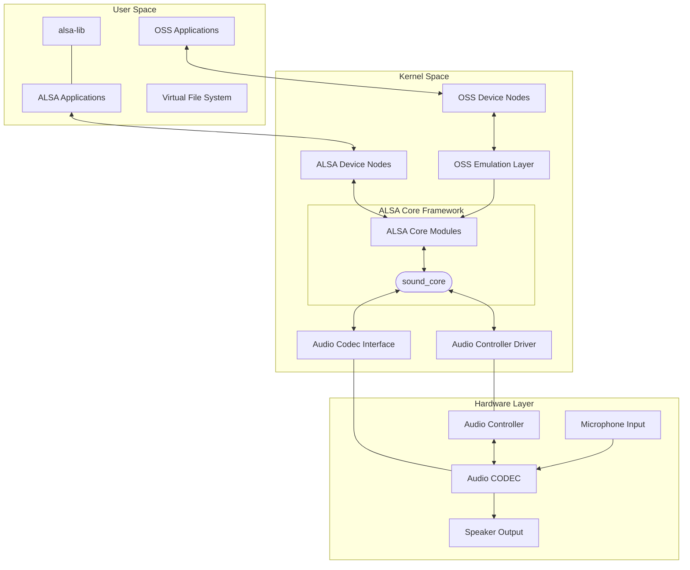

To obtain a better understanding of the architecture of the Linux-Sound layer, let's look at the ALSA driver modules running on a laptop in tandem with Figure 13.3 ( is used to attach comments):

**bash> lsmod|grep snd**

| snd_intel8x0   | 33148 0 |                                                  | Audio Controller Driver |
|----------------|---------|--------------------------------------------------|-------------------------|
| snd_ac97_codec |         | 92000 1 snd_intel8x0                             | Audio Codec Interface   |
| ac97_bus       | 3104    | 1 snd_ac97_codec                                 | Audio Codec Bus         |
| snd_pcm_oss    | 40512 0 |                                                  | OSS Emulation           |
| snd_mixer_oss  |         | 16640 1 snd_pcm_oss                              | OSS Volume Control      |
| snd_pcm        |         | 73316 3 snd_intel8x0,snd_ac97_codec,snd_pcm_oss  |                         |
|                |         |                                                  | Core layer              |
| snd_timer      |         | 22148 1 snd_pcm                                  | Core layer              |
| snd            |         | 50820 6 snd_intel8x0,snd_ac97_codec,snd_pcm_oss, |                         |
|                |         | snd_mixer_oss,snd_pcm,snd_timer                  |                         |
|                |         |                                                  | Core layer              |
| soundcore      | 8960    | 1 snd                                            | Core layer              |
| snd_page_alloc |         | 10344 2 snd_intel8x0,snd_pcm                     | Core layer              |

## **Device Example: MP3 Player**

Figure 13.4 shows audio operation on an example Linux Bluetooth MP3 player built around an embedded SoC. You can program the Linux cell phone (that we used in Chapter 6, "Serial Drivers," and Chapter 12, "Video Drivers") to download songs from the Internet at night when phone rates are presumably cheaper and upload it to the MP3 player's *Compact Flash* (CF) disk via Bluetooth so that you can listen to the songs next day during office commute.

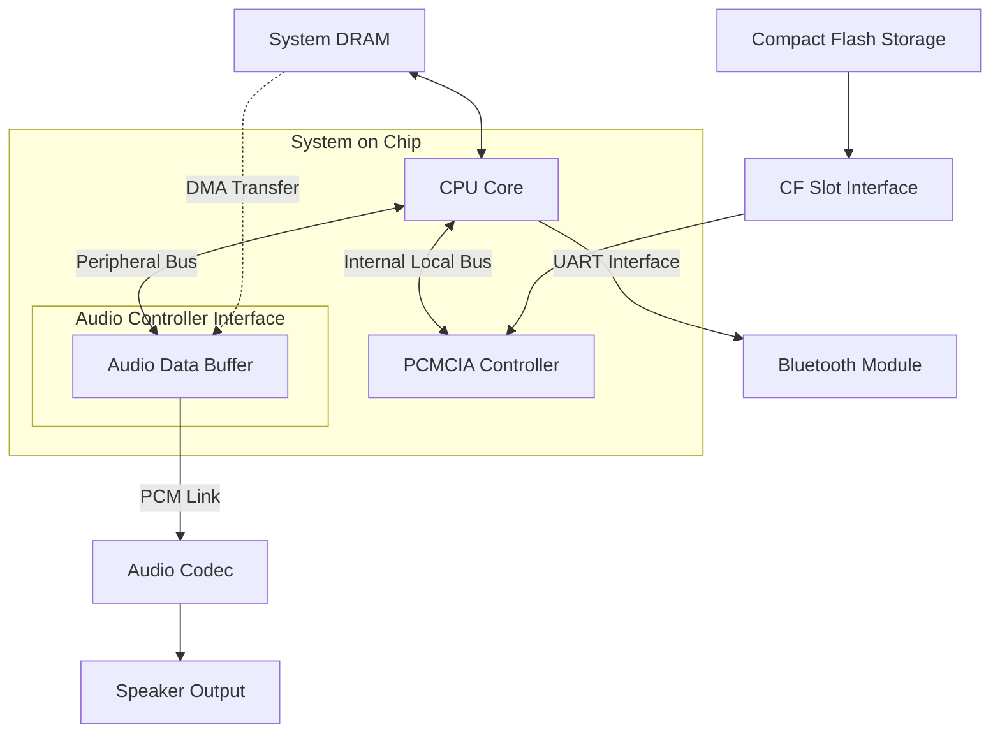

**Figure 13.4. Audio on a Linux MP3 player.**

Our task is to develop the audio software for this device. An application on the player reads songs from the CF disk and decodes it into system memory. A kernel ALSA driver gathers the music data from system memory and dispatches it to transmit buffers that are part of the SoC's audio controller. This PCM data is forwarded to the codec, which plays the music through the device's speaker. As in the case of the navigation system discussed in the preceding chapter, we will assume that Linux supports this SoC, and that all architecture-dependent services such as DMA are supported by the kernel.

The audio software for the MP3 player thus consists of two parts:

A user program that decodes MP3 files reads from the CF disk and converts it into raw PCM. To write a native ALSA decoder application, you can leverage the helper routines offered by the *alsa-lib* library. The section "ALSA Programming" looks at how ALSA applications interact with ALSA drivers. **1.**

You also have the option of customizing public domain MP3 players such as *madplay* [\(http://sourceforge.net/projects/mad/\)](http://sourceforge.net/projects/mad/) to suit this device.

**2.** A low-level kernel ALSA audio driver. The following section is devoted to writing this driver.

One possible hardware implementation of the device shown in Figure 13.4 is by using a PowerPC 405LP SoC and a Texas Instruments TLV320 audio codec. The CPU core in that case is the 405 processor and the on-chip audio controller is the Codec Serial Interface (CSI). SoCs commonly have a highperformance internal local bus that connects to controllers, such as DRAM and video, and a separate onchip peripheral bus to interface with low-speed peripherals such as serial ports, I2C, and GPIO. In the case of the 405LP, the former is called the Processor Local Bus (PLB) and the latter is known as the Onchip Peripheral Bus (OPB). The PCMCIA/CF controller hangs off the PLB, whereas the audio controller interface connects to the OPB.

An audio driver is built out of three main ingredients:

- **1.** Routines that handle playback
- **2.** Routines that handle capture
- **3.** Mixer control functions

Our driver implements playback, but does not support recording because the MP3 player in the example has no microphone. The driver also simplifies the mixer function. Rather than offering the full compliment of volume controls, such as speaker, earphone, and line-out, it allows only a single generic volume control.

The register layout of the MP3 player's audio hardware shown in Table 13.1 mirrors these assumptions and simplifications, and does not conform to standards such as AC'97 alluded to earlier. So, the codec has a SAMPLING\_RATE\_REGISTER to configure the playback (digital-to-analog) sampling rate but no registers to set the capture (analog-to-digital) rate. The VOLUME\_REGISTER configures a single global volume.

**Table 13.1. Register Layout of the Audio Hardware in Figure 13.4**

| Register Name          | Description                                                                                                                                                     |  |  |
|------------------------|-----------------------------------------------------------------------------------------------------------------------------------------------------------------|--|--|
| VOLUME_REGISTER        | Controls the codec's global volume.                                                                                                                             |  |  |
| SAMPLING_RATE_REGISTER | Sets the codec's sampling rate for digital-to-analog<br>conversion.                                                                                             |  |  |
| CLOCK_INPUT_REGISTER   | Configures the codec's clock source, divisors, and so on.                                                                                                       |  |  |
| CONTROL_REGISTER       | Enables interrupts, configures interrupt cause (such as<br>completion of a buffer transfer), resets hardware,<br>enables/disables bus operation, and so on.     |  |  |
| STATUS_REGISTER        | Status of codec audio events.                                                                                                                                   |  |  |
| DMA_ADDRESS_REGISTER   | The example hardware supports a single DMA buffer<br>descriptor. Real-world cards may support multiple<br>descriptors and may have additional registers to hold |  |  |

| Register Name     | Description<br>descriptors and may have additional registers to hold |
|-------------------|----------------------------------------------------------------------|
|                   | parameters such as the descriptor that is currently being            |
|                   | processed, the position of the current sample inside the             |
|                   | buffer, and so on. DMA is performed to the buffers in the            |
|                   | audio controller, so this register resides in the controller's       |
|                   | memory space.                                                        |
| DMA_SIZE_REGISTER | Holds the size of the DMA transfer to/from the SoC. This             |
|                   | register also resides inside the audio controller.                   |

Listing 13.1 is a skeletal ALSA audio driver for the MP3 player and liberally employs pseudo code (within comments) to cut out extraneous detail. ALSA is a sophisticated framework, and conforming audio drivers are usually several thousand lines long. Listing 13.1 gets you started only on your audio driver explorations. Continue your learning by falling back to the mighty Linux-Sound sources inside the top-level *sound/* directory.

## **Driver Methods and Structures**

Our example driver is implemented as a platform driver. Let's take a look at the steps performed by the platform driver's probe() method, mycard\_audio\_probe(). We will digress a bit under each step to explain related concepts and important data structures that we encounter, and this will take us to other parts of the driver and help tie things together.

mycard\_audio\_probe()does the following:

**1.** Creates an instance of a sound card by invoking snd\_card\_new():

```
struct snd_card *card = snd_card_new(-1, id[dev->id], THIS_MODULE, 0);
```

The first argument to snd\_card\_new() is the card index (that identifies this card among multiple sound cards in the system), the second argument is the ID that'll be stored in the id field of the returned snd\_card structure, the third argument is the owner module, and the last argument is the size of a private data field that'll be made available via the private\_data field of the returned snd\_card structure (usually to store chip-specific data such as interrupt levels and I/O addresses).

snd\_card represents the created sound card and is defined as follows in *include/sound/core.h*:

```
struct snd_card {
 int number; /* Card index */
 char id[16]; /* Card ID */
 /* ... */
 struct module *module; /* Owner module */
 void *private_data; /* Private data */
 /* ... */
 struct list_head controls;
 /* All controls for this card */
 struct device *dev; /* Device assigned to this card*/
 /* ... */
};
```

The remove() counterpart of the probe method, mycard\_audio\_remove(), releases the snd\_card from the ALSA framework using snd\_card\_free().

**2.** Creates a PCM playback instance and associates it with the card created in Step 1, using snd\_pcm\_new():

```
int snd_pcm_new(struct snd_card *card, char *id,
 int device,
 int playback_count, int capture_count,
 struct snd_pcm **pcm);
```

The arguments are, respectively, the sound card instance created in Step 1, an identifier string, the device index, the number of supported playback streams, the number of supported capture streams (0 in our example), and a pointer to store the allocated PCM instance. The allocated PCM instance is defined as follows in *include/sound/pcm.h*:

## Code View:

```
struct snd_pcm {
 struct snd_card *card; /* Associated snd_card */
 /* ... */
 struct snd_pcm_str streams[2]; /* Playback and capture streams of this PCM
 component. Each stream may support
 substreams if your h/w supports it
 */
 /* ... */
 struct device *dev; /* Associated hardware
 device */
};
```

The snd\_device\_new() routine lies at the core of snd\_pcm\_new() and other similar component instantiation functions. snd\_device\_new() ties a component and a set of operations with the associated snd\_card (see Step 3).

**3.** Connects playback operations with the PCM instance created in Step 2, by calling snd\_pcm\_set\_ops(). The snd\_pcm\_ops structure specifies these operations for transferring PCM audio to the codec. Listing 13.1 accomplishes this as follows:

```
/* Operators for the PCM playback stream */
static struct snd_pcm_ops mycard_playback_ops = {
 .open = mycard_pb_open, /* Open */
 .close = mycard_pb_close, /* Close */
 .ioctl = snd_pcm_lib_ioctl, /* Use to handle special commands, else
 specify the generic ioctl handler
 snd_pcm_lib_ioctl()*/
 .hw_params = mycard_hw_params, /* Called when higher layers set hardware
 parameters such as audio format. DMA
 buffer allocation is also done from here */
 .hw_free = mycard_hw_free, /* Free resources allocated in
 mycard_hw_params() */
 .prepare = mycard_pb_prepare, /* Prepare to transfer the audio stream.
 Set audio format such as S16_LE
 (explained soon), enable interrupts,.. */
 .trigger = mycard_pb_trigger, /* Called when the PCM engine starts,
 stops, or pauses. The second argument
 specifies why it was called. This
```

```
 function cannot go to sleep */
};
/* Connect the operations with the PCM instance */
snd_pcm_set_ops(pcm, SNDRV_PCM_STREAM_PLAYBACK, &mycard_playback_ops);
```

In Listing 13.1, mycard\_pb\_prepare() configures the sampling rate into the SAMPLING\_RATE\_REGISTER, clock source into the CLOCKING\_INPUT\_REGISTER, and transmit complete interrupt enablement into the CONTROL\_REGISTER. The trigger() method, mycard\_pb\_trigger(), maps an audio buffer populated by the ALSA framework on-the-fly using dma\_map\_single(). (We discussed streaming DMA in Chapter 10, "Peripheral Component Interconnect.") The mapped DMA buffer address is programmed into the DMA\_ADDRESS\_REGISTER. This register is part of the audio controller in the SoC, unlike the earlier registers that reside inside the codec. The audio controller forwards the DMA'ed data to the codec for playback.

Another related object is the snd\_pcm\_hardware structure, which announces the PCM component's hardware capabilities. For our example device, this is defined in Listing 13.1 as follows:

```
/* Hardware capabilities of the PCM playback stream */
static struct snd_pcm_hardware mycard_playback_stereo = {
 .info = (SNDRV_PCM_INFO_MMAP | SNDRV_PCM_INFO_PAUSE |
 SNDRV_PCM_INFO_RESUME); /* mmap() is supported. The stream has
 pause/resume capabilities */
 .formats = SNDRV_PCM_FMTBIT_S16_LE,/* Signed 16 bits per channel, little
 endian */
 .rates = SNDRV_PCM_RATE_8000_48000,/* DAC Sampling rate range */
 .rate_min = 8000, /* Minimum sampling rate */
 .rate_max = 48000, /* Maximum sampling rate */
 .channels_min = 2, /* Supports a left and a right channel */
 .channels_max = 2, /* Supports a left and a right channel */
 .buffer_bytes_max = 32768, /* Max buffer size */
};
```

This object is tied with the associated snd\_pcm from the open() operator, mycard\_playback\_open(), using the PCM *runtime* instance. Each open PCM stream has a runtime object called snd\_pcm\_runtime that contains all information needed to manage that stream. This is a gigantic structure of software and hardware configurations defined in *include/sound/pcm.h* and contains snd\_pcm\_hardware as one of its component fields.

- **4.** Preallocates buffers using snd\_pcm\_lib\_preallocate\_pages\_for\_all(). DMA buffers are subsequently obtained from this preallocated area by mycard\_hw\_params() using snd\_pcm\_lib\_malloc\_pages() and stored in the PCM runtime instance alluded to in Step 3. mycard\_pb\_trigger() DMA-maps this buffer while starting a PCM operation and unmaps it while stopping the PCM operation.
- **5.** Associates a mixer control element with the sound card using snd\_ctl\_add() for global volume control:

```
snd_ctl_add(card, snd_ctl_new1(&mycard_playback_vol, &myctl_private));
```

snd\_ctl\_new1() takes an snd\_kcontrol\_new structure as its first argument and returns a pointer to an snd\_kcontrol structure. Listing 13.1 defines this as follows:

```
static struct snd_kcontrol_new mycard_playback_vol = {
 .iface = SNDRV_CTL_ELEM_IFACE_MIXER,
 /* Ctrl element is of type MIXER */
 .name = "MP3 volume", /* Name */
 .index = 0, /* Codec No: 0 */
 .info = mycard_pb_vol_info, /* Volume info */
 .get = mycard_pb_vol_get, /* Get volume */
 .put = mycard_pb_vol_put, /* Set volume */
};
```

The snd\_kcontrol structure describes a control element. Our driver uses it as a knob for general volume control. snd\_ctl\_add() registers an snd\_kcontrol element with the ALSA framework. The constituent control methods are invoked when user applications such as *alsamixer* are executed. In Listing 13.1, the snd\_kcontrol put() method, mycard\_playback\_volume\_put(), writes requested volume settings to the codec's VOLUME\_REGISTER.

**6.** And finally, registers the sound card with the ALSA framework:

```
snd_card_register(card);
```

codec\_write\_reg() (used, but left unimplemented in Listing 13.1) writes values to codec registers by communicating over the bus that connects the audio controller in the SoC to the external codec. If the underlying bus protocol is I2C or SPI, for example, codec\_write\_reg() uses the interface functions discussed in Chapter 8, "The Inter-Integrated Circuit Protocol."

If you want to create a */proc* interface in your driver for dumping registers during debug or to export a parameter during normal operation, use the services of snd\_card\_proc\_new() and friends. Listing 13.1 does not use */proc* interface files.

If you build and load the driver module in Listing 13.1, you will see two new device nodes appearing on the MP3 player: */dev/snd/pcmC0D0p* and */dev/snd/controlC0*. The former is the interface for audio playback, and the latter is the interface for mixer control. The MP3 decoder application, with the help of *alsa-lib*, streams music by operating over these device nodes.

**Listing 13.1. ALSA Driver for the Linux MP3 Player**

```
include <linux/platform_device.h>
#include <linux/soundcard.h>
#include <sound/driver.h>
#include <sound/core.h>
#include <sound/pcm.h>
#include <sound/initval.h>
#include <sound/control.h>
/* Playback rates supported by the codec */
static unsigned int mycard_rates[] = {
 8000,
 48000,
};
/* Hardware constraints for the playback channel */
static struct snd_pcm_hw_constraint_list mycard_playback_rates = {
 .count = ARRAY_SIZE(mycard_rates),
 .list = mycard_rates,
```

```
 .mask = 0,
};
static struct platform_device *mycard_device;
static char *id[SNDRV_CARDS] = SNDRV_DEFAULT_STR;
/* Hardware capabilities of the PCM stream */
static struct snd_pcm_hardware mycard_playback_stereo = {
 .info = (SNDRV_PCM_INFO_MMAP | SNDRV_PCM_INFO_BLOCK_TRANSFER),
 .formats = SNDRV_PCM_FMTBIT_S16_LE, /* 16 bits per channel, little endian */
 .rates = SNDRV_PCM_RATE_8000_48000, /* DAC Sampling rate range */
 .rate_min = 8000, /* Minimum sampling rate */
 .rate_max = 48000, /* Maximum sampling rate */
 .channels_min = 2, /* Supports a left and a right channel */
 .channels_max = 2, /* Supports a left and a right channel */
 .buffer_bytes_max = 32768, /* Maximum buffer size */
};
/* Open the device in playback mode */
static int
mycard_pb_open(struct snd_pcm_substream *substream)
{
 struct snd_pcm_runtime *runtime = substream->runtime;
 /* Initialize driver structures */
 /* ... */
 /* Initialize codec registers */
 /* ... */
 /* Associate the hardware capabilities of this PCM component */
 runtime->hw = mycard_playback_stereo;
 /* Inform the ALSA framework about the constraints that
 the codec has. For example, in this case, it supports
 PCM sampling rates of 8000Hz and 48000Hz only */
 snd_pcm_hw_constraint_list(runtime, 0,
 SNDRV_PCM_HW_PARAM_RATE,
 &mycard_playback_rates);
 return 0;
}
/* Close */
static int
mycard_pb_close(struct snd_pcm_substream *substream)
{
 /* Disable the codec, stop DMA, free data structures */
 /* ... */
 return 0;
}
/* Write to codec registers by communicating over
 the bus that connects the SoC to the codec */
void
codec_write_reg(uint codec_register, uint value)
{
 /* ... */
}
/* Prepare to transfer an audio stream to the codec */
static int
mycard_pb_prepare(struct snd_pcm_substream *substream)
```

```
{
 /* Enable Transmit DMA complete interrupt by writing to
 CONTROL_REGISTER using codec_write_reg() */
 /* Set the sampling rate by writing to SAMPLING_RATE_REGISTER */
 /* Configure clock source and enable clocking by writing
 to CLOCK_INPUT_REGISTER */
 /* Allocate DMA descriptors for audio transfer */
 return 0;
}
/* Audio trigger/stop/.. */
static int
mycard_pb_trigger(struct snd_pcm_substream *substream, int cmd)
{
 switch (cmd) {
 case SNDRV_PCM_TRIGGER_START:
 /* Map the audio substream's runtime audio buffer (which is an
 offset into runtime->dma_area) using dma_map_single(),
 populate the resulting address to the audio controller's
 DMA_ADDRESS_REGISTER, and perform DMA */
 /* ... */
 break;
 case SNDRV_PCM_TRIGGER_STOP:
 /* Shut the stream. Unmap DMA buffer using dma_unmap_single() */
 /* ... */
 break;
 default:
 return -EINVAL;
 break;
 }
 return 0;
}
/* Allocate DMA buffers using memory preallocated for DMA from the
 probe() method. dma_[map|unmap]_single() operate on this area
 later on */
static int
mycard_hw_params(struct snd_pcm_substream *substream,
 struct snd_pcm_hw_params *hw_params)
{
 /* Use preallocated memory from mycard_audio_probe() to
 satisfy this memory request */
 return snd_pcm_lib_malloc_pages(substream,
 params_buffer_bytes(hw_params));
}
/* Reverse of mycard_hw_params() */
static int
mycard_hw_free(struct snd_pcm_substream *substream)
{
 return snd_pcm_lib_free_pages(substream);
}
```

```
/* Volume info */
static int
mycard_pb_vol_info(struct snd_kcontrol *kcontrol,
 struct snd_ctl_elem_info *uinfo)
{
 uinfo->type = SNDRV_CTL_ELEM_TYPE_INTEGER;
 /* Integer type */
 uinfo->count = 1; /* Number of values */
 uinfo->value.integer.min = 0; /* Minimum volume gain */
 uinfo->value.integer.max = 10; /* Maximum volume gain */
 uinfo->value.integer.step = 1; /* In steps of 1 */
 return 0;
}
/* Playback volume knob */
static int
mycard_pb_vol_put(struct snd_kcontrol *kcontrol,
 struct snd_ctl_elem_value *uvalue)
{
 int global_volume = uvalue->value.integer.value[0];
 /* Write global_volume to VOLUME_REGISTER
 using codec_write_reg() */
 /* ... */
 /* If the volume changed from the current value, return 1.
 If there is an error, return negative code. Else return 0 */
}
/* Get playback volume */
static int
mycard_pb_vol_get(struct snd_kcontrol *kcontrol,
 struct snd_ctl_elem_value *uvalue)
{
 /* Read global_volume from VOLUME_REGISTER
 and return it via uvalue->integer.value[0] */
 /* ... */
 return 0;
}
/* Entry points for the playback mixer */
static struct snd_kcontrol_new mycard_playback_vol = {
 .iface = SNDRV_CTL_ELEM_IFACE_MIXER,
 /* Control is of type MIXER */
 .name = "MP3 Volume", /* Name */
 .index = 0, /* Codec No: 0 */
 .info = mycard_pb_vol_info, /* Volume info */
 .get = mycard_pb_vol_get, /* Get volume */
 .put = mycard_pb_vol_put, /* Set volume */
};
/* Operators for the PCM playback stream */
static struct snd_pcm_ops mycard_playback_ops = {
 .open = mycard_playback_open, /* Open */
 .close = mycard_playback_close, /* Close */
 .ioctl = snd_pcm_lib_ioctl, /* Generic ioctl handler */
 .hw_params = mycard_hw_params, /* Hardware parameters */
 .hw_free = mycard_hw_free, /* Free h/w params */
 .prepare = mycard_playback_prepare, /* Prepare to transfer audio stream */
 .trigger = mycard_playback_trigger, /* Called when the PCM engine
```

```
 starts/stops/pauses */
};
/* Platform driver probe() method */
static int __init
mycard_audio_probe(struct platform_device *dev)
{
 struct snd_card *card;
 struct snd_pcm *pcm;
 int myctl_private;
 /* Instantiate an snd_card structure */
 card = snd_card_new(-1, id[dev->id], THIS_MODULE, 0);
 /* Create a new PCM instance with 1 playback substream
 and 0 capture streams */
 snd_pcm_new(card, "mycard_pcm", 0, 1, 0, &pcm);
 /* Set up our initial DMA buffers */
 snd_pcm_lib_preallocate_pages_for_all(pcm,
 SNDRV_DMA_TYPE_CONTINUOUS,
 snd_dma_continuous_data
 (GFP_KERNEL), 256*1024,
 256*1024);
 /* Connect playback operations with the PCM instance */
 snd_pcm_set_ops(pcm, SNDRV_PCM_STREAM_PLAYBACK,
 &mycard_playback_ops);
 /* Associate a mixer control element with this card */
 snd_ctl_add(card, snd_ctl_new1(&mycard_playback_vol,
 &myctl_private));
 strcpy(card->driver, "mycard");
 /* Register the sound card */
 snd_card_register(card);
 /* Store card for access from other methods */
 platform_set_drvdata(dev, card);
 return 0;
}
/* Platform driver remove() method */
static int
mycard_audio_remove(struct platform_device *dev)
{
 snd_card_free(platform_get_drvdata(dev));
 platform_set_drvdata(dev, NULL);
 return 0;
}
/* Platform driver definition */
static struct platform_driver mycard_audio_driver = {
 .probe = mycard_audio_probe, /* Probe method */
 .remove = mycard_audio_remove, /* Remove method */
 .driver = {
 .name = "mycard_ALSA",
```

```
 },
};
/* Driver Initialization */
static int __init
mycard_audio_init(void)
{
 /* Register the platform driver and device */
 platform_driver_register(&mycard_audio_driver);
 mycard_device = platform_device_register_simple("mycard_ALSA",
 -1, NULL, 0);
 return 0;
}
/* Driver Exit */
static void __exit
mycard_audio_exit(void)
{
 platform_device_unregister(mycard_device);
 platform_driver_unregister(&mycard_audio_driver);
}
module_init(mycard_audio_init);
module_exit(mycard_audio_exit);
MODULE_LICENSE("GPL");
```

## **ALSA Programming**

To understand how the user space alsa-lib library interacts with kernel space ALSA drivers, let's write a simple application that sets the volume gain of the MP3 player. We will map the alsa-lib services used by the application to the mixer control methods defined in Listing 13.1. Let's begin by loading the driver and examining the mixer's capabilities:

#### **bash> amixer contents**

```
...
numid=3,iface=MIXER,name="MP3 Volume"
 ; type=INTEGER,...
...
```

In the volume-control application, first allocate space for the alsa-lib objects necessary to perform the volumecontrol operation:

```
#include <alsa/asoundlib.h>
snd_ctl_elem_value_t *nav_control;
snd_ctl_elem_id_t *nav_id;
snd_ctl_elem_info_t *nav_info;
snd_ctl_elem_value_alloca(&nav_control);
snd_ctl_elem_id_alloca(&nav_id);
snd_ctl_elem_info_alloca(&nav_info);
```

Next, set the interface type to SND\_CTL\_ELEM\_IFACE\_MIXER as specified in the mycard\_playback\_vol structure in Listing 13.1:

```
snd_ctl_elem_id_set_interface(nav_id, SND_CTL_ELEM_IFACE_MIXER);
```

Now set the numid for the MP3 volume obtained from the amixer output above:

```
snd_ctl_elem_id_set_numid(nav_id, 3); /* num_id=3 */
```

Open the mixer node, */dev/snd/controlC0*. The third argument to snd\_ctl\_open() specifies the card number in the node name:

```
snd_ctl_open(&nav_handle, card, 0);
/* Connect data structures */
snd_ctl_elem_info_set_id(nav_info, nav_id);
snd_ctl_elem_info(nav_handle, nav_info);
```

Elicit the type field in the snd\_ctl\_elem\_info structure defined in mycard\_pb\_vol\_info() in Listing 13.1 as follows:

```
if (snd_ctl_elem_info_get_type(nav_info) !=
 SND_CTL_ELEM_TYPE_INTEGER) {
 printk("Mismatch in control type\n");
}
```

Get the supported codec volume range by communicating with the mycard\_pb\_vol\_info() driver method:

```
long desired_volume = 5;
long min_volume = snd_ctl_elem_info_get_min(nav_info);
long max_volume = snd_ctl_elem_info_get_max(nav_info);
/* Ensure that the desired_volume is within min_volume and
 max_volume */
/* ... */
```

As per the definition of mycard\_pb\_vol\_info() in Listing 13.1, the minimum and maximum values returned by the above alsa-lib helper routines are 0 and 10, respectively.

Finally, set the desired volume and write it to the codec:

```
snd_ctl_elem_value_set_integer(nav_control, 0, desired_volume);
snd_ctl_elem_write(nav_handle, nav_control);
```

The call to snd\_ctl\_elem\_write() results in the invocation of mycard\_pb\_vol\_put(), which writes the desired volume gain to the codec's VOLUME\_REGISTER.

#### MP3 Decoding Complexity

The MP3 decoder application running on the player, as shown in Figure 13.4, requires a supply rate of MP3 frames from the CF disk that can sustain the common MP3 sampling rate of 128KBps. This is usually not a problem for most low-MIPs devices, but in case it is, consider buffering each song in memory before decoding it. (MP3 frames at 128KBps roughly consume 1MB per minute of music.)

MP3 decoding is lightweight and can usually be accomplished on-the-fly, but MP3 encoding is heavy-duty and cannot be achieved in real time without hardware assist. Voice codecs such as G.711 and G.729 used in Voice over IP (VoIP) environments can, however, encode and decode audio data in real time.

## **Debugging**

You may turn on options under *Device Drivers Sound Advanced Linux Sound Architecture* in the kernel configuration menu to include ALSA debug code (CONFIG\_SND\_DEBUG), verbose printk() messages (CONFIG\_SND\_VERBOSE\_PRINTK), and verbose procfs content (CONFIG\_SND\_VERBOSE\_PROCFS).

Procfs information pertaining to ALSA drivers resides in */proc/asound/*. Look inside */sys/class/sound/* for the device model information associated with each sound-class device.

If you think you have found a bug in an ALSA driver, post it to the alsa-devel mailing list [\(http://mailman.alsa](http://mailman.alsa-)project.org/mailman/listinfo/alsa-devel). The linux-audio-dev mailing list [\(http://music.columbia.edu/mailman/listinfo/linux-audio-dev/](http://music.columbia.edu/mailman/listinfo/linux-audio-dev/)), also called the *Linux Audio Developers* (LAD) list, discusses questions related to the Linux-sound architecture and audio applications.

## **Looking at the Sources**

The sound core, audio buses, architectures, and the obsolete OSS suite all have their own separate subdirectories under *sound/*. For the AC'97 interface implementation, look inside *sound/pci/ac97/*. For an example I2S-based audio driver, look at *sound/soc/at91/at91-ssc.c*, the audio driver for Atmel's AT91-series ARM-based embedded SoCs. Use *sound/drivers/dummy.c* as a starting point for developing your custom ALSA driver if you cannot find a closer match.

*Documentation/sound/\** contains information on ALSA and OSS drivers. *Documentation/sound/alsa/DocBook/* contains a DocBook on writing ALSA drivers. An ALSA configuration guide is available in *Documentation/sound/alsa/ALSA-Configuration.txt*. The Sound-HOWTO, downloadable from <http://tldp.org/HOWTO/Sound-HOWTO/>, answers several frequently asked questions pertaining to Linux support for audio devices.

*Madplay* is a software MP3 decoder and player that is both ALSA- and OSS-aware. You can look at its sources for tips on user-space audio programming.

Two no-frills OSS tools for basic playback and recording are *rawplay* and *rawrec*, whose sources are downloadable from [http://rawrec.sourceforge.net/.](http://rawrec.sourceforge.net/)

You can find the home page of the Linux-ALSA project at www.alsa-project.org. Here, you will find the latest news on ALSA drivers, details on the ALSA programming API, and information on subscribing to related mailing lists. Sources of alsa-utils and alsa-lib, downloadable from this page, can aid you while developing ALSA-aware applications.

Table 13.2 contains the main data structures used in this chapter and their location in the source tree. Table 13.3 lists the main kernel programming interfaces that you used in this chapter along with the location of their definitions.

**Table 13.2. Summary of Data Structures**

| Data Structure    | Location             | Description                                                          |
|-------------------|----------------------|----------------------------------------------------------------------|
| snd_card          | include/sound/core.h | Representation of a sound card                                       |
| snd_pcm           | include/sound/pcm.h  | An instance of a PCM object                                          |
| snd_pcm_ops       | include/sound/pcm.h  | Used to connect operations with a PCM<br>object                      |
| snd_pcm_substream | include/sound/pcm.h  | Information about the current audio<br>stream                        |
| snd_pcm_runtime   | include/sound/pcm.h  | Runtime details of the audio stream                                  |
| snd_kcontrol_new  |                      | include/sound/control.h Representation of an ALSA control<br>element |

**Table 13.3. Summary of Kernel Programming Interfaces**

| Kernel Interface | Location          | Description                        |
|------------------|-------------------|------------------------------------|
| snd_card_new()   | sound/core/init.c | Instantiates an snd_card structure |
| snd_card_free()  | sound/core/init.c | Frees an instantiated snd_card     |

| Kernel Interface                                                                                 | Location             | Description                                                                                   |
|--------------------------------------------------------------------------------------------------|----------------------|-----------------------------------------------------------------------------------------------|
| snd_card_register()                                                                              | sound/core/init.c    | Registers a sound card with the<br>ALSA framework                                             |
| snd_pcm_lib_preallocate_pages_for_all() sound/core/pcm_memory.c Preallocates buffers for a sound |                      | card                                                                                          |
| snd_pcm_lib_malloc_pages()                                                                       |                      | sound/core/pcm_memory.c Allocates DMA buffers for a sound<br>card                             |
| snd_pcm_new()                                                                                    | sound/core/pcm.c     | Creates an instance of a PCM<br>object                                                        |
| snd_pcm_set_ops()                                                                                | sound/core/pcm_lib.c | Connects playback or capture<br>operations with a PCM object                                  |
| snd_ctl_add()                                                                                    | sound/core/control.c | Associates a mixer control element<br>with a sound card                                       |
| snd_ctl_new1()                                                                                   | sound/core/control.c | Allocates an snd_kcontrol<br>structure and initializes it with<br>supplied control operations |
| snd_card_proc_new()                                                                              | sound/core/info.c    | Creates a /proc entry and assigns<br>it to a card instance                                    |

## **Chapter 14. Block Drivers**

| In This Chapter                              |     |
|----------------------------------------------|-----|
| Storage Technologies                         | 416 |
| Linux Block I/O Layer                        | 421 |
| I/O Schedulers                               | 422 |
| Block Driver Data Structures and Methods     | 423 |
| Device Example: Simple Storage<br>Controller | 426 |
| Advanced Topics                              | 434 |
| Debugging                                    | 436 |
| Looking at the Sources                       | 437 |

Block devices are storage media capable of random access. Unlike character devices, block devices can hold filesystem data. In this chapter, let's find out how Linux supports storage buses and devices.

## **Storage Technologies**

Let's start by taking a tour of the popular storage technologies found in today's computer systems. We'll also associate these technologies with the corresponding device driver subsystems in the kernel source tree.

*Integrated Drive Electronics* (IDE) is the common storage interface technology used in the PC environment. ATA (short for *Advanced Technology Attachment*) is the official name for the related specifications. The IDE/ATA

standard began with ATA-1; the latest version is ATA-7 and supports bandwidths of up to 133MBps. Intervening versions of the specification are ATA-2, which introduced *logical block addressing* (LBA); ATA-3, which enabled SMART-capable disks (discussed later); ATA-4, which brought support for Ultra DMA and the associated 33MBps throughput; ATA-5, which increased maximum transfer speeds to 66MBps; and ATA-6, which provided for 100MBps data rates.

Storage devices such as CD-ROMs and tapes connect to the standard IDE cable using a special protocol called the *ATA Packet Interface* (ATAPI).[1]ATAPI was introduced along with ATA-4.

[1] The ATAPI protocol is closer to SCSI than to IDE.

The floppy disk controller in PC systems has traditionally been part of the Super I/O chipset about which we learned in Chapter 6, "Serial Drivers." These internal drives, however, have given way to faster external USB floppy drives in today's PC environment.

Figure 14.1 shows an ATA-7 disk drive connected to an IDE host adapter that's part of the South Bridge chipset on a PC system. Also shown connected are an ATAPI CD-ROM drive and a floppy drive.

**Figure 14.1. Storage media in a PC system.**

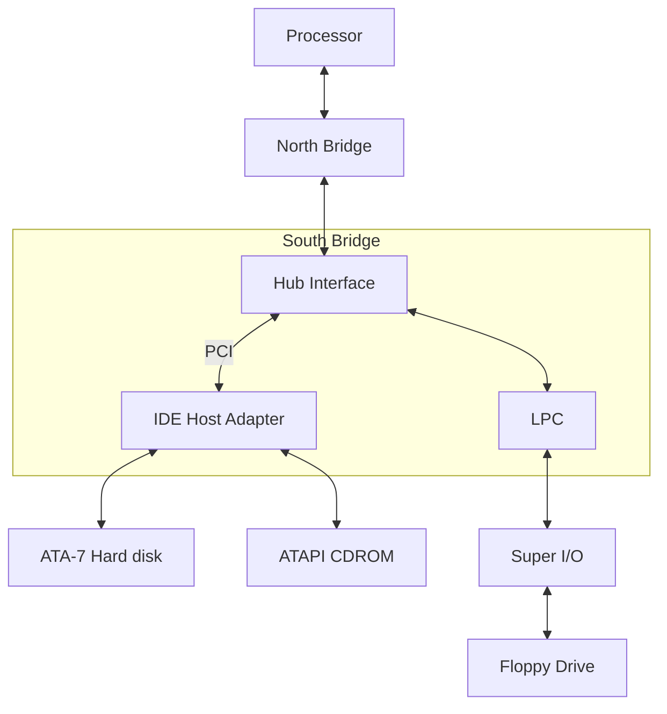

IDE/ATA is a parallel bus technology (sometimes called *Parallel ATA* or PATA) and cannot scale to high speeds, as you learned while discussing PCIe in Chapter 10, "Peripheral Component Interconnect." *Serial ATA* (SATA) is a modern serial bus evolution of PATA that supports transfer speeds in the realm of 300MBps and beyond. In addition to offering higher throughput than PATA, SATA brings capabilities such as hot swapping. SATA technology is steadily replacing PATA. See the sidebar "libATA" to learn about the new ATA subsystem in the kernel that supports both SATA and PATA.

### libATA

*libATA* is the new ATA subsystem in the Linux kernel. It consists of a set of ATA library routines and a collection of low-level drivers that use them. libATA supports both SATA and PATA. SATA drivers in libATA have been around for some time under *drivers/scsi/*, but PATA drivers and the new *drivers/ata/* directory that now houses all libATA sources were introduced with the 2.6.19 kernel release.

If your system is enabled with SATA storage, you need the services of libATA in tandem with the SCSI subsystem. libATA support for PATA is still experimental, and by default, PATA drivers continue to use the legacy IDE drivers that live in *drivers/ide/*.

Assume that your system is SATA-enabled via an Intel ICH7 South Bridge chipset. You need the following libATA components to access your disk:

- **The libATA core—** To enable this, set CONFIG\_ATA during kernel configuration. For a list of library functions offered by the core, grep for EXPORT\_SYMBOL\_GPL inside the *drivers/ata/* directory. **1.**
- **Advanced Host Controller Interface (AHCI) support—** AHCI specifies the register interface supported by SATA host adapters and is enabled by choosing CONFIG\_AHCI at configuration time. **2.**
- **3. The host controller adapter driver—** For the ICH7, enable CONFIG\_ATA\_PIIX.

Additionally, you need the mid-level and upper-level SCSI drivers (CONFIG\_SCSI and friends). After you have loaded all these kernel components, your SATA disk partitions appear to the system as */dev/sd\**, just like SCSI or USB mass storage partitions.

The home page of the libATA project is [http://linux-ata.org/.](http://linux-ata.org/) A DocBook is available as part of the kernel source tree in *Documentation/DocBook/libata.tmpl*. A libATA developer's guide is available at www.kernel.org/pub/linux/kernel/people/jgarzik/libata.pdf.

*Small Computer System Interface* (SCSI) is the storage technology of choice in servers and high-end workstations. SCSI is somewhat faster than SATA and supports speeds of the order of 320MBps. SCSI has traditionally been a parallel interface standard, but, like ATA, has recently shifted to serial operation with the advent of a bus technology called *Serial Attached SCSI* (SAS).

The kernel's SCSI subsystem is architected into three layers: top-level drivers for media such as disks, CD-ROMs, and tapes; a middle-level layer that scans the SCSI bus and configures devices; and low-level host adapter drivers. We learned about these layers in the section "Mass Storage" in Chapter 11, "Universal Serial Bus." Refer back to Figure 11.4 in that chapter to see how the different components of the SCSI subsystem interact with each other.[2] USB mass storage drives use flash memory internally but communicate with host systems using the SCSI protocol.

[2] SCSI support is discussed in other parts of this book, too. The section "User Mode SCSI" in Chapter 19, "Drivers in User Space," discusses the *SCSI Generic* (sg) interface that lets you directly dispatch commands from user space to SCSI devices. The section "iSCSI" in Chapter 20, "More Devices and Drivers," briefly looks at the iSCSI protocol, which allows the transport of SCSI packets to a remote block device over a TCP/IP network.

*Redundant array of inexpensive disks* (RAID) is a technology built in to some SCSI and SATA controllers to achieve redundancy and reliability. Various RAID levels have been defined. RAID-1, for example, specifies *disk mirroring*, where data is duplicated on separate disks. Linux drivers are available for several RAID-capable disk drives. The kernel also offers a multidisk (md) driver that implements most RAID levels in software.

Miniature storage is the name of the game in the embedded consumer electronics space. Transfer speeds in this domain are much lower than that offered by the technologies discussed thus far. *Secure Digital* (SD) cards and their smaller form-factor derivatives (miniSD and microSD) are popular storage media[3] in devices such as cameras, cell phones, and music players. Cards complying with version 1.01 of the SD card specification support transfer speeds of up to 10MBps. SD storage has evolved from an older, slower, but compatible technology called *MultiMediaCard* (MMC) that supports data rates of 2.5MBps. The kernel contains an SD/MMC subsystem in *drivers/mmc/*.

[3] See the sidebar "WiFi over SDIO" in Chapter 16, "Linux Without Wires," to learn about nonstorage technologies available in SD form factor.

The section "PCMCIA Storage" in Chapter 9, "PCMCIA and Compact Flash," looked at different PCMCIA/CF flavors of storage cards and their corresponding kernel drivers. PCMCIA memory cards such as microdrives support true IDE operation, whereas those that internally use solid-state memory emulate IDE and export an IDE programming model to the kernel. In both these cases, the kernel's IDE subsystem can be used to enable the card.

Table 14.1 summarizes important storage technologies and the location of the associated device drivers in the kernel source tree.

**Table 14.1. Storage Technologies and Associated Device Drivers**

| Storage Technology | Description                                                                                                                                            | Source File                                                                |
|--------------------|--------------------------------------------------------------------------------------------------------------------------------------------------------|----------------------------------------------------------------------------|
| IDE/ATA            | Storage interface technology in the PC<br>environment. Supports data rates of<br>133MBps for ATA-7.                                                    | drivers/ide/ide-disk.c,<br>driver/ide/ide-io.c,<br>drivers/ide/ide-probe.c |
|                    |                                                                                                                                                        | or                                                                         |
|                    |                                                                                                                                                        | drivers/ata/<br>(Experimental)                                             |
| ATAPI              | Storage devices such as CD-ROMs and<br>tapes connect to the standard IDE cable                                                                         | drivers/ide/ide-cd.c                                                       |
|                    | using the ATAPI protocol.                                                                                                                              | or                                                                         |
|                    |                                                                                                                                                        | drivers/ata/<br>(Experimental)                                             |
| Floppy (internal)  | The floppy controller resides in the Super<br>I/O chip on the LPC bus in PC-compatible<br>systems. Supports transfer rates of the<br>order of 150KBps. | drivers/block/floppy.c                                                     |
| SATA               | Serial evolution of IDE/ATA. Supports<br>speeds of 300MBps and beyond.                                                                                 | drivers/ata/, drivers/scsi/                                                |
| SCSI               | Storage technology popular in the server<br>environment. Supports transfer rates of<br>320MBps for Ultra320 SCSI.                                      | drivers/scsi/                                                              |

| Storage Technology                          | Description                                                                                                                                                                                     | Source File                                          |  |
|---------------------------------------------|-------------------------------------------------------------------------------------------------------------------------------------------------------------------------------------------------|------------------------------------------------------|--|
| USB Mass Storage                            | This refers to USB hard disks, pen drives,<br>CD-ROMs, and floppy drives. Look at the<br>section "Mass Storage" in Chapter 11.<br>USB 2.0 devices can communicate at<br>speeds of up to 60MBps. | drivers/usb/storage/,<br>drivers/scsi/               |  |
| RAID:                                       |                                                                                                                                                                                                 |                                                      |  |
| Hardware RAID                               | This is a capability built into high-end<br>SCSI/SATA disk controllers to achieve<br>redundancy and reliability.                                                                                | drivers/scsi/, drivers/ata/                          |  |
| Software RAID                               | On Linux, the multidisk (md) driver<br>implements several RAID levels in<br>software.                                                                                                           | drivers/md/                                          |  |
| SD/miniSD/microSD                           | Small form-factor storage media popular<br>in consumer electronic devices such as<br>cameras and cell phones. Supports<br>transfer rates of up to 10MBps.                                       | drivers/mmc/                                         |  |
| MMC                                         | Older removable storage standard that's<br>compatible with SD cards. Supports data<br>rates of 2.5MBps.                                                                                         | drivers/mmc/                                         |  |
| PCMCIA/ CF storage                          | PCMCIA/CF form factor of miniature IDE                                                                                                                                                          | drivers/ide/legacy/ide-cs.c                          |  |
| cards                                       | drives, or solid-state memory cards that<br>emulate IDE. See the section "PCMCIA<br>Storage" in Chapter 9.                                                                                      | or                                                   |  |
|                                             |                                                                                                                                                                                                 | drivers/ata/pata_pcmcia.c<br>(experimental)          |  |
| Block device emulation<br>over flash memory | Emulates a hard disk over flash memory.<br>See the section "Block Device Emulation"<br>in Chapter 17, "Memory Technology<br>Devices."                                                           | drivers/mtd/mtdblock.c,<br>drivers/mtd/mtd_blkdevs.c |  |
| Virtual block devices on Linux:             |                                                                                                                                                                                                 |                                                      |  |
| RAM disk                                    | Implements support to use a RAM region<br>as a block device.                                                                                                                                    | drivers/block/rd.c                                   |  |
| Loopback device                             | Implements support to use a regular file<br>as a block device.                                                                                                                                  | drivers/block/loop.c                                 |  |

## **Chapter 15. Network Interface Cards**

# **In This Chapter** Driver Data Structures 440 Talking with Protocol Layers 448 Buffer Management and Concurrency Control 450 Device Example: Ethernet NIC 451 ISA Network Drivers 457 Asynchronous Transfer Mode 458 Network Throughput 459 Looking at the Sources 461

Connectivity imparts intelligence. You rarely come across a computer system today that does not support some form of networking. In this chapter, let's focus on device drivers for *network interface cards* (NICs) that carry *Internet Protocol* (IP) traffic on a *local area network* (LAN). Most of the chapter is bus agnostic, but wherever bus specifics are necessary, it assumes PCI. To give you a flavor of other network technologies, we also touch on *Asynchronous Transfer Mode* (ATM). We end the chapter by pondering on performance and throughput.

NIC drivers are different from other driver classes in that they do not rely on */dev* or */sys* to communicate with user space. Rather, applications interact with a NIC driver via a network interface (for example, eth0 for the first Ethernet interface) that abstracts an underlying protocol stack.

## **Driver Data Structures**

When you write a device driver for a NIC, you have to operate on three classes of data structures:

- Structures that form the building blocks of the network protocol stack. The socket buffer or struct sk\_buff defined in *include/linux/sk\_buff.h* is the key structure used by the kernel's TCP/IP stack. **1.**
- Structures that define the interface between the NIC driver and the protocol stack. struct net\_device defined in *include/linux/netdevice.h* is the core structure that constitutes this interface. **2.**
- **3.** Structures related to the I/O bus. PCI and its derivatives are common buses used by today's NICs.

We take a detailed look at socket buffers and the net\_device interface in the next two sections. We covered PCI data structures in Chapter 10, "Peripheral Component Interconnect," so we won't revisit them here.

## **Socket Buffers**

sk\_buffs provide efficient buffer handling and flow-control mechanisms to Linux networking layers. Like DMA descriptors that contain metadata on DMA buffers, sk\_buffs hold control information describing attached memory buffers that carry network packets (see Figure 15.1). sk\_buffs are enormous structures having dozens of elements, but in this chapter we confine ourselves to those that interest the network device driver writer. An sk\_buff links itself to its associated packet buffer using five main fields:

- head, which points to the start of the packet
- data, which points to the start of packet payload
- tail, which points to the end of packet payload
- end, which points to the end of the packet
- len, the amount of data that the packet contains

**Figure 15.1. sk\_buff operations.**

```mermiad
flowchart TD
    %% Các bước xử lý Code
    ALLOC["skb = dev_alloc_skb(length + NET_IP_ALIGN)"]
    RESERVE["skb_reserve(skb, NET_IP_ALIGN)"]
    COPY["memcpy(skb->data, dma_buffer, length)"]
    PUT["skb_put(skb, length)"]
    NETIF["netif_rx(skb)"]

    %% Trạng thái của Buffer tương ứng
    ST1["State 1: data, head, tail point to start of Data Buffer"]
    ST2["State 2: head at start, data and tail shifted by NET_IP_ALIGN"]
    ST3["State 3: Packet data copied to data pointer location"]
    ST4["State 4: tail moved to end of packet data length"]

    %% Luồng logic
    ALLOC --> ST1
    ST1 --> RESERVE
    RESERVE --> ST2
    ST2 --> COPY
    COPY --> ST3
    ST3 --> PUT
    PUT --> ST4
    ST4 --> NETIF

    %% Tầng xử lý Protocol Stack
    subgraph Protocol_Stack["Protocol Stack"]
        NIC[NIC Driver]
        IP[IP Layer]
        TCP[TCP Layer]
    end

    NETIF --> NIC
    NIC --> IP
    IP --> TCP
```

Assume skb points to an sk\_buff, skb->head, skb->data, skb->tail, and skb->end slide over the associated packet buffer as the packet traverses the protocol stack in either direction. skb->data, for example, points to the header of the protocol that is currently processing the packet. When a packet reaches the IP layer via the receive path, skb->data points to the IP header; when the packet passes on to TCP, however, skb->data moves to the start of the TCP header. And as the packet drives through various protocols adding or discarding header data, skb->len gets updated, too. sk\_buffs also contain pointers other than the four major ones previously mentioned. skb->nh, for example, remembers the position of the network protocol header irrespective of the current position of skb->data.

To illustrate how a NIC driver works with sk\_buffs, Figure 15.1 shows data transitions on the receive data path. For convenience of illustration, the figure simplistically assumes that the operations shown are executed in sequence. However, for operational efficiency in the real world, the first two steps (dev\_alloc\_skb() and

skb\_reserve()) are performed while initially preallocating a ring of receive buffers; the third step is accomplished by the NIC hardware as it directly DMA's the received packet into a preallocated sk\_buff; and the final two steps (skb\_put() and netif\_rx()) are executed from the receive interrupt handler.

To create an sk\_buff to hold a received packet, Figure 15.1 uses dev\_alloc\_skb(). This is an interrupt-safe routine that allocates memory for an sk\_buff and associates it with a packet payload buffer. dev\_kfree\_skb() accomplishes the reverse of dev\_alloc\_skb(). Figure 15.1 next calls skb\_reserve() to add a 2-byte padding between the start of the packet buffer and the beginning of the payload. This starts the IP header at a performance-friendly 16-byte boundary because the preceding Ethernet headers are 14 bytes long. The rest of the code statements in Figure 15.1 fill the payload buffer with the received packet and move skb->data, skb- >tail, and skb->len to reflect this operation.

There are more sk\_buff access routines relevant to some NIC drivers. skb\_clone(), for example, creates a copy of a supplied skb\_buff without copying the contents of the associated packet buffer. Look inside *net/core/skbuff.c* for the full list of sk\_buff library functions.

## **The Net Device Interface**

NIC drivers use a standard interface to interact with the TCP/IP stack. The net\_device structure, which is even more gigantic than the sk\_buff structure, defines this communication interface. To prepare ourselves for exploring the innards of the net\_device structure, let's first follow the steps traced by a NIC driver during initialization. Refer to init\_mycard() in Listing 15.1 as we move along:

The driver allocates a net\_device structure using alloc\_netdev(). More commonly, it uses a suitable wrapper around alloc\_netdev(). An Ethernet NIC driver, for example, calls alloc\_etherdev(). A WiFi driver (discussed in the next chapter) invokes alloc\_ieee80211(), and an IrDa driver calls upon alloc\_irdadev(). All these functions take the size of a private data area as argument and create this area in addition to the net\_device itself:

```
struct net_device *netdev;
struct priv_struct *mycard_priv;
netdev = alloc_etherdev(sizeof(struct
 priv_struct));
mycard_priv = netdev->priv; /* Private area created
 by alloc_etherdev() */
```

- Next, the driver populates various fields in the net\_device that it allocated and registers the populated net\_device with the network layer using register\_netdev(netdev).
- The driver reads the NIC's *Media Access Control* (MAC) address from an accompanying EEPROM and configures *Wake-On-LAN* (WOL) if required. Ethernet controllers usually have a companion nonvolatile EEPROM to hold information such as their MAC address and WOL pattern, as shown in Figure 15.2. The former is a unique 48-bit address that is globally assigned. The latter is a magic sequence; if found in received data, it rouses the NIC if it's in suspend mode.
- If the NIC needs on-card firmware to operate, the driver downloads it using request\_firmware(), as discussed in the section "Microcode Download" in Chapter 4, "Laying the Groundwork."

Let's now look at the methods that define the net\_device interface. We categorize them under six heads for simplicity. Wherever relevant, this section points you to the example NIC driver developed in Listing 15.1 of the section "Device Example: Ethernet NIC."

## **Activation**

The net\_device interface requires conventional methods such as open(), close(), and ioctl(). The kernel opens an interface when you activate it using a tool such as *ifconfig:*

#### **bash> ifconfig eth0 up**

open() sets up receive and transmit DMA descriptors and other driver data structures. It also registers the NIC's interrupt handler by calling request\_irq(). The net\_device structure is passed as the devid argument to request\_irq() so that the interrupt handler gets direct access to the associated net\_device. (See mycard\_open() and mycard\_interrupt() in Listing 15.1 to find out how this is done.)

The kernel calls close() when you pull down an active network interface. This accomplishes the reverse of open().

## **Data Transfer**

Data transfer methods form the crux of the net\_device interface. In the transmit path, the driver supplies a method called hard\_start\_xmit, which the protocol layer invokes to pass packets down for onward transmission:

```
netdev->hard_start_xmit = &mycard_xmit_frame; /* Transmit Method. See Listing 15.1 */
```

Until recently, network drivers didn't provide a net\_device method for collecting received data. Instead, they asynchronously interrupted the protocol layer with packet payload. This old interface has, however, given way to a *New API* (NAPI) that is a mixture of an interrupt-driven driver push and a poll-driver protocol pull. A NAPIaware driver thus needs to supply a poll() method and an associated weight that controls polling fairness:

```
netdev->poll = &mycard_poll; /* Poll Method. See Listing 15.1 */
netdev->weight = 64;
```

We elaborate on data-transfer methods in the section "Talking with Protocol Layers."

### **Watchdog**

The net\_device interface provides a hook to return an unresponsive NIC to operational state. If the protocol layer senses no transmissions for a predetermined amount of time, it assumes that the NIC has hung and invokes a driver-supplied recovery method to reset the card. The driver sets the watchdog timeout through netdev->watchdog\_timeo and registers the address of the recovery function via netdev->tx\_timeout:

```
netdev->tx_timeout = &mycard_timeout; /* Method to reset the NIC */
netdev->watchdog_timeo = 8*HZ; /* Reset if no response
 detected for 8 seconds */
```

Because the recovery method executes in timer-interrupt context, it usually schedules a task outside of that context to reset the NIC.

## **Statistics**

To enable user land to collect network statistics, the NIC driver populates a net\_device\_stats structure and

provides a get\_stats() method to retrieve it. Essentially the driver does the following:

Updates different types of statistics from relevant entry points: **1.**

```
#include <linux/netdevice.h>
struct net_device_stats mycard_stats;
static irqreturn_t
mycard_interrupt(int irq, void *dev_id)
{
 /* ... */
 if (packet_received_without_errors) {
 mycard_stats.rx_packets++; /* One more received
 packet */
 }
 /* ... */
}
```

Implements the get\_stats() method to retrieve the statistics: **2.**

```
static struct net_device_stats
*mycard_get_stats(struct net_device *netdev)
{
 /* House keeping */
 /* ... */
 return(&mycard_stats);
}
```

Supplies the retrieve method to higher layers: **3.**

```
netdev->get_stats = &mycard_get_stats;
/* ... */
register_netdev(netdev);
```

To collect statistics from your NIC, trigger invocation of mycard\_get\_stats() by executing an appropriate user mode command. For example, to find the number of packets received through the eth0 interface, do this:

**bash> cat /sys/class/net/eth0/statistics/rx\_packets 124664**

WiFi drivers need to track several parameters not relevant to conventional NICs, so they implement a statistic collection method called get\_wireless\_stats() in addition to get\_stats(). The mechanism for registering get\_wireless\_stats() for the benefit of WiFi-aware user space utilities is discussed in the section "WiFi" in the next chapter.

### **Configuration**

NIC drivers need to support user space tools that are responsible for setting and getting device parameters. *Ethtool* configures parameters for Ethernet NICs. To support ethtool, the underlying NIC driver does the following:

Populates an ethtool\_ops structure, defined in *include/linux/ethtool.h* with prescribed entry points: **1.**

```
#include <linux/ethtool.h>
/* Ethtool_ops methods */
struct ethtool_ops mycard_ethtool_ops = {
 /* ... */
 .get_eeprom = mycard_get_eeprom, /* Dump EEPROM
 contents */
 /* ... */
};
```

Implements the methods that are part of ethtool\_ops: **2.**

```
static int
mycard_get_eeprom(struct net_device *netdev,
 struct ethtool_eeprom *eeprom,
 uint8_t *bytes)
{
 /* Access the accompanying EEPROM and pull out data */
 /* ... */
}
```

Exports the address of its ethtool\_ops: **3.**

```
netdev->ethtool_ops = &mycard_ethtool_ops;
/* ... */
register_netdev(netdev);
```

After these are done, ethtool can operate over your Ethernet NIC. To dump EEPROM contents using ethtool, do this:

#### **bash> ethtool -e eth0**

```
Offset Values
------ ------
0x0000 00 0d 60 79 32 0a 00 0b ff ff 10 20 ff ff ff ff
...
```

Ethtool comes packaged with some distributions; but if you don't have it, download it from <http://sourceforge.net/projects/gkernel/>. Refer to the man page for its full capabilities.

There are more configuration-related methods that a NIC driver provides to higher layers. An example is the method to change the MTU size of the network interface. To support this, supply the relevant method to net\_device:

```
netdev->change_mtu = &mycard_change_mtu;
/* ... */
register_netdev(netdev);
```

The kernel invokes mycard\_change\_mtu() when you execute a suitable user command to alter the MTU of your card:

**bash> echo 1500 > /sys/class/net/eth0/mtu**

## **Bus Specific**

Next come bus-specific details such as the start address and size of the NIC's on-card memory. For a PCI NIC driver, this configuration will look like this:

```
netdev->mem_start = pci_resource_start(pdev, 0);
netdev->mem_end = netdev->mem_start + pci_resource_len(pdev, 0);
```

We discussed PCI resource functions in Chapter 10.

#
# **In This Chapter** Driver Data Structures 440 Talking with Protocol Layers 448 Buffer Management and Concurrency Control 450 Device Example: Ethernet NIC 451 ISA Network Drivers 457 Asynchronous Transfer Mode 458 Network Throughput 459 Looking at the Sources 461

Connectivity imparts intelligence. You rarely come across a computer system today that does not support some form of networking. In this chapter, let's focus on device drivers for *network interface cards* (NICs) that carry *Internet Protocol* (IP) traffic on a *local area network* (LAN). Most of the chapter is bus agnostic, but wherever bus specifics are necessary, it assumes PCI. To give you a flavor of other network technologies, we also touch on *Asynchronous Transfer Mode* (ATM). We end the chapter by pondering on performance and throughput.

NIC drivers are different from other driver classes in that they do not rely on */dev* or */sys* to communicate with user space. Rather, applications interact with a NIC driver via a network interface (for example, eth0 for the first Ethernet interface) that abstracts an underlying protocol stack.

## **Driver Data Structures**

When you write a device driver for a NIC, you have to operate on three classes of data structures:

- Structures that form the building blocks of the network protocol stack. The socket buffer or struct sk\_buff defined in *include/linux/sk\_buff.h* is the key structure used by the kernel's TCP/IP stack. **1.**
- Structures that define the interface between the NIC driver and the protocol stack. struct net\_device defined in *include/linux/netdevice.h* is the core structure that constitutes this interface. **2.**
- **3.** Structures related to the I/O bus. PCI and its derivatives are common buses used by today's NICs.

We take a detailed look at socket buffers and the net\_device interface in the next two sections. We covered PCI data structures in Chapter 10, "Peripheral Component Interconnect," so we won't revisit them here.

## **Socket Buffers**

sk\_buffs provide efficient buffer handling and flow-control mechanisms to Linux networking layers. Like DMA descriptors that contain metadata on DMA buffers, sk\_buffs hold control information describing attached memory buffers that carry network packets (see Figure 15.1). sk\_buffs are enormous structures having dozens of elements, but in this chapter we confine ourselves to those that interest the network device driver writer. An sk\_buff links itself to its associated packet buffer using five main fields:

- head, which points to the start of the packet
- data, which points to the start of packet payload
- tail, which points to the end of packet payload
- end, which points to the end of the packet
- len, the amount of data that the packet contains

**Figure 15.1. sk\_buff operations.**

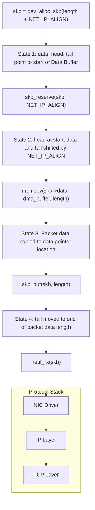

Assume skb points to an sk\_buff, skb->head, skb->data, skb->tail, and skb->end slide over the associated packet buffer as the packet traverses the protocol stack in either direction. skb->data, for example, points to the header of the protocol that is currently processing the packet. When a packet reaches the IP layer via the receive path, skb->data points to the IP header; when the packet passes on to TCP, however, skb->data moves to the start of the TCP header. And as the packet drives through various protocols adding or discarding header data, skb->len gets updated, too. sk\_buffs also contain pointers other than the four major ones previously mentioned. skb->nh, for example, remembers the position of the network protocol header irrespective of the current position of skb->data.

To illustrate how a NIC driver works with sk\_buffs, Figure 15.1 shows data transitions on the receive data path. For convenience of illustration, the figure simplistically assumes that the operations shown are executed in sequence. However, for operational efficiency in the real world, the first two steps (dev\_alloc\_skb() and

skb\_reserve()) are performed while initially preallocating a ring of receive buffers; the third step is accomplished by the NIC hardware as it directly DMA's the received packet into a preallocated sk\_buff; and the final two steps (skb\_put() and netif\_rx()) are executed from the receive interrupt handler.

To create an sk\_buff to hold a received packet, Figure 15.1 uses dev\_alloc\_skb(). This is an interrupt-safe routine that allocates memory for an sk\_buff and associates it with a packet payload buffer. dev\_kfree\_skb() accomplishes the reverse of dev\_alloc\_skb(). Figure 15.1 next calls skb\_reserve() to add a 2-byte padding between the start of the packet buffer and the beginning of the payload. This starts the IP header at a performance-friendly 16-byte boundary because the preceding Ethernet headers are 14 bytes long. The rest of the code statements in Figure 15.1 fill the payload buffer with the received packet and move skb->data, skb- >tail, and skb->len to reflect this operation.

There are more sk\_buff access routines relevant to some NIC drivers. skb\_clone(), for example, creates a copy of a supplied skb\_buff without copying the contents of the associated packet buffer. Look inside *net/core/skbuff.c* for the full list of sk\_buff library functions.

## **The Net Device Interface**

NIC drivers use a standard interface to interact with the TCP/IP stack. The net\_device structure, which is even more gigantic than the sk\_buff structure, defines this communication interface. To prepare ourselves for exploring the innards of the net\_device structure, let's first follow the steps traced by a NIC driver during initialization. Refer to init\_mycard() in Listing 15.1 as we move along:

The driver allocates a net\_device structure using alloc\_netdev(). More commonly, it uses a suitable wrapper around alloc\_netdev(). An Ethernet NIC driver, for example, calls alloc\_etherdev(). A WiFi driver (discussed in the next chapter) invokes alloc\_ieee80211(), and an IrDa driver calls upon alloc\_irdadev(). All these functions take the size of a private data area as argument and create this area in addition to the net\_device itself:

```
struct net_device *netdev;
struct priv_struct *mycard_priv;
netdev = alloc_etherdev(sizeof(struct
 priv_struct));
mycard_priv = netdev->priv; /* Private area created
 by alloc_etherdev() */
```

- Next, the driver populates various fields in the net\_device that it allocated and registers the populated net\_device with the network layer using register\_netdev(netdev).
- The driver reads the NIC's *Media Access Control* (MAC) address from an accompanying EEPROM and configures *Wake-On-LAN* (WOL) if required. Ethernet controllers usually have a companion nonvolatile EEPROM to hold information such as their MAC address and WOL pattern, as shown in Figure 15.2. The former is a unique 48-bit address that is globally assigned. The latter is a magic sequence; if found in received data, it rouses the NIC if it's in suspend mode.
- If the NIC needs on-card firmware to operate, the driver downloads it using request\_firmware(), as discussed in the section "Microcode Download" in Chapter 4, "Laying the Groundwork."

Let's now look at the methods that define the net\_device interface. We categorize them under six heads for simplicity. Wherever relevant, this section points you to the example NIC driver developed in Listing 15.1 of the section "Device Example: Ethernet NIC."

## **Activation**

The net\_device interface requires conventional methods such as open(), close(), and ioctl(). The kernel opens an interface when you activate it using a tool such as *ifconfig:*

#### **bash> ifconfig eth0 up**

open() sets up receive and transmit DMA descriptors and other driver data structures. It also registers the NIC's interrupt handler by calling request\_irq(). The net\_device structure is passed as the devid argument to request\_irq() so that the interrupt handler gets direct access to the associated net\_device. (See mycard\_open() and mycard\_interrupt() in Listing 15.1 to find out how this is done.)

The kernel calls close() when you pull down an active network interface. This accomplishes the reverse of open().

## **Data Transfer**

Data transfer methods form the crux of the net\_device interface. In the transmit path, the driver supplies a method called hard\_start\_xmit, which the protocol layer invokes to pass packets down for onward transmission:

```
netdev->hard_start_xmit = &mycard_xmit_frame; /* Transmit Method. See Listing 15.1 */
```

Until recently, network drivers didn't provide a net\_device method for collecting received data. Instead, they asynchronously interrupted the protocol layer with packet payload. This old interface has, however, given way to a *New API* (NAPI) that is a mixture of an interrupt-driven driver push and a poll-driver protocol pull. A NAPIaware driver thus needs to supply a poll() method and an associated weight that controls polling fairness:

```
netdev->poll = &mycard_poll; /* Poll Method. See Listing 15.1 */
netdev->weight = 64;
```

We elaborate on data-transfer methods in the section "Talking with Protocol Layers."

### **Watchdog**

The net\_device interface provides a hook to return an unresponsive NIC to operational state. If the protocol layer senses no transmissions for a predetermined amount of time, it assumes that the NIC has hung and invokes a driver-supplied recovery method to reset the card. The driver sets the watchdog timeout through netdev->watchdog\_timeo and registers the address of the recovery function via netdev->tx\_timeout:

```
netdev->tx_timeout = &mycard_timeout; /* Method to reset the NIC */
netdev->watchdog_timeo = 8*HZ; /* Reset if no response
 detected for 8 seconds */
```

Because the recovery method executes in timer-interrupt context, it usually schedules a task outside of that context to reset the NIC.

## **Statistics**

To enable user land to collect network statistics, the NIC driver populates a net\_device\_stats structure and

provides a get\_stats() method to retrieve it. Essentially the driver does the following:

Updates different types of statistics from relevant entry points: **1.**

```
#include <linux/netdevice.h>
struct net_device_stats mycard_stats;
static irqreturn_t
mycard_interrupt(int irq, void *dev_id)
{
 /* ... */
 if (packet_received_without_errors) {
 mycard_stats.rx_packets++; /* One more received
 packet */
 }
 /* ... */
}
```

Implements the get\_stats() method to retrieve the statistics: **2.**

```
static struct net_device_stats
*mycard_get_stats(struct net_device *netdev)
{
 /* House keeping */
 /* ... */
 return(&mycard_stats);
}
```

Supplies the retrieve method to higher layers: **3.**

```
netdev->get_stats = &mycard_get_stats;
/* ... */
register_netdev(netdev);
```

To collect statistics from your NIC, trigger invocation of mycard\_get\_stats() by executing an appropriate user mode command. For example, to find the number of packets received through the eth0 interface, do this:

**bash> cat /sys/class/net/eth0/statistics/rx\_packets 124664**

WiFi drivers need to track several parameters not relevant to conventional NICs, so they implement a statistic collection method called get\_wireless\_stats() in addition to get\_stats(). The mechanism for registering get\_wireless\_stats() for the benefit of WiFi-aware user space utilities is discussed in the section "WiFi" in the next chapter.

### **Configuration**

NIC drivers need to support user space tools that are responsible for setting and getting device parameters. *Ethtool* configures parameters for Ethernet NICs. To support ethtool, the underlying NIC driver does the following:

Populates an ethtool\_ops structure, defined in *include/linux/ethtool.h* with prescribed entry points: **1.**

```
#include <linux/ethtool.h>
/* Ethtool_ops methods */
struct ethtool_ops mycard_ethtool_ops = {
 /* ... */
 .get_eeprom = mycard_get_eeprom, /* Dump EEPROM
 contents */
 /* ... */
};
```

Implements the methods that are part of ethtool\_ops: **2.**

```
static int
mycard_get_eeprom(struct net_device *netdev,
 struct ethtool_eeprom *eeprom,
 uint8_t *bytes)
{
 /* Access the accompanying EEPROM and pull out data */
 /* ... */
}
```

Exports the address of its ethtool\_ops: **3.**

```
netdev->ethtool_ops = &mycard_ethtool_ops;
/* ... */
register_netdev(netdev);
```

After these are done, ethtool can operate over your Ethernet NIC. To dump EEPROM contents using ethtool, do this:

#### **bash> ethtool -e eth0**

```
Offset Values
------ ------
0x0000 00 0d 60 79 32 0a 00 0b ff ff 10 20 ff ff ff ff
...
```

Ethtool comes packaged with some distributions; but if you don't have it, download it from <http://sourceforge.net/projects/gkernel/>. Refer to the man page for its full capabilities.

There are more configuration-related methods that a NIC driver provides to higher layers. An example is the method to change the MTU size of the network interface. To support this, supply the relevant method to net\_device:

```
netdev->change_mtu = &mycard_change_mtu;
/* ... */
register_netdev(netdev);
```

The kernel invokes mycard\_change\_mtu() when you execute a suitable user command to alter the MTU of your card:

**bash> echo 1500 > /sys/class/net/eth0/mtu**

## **Bus Specific**

Next come bus-specific details such as the start address and size of the NIC's on-card memory. For a PCI NIC driver, this configuration will look like this:

```
netdev->mem_start = pci_resource_start(pdev, 0);
netdev->mem_end = netdev->mem_start + pci_resource_len(pdev, 0);
```

We discussed PCI resource functions in Chapter 10.

## **Talking with Protocol Layers**

In the preceding section, you discovered the driver methods demanded by the net\_device interface. Let's now take a closer look at how network data flows over this interface.

## **Receive Path**

You learned in Chapter 4 that softirqs are bottom half mechanisms used by performance-sensitive subsystems. NIC drivers use NET\_RX\_SOFTIRQ to offload the work of posting received data packets to protocol layers. The driver achieves this by calling netif\_rx() from its receive interrupt handler:

```
netif_rx(skb); /* struct sk_buff *skb */
```

NAPI, alluded to earlier, improves this conventional interrupt-driven receive algorithm to lower demands on CPU utilization. When network load is heavy, the system might get bogged down by the large number of interrupts that it takes. NAPI's strategy is to use a polled mode when network activity is heavy but fall back to interrupt mode when the traffic gets light. NAPI-aware drivers switch between interrupt and polled modes based on network load. This is done as follows:

In interrupt mode, the interrupt handler posts received packets to protocol layers by scheduling NET\_RX\_SOFTIRQ. It then disables NIC interrupts and switches to polled mode by adding the device to a poll list: **1.**

```
if (netif_rx_schedule_prep(netdev)) /* Housekeeping */ {
 /* Disable NIC interrupt */
 disable_nic_interrupt();
 /* Post the packet to the protocol layer and
 add the device to the poll list */
 __netif_rx_schedule(netdev);
}
```

- **2.** The driver provides a poll() method via its net\_device structure.
- In the polled mode, the driver's poll() method processes packets in the ingress queue. When the queue becomes empty, the driver re-enables interrupts and switches back to interrupt mode by calling netif\_rx\_complete(). **3.**

Look at mycard\_interrupt(), init\_mycard(), and mycard\_poll() in Listing 15.1 to see NAPI in action.

## **Transmit Path**

For data transmission, the interaction between protocol layers and the NIC driver is straightforward. The protocol stack invokes the driver's hard\_start\_xmit() method with the outgoing sk\_buff as argument. The driver gets the packet out of the door by DMA-ing packet data to the NIC. DMA and the management of related data structures for PCI NIC drivers were discussed in Chapter 10.

The driver programs the NIC to interrupt the processor after it finishes transmitting a predetermined number of packets. Only when a transmit-complete interrupt occurs signaling completion of a transmit operation can the

driver reclaim or free resources such as DMA descriptors, DMA buffers, and sk\_buffs associated with the transmitted packet.

## **Flow Control**

The driver conveys its readiness or reluctance to accept protocol data by, respectively, calling netif\_start\_queue() and netif\_stop\_queue().

During device open(), the NIC driver calls netif\_start\_queue() to ask the protocol layer to start adding transmit packets to the egress queue. During normal operation, however, the driver might require egress queuing to stop on occasion. Examples include the time window when the driver is replenishing data structures, or when it's closing the device. Throttling the downstream flow is accomplished by calling netif\_stop\_queue(). To request the networking stack to restart egress queuing, say when there are sufficient free buffers, the NIC driver invokes netif\_wake\_queue(). To check the current flow-control state, toss a call to netif\_queue\_stopped().

## **Buffer Management and Concurrency Control**

A high-performance NIC driver is a complex piece of software requiring intricate data structure management. As discussed in the section "Data Transfer" in Chapter 10, a NIC driver maintains linked lists (or "rings") of transmit and receive DMA descriptors, and implements free and in-use pools for buffer management. The driver typically implements a multipronged strategy to maintain buffer levels: preallocate a ring of DMA descriptors and associated sk\_buffs during device open, replenish free pools by allocating new memory if available buffers dip below a predetermined watermark, and reclaim used buffers into the free pool when the NIC generates transmit-complete and receive interrupts.

Each element in the NIC driver's receive ring, for example, is populated as follows:

```
/* Allocate an sk_buff and the associated data buffer.
 See Figure 15.1 */
skb = dev_alloc_skb(MAX_NIC_PACKET_SIZE);
/* Align the data pointer */
 skb_reserve(skb, NET_IP_ALIGN);
/* DMA map for NIC access. The following invocation assumes a PCI
 NIC. pdev is a pointer to the associated pci_dev structure */
pci_map_single(pdev, skb->data, MAX_NIC_PACKET_SIZE,
 PCI_DMA_FROMDEVICE);
/* Create a descriptor containing this sk_buff and add it
 to the RX ring */
/* ... */
```

During reception, the NIC directly DMA's data to an sk\_buff in the preceding preallocated ring and interrupts the processor. The receive interrupt handler, in turn, passes the packet to higher protocol layers. Developing ring data structures will make this discussion as well as the example driver in the next section loaded, so refer to the sources of the Intel PRO/1000 driver in the *drivers/net/e1000/* directory for a complete illustration.

Concurrent access protection goes hand-in-hand with managing such complex data structures in the face of multiple execution threads such as transmit, receive, transmit-complete interrupts, receive interrupts, and NAPI polling. We discussed several concurrency control techniques in Chapter 2, "A Peek Inside the Kernel."

## **Device Example: Ethernet NIC**

Now that you have the background, it's time to write a NIC driver by gluing the pieces discussed so far. Listing 15.1 implements a skeletal Ethernet NIC driver. It only implements the main net\_device methods. For help in developing the rest of the methods, refer to the *e1000* driver mentioned earlier. Listing 15.1 is generally independent of the underlying I/O bus but is slightly tilted to PCI. If you are writing a PCI NIC driver, you have to blend Listing 15.1 with the example PCI driver implemented in Chapter 10.

#### **Listing 15.1. An Ethernet NIC Driver**

```
#include <linux/netdevice.h>
#include <linux/etherdevice.h>
#include <linux/skbuff.h>
#include <linux/ethtool.h>
struct net_device_stats mycard_stats; /* Statistics */
/* Fill ethtool_ops methods from a suitable place in the driver */
struct ethtool_ops mycard_ethtool_ops = {
 /* ... */
 .get_eeprom = mycard_get_eeprom, /* Dump EEPROM contents */
 /* ... */
};
/* Initialize/probe the card. For PCI cards, this is invoked
 from (or is itself) the probe() method. In that case, the
 function is declared as:
 static struct net_device *init_mycard(struct pci_dev *pdev, const
 struct pci_device_id *id)
*/
static struct net_device *
init_mycard()
{
 struct net_device *netdev;
 struct priv_struct mycard_priv;
 /* ... */
 netdev = alloc_etherdev(sizeof(struct priv_struct));
 /* Common methods */
 netdev->open = &mycard_open;
 netdev->stop = &mycard_close;
 netdev->do_ioctl = &mycard_ioctl;
 /* Data transfer */
 netdev->hard_start_xmit = &mycard_xmit_frame; /* Transmit */
 netdev->poll = &mycard_poll; /* Receive - NAPI */
 netdev->weight = 64; /* Fairness */
 /* Watchdog */
 netdev->tx_timeout = &mycard_timeout; /* Recovery function */
 netdev->watchdog_timeo = 8*HZ; /* 8-second timeout */
 /* Statistics and configuration */
 netdev->get_stats = &mycard_get_stats; /* Statistics support */
 netdev->ethtool_ops = &mycard_ethtool_ops; /* Ethtool support */
```

```
 netdev->set_mac_address = &mycard_set_mac; /* Change MAC */
 netdev->change_mtu = &mycard_change_mtu; /* Alter MTU */
 strncpy(netdev->name, pci_name(pdev),
 sizeof(netdev->name) - 1); /* Name (for PCI) */
 /* Bus-specific parameters. For a PCI NIC, it looks as follows */
 netdev->mem_start = pci_resource_start(pdev, 0);
 netdev->mem_end = netdev->mem_start + pci_resource_len(pdev, 0);
 /* Register the interface */
 register_netdev(netdev);
 /* ... */
 /* Get MAC address from attached EEPROM */
 /* ... */
 /* Download microcode if needed */
 /* ... */
}
/* The interrupt handler */
static irqreturn_t
mycard_interrupt(int irq, void *dev_id)
{
 struct net_device *netdev = dev_id;
 struct sk_buff *skb;
 unsigned int length;
 /* ... */
 if (receive_interrupt) {
 /* We were interrupted due to packet reception. At this point,
 the NIC has already DMA'ed received data to an sk_buff that
 was pre-allocated and mapped during device open. Obtain the
 address of the sk_buff depending on your data structure
 design and assign it to 'skb'. 'length' is similarly obtained
 from the NIC by reading the descriptor used to DMA data from
 the card. Now, skb->data contains the receive data. */
 /* ... */
 /* For PCI cards, perform a pci_unmap_single() on the
 received buffer in order to allow the CPU to access it */
 /* ... */
 /* Allow the data go to the tail of the packet by moving
 skb->tail down by length bytes and increasing
 skb->len correspondingly */
 skb_put(skb, length)
 /* Pass the packet to the TCP/IP stack */
#if !defined (USE_NAPI) /* Do it the old way */
 netif_rx(skb);
#else /* Do it the NAPI way */
 if (netif_rx_schedule_prep(netdev))) {
 /* Disable NIC interrupt. Implementation not shown. */
 disable_nic_interrupt();
```

```
 /* Post the packet to the protocol layer and
 add the device to the poll list */
 __netif_rx_schedule(netdev);
 }
#endif
 } else if (tx_complete_interrupt) {
 /* Transmit Complete Interrupt */
 /* ... */
 /* Unmap and free transmit resources such as
 DMA descriptors and buffers. Free sk_buffs or
 reclaim them into a free pool */
 /* ... */
 }
}
/* Driver open */
static int
mycard_open(struct net_device *netdev)
{
 /* ... */
 /* Request irq */
 request_irq(irq, mycard_interrupt, IRQF_SHARED,
 netdev->name, dev);
 /* Fill transmit and receive rings */
 /* See the section,
 "Buffer Management and Concurrency Control" */
 /* ... */
 /* Provide free descriptor addresses to the card */
 /* ... */
 /* Convey your readiness to accept data from the
 networking stack */
 netif_start_queue(netdev);
 /* ... */
}
/* Driver close */
static int
mycard_close(struct net_device *netdev)
{
 /* ... */
 /* Ask the networking stack to stop sending down data */
 netif_stop_queue(netdev);
 /* ... */
}
/* Called when the device is unplugged or when the module is
 released. For PCI cards, this is invoked from (or is itself)
 the remove() method. In that case, the function is declared as:
 static void __devexit mycard_remove(struct pci_dev *pdev)
*/
static void __devexit
mycard_remove()
```

```
{
 struct net_device *netdev;
 /* ... */
 /* For a PCI card, obtain the associated netdev as follows,
 assuming that the probe() method performed a corresponding
 pci_set_drvdata(pdev, netdev) after allocating the netdev */
 netdev = pci_get_drvdata(pdev); /*
 unregister_netdev(netdev); /* Reverse of register_netdev() */
 /* ... */
 free_netdev(netdev); /* Reverse of alloc_netdev() */
 /* ... */
}
/* Suspend method. For PCI devices, this is part of
 the pci_driver structure discussed in Chapter 10 */
static int
mycard_suspend(struct pci_dev *pdev, pm_message_t state)
{
 /* ... */
 netif_device_detach(netdev);
 /* ... */
}
/* Resume method. For PCI devices, this is part of
 the pci_driver structure discussed in Chapter 10 */
static int
mycard_resume(struct pci_dev *pdev)
{
 /* ... */
 netif_device_attach(netdev);
 /* ... */
}
/* Get statistics */
static struct net_device_stats *
mycard_get_stats(struct net_device *netdev)
{
 /* House keeping */
 /* ... */
 return(&mycard_stats);
}
/* Dump EEPROM contents. This is an ethtool_ops operation */
static int
mycard_get_eeprom(struct net_device *netdev,
 struct ethtool_eeprom *eeprom, uint8_t *bytes)
{
 /* Read data from the accompanying EEPROM */
 /* ... */
}
```

```
/* Poll method */
static int
mycard_poll(struct net_device *netdev, int *budget)
{
 /* Post packets to the protocol layer using
 netif_receive_skb() */
 /* ... */
 if (no_more_ingress_packets()){
 /* Remove the device from the polled list */
 netif_rx_complete(netdev);
 /* Fall back to interrupt mode. Implementation not shown */
 enable_nic_interrupt();
 return 0;
 }
}
/* Transmit method */
static int
mycard_xmit_frame(struct sk_buff *skb, struct net_device *netdev)
{
 /* DMA the transmit packet from the associated sk_buff
 to card memory */
 /* ... */
 /* Manage buffers */
 /* ... */
}
```

#### Ethernet PHY

Ethernet controllers implement the MAC layer and have to be used in tandem with a Physical layer (PHY) transceiver. The former corresponds to the datalink layer of the Open Systems Interconnect (OSI) model, while the latter implements the physical layer. Several SoCs have built-in MACs that connect to external PHYs. The Media Independent Interface (MII) is a standard interface that connects a Fast Ethernet MAC to a PHY. The Ethernet device driver communicates with the PHY over MII to configure parameters such as PHY ID, line speed, duplex mode, and auto negotiation. Look at *include/linux/mii.h* for MII register definitions.

## **ISA Network Drivers**

Let's now take a peek at an ISA NIC. The CS8900 is a 10Mbps Ethernet controller chip from Crystal Semiconductor (now Cirrus Logic). This chip is commonly used to Ethernet-enable embedded devices, especially for debug purposes. Figure 15.2 shows a connection diagram surrounding a CS8900. Depending on the processor on your board and the chip-select used to drive the chip, the CS8900 registers map to different regions in the CPU's I/O address space. The device driver for this controller is an ISA-type driver (look at the section "ISA and MCA" in Chapter 20, "More Devices and Drivers") that probes candidate address regions to detect the controller's presence. The ISA probe method elicits the controller's I/O base address by looking for a signature such as the chip ID.

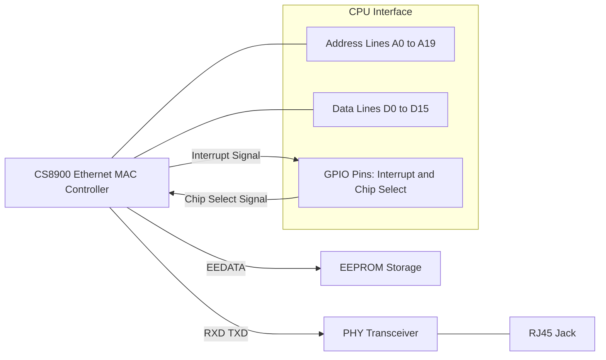

**Figure 15.2. Connection diagram surrounding a CS8900 Ethernet controller.**

Look at *drivers/net/cs89x0.c* for the source code of the CS8900 driver. cs89x0\_probe1() probes I/O address ranges to sense a CS8900. It then reads the current configuration of the chip. During this step, it accesses the CS8900's companion EEPROM and gleans the controller's MAC address. Like the driver in Listing 15.1, *cs89x0.c* is also built using netif\_\*() and skb\_\*() interface routines.

Some platforms that use the CS8900 allow DMA. ISA devices, unlike PCI cards, do not have DMA mastering capabilities, so they need an external DMA controller to transfer data.

## **Asynchronous Transfer Mode**

ATM is a high-speed, connection-oriented, back-bone technology. ATM guarantees high *quality of service* (QoS) and low latencies, so it's used for carrying audio and video traffic in addition to data.

Here's a quick summary of the ATM protocol: ATM communication takes place in units of 53-byte cells. Each cell begins with a 5-byte header that carries a *virtual path identifier* (VPI) and a *virtual circuit identifier* (VCI). ATM connections are either *switched virtual circuits* (SVCs) or *permanent virtual circuits* (PVCs). During SVC establishment, VPI/VCI pairs are configured in intervening ATM switches to route incoming cells to appropriate egress ports. For PVCs, the VPI/VCI pairs are permanently configured in the ATM switches and not set up and torn down for each connection.

There are three ways you can run TCP/IP over ATM, all of which are supported by Linux-ATM:

- Classical IP over ATM (CLIP) as specified in RFC[1] 1577. **1.**
  - [1] *Request For Comments* (RFC) are documents that specify networking standards.
- **2.** Emulating a LAN over an ATM network. This is called *LAN Emulation* (LANE).
- **3.** *Multi Protocol over ATM* (MPoA). This is a routing technique that improves performance.

Linux-ATM is an experimental collection of kernel drivers, user space utilities, and daemons. You will find ATM drivers and protocols under *drivers/atm/* and *net/atm/*, respectively, in the source tree. [http://linux](http://linux-)atm.sourceforge.net/ hosts user-space programs required to use Linux-ATM. Linux also incorporates an ATM socket API consisting of SVC sockets (AF\_ATMSVC) and PVC sockets (AF\_ATMPVC).

A protocol called *Multiprotocol Label Switching* (MPLS) is replacing ATM. The Linux-MPLS project, hosted at [http://mpls-linux.sourceforge.net/,](http://mpls-linux.sourceforge.net/) is not yet part of the mainline kernel.

We look at some ATM-related throughput issues in the next section.

## **Network Throughput**

Several tools are available to benchmark network performance. *Netperf*, available for free from www.netperf.org, can set up complex TCP/UDP connection scenarios. You can use scripts to control characteristics such as protocol parameters, number of simultaneous sessions, and size of data blocks. Benchmarking is accomplished by comparing the resulting throughput with the maximum practical bandwidth that the networking technology yields. For example, a 155Mbps ATM adapter produces a maximum IP throughput of 135Mbps, taking into account the ATM cell header size, overheads due to the *ATM Adaptation Layer* (AAL), and the occasional maintenance cells sent by the physical *Synchronous Optical Networking* (SONET) layer.

To obtain optimal throughput, you have to design your NIC driver for high performance. In addition, you need an in-depth understanding of the network protocol that your driver ferries.

## **Driver Performance**

Let's take a look at some driver design issues that can affect the horsepower of your NIC:

- Minimizing the number of instructions in the main data path is a key criterion while designing drivers for fast NICs. Consider a 1Gbps Ethernet adapter with 1MB of on-board memory. At line rate, the card memory can hold up to 8 milliseconds of received data. This directly translates to the maximum allowable instruction path length. Within this path length, incoming packets have to be reassembled, DMAed to memory, processed by the driver, protected from concurrent access, and delivered to higher layer protocols.
- During *programmed I/O* (PIO), data travels all the way from the device to the CPU, before it gets written to memory. Moreover, the CPU gets interrupted whenever the device needs to transfer data, and this contributes to latencies and context switch delays. DMAs do not suffer from these bottlenecks, but can turn out to be more expensive than PIOs if the data to be transferred is less than a threshold. This is because small DMAs have high relative overheads for building descriptors and flushing corresponding processor cache lines for data coherency. A performance-sensitive device driver might use PIO for small packets and DMA for larger ones, after experimentally determining the threshold.
- For PCI network cards having DMA mastering capability, you have to determine the optimal DMA burst size, which is the time for which the card controls the bus at one stretch. If the card bursts for a long duration, it may hog the bus and prevent the processor from keeping up with data DMA-ed previously. PCI drivers program the burst size via a register in the PCI configuration space. Normally the NIC's burst size is programmed to be the same as the cache line size of the processor, which is the number of bytes that the processor reads from system memory each time there is a cache miss. In practice, however, you might need to connect a bus analyzer to determine the beneficial burst duration because factors such as the presence of a split bus (multiple bus types like ISA and PCI) on your system can influence the optimal value.
- Many high-speed NICs offer the capability to offload the CPU-intensive computation of TCP checksums from the protocol stack. Some support DMA scatter-gather that we visited in Chapter 10. The driver needs to leverage these capabilities to achieve the maximum practical bandwidth that the underlying network yields.
- Sometimes, a driver optimization might create unexpected speed bumps if it's not sensitive to the implementation details of higher protocols. Consider an NFS-mounted filesystem on a computer equipped

with a high-speed NIC. Assume that the NIC driver takes only occasional transmit complete interrupts to minimize latencies, but that the NFS server implementation uses freeing of its transmit buffers as a flowcontrol mechanism. Because the driver frees NFS transmit buffers only during the sparsely generated transmit complete interrupts, file copies over NFS crawl, even as Internet downloads zip along yielding maximum throughput.

## **Protocol Performance**

Let's now dig into some protocol-specific characteristics that can boost or hurt network throughput:

- TCP window size can impact throughput. The window size provides a measure of the amount of data that can be transmitted before receiving an acknowledgment. For fast NICs, a small window size might result in TCP sitting idle, waiting for acknowledgments of packets already transmitted. Even with a large window size, a small number of lost TCP packets can affect performance because lost frames can use up the window at line speeds. In the case of UDP, the window size is not relevant because it does not support acknowledgments. However, a small packet loss can spiral into a big rate drop due to the absence of flowcontrol mechanisms.
- As the block size of application data written to TCP sockets increases, the number of buffers copied from user space to kernel space decreases. This lowers the demand on processor utilization and is good for performance. If the block size crosses the MTU corresponding to the network protocol, however, processor cycles get wasted on fragmentation. The desirable block size is thus the outgoing interface MTU, or the largest packet that can be sent without fragmentation through an IP path if Path MTU discovery mechanisms are in operation. While running IP over ATM, for example, because the ATM adaptation layer has a 64K MTU, there is virtually no upper bound on block size. (RFC 1626 defaults this to 9180.) If you are running IP over ATM LANE, however, the block size should mirror the MTU size of the respective LAN technology being emulated. It should thus be 1500 for standard Ethernet, 8000 for jumbo Gigabit Ethernet, and 18K for 16Mbps Token Ring.

## **Looking at the Sources**

The *drivers/net/* directory contains sources of various NIC drivers. Look inside *drivers/net/e1000/* for an example NIC driver. You will find network protocol implementations in the *net/* directory. sk\_buff access routines are in *net/core/skbuff.c*. Library routines that aid the implementation of your driver's net\_device interface stay in *net/core/dev.c* and *include/linux/netdevice.h*.

### TUN/TAP Driver

The TUN/TAP device driver *drivers/net/tun.c*, used for protocol tunneling, is an example of a combination of a virtual network driver and a pseudo char driver. The pseudo char device (*/dev/net/tun*) acts as the underlying hardware for the virtual network interface (*tunX*), so instead of transmitting frames to a physical network, the TUN network driver sends it to an application that is reading from */dev/net/tun*. Similarly, instead of receiving data from a physical network, the TUN driver accepts it from an application writing to */dev/net/tun*. Look at *Documentation/networking/tuntap.txt* for more explanations and usage scenarios. Since both network and char portions of the driver do not have to deal with the complexities of hardware interaction, it serves as a very readable, albeit simplistic, driver example.

Files under */sys/class/net/* let you operate on NIC driver parameters. Use the nodes under */proc/sys/net/* to configure protocol-specific variables. To set the maximum TCP transmit window size, for example, echo the desired value to */proc/sys/net/core/wmem\_max*. The */proc/net/* directory has a collection of system-specific network information. Examine */proc/net/dev* for statistics on all NICs on your system and look at */proc/net/arp* for the ARP table.

Table 15.1 contains the main data structures used in this chapter and their location in the source tree. Table 15.2 lists the main kernel programming interfaces that you used in this chapter along with the location of their definitions.

|                  | Table 15.1. Summary of Data Structures |                                                                                                          |
|------------------|----------------------------------------|----------------------------------------------------------------------------------------------------------|
| Data Structure   | Location                               | Description                                                                                              |
| sk_buff          | include/linux/skbuff.h                 | sk_buffs provide efficient buffer<br>handling and flow-control mechanisms to<br>Linux networking layers. |
| net_device       |                                        | include/linux/netdevice.h Interface between NIC drivers and the<br>TCP/IP stack.                         |
| net_device_stats |                                        | include/linux/netdevice.h Statistics pertaining to a network device.                                     |
| ethtool_ops      | include/linux/ethtool.h                | Entry points to tie a NIC driver to the<br>ethtool utility.                                              |
|                  |                                        | Table 15.2. Summary of Kernel Programming Interfaces                                                     |
| Kernel Interface | Location                               | Description                                                                                              |
| alloc_netdev()   | net/core/dev.c                         | Allocates a net_device                                                                                   |

| Kernel Interface                                         | Location                                               | Description                                                                                             |
|----------------------------------------------------------|--------------------------------------------------------|---------------------------------------------------------------------------------------------------------|
| alloc_etherdev()<br>alloc_ieee80211()<br>alloc_irdadev() | net/ethernet/eth.c<br>net/ieee80211/ieee80211_module.c | Wrappers to alloc_netdev()                                                                              |
|                                                          | net/irda/irda_device.c                                 |                                                                                                         |
| free_netdev()                                            | net/core/dev.c                                         | Reverse of alloc_netdev()                                                                               |
| register_netdev()                                        | net/core/dev.c                                         | Registers a net_device                                                                                  |
| unregister_netdev()                                      | net/core/dev.c                                         | Unregisters a net_device                                                                                |
| dev_alloc_skb()                                          | include/linux/skbuff.h                                 | Allocates memory for an sk_buff and<br>associates it with a packet payload buffer                       |
| dev_kfree_skb()                                          | include/linux/skbuff.h<br>net/core/skbuff.c            | Reverse of dev_alloc_skb()                                                                              |
| skb_reserve()                                            | include/linux/skbuff.h                                 | Adds a padding between the start of a<br>packet buffer and the beginning of payload                     |
| skb_clone()                                              | net/core/skbuff.c                                      | Creates a copy of a supplied sk_buff<br>without copying the contents of the<br>associated packet buffer |
| skb_put()                                                | include/linux/skbuff.h                                 | Allows packet data to go to the tail of the<br>packet                                                   |
| netif_rx()                                               | net/core/dev.c                                         | Passes a network packet to the TCP/IP<br>stack                                                          |
| netif_rx_schedule_prep()<br>netif_rx_schedule()          | include/linux/netdevice.h<br>net/core/dev.c            | Passes a network packet to the TCP/IP<br>stack (NAPI)                                                   |
| netif_receive_skb()                                      | net/core/dev.c                                         | Posts packet to the protocol layer from the<br>poll() method (NAPI)                                     |
| netif_rx_complete()                                      | include/linux/netdevice.h                              | Removes a device from polled list (NAPI)                                                                |
| netif_device_detach()                                    | net/core/dev.c                                         | Detaches the device (commonly called<br>during power suspend)                                           |
| netif_device_attach()                                    | net/core/dev.c                                         | Attaches the device (commonly called<br>during power resume)                                            |
| netif_start_queue()                                      | include/linux/netdevice.h                              | Conveys readiness to accept data from the<br>networking stack                                           |
| netif_stop_queue()                                       | include/linux/netdevice.h                              | Asks the networking stack to stop sending<br>down data                                                  |
| netif_wake_queue()                                       | include/linux/netdevice.h                              | Restarts egress queuing                                                                                 |
| netif_queue_stopped()                                    | include/linux/netdevice.h                              | Checks flow-control state                                                                               |

## **Chapter 16. Linux Without Wires**

## **In This Chapter**

| Bluetooth |
|-----------|
|           |

Infrared

WiFi

Cellular Networking

Current Trends

Several small-footprint devices are powered by the dual combination of a wireless technology and Linux. Bluetooth, Infrared, WiFi, and cellular networking are established wireless technologies that have healthy Linux support. Bluetooth eliminates cables, injects intelligence into dumb devices, and opens a flood gate of novel applications. Infrared is a low-cost, low-range, medium-rate, wireless technology that can network laptops, connect handhelds, or dispatch a document to a printer. WiFi is the wireless equivalent of an Ethernet LAN. Cellular networking using *General Packet Radio Service* (GPRS) or *code division multiple access* (CDMA) keeps you Internet-enabled on the go, as long as your wanderings are confined to service provider coverage area.

Because these wireless technologies are widely available in popular form factors, you are likely to end up, sooner rather than later, with a card that does not work on Linux right away. Before you start working on enabling an unsupported card, you need to know in detail how the kernel implements support for the corresponding technology. In this chapter, let's learn how Linux enables Bluetooth, Infrared, WiFi, and cellular networking.

### Wireless Trade-Offs

Bluetooth, Infrared, WiFi, and GPRS serve different niches. The trade-offs can be gauged in terms of speed, range, cost, power consumption, ease of hardware/software co-design, and PCB real estate usage.

Table 16.1 gives you an idea of these parameters, but you will have to contend with several variables when you measure the numbers on the ground. The speeds listed are the theoretical maximums. The power consumptions indicated are relative, but in the real world they also depend on the vendor's implementation techniques, the technology subclass, and the operating mode. Cost economics depend on the chip form factor and whether the chip contains built-in microcode that implements some of the protocol layers. The board real estate consumed depends not just on the chipset, but also on transceivers, antennae, and whether you build using *off-the-shelf* (OTS) modules.

```
Bluetooth
720Kbps
10m to 100m
**
**
**
**
Infrared Data
4Mbps (Fast IR)
Up to 1 meter within a 30-degree cone
*
*
*
*
WiFi
54Mbps
150 meters (indoors)
****
***
***
***
GPRS
170Kbps
Service provider coverage
***
****
*
***
```

Note: The last four columns give relative measurement (depending on the number of \* symbols) rather than absolute values.

#### **Table 16.1. Wireless Trade-Offs**

| Speed | Range | Power | Cost | Co-Design<br>Effort | Board<br>Real |
|-------|-------|-------|------|---------------------|---------------|
|       |       |       |      |                     | Estate        |

Some sections in this chapter focus more on "system programming" than device drivers. This is because the corresponding regions of the protocol stack (for example, Bluetooth RFCOMM and Infrared networking) are already present in the kernel and you are more likely to perform associated user mode customizations than develop protocol content or device drivers.

## **Bluetooth**

*Bluetooth* is a short-range cable-replacement technology that carries both data and voice. It supports speeds of up to 723Kbps (asymmetric) and 432Kbps (symmetric). *Class 3* Bluetooth devices have a range of 10 meters, and *Class 1* transmitters can communicate up to 100 meters.

Bluetooth is designed to do away with wires that constrict and clutter your environment. It can, for example, turn your wristwatch into a front-end for a bulky *Global Positioning System* (GPS) hidden inside your backpack. Or it can, for instance, let you navigate a presentation via your handheld. Again, Bluetooth can be the answer if you want your laptop to be a hub that can Internet-enable your Bluetooth-aware MP3 player. If your wristwatch, handheld, laptop, or MP3 player is running Linux, knowledge of the innards of the Linux Bluetooth stack will help you extract maximum mileage out of your device.

As per the Bluetooth specification, the protocol stack consists of the layers shown in Figure 16.1 . The radio, link controller, and link manager roughly correspond to the physical, data link, and network layers in the *Open Systems Interconnect* (OSI) standard reference model. The *Host Control Interface* (HCI) is the protocol that carries data to/from the hardware and, hence, maps to the transport layer. The Bluetooth *Logical Link Control and Adaptation Protocol* (L2CAP) falls in the session layer. Serial port emulation using *Radio Frequency Communication* (RFCOMM), Ethernet emulation using *Bluetooth Network Encapsulation Protocol* (BNEP), and the *Service Discovery Protocol* (SDP) are part of the feature-rich presentation layer. At the top of the stack reside various application environments called *profiles.* The radio, link controller, and link manager are usually part of Bluetooth hardware, so operating system support starts at the HCI layer.

```text
+------------------+        +---------------------------+
|     OSI Model    |        |      Bluetooth Stack      |
+------------------+        +---------------------------+
| Application      | <----> | Profiles                  |
| Presentation     | <----> | RFCOMM / BNEP / SDP       |
| Session          | <----> | L2CAP                     |
| Transport        | <----> | Host Control Interface    |
| Network          | <----> | Link Manager              |
| Data Link        | <----> | Link Layer                |
| Physical         | <----> | Radio                     |
+------------------+        +---------------------------+

                     Linux BlueZ
                (Bluetooth Chipset)
```

**Figure 16.1. The Bluetooth stack.**

A common method of interfacing Bluetooth hardware with a microcontroller is by connecting the chipset's data lines to the controller's UART pins. Figure 13.4 of Chapter 13 , "Audio Drivers," shows a Bluetooth chip on an MP3 player communicating with the processor via a UART. USB is another oft-used vehicle for communicating with Bluetooth chipsets. Figure 11.2 of Chapter 11 , "Universal Serial Bus," shows a Bluetooth chip on an embedded device interfacing with the processor over USB. Irrespective of whether you use UART or USB (we will look at both kinds of devices later), the packet format used to transport Bluetooth data is HCI.

## **BlueZ**

The BlueZ Bluetooth implementation is part of the mainline kernel and is the official Linux Bluetooth stack.

Figure 16.2 shows how BlueZ maps Bluetooth protocol layers to kernel modules, kernel threads, user space daemons, configuration tools, utilities, and libraries. The main BlueZ components are explained here:

- *bluetooth.ko* contains the core BlueZ infrastructure. All other BlueZ modules utilize its services. It's also responsible for exporting the Bluetooth family of sockets (AF\_BLUETOOTH ) to user space and for populating related sysfs entries. **1.**
- For transporting Bluetooth HCI packets over UART, the corresponding BlueZ HCI implementation is *hci\_uart.ko.* For USB transport, it's *hci\_usb.ko* . **2.**
- *l2cap.ko* implements the L2CAP adaptation layer that is responsible for segmentation and reassembly. It also multiplexes between different higher-layer protocols. **3.**
- To run TCP/IP applications over Bluetooth, you have to emulate Ethernet ports over L2CAP using BNEP. This is accomplished by *bnep.ko.* To service BNEP connections, BlueZ spawns a kernel thread called *kbnepd* . **4.**
- To run serial port applications such as terminal emulators over Bluetooth, you need to emulate serial ports over L2CAP. This is accomplished by *rfcomm.ko.* RFCOMM also functions as the pillar that supports networking over PPP. To service incoming RFCOMM connections, *rfcomm.ko* spawns a kernel thread called *krfcommd.* To set up and maintain connections to individual RFCOMM channels on target devices, use the *rfcomm* utility. **5.**
- The *Human Interface Devices* (HID) layer is implemented via *hidp.ko* . The user mode daemon, *hidd* , lets BlueZ handle input devices such as Bluetooth mice. **6.**
- **7.** Audio is handled via the *Synchronous Connection Oriented* (SCO) layer implemented by *sco.ko* .

**Figure 16.2. Bluetooth protocol layers mapped to BlueZ kernel modules.**

[View full size image]

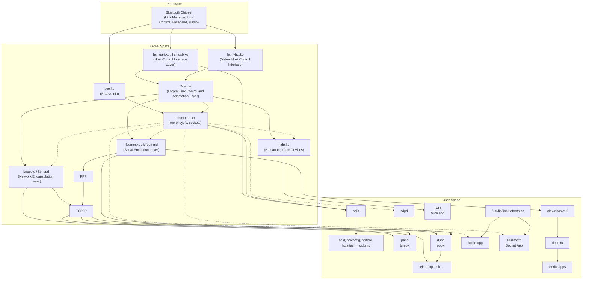

Let's now trace the kernel code flow for two example Bluetooth devices: a *Compact Flash* (CF) card and a USB adapter.

## **Device Example: CF Card**

The Sharp Bluetooth Compact Flash card is built using a Silicon Wave chipset and uses a serial transport to carry HCI packets. There are three different ways by which HCI packets can be transported serially:

H4 (UART), which is used by the Sharp CF card. H4 is the standard method to transfer Bluetooth data over UARTs as defined by the Bluetooth specification. Look at *drivers/bluetooth/hci\_h4.c* for the BlueZ implementation. **1.**

- **2.** H3 (RS232). Devices using H3 are hard to find. BlueZ has no support for H3.
- *BlueCore Serial Protocol* (BCSP), which is a proprietary protocol from *Cambridge Silicon Radio* (CSR) that supports error checking and retransmission. BCSP is used on non-USB devices based on CSR BlueCore chips including PCMCIA and CF cards. The BlueZ BCSP implementation lives in *drivers/ bluetooth/hci\_bcsp.c* . **3.**

The read data path for the Sharp Bluetooth card is shown in Figure 16.3 . The first point of contact between the card and the kernel is at the UART driver. As you saw in Figure 9.5 of Chapter 9 , "PCMCIA and Compact Flash," the serial Card Services driver, *drivers/serial/serial\_cs.c* , allows the rest of the operating system to see the Sharp card as if it were a serial device. The serial driver passes on the received HCI packets to BlueZ. BlueZ implements HCI processing in the form of a kernel line discipline. As you learned in Chapter 6 , "Serial Drivers," line disciplines reside above the serial driver and shape its behavior. The HCI line discipline invokes associated protocol routines (H4 in this case) for assistance in data processing. From then on, L2CAP and higher BlueZ layers take charge.

**Figure 16.3. Read data path from a Sharp Bluetooth CF card.**

[View full size image]

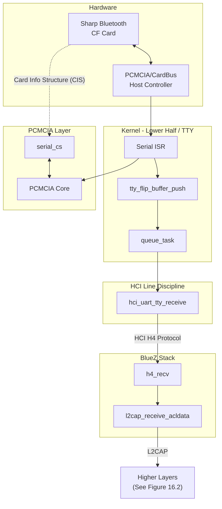

## **Device Example: USB Adapter**

Let's now look at a device that uses USB to transport HCI packets. The Belkin Bluetooth USB adapter is one such gadget. In this case, the Linux USB layer (*drivers/usb/\** ), the HCI USB transport driver (*drivers/bluetooth/hci\_usb.c* ), and the BlueZ protocol stack (*net/bluetooth/\** ) are the main players that get the data rolling. Let's see how these three kernel layers interact.

As you learned in Chapter 11 , USB devices exchange data using one or more of four pipes. For Bluetooth USB devices, each pipe is responsible for carrying a particular type of data:

- **1.** Control pipes are used to transport HCI commands.
- **2.** Interrupt pipes are responsible for carrying HCI events.
- **3.** Bulk pipes transfer *asynchronous connectionless* (ACL) Bluetooth data.
- **4.** Isochronous pipes carry SCO audio data.

You also saw in Chapter 11 that when a USB device is plugged into a system, the host controller driver enumerates it using a control pipe and assigns endpoint addresses between 1 and 127. The configuration descriptor read by the USB subsystem during enumeration contains information about the device, such as its class , subclass , and protocol . The Bluetooth specification defines the (class , subclass , protocol) codes of Bluetooth USB devices as (0xE, 0x01, 0x01) . The HCI USB transport driver (*hci\_usb* ) registers these values with the USB core during initialization. When the Belkin USB adapter is plugged in, the USB core reads the (class , subclass , protocol) information from the device configuration descriptor. Because this information matches the values registered by *hci\_usb* , this driver gets attached to the Belkin USB adapter. *hci\_usb* reads Bluetooth data from the four USB pipes described previously and passes it on to the BlueZ protocol stack. Linux applications now run seamlessly over this device, as shown in Figure 16.2 .

## **RFCOMM**

RFCOMM emulates serial ports over Bluetooth. Applications such as terminal emulators and protocols such as PPP can run unchanged over the virtual serial interfaces created by RFCOMM.

#### **Device Example: Pill Dispenser**

To take an example, assume that you have a Bluetooth-aware pill dispenser. When you pop a pill out of the dispenser, it sends a message over a Bluetooth RFCOMM channel. A Linux cell phone, such as the one shown in Figure 6.5 of Chapter 6 , reads this alert using a simple application that establishes an RFCOMM connection to the pill dispenser. The phone then dispatches this information to the health-care provider's server on the Internet via its GPRS interface.

A skeletal application on the Linux cell phone that reads data arriving from the pill dispenser using the BlueZ socket API is shown in Listing 16.1 . The listing assumes that you are familiar with the basics of socket programming.

#### **Listing 16.1. Communicating with a Pill Dispenser over RFCOMM**

```
#include <sys/socket.h>
#include <bluetooth/rfcomm.h> /* For struct sockaddr_rc */
void
sense_dispenser()
{
 int pillfd;
 struct sockaddr_rc pill_rfcomm;
 char buffer[1024];
 /* ... */
 /* Create a Bluetooth RFCOMM socket */
 if ((pillfd = socket(PF_BLUETOOTH, SOCK_STREAM, BTPROTO_RFCOMM))
 < 0) {
```

```
 printf("Bad Bluetooth RFCOMM socket");
 exit(1);
 }
 /* Connect to the pill dispenser */
 pill_rfcomm.rc_family = AF_BLUETOOTH;
 pill_rfcomm.rc_bdaddr = PILL_DISPENSER_BLUETOOTH_ADDR;
 pill_rfcomm.rc_channel = PILL_DISPENSER_RFCOMM_CHANNEL;
 if (connect(pillfd, (struct sockaddr *)&pill_rfcomm,
 sizeof(pill_rfcomm))) {
 printf("Cannot connect to Pill Dispenser\n");
 exit(1);
 }
 printf("Connection established to Pill Dispenser\n");
 /* Poll until data is ready */
 select(pillfd, &fds, NULL, NULL, &timeout);
 /* Data is available on this RFCOMM channel */
 if (FD_ISSET(pillfd, fds)) {
 /* Read pill removal alerts from the dispenser */
 read(pillfd, buffer, sizeof(buffer));
 /* Take suitable action; e.g., send a message to the health
 care provider's server on the Internet via the GPRS
 interface */
 /* ... */
 }
 /* ... */
}
```

## **Networking**

Trace down the code path from the *telnet/ftp/ssh* box in Figure 16.2 to see how networking is architected over BlueZ Bluetooth. As you can see, there are two different ways to network over Bluetooth:

- **1.** By running TCP/IP directly over BNEP. The resulting network is called a *personal area network* (PAN).
- **2.** By running TCP/IP over PPP over RFCOMM. This is called *dialup networking* (DUN).

The kernel implementation of Bluetooth networking is unlikely to interest the device driver writer and is not explored. Table 16.2 shows the steps required to network two laptops using PAN, however. Networking with DUN resembles this and is not examined. The laptops are respectively Bluetooth-enabled using the Sharp CF card and the Belkin USB adapter discussed earlier. You can slip the CF card into the first laptop's PCMCIA slot using a passive CF-to-PCMCIA adapter. Look at Figure 16.2 in tandem with Table 16.2 to understand the mappings to corresponding BlueZ components. Table 16.2 uses **bash-sharp>** and **bash-belkin>** as the respective shell prompts of the two laptops.

Start the HCI and service discovery daemons: **1.**

```
bash-sharp> hcid
bash-sharp> sdpd
```

Because this device possesses a UART interface, you have to attach the BlueZ stack to the appropriate serial port. In this case, assume that *serial\_cs* has allotted */dev/ttyS3* to the card:

```
bash-sharp> hciattach ttyS3 any
```

Verify that the HCI interface is up: **2.**

```
bash-sharp> hciconfig -a
 hci0: Type: UART
 BD Address: 08:00:1F:10:3B:13 ACL MTU: 60:20 SCO MTU: 31:1
 UP RUNNING PSCAN ISCAN
 ...
Manufacturer: Silicon Wave (11)
```

Verify that basic BlueZ modules are loaded: **3.**

#### **bash-sharp> lsmod**

```
 Module Size Used by
 hci_uart 16728 3
 l2cap 26144 2
 bluetooth 47684 6 hci_uart,l2cap
 ...
```

Insert the BlueZ module that implements network encapsulation: **4.**

```
bash-sharp> modprobe bnep
```

Listen for incoming PAN connections:[1] **5.**

```
bash-sharp> pand –s
```

On the laptop with the Belkin USB Bluetooth adapter

- Start daemons, such as hcid and sdpd, and insert necessary kernel modules, such as *bluetooth.ko* and *l2cap.ko* . **1.**
- Because this is a USB device, you don't need to invoke hciattach, but make sure that the *hci\_usb.ko* module is inserted. **2.**
- Verify that the HCI interface is up: **3.**

UP RUNNING PSCAN ISCAN

```
```

```
bash-belkin> hciconfig -a
 hci0: Type: USB BD Address: 00:02:72:B0:33:AB ACL MTU: 192:8 SCO MTU: 64:8
```

```
 ...
 Manufacturer: Cambridge Silicon Radio (10)
```

Search and discover devices in the neighborhood: **4.**

```
bash-belkin> hcitool -i hci0 scan --flush
 Scanning....
 08:00:1F:10:3B:13 bash-sharp
```

Establish a PAN with the first laptop. You can get its Bluetooth address (08:00:1F:10:3B:13) from its hciconfig output: **5.**

```
bash-belkin> pand -c 08:00:1F:10:3B:13
```

If you now look at the ifconfig output on the two laptops, you will find that a new interface named bnep0 has made an appearance at both ends. Assign IP addresses to both interfaces and get ready to telnet and FTP!

**Table 16.2. Networking Two Laptops Using Bluetooth PAN**

> [1] A useful command-line option to pand is --persist , which automatically attempts to reconnect when a connection drops. Dig into the man pages for more invocation options.

## **Human Interface Devices**

Look at sections "USB and Bluetooth Keyboards " and "USB and Bluetooth Mice " in Chapter 7 , "Input Drivers," for a discussion on Bluetooth human interface devices.

## **Audio**

Let's take the example of an HBH-30 Sony Ericsson Bluetooth headset to understand Bluetooth SCO audio. Before the headset can start communicating with a Linux device, the Bluetooth link layer on the latter has to discover the former. For this, put the headset in *discover* mode by pressing the button earmarked for device discovery. In addition, you have to configure BlueZ with the headset's *personal identification number* (PIN) by adding it to */etc/bluetooth/pin.* An application on the Linux device that uses BlueZ SCO APIs can now send audio data to the headset. The audio data should be in a format that the headset understands. The HBH-30 uses the A-law PCM (*pulse code modulation* ) format. There are public domain utilities for converting audio into various PCM formats.

Bluetooth chipsets commonly have PCM interface pins in addition to the HCI transport interface. If a device supports, for instance, both Bluetooth and *Global System for Mobile Communication* (GSM), the PCM lines from the GSM chipset may be directly wired to the Bluetooth chip's PCM audio lines. You might then have to configure the Bluetooth chip to receive and send SCO audio packets over its HCI interface instead of its PCM interface.

## **Debugging**

There are two BlueZ tools useful for debugging:

*hcidump* taps HCI packets flowing back and forth, and parses them into human-readable form. Here's an example dump while a device inquiry is in progress: **1.**

#### **bash> hcidump -i hci0**

```
HCIDump - HCI packet analyzer ver 1.11
device: hci0 snap_len: 1028 filter: 0xffffffff
 HCI Command: Inquiry (0x01|0x0001) plen 5
 HCI Event: Command Status (0x0f) plen 4
 HCI Event: Inquiry Result (0x02) plen 15
 ...
 HCI Event: Inquiry Complete (0x01) plen 1 < HCI Command:
 Remote Name Request (0x01|0x0019) plen 10
 ...
```

The virtual HCI driver (*hci\_vhci.ko* ), as shown in Figure 16.2 , emulates a Bluetooth interface if you do not have actual hardware. **2.**

## **Looking at the Sources**

Look inside *drivers/bluetooth/* for BlueZ low-level drivers. Explore *net/bluetooth/* for insights into the BlueZ protocol implementation.

Bluetooth applications fall under different *profiles* based on how they behave. For example, the cordless telephony profile specifies how a Bluetooth device can implement a cordless phone. We discussed profiles for PAN and serial access, but there are many more profiles out there such as fax profile, *General Object Exchange Profile* (GOEP) and *SIM Access Profile* (SAP). The *bluez-utils* package, downloadable from www.bluez.org , provides support for several Bluetooth profiles.

The official Bluetooth website is www.bluetooth.org . It contains Bluetooth specification documents and information about the *Bluetooth Special Interest Group* (SIG).

*Affix* is an alternate Bluetooth stack on Linux. You can download Affix from http://affix.sourceforge.net/ .

Table 15.1. Summary of Data Structures
========================================

Data Structure      Location                        Description
--------------      --------                        -----------
sk_buff             include/linux/skbuff.h          sk_buffs provide efficient buffer handling and
                                                    flow-control mechanisms to Linux networking layers.

net_device          include/linux/netdevice.h       Interface between NIC drivers and the TCP/IP stack.

net_device_stats    include/linux/netdevice.h       Statistics pertaining to a network device.

ethtool_ops         include/linux/ethtool.h         Entry points to tie a NIC driver to the ethtool utility.

Table 15.2. Summary of Kernel Programming Interfaces
======================================================

Kernel Interface            Location                            Description
----------------            --------                            -----------
alloc_netdev()              net/core/dev.c                      Allocates a net_device

alloc_etherdev()            net/ethernet/eth.c                  Wrappers to alloc_netdev()
alloc_ieee80211()           net/ieee80211/ieee80211_module.c
alloc_irdadev()             net/irda/irda_device.c

free_netdev()               net/core/dev.c                      Reverse of alloc_netdev()

register_netdev()           net/core/dev.c                      Registers a net_device

unregister_netdev()         net/core/dev.c                      Unregisters a net_device

dev_alloc_skb()             include/linux/skbuff.h              Allocates memory for an sk_buff and
                                                                associates it with a packet payload buffer

dev_kfree_skb()             include/linux/skbuff.h              Reverse of dev_alloc_skb()
                            net/core/skbuff.c

skb_reserve()               include/linux/skbuff.h              Adds a padding between the start of a
                                                                packet buffer and the beginning of payload

skb_clone()                 net/core/skbuff.c                   Creates a copy of a supplied sk_buff
                                                                without copying the contents of the
                                                                associated packet buffer

skb_put()                   include/linux/skbuff.h              Allows packet data to go to the tail of
                                                                the packet

netif_rx()                  net/core/dev.c                      Passes a network packet to the TCP/IP stack

netif_rx_schedule_prep()    include/linux/netdevice.h           Passes a network packet to the TCP/IP
__netif_rx_schedule()       net/core/dev.c                      stack (NAPI)

netif_receive_skb()         net/core/dev.c                      Posts packet to the protocol layer from
                                                                the poll() method (NAPI)

netif_rx_complete()         include/linux/netdevice.h           Removes a device from polled list (NAPI)

netif_device_detach()       net/core/dev.c                      Detaches the device (commonly called
                                                                during power suspend)

netif_device_attach()       net/core/dev.c                      Attaches the device (commonly called
                                                                during power resume)

netif_start_queue()         include/linux/netdevice.h           Conveys readiness to accept data from
                                                                the networking stack

netif_stop_queue()          include/linux/netdevice.h           Asks the networking stack to stop
                                                                sending down data

netif_wake_queue()          include/linux/netdevice.h           Restarts egress queuing

netif_queue_stopped()       include/linux/netdevice.h           Checks flow-control state

#
## **In This Chapter**

| Bluetooth |
|-----------|
|           |

Infrared

WiFi

Cellular Networking

Current Trends

Several small-footprint devices are powered by the dual combination of a wireless technology and Linux. Bluetooth, Infrared, WiFi, and cellular networking are established wireless technologies that have healthy Linux support. Bluetooth eliminates cables, injects intelligence into dumb devices, and opens a flood gate of novel applications. Infrared is a low-cost, low-range, medium-rate, wireless technology that can network laptops, connect handhelds, or dispatch a document to a printer. WiFi is the wireless equivalent of an Ethernet LAN. Cellular networking using *General Packet Radio Service* (GPRS) or *code division multiple access* (CDMA) keeps you Internet-enabled on the go, as long as your wanderings are confined to service provider coverage area.

Because these wireless technologies are widely available in popular form factors, you are likely to end up, sooner rather than later, with a card that does not work on Linux right away. Before you start working on enabling an unsupported card, you need to know in detail how the kernel implements support for the corresponding technology. In this chapter, let's learn how Linux enables Bluetooth, Infrared, WiFi, and cellular networking.

### Wireless Trade-Offs

Bluetooth, Infrared, WiFi, and GPRS serve different niches. The trade-offs can be gauged in terms of speed, range, cost, power consumption, ease of hardware/software co-design, and PCB real estate usage.

Table 16.1 gives you an idea of these parameters, but you will have to contend with several variables when you measure the numbers on the ground. The speeds listed are the theoretical maximums. The power consumptions indicated are relative, but in the real world they also depend on the vendor's implementation techniques, the technology subclass, and the operating mode. Cost economics depend on the chip form factor and whether the chip contains built-in microcode that implements some of the protocol layers. The board real estate consumed depends not just on the chipset, but also on transceivers, antennae, and whether you build using *off-the-shelf* (OTS) modules.

```
Bluetooth
720Kbps
10m to 100m
**
**
**
**
Infrared Data
4Mbps (Fast IR)
Up to 1 meter within a 30-degree cone
*
*
*
*
WiFi
54Mbps
150 meters (indoors)
****
***
***
***
GPRS
170Kbps
Service provider coverage
***
****
*
***
```

Note: The last four columns give relative measurement (depending on the number of \* symbols) rather than absolute values.

#### **Table 16.1. Wireless Trade-Offs**

| Speed | Range | Power | Cost | Co-Design<br>Effort | Board<br>Real |
|-------|-------|-------|------|---------------------|---------------|
|       |       |       |      |                     | Estate        |

Some sections in this chapter focus more on "system programming" than device drivers. This is because the corresponding regions of the protocol stack (for example, Bluetooth RFCOMM and Infrared networking) are already present in the kernel and you are more likely to perform associated user mode customizations than develop protocol content or device drivers.

## **Bluetooth**

*Bluetooth* is a short-range cable-replacement technology that carries both data and voice. It supports speeds of up to 723Kbps (asymmetric) and 432Kbps (symmetric). *Class 3* Bluetooth devices have a range of 10 meters, and *Class 1* transmitters can communicate up to 100 meters.

Bluetooth is designed to do away with wires that constrict and clutter your environment. It can, for example, turn your wristwatch into a front-end for a bulky *Global Positioning System* (GPS) hidden inside your backpack. Or it can, for instance, let you navigate a presentation via your handheld. Again, Bluetooth can be the answer if you want your laptop to be a hub that can Internet-enable your Bluetooth-aware MP3 player. If your wristwatch, handheld, laptop, or MP3 player is running Linux, knowledge of the innards of the Linux Bluetooth stack will help you extract maximum mileage out of your device.

As per the Bluetooth specification, the protocol stack consists of the layers shown in Figure 16.1 . The radio, link controller, and link manager roughly correspond to the physical, data link, and network layers in the *Open Systems Interconnect* (OSI) standard reference model. The *Host Control Interface* (HCI) is the protocol that carries data to/from the hardware and, hence, maps to the transport layer. The Bluetooth *Logical Link Control and Adaptation Protocol* (L2CAP) falls in the session layer. Serial port emulation using *Radio Frequency Communication* (RFCOMM), Ethernet emulation using *Bluetooth Network Encapsulation Protocol* (BNEP), and the *Service Discovery Protocol* (SDP) are part of the feature-rich presentation layer. At the top of the stack reside various application environments called *profiles.* The radio, link controller, and link manager are usually part of Bluetooth hardware, so operating system support starts at the HCI layer.

**Figure 16.1. The Bluetooth stack.**

A common method of interfacing Bluetooth hardware with a microcontroller is by connecting the chipset's data lines to the controller's UART pins. Figure 13.4 of Chapter 13 , "Audio Drivers," shows a Bluetooth chip on an MP3 player communicating with the processor via a UART. USB is another oft-used vehicle for communicating with Bluetooth chipsets. Figure 11.2 of Chapter 11 , "Universal Serial Bus," shows a Bluetooth chip on an embedded device interfacing with the processor over USB. Irrespective of whether you use UART or USB (we will look at both kinds of devices later), the packet format used to transport Bluetooth data is HCI.

## **BlueZ**

The BlueZ Bluetooth implementation is part of the mainline kernel and is the official Linux Bluetooth stack.

Figure 16.2 shows how BlueZ maps Bluetooth protocol layers to kernel modules, kernel threads, user space daemons, configuration tools, utilities, and libraries. The main BlueZ components are explained here:

- *bluetooth.ko* contains the core BlueZ infrastructure. All other BlueZ modules utilize its services. It's also responsible for exporting the Bluetooth family of sockets (AF\_BLUETOOTH ) to user space and for populating related sysfs entries. **1.**
- For transporting Bluetooth HCI packets over UART, the corresponding BlueZ HCI implementation is *hci\_uart.ko.* For USB transport, it's *hci\_usb.ko* . **2.**
- *l2cap.ko* implements the L2CAP adaptation layer that is responsible for segmentation and reassembly. It also multiplexes between different higher-layer protocols. **3.**
- To run TCP/IP applications over Bluetooth, you have to emulate Ethernet ports over L2CAP using BNEP. This is accomplished by *bnep.ko.* To service BNEP connections, BlueZ spawns a kernel thread called *kbnepd* . **4.**
- To run serial port applications such as terminal emulators over Bluetooth, you need to emulate serial ports over L2CAP. This is accomplished by *rfcomm.ko.* RFCOMM also functions as the pillar that supports networking over PPP. To service incoming RFCOMM connections, *rfcomm.ko* spawns a kernel thread called *krfcommd.* To set up and maintain connections to individual RFCOMM channels on target devices, use the *rfcomm* utility. **5.**
- The *Human Interface Devices* (HID) layer is implemented via *hidp.ko* . The user mode daemon, *hidd* , lets BlueZ handle input devices such as Bluetooth mice. **6.**
- **7.** Audio is handled via the *Synchronous Connection Oriented* (SCO) layer implemented by *sco.ko* .

**Figure 16.2. Bluetooth protocol layers mapped to BlueZ kernel modules.**

[View full size image]


Let's now trace the kernel code flow for two example Bluetooth devices: a *Compact Flash* (CF) card and a USB adapter.

## **Device Example: CF Card**

The Sharp Bluetooth Compact Flash card is built using a Silicon Wave chipset and uses a serial transport to carry HCI packets. There are three different ways by which HCI packets can be transported serially:

H4 (UART), which is used by the Sharp CF card. H4 is the standard method to transfer Bluetooth data over UARTs as defined by the Bluetooth specification. Look at *drivers/bluetooth/hci\_h4.c* for the BlueZ implementation. **1.**

- **2.** H3 (RS232). Devices using H3 are hard to find. BlueZ has no support for H3.
- *BlueCore Serial Protocol* (BCSP), which is a proprietary protocol from *Cambridge Silicon Radio* (CSR) that supports error checking and retransmission. BCSP is used on non-USB devices based on CSR BlueCore chips including PCMCIA and CF cards. The BlueZ BCSP implementation lives in *drivers/ bluetooth/hci\_bcsp.c* . **3.**

The read data path for the Sharp Bluetooth card is shown in Figure 16.3 . The first point of contact between the card and the kernel is at the UART driver. As you saw in Figure 9.5 of Chapter 9 , "PCMCIA and Compact Flash," the serial Card Services driver, *drivers/serial/serial\_cs.c* , allows the rest of the operating system to see the Sharp card as if it were a serial device. The serial driver passes on the received HCI packets to BlueZ. BlueZ implements HCI processing in the form of a kernel line discipline. As you learned in Chapter 6 , "Serial Drivers," line disciplines reside above the serial driver and shape its behavior. The HCI line discipline invokes associated protocol routines (H4 in this case) for assistance in data processing. From then on, L2CAP and higher BlueZ layers take charge.

**Figure 16.3. Read data path from a Sharp Bluetooth CF card.**

[View full size image]


## **Device Example: USB Adapter**

Let's now look at a device that uses USB to transport HCI packets. The Belkin Bluetooth USB adapter is one such gadget. In this case, the Linux USB layer (*drivers/usb/\** ), the HCI USB transport driver (*drivers/bluetooth/hci\_usb.c* ), and the BlueZ protocol stack (*net/bluetooth/\** ) are the main players that get the data rolling. Let's see how these three kernel layers interact.

As you learned in Chapter 11 , USB devices exchange data using one or more of four pipes. For Bluetooth USB devices, each pipe is responsible for carrying a particular type of data:

- **1.** Control pipes are used to transport HCI commands.
- **2.** Interrupt pipes are responsible for carrying HCI events.
- **3.** Bulk pipes transfer *asynchronous connectionless* (ACL) Bluetooth data.
- **4.** Isochronous pipes carry SCO audio data.

You also saw in Chapter 11 that when a USB device is plugged into a system, the host controller driver enumerates it using a control pipe and assigns endpoint addresses between 1 and 127. The configuration descriptor read by the USB subsystem during enumeration contains information about the device, such as its class , subclass , and protocol . The Bluetooth specification defines the (class , subclass , protocol) codes of Bluetooth USB devices as (0xE, 0x01, 0x01) . The HCI USB transport driver (*hci\_usb* ) registers these values with the USB core during initialization. When the Belkin USB adapter is plugged in, the USB core reads the (class , subclass , protocol) information from the device configuration descriptor. Because this information matches the values registered by *hci\_usb* , this driver gets attached to the Belkin USB adapter. *hci\_usb* reads Bluetooth data from the four USB pipes described previously and passes it on to the BlueZ protocol stack. Linux applications now run seamlessly over this device, as shown in Figure 16.2 .

## **RFCOMM**

RFCOMM emulates serial ports over Bluetooth. Applications such as terminal emulators and protocols such as PPP can run unchanged over the virtual serial interfaces created by RFCOMM.

#### **Device Example: Pill Dispenser**

To take an example, assume that you have a Bluetooth-aware pill dispenser. When you pop a pill out of the dispenser, it sends a message over a Bluetooth RFCOMM channel. A Linux cell phone, such as the one shown in Figure 6.5 of Chapter 6 , reads this alert using a simple application that establishes an RFCOMM connection to the pill dispenser. The phone then dispatches this information to the health-care provider's server on the Internet via its GPRS interface.

A skeletal application on the Linux cell phone that reads data arriving from the pill dispenser using the BlueZ socket API is shown in Listing 16.1 . The listing assumes that you are familiar with the basics of socket programming.

#### **Listing 16.1. Communicating with a Pill Dispenser over RFCOMM**

```
#include <sys/socket.h>
#include <bluetooth/rfcomm.h> /* For struct sockaddr_rc */
void
sense_dispenser()
{
 int pillfd;
 struct sockaddr_rc pill_rfcomm;
 char buffer[1024];
 /* ... */
 /* Create a Bluetooth RFCOMM socket */
 if ((pillfd = socket(PF_BLUETOOTH, SOCK_STREAM, BTPROTO_RFCOMM))
 < 0) {
```

```
 printf("Bad Bluetooth RFCOMM socket");
 exit(1);
 }
 /* Connect to the pill dispenser */
 pill_rfcomm.rc_family = AF_BLUETOOTH;
 pill_rfcomm.rc_bdaddr = PILL_DISPENSER_BLUETOOTH_ADDR;
 pill_rfcomm.rc_channel = PILL_DISPENSER_RFCOMM_CHANNEL;
 if (connect(pillfd, (struct sockaddr *)&pill_rfcomm,
 sizeof(pill_rfcomm))) {
 printf("Cannot connect to Pill Dispenser\n");
 exit(1);
 }
 printf("Connection established to Pill Dispenser\n");
 /* Poll until data is ready */
 select(pillfd, &fds, NULL, NULL, &timeout);
 /* Data is available on this RFCOMM channel */
 if (FD_ISSET(pillfd, fds)) {
 /* Read pill removal alerts from the dispenser */
 read(pillfd, buffer, sizeof(buffer));
 /* Take suitable action; e.g., send a message to the health
 care provider's server on the Internet via the GPRS
 interface */
 /* ... */
 }
 /* ... */
}
```

## **Networking**

Trace down the code path from the *telnet/ftp/ssh* box in Figure 16.2 to see how networking is architected over BlueZ Bluetooth. As you can see, there are two different ways to network over Bluetooth:

- **1.** By running TCP/IP directly over BNEP. The resulting network is called a *personal area network* (PAN).
- **2.** By running TCP/IP over PPP over RFCOMM. This is called *dialup networking* (DUN).

The kernel implementation of Bluetooth networking is unlikely to interest the device driver writer and is not explored. Table 16.2 shows the steps required to network two laptops using PAN, however. Networking with DUN resembles this and is not examined. The laptops are respectively Bluetooth-enabled using the Sharp CF card and the Belkin USB adapter discussed earlier. You can slip the CF card into the first laptop's PCMCIA slot using a passive CF-to-PCMCIA adapter. Look at Figure 16.2 in tandem with Table 16.2 to understand the mappings to corresponding BlueZ components. Table 16.2 uses **bash-sharp>** and **bash-belkin>** as the respective shell prompts of the two laptops.

Start the HCI and service discovery daemons: **1.**

```
bash-sharp> hcid
bash-sharp> sdpd
```

Because this device possesses a UART interface, you have to attach the BlueZ stack to the appropriate serial port. In this case, assume that *serial\_cs* has allotted */dev/ttyS3* to the card:

```
bash-sharp> hciattach ttyS3 any
```

Verify that the HCI interface is up: **2.**

```
bash-sharp> hciconfig -a
 hci0: Type: UART
 BD Address: 08:00:1F:10:3B:13 ACL MTU: 60:20 SCO MTU: 31:1
 UP RUNNING PSCAN ISCAN
 ...
Manufacturer: Silicon Wave (11)
```

Verify that basic BlueZ modules are loaded: **3.**

#### **bash-sharp> lsmod**

```
 Module Size Used by
 hci_uart 16728 3
 l2cap 26144 2
 bluetooth 47684 6 hci_uart,l2cap
 ...
```

Insert the BlueZ module that implements network encapsulation: **4.**

```
bash-sharp> modprobe bnep
```

Listen for incoming PAN connections:[1] **5.**

```
bash-sharp> pand –s
```

On the laptop with the Belkin USB Bluetooth adapter

- Start daemons, such as hcid and sdpd, and insert necessary kernel modules, such as *bluetooth.ko* and *l2cap.ko* . **1.**
- Because this is a USB device, you don't need to invoke hciattach, but make sure that the *hci\_usb.ko* module is inserted. **2.**
- Verify that the HCI interface is up: **3.**

```
```

```
bash-belkin> hciconfig -a
 hci0: Type: USB BD Address: 00:02:72:B0:33:AB ACL MTU: 192:8 SCO MTU: 64:8
 UP RUNNING PSCAN ISCAN
```

```
 ...
 Manufacturer: Cambridge Silicon Radio (10)
```

Search and discover devices in the neighborhood: **4.**

```
bash-belkin> hcitool -i hci0 scan --flush
 Scanning....
 08:00:1F:10:3B:13 bash-sharp
```

Establish a PAN with the first laptop. You can get its Bluetooth address (08:00:1F:10:3B:13) from its hciconfig output: **5.**

```
bash-belkin> pand -c 08:00:1F:10:3B:13
```

If you now look at the ifconfig output on the two laptops, you will find that a new interface named bnep0 has made an appearance at both ends. Assign IP addresses to both interfaces and get ready to telnet and FTP!

**Table 16.2. Networking Two Laptops Using Bluetooth PAN**

> [1] A useful command-line option to pand is --persist , which automatically attempts to reconnect when a connection drops. Dig into the man pages for more invocation options.

## **Human Interface Devices**

Look at sections "USB and Bluetooth Keyboards " and "USB and Bluetooth Mice " in Chapter 7 , "Input Drivers," for a discussion on Bluetooth human interface devices.

## **Audio**

Let's take the example of an HBH-30 Sony Ericsson Bluetooth headset to understand Bluetooth SCO audio. Before the headset can start communicating with a Linux device, the Bluetooth link layer on the latter has to discover the former. For this, put the headset in *discover* mode by pressing the button earmarked for device discovery. In addition, you have to configure BlueZ with the headset's *personal identification number* (PIN) by adding it to */etc/bluetooth/pin.* An application on the Linux device that uses BlueZ SCO APIs can now send audio data to the headset. The audio data should be in a format that the headset understands. The HBH-30 uses the A-law PCM (*pulse code modulation* ) format. There are public domain utilities for converting audio into various PCM formats.

Bluetooth chipsets commonly have PCM interface pins in addition to the HCI transport interface. If a device supports, for instance, both Bluetooth and *Global System for Mobile Communication* (GSM), the PCM lines from the GSM chipset may be directly wired to the Bluetooth chip's PCM audio lines. You might then have to configure the Bluetooth chip to receive and send SCO audio packets over its HCI interface instead of its PCM interface.

## **Debugging**

There are two BlueZ tools useful for debugging:

*hcidump* taps HCI packets flowing back and forth, and parses them into human-readable form. Here's an example dump while a device inquiry is in progress: **1.**

#### **bash> hcidump -i hci0**

```
HCIDump - HCI packet analyzer ver 1.11
device: hci0 snap_len: 1028 filter: 0xffffffff
 HCI Command: Inquiry (0x01|0x0001) plen 5
 HCI Event: Command Status (0x0f) plen 4
 HCI Event: Inquiry Result (0x02) plen 15
 ...
 HCI Event: Inquiry Complete (0x01) plen 1 < HCI Command:
 Remote Name Request (0x01|0x0019) plen 10
 ...
```

The virtual HCI driver (*hci\_vhci.ko* ), as shown in Figure 16.2 , emulates a Bluetooth interface if you do not have actual hardware. **2.**

## **Looking at the Sources**

Look inside *drivers/bluetooth/* for BlueZ low-level drivers. Explore *net/bluetooth/* for insights into the BlueZ protocol implementation.

Bluetooth applications fall under different *profiles* based on how they behave. For example, the cordless telephony profile specifies how a Bluetooth device can implement a cordless phone. We discussed profiles for PAN and serial access, but there are many more profiles out there such as fax profile, *General Object Exchange Profile* (GOEP) and *SIM Access Profile* (SAP). The *bluez-utils* package, downloadable from www.bluez.org , provides support for several Bluetooth profiles.

The official Bluetooth website is www.bluetooth.org . It contains Bluetooth specification documents and information about the *Bluetooth Special Interest Group* (SIG).

*Affix* is an alternate Bluetooth stack on Linux. You can download Affix from http://affix.sourceforge.net/ .

## **Infrared**

*Infrared* (IR) rays are optical waves lying between the visible and the microwave regions of the electromagnetic spectrum. One use of IR is in point-to-point data communication. Using IR, you can exchange visiting cards between PDAs, network two laptops, or dispatch a document to a printer. IR has a range of up to 1 meter within a 30-degree cone, spreading from –15 to +15 degrees.

There are two popular flavors of IR communication: *Standard IR* (SIR), which supports speeds of up to 115.20 Kbaud; and *Fast IR* (FIR), which has a bandwidth of 4Mbps.

Figure 16.4 shows IR connection on a laptop. UART1 in the Super I/O chipset is IR-enabled, so an IR transceiver is directly connected to it. Laptops having no IR support in their Super I/O chip may rely on an external IR dongle (see the section "Device Example: IR Dongle") similar to the one connected to UART0. Figure 16.5 shows IR connection on an embedded SoC having a built-in IR dongle connected to a system UART.

```text
System Architecture Diagram
============================

        [Processor]
             |
        [North Bridge]
             |
        [South Bridge]
             |
        [Super I/O]
           /        \
       UART0        UART1
         |             |
      [RS232]    [IR Transceiver]
         |          (SIR/FIR)
      [IR Dongle]
```

**Figure 16.4. IrDA on a laptop.**

**Figure 16.5. IrDA on an embedded device (for example, EP7211).**

```text
Embedded SoC Architecture
==========================

+-----------------------------------------------+
|                 Embedded SoC                  |
|                                               |
|   [CPU Core]                                  |
|       |                                       |
|       |--- Peripheral Bus                     |
|       |                                       |
|   [UART] ---RX---> [Infrared Controller] ---RXIR---> [Optical IR]
|             <--TX---   (SIR Dongle)    <---TXIR---   [Transceiver]
|                                               |
+-----------------------------------------------+
```

Linux supports IR communication on two planes:

- Intelligent data-transfer via protocols specified by the *Infrared Data Association* (IrDA). This is implemented by the Linux-IrDA project. **1.**
- Controlling applications via a remote control. This is implemented by the *Linux Infrared Remote Control* (LIRC) project. **2.**

This section primarily explores Linux-IrDA but takes a quick look at LIRC before wrapping up.

## **Linux-IrDA**

The Linux-IrDA project (<http://irda.sourceforge.net/>) brings IrDA capabilities to the kernel. To get an idea of how Linux-IrDA components relate vis-à-vis the IrDA stack and possible hardware configurations, let's crisscross through Figure 16.6:

- Device drivers constitute the bottom layer. SIR chipsets that are 16550-compatible can reuse the native Linux serial driver after shaping its behavior using the IrDA line discipline, IrTTY. An alternative to this combo is the IrPort driver. FIR chipsets have their own special drivers. **1.**
- Next comes the core protocol stack. This consists of the *IR Link Access Protocol* (IrLAP), *IR Link Management Protocol* (IrLMP), *Tiny Transport Protocol* (TinyTP), and the *IrDA socket* (IrSock) interface. IrLAP provides a reliable transport as well as the state machine to discover neighboring devices. IrLMP is a multiplexer over IrLAP. TinyTP provides segmentation, reassembly, and flow control. IrSock offers a socket interface over IrLMP and TinyTP. **2.**

- Higher regions of the stack marry IrDA to data-transfer applications. IrLAN and IrNET enable networking, while IrComm allows serial communication. **3.**
- You also need the applications that ultimately make or break the technology. An example is *openobex* [\(http://openobex.sourceforge.net/\)](http://openobex.sourceforge.net/), which implements the *OBject EXchange* (OBEX) protocol used to exchange objects such as documents and visiting cards. To configure Linux-IrDA, you need the *irda-utils* package that comes bundled with many distributions. This provides tools such as *irattach*, *irdadump*, and *irdaping*. **4.**

**Figure 16.6. Communicating over Linux-IrDA.**

[View full size image]

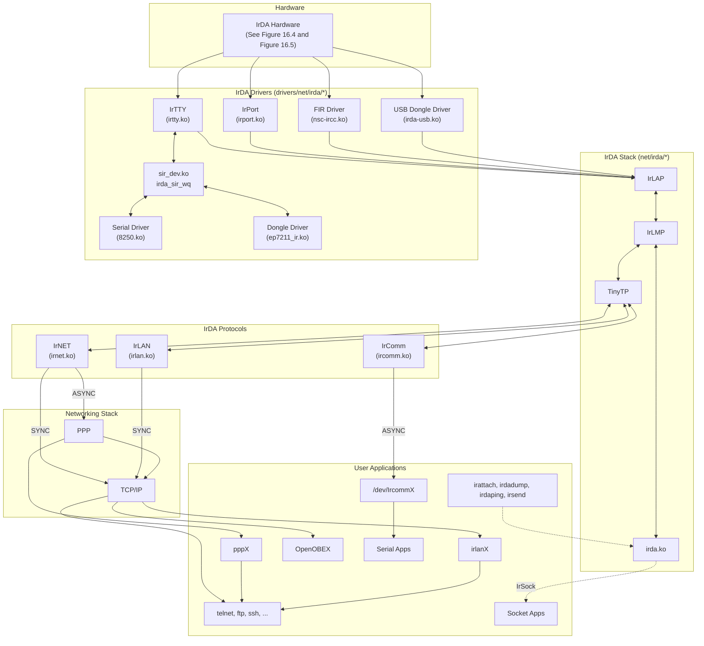

### **Device Example: Super I/O Chip**

To get a first taste of Linux-IrDA, let's get two laptops talking to each other over IR. Each laptop is IR-enabled via National Semiconductor's NSC PC87382 Super I/O chip.[2] UART1 in Figure 16.4 shows the connection scenario. The PC87382 chip can work in both SIR and FIR modes. We will look at each in turn.

SIR chips offer a UART interface to the host computer. For communicating in SIR mode, attach the associated UART port (*/dev/ttyS1* in this example) of each laptop to the IrDA stack:

<sup>[2]</sup> Super I/O chipsets typically support several peripherals besides IrDA, such as serial ports, parallel ports, *Musical Instrument Digital Interface* (MIDI), and floppy controllers.

#### **bash> irattach /dev/ttyS1 -s**

Verify that IrDA kernel modules (*irda.ko*, *sir\_dev.ko*, and *irtty\_sir.ko*) are loaded and that the *irda\_sir\_wq* kernel thread is running. The irda0 interface should also have made an appearance in the ifconfig output. The -s option to irattach triggers a search for IR activity in the neighborhood. If you slide the laptops such that their IR transceivers lie within the range cone, they will be able to spot each other:

```
bash> cat /proc/net/irda/discovery
nickname: localhost, hint: 0x4400, saddr: 0x55529048, daddr: 0x8fefb350
```

The other laptop makes a similar announcement, but with the source and destination addresses (saddr and daddr) reversed. You may set the desired communication speed using stty on ttyS1. To set the baud rate to 19200, do this:

```
bash> stty speed 19200 < /dev/ttyS1
```

The easiest way to cull IR activity from the air is by using the debug tool, *irdadump*. Here's a sample dump obtained during the preceding connection establishment, which shows the negotiated parameters:

```
```

```
bash> irdadump -i irda0
...
22:05:07.831424 snrm:cmd ca=fe pf=1 6fb7ff33 > 2c0ce8b6 new-ca=40
LAP QoS: Baud Rate=19200bps Max Turn Time=500ms Data Size=2048B Window Size=7 Add
BOFS=0 Min Turn Time=5000us Link Disc=12s (32)
22:05:07.987043 ua:rsp ca=40 pf=1 6fb7ff33 < 2c0ce8b6
LAP QoS: Baud Rate=19200bps Max Turn Time=500ms Data Size=2048B Window Size=7 Add
BOFS=0 Min Turn Time=5000us Link Disc=12s (31)
...
```

You can also obtain debug information out of the IrDA stack by controlling the verbosity level in */proc/sys/net/irda/debug*.

To set the laptops in FIR mode, dissociate ttyS1 from the native serial driver and instead attach it to the NSC FIR driver, *nsc-ircc.ko*:

```
bash> setserial /dev/ttyS1 uart none
bash> modprobe nsc-ircc dongle_id=0x09
bash> irattach irda0 -s
```

dongle\_id depends on your IR hardware and can be found from your hardware documentation. As you did for SIR, take a look at */proc/net/irda/discovery* to see whether things are okay thus far. Sometimes, FIR communication hangs at higher speeds. If irdadump shows a communication freeze, either put on your kernel hacking hat and fix the code, or try lowering the negotiated speed by tweaking */proc/sys/net/irda/max\_baud\_rate*.

Note that unlike the Bluetooth physical layer that can establish one-to-many connections, IR can support only a single connection per physical device at a time.

## **Device Example: IR Dongle**

*Dongles* are IR devices that plug into serial or USB ports. Some microcontrollers (such as Cirrus Logic's EP7211 shown in Figure 16.5) that have on-chip IR controllers wired to their UARTs are also considered dongles.

Dongle drivers are a set of control methods responsible for operations such as changing the communication speed. They have four entry points: open(), reset(), change\_speed(), and close(). These entry points are defined as part of a dongle\_driver structure and are invoked from the context of the IrDA kernel thread, *irda\_sir\_wq*. Dongle driver methods are allowed to block because they are invoked from process context with no locks held. The IrDA core offers three helper functions to dongle drivers: sirdev\_raw\_write() and sirdev\_raw\_read() to exchange control data with the associated UART, and sirdev\_set\_dtr\_rts() to wiggle modem control lines connected to the UART.

Because you're probably more likely to add kernel support for dongles than modify other parts of Linux-IrDA, let's implement an example dongle driver. Assume that you're enabling a yet-unsupported simple serial IR dongle that communicates only at 19200 or 57600 baud. Assume also that when the user wants to toggle the baud rate between these two values, you have to hold the UART's *Request-to-Send* (RTS) pin low for 50 microseconds and pull it back high for 25 microseconds. Listing 16.2 implements a dongle driver for this device.

**Listing 16.2. An Example Dongle Driver**

```
#include <linux/delay.h>
#include <net/irda/irda.h>
#include "sir-dev.h" /* Assume that this sample driver lives in
 drivers/net/irda/ */
/* Open Method. This is invoked when an irattach is issued on the
 associated UART */
static int
mydongle_open(struct sir_dev *dev)
{
 struct qos_info *qos = &dev->qos;
 /* Power the dongle by setting modem control lines, DTR/RTS. */
 sirdev_set_dtr_rts(dev, TRUE, TRUE);
 /* Speeds that mydongle can accept */
 qos->baud_rate.bits &= IR_19200|IR_57600;
 irda_qos_bits_to_value(qos); /* Set QoS */
 return 0;
}
/* Change baud rate */
static int
mydongle_change_speed(struct sir_dev *dev, unsigned speed)
{
 if ((speed == 19200) || (speed = 57600)){
 /* Toggle the speed by pulsing RTS low
 for 50 us and back high for 25 us */
 sirdev_set_dtr_rts(dev, TRUE, FALSE);
 udelay(50);
 sirdev_set_dtr_rts(dev, TRUE, TRUE);
 udelay(25);
 return 0;
 } else {
 return -EINVAL;
```

```
 }
}
/* Reset */
static int
mydongle_reset(struct sir_dev *dev)
{
 /* Reset the dongle as per the spec, for example,
 by pulling DTR low for 50 us */
 sirdev_set_dtr_rts(dev, FALSE, TRUE);
 udelay(50);
 sirdev_set_dtr_rts(dev, TRUE, TRUE);
 dev->speed = 19200; /* Reset speed is 19200 baud */
 return 0;
}
/* Close */
static int
mydongle_close(struct sir_dev *dev)
{
 /* Power off the dongle as per the spec,
 for example, by pulling DTR and RTS low.. */
 sirdev_set_dtr_rts(dev, FALSE, FALSE);
 return 0;
}
/* Dongle Driver Methods */
static struct dongle_driver mydongle = {
 .owner = THIS_MODULE,
 .type = MY_DONGLE, /* Add this to the enumeration
 in include/linux/irda.h */
 .open = mydongle_open, /* Open */
 .reset = mydongle_reset, /* Reset */
 .set_speed = mydongle_change_speed, /* Change Speed */
 .close = mydongle_close, /* Close */
};
/* Initialize */
static int __init
mydongle_init(void)
{
 /* Register the entry points */
 return irda_register_dongle(&mydongle);
}
/* Release */
static void __exit
mydongle_cleanup(void)
{
 /* Unregister entry points */
 irda_unregister_dongle(&mydongle);
}
module_init(mydongle_init);
module_exit(mydongle_cleanup);
```

For real-life examples, look at *drivers/net/irda/tekram.c* and *drivers/net/irda/ep7211\_ir.c*.

Now that you have the physical layer running, let's venture to look at IrDA protocols.

## **IrComm**

IrComm emulates serial ports. Applications such as terminal emulators and protocols such as PPP can run unchanged over the virtual serial interfaces created by IrComm. IrComm is implemented by two related modules, *ircomm.ko* and *ircomm\_tty.ko*. The former provides core protocol support, while the latter creates and manages the emulated serial port nodes */dev/ircommX*.

### **Networking**

There are three ways to get TCP/IP applications running over IrDA:

- **1.** Asynchronous PPP over IrComm
- **2.** Synchronous PPP over IrNET
- **3.** Ethernet emulation with IrLAN

Networking over IrComm is equivalent to running asynchronous PPP over a serial port, so there is nothing out of the ordinary in this scenario.

Asynchronous PPP needs to mark the start and end of frames using techniques such as byte stuffing, but if PPP is running over data links such as Ethernet, it need not be burdened with the overhead of a framing protocol. This is called synchronous PPP and is used to configure networking over IrNET.[3] Passage through the PPP layer provides features such as on-demand IP address configuration, compression, and authentication.

[3] For a scholarly discussion on networking over IrNET, read www.hpl.hp.com/personal/Jean\_Tourrilhes/Papers/IrNET.Demand.html.

To start IrNET, insert *irnet.ko*. This also creates the character device node */dev/irnet*, which is a control channel over which you can attach the PPP daemon:

**bash> pppd /dev/irnet 9600 noauth a.b.c.d:a.b.c.e**

This yields the pppX network interfaces at either ends with the respective IP addresses set to a.b.c.d and a.b.c.e. The interfaces can now beam TCP/IP packets.

IrLAN provides raw Ethernet emulation over IrDA. To network your laptops using IrLAN, do the following at both ends:

- Insert *irlan.ko*. This creates the network interface, irlanX, where X is the assigned interface number.
- Configure the irlanX interfaces. To set the IP address, do this:

#### **bash> ifconfig irlanX a.b.c.d**

Or automate it by adding the following line to */etc/sysconfig/network-scripts/-ifcfg-irlan0*: [4]

[4] The location of this file is distribution-dependent.

```
DEVICE=irlanX IPADDR=a.b.c.d
```

You can now telnet between the laptops over the irlanX interfaces.

## **IrDA Sockets**

To develop custom applications over IrDA, use the IrSock interface. To create a socket over TinyTP, do this:

```
int fd = socket(AF_IRDA, SOCK_STREAM, 0);
```

For a datagram socket over IrLMP, do this:

```
int fd = socket(AF_IRDA, SOCK_DGRAM, 0);
```

Look at the *irsockets/* directory in the *irda-utils* package for code examples.

## **Linux Infrared Remote Control**

The goal of the LIRC project is to let you control your Linux computer via a remote. For example, you can use LIRC to control applications that play MP3 music or DVD movies via buttons on your remote. LIRC is architected into

- **1.** A base LIRC module called *lirc\_dev*.
- A hardware-specific physical layer driver. IR hardware that interface via serial ports use *lirc\_serial.* To allow *lirc\_serial* to do its job without interference from the kernel serial driver, dissociate the latter as you did earlier for FIR: **2.**

```
bash> setserial /dev/ttySX uart none
```

You may have to replace *lirc\_serial* with a more suitable low-level LIRC driver depending on your IR device.

- A user mode daemon called *lircd* that runs over the low-level LIRC driver. Lircd decodes signals arriving from the remote and is the centerpiece of LIRC. Support for many remotes are implemented in the form of user-space drivers that are part of lircd. Lircd exports a UNIX-domain socket interface */dev/lircd* to higher applications. Connecting to lircd via */dev/lircd* is the key to writing LIRC-aware applications. **3.**
- An LIRC mouse daemon called *lircmd* that runs on top of lircd. Lircmd converts messages from lircd to mouse events. These events can be read from a named pipe */dev/lircm* and input to programs such as *gpm* or X Windows. **4.**

Tools such as *irrecord* and *irsend.* The former records signals received from your remote and helps you generate IR configuration files for a new remote. The latter streams IR commands from your Linux machine. **5.**

Visit the LIRC home page hosted at www.lirc.org to download all these and to obtain insights on its design and usage.

### IR Char Drivers

If your embedded device requires only simple Infrared receive capabilities, it might be using a miniaturized IR receiver (such as the TSOP1730 chip from Vishay Semiconductors). An example application device is an IR locator installed in hospital rooms to read data emitted by IR badges worn by nurses. In this scenario, the IrDA stack is not relevant because of the absence of IrDA protocol interactions. It may also be an overkill to port LIRC to the locator if it's using a lean proprietary protocol to parse received data. An easy solution might be to implement a tiny readonly char or misc driver that exports raw IR data to a suitable application via */dev* or */sys* interfaces.

## **Looking at the Sources**

Look inside *drivers/net/irda/* for IrDA low-level drivers, *net/irda/* for the protocol implementation, and *include/net/irda/* for the header files. Experiment with *proc/sys/net/irda/\** to tune the IrDA stack and explore */proc/net/irda/\** for state information pertaining to different IrDA layers.

Table 16.3 contains the main data structures used in this section and their location in the source tree. Table 16.4 lists the main kernel programming interfaces that you used in this section along with the location of their definitions.

| Table 16.3. Summary of Data Structures |  |
|----------------------------------------|--|
|----------------------------------------|--|

| Data Structure | Location                   | Description                     |
|----------------|----------------------------|---------------------------------|
| dongle_driver  | drivers/net/irda/sir-dev.h | Dongle driver entry points      |
| sir_dev        | drivers/net/irda/sir-dev.h | Representation of an SIR device |
| qos_info       | include/net/irda/qos.h     | Quality-of-Service information  |

**Table 16.4. Summary of Kernel Programming Interfaces**

| Kernel Interface         | Location                                                | Description                                                                    |  |
|--------------------------|---------------------------------------------------------|--------------------------------------------------------------------------------|--|
| irda_register_dongle()   | drivers/net/irda/sir_dongle.c Registers a dongle driver |                                                                                |  |
| irda_unregister_dongle() |                                                         | drivers/net/irda/sir_dongle.c Unregisters a dongle driver                      |  |
| sirdev_set_dtr_rts()     | drivers/net/irda/sir_dev.c                              | Wiggles modem control lines on<br>the serial port attached to the IR<br>device |  |
| sirdev_raw_write()       | drivers/net/irda/sir_dev.c                              | Writes to the serial port<br>attached to the IR device                         |  |

| Kernel Interface  | Location                   | Description                                             |
|-------------------|----------------------------|---------------------------------------------------------|
| sirdev_raw_read() | drivers/net/irda/sir_dev.c | Reads from the serial port<br>attached to the IR device |

## **WiFi**

WiFi, or *wireless local-area network* (WLAN), is an alternative to wired LAN and is generally used within a campus. The IEEE 802.11a WLAN standard uses the 5GHz ISM (*Industrial, Scientific, Medical*) band and supports speeds of up to 54Mbps. The 802.11b and the 802.11g standards use the 2.4GHz band and support speeds of 11Mbps and 54Mbps, respectively.

WLAN resembles wired Ethernet in that both are assigned MAC addresses from the same address pool and both appear to the operating system as regular network interfaces. For example, *Address Resolution Protocol* (ARP) tables contain WLAN MAC addresses alongside Ethernet MAC addresses.

WLAN and wired Ethernet differ significantly at the link layer, however:

- The 802.11 WLAN standard uses collision avoidance (CSMA/CA) rather than collision detection (CSMA/CD) used by wired Ethernet.
- WLAN frames, unlike Ethernet frames, are acknowledged.
- Due to security issues inherent in wireless networking, WLAN uses an encryption mechanism called *Wired Equivalent Privacy* (WEP) to provide a level of security equivalent to wired Ethernet. WEP combines a 40 bit or a 104-bit key with a random 24-bit initialization vector to encrypt and decrypt data.

WLAN supports two communication modes:

- **1.** *Ad-hoc mode*, where a small group of nearby stations directly communicate without using an access point.
- *Infrastructure mode*, where data exchanges pass via an access point. Access points periodically broadcast a *service set identifier* (SSID or ESSID) that identifies one WLAN network from another. **2.**

Let's find out how Linux supports WLAN.

## **Configuration**

The *Wireless Extensions* project defines a generic Linux API to configure WLAN device drivers in a deviceindependent manner. It also provides a set of common tools to set and access information from WLAN drivers. Individual drivers implement support for Wireless Extensions to connect themselves with the common interface and, hence, with the tools.

With Wireless Extensions, there are primarily three ways to talk to WLAN drivers:

Standard operations using the *iwconfig* utility. To glue your driver to iwconfig, you need to implement prescribed functions corresponding to commands that set parameters such as ESSID and WEP keys. **1.**

- Special-purpose operations using *iwpriv*. To use iwpriv over your driver, define private ioctls relevant to your hardware and implement the corresponding handler functions. **2.**
- WiFi-specific statistics through */proc/net/wireless*. For this, implement the get\_wireless\_stats() method in your driver. This is in addition to the get\_stats() method implemented by NIC drivers for generic statistics collection as described in the section "Statistics" in Chapter 15, "Network Interface Cards." **3.**

WLAN drivers tie these three pieces of information inside a structure called iw\_handler\_def, defined in *include/net/iw\_handler.h*. The address of this structure is supplied to the kernel via the device's net\_device structure (discussed in Chapter 15) during initialization. Listing 16.3 shows a skeletal WLAN driver implementing support for Wireless Extensions. The comments in the listing explain the associated code.

**Listing 16.3. Supporting Wireless Extensions**

```
#include <net/iw_handler.h>
#include <linux/wireless.h>
/* Populate the iw_handler_def structure with the location and number
 of standard and private handlers, argument details of private
 handlers, and location of get_wireless_stats() */
static struct iw_handler_def mywifi_handler_def = {
 .standard = mywifi_std_handlers,
 .num_standard = sizeof(mywifi_std_handlers) /
 sizeof(iw_handler),
 .private = (iw_handler *) mywifi_pvt_handlers,
 .num_private = sizeof(mywifi_pvt_handlers) /
 sizeof(iw_handler),
 .private_args = (struct iw_priv_args *)mywifi_pvt_args,
 .num_private_args = sizeof(mywifi_pvt_args) /
 sizeof(struct iw_priv_args),
 .get_wireless_stats = mywifi_stats,
};
/* Handlers corresponding to iwconfig */
static iw_handler mywifi_std_handlers[] = {
 NULL, /* SIOCSIWCOMMIT */
 mywifi_get_name, /* SIOCGIWNAME */
 NULL, /* SIOCSIWNWID */
 NULL, /* SIOCGIWNWID */
 mywifi_set_freq, /* SIOCSIWFREQ */
 mywifi_get_freq, /* SIOCGIWFREQ */
 mywifi_set_mode, /* SIOCSIWMODE */
 mywifi_get_mode, /* SIOCGIWMODE */
 /* ... */
};
#define MYWIFI_MYPARAMETER SIOCIWFIRSTPRIV
/* Handlers corresponding to iwpriv */
static iw_handler mywifi_pvt_handlers[] = {
 mywifi_set_myparameter,
 /* ... */
};
/* Argument description of private handlers */
```

```
static const struct iw_priv_args mywifi_pvt_args[] = {
 { MYWIFI_MYPARAMATER,
 IW_PRIV_TYPE_INT | IW_PRIV_SIZE_FIXED | 1, 0, "myparam"},
}
struct iw_statistics mywifi_stats; /* WLAN Statistics */
/* Method to set operational frequency supplied via mywifi_std_handlers. Similarly
implement the rest of the methods */
mywifi_set_freq()
{
 /* Set frequency as specified in the data sheet */
 /* ... */
}
/* Called when you read /proc/net/wireless */
static struct iw_statistics *
mywifi_stats(struct net_device *dev)
{
 /* Fill the fields in mywifi_stats */
 /* ... */
 return(&mywifi_stats);
}
/*Device initialization. For PCI-based cards, this is called from the
 probe() method. Revisit init_mycard() in Listing 15.1 in Chapter 15
 for a full discussion */
static int
init_mywifi_card()
{
 struct net_device *netdev;
 /* Allocate WiFi network device. Internally calls
 alloc_etherdev() */
 netdev = alloc_ieee80211(sizeof(struct mywifi_priv));
 /* ... */
 /* Register Wireless Extensions support */
 netdev->wireless_handlers = &mywifi_handler_def;
 /* ... */
 register_netdev(netdev);
}
```

With Wireless Extensions support compiled in, you can use iwconfig to configure the ESSID and the WEP key, peek at supported private commands, and dump network statistics:

```
bash> iwconfig eth1 essid blue key 1234-5678-9012-3456-7890-1234-56
```

```
bash> iwconfig eth1
eth1 IEEE 802.11b ESSID:"blue" Nickname:"ipw2100"
 Mode:Managed Frequency:2.437 GHz Access Point: 00:40:96:5E:07:2E
 ...
```

```
 Encryption key:1234-5678-9012-3456-7890-1234-56
 Security mode:open
 ...
bash> dhcpcd eth1
bash> ifconfig
eth1 Link encap:Ethernet Hwaddr 00:13:E8:02:EE:18
 inet addr:192.168.0.41 Bcasr:192.168.0.255
 Mask:255.255.255.0
 ...
bash> iwpriv eth1
eth1 Available private ioctls:
 myparam (8BE2): set 2 int & get 0
bash> cat /proc/net/wireless
Inter-| sta-| Quality | Discarded packets | Missed | WE
 face | tus |link level noise|nwid crypt frag retry misc| beacon | 19
 eth1: 0004 100. 207. 0. 0 0 0 2 1 0
```

Local iwconfig parameters such as the ESSID and WEP key should match the configuration at the access point.

There is another project called *cfg80211* having similar goals as Wireless Extensions. This has been merged into the mainline kernel starting with the 2.6.22 kernel release.

## **Device Drivers**

There are hundreds of WLAN *original equipment manufacturers* (OEMs) in the market, and cards come in several form factors such as PCI, Mini PCI, CardBus, PCMCIA, Compact Flash, USB, and SDIO (see the sidebar "WiFi over SDIO") . However, the number of controller chips that lie at the heart of these devices, and hence the number of Linux device drivers, are relatively less in number. The Intersil Prism chipset, Lucent Hermes chipset, Atheros chipset, and Intel Pro/Wireless are among the popular WLAN controllers. The following are example devices built using these controllers:

- **Intersil Prism2 WLAN Compact Flash Card—** The Orinoco WLAN driver, part of the kernel source tree, supports both Prism-based and Hermes-based cards. Look at *orinoco.c* and *hermes.c* in *drivers/net/wireless/* for the sources. *orinoco\_cs* provides PCMCIA/CF Card Services support.
- **The Cisco Aironet CardBus adapter—** This card uses an Atheros chipset. The *Madwifi* project [\(http://madwifi.org/](http://madwifi.org/)) offers a Linux driver that works on hardware built using Atheros controllers. The Madwifi source base is not part of the kernel source tree primarily due to licensing issues. One of the modules of the Madwifi driver called *Hardware Access Layer* (HAL) is closed source. This is because the Atheros chip is capable of operating at frequencies that are outside permissible ISM bands and can work at various power levels. The U.S. *Federal Communications Commission* (FCC) mandates that such settings should not be easily changeable by users. Part of HAL is distributed as binary-only to comply with FCC regulations. This binary-only portion is independent of the kernel version.
- **Intel Pro/Wireless Mini PCI (and PCIe Mini) cards embedded on many laptops—** The kernel source tree contains drivers for these cards. The drivers for the 2100 and 2200 BG series cards are *drivers/net/wireless/ipw2100.c* and *drivers/net/wireless/ipw2200.c*, respectively. These devices need oncard firmware to work. You can download the firmware from<http://ipw2100.sourceforge.net/> or <http://ipw2200.sourceforge.net/>depending on whether you have a 2100 or a 2200. The section "Microcode Download" in Chapter 4, "Laying the Groundwork," described the steps needed to download

firmware on to these cards. Intel's distribution terms for the firmware are restrictive.

**WLAN USB devices—** The Atmel USB WLAN driver (<http://atmelwlandriver.sourceforge.net/>) supports USB WLAN devices built using Atmel chipsets.

The WLAN driver's task is to let your card appear as a normal network interface. Driver implementations are generally split into the following parts:

- **The interface that communicates with the Linux networking stack—** We discussed this in detail in the section "The Net Device Interface" in Chapter 15. You can use Listing 15.1 in that chapter as a template to implement this portion of your WLAN driver. **1.**
- **Form factor–specific code—** If your card is a PCI card, it has to be architected to conform to the kernel PCI subsystem as described in Chapter 10, "Peripheral Component Interconnect." Similarly, PCMCIA and USB cards have to tie in with their respective core layers. **2.**
- **Chipset specific part—** This is the cornerstone of the WLAN driver and is based on register specifications in the chip's data sheet. Many companies do not release adequate documentation for writing open source device drivers, however, so this portion of some Linux WLAN drivers is at least partly based on reverseengineering. **3.**
- **4. Support for Wireless Extensions—** Listing 16.3, shown earlier, implements an example.

Hardware-independent portions of the 802.11 stack are reusable across drivers, so they are implemented as a collection of common library functions in the *net/ieee80211/* directory. *ieee80211* is the core protocol module, but if you want to configure WEP keys via the iwconfig command, you have to load *ieee80211\_crypt* and *ieee80211\_crypt\_wep*, too. To generate debugging output from the 802.11 stack, enable CONFIG\_IEEE80211\_DEBUG while configuring your kernel. You can use */proc/net/ieee80211/debug\_level* as a knob to fine-tune the type of debug messages that you want to see. Starting with the 2.6.22 release, the kernel has an alternate 802.11 stack (*net/mac80211/*) donated by a company called Devicescape. WiFi device drivers may migrate to this new stack in the future.

### WiFi over SDIO

Like PCMCIA cards whose functionality has extended from storage to various other technologies, SD cards are no longer confined to the consumer electronics memory space. The *Secure Digital Input/Output* (SDIO) standard brings technologies such as WiFi, Bluetooth, and GPS to the SD realm. The Linux-SDIO project hosted at <http://sourceforge.net/projects/sdio-linux/>offers drivers for several SDIO cards.

Go to www.sdcard.org to browse the SD Card Association's website. The latest standards adopted by the association are microSD and miniSD, which are miniature form factor versions of the SD card.

### **Looking at the Sources**

WiFi device drivers live in *drivers/net/wireless/.* Look inside *net/wireless/* for the implementations of Wireless Extensions and the new *cfg80211* configuration interface. The two Linux 802.11 stacks live under *net/ieee80211/* and *net/mac80211/*, respectively.

## **Cellular Networking**

*Global System for Mobile Communications* (GSM) is a prominent digital cellular standard. GSM networks are called 2G or second-generation networks. GPRS represents the evolution from 2G to 2.5G. Unlike 2G networks, 2.5G networks are "always on." Compared to GSM's 9.6Kbps throughput, GPRS supports theoretical speeds of up to 170Kbps. 2.5G GPRS has given way to 3G networks based on technologies such as CDMA that offer higher speeds.

In this section, let's look at GPRS and CDMA.

## **GPRS**

Because GPRS chips are cellular modems, they present a UART interface to the system and usually don't require specialized Linux drivers. Here's how Linux supports common GPRS hardware:

- For a system with built-in GPRS support, say, a board having a Siemens MC-45 module wired to the microcontroller's UART channel, the conventional Linux serial driver can drive the link. **1.**
- For a PCMCIA/CF GPRS device such as an Options GPRS card, *serial\_cs*, the generic serial Card Services driver allows the rest of the operating system to see the card as a serial device. The first unused serial device (*/dev/ttySX*) gets allotted to the card. Look at Figure 9.5 in Chapter 9, for an illustration. **2.**
- For USB GPRS modems, a USB-to-serial converter typically converts the USB port to a virtual serial port. The *usbserial* driver lets the rest of the system see the USB modem as a serial device (*/dev/ttyUSBX*). The section "USB-Serial" in Chapter 11 discussed USB-to-serial converters. **3.**

The above driver descriptions also hold for driving *Global Positioning System* (GPS) receivers and networking over GSM.

After the serial link is up, you may establish a network connection via AT commands, a standard language to talk to modems. Cellular devices support an extended AT command set. The exact command sequence depends on the particular cellular technology in use. Consider for example, the AT string to connect over GPRS. Before entering data mode and connecting to an external network via a *gateway GPRS support node* (GGSN), a GPRS device must define a context using an AT command. Here's an example context string:

```
'AT+CGDCONT=1,"IP","internet1.voicestream.com","0.0.0.0",0,0'
```

where 1 stands for a context number, IP is the packet type, internet1.-voicestream.com is an *access point name* (APN) specific to the service provider, and 0.0.0.0 asks the service provider to choose the IP address. The last two parameters pertain to data and header compression. A username and password are usually not needed.

As you saw in Chapter 9, PPP is used as the vehicle to carry TCP/IP payload over GPRS. A common syntax for invoking the PPP daemon, *pppd*, is this:

**bash> pppd ttySX call connection-script**

where ttySX is the serial port over which PPP runs, and connection-script is a file in */etc/ppp/peers*/ [5] that contains the AT command sequence to establish the link. After establishing connection and completing authentication, PPP starts a *Network Control Protocol* (NCP) such as *Internet Protocol Control Protocol* (IPCP). When IPCP successfully negotiates IP addresses, PPP starts talking with the TCP/IP stack.

[5] The path name might vary depending on the distribution you use.

Here is an example PPP connection script (*/etc/ppp/peer/gprs-seq*) for connecting to a GPRS service provider at 57600 baud. For the semantics of all constituent lines in the script, refer to the man pages of *pppd*:

```
57600
connect "/usr/sbin/chat -s -v "" AT+CGDCONT=1,"IP",
"internet2.voicestream.com","0.0.0.0",0,0 OK AT+CGDATA="PPP",1"
crtscts
noipdefault
modem
usepeerdns
defaultroute
connect-delay 3000
```

### **CDMA**

For performance reasons, many CDMA PC Cards have an internal USB controller through which a CDMA modem is connected. When such cards are inserted, the system sees one or more new PCI-to-USB bridges on the PCI bus. Let's take the example of a Huawei CDMA CardBus card. Look at the additional entries in the *lspci* output after inserting this card into the CardBus slot of a laptop:

```
bash> lspci -v
...
07:00:0 USB Controller: NEC Corporation USB (rev 43) (prog-if 10 [OHCI])
07:00:1 USB Controller: NEC Corporation USB (rev 43) (prog-if 10 [OHCI])
07:00:2 USB Controller: NEC Corporation USB 2.0 (rev 04) (prog-if 20 [EHCI])
```

These are standard OHCI and EHCI controllers, so the host controller drivers on Linux seamlessly talk to them. If a CDMA card, however, uses a host controller unsupported by the kernel, you will have the unenviable task of writing a new USB host controller driver. Let's take a closer look at the new USB buses in the above *lspci* output and see whether we can find any devices connected to them:

```
bash> cat /proc/bus/usb/devices
T: Bus=07 Lev=00 Prnt=00 Port=00 Cnt=00 Dev#= 1 Spd=480 MxCh= 2
B: Alloc= 0/800 us ( 0%), #Int= 0, #Iso= 0
D: Ver= 2.00 Cls=09(hub ) Sub=00 Prot=01 MxPS=64 #Cfgs= 1
...
T: Bus=06 Lev=00 Prnt=00 Port=00 Cnt=00 Dev#= 1 Spd=12 MxCh= 1
B: Alloc= 0/900 us ( 0%), #Int= 0, #Iso= 0
D: Ver= 1.10 Cls=09(hub ) Sub=00 Prot=00 MxPS=64 #Cfgs= 1
...
T: Bus=05 Lev=00 Prnt=00 Port=00 Cnt=00 Dev#= 1 Spd=12 MxCh= 1
B: Alloc= 0/900 us ( 0%), #Int= 1, #Iso= 0
```

```
D: Ver= 1.10 Cls=09(hub ) Sub=00 Prot=00 MxPS=64 #Cfgs= 1
...
T: Bus=05 Lev=01 Prnt=01 Port=00 Cnt=01 Dev#= 3 Spd=12 MxCh= 0
D: Ver= 1.01 Cls=00(>ifc ) Sub=00 Prot=00 MxPS=16 #Cfgs= 1
P: Vendor=12d1 ProdID=1001 Rev= 0.00
S: Manufacturer=Huawei Technologies
S: Product=Huawei Mobile
C:* #Ifs= 2 Cfg#= 1 Atr=e0 MxPwr=100mA
I: If#= 0 Alt= 0 #EPs= 3 Cls=ff(vend.) Sub=ff Prot=ff Driver=pl2303
E: Ad=81(I) Atr=03(Int.) MxPS= 16 Ivl=128ms
E: Ad=8a(I) Atr=02(Bulk) MxPS= 64 Ivl=0ms
E: Ad=0b(O) Atr=02(Bulk) MxPS= 64 Ivl=0ms
I: If#= 1 Alt= 0 #EPs= 2 Cls=ff(vend.) Sub=ff Prot=ff Driver=pl2303
E: Ad=83(I) Atr=02(Bulk) MxPS= 64 Ivl=0ms
E: Ad=06(O) Atr=02(Bulk) MxPS= 64 Ivl=0ms
...
```

The top three entries (bus7, bus6, and bus5) correspond to the three host controllers present in the CDMA card. The last entry shows that a full-speed (12Mbps) USB device is connected to bus 5. This device has a vendorID of 0x12d1 and a productID of 0x1001. As is evident from the preceding output, the USB core has bound this device to the *pl2303* driver. If you look at the source file of the PL2303 Prolific USB-to-serial adapter driver (*drivers/usb/serial/pl2303.c*), you will find the following member in the usb\_device\_id table:

```
static struct usb_device_id id_table [] = {
 /* ... */
 {USB_DEVICE(HUAWEI_VENDOR_ID, HUAWEI_PRODUCT_ID)},
 /* ... */
};
```

A quick peek at *pl2303.h* living in the same directory confirms that HUAWEI\_VENDOR\_ID and HUAWEI\_PRODUCT\_ID match the values that you just gleaned from */proc/bus/usb/devices.* The pl2303 driver presents a serial interface, */dev/ttyUSB0*, over the detected USB-to-serial converter. You can send AT commands to the CDMA modem over this interface. Attach *pppd* over this device and connect to the net. You are now a 3G surfer!

## **Current Trends**

At one end of today's on-the-move connectivity spectrum, there are standards that allow coupling between cellular networks and WiFi to provide cheaper networking solutions. At the other end, technologies such as Bluetooth and Infrared are being integrated into GPRS cell phones to bridge consumer electronics devices with the Internet. Figure 16.7 shows a sample scenario.

**Figure 16.7. Coupling between wireless technologies.**

In tandem with the coupling of existing standards and technologies, there is a steady stream of new communication standards arriving in the wireless space.

Zigbee (www.zigbee.org) adopts the new 802.15.4 standard for wireless networking in the embedded space that is characterized by low range, speed, energy consumption, and code footprint. It primarily targets home and industrial automation. Of the wireless protocols discussed in this chapter, Zigbee is closest to Bluetooth but is considered complementary rather than competitive with it.

WiMax (*Worldwide interoperability for Microwave access*), based on the IEEE 802.16 standard, is a *metropolitan-area network* (MAN) flavor of WiFi that has a range of several kilometers. It supports fixed connectivity for homes and offices, and a mobile version for networking on the go. WiMax is a cost-effective way to solve the last-mile connectivity problem (which is analogous to the task of reaching your home from the nearest metro rail station) and create broadband clouds that span large areas. The WiMax forum is hosted at www.wimaxforum.org.

MIMO (*Multiple In Multiple Out*) is a new multiple-antenna technology utilized by WiFi and WiMax products to enhance their speed, range, and connectivity.

Working groups are developing new standards that fall under the ambit of fourth-generation or 4G networking. 4G will signal the convergence of several communication technologies.

Some of the new communication technologies are transparent to the operating system and work unchanged with existing drivers and protocol stacks. Others such as Zigbee need new drivers and protocol stacks but do not have accepted open source implementations yet. Linux mirrors the state of the art, so look out for support for these new standards in future kernel releases.

# **Chapter 17. Memory Technology Devices**

| In This Chapter        |     |
|------------------------|-----|
| What's Flash Memory?   | 504 |
| Linux-MTD Subsystem    | 505 |
| Map Drivers            | 506 |
| NOR Chip Drivers       | 511 |
| NAND Chip Drivers      | 513 |
| User Modules           | 516 |
| MTD-Utils              | 518 |
| Configuring MTD        | 519 |
| eXecute In Place       | 520 |
| The Firmware Hub       | 520 |
| Debugging              | 524 |
| Looking at the Sources | 524 |
|                        |     |

When you push the power switch on your handheld, it's more than likely that it boots from flash memory. When you click some buttons to save data on your cell phone, in all probability, your data starts life in flash memory. Today, Linux has penetrated the embedded space and is no longer confined to desktops and servers. Linux avatars manifest in PDAs, music players, set-top boxes, and even medical-grade devices. The *Memory Technology Devices* (MTD) subsystem of the kernel is responsible for interfacing your system with various flavors of flash memory found in these devices. In this chapter, let's use the example of a Linux handheld to learn about MTD.

# **What's Flash Memory?**

*Flash memory* is rewritable storage that does not need power supply to hold information. Flash memory banks are usually organized into *sectors.* Unlike conventional storage, writes to flash addresses have to be preceded by an erase of the corresponding locations. Moreover, erases of portions of flash can be performed only at the granularity of individual sectors. Because of these constraints, flash memory is best used with device drivers and filesystems that are tailored to suit them. On Linux, such specially designed drivers and filesystems are provided by the MTD subsystem.

Flash memory chips generally come in two flavors: NOR and NAND. *NOR* is the variety used to store firmware images on embedded devices, whereas *NAND* is used for large, dense, cheap, but imperfect[1] storage as required by solid-state mass storage media such as USB pen drives and *Disk-On-Modules* (DOMs). NOR flash chips are connected to the processor via address and data lines like normal RAM, but NAND flash chips are interfaced using I/O and control lines. So, code resident on NOR flash can be executed in place, but that stored on NAND flash has to be copied to RAM before execution.

[1] It's normal to have bad blocks scattered across NAND flash regions as you will learn in the section, "NAND Chip Drivers."

# **Chapter 18. Embedding Linux**

| In This Chapter      |     |  |
|----------------------|-----|--|
| Challenges           | 528 |  |
| Component Selection  | 530 |  |
| Tool Chains          | 531 |  |
| Embedded Bootloaders | 531 |  |
| Memory Layout        | 535 |  |
| Kernel Porting       | 537 |  |
| Embedded Drivers     | 538 |  |
| The Root Filesystem  | 544 |  |
| Test Infrastructure  | 548 |  |
| Debugging            | 548 |  |

Linux is making inroads into industry domains such as consumer electronics, telecom, networking, defense, and health care. With its popularity surging in the embedded space, it's more likely that you will use your Linux device driver skills to enable embedded devices rather than legacy systems. In this chapter, let's enter the world of embedded Linux wearing the lens of a device driver developer. Let's look at the software components of a typical embedded Linux solution and see how the device classes that you saw in the previous chapters tie in with common embedded hardware.

# **Challenges**

Embedded systems present several significant software challenges:

- Embedded software has to be cross-compiled and then downloaded to the target device to be tested and verified.
- Embedded systems, unlike PC-compatible computers, do not have fast processors, fat caches, and wholesome storage.
- It's often difficult to get mature development and debug tools for embedded hardware for free.
- The Linux community has a lot more experience on the x86 platform, so you are less likely to get instant online help from experts if you working on embedded computers.
- The hardware evolves in stages. You may have to start software development on a proof-of-concept prototype or a reference board, and progressively move on to engineering-level debug hardware and a few passes of production-level units.

All these result in a longer development cycle.

From a device-driver perspective, embedded software developers often face interfaces not commonly found on conventional computers. Figure 18.1 (which is an expanded version of Figure 4.2 in Chapter 4, "Laying the Groundwork") shows a hypothetical embedded device that could be a handheld, smart phone, *point-of-sale* (POS) terminal, kiosk, navigation system, gaming device, telemetry gadget on an automobile dashboard, IP phone, music player, digital set-top box, or even a pacemaker programmer. The device is built around an SoC and has some combination of flash memory, SDRAM, LCD, touch screen, USB OTG, serial ports, audio codec, connectivity, SD/MMC controller, Compact Flash, I2C devices, SPI devices, JTAG, biometrics, smart card interfaces, keypad, LEDs, switches, and electronics specific to the industry domain. Modifying and debugging drivers for some of these devices can be tougher than usual: NAND flash drivers have to handle problems such as bad blocks and failed bits, unlike standard IDE storage drivers. Flash-based filesystems such as JFFS2, are more complex to debug than EXT2 or EXT3 filesystems. A USB OTG driver is more involved than a USB OHCI driver. The SPI subsystem on the kernel is not as mature as, say, the serial layer. Moreover, the industry domain using the embedded device might impose specific requirements such as quick response times or fast boot.

**Figure 18.1. Block diagram of a hypothetical embedded device.**

```mermaid
graph TB

    %% CPU Core at center
    CPU["CPU Core"]

    %% Internal Local Bus
    BUS["Internal Local Bus<br>(ADDR/Data/Chipselect)"]

    %% External Bus interfaces on SoC
    LCD_CTRL["LCD Controller"]
    NAND_CTRL["NAND UART Controller"]
    GPIO["GPIO Ports"]

    %% Bus Peripherals
    I2C_BUS["I²C"]
    I2S_BUS["I²S"]
    SPI_BUS["SPI"]
    USB_OTG["USB OTG"]
    SD_BUS["SD"]
    PCMCIA_BUS["PCMCIA"]

    %% External Memory & Storage
    NAND["NAND"]
    NOR["NOR"]
    SDRAM["SDRAM"]

    %% Debug & Programming
    JTAG["JTAG"]
    DEBUG_SERIAL["Debug<br>Serial Port"]

    %% Connectivity
    CPLD_FPGA["CPLD/FPGA"]
    CONNECTIVITY["Connectivity"]
    DOMAIN["Domain-specific electronics /<br>Bluetooth / Infrared / GSM / GPRS /<br>GPS / 3G / Biometrics / SmartCard / Encryption"]

    %% I2C peripherals
    RTC["RTC"]
    CODEC["CODEC"]
    AMPLIFIER["Amplifier"]
    SMART_BATTERY["Smart Battery"]

    %% I2S peripherals
    %% (shared with CODEC)

    %% SPI peripherals
    LCD_PANEL["LCD Panel<br>Touch Panel"]
    TOUCH_CTRL["Touch Controller"]
    SPI_OUT["SPI/USB/<br>Serial/ADC"]

    %% USB OTG peripherals
    USB_HOST["USB Host Port"]
    EEPROM["EEPROM"]
    USB_DEVICE["USB Device Port"]

    %% SD peripherals
    SD_SLOT["SD Slot"]

    %% PCMCIA peripherals
    CF_SLOT["CF Slot"]

    %% GPIO peripherals
    KEYS["Keys,<br>Buttons,<br>LEDs"]

    %% UART/USB/I2C/SPI/CAN bus
    UART_BUS["UART/USB/I2C/SPI/CAN"]

    %% CPU to Bus
    CPU <--> BUS
    CPU <--> UART_BUS

    %% Bus to controllers
    BUS --> LCD_CTRL
    BUS --> NAND_CTRL
    BUS --> GPIO
    BUS --> I2C_BUS
    BUS --> I2S_BUS
    BUS --> SPI_BUS
    BUS --> USB_OTG
    BUS --> SD_BUS
    BUS --> PCMCIA_BUS

    %% External memory
    NAND_CTRL --> NAND
    BUS --> NOR
    BUS --> SDRAM

    %% Debug
    BUS --> JTAG
    UART_BUS --> DEBUG_SERIAL

    %% Connectivity path
    UART_BUS --> CONNECTIVITY
    CONNECTIVITY --> CPLD_FPGA
    CONNECTIVITY --> DOMAIN

    %% LCD Controller
    LCD_CTRL --> LCD_PANEL

    %% I2C peripherals
    I2C_BUS --> RTC
    I2C_BUS --> CODEC
    CODEC --> AMPLIFIER
    I2C_BUS --> SMART_BATTERY

    %% SPI peripherals
    SPI_BUS --> TOUCH_CTRL
    TOUCH_CTRL --> SPI_OUT
    TOUCH_CTRL --> LCD_PANEL

    %% USB OTG
    USB_OTG --> USB_HOST
    USB_OTG --> EEPROM
    USB_OTG --> USB_DEVICE

    %% SD
    SD_BUS --> SD_SLOT

    %% PCMCIA
    PCMCIA_BUS --> CF_SLOT

    %% GPIO
    GPIO --> KEYS

    %% Subgraphs
    subgraph EmbeddedSoC["Embedded SoC"]
        CPU
        BUS
        UART_BUS
        LCD_CTRL
        NAND_CTRL
        GPIO
        I2C_BUS
        I2S_BUS
        SPI_BUS
        USB_OTG
        SD_BUS
        PCMCIA_BUS
    end

    subgraph ExternalMemory["External Memory"]
        NAND
        NOR
        SDRAM
    end

    subgraph DebugPorts["Debug / Programming"]
        JTAG
        DEBUG_SERIAL
    end

    subgraph ConnectivityBlock["Connectivity"]
        CPLD_FPGA
        CONNECTIVITY
        DOMAIN
    end

    subgraph I2CPeripherals["I2C Peripherals"]
        RTC
        CODEC
        AMPLIFIER
        SMART_BATTERY
    end

    subgraph SPIPeripherals["SPI Peripherals"]
        LCD_PANEL
        TOUCH_CTRL
        SPI_OUT
    end

    subgraph USBPeripherals["USB Peripherals"]
        USB_HOST
        EEPROM
        USB_DEVICE
    end

    subgraph SDPeripherals["SD / PCMCIA"]
        SD_SLOT
        CF_SLOT
    end

    subgraph GPIOPeripherals["GPIO Peripherals"]
        KEYS
    end
```

# **Chapter 19. Drivers in User Space**

| In This Chapter                          |     |
|------------------------------------------|-----|
| Process Scheduling and Response<br>Times | 553 |
| Accessing I/O Regions                    | 558 |
| Accessing Memory Regions                 | 562 |
| User Mode SCSI                           | 565 |
| User Mode USB                            | 567 |
| User Mode I2C                            | 571 |
| UIO                                      | 573 |
| Looking at the Sources                   | 574 |

Most device drivers prefer to lead a privileged life inside the kernel, but some are at home in the indeterministic world outside. Several kernel subsystems, such as SCSI, USB, and I2C, offer some level of support for user mode drivers, so you might be able to control those devices without writing a single line of kernel code.

In spite of the inclement weather in user land, user mode drivers enjoy certain advantages. They are easy to develop and debug. You won't have to reboot the system every time you dereference a dangling pointer. Some user mode drivers will even work across operating systems if the device subsystem enjoys the services of a standard user-space programming library. Here are some rules of thumb to help decide whether your driver should reside in user space:

- Apply the possibility test. What can be done in user space should probably stay in user space.
- If you have to talk to a large number of slow devices and if performance requirements are modest, explore the possibility of implementing the drivers in user space. If you have timecritical performance requirements, stay inside the kernel.
- If your code needs the services of kernel APIs, access to kernel variables, or is intertwined with interrupt handling, it has a strong case for being in kernel space.
- If much of what your code does can be construed as policy, user land might be its logical residence.
- If the rest of the kernel needs to invoke your code's services, it's a candidate for staying inside the kernel.
- You can't easily do floating-point arithmetic inside the kernel. *Floating-point unit* (FPU) instructions can, however, be used from user space.

That said, you can't accomplish too much from user space. Many important device classes, such as storage media and network adapters, cannot be driven from user land. But even when a kernel driver is the appropriate solution, it's a good idea to model and test as much code as you can in user space before moving it to kernel space. The testing cycle is faster, and it's easier to traverse all possible code paths and ensure that they are clean.

In this chapter, the term *user space driver* (or *user mode driver*) is used in a generic sense that does not strictly conform to the semantics of a driver implied thus far in the book. An application is considered to be a user mode driver if it's a candidate for being implemented inside the kernel, too.

The 2.6 kernel overhauled a subsystem that is of special interest to user space drivers. The new process scheduler offers huge response-time benefits to user mode code, so let's start with that.

# **Process Scheduling and Response Times**

Many user mode drivers need to perform some work in a time-bound manner. In user space, indeterminism due

to scheduling and paging often come in the way of fast response times, however. To see how you can minimize the impact of the former hurdle, let's dip into recent Linux schedulers and understand their underlying philosophy.

## **The Original Scheduler**

In the 2.4 and earlier days, the scheduler used to recalculate scheduling parameters of each task before taking its pick. The time consumed by the algorithm thus increased linearly with the number of contending tasks in the system. In other words, it used O(n) time, where n is the number of active tasks. On a system running at high loads, this translated to significant overhead. The 2.4 algorithm also didn't work very well on SMP systems.

## **The O(1) Scheduler**

Time consumed by an O(n) algorithm depends linearly on the size of its input, and an O(n2) solution depends quadratically on the length of its input, but an O(1) technique is independent of the input and thus scales well. The 2.6 scheduler replaced the O(n) algorithm with an O(1) method. In addition to being super-scalable, the scheduler has built-in heuristics to improve user responsiveness by providing preferential treatment to tasks involved in I/O activity. Processes are of two kinds: I/O bound and CPU bound. I/O-bound tasks are often sleepwaiting for device I/O, while CPU-bound ones are workaholics addicted to the processor. Paradoxically, to achieve fast response times, lazy tasks get incentives from the O(1) scheduler, while studious ones draw flak. Look at the sidebar "Highlights of the O(1) Scheduler" to find out some of its important features.

### Highlights of the O(1) Scheduler

The following are some of the important features of the O(1) scheduler:

- The algorithm uses two *run queues* made up of 140 priority lists: an *active* queue that holds tasks that have time slices left and an *expired* queue that contains processes whose time slices have expired. When a task finishes its time slice, it's inserted into the expired queue in sorted order of priority. The active and expired queues are swapped when the former becomes empty. To decide which process to run next, the scheduler does not navigate through the entire queue. Instead, it picks that task from the active queue having the highest priority. The overhead of picking the task thus depends not on the number of active tasks, but on the number of priorities. This makes it a constant-time or an O(1) algorithm.
- The scheduler supports two priority ranges: standard *nice*values supported on UNIX systems and internal priorities. The former range from –20 to +19, while the latter extend from 0 to 139. In both cases, lower values correspond to higher priorities. The top 100 (0 to 99) internal priorities are reserved for real time (RT) tasks, and the bottom 40 (100 to 139) are assigned to normal tasks. The 40 *nice* values map to the bottom 40 internal priorities. Internal priorities of normal tasks can be dynamically varied by the scheduler, whereas *nice* values are statistically set by the user. Each internal priority gets an associated run list.
- The scheduler uses a heuristic to figure out whether the nature of a process is I/O-intensive or CPU-intensive. In simple terms, if a task sleeps often, it's likely to be I/O-intensive, but if it uses its time slice fast, it's CPU-intensive. Whenever the scheduler finds that a task has demonstrated I/O-bound characteristics, it rewards it by dynamically increasing its internal priority. CPU-bound characteristics, on the other hand, are punished with negative marks.
- The allotted time slice is directly proportional to the priority. A higher priority task gets a bigger time slice.

- A task will not be preempted by the scheduler as long as it has time slice credit. If it yields the processor before using up its time slice quota, it can roll over the reminder of its slice when it's run next. Because I/O-bound processes are the ones that often yield the CPU, this improves interactive performance.
- The scheduler supports RT scheduling policies. RT tasks preempt normal (SCHED\_OTHER) tasks. Users of RT policies can override the scheduler's dynamic priority assignments. Unlike SCHED\_OTHER tasks, their priorities are not recalculated by the kernel on-the-fly. RT scheduling comes in two flavors: SCHED\_FIFO and SCHED\_RR. They are used for producing "soft" real-time behavior, rather than stringent "hard" RT guarantees. SCHED\_FIFO has no concept of time slices; SCHED\_FIFO tasks run until they sleep-wait for I/O or yield the processor. SCHED\_RR is a round-robin variant of SCHED\_FIFO that also assigns time slices to RT tasks. SCHED\_RR tasks with expired slices are appended to the end of the corresponding priority list.
- The scheduler improves SMP performance by using per-CPU run queues and per-CPU synchronization.

## **The CFS Scheduler**

The Linux scheduler has undergone another rewrite with the 2.6.23 kernel. The *Completely Fair Scheduler* (CFS) for the SCHED\_OTHER class removes much of the complexities associated with the O(1) scheduler by abandoning priority arrays, time slices, interactivity heuristics, and the dependency on HZ. CFS's goal is to implement fairness for all scheduling entities by providing each task the total CPU power divided by the number of running tasks. Dissecting CFS is beyond the scope of this chapter. Have a look at *Documentation/sched-design-CFS.txt* for a brief tutorial.

### **Response Times**

As a user mode driver developer, you have several options to improve your application's response time:

- Use RT scheduling policies that give you a finer grain of control than usual. Look at the man pages of sched\_setscheduler() and its relatives for insights into achieving soft RT response times.
- If you are using non-RT scheduling, tune the *nice* values of different processes to achieve the required performance balance.
- If you are using a 2.6.23 or later kernel enabled with the CFS scheduler, you may fine-tune */proc/sys/kernel/sched\_granularity\_ns.* If you are using a pre-2.6.23 kernel, modify #defines in *kernel/sched.c* and *include/linux/sched.h* to suit your application. Change these values cautiously to satisfy the needs of your application suite. Usage scenarios of the scheduler are complex. Settings that delight certain load conditions can depress others, so you may have to experiment by trial and error.
- Response times are not solely the domain of the scheduler; they also depend on the solution architecture. For example, if you mark a busy interrupt handler as *fast*, it disables other local interrupts frequently and that can potentially slow down data acquisition and transmission on other IRQs.

Let's implement an example and see how a user mode driver can achieve fast response times by guarding against indeterminism introduced by scheduling and paging. As you learned in Chapter 2, "A Peek Inside the Kernel," the RTC is a timer source that can generate periodic interrupts with high precision. Listing 19.1 implements an example that uses interrupt reports from */dev/rtc* to perform periodic work with microsecond precision. The Pentium *Time Stamp Counter* (TSC) is used to measure response times.

The program in Listing 19.1 first changes its scheduling policy to SCHED\_FIFO using sched\_setscheduler(). Next, it invokes mlockall() to lock all mapped pages in memory to ensure that swapping won't come in the way of deterministic timing. Only the super-user is allowed to call sched\_setscheduler()and mlockall() and request RTC interrupts at frequencies greater than 64Hz.

**Listing 19.1. Periodic Work with Microsecond Precision**

```
#include <linux/rtc.h>
#include <sys/ioctl.h>
#include <sys/time.h>
#include <fcntl.h>
#include <pthread.h>
#include <linux/mman.h>
/* Read the lower half of the Pentium Time Stamp Counter
 using the rdtsc instruction */
#define rdtscl(val) __asm__ __volatile__ ("rdtsc" : "=A" (val))
main()
{
 unsigned long ts0, ts1, now, worst; /* Store TSC ticks */
 struct sched_param sched_p; /* Information related to
 scheduling priority */
 int fd, i=0;
 unsigned long data;
 /* Change the scheduling policy to SCHED_FIFO */
 sched_getparam(getpid(), &sched_p);
 sched_p.sched_priority = 50; /* RT Priority */
 sched_setscheduler(getpid(), SCHED_FIFO, &sched_p);
 /* Avoid paging and related indeterminism */
 mlockall(MCL_CURRENT);
 /* Open the RTC */
 fd = open("/dev/rtc", O_RDONLY);
 /* Set the periodic interrupt frequency to 8192Hz
 This should give an interrupt rate of 122uS */
 ioctl(fd, RTC_IRQP_SET, 8192);
 /* Enable periodic interrupts */
 ioctl(fd, RTC_PIE_ON, 0);
 rdtscl(ts0);
 worst = 0;
 while (i++ < 10000) {
 /* Block until the next periodic interrupt */
 read(fd, &data, sizeof(unsigned long));
```

```
 /* Use the TSC to precisely measure the time consumed.
 Reading the lower half of the TSC is sufficient */
 rdtscl(ts1);
 now = (ts1-ts0);
 /* Update the worst case latency */
 if (now > worst) worst = now;
 ts0 = ts1;
 /* Do work that is to be done periodically */
 do_work(); /* NOP for the purpose of this measurement */
 }
 printf("Worst latency was %8ld\n", worst);
 /* Disable periodic interrupts */
 ioctl(fd, RTC_PIE_OFF, 0);
}
```

The code in Listing 19.1 loops for 10,000 iterations and prints out the worst-case latency that occurred during execution. The output was 240899 on a Pentium 1.8GHz box, which roughly corresponds to 133 microseconds. According to the data sheet of the RTC chipset, a timer frequency of 8192Hz should result in a periodic interrupt rate of 122 microseconds. That's close. Rerun the code under varying loads using SCHED\_OTHER instead of SCHED\_FIFO and observe the resultant drift.

You may also run kernel threads in the RT mode. For that, do the following when you start the thread:

```
static int
my_kernel_thread(void *i)
{
 daemonize();
 current->policy = SCHED_FIFO;
 current->rt_priority = 1;
 /* ... */
}
```

# **Chapter 20. More Devices and Drivers**

| In This Chapter          |     |
|--------------------------|-----|
| ECC Reporting            | 578 |
| Frequency Scaling        | 583 |
| Embedded Controllers     | 584 |
| ACPI                     | 585 |
| ISA and MCA              | 587 |
| FireWire                 | 588 |
| Intelligent Input/Output | 589 |
| Amateur Radio            | 590 |
| Voice over IP            | 590 |
| High-Speed Interconnects | 591 |
|                          |     |

So far, we have devoted a full chapter to each major device driver class, but there are several subdirectories under *drivers/* that we haven't yet descended into. In this chapter let's venture inside some of them at a brisk pace.

# **ECC Reporting**

Several memory controllers contain special silicon to measure the fidelity of stored data using *error correcting codes* (ECCs). The *Error Detection And Correction* (EDAC) driver subsystem announces occurrences of memory error events generated by ECC-aware memory controllers. Typical ECC DRAM chips have the capability to correct *single-bit errors* (SBEs) and detect *multibit errors* (MBEs). In EDAC parlance, the former errors are *correctable errors* (CEs), whereas the latter are *uncorrectable errors* (UEs).

ECC operations are transparent to the operating system. This means that if your DRAM controller supports ECC, error correction and detection occurs silently without operating system participation. EDAC's task is to report such events and allow users to fashion error handling policies (such as replace a suspect DRAM chip).

The EDAC driver subsystem consists of the following:

- A core module called *edac\_mc* that provides a set of library routines.
- Separate drivers for interacting with supported memory controllers. For example, the driver module that works with the memory controller that is part of the Intel 82860 North Bridge is called *i82860\_edac*.

EDAC reports errors via files in the sysfs directory, */sys/devices/system/edac/.* It also generates messages that can be gleaned from the kernel error log.

The layout of DRAM chips is specified in terms of the number of chip-selects emanating from the memory controller and the data-transfer width (channels) between the memory controller and the CPU. The number of rows in the DRAM chip array depends on the former, whereas the number of columns hinge on the latter. One of the main aims of EDAC is to point the needle of suspicion at problem DRAM chips, so the EDAC sysfs node structure is designed according to the physical chip layout: */sys/devices/system/edac/mc/mcX/csrowY/* corresponds to chip-select row Y in memory controller X. Each such directory contains details such as the number of detected CEs (ce\_count), UEs (ue\_count), channel location, and other attributes.

### **Device Example: ECC-Aware Memory Controller**

Let's add EDAC support for a yet-unsupported memory controller. Assume that you're putting Linux onto a medical grade device that is an embedded x86 derivative. The North Bridge chipset (which includes the memory controller as discussed in the sidebar "The North Bridge" in Chapter 12, "Video Drivers") on your board is the Intel 855GME that is capable of ECC reporting. All DRAM banks connected to the 855GME on this system are ECC-enabled chips because this is a life-critical device. EDAC does not yet support the 855GME, so let's take a stab at implementing it.

ECC DRAM controllers have two major ECC-related registers: an error status register and an error address pointer register, as shown in Table 20.1. When an ECC error occurs, the former contains the status (whether the error is an SBE or an MBE), whereas the latter contains the physical address where the error occurred. The EDAC core periodically checks these registers and reports results to user space via sysfs. From a configuration standpoint, all devices inside the 855GME appear to be on PCIbus 0. The DRAM controller resides on device 0 of this bus. DRAM interface control registers (including the ECC-specific registers) map into the corresponding PCI configuration space. To add EDAC support for the 855GME, add hooks to read these registers, as shown in Listing 20.1. Refer back to Chapter 10, "Peripheral Component Interconnect," for explanations on PCI device driver methods and data structures.

| I855_ERRSTS_REGISTER | The error status register, which signals<br>occurrence of an ECC error. Shows<br>whether the error is an SBE or an MBE. |
|----------------------|-------------------------------------------------------------------------------------------------------------------------|
| I855_EAP_REGISTER    | The error address pointer register, which<br>contains the physical address where the<br>most recent ECC error occurred. |

### **Listing 20.1. An EDAC Driver for the 855GME**

```
/* Based on drivers/edac/i82860_edac.c */
#define I855_PCI_DEVICE_ID 0x3584 /* PCI Device ID of the memory
 controller in the 855 GME */
#define I855_ERRSTS_REGISTER 0x62 /* Error Status Register's offset
 in the PCI configuration space */
#define I855_EAP_REGISTER 0x98 /* Error Address Pointer Register's
 offset in the PCI configuration space */
struct i855_error_info {
 u16 errsts; /* Error Type */
 u32 eap; /* Error Location */
};
/* Get error information */
static void
i855_get_error_info(struct mem_ctl_info *mci,
 struct i855_error_info *info)
{
 struct pci_dev *pdev;
 pdev = to_pci_dev(mci->dev);
 /* Read error type */
 pci_read_config_word(pdev, I855_ERRSTS_REGISTER, &info->errsts);
 /* Read error location */
 pci_read_config_dword(pdev, I855_EAP_REGISTER, &info->eap);
}
/* Process errors */
static int
i855_process_error_info(struct mem_ctl_info *mci,
 struct i855_error_info *info,
 int handle_errors)
{
 int row;
 info->eap >>= PAGE_SHIFT;
 row = edac_mc_find_csrow_by_page(mci, info->eap); /* Find culprit row */
 /* Handle using services provided by the EDAC core.
 Populate sysfs, generate error messages, and so on */
 if (is_MBE()) { /* is_MBE() looks at I855_ERRSTS_REGISTER and checks
 for an MBE. Implementation not shown */
```

```
 edac_mc_handle_ue(mci, info->eap, 0, row, "i855 UE");
 } else if (is_SBE()) { /* is_SBE() looks at I855_ERRSTS_REGISTER and checks
 for an SBE. Implementation not shown */
 edac_mc_handle_ce(mci, info->eap, 0, info->derrsyn, row, 0,
 "i855 CE");
 }
 return 1;
}
/* This method is registered with the EDAC core from i855_probe() */
static void
i855_check(struct mem_ctl_info *mci)
{
 struct i855_error_info info;
 i855_get_error_info(mci, &info);
 i855_process_error_info(mci, &info, 1);
}
/* The PCI driver probe method, part of the pci_driver structure */
static int
i855_probe(struct pci_dev *pdev, int dev_idx)
{
 struct mem_ctl_info *mci;
 /* ... */
 pci_enable_device(pdev);
 /* Allocate control memory for this memory controller.
 The 3 arguments to edac_mc_alloc() correspond to the
 amount of requested private storage, number of chip-select
 rows, and number of channels in your memory layout */
 mci = edac_mc_alloc(0, CSROWS, CHANNELS);
 /* ... */
 mci->edac_check = i855_check; /* Supply the check method to the
 EDAC core */
 /* Do other memory controller initializations */
 /* ... */
 /* Register this memory controller with the EDAC core */
 edac_mc_add_mc(mci, 0);
 /* ... */
}
/* Remove method */
static void __devexit
i855_remove(struct pci_dev *pdev)
{
 struct mem_ctl_info *mci = edac_mc_find_mci_by_pdev(pdev);
 if (mci && !edac_mc_del_mc(mci)) {
 edac_mc_free(mci); /* Free memory for this controller. Reverse
 of edac_mc_alloc() */
 }
}
/* PCI Device ID Table */
static const struct pci_device_id i855_pci_tbl[] __devinitdata = {
 {PCI_VEND_DEV(INTEL, I855_PCI_DEVICE_ID),
 PCI_ANY_ID, PCI_ANY_ID, 0, 0,},
```

```
 {0,},
};
MODULE_DEVICE_TABLE(pci, i855_pci_tbl);
/* pci_driver structure for this device.
 Re-visit Chapter 10 for a detailed explanation */
static struct pci_driver i855_driver = {
 .name = "855",
 .probe = i855_probe,
 .remove = __devexit_p(i855_remove),
 .id_table = i855_pci_tbl,
};
/* Driver Initialization */
static int __init
i855_init(void)
{
 /* ... */
 pci_rc = pci_register_driver(&i855_driver);
 /* ... */
}
```

Look at *drivers/edac/\** for EDAC source files and at *Documentation/drivers/edac/edac.txt* for detailed semantics of EDAC sysfs nodes.

# **Chapter 21. Debugging Device Drivers**

| In This Chapter               |     |  |  |
|-------------------------------|-----|--|--|
| Kernel Debuggers              | 596 |  |  |
| Kernel Probes                 | 609 |  |  |
| Kexec and Kdump               | 620 |  |  |
| Profiling                     | 629 |  |  |
| Tracing                       | 634 |  |  |
| Linux Test Project            | 638 |  |  |
| User Mode Linux               | 638 |  |  |
| Diagnostic Tools              | 638 |  |  |
| Kernel Hacking Config Options | 639 |  |  |
| Test Equipment                | 640 |  |  |
|                               |     |  |  |

Now that we have learned how to implement diverse classes of device drivers, let's take a step back and explore some debugging techniques. Investing time in logic design and software engineering before code development and staring hard at the code after development can minimize or even eliminate bugs. But because that is easier said than done, and because we are all humans, developers need debugging tools. In this chapter, let's look at a variety of methods to debug kernel code.

## Reliability, Availability, Serviceability

Many systems, especially mission critical ones, have a need for reliability, availability, and serviceability (RAS). The Linux RAS effort has resulted in the development of several powerful tools. Exercisers such as the Linux Test Project (LTP) measure the reliability and robustness of your kernel port. CPU hotplugging and the Linux High Availability (HA) project can be seen in the context of availability. Kernel debuggers, Kprobes, Kdump, EDAC, and the Linux Trace Toolkit (LTT) come under the ambit of serviceability. The line dividing these classifications is sometimes thin; you can use any or a combination of these methods to suit your debugging needs. For example, output from a kernel profiler such as *OProfile* can be used either to search for potential code bottlenecks (reliability) or to debug a field problem (serviceability).

# **Kernel Debuggers**

The Linux kernel has no built-in debugger support. Whether to include a debugger as part of the stock kernel is an oft-debated point in kernel mailing lists. The instruction level *Kernel Debugger* (kdb) and the source-level *Kernel GNU Debugger* (kgdb) are the two main Linux kernel debuggers. As of today, whether you use kdb or kgdb, you need to download relevant patches and apply them to your kernel sources. Even if you want to stay away from the hassle of patching your kernel sources with debugger support, you can glean information about kernel panics and peek at kernel variables via the plain *GNU Debugger* (gdb). JTAG debuggers use hardwareassisted debugging and are powerful, but expensive.

Kernel debuggers make kernel internals more transparent. You can single-step through instructions, disassemble instructions, display and modify kernel variables, and look at stack traces. In this chapter, let's learn the basics of kernel debuggers with the help of some examples.

## **Entering a Debugger**

You can enter a kernel debugger in multiple ways. One way is to pass command-line arguments that ask the kernel to enter the debugger during boot. Another way is via software or hardware *breakpoint*s. A breakpoint is an address where you want execution stopped and control transferred to the debugger. A software breakpoint replaces the instruction at that address with something else that causes an exception. You may set software breakpoints either using debugger commands or by inserting them into your code. For x86-based systems, you can set a software breakpoint in your kernel source code as follows:

```
asm(" int $3");
```

Alternatively, you can invoke the BREAKPOINT macro, which translates to the appropriate architecture-dependent instruction.

You may use hardware breakpoints in place of software breakpoints if the instruction where you need to stop is in flash memory, where it cannot be replaced by the debugger. A hardware breakpoint needs processor support. The corresponding address has to be added to a debug register. You can only have as many hardware

breakpoints as the number of debug registers supported by the processor.

You may also ask a debugger to set a *watchpoint* on a variable. The debugger stops execution whenever an instruction modifies data at the watchpoint address.

Yet another common method to enter a debugger is by hitting an attention key, but there are instances when this won't work. If your code is sitting in a tight loop after disabling interrupts, the kernel will not get a chance to process the attention key and enter the debugger. For example, you can't enter the debugger via an attention key if your code does something like this:

```
unsigned long flags;
local_irq_save(flags);
while (1) continue;
local_irq_restore(flags);
```

When control is transferred to the debugger, you can start your analysis using various debugger commands.

## **Kernel Debugger (kdb)**

Kdb is an instruction-level debugger used for debugging kernel code and device drivers. Before you can use it, you need to patch your kernel sources with kdb support and recompile the kernel. (Refer to the section "Downloads" for information on downloading kdb patches.) The main advantage of kdb is that it's easy to set up, because you don't need an additional machine to do the debugging (unlike kgdb). The main disadvantage is that you need to correlate your sources with disassembled code (again, unlike kgdb).

Let's wet our toes in kdb with the help of an example. Here's the crime scene: You have modified a kernel serial driver to work with your x86-based hardware. But the driver isn't working, and you would like kdb to help nab the culprit.

Let's start our search for fingerprints by setting a breakpoint at the serial driver open() entry point. Remember, because kdb is not a source-level debugger, you have to open your sources and try to match the instructions with your C code. Let's list the source snippet in question:

### *drivers/serial/myserial.c***:**

```
static int rs_open(struct tty_struct *tty, struct file *filp)
{
 struct async_struct *info;
 /* ... */
 retval = get_async_struct(line, &info);
 if (retval) return(retval);
 tty->driver_data = info;
 /* Point A */
 /* ... */
}
```

Press the Pause key and enter kdb. Let's find out how the disassembled rs\_open() looks. As usual, all debug sessions shown in this chapter attach explanations using the symbol.

```
Entering kdb (current=0xc03f6000, pid 0) on processor 0 due to
Keyboard Entry
```

```
kdb> id rs_open Disassemble rs_open
0xc01cce00 rs_open: sub $0x1c, %esp
0xc01cce03 rs_open+0x03: mov $ffffffed, %ecx
...
0xc01cce4b rs_open+0x4b: call 0xc01ccca0, get_async_struct
...
0xc01cce56 rs_open+0x56: mov 0xc(%esp,1), %eax
0xc01cce5a rs_open+0x5a: mov %eax, 0x9a4(%ebx)
...
```

Point A in the source code is a good place to attach a breakpoint because you can peek at both the tty structure and the info structure to see what's going on.

Looking side by side at the source and the disassembly, rs\_open+0x5a corresponds to Point A. Note that correlation is easier if the kernel is compiled without optimization flags.

Set a breakpoint at rs\_open+0x5a (which is address 0xc01cce5a) and continue execution by exiting the debugger:

```
kbd> bp rs_open+0x5a Set breakpoint
kbd> go Continue execution
```

Now you need to get the kernel to call rs\_open() to hit the breakpoint. To trigger this, execute an appropriate user-space program. In this case, echo some characters to the corresponding serial port (*/dev/ttySX*):

**bash> echo "kerala monsoons" > /dev/ttySX**

This results in the invocation of rs\_open(). The breakpoint gets hit, and kdb assumes control:

Entering kdb on processor 0 due to Breakpoint @ 0xc01cce5a kdb>

Let's now find out the contents of the info structure. If you look at the disassembly, one instruction before the breakpoint (rs\_open+0x56), you will see that the EAX register contains the address of the info structure. Let's look at the register contents:

```
kbd> r Dump register contents
eax = 0xcf1ae680 ebx = 0xce03b000 ecx = 0x00000000
...
```

So, 0xcf1ae680 is the address of the info structure. Dump its contents using the md command:

```
kbd> md 0xcf1ae680 Memory dump
0xcf1ae680 00005301 0000ABC 00000000 10000400
...
```

To make sense of this dump, let's look at the corresponding structure definition. info is defined as struct async\_struct in *include/linux/serialP.h* as follows:

```
struct async_struct {
 int magic; /* Magic Number */
 unsigned long port; /* I/O Port */
 int hub6;
 /* ... */
};
```

If you match the dump with the definition, 0x5301 is the magic number and 0xABC is the I/O port. Well, isn't this interesting! 0xABC doesn't look like a valid port. If you have done enough serial port debugging, you will know that the I/O port base addresses and IRQs are configured in *include/asm-x86/serial.h* for x86-based hardware. Change the port definition to the correct value, recompile the kernel, and continue your testing!

## **Kernel GNU Debugger (kgdb)**

Kgdb is a source-level debugger. It is easier to use than kdb because you don't have to spend time correlating assembly code with your sources. However it's more difficult to set up because an additional machine is needed to front-end the debugging.

You have to use gdb in tandem with kgdb to step through kernel code. gdb runs on the host machine, while the kgdb-patched kernel (refer to the "Downloads" section for information on downloading kgdb patches) runs on the target hardware. The host and the target are connected via a serial null-modem cable, as shown in Figure 21.1. [1]

[1] You can also launch kgdb debug sessions over Ethernet.

```text
KGDB Remote Debugging Setup
============================

  +---------------------------+                    +-------------------+
  |       Target Machine      |                    |   Host Machine    |
  |  (kernel patched with     |~~~~ Serial Cable ~~|  (running gdb)    |
  |        kgdb)              |                    |                   |
  +---------------------------+                    +-------------------+

Connection:
-----------
- Target machine running a kernel patched with kgdb
- Host running gdb
- Connected via Serial Cable
```

**Figure 21.1. Kgdb setup.**

You have to inform the kernel about the identity and baud rate of the serial port via command-line arguments. Depending on the bootloader used, add the following kernel arguments to either *syslinux.cfg*, *lilo.conf*, or *grub.conf*:

kgdbwait kgdb8250=X,115200

kgdbwait asks the kernel to wait until a connection is established with the host-side gdb, X is the serial port connected to the host, and 115200 is the baud rate used for communication.

Now configure the same baud rate on the host side:

If your host computer is a laptop that does not have a serial port, you may use a USB-to-serial converter for the debug session. In that case, instead of */dev/ttySX*, use the */dev/ttyUSBX* node created by the usbserial driver. Figure 6.4 of Chapter 6, "Serial Drivers," illustrates this scenario.

Let's learn kgdb basics using the example of a buggy kernel module. Modules are easier to debug because the entire kernel need not be recompiled after making code changes, but remember to compile your module with the -g option to generate symbolic information. Because modules are dynamically loaded, the debugger needs to be informed about the symbolic information that the module contains. Listing 21.1 contains a buggy trojan\_function(). Assume that it's defined in *drivers/char/my\_module.c*.

### **Listing 21.1. Buggy Function**

```
char buffer;
int
trojan_function()
{
 int *my_variable = 0xAB, i;
 /* ... */
 Point A:
 i = *my_variable; /* Kernel Panic: my_variable points
 to bad memory */
 return(i);
}
```

Insert *my\_module.ko* on the target and look inside */sys/module/my\_module/sections/* to decipher ELF (*Executable and Linking Format*) section addresses.[2] The .text section in ELF files contains code, .data contains initialized variables, .rodata contains initialized read-only variables such as strings, and .bss contains variables that are not initialized during startup. The addresses of these sections are available in the form of the files *.text*, *.data*, *.rodata*, and *.bss* in */sys/module/my\_module/sections/* if you enable CONFIG\_KALLSYMS during kernel configuration. To obtain the code section address, for instance, do this:

[2] If you are still using a 2.4 kernel, get the section addresses using the –m option to insmod instead:

#### **bash> insmod my\_module.o –m**

```
Using /lib/modules/2.x.y/kernel/drivers/char/my_module.o
Sections: Size Address Align
.this 00000060 e091a000 2**2
.text 00001ec0 e091a060 2**4
...
.rodata 0000004c e091d1fc 2**2
.data 00000048 e091d260 2**5
.bss 000000e4 e091d2c0 2**5
...
```

```
bash> cat /sys/module/my_module/sections/.text
0xe091a060
```

More module load information is available from */proc/modules* and */proc/kallsyms*.

After you have the section addresses, invoke gdb on the host-side machine:

```
bash> gdb vmlinux vmlinux is the uncompressed kernel
(gdb) target remote /dev/ttySX Connect to the target
```

Because you passed kgdbwait as a kernel command-line argument, gdb gets control when the kernel boots on the target. Now inform gdb about the preceding section addresses using the add-symbol-file command:

```
(gdb) add-symbol-file drivers/char/mymodule.ko 0xe091a060
 -s .rodata 0xe091d1fc -s .data 0xe091d260 -s .bss 0xe091d2c0
add symbol table from file "drivers/char/my_module.ko" at
 .text_addr = 0xe091a060
 .rodata_addr = 0xe091d1fc
 .data_addr = 0xe091d260
 .bss_addr = 0xe091d2c0
(y or n) y
Reading symbols from drivers/char/mymodule.ko ...done.
```

To debug the kernel panic, let's set a breakpoint at trojan\_function():

```
(gdb) b trojan_function Set breakpoint
(gdb) c Continue execution
```

When kgdb hits the breakpoint, let's look at the stack trace, single-step until Point A, and display the value of my\_variable:

```
(gdb) bt Back (stack) trace
#0 trojan_function () at my_module.c :124
#1 0xe091a108 in my_parent_function (my_var1=438, my_var2=0xe091d288)
..
(gdb) step
(gdb) step Continue to single-step up to
 Point A
(gdb) p my_variable
$0 = 0
```

There is an obvious bug here. my\_variable points to NULL because trojan\_function() forgot to allocate memory for it. Let's just allocate the memory using kgdb, circumvent the kernel crash, and continue testing:

```
(gdb) p &buffer Print address of buffer
$1 = 0xe091a100 ""
(gdb) set my_variable=0xe091a100 my_variable = &buffer
```

Kgdb ports are available for several architectures such as x86, ARM, and PowerPC. When you use kgdb to debug a target embedded device (instead of the PC shown in Figure 21.1), the gdb front-end that you run on your host system needs to be compiled to work with your target platform. For example, to debug a device driver developed for an ARM-based embedded device from your x86-based host development system, you have to use the appropriately generated gdb, often named arm-linux-gdb. The exact name depends on the distribution you use.

## **GNU Debugger (gdb)**

As mentioned earlier, you can use plain gdb to gather some kernel debug information. However, you can't step through kernel code, set breakpoints, or modify kernel variables. Let's use gdb to debug the kernel panic caused by the buggy function in Listing 21.1, but assume this time that trojan\_function() is compiled as part of the kernel and not as a module, because you can't easily peek inside modules using gdb.

This is part of the "oops" message generated when trojan\_function() is executed:

```
Unable to handle kernel NULL pointer dereference at
virtual address 000000ab
 ...
 eax: f7571de0 ebx: ffffe000 ecx: f6c78000 edx: f98df870
 ...
 Stack: c019d731 00000000
 ...
 bffffbe8 c0108fab
Call Trace: [<c019d731>] [<c013b8ac>] [<c0108fab>]
...
```

Copy this cryptic "oops" message to *oops.txt* and use the *ksymoops* utility to obtain more verbose output. You might need to hand-copy the message if the system is hung:

### **bash> ksymoops oops.txt**

```
Code; c019d710 <trojan_function+0/10>
00000000 <_EIP>:
Code; c019d710 <trojan_function+0/10> <=====
 0: a1 ab 00 00 00 mov 0xab,%eax <=====
Code; c019d715 <trojan_function+5/10>
 5: c3 ret
```

2.6 kernels emit "oops" output that can be used as is without the need of decoding using *ksymoops* if you enable CONFIG\_KALLSYMS during kernel configuration.

Looking at the preceding dump, the "oops" has occurred inside trojan\_function(). Let's use gdb to obtain more information. In the following invocation, *vmlinux* is the uncompressed kernel image, and */proc/kcore* is the kernel address space:

**bash> gdb vmlinux /proc/kcore**

```
(gdb) p xtime Test the waters by printing a kernel variable
$0 = 1113173755
```

Repeated access to the same variable will not yield refreshed values due to gdb's cached access. You can force a fresh access by rereading the core file using gdb's core-file command. Let's now look at the disassembly of trojan\_function():

```
(gdb) x/2i trojan_function Disassemble trojan_function
0xc019d710 <trojan_function>: mov 0xab, %eax
0xc019d715 <trojan_function+5>: ret
```

trojan\_function() looks laconic when seen in assembly due to compiler optimizations. It's effectively copying the contents of address 0xab to the EAX register, which holds the return value from functions on x86-based systems. But 0xab does not look like a valid kernel address! Fix the bug by allocating valid memory space to my\_variable, recompile, and continue your testing.

## **JTAG Debuggers**

JTAG debuggers use hardware-assist to debug code. You need specialized monitor hardware[3] and a front-end user interface (some JTAG debuggers use gdb as the front-end) to step through code. JTAG can also be used for purposes other than debugging, such as burning code onto on-board flash memory, as discussed in Chapter 18, "Embedding Linux." JTAG connectors are common on development boards but are usually not part of production units.

[3] Some JTAG debuggers work with several processor architectures if you suitably replace the probe that connects the debugger to the target board.

JTAG debuggers usually connect to target hardware via serial port, USB, or Ethernet. With Ethernet, you can remotely access the JTAG debugger, and hence the target board, even if the board itself does not possess a network interface.

Figure 21.2 shows a JTAG-based remote debugging session in action. The JTAG debugger used in this scenario supports a gdb front end. The development host and the JTAG hardware are connected to an Ethernet LAN. The debug serial port on the target hardware is connected to the serial port on the JTAG box. Figure 21.2 achieves remote debugging on the Linux development host using five terminal sessions. Terminal 1 runs gdb, which connects to the JTAG box over the network using telnet:

```
(gdb) target remote 10.1.1.2:1001 10.1.1.2 is the IP address of
 the JTAG hardware. 1001 is the
 JTAG TCP port that listens to
 incoming gdb connections
```

**Figure 21.2. An example JTAG-based remote debug setup.**

[View full size image]

```text
Remote Linux Development Host - Debug Setup
============================================

Network Layout:
---------------
  [Remote Power Switch]  10.1.1.4
         |
  [Target Hardware]      10.1.1.3
         |  (Serial Port)
  [JTAG Debugger]        10.1.1.2
         |
         +----------- Ethernet ----------- [Remote Linux Development Host]  10.1.1.1

VNC Session on Remote Linux Development Host:
----------------------------------------------

+-------------------------------+  +-------------------------------+  +-------------------------------+
| Terminal 1 (GDB Session)      |  | Terminal 2 (Target Console)   |  | Terminal 3 (JTAG Control)     |
|-------------------------------|  |-------------------------------|  |-------------------------------|
| bash> gdb vmlinux             |  | bash> telnet 10.1.1.2 50      |  | bash> telnet 10.1.1.2         |
| (gdb) target remote           |  |                               |  | jtag>                         |
|       10.1.1.2:1001           |  | target:bash>                  |  |                               |
| (gdb)                         |  |                               |  |                               |
+-------------------------------+  +-------------------------------+  +-------------------------------+

+-------------------------------+  +------------------------------------------------------+
| Terminal 4 (Hard Reset)       |  | Terminal 5 (Exported Root Filesystem)                |
|-------------------------------|  |------------------------------------------------------|
| bash> elinks 10.1.1.4         |  | bash> cat /etc/exports                               |
|                               |  | /path/to/exported/root                               |
| [Target PowerON]              |  | 10.1.1.3(rw,sync,no_root_squash,no_all_squash)       |
| [Target PowerOFF]             |  | bash> cp testcode /path/to/exported/root             |
+-------------------------------+  +------------------------------------------------------+

IP Address Summary:
-------------------
  10.1.1.1  Remote Linux Development Host
  10.1.1.2  JTAG Debugger
  10.1.1.3  Target Hardware
  10.1.1.4  Remote Power Switch
```

To debug boot portions of the kernel, for example, set a gdb breakpoint at start\_kernel(). (You can find its address from *System.map*, which is generated in the root of your source tree when you build the kernel.)

Terminal 2 attaches a serial console to the target. A telnet client running on Terminal 2 connects to a prespecified TCP port on the JTAG box, which is configured (using Terminal 3) to tunnel data arriving via its serial port:

```
bash> telnet 10.1.1.2 50 10.1.1.2 is the IP address of
 the JTAG hardware. 50 is the
 JTAG TCP port that tunnels data
 arriving via its serial port
```

This is equivalent to running an emulator such as *minicom* after directly connecting the target's debug serial port to the host (instead of to the JTAG box, as shown in Figure 21.2), but that'll constrain the host to be physically adjacent to the target.

Terminal 3 telnets to the JTAG box and offers debugger-specific semantics. You can use it for example, to do the following:

Pull a JTAG definition script over TFTP from the host and execute it during JTAG boot. A JTAG definition

script usually initializes the processor, clock registers, chip select registers, and memory banks. After this is done, the JTAG hardware is ready to download code on to the target and execute it. The JTAG manufacturer usually provides definition files for all supported platforms, so you are likely to have a close starting point for your board.

- Download your bootloader, kernel, or stand-alone code from the host over TFTP, to flash memory or RAM on the target. File formats such as ELF and binary are usually supported by JTAG debuggers.
- Single-step code, set breakpoints, examine registers, and dump memory regions.
- Reset the target.

JTAG debugging can be flaky at times, so if you are debugging remotely, it might be a good idea to power the target via a remote power control switch, as shown in Figure 21.2. That way, you can hard-reset the target from the host using a web browser, as shown in Terminal 4. You may also choose to power the JTAG hardware via a remote power switch. That will let you test run a bootloader directly from flash without the intervention of JTAG and its definition files.

If the target board possesses a network interface, it can mount its root filesystem over NFS from the development host. (See the section "NFS-Mounted Root" in Chapter 18 for details on doing this.) Terminal 5 on the host operates locally on the exported root filesystem.[4]

[4] You may have more such terminals depending on your debug scenario. If you are using an oscilloscope that has remote display capabilities, for example, you may operate it via a web browser on another terminal.

If your team is scattered geographically, run Terminals 1 through 5 within an environment such as *Virtual Network Computing* (VNC). If VNC is not already part of your distribution, download it from www.realvnc.com. With such a setup, you can debug the electrons on your remote board from the comfort of your home! Some JTAG vendors provide a sophisticated integrated development environment[5] that encompasses all the functionalities previously detailed, so you don't need to manage VNC terminal sessions if you're using one of those.

[5] While JTAG hardware is independent of the target operating system, the front-end interface is likely to have OS dependencies.

During hardware bring up, when you are porting your bootloader or other stand-alone code to the target, it's a good idea to first generate an ELF image and debug it from RAM before running it from flash. Remember, however, to eliminate bootloader initializations that duplicate the ones performed by the JTAG definition script.

A key advantage of JTAG debuggers is that you can use a single tool to debug the different pieces that constitute your firmware solution. So, you can use the same debugger to debug the BIOS, bootloader, base kernel, device driver modules, as well as user-space applications, at source level.

## **Downloads**

You may download kdb patches for the x86 and IA64 architectures from [http://oss.sgi.com/projects/kdb.](http://oss.sgi.com/projects/kdb) Each supported kernel version needs two patches: a common one and an architecture-dependent one.

The home page for the kgdb project is [http://kgdb.sourceforge.net.](http://kgdb.sourceforge.net) The website also has documentation on configuring and using kgdb.

If your Linux distribution does not already contain gdb, you can obtain it from www.gnu.org/software/gdb/gdb.html.

# **Chapter 22. Maintenance and Delivery**

| In This Chapter      |     |
|----------------------|-----|
| Coding Style         | 642 |
| Change Markers       | 642 |
| Version Control      | 643 |
| Consistent Checksums | 643 |
| Build Scripts        | 645 |
| Portable Code        | 647 |
|                      |     |

You have reached the end of the device driver tour, but implementing a driver is only a part of the software development life cycle. Before wrapping up, let's discuss a few ideas that contribute to operational efficiency during software maintenance and delivery.

# **Coding Style**

The life span of many Linux devices range from 5 to 10 years, so adherence to a standard coding style helps support the product long after you have moved out of the project.

A powerful editor coupled with an organized writing style makes it easier to correlate code with thought. There can be no infallible guidelines for good style because it's a matter of personal preference, but a uniform manner of coding is invaluable if there are multiple developers working on a project.

Agree on common coding standards with team members and the customer before starting a project. The coding style preferred by kernel developers is described in *Documentation/CodingStyle* in the source tree.

# **Chapter 23. Shutting Down**

# **In This Chapter**

Checklist

What Next?

Before transitioning to init runlevel 0, let's summarize how to set forth on your way to Linuxenablement when you get hold of a new device. Here's a quick checklist.

# **Checklist**

- Identify the device's functionality and interface technology. Depending on what you find, review the chapter describing the associated device driver subsystem. As you learned, almost every driver subsystem on Linux contains a core layer that offers driver services, and an abstraction layer that renders applications independent of the underlying hardware (revisit Figure 18.3 in Chapter 18, "Embedding Linux"). Your driver needs to fit into this framework and interact with other components in the subsystem. If your device is a modem, learn how the UART, tty, and line discipline layers operate. If your chip is an RTC or a watchdog, learn how to conform to the respective kernel APIs. If what you have is a mouse, find out how to tie it with the input event layer. If your hardware is a video controller, glean expertise on the frame buffer subsystem. Before embarking on driving an audio codec, investigate the ALSA framework. **1.**
- Obtain the device's data sheet and understand its register programming model. For an I2C DVI transmitter, for example, get the device's slave address and the programming sequence for initialization. For an SPI touch controller, understand how to implement its finite state machine. For a PCI Ethernet card, find out the configuration space semantics. For a USB device, figure out the supported endpoints and learn how to communicate with them. **2.**
- Search for a starting point driver inside the mighty kernel source tree. Research candidate drivers and hone in on a suitable one. Certain subsystems offer skeletal drivers that you can model after, if you don't find a close match. Examples are *sound/drivers/dummy.c, drivers/usb/usb-skeleton.c, drivers/net/pciskeleton.c*, and *drivers/video/skeletonfb.c*. **3.**
- If you obtain a starting point driver, investigate the exact differences between the associated device and your hardware by comparing the respective data sheets and schematics. For illustration, assume that you are putting Linux on a custom board that is based on a distribution-supported reference hardware. Your distribution includes the USB controller driver that is tested on the reference hardware, but does your **4.**

custom board use different USB transceivers? You have a frame buffer driver for the LCD controller, but does your board use a different display panel interface such as LVDS? Perhaps an EEPROM that sat on the I <sup>2</sup>C bus on the reference board now sits on a 1-wire bus. Is the Ethernet controller now connected to a different PHY chip or even to a Layer 2 switch chip? Or perhaps the RS-232 interface to the UART has given way to RS-485 for better range and fidelity.

- If you don't have a close starting point or if you decide to write your own driver from scratch, invest time in designing and architecting the driver and its data structures. **5.**
- Now that you have all the information you need, arm yourself with software tools (such as ctags, cscope, and debuggers) and lab equipment (such as oscilloscopes, multimeters, and analyzers) and start writing code. **6.**

# **In This Chapter**

Checklist

What Next?

Before transitioning to init runlevel 0, let's summarize how to set forth on your way to Linuxenablement when you get hold of a new device. Here's a quick checklist.

# **Checklist**

- Identify the device's functionality and interface technology. Depending on what you find, review the chapter describing the associated device driver subsystem. As you learned, almost every driver subsystem on Linux contains a core layer that offers driver services, and an abstraction layer that renders applications independent of the underlying hardware (revisit Figure 18.3 in Chapter 18, "Embedding Linux"). Your driver needs to fit into this framework and interact with other components in the subsystem. If your device is a modem, learn how the UART, tty, and line discipline layers operate. If your chip is an RTC or a watchdog, learn how to conform to the respective kernel APIs. If what you have is a mouse, find out how to tie it with the input event layer. If your hardware is a video controller, glean expertise on the frame buffer subsystem. Before embarking on driving an audio codec, investigate the ALSA framework. **1.**
- Obtain the device's data sheet and understand its register programming model. For an I2C DVI transmitter, for example, get the device's slave address and the programming sequence for initialization. For an SPI touch controller, understand how to implement its finite state machine. For a PCI Ethernet card, find out the configuration space semantics. For a USB device, figure out the supported endpoints and learn how to communicate with them. **2.**
- Search for a starting point driver inside the mighty kernel source tree. Research candidate drivers and hone in on a suitable one. Certain subsystems offer skeletal drivers that you can model after, if you don't find a close match. Examples are *sound/drivers/dummy.c, drivers/usb/usb-skeleton.c, drivers/net/pciskeleton.c*, and *drivers/video/skeletonfb.c*. **3.**
- If you obtain a starting point driver, investigate the exact differences between the associated device and your hardware by comparing the respective data sheets and schematics. For illustration, assume that you are putting Linux on a custom board that is based on a distribution-supported reference hardware. Your distribution includes the USB controller driver that is tested on the reference hardware, but does your **4.**

custom board use different USB transceivers? You have a frame buffer driver for the LCD controller, but does your board use a different display panel interface such as LVDS? Perhaps an EEPROM that sat on the I <sup>2</sup>C bus on the reference board now sits on a 1-wire bus. Is the Ethernet controller now connected to a different PHY chip or even to a Layer 2 switch chip? Or perhaps the RS-232 interface to the UART has given way to RS-485 for better range and fidelity.

- If you don't have a close starting point or if you decide to write your own driver from scratch, invest time in designing and architecting the driver and its data structures. **5.**
- Now that you have all the information you need, arm yourself with software tools (such as ctags, cscope, and debuggers) and lab equipment (such as oscilloscopes, multimeters, and analyzers) and start writing code. **6.**

# **What Next?**

Linux is here to stay, but internal kernel interfaces tend to get fossilized as soon as someone figures out a cleverer way of doing things. No kernel code is etched in stone. As you learned, even the scheduler, considered sacred, has undergone two rewrites since the 2.4 days. The number of new lines of code appearing in the kernel tree runs into the millions each year. As the kernel evolves, new features and abstractions keep getting added, programming interfaces redesigned, subsystems restructured for extracting better performance, and reusable regions filtered into common cores.

You now have a solid foundation, so you can adapt to these changes. To maintain your cutting-edge, refresh your kernel tree regularly, browse the kernel mailing list frequently, and write code whenever you can. Linux is the future, and being a kernel guru pays. Stay at the front lines!