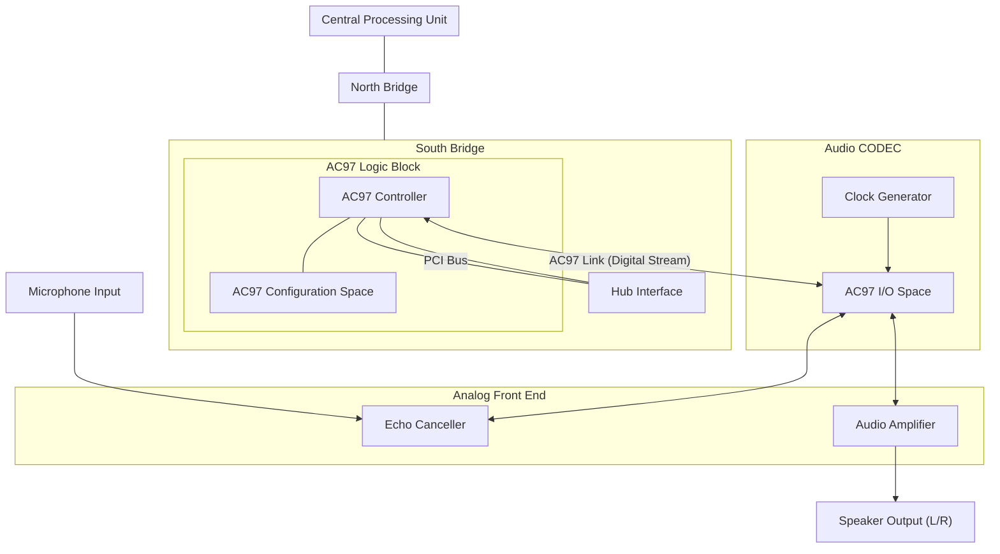
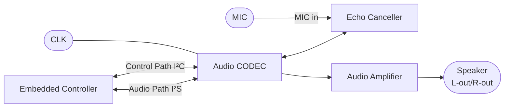
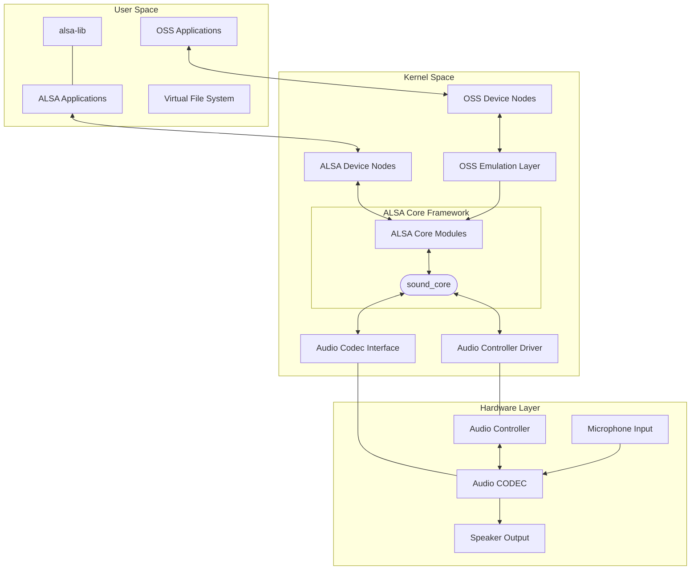
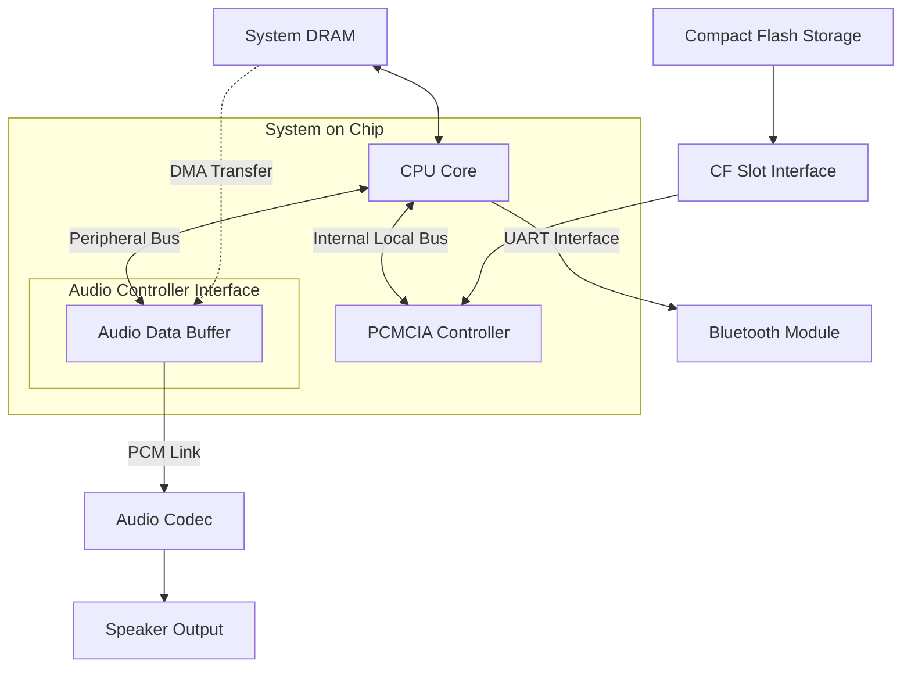
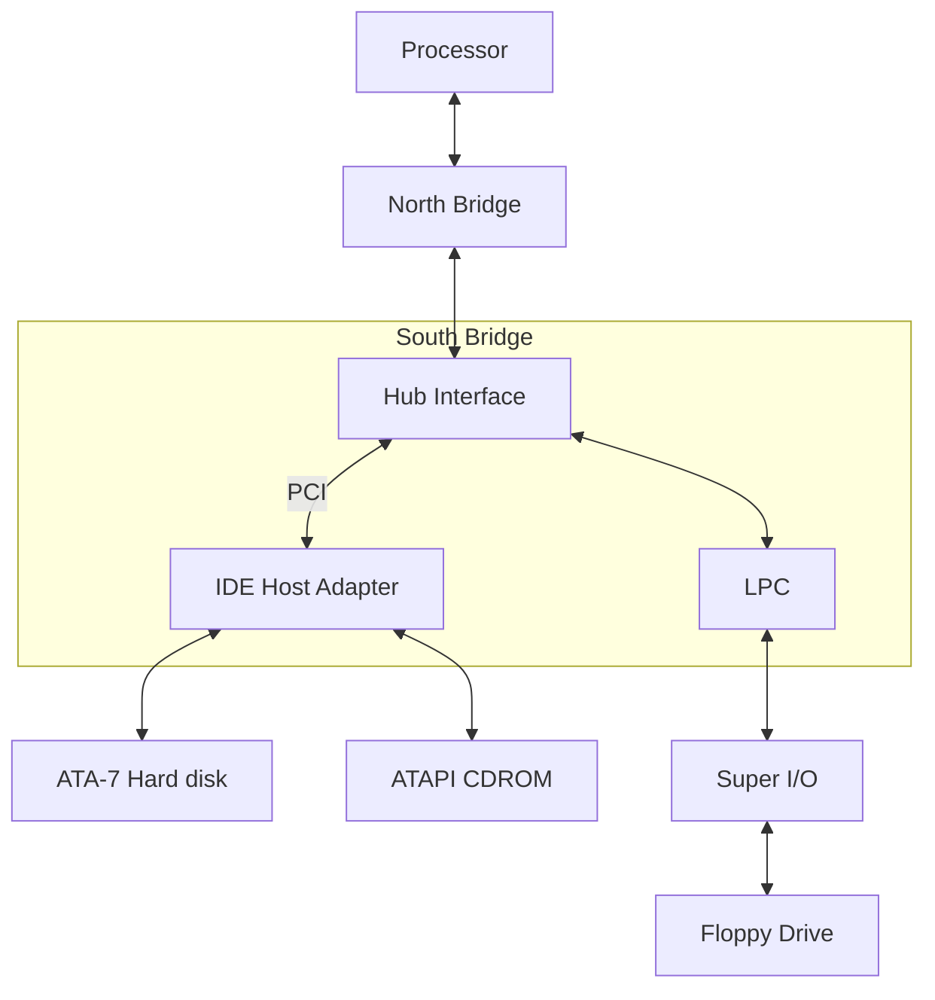
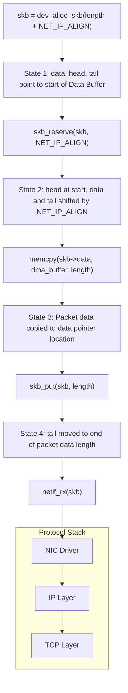
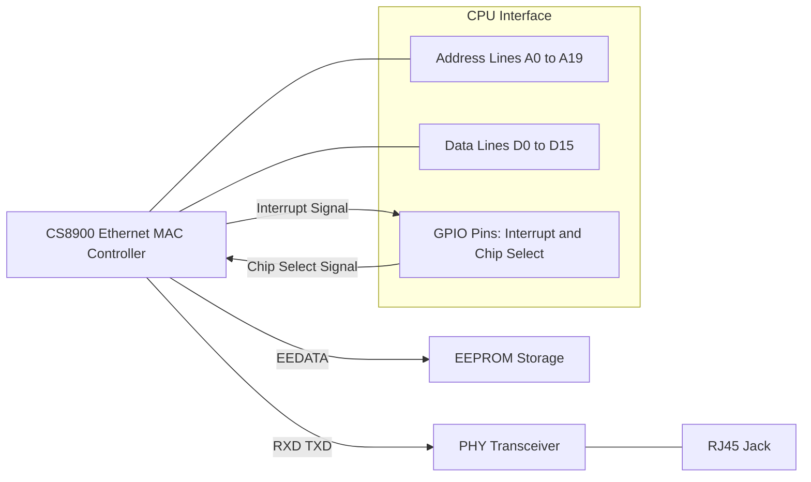
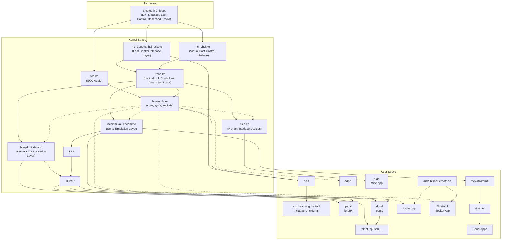
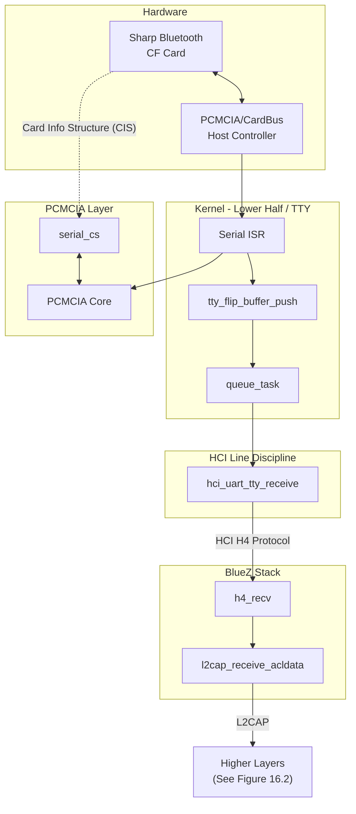
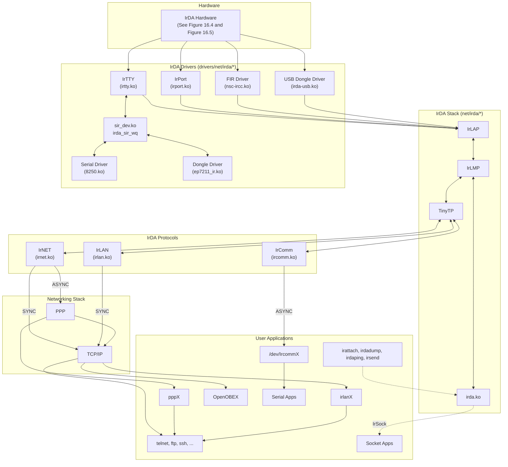

# **Chapter 12. Video Drivers**

```
In This Chapter

• Display Architecture ................ 356
• Linux-Video Subsystem ............... 359
• Display Parameters .................. 361
• The Frame Buffer API ................ 362
• Frame Buffer Drivers ................ 365
• Console Drivers ..................... 380
• Debugging ........................... 387
• Looking at the Sources .............. 388
```

Video hardware generates visual output for a computer system to display. In this chapter, let's find out how the kernel supports video controllers and discover the advantages offered by the frame buffer abstraction. Let's also learn to write console drivers that display messages emitted by the kernel.

# **Display Architecture**

Figure 12.1 shows the display assembly on a PC-compatible system. The graphics controller that is part of the North Bridge (see the sidebar "The North Bridge") connects to different types of display devices using several interface standards (see the sidebar "Video Cabling Standards").

**Figure 12.1. Display connection on a PC system.**

*Video Graphics Array* (VGA) is the original display standard introduced by IBM, but it's more of a resolution specification today. VGA refers to a resolution of 640x480, whereas newer standards such as *eXtended Graphics Array* (XGA) and *Super Video Graphics Array* (SVGA) support higher resolutions of 800x600 and 1024x768. *Quarter VGA* (QVGA) panels having a resolution of 320x240 are common on embedded devices, such as handhelds and smart phones.

Graphics controllers in the x86 world compatible with VGA and its derivatives offer a character-based text mode and a pixel-based graphics mode. The non-x86 embedded space is non-VGA, however, and has no concept of a dedicated text mode.

### The North Bridge

In earlier chapters, you learned about peripheral buses such as LPC, I2C, PCMCIA, PCI, and USB, all of which are sourced from the South Bridge on PC-centric systems. Display architecture, however, takes us inside the North Bridge. A North Bridge in the Intel-based PC architecture is either a *Graphics and Memory Controller Hub* (GMCH) or a *Memory Controller Hub* (MCH). The former contains a memory controller, a *Front Side Bus* (FSB) controller, and a graphics controller. The latter lacks an integrated graphics controller but provides an *Accelerated Graphics Port* (AGP) channel to connect external graphics hardware.

Consider, for example, the Intel 855 GMCH North Bridge chipset. The FSB controller in the 855 GMCH interfaces with Pentium M processors. The memory controller supports *Dual Data Rate* (DDR) SDRAM memory chips. The integrated graphics controller lets you connect to display devices using analog VGA, LVDS, or DVI (see the sidebar "Video Cabling Standards"). The 855 GMCH enables you to simultaneously send output to two displays, so you can, for example, dispatch similar or separate information to your laptop's LCD panel and an external CRT monitor at the same time.

Recent North Bridge chipsets, such as the AMD 690G, include support for HDMI (see the following sidebar) in addition to VGA and DVI.

### Video Cabling Standards

Several interfacing standards specify the connection between video controllers and display devices. Display devices and the cabling technologies they use follow:

- An analog display such as a *cathode ray tube* (CRT) monitor that has a standard VGA connector.
- A digital flat-panel display such as a laptop *Thin Film Transistor* (TFT) LCD that has a *lowvoltage differential signaling* (LVDS) connector.
- A display monitor that complies with the *Digital Visual Interface* (DVI) specification. DVI is a standard developed by the *Digital Display Working Group* (DDWG) for carrying high-quality video. There are three DVI subclasses: *digital-only* (DVI-D), *analog-only* (DVI-A), and *digital-and-analog* (DVI-I).
- A display monitor that complies with the *High-Definition Television* (HDTV) specification using the *High-Definition Multimedia Interface* (HDMI). HDMI is a modern digital audio-video cable standard that supports high data rates. Unlike video-only standards such as DVI, HDMI can carry both picture and sound.

Embedded SoCs usually have an on-chip LCD controller, as shown in Figure 12.2. The output emanating from the LCD controller are TTL (*Transistor-Transistor Logic*) signals that pack 18 bits of flat-panel video data, six each for the three primary colors, red, green, and blue. Several handhelds and phones use QVGA-type internal LCD panels that directly receive the TTL flat-panel video data sourced by LCD controllers.

```
                     Embedded Controller
        +---------------------------------------------+
        |                 [ CPU Core ]                |
        |                        |                    |
        |              Internal Local Bus             |
        |        _________|______________             |
        |       |                      |              |
        |  [ USB Controller ]  ....[ LCD Controller ] |
        |                                |            |
        +--------------------------------|------------+
                                         |
                                         |
                                 18-bit Flat Panel data
                                         v
                                   [ QVGA LCD Panel ]
```

**Figure 12.2. Display connection on an embedded system.**

The embedded device, as in Figure 12.3, supports dual display panels: an internal LVDS flat-panel LCD and an

external DVI monitor. The internal TFT LCD takes an LVDS connector as input, so an LVDS transmitter chip is used to convert the flat-panel signals to LVDS. An example of an LVDS transmitter chip is DS90C363B from National Semiconductor. The external DVI monitor takes only a DVI connector, so a DVI transmitter is used to convert the 18-bit video signals to DVI-D. An I2C interface is provided so that the device driver can configure the DVI transmitter registers. An example of a DVI transmitter chip is SiI164 from Silicon Image.

[View full size image]

**Figure 12.3. LVDS and DVI connections on an embedded system.**

# **Linux-Video Subsystem**

The concept of frame buffers is central to video on Linux, so let's first find out what that offers.

Because video adapters can be based on different hardware architectures, the implementation of higher kernel layers and applications might need to vary across video cards. This results in nonuniform schemes to handle different video cards. The ensuing nonportability and extra code necessitate greater investment and maintenance. The frame buffer concept solves this problem by describing a general abstraction and specifying a programming interface that allows applications and higher kernel layers to be written in a platform-independent manner. Figure 12.4 shows you the frame buffer advantage.

```
      [ GUIs, Consoles, Movie players, ... ]
                        |
                        v
            [ Common Framebuffer API ]
                 /                 \
                /                   \
               v                     v
      [ Framebuffer Driver I ]   [ Framebuffer Driver N ]
               |                         |
               v                         v
        [ Video Card I ]   ...  [ Video Card N ]

       (Video cards having different graphics controllers)
```

**Figure 12.4. The frame buffer advantage.**

The kernel's frame buffer interface thus allows applications to be independent of the vagaries of the underlying graphics hardware. Applications run unchanged over diverse types of video hardware if they and the display drivers conform to the frame buffer interface. As you will soon find out, the common frame buffer programming interface also brings hardware independence to kernel layers, such as the frame buffer console driver.

Today, several applications, such as web browsers and movie players, work directly over the frame buffer interface. Such applications can do graphics without help from a windowing system.

The X Windows server (Xfbdev) is capable of working over the frame buffer interface, as shown in Figure 12.5.

[View full size image]

**Figure 12.5. Linux-Video subsystem.**

The Linux-Video subsystem shown in Figure 12.5 is a collection of low-level display drivers, middle-level frame buffer and console layers, a high-level virtual terminal driver, user mode drivers part of X Windows, and utilities to configure display parameters. Let's trace the figure top down:

- The X Windows GUI has two options for operating over video cards. It can use either a suitable built-in user-space driver for the card or work over the frame buffer subsystem.
- Text mode consoles function over the virtual terminal character driver. Virtual terminals, introduced in the section "TTY Drivers" in Chapter 6, "Serial Drivers," are full-screen text-based terminals that you get when you logon in text mode. Like X Windows, text consoles have two operational choices. They can either work over a card-specific console driver, or use the generic frame buffer console driver (*fbcon*) if the kernel supports a low-level frame buffer driver for the card in question.

# **Display Parameters**

Sometimes, configuring the properties associated with your display panel might be the only driver changes that you need to make to enable video on your device, so let's start learning about video drivers by looking at common display parameters. We will assume that the associated driver conforms to the frame buffer interface, and use the *fbset* utility to obtain display characteristics:

### **bash> fbset**

```
mode "1024x768-60"
 # D: 65.003 MHz, H: 48.365 kHz, V: 60.006 Hz
 geometry 1024 768 1024 768 8
 timings 15384 168 16 30 2 136 6
 hsync high
 vsync high
 rgba 8/0,8/0,8/0,0/0
endmode
```

The D: value in the output stands for the *dotclock*, which is the speed at which the video hardware draws pixels on the display. The value of 65.003MHz in the preceding output means that it'll take (1/65.003\*1000000) or about 15,384 picoseconds for the video controller to draw a single pixel. This duration is called the *pixclock* and is shown as the first numeric parameter in the line starting with timings. The numbers against "geometry" announce that the visible and virtual resolutions are 1024x768 (SVGA) and that the bits required to store information pertaining to a pixel is 8.

The H: value specifies the horizontal scan rate, which is the number of horizontal display lines scanned by the video hardware in one second. This is the inverse of the pixclock times the X-resolution. The V: value is the rate at which the entire display is refreshed. This is the inverse of the pixclock times the visible X-resolution times the visible Y-resolution, which is around 60Hz in this example. In other words, the LCD is refreshed 60 times in a second.

Video controllers issue a horizontal sync (HSYNC) pulse at the end of each line and a vertical sync (VSYNC) pulse after each display frame. The durations of HSYNC (in terms of pixels) and VSYNC (in terms of pixel lines) are shown as the last two parameters in the line starting with "timings." The larger your display, the bigger the likely values of HSYNC and VSYNC. The four numbers before the HSYNC duration in the timings line announce the length of the right display margin (or horizontal front porch), left margin (or horizontal back porch), lower margin (or vertical front porch), and upper margin (or vertical back porch), respectively. *Documentation/fb/framebuffer.txt* and the man page of *fb.modes* pictorially show these parameters.

To tie these parameters together, let's calculate the pixclock value for a given refresh rate, which is 60.006Hz in our example:

```
dotclock = (X-resolution + left margin + right margin
 + HSYNC length) * (Y-resolution + upper margin
 + lower margin + VSYNC length) * refresh rate
 = (1024 + 168 + 16 + 136) * (768 + 30 + 2 + 6) * 60.006
 = 65.003 MHz
pixclock = 1/dotclock
 = 15384 picoseconds (which matches with the fbset output
 above)
```

# **The Frame Buffer API**

Let's next wet our feet in the frame buffer API. The frame buffer core layer exports device nodes to user space so that applications can access each supported video device. */dev/fbX* is the node associated with frame buffer device *X.* The following are the main data structures that interest users of the frame buffer API. Inside the kernel, they are defined in *include/linux/fb.h*, whereas in user land, their definitions reside in */usr/include/linux/fb.h*:

Variable information pertaining to the video card that you saw in the fbset output in the previous section is held in struct fb\_var\_screeninfo. This structure contains fields such as the X-resolution, Y-resolution, bits required to hold a pixel, pixclock, HSYNC duration, VSYNC duration, and margin lengths. These values are programmable by the user: **1.**

```
struct fb_var_screeninfo {
 __u32 xres; /* Visible resolution in the X axis */
 __u32 yres; /* Visible resolution in the Y axis */
 /* ... */
 __u32 bits_per_pixel; /* Number of bits required to hold a
 pixel */
 /* ... */
 __u32 pixclock; /* Pixel clock in picoseconds */
 __u32 left_margin; /* Time from sync to picture */
 __u32 right_margin; /* Time from picture to sync */
 /* ... */
 __u32 hsync_len; /* Length of horizontal sync */
 __u32 vsync_len; /* Length of vertical sync */
 /* ... */
};
```

Fixed information about the video hardware, such as the start address and size of frame buffer memory, is held in struct fb\_fix\_screeninfo. These values cannot be altered by the user: **2.**

```
struct fb_fix_screeninfo {
 char id[16]; /* Identification string */
 unsigned long smem_start; /* Start of frame buffer memory */
 __u32 smem_len; /* Length of frame buffer memory */
 /* ... */
};
```

The fb\_cmap structure specifies the color map, which is used to convey the user's definition of colors to the underlying video hardware. You can use this structure to define the RGB (Red, Green, Blue) ratio that you desire for different colors: **3.**

```
struct fb_cmap {
 __u32 start; /* First entry */
 __u32 len; /* Number of entries */
 __u16 *red; /* Red values */
 __u16 *green; /* Green values */
 __u16 *blue; /* Blue values */
 __u16 *transp; /* Transparency. Discussed later on */
};
```

Listing 12.1 is a simple application that works over the frame buffer API. The program clears the screen by operating on */dev/fb0*, the frame buffer device node corresponding to the display. It first deciphers the visible resolutions and the *bits per pixel* in a hardware-independent manner using the frame buffer API, FBIOGET\_VSCREENINFO. This interface command gleans the display's variable parameters by operating on the fb\_var\_screeninfo structure. The program then goes on to mmap() the frame buffer memory and clears each constituent pixel bit.

**Listing 12.1. Clear the Display in a Hardware-Independent Manner**

```
#include <stdio.h>
#include <fcntl.h>
#include <linux/fb.h>
#include <sys/mman.h>
#include <stdlib.h>
struct fb_var_screeninfo vinfo;
int
main(int argc, char *argv[])
{
 int fbfd, fbsize, i;
 unsigned char *fbbuf;
 /* Open video memory */
 if ((fbfd = open("/dev/fb0", O_RDWR)) < 0) {
 exit(1);
 }
 /* Get variable display parameters */
 if (ioctl(fbfd, FBIOGET_VSCREENINFO, &vinfo)) {
 printf("Bad vscreeninfo ioctl\n");
 exit(2);
 }
 /* Size of frame buffer =
 (X-resolution * Y-resolution * bytes per pixel) */
 fbsize = vinfo.xres*vinfo.yres*(vinfo.bits_per_pixel/8);
 /* Map video memory */
 if ((fbbuf = mmap(0, fbsize, PROT_READ|PROT_WRITE,
 MAP_SHARED, fbfd, 0)) == (void *) -1){
 exit(3);
 }
 /* Clear the screen */
 for (i=0; i<fbsize; i++) {
 *(fbbuf+i) = 0x0;
 }
 munmap(fbbuf, fbsize);
 close(fbfd);
}
```

We look at another frame buffer application when we learn to access memory regions from user space in Chapter 19, "Drivers in User Space."

# **Frame Buffer Drivers**

Now that you have an idea of the frame buffer API and how it provides hardware independence, let's discover the architecture of a low-level frame buffer device driver using the example of a navigation system.

## **Device Example: Navigation System**

Figure 12.6 shows video operation on an example vehicle navigation system built around an embedded SoC. A GPS receiver streams coordinates to the SoC via a UART interface. An application produces graphics from the received location information and updates a frame buffer in system memory. The frame buffer driver DMAs this picture data to display buffers that are part of the SoC's LCD controller. The controller forwards the pixel data to the QVGA LCD panel for display.

```
                       Embedded SoC
      ----------------------------------------------------
      |                    [ CPU Core ]                  |
      |                          |                       |
      |                    Internal Local Bus            |
      |                _________|__________              |
      |               |                    |             |
      |            [ UART ]          [ LCD Controller ]  |
      |               ^                 [ Buffer ]----------> [ QVGA LCD Panel ]
      ----------------|-----------------------------------
                      |                     ^
         GPS Receiver |                     |
                 [ GPS Receiver ]           |
                                            |
                 Frame Buffer               |   DMA
        [ DRAM ] ---------------------------'
             ^ 
             | 
             '------------------> [ CPU Core ]
```

**Figure 12.6. Display on a Linux navigation device.**

Our goal is to develop the video software for this system. Let's assume that Linux supports the SoC used on this navigation device and that all architecture-dependent interfaces such as DMA are supported by the kernel.

One possible hardware implementation of the device shown in Figure 12.6 is by using a Freescale i.MX21 SoC. The CPU core in that case is an ARM9 core, and the on-chip video controller is the Liquid Crystal Display Controller (LCDC). SoCs commonly have a high-performance internal local bus that connects to controllers such as DRAM and video. In the case of the iMX.21, this bus is called the Advanced High-Performance Bus (AHB). The LCDC connects to the AHB.

The navigation system's video software is broadly architected as a GPS application operating over a low-level frame buffer driver for the LCD controller. The application fetches location coordinates from the GPS receiver by reading */dev/ttySX*, where *X* is the UART number connected to the receiver. It then translates the geographic fix information into a picture and writes the pixel data to the frame buffer associated with the LCD controller. This is done on the lines of Listing 12.1, except that picture data is dispatched rather than zeros to clear the screen.

The rest of this section focuses only on the low-level frame buffer device driver. Like many other driver subsystems, the full complement of facilities, modes, and options offered by the frame buffer core layer are complex and can be learned only with coding experience. The frame buffer driver for the example navigation system is relatively simplistic and is only a starting point for deeper explorations.

Table 12.1 describes the register model of the LCD controller shown in Figure 12.6. The frame buffer driver in Listing 12.2 operates over these registers.

**Table 12.1. Register Layout of the LCD Controller Shown in Figure 12.6**

| Register Name | Used to Configure                                                                                           |
|---------------|-------------------------------------------------------------------------------------------------------------|
| SIZE_REG      | LCD panel's maximum X and Y dimensions                                                                      |
| HSYNC_REG     | HSYNC duration                                                                                              |
| VSYNC_REG     | VSYNC duration                                                                                              |
| CONF_REG      | Bits per pixel, pixel polarity, clock dividers for generating<br>pixclock, color/monochrome mode, and so on |
| CTRL_REG      | Enable/disable LCD controller, clocks, and DMA                                                              |
| DMA_REG       | Frame buffer's DMA start address, burst length, and<br>watermark sizes                                      |
| STATUS_REG    | Status values                                                                                               |
| CONTRAST_REG  | Contrast level                                                                                              |

Our frame buffer driver (called *myfb*) is implemented as a platform driver in Listing 12.2. As you learned in Chapter 6, a platform is a pseudo bus usually used to connect lightweight devices integrated into SoCs, with the kernel's device model. Architecture-specific setup code (in *arch/your-arch/your-platform/*) adds the platform using platform\_device\_add(); but for simplicity, the probe() method of the myfb driver performs this before registering itself as a platform driver. Refer back to the section "Device Example: Cell Phone" in Chapter 6 for the general architecture of a platform driver and associated entry points.

## **Data Structures**

Let's take a look at the major data structures and methods associated with frame buffer drivers and then zoom in on myfb. The following two are the main structures:

struct fb\_info is the centerpiece data structure of frame buffer drivers. This structure is defined in *include/linux/fb.h* as follows: **1.**

```
struct fb_info {
 /* ... */
 struct fb_var_screeninfo var; /* Variable screen information.
```

```
 Discussed earlier. */
 struct fb_fix_screeninfo fix; /* Fixed screen information.
 Discussed earlier. */
 /* ... */
 struct fb_cmap cmap; /* Color map.
 Discussed earlier. */
 /* ... */
 struct fb_ops *fbops; /* Driver operations.
 Discussed next. */
 /* ... */
 char __iomem *screen_base; /* Frame buffer's
 virtual address */
 unsigned long screen_size; /* Frame buffer's size */
 /* ... */
 /* From here on everything is device dependent */
 void *par; /* Private area */
};
```

Memory for fb\_info is allocated by framebuffer\_alloc(), a library routine provided by the frame buffer core. This function also takes the size of a private area as an argument and appends that to the end of the allocated fb\_info. This private area can be referenced using the par pointer in the fb\_info structure. The semantics of fb\_info fields such as fb\_var\_screeninfo and fb\_fix\_screeninfo were discussed in the section "The Frame Buffer API."

The fb\_ops structure contains the addresses of all entry points provided by the low-level frame buffer driver. The first few methods in fb\_ops are necessary for the functioning of the driver, while the remaining are optional ones that provide for graphics acceleration. The responsibility of each function is briefly explained within comments: **2.**

```
struct fb_ops {
 struct module *owner;
 /* Driver open */
 int (*fb_open)(struct fb_info *info, int user);
 /* Driver close */
 int (*fb_release)(struct fb_info *info, int user);
 /* ... */
 /* Sanity check on video parameters */
 int (*fb_check_var)(struct fb_var_screeninfo *var,
 struct fb_info *info);
 /* Configure the video controller registers */
 int (*fb_set_par)(struct fb_info *info);
 /* Create pseudo color palette map */
 int (*fb_setcolreg)(unsigned regno, unsigned red,
 unsigned green, unsigned blue,
 unsigned transp, struct fb_info *info);
 /* Blank/unblank display */
 int (*fb_blank)(int blank, struct fb_info *info);
 /* ... */
 /* Accelerated method to fill a rectangle with pixel lines */
 void (*fb_fillrect)(struct fb_info *info,
 const struct fb_fillrect *rect);
 /* Accelerated method to copy a rectangular area from one
 screen region to another */
 void (*fb_copyarea)(struct fb_info *info,
```

```
 const struct fb_copyarea *region);
 /* Accelerated method to draw an image to the display */
 void (*fb_imageblit)(struct fb_info *info,
 const struct fb_image *image);
 /* Accelerated method to rotate the display */
 void (*fb_rotate)(struct fb_info *info, int angle);
 /* Ioctl interface to support device-specific commands */
 int (*fb_ioctl)(struct fb_info *info, unsigned int cmd,
 unsigned long arg);
 /* ... */
};
```

Let's now look at the driver methods that Listing 12.2 implements for the myfb driver.

### **Checking and Setting Parameters**

The fb\_check\_var() method performs a sanity check of variables such as X-resolution, Y-resolution, and bits per pixel. So, if you use fbset to set an X-resolution less than the minimum supported by the LCD controller (64 in our example), this function will limit it to the minimum allowed by the hardware.

fb\_check\_var() also sets the appropriate RGB format. Our example uses 16 bits per pixel, and the controller maps each data word in the frame buffer into the commonly used RGB565 code: 5 bits for red, 6 bits for green, and 5 bits for blue. The offsets into the data word for each of the three colors are also set accordingly.

The fb\_set\_par() method configures the registers of the LCD controller depending on the values found in fb\_info.var. This includes setting

- Horizontal sync duration, left margin, and right margin in HSYNC\_REG
- Vertical sync duration, upper margin, and lower margin in VSYNC\_REG
- The visible X and Y resolutions in SIZE\_REG
- DMA parameters in DMA\_REG

Assume that the GPS application attempts to alter the resolution of the QVGA display to 50x50. The following is the train of events:

The display is initially at QVGA resolution: **1.**

```
bash> fbset
mode "320x240-76"
 # D: 5.830 MHz, H: 18.219 kHz, V: 75.914 Hz
 geometry 320 240 320 240 16
 timings 171521 0 0 0 0 0 0
 rgba 5/11,6/5,5/0,0/0
```

### endmode

The application does something like this: **2.**

```
struct fb_var_screeninfo vinfo;
fbfd = open("/dev/fb0", O_RDWR);
vinfo.xres = 50;
vinfo.yres = 50;
vinfo.bits_per_pixel = 8;
ioctl(fbfd, FBIOPUT_VSCREENINFO, &vinfo);
Note that this is equivalent to the command fbset -xres 50 -yres 50 -depth 8.
```

The FBIOPUT\_VSCREENINFO ioctl in the previous step triggers invocation of myfb\_check\_var(). This driver method expresses displeasure and rounds up the requested resolution to the minimum supported by the hardware, which is 64x64 in this case. **3.**

- myfb\_set\_par() is invoked by the frame buffer core, which programs the new display parameters into LCD controller registers. **4.**
- fbset now outputs new parameters: **5.**

```
bash> fbset
mode "64x64-1423"
 # D: 5.830 MHz, H: 91.097 kHz, V: 1423.386 Hz
 geometry 64 64 320 240 16
 timings 171521 0 0 0 0 0 0
 rgba 5/11,6/5,5/0,0/0
endmode
```

### **Color Modes**

Common color modes supported by video hardware include *pseudo color* and *true color.* In the former, index numbers are mapped to RGB pixel encodings. By choosing a subset of available colors and by using the indices corresponding to the colors instead of the pixel values themselves, you can reduce demands on frame buffer memory. Your hardware needs to support this scheme of a modifiable color set (or *palette*), however.

In true color mode (which is what our example LCD controller supports), modifiable palettes are not relevant. However, you still have to satisfy the demands of the frame buffer console driver, which uses only 16 colors. For this, you have to create a pseudo palette by encoding the corresponding 16 raw RGB values into bits that can be directly fed to the hardware. This pseudo palette is stored in the pseudo\_palette field of the fb\_info structure. In Listing 12.2, myfb\_setcolreg() populates it as follows:

```
((u32*)(info->pseudo_palette))[color_index] =
 (red << info->var.red.offset) |
 (green << info->var.green.offset) |
 (blue << info->var.blue.offset) |
 (transp << info->var.transp.offset);
```

Our LCD controller uses 16 bits per pixel and the RGB565 format, so as you saw earlier, the fb\_check\_var() method ensures that the red, green and blue values reside at bit offsets 11, 5, and 0, respectively. In addition to the color index and the red, blue, and green values, fb\_setcolreg() takes in an argument transp, to specify desired transparency effects. This mechanism, called *alpha blending*, combines the specified pixel value with the background color. The LCD controller in this example does not support alpha blending, so myfb\_check\_var() sets the transp offset and length to zero.

The frame buffer abstraction is powerful enough to insulate applications from the characteristics of the display panel—whether it's RGB or BGR or something else. The red, blue, and green offsets set by fb\_check\_var() percolate to user space via the fb\_var\_screeninfo structure populated by the FBIOGET\_VSCREENINFO ioctl(). Because applications such as X Windows are frame buffer-compliant, they paint pixels into the frame buffer according to the color offsets returned by this ioctl().

Bit lengths used by the RGB encoding (5+6+5=16 in this case) is called the *color depth*, which is used by the frame buffer console driver to choose the logo file to display during boot (see the section "Boot Logo").

### **Screen Blanking**

The fb\_blank() method provides support for blanking and unblanking the display. This is mainly used for power management. To blank the navigation system's display after a 10-minute period of inactivity, do this:

### **bash> setterm -blank 10**

This command percolates down the layers to the frame buffer layer and results in the invocation of myfb\_blank(), which programs appropriate bits in CTRL\_REG.

### **Accelerated Methods**

If your user interface needs to perform heavy-duty video operations such as blending, stretching, moving bitmaps, or dynamic gradient generation, you likely require graphics acceleration to obtain acceptable performance. Let's briefly visit the fb\_ops methods that you can leverage if your video hardware supports graphics acceleration.

The fb\_imageblit() method draws an image to the display. This entry point provides an opportunity to your driver to leverage any special capabilities that your video controller might possess to hasten this operation. cfb\_imageblit() is a generic library function provided by the frame buffer core to achieve this if you have nonaccelerated hardware. It's used, for instance, to output a logo to the screen during boot up. fb\_copyarea() copies a rectangular area from one screen region to another. cfb\_copyarea() provides an optimized way of doing this if your graphics controller does not possess any magic to accelerate this operation. The fb\_fillrect() method speedily fills a rectangle with pixel lines. cfb\_fillrect() offers a generic nonaccelerated way to achieve this. The LCD controller in our navigation system does not provide for acceleration, so the example driver populates these methods using the generic software-optimized routines offered by the frame buffer core.

### DirectFB

DirectFB (www.directfb.org) is a library built on top of the frame buffer interface that provides a simple window manager framework and hooks for hardware graphics acceleration and virtual interfaces that allow coexistence of multiple frame buffer applications. DirectFB, along with an accelerated frame buffer device driver downstream and a DirectFB-aware rendering engine such as Cairo (www.cairographics.org) upstream, is sometimes used on graphics-intensive embedded devices instead of more traditional solutions such as X Windows.

## **DMA from the Frame Buffer**

The LCD controller in the navigation system contains a DMA engine that fetches picture frames from system memory. The controller dispatches the obtained graphics data to the display panel. The rate of DMA sustains the refresh rate of the display. A non-cacheable frame buffer suitable for coherent access is allocated using dma\_alloc\_coherent() from myfb\_probe(). (We discussed coherent DMA mapping in Chapter 10, "Peripheral Component Interconnect.") myfb\_set\_par() writes this allocated DMA address to the DMA\_REG register in the LCD controller.

When the driver enables DMA by calling myfb\_enable\_controller(), the controller starts ferrying pixel data from the frame buffer to the display using synchronous DMA. So, when the GPS application maps the frame buffer (using mmap()) and writes location information to it, the pixels gets painted onto the LCD.

### **Contrast and Backlight**

The LCD controller in the navigation system supports contrast control using the CONTRAST\_REG register. The driver exports this to user space via myfb\_ioctl(). The GPS application controls contrast as follows:

```
unsigned int my_fd, desired_contrast_level = 100;
/* Open the frame buffer */
my_fd = open("/dev/fb0", O_RDWR);
ioctl(my_fd, MYFB_SET_BRIGHTNESS, &desired_contrast_level);
```

The LCD panel on the navigation system is illuminated using a backlight. The processor controls the backlight inverter through GPIO lines, so you can turn the light on or off by wiggling the corresponding pins. The kernel abstracts a generic backlight interface via sysfs nodes. To tie with this interface, your driver has to populate a backlight\_ops structure with methods for obtaining and updating backlight brightness, and register it with the kernel using backlight\_device\_register(). Look inside *drivers/video/backlight/* for the backlight interface sources and recursively grep the *drivers/* tree for backlight\_device\_register() to locate video drivers that use this interface. Listing 12.2 does not implement backlight manipulation operations.

### **Listing 12.2. Frame Buffer Driver for the Navigation System**

```
#include <linux/fb.h>
#include <linux/dma-mapping.h>
#include <linux/platform_device.h>
/* Address map of LCD controller registers */
#define LCD_CONTROLLER_BASE 0x01000D00
#define SIZE_REG (*(volatile u32 *)(LCD_CONTROLLER_BASE))
#define HSYNC_REG (*(volatile u32 *)(LCD_CONTROLLER_BASE + 4))
#define VSYNC_REG (*(volatile u32 *)(LCD_CONTROLLER_BASE + 8))
#define CONF_REG (*(volatile u32 *)(LCD_CONTROLLER_BASE + 12))
```

```
#define CTRL_REG (*(volatile u32 *)(LCD_CONTROLLER_BASE + 16))
#define DMA_REG (*(volatile u32 *)(LCD_CONTROLLER_BASE + 20))
#define STATUS_REG (*(volatile u32 *)(LCD_CONTROLLER_BASE + 24))
#define CONTRAST_REG (*(volatile u32 *)(LCD_CONTROLLER_BASE + 28))
#define LCD_CONTROLLER_SIZE 32
/* Resources for the LCD controller platform device */
static struct resource myfb_resources[] = {
 [0] = {
 .start = LCD_CONTROLLER_BASE,
 .end = LCD_CONTROLLER_SIZE,
 .flags = IORESOURCE_MEM,
 },
};
/* Platform device definition */
static struct platform_device myfb_device = {
 .name = "myfb",
 .id = 0,
 .dev = {
 .coherent_dma_mask = 0xffffffff,
 },
 .num_resources = ARRAY_SIZE(myfb_resources),
 .resource = myfb_resources,
};
/* Set LCD controller parameters */
static int
myfb_set_par(struct fb_info *info)
{
 unsigned long adjusted_fb_start;
 struct fb_var_screeninfo *var = &info->var;
 struct fb_fix_screeninfo *fix = &info->fix;
 /* Top 16 bits of HSYNC_REG hold HSYNC duration, next 8 contain
 the left margin, while the bottom 8 house the right margin */
 HSYNC_REG = (var->hsync_len << 16) |
 (var->left_margin << 8)|
 (var->right_margin);
 /* Top 16 bits of VSYNC_REG hold VSYNC duration, next 8 contain
 the upper margin, while the bottom 8 house the lower margin */
 VSYNC_REG = (var->vsync_len << 16) |
 (var->upper_margin << 8)|
 (var->lower_margin);
 /* Top 16 bits of SIZE_REG hold xres, bottom 16 hold yres */
 SIZE_REG = (var->xres << 16) | (var->yres);
 /* Set bits per pixel, pixel polarity, clock dividers for
 the pixclock, and color/monochrome mode in CONF_REG */
 /* ... */
 /* Fill DMA_REG with the start address of the frame buffer
 coherently allocated from myfb_probe(). Adjust this address
 to account for any offset to the start of screen area */
 adjusted_fb_start = fix->smem_start +
 (var->yoffset * var->xres_virtual + var->xoffset) *
 (var->bits_per_pixel) / 8;
 __raw_writel(adjusted_fb_start, (unsigned long *)DMA_REG);
```

```
 /* Set the DMA burst length and watermark sizes in DMA_REG */
 /* ... */
 /* Set fixed information */
 fix->accel = FB_ACCEL_NONE; /* No hardware acceleration */
 fix->visual = FB_VISUAL_TRUECOLOR; /* True color mode */
 fix->line_length = var->xres_virtual * var->bits_per_pixel/8;
 return 0;
}
/* Enable LCD controller */
static void
myfb_enable_controller(struct fb_info *info)
{
 /* Enable LCD controller, start DMA, enable clocks and power
 by writing to CTRL_REG */
 /* ... */
}
/* Disable LCD controller */
static void
myfb_disable_controller(struct fb_info *info)
{
 /* Disable LCD controller, stop DMA, disable clocks and power
 by writing to CTRL_REG */
 /* ... */
}
/* Sanity check and adjustment of variables */
static int
myfb_check_var(struct fb_var_screeninfo *var, struct fb_info *info)
{
 /* Round up to the minimum resolution supported by
 the LCD controller */
 if (var->xres < 64) var->xres = 64;
 if (var->yres < 64) var->yres = 64;
 /* ... */
 /* This hardware supports the RGB565 color format.
 See the section "Color Modes" for more details */
 if (var->bits_per_pixel == 16) {
 /* Encoding Red */
 var->red.length = 5;
 var->red.offset = 11;
 /* Encoding Green */
 var->green.length = 6;
 var->green.offset = 5;
 /* Encoding Blue */
 var->blue.length = 5;
 var->blue.offset = 0;
 /* No hardware support for alpha blending */
 var->transp.length = 0;
 var->transp.offset = 0;
 }
 return 0;
}
/* Blank/unblank screen */
static int
```

```
myfb_blank(int blank_mode, struct fb_info *info)
{
 switch (blank_mode) {
 case FB_BLANK_POWERDOWN:
 case FB_BLANK_VSYNC_SUSPEND:
 case FB_BLANK_HSYNC_SUSPEND:
 case FB_BLANK_NORMAL:
 myfb_disable_controller(info);
 break;
 case FB_BLANK_UNBLANK:
 myfb_enable_controller(info);
 break;
 }
 return 0;
}
/* Configure pseudo color palette map */
static int
myfb_setcolreg(u_int color_index, u_int red, u_int green,
 u_int blue, u_int transp, struct fb_info *info)
{
 if (info->fix.visual == FB_VISUAL_TRUECOLOR) {
 /* Do any required translations to convert red, blue, green and
 transp, to values that can be directly fed to the hardware */
 /* ... */
 ((u32 *)(info->pseudo_palette))[color_index] =
 (red << info->var.red.offset) |
 (green << info->var.green.offset) |
 (blue << info->var.blue.offset) |
 (transp << info->var.transp.offset);
 }
 return 0;
}
/* Device-specific ioctl definition */
#define MYFB_SET_BRIGHTNESS _IOW('M', 3, int8_t)
/* Device-specific ioctl */
static int
myfb_ioctl(struct fb_info *info, unsigned int cmd,
 unsigned long arg)
{
 u32 blevel ;
 switch (cmd) {
 case MYFB_SET_BRIGHTNESS :
 copy_from_user((void *)&blevel, (void *)arg,
 sizeof(blevel)) ;
 /* Write blevel to CONTRAST_REG */
 /* ... */
 break;
 default:
 return –EINVAL;
 }
 return 0;
}
/* The fb_ops structure */
static struct fb_ops myfb_ops = {
```

```
 .owner = THIS_MODULE,
 .fb_check_var = myfb_check_var,/* Sanity check */
 .fb_set_par = myfb_set_par, /* Program controller registers */
 .fb_setcolreg = myfb_setcolreg,/* Set color map */
 .fb_blank = myfb_blank, /* Blank/unblank display */
 .fb_fillrect = cfb_fillrect, /* Generic function to fill
 rectangle */
 .fb_copyarea = cfb_copyarea, /* Generic function to copy area */
 .fb_imageblit = cfb_imageblit, /* Generic function to draw */
 .fb_ioctl = myfb_ioctl, /* Device-specific ioctl */
};
/* Platform driver's probe() routine */
static int __init
myfb_probe(struct platform_device *pdev)
{
 struct fb_info *info;
 struct resource *res;
 info = framebuffer_alloc(0, &pdev->dev);
 /* ... */
 /* Obtain the associated resource defined while registering the
 corresponding platform_device */
 res = platform_get_resource(pdev, IORESOURCE_MEM, 0);
 /* Get the kernel's sanction for using the I/O memory chunk
 starting from LCD_CONTROLLER_BASE and having a size of
 LCD_CONTROLLER_SIZE bytes */
 res = request_mem_region(res->start, res->end - res->start + 1,
 pdev->name);
 /* Fill the fb_info structure with fixed (info->fix) and variable
 (info->var) values such as frame buffer length, xres, yres,
 bits_per_pixel, fbops, cmap, etc */
 initialize_fb_info(info, pdev); /* Not expanded */
 info->fbops = &myfb_ops;
 fb_alloc_cmap(&info->cmap, 16, 0);
 /* DMA-map the frame buffer memory coherently. info->screen_base
 holds the CPU address of the mapped buffer,
 info->fix.smem_start carries the associated hardware address */
 info->screen_base = dma_alloc_coherent(0, info->fix.smem_len,
 (dma_addr_t *)&info->fix.smem_start,
 GFP_DMA | GFP_KERNEL);
 /* Set the information in info->var to the appropriate
 LCD controller registers */
 myfb_set_par(info);
 /* Register with the frame buffer core */
 register_framebuffer(info);
 return 0;
}
/* Platform driver's remove() routine */
static int
myfb_remove(struct platform_device *pdev)
{
 struct fb_info *info = platform_get_drvdata(pdev);
 struct resource *res;
```

```
 /* Disable screen refresh, turn off DMA,.. */
 myfb_disable_controller(info);
 /* Unregister frame buffer driver */
 unregister_framebuffer(info);
 /* Deallocate color map */
 fb_dealloc_cmap(&info->cmap);
 kfree(info->pseudo_palette);
 /* Reverse of framebuffer_alloc() */
 framebuffer_release(info);
 /* Release memory region */
 res = platform_get_resource(pdev, IORESOURCE_MEM, 0);
 release_mem_region(res->start, res->end - res->start + 1);
 platform_set_drvdata(pdev, NULL);
 return 0;
}
/* The platform driver structure */
static struct platform_driver myfb_driver = {
 .probe = myfb_probe,
 .remove = myfb_remove,
 .driver = {
 .name = "myfb",
 },
};
/* Module Initialization */
int __init
myfb_init(void)
{
 platform_device_add(&myfb_device);
 return platform_driver_register(&myfb_driver);
}
/* Module Exit */
void __exit
myfb_exit(void)
{
 platform_driver_unregister(&myfb_driver);
 platform_device_unregister(&myfb_device);
}
module_init(myfb_init);
module_exit(myfb_exit);
```

# **Console Drivers**

A *console* is a device that displays printk() messages generated by the kernel. If you look at Figure 12.5, you can see that console drivers lie in two tiers: a top level constituting drivers such as the virtual terminal driver, the printer console driver, and the example USB\_UART console driver (discussed soon), and bottom-level drivers that are responsible for advanced operations. Consequently, there are two main interface definition structures used by console drivers. Top-level console drivers revolve around struct console, which defines basic operations such as setup() and write(). Bottom-level drivers center on struct consw that specifies advanced operations such as setting cursor properties, console switching, blanking, resizing, and setting palette information. These structures are defined in *include/linux/console.h* as follows:

```
struct console {
   char name[8];
   void (*write)(struct console *, const char *, unsigned);
   int (*read)(struct console *, char *, unsigned);
   /* ... */
   void (*unblank)(void);
   int (*setup)(struct console *, char *);
   /* ... */
  };
1.
  struct consw {
   struct module *owner;
   const char *(*con_startup)(void);
   void (*con_init)(struct vc_data *, int);
   void (*con_deinit)(struct vc_data *);
   void (*con_clear)(struct vc_data *, int, int, int, int);
   void (*con_putc)(struct vc_data *, int, int, int);
   void (*con_putcs)(struct vc_data *,
   const unsigned short *, int, int, int);
   void (*con_cursor)(struct vc_data *, int);
   int (*con_scroll)(struct vc_data *, int, int, int, int);
   /* ... */
  };
2.
```

As you might have guessed by looking at Figure 12.5, most console devices need both levels of drivers working in tandem. The *vt* driver is the top-level console driver in many situations. On PC-compatible systems, the VGA console driver (*vgacon*) is usually the bottom-level console driver; whereas on embedded devices, the frame buffer console driver (*fbcon*) is often the bottom-level driver. Because of the indirection offered by the frame buffer abstraction, fbcon, unlike other bottom-level console drivers, is hardware-independent.

Let's briefly look at the architecture of both levels of console drivers:

The top-level driver populates a struct console with prescribed entry points and registers it with the kernel using register\_console(). Unregistering is accomplished using unregister\_console(). This is the driver that interacts with printk(). The entry points belonging to this driver call on the services of the associated bottom-level console driver.

The bottom-level console driver populates a struct consw with specified entry points and registers it with the kernel using register\_con\_driver(). Unregistering is done using unregister\_con\_driver(). When the system supports multiple console drivers, the driver might instead invoke take\_over\_console() to register itself and take over the existing console. give\_up\_console() accomplishes the reverse. For conventional displays, bottom-level drivers interact with the top-level vt console driver and the *vc\_screen* character driver that allows access to virtual console memory.

Some simple consoles, such as line printers and the USB\_UART discussed next, need only a top-level console driver.

The fbcon driver in the 2.6 kernel also supports console rotation. Display panels on PDAs and cell phones are usually mounted in portrait orientation, whereas automotive dashboards and IP phones are examples of systems where the display panel is likely to be in landscape mode. Sometimes, due to economics or other factors, an embedded device may require a landscape LCD to be mounted in portrait mode or vice versa. Console rotation support comes handy in such situations. Because fbcon is hardware-independent, the console rotation implementation is also generic. To enable console rotation, enable CONFIG\_FRAMEBUFFER\_CONSOLE\_ROTATION during kernel configuration and add fbcon=rotate:X to the kernel command line, where X is 0 for normal orientation, 1 for 90-degree rotation, 2 for 180-degree rotation, and 3 for 270-degree rotation.

## **Device Example: Cell Phone Revisited**

To learn how to write console drivers, let's revisit the Linux cell phone that we used in Chapter 6. Our task in this section is to develop a console driver that operates over the USB\_UARTs in the cell phone. For convenience, Figure 12.7 reproduces the cell phone from Figure 6.5 in Chapter 6. Let's write a console driver that gets printk() messages out of the door via a USB\_UART. The messages are picked up by a PC host and displayed to the user via a terminal emulator session.

```
                         Linux Cell Phone
      ---------------------------------------------------------
      |                                                       |
      |   [ GSM/GPRS ]                                        |
      |       ^  ^                                            |
      |       |  |  UART1                                     |
      |     (2-way)                                           |
      |       |  |          UART3/UART4                       |
      |   [ Embedded SoC ] <-----------> [ CPLD ]             |
      |       ^  ^                         ^  ^               |
      |       |  |  UART2                  |   \ Serial       |
      |     (2-way)                        |    \             |
      |       |  |                         |     v            |
      |   [ Bluetooth ]                    |  [ USB-to-Serial |
      |                                    |    Converter ]   |
      |                                    |        |         |
      |                                    |       USB        |
      |                                    |        v         |
      |                                    |    /dev/ttyUU1   |
      |                                    |                  |
      |                                    |->[ USB-to-Serial |
      |                                         Converter ]   |
      |                                             |         |
      |                                            USB        |
      |                                             v         |
      |                                         /dev/ttyUU0   |
      ---------------------------------------------------------

/dev/ttyUSB0  (trên PC/laptop)  <--- "Cell Phone's console over USB"
```

**Figure 12.7. Console over USB\_UART.**

Listing 12.3 develops the console driver that works over the USB\_UARTs. The usb\_uart\_port[] structure and a

few definitions used by the USB\_UART driver in Chapter 6 are included in this listing, too, to create a complete driver. Comments associated with the listing explain the driver's operation.

Figure 12.7 shows the position of our example USB\_UART console driver within the Linux-Video subsystem. As you can see, the USB\_UART is a simple device that needs only a top-level console driver.

**Listing 12.3. Console over USB\_UART**

```
#include <linux/console.h>
#include <linux/serial_core.h>
#include <asm/io.h>
#define USB_UART_PORTS 2 /* The cell phone has 2
 USB_UART ports */
/* Each USB_UART has a 3-byte register set consisting of
 UU_STATUS_REGISTER at offset 0, UU_READ_DATA_REGISTER at
 offset 1, and UU_WRITE_DATA_REGISTER at offset 2, as shown
 in Table One of Chapter 6, "Serial Drivers" */
#define USB_UART1_BASE 0xe8000000 /* Memory base for USB_UART1 */
#define USB_UART2_BASE 0xe9000000 /* Memory base for USB_UART1 */
#define USB_UART_REGISTER_SPACE 0x3
/* Semantics of bits in the status register */
#define USB_UART_TX_FULL 0x20
#define USB_UART_RX_EMPTY 0x10
#define USB_UART_STATUS 0x0F
#define USB_UART1_IRQ 3
#define USB_UART2_IRQ 4
#define USB_UART_CLK_FREQ 16000000
#define USB_UART_FIFO_SIZE 32
/* Parameters of each supported USB_UART port */
static struct uart_port usb_uart_port[] = {
 {
 .mapbase = (unsigned int)USB_UART1_BASE,
 .iotype = UPIO_MEM, /* Memory mapped */
 .irq = USB_UART1_IRQ, /* IRQ */
 .uartclk = USB_UART_CLK_FREQ, /* Clock HZ */
 .fifosize = USB_UART_FIFO_SIZE, /* Size of the FIFO */
 .flags = UPF_BOOT_AUTOCONF, /* UART port flag */
 .line = 0, /* UART Line number */
 },
 {
 .mapbase = (unsigned int)USB_UART2_BASE,
 .iotype = UPIO_MEM, /* Memory mapped */
 .irq = USB_UART2_IRQ, /* IRQ */
 .uartclk = USB_UART_CLK_FREQ, /* CLock HZ */
 .fifosize = USB_UART_FIFO_SIZE, /* Size of the FIFO */
 .flags = UPF_BOOT_AUTOCONF, /* UART port flag */
 .line = 1, /* UART Line number */
 }
};
/* Write a character to the USB_UART port */
static void
usb_uart_putc(struct uart_port *port, unsigned char c)
{
```

```
 /* Wait until there is space in the TX FIFO of the USB_UART.
 Sense this by looking at the USB_UART_TX_FULL
 bit in the status register */
 while (__raw_readb(port->membase) & USB_UART_TX_FULL);
 /* Write the character to the data port*/
 __raw_writeb(c, (port->membase+1));
}
/* Console write */
static void
usb_uart_console_write(struct console *co, const char *s,
 u_int count)
{
 int i;
 /* Write each character */
 for (i = 0; i < count; i++, s++) {
 usb_uart_putc(&usb_uart_port[co->index], *s);
 }
}
/* Get communication parameters */
static void __init
usb_uart_console_get_options(struct uart_port *port,
 int *baud, int *parity, int *bits)
{
 /* Read the current settings (possibly set by a bootloader)
 or return default values for parity, number of data bits,
 and baud rate */
 *parity = 'n';
 *bits = 8;
 *baud = 115200;
}
/* Setup console communication parameters */
static int __init
usb_uart_console_setup(struct console *co, char *options)
{
 struct uart_port *port;
 int baud, bits, parity, flow;
 /* Validate port number and get a handle to the
 appropriate structure */
 if (co->index == -1 || co->index >= USB_UART_PORTS) {
 co->index = 0;
 }
 port = &usb_uart_port[co->index];
 /* Use functions offered by the serial layer to parse options */
 if (options) {
 uart_parse_options(options, &baud, &parity, &bits, &flow);
 } else {
 usb_uart_console_get_options(port, &baud, &parity, &bits);
 }
 return uart_set_options(port, co, baud, parity, bits, flow);
}
/* Populate the console structure */
```

```
static struct console usb_uart_console = {
 .name = "ttyUU", /* Console name */
 .write = usb_uart_console_write, /* How to printk to the
 console */
 .device = uart_console_device, /* Provided by the serial core */
 .setup = usb_uart_console_setup, /* How to setup the console */
 .flags = CON_PRINTBUFFER, /* Default flag */
 .index = -1, /* Init to invalid value */
};
/* Console Initialization */
static int __init
usb_uart_console_init(void)
{
 /* ... */
 /* Register this console */
 register_console(&usb_uart_console);
 return 0;
}
console_initcall(usb_uart_console_init); /* Mark console init */
```

After this driver has been built as part of the kernel, you can activate it by appending console=ttyUUX (where X is 0 or 1) to the kernel command line.

## **Boot Logo**

A popular feature offered by the frame buffer subsystem is the boot logo. To display a logo, enable CONFIG\_LOGO during kernel configuration and select an available logo. You may also add a custom logo image in the *drivers/video/logo/* directory.

*CLUT224* is a commonly used boot logo image format that supports 224 colors. The working of this format is similar to pseudo palettes described in the section "Color Modes." A CLUT224 image is a C file containing two structures:

- A CLUT (*Color Look Up Table*), which is a character array of 224 RGB tuples (thus having a size of 224\*3 bytes). Each 3-byte CLUT element is a combination of red, green, and blue colors.
- A data array whose each byte is an index into the CLUT. The indices start at 32 and extend until 255 (thus supporting 224 colors). Index 32 refers to the first element in the CLUT. The logo manipulation code (in *drivers/video/fbmem.c*) creates frame buffer pixel data from the CLUT tuple corresponding to each index in the data array. Image display is accomplished using the low-level frame buffer driver's fb\_imageblit() method, as indicated in the section "Accelerated Methods."

Other supported logo formats are the 16-color *vga16* and the black-and-white *mono*. Scripts are available in the top-level *scripts/* directory to convert standard *Portable Pixel Map* (PPM) files to the supported logo formats.

If the frame buffer device is also the console, boot messages scroll under the logo. You may prefer to disable console messages on production-level systems (by adding console=/dev/null to the kernel command line) and display a customer-supplied CLUT224 "splash screen" image as the boot logo.

# **Debugging**

The virtual frame buffer driver, enabled by setting CONFIG\_FB\_VIRTUAL in the configuration menu, operates over a pseudo graphics adapter. You can use this driver's assistance to debug the frame buffer subsystem.

Some frame buffer drivers, such as *intelfb*, offer an additional configuration option that you may enable to generate driver-specific debug information.

To discuss issues related to frame buffer drivers, subscribe to the linux-fbdev-devel mailing list, https://lists.sourceforge.net/lists/listinfo/linux-fbdev-devel/.

Debugging console drivers is not an easy job because you can't call printk() from inside the driver. If you have a spare console device such as a serial port, you can implement a UART/tty form factor of your console driver first (as we did in Chapter 6 for the USB\_UART device used in this chapter) and debug that driver by operating on */dev/tty* and printing messages to the spare console. You can then repackage the debugged code regions in the form of a console driver.

# **Looking at the Sources**

The frame buffer core layer and low-level frame buffer drivers reside in the *drivers/video/* directory. Generic frame buffer structures are defined in *include/linux/fb.h*, whereas chipset-specific headers stay inside *include/video/.* The fbmem driver, *drivers/video/fbmem.c*, creates the */dev/fbX* character devices and is the front end for handling frame buffer ioctl commands issued by user applications.

The intelfb driver, *drivers/video/intelfb/\**, is the low-level frame buffer driver for several Intel graphics controllers such as the one integrated with the 855 GME North Bridge. The radeonfb driver, *drivers/video/aty/\**, is the frame buffer driver for Radeon Mobility AGP graphics hardware from ATI technologies. The source files, *drivers/video/\*fb.c*, are all frame buffer drivers for graphics controllers, including those integrated into several SoCs. You can use *drivers/video/skeletonfb.c* as the starting point if you are writing a custom low-level frame buffer driver. Look at *Documentation/fb/\** for more documentation on the frame buffer layer.

The home page of the Linux frame buffer project is www.linux-fbdev.org. This website contains HOWTOs, links to frame buffer drivers and utilities, and pointers to related web pages.

Console drivers, both frame buffer-based and otherwise, live inside *drivers/video/console/.* To find out how printk() logs kernel messages to an internal buffer and calls console drivers, look at *kernel/printk.c*.

Table 12.2 contains the main data structures used in this chapter and their location in the source tree. Table 12.3 lists the main kernel programming interfaces that you used in this chapter with the location of their definitions.

| Table 12.2. Summary of Data Structures |                         |                                                                                                                                       |
|----------------------------------------|-------------------------|---------------------------------------------------------------------------------------------------------------------------------------|
| Data Structure                         | Location                | Description                                                                                                                           |
| fb_info                                | include/linux/fb.h      | Central data structure used by low-level<br>frame buffer drivers                                                                      |
| fb_ops                                 | include/linux/fb.h      | Contains addresses of all entry points<br>provided by low-level frame buffer<br>drivers                                               |
| fb_var_screeninfo                      | include/linux/fb.h      | Contains variable information pertaining<br>to video hardware such as the X<br>resolution, Y-resolution, and<br>HYSNC/VSYNC durations |
| fb_fix_screeninfo                      | include/linux/fb.h      | Fixed information about video hardware<br>such as the start address of the frame<br>buffer                                            |
| fb_cmap                                | include/linux/fb.h      | The RGB color map for a frame buffer<br>device                                                                                        |
| console                                | include/linux/console.h | Representation of a top-level console<br>driver                                                                                       |
| consw                                  | include/linux/console.h | Representation of a bottom-level console<br>driver                                                                                    |

**Table 12.3. Summary of Kernel Programming Interfaces**

| Kernel Interface                               | Location                             | Description                                                                                  |
|------------------------------------------------|--------------------------------------|----------------------------------------------------------------------------------------------|
| register_framebuffer()                         | drivers/video/fbmem.c                | Registers a low-level frame buffer<br>device.                                                |
| unregister_framebuffer() drivers/video/fbmem.c |                                      | Releases a low-level frame buffer<br>device.                                                 |
| framebuffer_alloc()                            | drivers/video/fbsysfs.c              | Allocates memory for an fb_info<br>structure.                                                |
| framebuffer_release()                          | drivers/video/fbsysfs.c              | Reverse of framebuffer_alloc().                                                              |
| fb_alloc_cmap()                                | drivers/video/fbcmap.c               | Allocates color map.                                                                         |
| fb_dealloc_cmap()                              | drivers/video/fbcmap.c               | Frees color map.                                                                             |
| dma_alloc_coherent()                           | include/asm<br>generic/dma-mapping.h | Allocates and maps a coherent DMA<br>buffer. See<br>pci_alloc_consistent() in Chapter<br>10. |
| dma_free_coherent()                            | include/asm<br>generic/dma-mapping.h | Frees a coherent DMA buffer. See<br>pci_free_consistent() in Chapter<br>10.                  |
| register_console()                             | kernel/printk.c                      | Registers a top-level console driver.                                                        |
| unregister_console()                           | kernel/printk.c                      | Unregisters a top-level console<br>driver.                                                   |
| register_con_driver()<br>take_over_console()   | drivers/char/vt.c                    | Registers/binds a bottom-level<br>console driver.                                            |
| unregister_con_driver()<br>give_up_console()   | drivers/char/vt.c                    | Unregisters/unbinds a bottom-level<br>console driver.                                        |

## **Chapter 13. Audio Drivers**

# **In This Chapter** Audio Architecture 392 Linux-Sound Subsystem 394 Device Example: MP3 Player 396 Debugging 412 Looking at the Sources 412

Audio hardware provides computer systems the capability to generate and capture sound. Audio is an integral component in both the PC and the embedded space, for chatting on a laptop, making a call from a cell phone, listening to an MP3 player, streaming multimedia from a set-top box, or announcing instructions on a medical-grade system. If you run Linux on any of these devices, you need the services offered by the Linux-Sound subsystem.

In this chapter, let's find out how the kernel supports audio controllers and codecs. Let's learn the architecture of the Linux-Sound subsystem and the programming model that it exports.

## **Audio Architecture**

Figure 13.1 shows audio connection on a PC-compatible system. The audio controller on the South Bridge, together with an external codec, interfaces with analog audio circuitry.

**Figure 13.1. Audio in the PC environment.**

[View full size image]



An *audio codec* converts digital audio data to analog sound signals for playing through speakers and performs the reverse operation for recording through a microphone. Other common audio inputs and outputs that interface with a codec include headsets, earphones, handsets, hands-free, line-in, and line-out. A codec also offers *mixer* functionality that connects it to a combination of these audio inputs and outputs, and controls the volume gain of associated audio signals.[1]

[1] This definition of a mixer is from a software perspective. *Sound mixing* or *data mixing* refers to the capability of some codecs to mix multiple sound streams and generate a single stream. This is needed, for example, if you want to superimpose an announcement while a voice communication is in progress on an IP phone. The alsa-lib library, discussed in the latter part of this chapter, supports a plug-in feature called *dmix* that performs data mixing in software if your codec does not have the capability to perform this operation in hardware.

Digital audio data is obtained by sampling analog audio signals at specific bit rates using a technique called *pulse code modulation* (PCM). CD quality is, for example, sound sampled at 44.1KHz, using 16 bits to hold each sample. A codec is responsible for recording audio by sampling at supported PCM bit rates and for playing audio originally sampled at different PCM bit rates.

A sound card may support one or more codecs. Each codec may, in turn, support one or more audio substreams in mono or stereo.

The Audio Codec'97 (AC'97) and the Inter-IC Sound (I2S) bus are examples of industry standard interfaces that connect audio controllers to codecs:

- The Intel AC'97 specification, downloadable from [http://download.intel.com/,](http://download.intel.com/) specifies the semantics and locations of audio registers. Configuration registers are part of the audio controller, while the I/O register space is situated inside the codec. Requests to operate on I/O registers are forwarded by the audio controller to the codec over the AC'97 link. The register that controls line-in volume, for example, lives at offset 0x10 within the AC'97 I/O space. The PC system in Figure 13.1 uses AC'97 to communicate with an external codec.
- The I2S specification, downloadable from www.nxp.com/acrobat\_download/various/I2SBUS.pdf, is a codec

interface standard developed by Philips. The embedded device shown in Figure 13.2 uses I2S to send audio data to the codec. Programming the codec's I/O registers is done via the I2C bus.



**Figure 13.2. Audio connection on an embedded system.**

AC'97 has limitations pertaining to the number of supported channels and bit rates. Recent South Bridge chipsets from Intel feature a new technology called High Definition (HD) Audio that offers higher-quality, surround sound, and multistreaming capabilities.

#
# **In This Chapter** Audio Architecture 392 Linux-Sound Subsystem 394 Device Example: MP3 Player 396 Debugging 412 Looking at the Sources 412

Audio hardware provides computer systems the capability to generate and capture sound. Audio is an integral component in both the PC and the embedded space, for chatting on a laptop, making a call from a cell phone, listening to an MP3 player, streaming multimedia from a set-top box, or announcing instructions on a medical-grade system. If you run Linux on any of these devices, you need the services offered by the Linux-Sound subsystem.

In this chapter, let's find out how the kernel supports audio controllers and codecs. Let's learn the architecture of the Linux-Sound subsystem and the programming model that it exports.

## **Audio Architecture**

Figure 13.1 shows audio connection on a PC-compatible system. The audio controller on the South Bridge, together with an external codec, interfaces with analog audio circuitry.

**Figure 13.1. Audio in the PC environment.**

[View full size image]

An *audio codec* converts digital audio data to analog sound signals for playing through speakers and performs the reverse operation for recording through a microphone. Other common audio inputs and outputs that interface with a codec include headsets, earphones, handsets, hands-free, line-in, and line-out. A codec also offers *mixer* functionality that connects it to a combination of these audio inputs and outputs, and controls the volume gain of associated audio signals.[1]

[1] This definition of a mixer is from a software perspective. *Sound mixing* or *data mixing* refers to the capability of some codecs to mix multiple sound streams and generate a single stream. This is needed, for example, if you want to superimpose an announcement while a voice communication is in progress on an IP phone. The alsa-lib library, discussed in the latter part of this chapter, supports a plug-in feature called *dmix* that performs data mixing in software if your codec does not have the capability to perform this operation in hardware.

Digital audio data is obtained by sampling analog audio signals at specific bit rates using a technique called *pulse code modulation* (PCM). CD quality is, for example, sound sampled at 44.1KHz, using 16 bits to hold each sample. A codec is responsible for recording audio by sampling at supported PCM bit rates and for playing audio originally sampled at different PCM bit rates.

A sound card may support one or more codecs. Each codec may, in turn, support one or more audio substreams in mono or stereo.

The Audio Codec'97 (AC'97) and the Inter-IC Sound (I2S) bus are examples of industry standard interfaces that connect audio controllers to codecs:

- The Intel AC'97 specification, downloadable from [http://download.intel.com/,](http://download.intel.com/) specifies the semantics and locations of audio registers. Configuration registers are part of the audio controller, while the I/O register space is situated inside the codec. Requests to operate on I/O registers are forwarded by the audio controller to the codec over the AC'97 link. The register that controls line-in volume, for example, lives at offset 0x10 within the AC'97 I/O space. The PC system in Figure 13.1 uses AC'97 to communicate with an external codec.
- The I2S specification, downloadable from www.nxp.com/acrobat\_download/various/I2SBUS.pdf, is a codec

interface standard developed by Philips. The embedded device shown in Figure 13.2 uses I2S to send audio data to the codec. Programming the codec's I/O registers is done via the I2C bus.

**Figure 13.2. Audio connection on an embedded system.**

AC'97 has limitations pertaining to the number of supported channels and bit rates. Recent South Bridge chipsets from Intel feature a new technology called High Definition (HD) Audio that offers higher-quality, surround sound, and multistreaming capabilities.

## **Linux-Sound Subsystem**

*Advanced Linux Sound Architecture* (ALSA) is the sound subsystem of choice in the 2.6 kernel. *Open Sound System* (OSS), the sound layer in the 2.4 kernel, is now obsolete and depreciated. To help the transition from OSS to ALSA, the latter provides OSS emulation that allows applications conforming to the OSS API to run unchanged over ALSA. Linux-Sound frameworks such as ALSA and OSS render audio applications independent of the underlying hardware, just as codec standards such as AC'97 and I2S do away with the need of writing separate audio drivers for each sound card.

Take a look at Figure 13.3 to understand the architecture of the Linux-Sound subsystem. The constituent pieces of the subsystem are as follows:

- The sound core, which is a code base consisting of routines and structures available to other components of the Linux-Sound layer. Like the core layers belonging to other driver subsystems, the sound core provides a level of indirection that renders each component in the sound subsystem independent of the others. The core also plays an important role in exporting the ALSA API to higher applications. The following */dev/snd/\** device nodes shown in Figure 13.3 are created and managed by the ALSA core: */dev/snd/controlC0* is a control node (that applications use for controlling volume gain and such), */dev/snd/pcmC0D0p* is a playback device (*p* at the end of the device name stands for playback), and */dev/snd/pcmC0D0c* is a recording device (*c* at the end of the device name stands for capture). In these device names, the integer following *C* is the card number, and that after *D* is the device number. An ALSA driver for a card that has a voice codec for telephony and a stereo codec for music might export */dev/snd/pcmC0D0p* to read audio streams destined for the former and */dev/snd/pcmC0D1p* to channel music bound for the latter.
- Audio controller drivers specific to controller hardware. To drive the audio controller present in the Intel ICH South Bridge chipsets, for example, use the *snd\_intel8x0* driver.
- Audio codec interfaces that assist communication between controllers and codecs. For AC'97 codecs, use the *snd\_ac97\_codec* and *ac97\_bus* modules.
- An OSS emulation layer that acts as a conduit between OSS-aware applications and the ALSA-enabled kernel. This layer exports */dev* nodes that mirror what the OSS layer offered in the 2.4 kernels. These nodes, such as */dev/dsp*, */dev/adsp*, and */dev/mixer*, allow OSS applications to run unchanged over ALSA. The OSS */dev/dsp* node maps to the ALSA nodes */dev/snd/pcmC0D0\**, */dev/adsp* corresponds to */dev/snd/pcmC0D1\**, and */dev/mixer* associates with */dev/snd/controlC0*.
- Procfs and sysfs interface implementations for accessing information via */proc/asound/* and */sys/class/sound/*.
- The user-space ALSA library, *alsa-lib*, which provides the *libasound.so* object. This library eases the job of the ALSA application programmer by offering several canned routines to access ALSA drivers.
- The *alsa-utils* package that includes utilities such as *alsamixer*, *amixer*, *alsactl*, and *aplay*. Use alsamixer or amixer to change volume levels of audio signals such as line-in, line-out, or microphone, and alsactl to control settings for ALSA drivers. To play audio over ALSA, use aplay.

**Figure 13.3. Linux-Sound (ALSA) subsystem.**



To obtain a better understanding of the architecture of the Linux-Sound layer, let's look at the ALSA driver modules running on a laptop in tandem with Figure 13.3 ( is used to attach comments):

**bash> lsmod|grep snd**

| snd_intel8x0   | 33148 0 |                                                  | Audio Controller Driver |
|----------------|---------|--------------------------------------------------|-------------------------|
| snd_ac97_codec |         | 92000 1 snd_intel8x0                             | Audio Codec Interface   |
| ac97_bus       | 3104    | 1 snd_ac97_codec                                 | Audio Codec Bus         |
| snd_pcm_oss    | 40512 0 |                                                  | OSS Emulation           |
| snd_mixer_oss  |         | 16640 1 snd_pcm_oss                              | OSS Volume Control      |
| snd_pcm        |         | 73316 3 snd_intel8x0,snd_ac97_codec,snd_pcm_oss  |                         |
|                |         |                                                  | Core layer              |
| snd_timer      |         | 22148 1 snd_pcm                                  | Core layer              |
| snd            |         | 50820 6 snd_intel8x0,snd_ac97_codec,snd_pcm_oss, |                         |
|                |         | snd_mixer_oss,snd_pcm,snd_timer                  |                         |
|                |         |                                                  | Core layer              |
| soundcore      | 8960    | 1 snd                                            | Core layer              |
| snd_page_alloc |         | 10344 2 snd_intel8x0,snd_pcm                     | Core layer              |

## **Device Example: MP3 Player**

Figure 13.4 shows audio operation on an example Linux Bluetooth MP3 player built around an embedded SoC. You can program the Linux cell phone (that we used in Chapter 6, "Serial Drivers," and Chapter 12, "Video Drivers") to download songs from the Internet at night when phone rates are presumably cheaper and upload it to the MP3 player's *Compact Flash* (CF) disk via Bluetooth so that you can listen to the songs next day during office commute.



**Figure 13.4. Audio on a Linux MP3 player.**

Our task is to develop the audio software for this device. An application on the player reads songs from the CF disk and decodes it into system memory. A kernel ALSA driver gathers the music data from system memory and dispatches it to transmit buffers that are part of the SoC's audio controller. This PCM data is forwarded to the codec, which plays the music through the device's speaker. As in the case of the navigation system discussed in the preceding chapter, we will assume that Linux supports this SoC, and that all architecture-dependent services such as DMA are supported by the kernel.

The audio software for the MP3 player thus consists of two parts:

A user program that decodes MP3 files reads from the CF disk and converts it into raw PCM. To write a native ALSA decoder application, you can leverage the helper routines offered by the *alsa-lib* library. The section "ALSA Programming" looks at how ALSA applications interact with ALSA drivers. **1.**

You also have the option of customizing public domain MP3 players such as *madplay* [\(http://sourceforge.net/projects/mad/\)](http://sourceforge.net/projects/mad/) to suit this device.

**2.** A low-level kernel ALSA audio driver. The following section is devoted to writing this driver.

One possible hardware implementation of the device shown in Figure 13.4 is by using a PowerPC 405LP SoC and a Texas Instruments TLV320 audio codec. The CPU core in that case is the 405 processor and the on-chip audio controller is the Codec Serial Interface (CSI). SoCs commonly have a highperformance internal local bus that connects to controllers, such as DRAM and video, and a separate onchip peripheral bus to interface with low-speed peripherals such as serial ports, I2C, and GPIO. In the case of the 405LP, the former is called the Processor Local Bus (PLB) and the latter is known as the Onchip Peripheral Bus (OPB). The PCMCIA/CF controller hangs off the PLB, whereas the audio controller interface connects to the OPB.

An audio driver is built out of three main ingredients:

- **1.** Routines that handle playback
- **2.** Routines that handle capture
- **3.** Mixer control functions

Our driver implements playback, but does not support recording because the MP3 player in the example has no microphone. The driver also simplifies the mixer function. Rather than offering the full compliment of volume controls, such as speaker, earphone, and line-out, it allows only a single generic volume control.

The register layout of the MP3 player's audio hardware shown in Table 13.1 mirrors these assumptions and simplifications, and does not conform to standards such as AC'97 alluded to earlier. So, the codec has a SAMPLING\_RATE\_REGISTER to configure the playback (digital-to-analog) sampling rate but no registers to set the capture (analog-to-digital) rate. The VOLUME\_REGISTER configures a single global volume.

**Table 13.1. Register Layout of the Audio Hardware in Figure 13.4**

| Register Name          | Description                                                                                                                                                     |  |  |
|------------------------|-----------------------------------------------------------------------------------------------------------------------------------------------------------------|--|--|
| VOLUME_REGISTER        | Controls the codec's global volume.                                                                                                                             |  |  |
| SAMPLING_RATE_REGISTER | Sets the codec's sampling rate for digital-to-analog<br>conversion.                                                                                             |  |  |
| CLOCK_INPUT_REGISTER   | Configures the codec's clock source, divisors, and so on.                                                                                                       |  |  |
| CONTROL_REGISTER       | Enables interrupts, configures interrupt cause (such as<br>completion of a buffer transfer), resets hardware,<br>enables/disables bus operation, and so on.     |  |  |
| STATUS_REGISTER        | Status of codec audio events.                                                                                                                                   |  |  |
| DMA_ADDRESS_REGISTER   | The example hardware supports a single DMA buffer<br>descriptor. Real-world cards may support multiple<br>descriptors and may have additional registers to hold |  |  |

| Register Name     | Description<br>descriptors and may have additional registers to hold |
|-------------------|----------------------------------------------------------------------|
|                   | parameters such as the descriptor that is currently being            |
|                   | processed, the position of the current sample inside the             |
|                   | buffer, and so on. DMA is performed to the buffers in the            |
|                   | audio controller, so this register resides in the controller's       |
|                   | memory space.                                                        |
| DMA_SIZE_REGISTER | Holds the size of the DMA transfer to/from the SoC. This             |
|                   | register also resides inside the audio controller.                   |

Listing 13.1 is a skeletal ALSA audio driver for the MP3 player and liberally employs pseudo code (within comments) to cut out extraneous detail. ALSA is a sophisticated framework, and conforming audio drivers are usually several thousand lines long. Listing 13.1 gets you started only on your audio driver explorations. Continue your learning by falling back to the mighty Linux-Sound sources inside the top-level *sound/* directory.

## **Driver Methods and Structures**

Our example driver is implemented as a platform driver. Let's take a look at the steps performed by the platform driver's probe() method, mycard\_audio\_probe(). We will digress a bit under each step to explain related concepts and important data structures that we encounter, and this will take us to other parts of the driver and help tie things together.

mycard\_audio\_probe()does the following:

**1.** Creates an instance of a sound card by invoking snd\_card\_new():

```
struct snd_card *card = snd_card_new(-1, id[dev->id], THIS_MODULE, 0);
```

The first argument to snd\_card\_new() is the card index (that identifies this card among multiple sound cards in the system), the second argument is the ID that'll be stored in the id field of the returned snd\_card structure, the third argument is the owner module, and the last argument is the size of a private data field that'll be made available via the private\_data field of the returned snd\_card structure (usually to store chip-specific data such as interrupt levels and I/O addresses).

snd\_card represents the created sound card and is defined as follows in *include/sound/core.h*:

```
struct snd_card {
 int number; /* Card index */
 char id[16]; /* Card ID */
 /* ... */
 struct module *module; /* Owner module */
 void *private_data; /* Private data */
 /* ... */
 struct list_head controls;
 /* All controls for this card */
 struct device *dev; /* Device assigned to this card*/
 /* ... */
};
```

The remove() counterpart of the probe method, mycard\_audio\_remove(), releases the snd\_card from the ALSA framework using snd\_card\_free().

**2.** Creates a PCM playback instance and associates it with the card created in Step 1, using snd\_pcm\_new():

```
int snd_pcm_new(struct snd_card *card, char *id,
 int device,
 int playback_count, int capture_count,
 struct snd_pcm **pcm);
```

The arguments are, respectively, the sound card instance created in Step 1, an identifier string, the device index, the number of supported playback streams, the number of supported capture streams (0 in our example), and a pointer to store the allocated PCM instance. The allocated PCM instance is defined as follows in *include/sound/pcm.h*:

## Code View:

```
struct snd_pcm {
 struct snd_card *card; /* Associated snd_card */
 /* ... */
 struct snd_pcm_str streams[2]; /* Playback and capture streams of this PCM
 component. Each stream may support
 substreams if your h/w supports it
 */
 /* ... */
 struct device *dev; /* Associated hardware
 device */
};
```

The snd\_device\_new() routine lies at the core of snd\_pcm\_new() and other similar component instantiation functions. snd\_device\_new() ties a component and a set of operations with the associated snd\_card (see Step 3).

**3.** Connects playback operations with the PCM instance created in Step 2, by calling snd\_pcm\_set\_ops(). The snd\_pcm\_ops structure specifies these operations for transferring PCM audio to the codec. Listing 13.1 accomplishes this as follows:

```
/* Operators for the PCM playback stream */
static struct snd_pcm_ops mycard_playback_ops = {
 .open = mycard_pb_open, /* Open */
 .close = mycard_pb_close, /* Close */
 .ioctl = snd_pcm_lib_ioctl, /* Use to handle special commands, else
 specify the generic ioctl handler
 snd_pcm_lib_ioctl()*/
 .hw_params = mycard_hw_params, /* Called when higher layers set hardware
 parameters such as audio format. DMA
 buffer allocation is also done from here */
 .hw_free = mycard_hw_free, /* Free resources allocated in
 mycard_hw_params() */
 .prepare = mycard_pb_prepare, /* Prepare to transfer the audio stream.
 Set audio format such as S16_LE
 (explained soon), enable interrupts,.. */
 .trigger = mycard_pb_trigger, /* Called when the PCM engine starts,
 stops, or pauses. The second argument
 specifies why it was called. This
```

```
 function cannot go to sleep */
};
/* Connect the operations with the PCM instance */
snd_pcm_set_ops(pcm, SNDRV_PCM_STREAM_PLAYBACK, &mycard_playback_ops);
```

In Listing 13.1, mycard\_pb\_prepare() configures the sampling rate into the SAMPLING\_RATE\_REGISTER, clock source into the CLOCKING\_INPUT\_REGISTER, and transmit complete interrupt enablement into the CONTROL\_REGISTER. The trigger() method, mycard\_pb\_trigger(), maps an audio buffer populated by the ALSA framework on-the-fly using dma\_map\_single(). (We discussed streaming DMA in Chapter 10, "Peripheral Component Interconnect.") The mapped DMA buffer address is programmed into the DMA\_ADDRESS\_REGISTER. This register is part of the audio controller in the SoC, unlike the earlier registers that reside inside the codec. The audio controller forwards the DMA'ed data to the codec for playback.

Another related object is the snd\_pcm\_hardware structure, which announces the PCM component's hardware capabilities. For our example device, this is defined in Listing 13.1 as follows:

```
/* Hardware capabilities of the PCM playback stream */
static struct snd_pcm_hardware mycard_playback_stereo = {
 .info = (SNDRV_PCM_INFO_MMAP | SNDRV_PCM_INFO_PAUSE |
 SNDRV_PCM_INFO_RESUME); /* mmap() is supported. The stream has
 pause/resume capabilities */
 .formats = SNDRV_PCM_FMTBIT_S16_LE,/* Signed 16 bits per channel, little
 endian */
 .rates = SNDRV_PCM_RATE_8000_48000,/* DAC Sampling rate range */
 .rate_min = 8000, /* Minimum sampling rate */
 .rate_max = 48000, /* Maximum sampling rate */
 .channels_min = 2, /* Supports a left and a right channel */
 .channels_max = 2, /* Supports a left and a right channel */
 .buffer_bytes_max = 32768, /* Max buffer size */
};
```

This object is tied with the associated snd\_pcm from the open() operator, mycard\_playback\_open(), using the PCM *runtime* instance. Each open PCM stream has a runtime object called snd\_pcm\_runtime that contains all information needed to manage that stream. This is a gigantic structure of software and hardware configurations defined in *include/sound/pcm.h* and contains snd\_pcm\_hardware as one of its component fields.

- **4.** Preallocates buffers using snd\_pcm\_lib\_preallocate\_pages\_for\_all(). DMA buffers are subsequently obtained from this preallocated area by mycard\_hw\_params() using snd\_pcm\_lib\_malloc\_pages() and stored in the PCM runtime instance alluded to in Step 3. mycard\_pb\_trigger() DMA-maps this buffer while starting a PCM operation and unmaps it while stopping the PCM operation.
- **5.** Associates a mixer control element with the sound card using snd\_ctl\_add() for global volume control:

```
snd_ctl_add(card, snd_ctl_new1(&mycard_playback_vol, &myctl_private));
```

snd\_ctl\_new1() takes an snd\_kcontrol\_new structure as its first argument and returns a pointer to an snd\_kcontrol structure. Listing 13.1 defines this as follows:

```
static struct snd_kcontrol_new mycard_playback_vol = {
 .iface = SNDRV_CTL_ELEM_IFACE_MIXER,
 /* Ctrl element is of type MIXER */
 .name = "MP3 volume", /* Name */
 .index = 0, /* Codec No: 0 */
 .info = mycard_pb_vol_info, /* Volume info */
 .get = mycard_pb_vol_get, /* Get volume */
 .put = mycard_pb_vol_put, /* Set volume */
};
```

The snd\_kcontrol structure describes a control element. Our driver uses it as a knob for general volume control. snd\_ctl\_add() registers an snd\_kcontrol element with the ALSA framework. The constituent control methods are invoked when user applications such as *alsamixer* are executed. In Listing 13.1, the snd\_kcontrol put() method, mycard\_playback\_volume\_put(), writes requested volume settings to the codec's VOLUME\_REGISTER.

**6.** And finally, registers the sound card with the ALSA framework:

```
snd_card_register(card);
```

codec\_write\_reg() (used, but left unimplemented in Listing 13.1) writes values to codec registers by communicating over the bus that connects the audio controller in the SoC to the external codec. If the underlying bus protocol is I2C or SPI, for example, codec\_write\_reg() uses the interface functions discussed in Chapter 8, "The Inter-Integrated Circuit Protocol."

If you want to create a */proc* interface in your driver for dumping registers during debug or to export a parameter during normal operation, use the services of snd\_card\_proc\_new() and friends. Listing 13.1 does not use */proc* interface files.

If you build and load the driver module in Listing 13.1, you will see two new device nodes appearing on the MP3 player: */dev/snd/pcmC0D0p* and */dev/snd/controlC0*. The former is the interface for audio playback, and the latter is the interface for mixer control. The MP3 decoder application, with the help of *alsa-lib*, streams music by operating over these device nodes.

**Listing 13.1. ALSA Driver for the Linux MP3 Player**

```
include <linux/platform_device.h>
#include <linux/soundcard.h>
#include <sound/driver.h>
#include <sound/core.h>
#include <sound/pcm.h>
#include <sound/initval.h>
#include <sound/control.h>
/* Playback rates supported by the codec */
static unsigned int mycard_rates[] = {
 8000,
 48000,
};
/* Hardware constraints for the playback channel */
static struct snd_pcm_hw_constraint_list mycard_playback_rates = {
 .count = ARRAY_SIZE(mycard_rates),
 .list = mycard_rates,
```

```
 .mask = 0,
};
static struct platform_device *mycard_device;
static char *id[SNDRV_CARDS] = SNDRV_DEFAULT_STR;
/* Hardware capabilities of the PCM stream */
static struct snd_pcm_hardware mycard_playback_stereo = {
 .info = (SNDRV_PCM_INFO_MMAP | SNDRV_PCM_INFO_BLOCK_TRANSFER),
 .formats = SNDRV_PCM_FMTBIT_S16_LE, /* 16 bits per channel, little endian */
 .rates = SNDRV_PCM_RATE_8000_48000, /* DAC Sampling rate range */
 .rate_min = 8000, /* Minimum sampling rate */
 .rate_max = 48000, /* Maximum sampling rate */
 .channels_min = 2, /* Supports a left and a right channel */
 .channels_max = 2, /* Supports a left and a right channel */
 .buffer_bytes_max = 32768, /* Maximum buffer size */
};
/* Open the device in playback mode */
static int
mycard_pb_open(struct snd_pcm_substream *substream)
{
 struct snd_pcm_runtime *runtime = substream->runtime;
 /* Initialize driver structures */
 /* ... */
 /* Initialize codec registers */
 /* ... */
 /* Associate the hardware capabilities of this PCM component */
 runtime->hw = mycard_playback_stereo;
 /* Inform the ALSA framework about the constraints that
 the codec has. For example, in this case, it supports
 PCM sampling rates of 8000Hz and 48000Hz only */
 snd_pcm_hw_constraint_list(runtime, 0,
 SNDRV_PCM_HW_PARAM_RATE,
 &mycard_playback_rates);
 return 0;
}
/* Close */
static int
mycard_pb_close(struct snd_pcm_substream *substream)
{
 /* Disable the codec, stop DMA, free data structures */
 /* ... */
 return 0;
}
/* Write to codec registers by communicating over
 the bus that connects the SoC to the codec */
void
codec_write_reg(uint codec_register, uint value)
{
 /* ... */
}
/* Prepare to transfer an audio stream to the codec */
static int
mycard_pb_prepare(struct snd_pcm_substream *substream)
```

```
{
 /* Enable Transmit DMA complete interrupt by writing to
 CONTROL_REGISTER using codec_write_reg() */
 /* Set the sampling rate by writing to SAMPLING_RATE_REGISTER */
 /* Configure clock source and enable clocking by writing
 to CLOCK_INPUT_REGISTER */
 /* Allocate DMA descriptors for audio transfer */
 return 0;
}
/* Audio trigger/stop/.. */
static int
mycard_pb_trigger(struct snd_pcm_substream *substream, int cmd)
{
 switch (cmd) {
 case SNDRV_PCM_TRIGGER_START:
 /* Map the audio substream's runtime audio buffer (which is an
 offset into runtime->dma_area) using dma_map_single(),
 populate the resulting address to the audio controller's
 DMA_ADDRESS_REGISTER, and perform DMA */
 /* ... */
 break;
 case SNDRV_PCM_TRIGGER_STOP:
 /* Shut the stream. Unmap DMA buffer using dma_unmap_single() */
 /* ... */
 break;
 default:
 return -EINVAL;
 break;
 }
 return 0;
}
/* Allocate DMA buffers using memory preallocated for DMA from the
 probe() method. dma_[map|unmap]_single() operate on this area
 later on */
static int
mycard_hw_params(struct snd_pcm_substream *substream,
 struct snd_pcm_hw_params *hw_params)
{
 /* Use preallocated memory from mycard_audio_probe() to
 satisfy this memory request */
 return snd_pcm_lib_malloc_pages(substream,
 params_buffer_bytes(hw_params));
}
/* Reverse of mycard_hw_params() */
static int
mycard_hw_free(struct snd_pcm_substream *substream)
{
 return snd_pcm_lib_free_pages(substream);
}
```

```
/* Volume info */
static int
mycard_pb_vol_info(struct snd_kcontrol *kcontrol,
 struct snd_ctl_elem_info *uinfo)
{
 uinfo->type = SNDRV_CTL_ELEM_TYPE_INTEGER;
 /* Integer type */
 uinfo->count = 1; /* Number of values */
 uinfo->value.integer.min = 0; /* Minimum volume gain */
 uinfo->value.integer.max = 10; /* Maximum volume gain */
 uinfo->value.integer.step = 1; /* In steps of 1 */
 return 0;
}
/* Playback volume knob */
static int
mycard_pb_vol_put(struct snd_kcontrol *kcontrol,
 struct snd_ctl_elem_value *uvalue)
{
 int global_volume = uvalue->value.integer.value[0];
 /* Write global_volume to VOLUME_REGISTER
 using codec_write_reg() */
 /* ... */
 /* If the volume changed from the current value, return 1.
 If there is an error, return negative code. Else return 0 */
}
/* Get playback volume */
static int
mycard_pb_vol_get(struct snd_kcontrol *kcontrol,
 struct snd_ctl_elem_value *uvalue)
{
 /* Read global_volume from VOLUME_REGISTER
 and return it via uvalue->integer.value[0] */
 /* ... */
 return 0;
}
/* Entry points for the playback mixer */
static struct snd_kcontrol_new mycard_playback_vol = {
 .iface = SNDRV_CTL_ELEM_IFACE_MIXER,
 /* Control is of type MIXER */
 .name = "MP3 Volume", /* Name */
 .index = 0, /* Codec No: 0 */
 .info = mycard_pb_vol_info, /* Volume info */
 .get = mycard_pb_vol_get, /* Get volume */
 .put = mycard_pb_vol_put, /* Set volume */
};
/* Operators for the PCM playback stream */
static struct snd_pcm_ops mycard_playback_ops = {
 .open = mycard_playback_open, /* Open */
 .close = mycard_playback_close, /* Close */
 .ioctl = snd_pcm_lib_ioctl, /* Generic ioctl handler */
 .hw_params = mycard_hw_params, /* Hardware parameters */
 .hw_free = mycard_hw_free, /* Free h/w params */
 .prepare = mycard_playback_prepare, /* Prepare to transfer audio stream */
 .trigger = mycard_playback_trigger, /* Called when the PCM engine
```

```
 starts/stops/pauses */
};
/* Platform driver probe() method */
static int __init
mycard_audio_probe(struct platform_device *dev)
{
 struct snd_card *card;
 struct snd_pcm *pcm;
 int myctl_private;
 /* Instantiate an snd_card structure */
 card = snd_card_new(-1, id[dev->id], THIS_MODULE, 0);
 /* Create a new PCM instance with 1 playback substream
 and 0 capture streams */
 snd_pcm_new(card, "mycard_pcm", 0, 1, 0, &pcm);
 /* Set up our initial DMA buffers */
 snd_pcm_lib_preallocate_pages_for_all(pcm,
 SNDRV_DMA_TYPE_CONTINUOUS,
 snd_dma_continuous_data
 (GFP_KERNEL), 256*1024,
 256*1024);
 /* Connect playback operations with the PCM instance */
 snd_pcm_set_ops(pcm, SNDRV_PCM_STREAM_PLAYBACK,
 &mycard_playback_ops);
 /* Associate a mixer control element with this card */
 snd_ctl_add(card, snd_ctl_new1(&mycard_playback_vol,
 &myctl_private));
 strcpy(card->driver, "mycard");
 /* Register the sound card */
 snd_card_register(card);
 /* Store card for access from other methods */
 platform_set_drvdata(dev, card);
 return 0;
}
/* Platform driver remove() method */
static int
mycard_audio_remove(struct platform_device *dev)
{
 snd_card_free(platform_get_drvdata(dev));
 platform_set_drvdata(dev, NULL);
 return 0;
}
/* Platform driver definition */
static struct platform_driver mycard_audio_driver = {
 .probe = mycard_audio_probe, /* Probe method */
 .remove = mycard_audio_remove, /* Remove method */
 .driver = {
 .name = "mycard_ALSA",
```

```
 },
};
/* Driver Initialization */
static int __init
mycard_audio_init(void)
{
 /* Register the platform driver and device */
 platform_driver_register(&mycard_audio_driver);
 mycard_device = platform_device_register_simple("mycard_ALSA",
 -1, NULL, 0);
 return 0;
}
/* Driver Exit */
static void __exit
mycard_audio_exit(void)
{
 platform_device_unregister(mycard_device);
 platform_driver_unregister(&mycard_audio_driver);
}
module_init(mycard_audio_init);
module_exit(mycard_audio_exit);
MODULE_LICENSE("GPL");
```

## **ALSA Programming**

To understand how the user space alsa-lib library interacts with kernel space ALSA drivers, let's write a simple application that sets the volume gain of the MP3 player. We will map the alsa-lib services used by the application to the mixer control methods defined in Listing 13.1. Let's begin by loading the driver and examining the mixer's capabilities:

#### **bash> amixer contents**

```
...
numid=3,iface=MIXER,name="MP3 Volume"
 ; type=INTEGER,...
...
```

In the volume-control application, first allocate space for the alsa-lib objects necessary to perform the volumecontrol operation:

```
#include <alsa/asoundlib.h>
snd_ctl_elem_value_t *nav_control;
snd_ctl_elem_id_t *nav_id;
snd_ctl_elem_info_t *nav_info;
snd_ctl_elem_value_alloca(&nav_control);
snd_ctl_elem_id_alloca(&nav_id);
snd_ctl_elem_info_alloca(&nav_info);
```

Next, set the interface type to SND\_CTL\_ELEM\_IFACE\_MIXER as specified in the mycard\_playback\_vol structure in Listing 13.1:

```
snd_ctl_elem_id_set_interface(nav_id, SND_CTL_ELEM_IFACE_MIXER);
```

Now set the numid for the MP3 volume obtained from the amixer output above:

```
snd_ctl_elem_id_set_numid(nav_id, 3); /* num_id=3 */
```

Open the mixer node, */dev/snd/controlC0*. The third argument to snd\_ctl\_open() specifies the card number in the node name:

```
snd_ctl_open(&nav_handle, card, 0);
/* Connect data structures */
snd_ctl_elem_info_set_id(nav_info, nav_id);
snd_ctl_elem_info(nav_handle, nav_info);
```

Elicit the type field in the snd\_ctl\_elem\_info structure defined in mycard\_pb\_vol\_info() in Listing 13.1 as follows:

```
if (snd_ctl_elem_info_get_type(nav_info) !=
 SND_CTL_ELEM_TYPE_INTEGER) {
 printk("Mismatch in control type\n");
}
```

Get the supported codec volume range by communicating with the mycard\_pb\_vol\_info() driver method:

```
long desired_volume = 5;
long min_volume = snd_ctl_elem_info_get_min(nav_info);
long max_volume = snd_ctl_elem_info_get_max(nav_info);
/* Ensure that the desired_volume is within min_volume and
 max_volume */
/* ... */
```

As per the definition of mycard\_pb\_vol\_info() in Listing 13.1, the minimum and maximum values returned by the above alsa-lib helper routines are 0 and 10, respectively.

Finally, set the desired volume and write it to the codec:

```
snd_ctl_elem_value_set_integer(nav_control, 0, desired_volume);
snd_ctl_elem_write(nav_handle, nav_control);
```

The call to snd\_ctl\_elem\_write() results in the invocation of mycard\_pb\_vol\_put(), which writes the desired volume gain to the codec's VOLUME\_REGISTER.

#### MP3 Decoding Complexity

The MP3 decoder application running on the player, as shown in Figure 13.4, requires a supply rate of MP3 frames from the CF disk that can sustain the common MP3 sampling rate of 128KBps. This is usually not a problem for most low-MIPs devices, but in case it is, consider buffering each song in memory before decoding it. (MP3 frames at 128KBps roughly consume 1MB per minute of music.)

MP3 decoding is lightweight and can usually be accomplished on-the-fly, but MP3 encoding is heavy-duty and cannot be achieved in real time without hardware assist. Voice codecs such as G.711 and G.729 used in Voice over IP (VoIP) environments can, however, encode and decode audio data in real time.

## **Debugging**

You may turn on options under *Device Drivers Sound Advanced Linux Sound Architecture* in the kernel configuration menu to include ALSA debug code (CONFIG\_SND\_DEBUG), verbose printk() messages (CONFIG\_SND\_VERBOSE\_PRINTK), and verbose procfs content (CONFIG\_SND\_VERBOSE\_PROCFS).

Procfs information pertaining to ALSA drivers resides in */proc/asound/*. Look inside */sys/class/sound/* for the device model information associated with each sound-class device.

If you think you have found a bug in an ALSA driver, post it to the alsa-devel mailing list [\(http://mailman.alsa](http://mailman.alsa-)project.org/mailman/listinfo/alsa-devel). The linux-audio-dev mailing list [\(http://music.columbia.edu/mailman/listinfo/linux-audio-dev/](http://music.columbia.edu/mailman/listinfo/linux-audio-dev/)), also called the *Linux Audio Developers* (LAD) list, discusses questions related to the Linux-sound architecture and audio applications.

## **Looking at the Sources**

The sound core, audio buses, architectures, and the obsolete OSS suite all have their own separate subdirectories under *sound/*. For the AC'97 interface implementation, look inside *sound/pci/ac97/*. For an example I2S-based audio driver, look at *sound/soc/at91/at91-ssc.c*, the audio driver for Atmel's AT91-series ARM-based embedded SoCs. Use *sound/drivers/dummy.c* as a starting point for developing your custom ALSA driver if you cannot find a closer match.

*Documentation/sound/\** contains information on ALSA and OSS drivers. *Documentation/sound/alsa/DocBook/* contains a DocBook on writing ALSA drivers. An ALSA configuration guide is available in *Documentation/sound/alsa/ALSA-Configuration.txt*. The Sound-HOWTO, downloadable from <http://tldp.org/HOWTO/Sound-HOWTO/>, answers several frequently asked questions pertaining to Linux support for audio devices.

*Madplay* is a software MP3 decoder and player that is both ALSA- and OSS-aware. You can look at its sources for tips on user-space audio programming.

Two no-frills OSS tools for basic playback and recording are *rawplay* and *rawrec*, whose sources are downloadable from [http://rawrec.sourceforge.net/.](http://rawrec.sourceforge.net/)

You can find the home page of the Linux-ALSA project at www.alsa-project.org. Here, you will find the latest news on ALSA drivers, details on the ALSA programming API, and information on subscribing to related mailing lists. Sources of alsa-utils and alsa-lib, downloadable from this page, can aid you while developing ALSA-aware applications.

Table 13.2 contains the main data structures used in this chapter and their location in the source tree. Table 13.3 lists the main kernel programming interfaces that you used in this chapter along with the location of their definitions.

**Table 13.2. Summary of Data Structures**

| Data Structure    | Location             | Description                                                          |
|-------------------|----------------------|----------------------------------------------------------------------|
| snd_card          | include/sound/core.h | Representation of a sound card                                       |
| snd_pcm           | include/sound/pcm.h  | An instance of a PCM object                                          |
| snd_pcm_ops       | include/sound/pcm.h  | Used to connect operations with a PCM<br>object                      |
| snd_pcm_substream | include/sound/pcm.h  | Information about the current audio<br>stream                        |
| snd_pcm_runtime   | include/sound/pcm.h  | Runtime details of the audio stream                                  |
| snd_kcontrol_new  |                      | include/sound/control.h Representation of an ALSA control<br>element |

**Table 13.3. Summary of Kernel Programming Interfaces**

| Kernel Interface | Location          | Description                        |
|------------------|-------------------|------------------------------------|
| snd_card_new()   | sound/core/init.c | Instantiates an snd_card structure |
| snd_card_free()  | sound/core/init.c | Frees an instantiated snd_card     |

| Kernel Interface                                                                                 | Location             | Description                                                                                   |
|--------------------------------------------------------------------------------------------------|----------------------|-----------------------------------------------------------------------------------------------|
| snd_card_register()                                                                              | sound/core/init.c    | Registers a sound card with the<br>ALSA framework                                             |
| snd_pcm_lib_preallocate_pages_for_all() sound/core/pcm_memory.c Preallocates buffers for a sound |                      | card                                                                                          |
| snd_pcm_lib_malloc_pages()                                                                       |                      | sound/core/pcm_memory.c Allocates DMA buffers for a sound<br>card                             |
| snd_pcm_new()                                                                                    | sound/core/pcm.c     | Creates an instance of a PCM<br>object                                                        |
| snd_pcm_set_ops()                                                                                | sound/core/pcm_lib.c | Connects playback or capture<br>operations with a PCM object                                  |
| snd_ctl_add()                                                                                    | sound/core/control.c | Associates a mixer control element<br>with a sound card                                       |
| snd_ctl_new1()                                                                                   | sound/core/control.c | Allocates an snd_kcontrol<br>structure and initializes it with<br>supplied control operations |
| snd_card_proc_new()                                                                              | sound/core/info.c    | Creates a /proc entry and assigns<br>it to a card instance                                    |

## **Chapter 14. Block Drivers**

| In This Chapter                              |     |
|----------------------------------------------|-----|
| Storage Technologies                         | 416 |
| Linux Block I/O Layer                        | 421 |
| I/O Schedulers                               | 422 |
| Block Driver Data Structures and Methods     | 423 |
| Device Example: Simple Storage<br>Controller | 426 |
| Advanced Topics                              | 434 |
| Debugging                                    | 436 |
| Looking at the Sources                       | 437 |

Block devices are storage media capable of random access. Unlike character devices, block devices can hold filesystem data. In this chapter, let's find out how Linux supports storage buses and devices.

## **Storage Technologies**

Let's start by taking a tour of the popular storage technologies found in today's computer systems. We'll also associate these technologies with the corresponding device driver subsystems in the kernel source tree.

*Integrated Drive Electronics* (IDE) is the common storage interface technology used in the PC environment. ATA (short for *Advanced Technology Attachment*) is the official name for the related specifications. The IDE/ATA

standard began with ATA-1; the latest version is ATA-7 and supports bandwidths of up to 133MBps. Intervening versions of the specification are ATA-2, which introduced *logical block addressing* (LBA); ATA-3, which enabled SMART-capable disks (discussed later); ATA-4, which brought support for Ultra DMA and the associated 33MBps throughput; ATA-5, which increased maximum transfer speeds to 66MBps; and ATA-6, which provided for 100MBps data rates.

Storage devices such as CD-ROMs and tapes connect to the standard IDE cable using a special protocol called the *ATA Packet Interface* (ATAPI).[1]ATAPI was introduced along with ATA-4.

[1] The ATAPI protocol is closer to SCSI than to IDE.

The floppy disk controller in PC systems has traditionally been part of the Super I/O chipset about which we learned in Chapter 6, "Serial Drivers." These internal drives, however, have given way to faster external USB floppy drives in today's PC environment.

Figure 14.1 shows an ATA-7 disk drive connected to an IDE host adapter that's part of the South Bridge chipset on a PC system. Also shown connected are an ATAPI CD-ROM drive and a floppy drive.

**Figure 14.1. Storage media in a PC system.**



IDE/ATA is a parallel bus technology (sometimes called *Parallel ATA* or PATA) and cannot scale to high speeds, as you learned while discussing PCIe in Chapter 10, "Peripheral Component Interconnect." *Serial ATA* (SATA) is a modern serial bus evolution of PATA that supports transfer speeds in the realm of 300MBps and beyond. In addition to offering higher throughput than PATA, SATA brings capabilities such as hot swapping. SATA technology is steadily replacing PATA. See the sidebar "libATA" to learn about the new ATA subsystem in the kernel that supports both SATA and PATA.

### libATA

*libATA* is the new ATA subsystem in the Linux kernel. It consists of a set of ATA library routines and a collection of low-level drivers that use them. libATA supports both SATA and PATA. SATA drivers in libATA have been around for some time under *drivers/scsi/*, but PATA drivers and the new *drivers/ata/* directory that now houses all libATA sources were introduced with the 2.6.19 kernel release.

If your system is enabled with SATA storage, you need the services of libATA in tandem with the SCSI subsystem. libATA support for PATA is still experimental, and by default, PATA drivers continue to use the legacy IDE drivers that live in *drivers/ide/*.

Assume that your system is SATA-enabled via an Intel ICH7 South Bridge chipset. You need the following libATA components to access your disk:

- **The libATA core—** To enable this, set CONFIG\_ATA during kernel configuration. For a list of library functions offered by the core, grep for EXPORT\_SYMBOL\_GPL inside the *drivers/ata/* directory. **1.**
- **Advanced Host Controller Interface (AHCI) support—** AHCI specifies the register interface supported by SATA host adapters and is enabled by choosing CONFIG\_AHCI at configuration time. **2.**
- **3. The host controller adapter driver—** For the ICH7, enable CONFIG\_ATA\_PIIX.

Additionally, you need the mid-level and upper-level SCSI drivers (CONFIG\_SCSI and friends). After you have loaded all these kernel components, your SATA disk partitions appear to the system as */dev/sd\**, just like SCSI or USB mass storage partitions.

The home page of the libATA project is [http://linux-ata.org/.](http://linux-ata.org/) A DocBook is available as part of the kernel source tree in *Documentation/DocBook/libata.tmpl*. A libATA developer's guide is available at www.kernel.org/pub/linux/kernel/people/jgarzik/libata.pdf.

*Small Computer System Interface* (SCSI) is the storage technology of choice in servers and high-end workstations. SCSI is somewhat faster than SATA and supports speeds of the order of 320MBps. SCSI has traditionally been a parallel interface standard, but, like ATA, has recently shifted to serial operation with the advent of a bus technology called *Serial Attached SCSI* (SAS).

The kernel's SCSI subsystem is architected into three layers: top-level drivers for media such as disks, CD-ROMs, and tapes; a middle-level layer that scans the SCSI bus and configures devices; and low-level host adapter drivers. We learned about these layers in the section "Mass Storage" in Chapter 11, "Universal Serial Bus." Refer back to Figure 11.4 in that chapter to see how the different components of the SCSI subsystem interact with each other.[2] USB mass storage drives use flash memory internally but communicate with host systems using the SCSI protocol.

[2] SCSI support is discussed in other parts of this book, too. The section "User Mode SCSI" in Chapter 19, "Drivers in User Space," discusses the *SCSI Generic* (sg) interface that lets you directly dispatch commands from user space to SCSI devices. The section "iSCSI" in Chapter 20, "More Devices and Drivers," briefly looks at the iSCSI protocol, which allows the transport of SCSI packets to a remote block device over a TCP/IP network.

*Redundant array of inexpensive disks* (RAID) is a technology built in to some SCSI and SATA controllers to achieve redundancy and reliability. Various RAID levels have been defined. RAID-1, for example, specifies *disk mirroring*, where data is duplicated on separate disks. Linux drivers are available for several RAID-capable disk drives. The kernel also offers a multidisk (md) driver that implements most RAID levels in software.

Miniature storage is the name of the game in the embedded consumer electronics space. Transfer speeds in this domain are much lower than that offered by the technologies discussed thus far. *Secure Digital* (SD) cards and their smaller form-factor derivatives (miniSD and microSD) are popular storage media[3] in devices such as cameras, cell phones, and music players. Cards complying with version 1.01 of the SD card specification support transfer speeds of up to 10MBps. SD storage has evolved from an older, slower, but compatible technology called *MultiMediaCard* (MMC) that supports data rates of 2.5MBps. The kernel contains an SD/MMC subsystem in *drivers/mmc/*.

[3] See the sidebar "WiFi over SDIO" in Chapter 16, "Linux Without Wires," to learn about nonstorage technologies available in SD form factor.

The section "PCMCIA Storage" in Chapter 9, "PCMCIA and Compact Flash," looked at different PCMCIA/CF flavors of storage cards and their corresponding kernel drivers. PCMCIA memory cards such as microdrives support true IDE operation, whereas those that internally use solid-state memory emulate IDE and export an IDE programming model to the kernel. In both these cases, the kernel's IDE subsystem can be used to enable the card.

Table 14.1 summarizes important storage technologies and the location of the associated device drivers in the kernel source tree.

**Table 14.1. Storage Technologies and Associated Device Drivers**

| Storage Technology | Description                                                                                                                                            | Source File                                                                |
|--------------------|--------------------------------------------------------------------------------------------------------------------------------------------------------|----------------------------------------------------------------------------|
| IDE/ATA            | Storage interface technology in the PC<br>environment. Supports data rates of<br>133MBps for ATA-7.                                                    | drivers/ide/ide-disk.c,<br>driver/ide/ide-io.c,<br>drivers/ide/ide-probe.c |
|                    |                                                                                                                                                        | or                                                                         |
|                    |                                                                                                                                                        | drivers/ata/<br>(Experimental)                                             |
| ATAPI              | Storage devices such as CD-ROMs and<br>tapes connect to the standard IDE cable                                                                         | drivers/ide/ide-cd.c                                                       |
|                    | using the ATAPI protocol.                                                                                                                              | or                                                                         |
|                    |                                                                                                                                                        | drivers/ata/<br>(Experimental)                                             |
| Floppy (internal)  | The floppy controller resides in the Super<br>I/O chip on the LPC bus in PC-compatible<br>systems. Supports transfer rates of the<br>order of 150KBps. | drivers/block/floppy.c                                                     |
| SATA               | Serial evolution of IDE/ATA. Supports<br>speeds of 300MBps and beyond.                                                                                 | drivers/ata/, drivers/scsi/                                                |
| SCSI               | Storage technology popular in the server<br>environment. Supports transfer rates of<br>320MBps for Ultra320 SCSI.                                      | drivers/scsi/                                                              |

| Storage Technology                          | Description                                                                                                                                                                                     | Source File                                          |  |
|---------------------------------------------|-------------------------------------------------------------------------------------------------------------------------------------------------------------------------------------------------|------------------------------------------------------|--|
| USB Mass Storage                            | This refers to USB hard disks, pen drives,<br>CD-ROMs, and floppy drives. Look at the<br>section "Mass Storage" in Chapter 11.<br>USB 2.0 devices can communicate at<br>speeds of up to 60MBps. | drivers/usb/storage/,<br>drivers/scsi/               |  |
| RAID:                                       |                                                                                                                                                                                                 |                                                      |  |
| Hardware RAID                               | This is a capability built into high-end<br>SCSI/SATA disk controllers to achieve<br>redundancy and reliability.                                                                                | drivers/scsi/, drivers/ata/                          |  |
| Software RAID                               | On Linux, the multidisk (md) driver<br>implements several RAID levels in<br>software.                                                                                                           | drivers/md/                                          |  |
| SD/miniSD/microSD                           | Small form-factor storage media popular<br>in consumer electronic devices such as<br>cameras and cell phones. Supports<br>transfer rates of up to 10MBps.                                       | drivers/mmc/                                         |  |
| MMC                                         | Older removable storage standard that's<br>compatible with SD cards. Supports data<br>rates of 2.5MBps.                                                                                         | drivers/mmc/                                         |  |
| PCMCIA/ CF storage                          | PCMCIA/CF form factor of miniature IDE                                                                                                                                                          | drivers/ide/legacy/ide-cs.c                          |  |
| cards                                       | drives, or solid-state memory cards that<br>emulate IDE. See the section "PCMCIA<br>Storage" in Chapter 9.                                                                                      | or                                                   |  |
|                                             |                                                                                                                                                                                                 | drivers/ata/pata_pcmcia.c<br>(experimental)          |  |
| Block device emulation<br>over flash memory | Emulates a hard disk over flash memory.<br>See the section "Block Device Emulation"<br>in Chapter 17, "Memory Technology<br>Devices."                                                           | drivers/mtd/mtdblock.c,<br>drivers/mtd/mtd_blkdevs.c |  |
| Virtual block devices on Linux:             |                                                                                                                                                                                                 |                                                      |  |
| RAM disk                                    | Implements support to use a RAM region<br>as a block device.                                                                                                                                    | drivers/block/rd.c                                   |  |
| Loopback device                             | Implements support to use a regular file<br>as a block device.                                                                                                                                  | drivers/block/loop.c                                 |  |

## **Chapter 15. Network Interface Cards**

# **In This Chapter** Driver Data Structures 440 Talking with Protocol Layers 448 Buffer Management and Concurrency Control 450 Device Example: Ethernet NIC 451 ISA Network Drivers 457 Asynchronous Transfer Mode 458 Network Throughput 459 Looking at the Sources 461

Connectivity imparts intelligence. You rarely come across a computer system today that does not support some form of networking. In this chapter, let's focus on device drivers for *network interface cards* (NICs) that carry *Internet Protocol* (IP) traffic on a *local area network* (LAN). Most of the chapter is bus agnostic, but wherever bus specifics are necessary, it assumes PCI. To give you a flavor of other network technologies, we also touch on *Asynchronous Transfer Mode* (ATM). We end the chapter by pondering on performance and throughput.

NIC drivers are different from other driver classes in that they do not rely on */dev* or */sys* to communicate with user space. Rather, applications interact with a NIC driver via a network interface (for example, eth0 for the first Ethernet interface) that abstracts an underlying protocol stack.

## **Driver Data Structures**

When you write a device driver for a NIC, you have to operate on three classes of data structures:

- Structures that form the building blocks of the network protocol stack. The socket buffer or struct sk\_buff defined in *include/linux/sk\_buff.h* is the key structure used by the kernel's TCP/IP stack. **1.**
- Structures that define the interface between the NIC driver and the protocol stack. struct net\_device defined in *include/linux/netdevice.h* is the core structure that constitutes this interface. **2.**
- **3.** Structures related to the I/O bus. PCI and its derivatives are common buses used by today's NICs.

We take a detailed look at socket buffers and the net\_device interface in the next two sections. We covered PCI data structures in Chapter 10, "Peripheral Component Interconnect," so we won't revisit them here.

## **Socket Buffers**

sk\_buffs provide efficient buffer handling and flow-control mechanisms to Linux networking layers. Like DMA descriptors that contain metadata on DMA buffers, sk\_buffs hold control information describing attached memory buffers that carry network packets (see Figure 15.1). sk\_buffs are enormous structures having dozens of elements, but in this chapter we confine ourselves to those that interest the network device driver writer. An sk\_buff links itself to its associated packet buffer using five main fields:

- head, which points to the start of the packet
- data, which points to the start of packet payload
- tail, which points to the end of packet payload
- end, which points to the end of the packet
- len, the amount of data that the packet contains

**Figure 15.1. sk\_buff operations.**

```mermiad
flowchart TD
    %% Các bước xử lý Code
    ALLOC["skb = dev_alloc_skb(length + NET_IP_ALIGN)"]
    RESERVE["skb_reserve(skb, NET_IP_ALIGN)"]
    COPY["memcpy(skb->data, dma_buffer, length)"]
    PUT["skb_put(skb, length)"]
    NETIF["netif_rx(skb)"]

    %% Trạng thái của Buffer tương ứng
    ST1["State 1: data, head, tail point to start of Data Buffer"]
    ST2["State 2: head at start, data and tail shifted by NET_IP_ALIGN"]
    ST3["State 3: Packet data copied to data pointer location"]
    ST4["State 4: tail moved to end of packet data length"]

    %% Luồng logic
    ALLOC --> ST1
    ST1 --> RESERVE
    RESERVE --> ST2
    ST2 --> COPY
    COPY --> ST3
    ST3 --> PUT
    PUT --> ST4
    ST4 --> NETIF

    %% Tầng xử lý Protocol Stack
    subgraph Protocol_Stack["Protocol Stack"]
        NIC[NIC Driver]
        IP[IP Layer]
        TCP[TCP Layer]
    end

    NETIF --> NIC
    NIC --> IP
    IP --> TCP
```

Assume skb points to an sk\_buff, skb->head, skb->data, skb->tail, and skb->end slide over the associated packet buffer as the packet traverses the protocol stack in either direction. skb->data, for example, points to the header of the protocol that is currently processing the packet. When a packet reaches the IP layer via the receive path, skb->data points to the IP header; when the packet passes on to TCP, however, skb->data moves to the start of the TCP header. And as the packet drives through various protocols adding or discarding header data, skb->len gets updated, too. sk\_buffs also contain pointers other than the four major ones previously mentioned. skb->nh, for example, remembers the position of the network protocol header irrespective of the current position of skb->data.

To illustrate how a NIC driver works with sk\_buffs, Figure 15.1 shows data transitions on the receive data path. For convenience of illustration, the figure simplistically assumes that the operations shown are executed in sequence. However, for operational efficiency in the real world, the first two steps (dev\_alloc\_skb() and

skb\_reserve()) are performed while initially preallocating a ring of receive buffers; the third step is accomplished by the NIC hardware as it directly DMA's the received packet into a preallocated sk\_buff; and the final two steps (skb\_put() and netif\_rx()) are executed from the receive interrupt handler.

To create an sk\_buff to hold a received packet, Figure 15.1 uses dev\_alloc\_skb(). This is an interrupt-safe routine that allocates memory for an sk\_buff and associates it with a packet payload buffer. dev\_kfree\_skb() accomplishes the reverse of dev\_alloc\_skb(). Figure 15.1 next calls skb\_reserve() to add a 2-byte padding between the start of the packet buffer and the beginning of the payload. This starts the IP header at a performance-friendly 16-byte boundary because the preceding Ethernet headers are 14 bytes long. The rest of the code statements in Figure 15.1 fill the payload buffer with the received packet and move skb->data, skb- >tail, and skb->len to reflect this operation.

There are more sk\_buff access routines relevant to some NIC drivers. skb\_clone(), for example, creates a copy of a supplied skb\_buff without copying the contents of the associated packet buffer. Look inside *net/core/skbuff.c* for the full list of sk\_buff library functions.

## **The Net Device Interface**

NIC drivers use a standard interface to interact with the TCP/IP stack. The net\_device structure, which is even more gigantic than the sk\_buff structure, defines this communication interface. To prepare ourselves for exploring the innards of the net\_device structure, let's first follow the steps traced by a NIC driver during initialization. Refer to init\_mycard() in Listing 15.1 as we move along:

The driver allocates a net\_device structure using alloc\_netdev(). More commonly, it uses a suitable wrapper around alloc\_netdev(). An Ethernet NIC driver, for example, calls alloc\_etherdev(). A WiFi driver (discussed in the next chapter) invokes alloc\_ieee80211(), and an IrDa driver calls upon alloc\_irdadev(). All these functions take the size of a private data area as argument and create this area in addition to the net\_device itself:

```
struct net_device *netdev;
struct priv_struct *mycard_priv;
netdev = alloc_etherdev(sizeof(struct
 priv_struct));
mycard_priv = netdev->priv; /* Private area created
 by alloc_etherdev() */
```

- Next, the driver populates various fields in the net\_device that it allocated and registers the populated net\_device with the network layer using register\_netdev(netdev).
- The driver reads the NIC's *Media Access Control* (MAC) address from an accompanying EEPROM and configures *Wake-On-LAN* (WOL) if required. Ethernet controllers usually have a companion nonvolatile EEPROM to hold information such as their MAC address and WOL pattern, as shown in Figure 15.2. The former is a unique 48-bit address that is globally assigned. The latter is a magic sequence; if found in received data, it rouses the NIC if it's in suspend mode.
- If the NIC needs on-card firmware to operate, the driver downloads it using request\_firmware(), as discussed in the section "Microcode Download" in Chapter 4, "Laying the Groundwork."

Let's now look at the methods that define the net\_device interface. We categorize them under six heads for simplicity. Wherever relevant, this section points you to the example NIC driver developed in Listing 15.1 of the section "Device Example: Ethernet NIC."

## **Activation**

The net\_device interface requires conventional methods such as open(), close(), and ioctl(). The kernel opens an interface when you activate it using a tool such as *ifconfig:*

#### **bash> ifconfig eth0 up**

open() sets up receive and transmit DMA descriptors and other driver data structures. It also registers the NIC's interrupt handler by calling request\_irq(). The net\_device structure is passed as the devid argument to request\_irq() so that the interrupt handler gets direct access to the associated net\_device. (See mycard\_open() and mycard\_interrupt() in Listing 15.1 to find out how this is done.)

The kernel calls close() when you pull down an active network interface. This accomplishes the reverse of open().

## **Data Transfer**

Data transfer methods form the crux of the net\_device interface. In the transmit path, the driver supplies a method called hard\_start\_xmit, which the protocol layer invokes to pass packets down for onward transmission:

```
netdev->hard_start_xmit = &mycard_xmit_frame; /* Transmit Method. See Listing 15.1 */
```

Until recently, network drivers didn't provide a net\_device method for collecting received data. Instead, they asynchronously interrupted the protocol layer with packet payload. This old interface has, however, given way to a *New API* (NAPI) that is a mixture of an interrupt-driven driver push and a poll-driver protocol pull. A NAPIaware driver thus needs to supply a poll() method and an associated weight that controls polling fairness:

```
netdev->poll = &mycard_poll; /* Poll Method. See Listing 15.1 */
netdev->weight = 64;
```

We elaborate on data-transfer methods in the section "Talking with Protocol Layers."

### **Watchdog**

The net\_device interface provides a hook to return an unresponsive NIC to operational state. If the protocol layer senses no transmissions for a predetermined amount of time, it assumes that the NIC has hung and invokes a driver-supplied recovery method to reset the card. The driver sets the watchdog timeout through netdev->watchdog\_timeo and registers the address of the recovery function via netdev->tx\_timeout:

```
netdev->tx_timeout = &mycard_timeout; /* Method to reset the NIC */
netdev->watchdog_timeo = 8*HZ; /* Reset if no response
 detected for 8 seconds */
```

Because the recovery method executes in timer-interrupt context, it usually schedules a task outside of that context to reset the NIC.

## **Statistics**

To enable user land to collect network statistics, the NIC driver populates a net\_device\_stats structure and

provides a get\_stats() method to retrieve it. Essentially the driver does the following:

Updates different types of statistics from relevant entry points: **1.**

```
#include <linux/netdevice.h>
struct net_device_stats mycard_stats;
static irqreturn_t
mycard_interrupt(int irq, void *dev_id)
{
 /* ... */
 if (packet_received_without_errors) {
 mycard_stats.rx_packets++; /* One more received
 packet */
 }
 /* ... */
}
```

Implements the get\_stats() method to retrieve the statistics: **2.**

```
static struct net_device_stats
*mycard_get_stats(struct net_device *netdev)
{
 /* House keeping */
 /* ... */
 return(&mycard_stats);
}
```

Supplies the retrieve method to higher layers: **3.**

```
netdev->get_stats = &mycard_get_stats;
/* ... */
register_netdev(netdev);
```

To collect statistics from your NIC, trigger invocation of mycard\_get\_stats() by executing an appropriate user mode command. For example, to find the number of packets received through the eth0 interface, do this:

**bash> cat /sys/class/net/eth0/statistics/rx\_packets 124664**

WiFi drivers need to track several parameters not relevant to conventional NICs, so they implement a statistic collection method called get\_wireless\_stats() in addition to get\_stats(). The mechanism for registering get\_wireless\_stats() for the benefit of WiFi-aware user space utilities is discussed in the section "WiFi" in the next chapter.

### **Configuration**

NIC drivers need to support user space tools that are responsible for setting and getting device parameters. *Ethtool* configures parameters for Ethernet NICs. To support ethtool, the underlying NIC driver does the following:

Populates an ethtool\_ops structure, defined in *include/linux/ethtool.h* with prescribed entry points: **1.**

```
#include <linux/ethtool.h>
/* Ethtool_ops methods */
struct ethtool_ops mycard_ethtool_ops = {
 /* ... */
 .get_eeprom = mycard_get_eeprom, /* Dump EEPROM
 contents */
 /* ... */
};
```

Implements the methods that are part of ethtool\_ops: **2.**

```
static int
mycard_get_eeprom(struct net_device *netdev,
 struct ethtool_eeprom *eeprom,
 uint8_t *bytes)
{
 /* Access the accompanying EEPROM and pull out data */
 /* ... */
}
```

Exports the address of its ethtool\_ops: **3.**

```
netdev->ethtool_ops = &mycard_ethtool_ops;
/* ... */
register_netdev(netdev);
```

After these are done, ethtool can operate over your Ethernet NIC. To dump EEPROM contents using ethtool, do this:

#### **bash> ethtool -e eth0**

```
Offset Values
------ ------
0x0000 00 0d 60 79 32 0a 00 0b ff ff 10 20 ff ff ff ff
...
```

Ethtool comes packaged with some distributions; but if you don't have it, download it from <http://sourceforge.net/projects/gkernel/>. Refer to the man page for its full capabilities.

There are more configuration-related methods that a NIC driver provides to higher layers. An example is the method to change the MTU size of the network interface. To support this, supply the relevant method to net\_device:

```
netdev->change_mtu = &mycard_change_mtu;
/* ... */
register_netdev(netdev);
```

The kernel invokes mycard\_change\_mtu() when you execute a suitable user command to alter the MTU of your card:

**bash> echo 1500 > /sys/class/net/eth0/mtu**

## **Bus Specific**

Next come bus-specific details such as the start address and size of the NIC's on-card memory. For a PCI NIC driver, this configuration will look like this:

```
netdev->mem_start = pci_resource_start(pdev, 0);
netdev->mem_end = netdev->mem_start + pci_resource_len(pdev, 0);
```

We discussed PCI resource functions in Chapter 10.

#
# **In This Chapter** Driver Data Structures 440 Talking with Protocol Layers 448 Buffer Management and Concurrency Control 450 Device Example: Ethernet NIC 451 ISA Network Drivers 457 Asynchronous Transfer Mode 458 Network Throughput 459 Looking at the Sources 461

Connectivity imparts intelligence. You rarely come across a computer system today that does not support some form of networking. In this chapter, let's focus on device drivers for *network interface cards* (NICs) that carry *Internet Protocol* (IP) traffic on a *local area network* (LAN). Most of the chapter is bus agnostic, but wherever bus specifics are necessary, it assumes PCI. To give you a flavor of other network technologies, we also touch on *Asynchronous Transfer Mode* (ATM). We end the chapter by pondering on performance and throughput.

NIC drivers are different from other driver classes in that they do not rely on */dev* or */sys* to communicate with user space. Rather, applications interact with a NIC driver via a network interface (for example, eth0 for the first Ethernet interface) that abstracts an underlying protocol stack.

## **Driver Data Structures**

When you write a device driver for a NIC, you have to operate on three classes of data structures:

- Structures that form the building blocks of the network protocol stack. The socket buffer or struct sk\_buff defined in *include/linux/sk\_buff.h* is the key structure used by the kernel's TCP/IP stack. **1.**
- Structures that define the interface between the NIC driver and the protocol stack. struct net\_device defined in *include/linux/netdevice.h* is the core structure that constitutes this interface. **2.**
- **3.** Structures related to the I/O bus. PCI and its derivatives are common buses used by today's NICs.

We take a detailed look at socket buffers and the net\_device interface in the next two sections. We covered PCI data structures in Chapter 10, "Peripheral Component Interconnect," so we won't revisit them here.

## **Socket Buffers**

sk\_buffs provide efficient buffer handling and flow-control mechanisms to Linux networking layers. Like DMA descriptors that contain metadata on DMA buffers, sk\_buffs hold control information describing attached memory buffers that carry network packets (see Figure 15.1). sk\_buffs are enormous structures having dozens of elements, but in this chapter we confine ourselves to those that interest the network device driver writer. An sk\_buff links itself to its associated packet buffer using five main fields:

- head, which points to the start of the packet
- data, which points to the start of packet payload
- tail, which points to the end of packet payload
- end, which points to the end of the packet
- len, the amount of data that the packet contains

**Figure 15.1. sk\_buff operations.**



Assume skb points to an sk\_buff, skb->head, skb->data, skb->tail, and skb->end slide over the associated packet buffer as the packet traverses the protocol stack in either direction. skb->data, for example, points to the header of the protocol that is currently processing the packet. When a packet reaches the IP layer via the receive path, skb->data points to the IP header; when the packet passes on to TCP, however, skb->data moves to the start of the TCP header. And as the packet drives through various protocols adding or discarding header data, skb->len gets updated, too. sk\_buffs also contain pointers other than the four major ones previously mentioned. skb->nh, for example, remembers the position of the network protocol header irrespective of the current position of skb->data.

To illustrate how a NIC driver works with sk\_buffs, Figure 15.1 shows data transitions on the receive data path. For convenience of illustration, the figure simplistically assumes that the operations shown are executed in sequence. However, for operational efficiency in the real world, the first two steps (dev\_alloc\_skb() and

skb\_reserve()) are performed while initially preallocating a ring of receive buffers; the third step is accomplished by the NIC hardware as it directly DMA's the received packet into a preallocated sk\_buff; and the final two steps (skb\_put() and netif\_rx()) are executed from the receive interrupt handler.

To create an sk\_buff to hold a received packet, Figure 15.1 uses dev\_alloc\_skb(). This is an interrupt-safe routine that allocates memory for an sk\_buff and associates it with a packet payload buffer. dev\_kfree\_skb() accomplishes the reverse of dev\_alloc\_skb(). Figure 15.1 next calls skb\_reserve() to add a 2-byte padding between the start of the packet buffer and the beginning of the payload. This starts the IP header at a performance-friendly 16-byte boundary because the preceding Ethernet headers are 14 bytes long. The rest of the code statements in Figure 15.1 fill the payload buffer with the received packet and move skb->data, skb- >tail, and skb->len to reflect this operation.

There are more sk\_buff access routines relevant to some NIC drivers. skb\_clone(), for example, creates a copy of a supplied skb\_buff without copying the contents of the associated packet buffer. Look inside *net/core/skbuff.c* for the full list of sk\_buff library functions.

## **The Net Device Interface**

NIC drivers use a standard interface to interact with the TCP/IP stack. The net\_device structure, which is even more gigantic than the sk\_buff structure, defines this communication interface. To prepare ourselves for exploring the innards of the net\_device structure, let's first follow the steps traced by a NIC driver during initialization. Refer to init\_mycard() in Listing 15.1 as we move along:

The driver allocates a net\_device structure using alloc\_netdev(). More commonly, it uses a suitable wrapper around alloc\_netdev(). An Ethernet NIC driver, for example, calls alloc\_etherdev(). A WiFi driver (discussed in the next chapter) invokes alloc\_ieee80211(), and an IrDa driver calls upon alloc\_irdadev(). All these functions take the size of a private data area as argument and create this area in addition to the net\_device itself:

```
struct net_device *netdev;
struct priv_struct *mycard_priv;
netdev = alloc_etherdev(sizeof(struct
 priv_struct));
mycard_priv = netdev->priv; /* Private area created
 by alloc_etherdev() */
```

- Next, the driver populates various fields in the net\_device that it allocated and registers the populated net\_device with the network layer using register\_netdev(netdev).
- The driver reads the NIC's *Media Access Control* (MAC) address from an accompanying EEPROM and configures *Wake-On-LAN* (WOL) if required. Ethernet controllers usually have a companion nonvolatile EEPROM to hold information such as their MAC address and WOL pattern, as shown in Figure 15.2. The former is a unique 48-bit address that is globally assigned. The latter is a magic sequence; if found in received data, it rouses the NIC if it's in suspend mode.
- If the NIC needs on-card firmware to operate, the driver downloads it using request\_firmware(), as discussed in the section "Microcode Download" in Chapter 4, "Laying the Groundwork."

Let's now look at the methods that define the net\_device interface. We categorize them under six heads for simplicity. Wherever relevant, this section points you to the example NIC driver developed in Listing 15.1 of the section "Device Example: Ethernet NIC."

## **Activation**

The net\_device interface requires conventional methods such as open(), close(), and ioctl(). The kernel opens an interface when you activate it using a tool such as *ifconfig:*

#### **bash> ifconfig eth0 up**

open() sets up receive and transmit DMA descriptors and other driver data structures. It also registers the NIC's interrupt handler by calling request\_irq(). The net\_device structure is passed as the devid argument to request\_irq() so that the interrupt handler gets direct access to the associated net\_device. (See mycard\_open() and mycard\_interrupt() in Listing 15.1 to find out how this is done.)

The kernel calls close() when you pull down an active network interface. This accomplishes the reverse of open().

## **Data Transfer**

Data transfer methods form the crux of the net\_device interface. In the transmit path, the driver supplies a method called hard\_start\_xmit, which the protocol layer invokes to pass packets down for onward transmission:

```
netdev->hard_start_xmit = &mycard_xmit_frame; /* Transmit Method. See Listing 15.1 */
```

Until recently, network drivers didn't provide a net\_device method for collecting received data. Instead, they asynchronously interrupted the protocol layer with packet payload. This old interface has, however, given way to a *New API* (NAPI) that is a mixture of an interrupt-driven driver push and a poll-driver protocol pull. A NAPIaware driver thus needs to supply a poll() method and an associated weight that controls polling fairness:

```
netdev->poll = &mycard_poll; /* Poll Method. See Listing 15.1 */
netdev->weight = 64;
```

We elaborate on data-transfer methods in the section "Talking with Protocol Layers."

### **Watchdog**

The net\_device interface provides a hook to return an unresponsive NIC to operational state. If the protocol layer senses no transmissions for a predetermined amount of time, it assumes that the NIC has hung and invokes a driver-supplied recovery method to reset the card. The driver sets the watchdog timeout through netdev->watchdog\_timeo and registers the address of the recovery function via netdev->tx\_timeout:

```
netdev->tx_timeout = &mycard_timeout; /* Method to reset the NIC */
netdev->watchdog_timeo = 8*HZ; /* Reset if no response
 detected for 8 seconds */
```

Because the recovery method executes in timer-interrupt context, it usually schedules a task outside of that context to reset the NIC.

## **Statistics**

To enable user land to collect network statistics, the NIC driver populates a net\_device\_stats structure and

provides a get\_stats() method to retrieve it. Essentially the driver does the following:

Updates different types of statistics from relevant entry points: **1.**

```
#include <linux/netdevice.h>
struct net_device_stats mycard_stats;
static irqreturn_t
mycard_interrupt(int irq, void *dev_id)
{
 /* ... */
 if (packet_received_without_errors) {
 mycard_stats.rx_packets++; /* One more received
 packet */
 }
 /* ... */
}
```

Implements the get\_stats() method to retrieve the statistics: **2.**

```
static struct net_device_stats
*mycard_get_stats(struct net_device *netdev)
{
 /* House keeping */
 /* ... */
 return(&mycard_stats);
}
```

Supplies the retrieve method to higher layers: **3.**

```
netdev->get_stats = &mycard_get_stats;
/* ... */
register_netdev(netdev);
```

To collect statistics from your NIC, trigger invocation of mycard\_get\_stats() by executing an appropriate user mode command. For example, to find the number of packets received through the eth0 interface, do this:

**bash> cat /sys/class/net/eth0/statistics/rx\_packets 124664**

WiFi drivers need to track several parameters not relevant to conventional NICs, so they implement a statistic collection method called get\_wireless\_stats() in addition to get\_stats(). The mechanism for registering get\_wireless\_stats() for the benefit of WiFi-aware user space utilities is discussed in the section "WiFi" in the next chapter.

### **Configuration**

NIC drivers need to support user space tools that are responsible for setting and getting device parameters. *Ethtool* configures parameters for Ethernet NICs. To support ethtool, the underlying NIC driver does the following:

Populates an ethtool\_ops structure, defined in *include/linux/ethtool.h* with prescribed entry points: **1.**

```
#include <linux/ethtool.h>
/* Ethtool_ops methods */
struct ethtool_ops mycard_ethtool_ops = {
 /* ... */
 .get_eeprom = mycard_get_eeprom, /* Dump EEPROM
 contents */
 /* ... */
};
```

Implements the methods that are part of ethtool\_ops: **2.**

```
static int
mycard_get_eeprom(struct net_device *netdev,
 struct ethtool_eeprom *eeprom,
 uint8_t *bytes)
{
 /* Access the accompanying EEPROM and pull out data */
 /* ... */
}
```

Exports the address of its ethtool\_ops: **3.**

```
netdev->ethtool_ops = &mycard_ethtool_ops;
/* ... */
register_netdev(netdev);
```

After these are done, ethtool can operate over your Ethernet NIC. To dump EEPROM contents using ethtool, do this:

#### **bash> ethtool -e eth0**

```
Offset Values
------ ------
0x0000 00 0d 60 79 32 0a 00 0b ff ff 10 20 ff ff ff ff
...
```

Ethtool comes packaged with some distributions; but if you don't have it, download it from <http://sourceforge.net/projects/gkernel/>. Refer to the man page for its full capabilities.

There are more configuration-related methods that a NIC driver provides to higher layers. An example is the method to change the MTU size of the network interface. To support this, supply the relevant method to net\_device:

```
netdev->change_mtu = &mycard_change_mtu;
/* ... */
register_netdev(netdev);
```

The kernel invokes mycard\_change\_mtu() when you execute a suitable user command to alter the MTU of your card:

**bash> echo 1500 > /sys/class/net/eth0/mtu**

## **Bus Specific**

Next come bus-specific details such as the start address and size of the NIC's on-card memory. For a PCI NIC driver, this configuration will look like this:

```
netdev->mem_start = pci_resource_start(pdev, 0);
netdev->mem_end = netdev->mem_start + pci_resource_len(pdev, 0);
```

We discussed PCI resource functions in Chapter 10.

## **Talking with Protocol Layers**

In the preceding section, you discovered the driver methods demanded by the net\_device interface. Let's now take a closer look at how network data flows over this interface.

## **Receive Path**

You learned in Chapter 4 that softirqs are bottom half mechanisms used by performance-sensitive subsystems. NIC drivers use NET\_RX\_SOFTIRQ to offload the work of posting received data packets to protocol layers. The driver achieves this by calling netif\_rx() from its receive interrupt handler:

```
netif_rx(skb); /* struct sk_buff *skb */
```

NAPI, alluded to earlier, improves this conventional interrupt-driven receive algorithm to lower demands on CPU utilization. When network load is heavy, the system might get bogged down by the large number of interrupts that it takes. NAPI's strategy is to use a polled mode when network activity is heavy but fall back to interrupt mode when the traffic gets light. NAPI-aware drivers switch between interrupt and polled modes based on network load. This is done as follows:

In interrupt mode, the interrupt handler posts received packets to protocol layers by scheduling NET\_RX\_SOFTIRQ. It then disables NIC interrupts and switches to polled mode by adding the device to a poll list: **1.**

```
if (netif_rx_schedule_prep(netdev)) /* Housekeeping */ {
 /* Disable NIC interrupt */
 disable_nic_interrupt();
 /* Post the packet to the protocol layer and
 add the device to the poll list */
 __netif_rx_schedule(netdev);
}
```

- **2.** The driver provides a poll() method via its net\_device structure.
- In the polled mode, the driver's poll() method processes packets in the ingress queue. When the queue becomes empty, the driver re-enables interrupts and switches back to interrupt mode by calling netif\_rx\_complete(). **3.**

Look at mycard\_interrupt(), init\_mycard(), and mycard\_poll() in Listing 15.1 to see NAPI in action.

## **Transmit Path**

For data transmission, the interaction between protocol layers and the NIC driver is straightforward. The protocol stack invokes the driver's hard\_start\_xmit() method with the outgoing sk\_buff as argument. The driver gets the packet out of the door by DMA-ing packet data to the NIC. DMA and the management of related data structures for PCI NIC drivers were discussed in Chapter 10.

The driver programs the NIC to interrupt the processor after it finishes transmitting a predetermined number of packets. Only when a transmit-complete interrupt occurs signaling completion of a transmit operation can the

driver reclaim or free resources such as DMA descriptors, DMA buffers, and sk\_buffs associated with the transmitted packet.

## **Flow Control**

The driver conveys its readiness or reluctance to accept protocol data by, respectively, calling netif\_start\_queue() and netif\_stop\_queue().

During device open(), the NIC driver calls netif\_start\_queue() to ask the protocol layer to start adding transmit packets to the egress queue. During normal operation, however, the driver might require egress queuing to stop on occasion. Examples include the time window when the driver is replenishing data structures, or when it's closing the device. Throttling the downstream flow is accomplished by calling netif\_stop\_queue(). To request the networking stack to restart egress queuing, say when there are sufficient free buffers, the NIC driver invokes netif\_wake\_queue(). To check the current flow-control state, toss a call to netif\_queue\_stopped().

## **Buffer Management and Concurrency Control**

A high-performance NIC driver is a complex piece of software requiring intricate data structure management. As discussed in the section "Data Transfer" in Chapter 10, a NIC driver maintains linked lists (or "rings") of transmit and receive DMA descriptors, and implements free and in-use pools for buffer management. The driver typically implements a multipronged strategy to maintain buffer levels: preallocate a ring of DMA descriptors and associated sk\_buffs during device open, replenish free pools by allocating new memory if available buffers dip below a predetermined watermark, and reclaim used buffers into the free pool when the NIC generates transmit-complete and receive interrupts.

Each element in the NIC driver's receive ring, for example, is populated as follows:

```
/* Allocate an sk_buff and the associated data buffer.
 See Figure 15.1 */
skb = dev_alloc_skb(MAX_NIC_PACKET_SIZE);
/* Align the data pointer */
 skb_reserve(skb, NET_IP_ALIGN);
/* DMA map for NIC access. The following invocation assumes a PCI
 NIC. pdev is a pointer to the associated pci_dev structure */
pci_map_single(pdev, skb->data, MAX_NIC_PACKET_SIZE,
 PCI_DMA_FROMDEVICE);
/* Create a descriptor containing this sk_buff and add it
 to the RX ring */
/* ... */
```

During reception, the NIC directly DMA's data to an sk\_buff in the preceding preallocated ring and interrupts the processor. The receive interrupt handler, in turn, passes the packet to higher protocol layers. Developing ring data structures will make this discussion as well as the example driver in the next section loaded, so refer to the sources of the Intel PRO/1000 driver in the *drivers/net/e1000/* directory for a complete illustration.

Concurrent access protection goes hand-in-hand with managing such complex data structures in the face of multiple execution threads such as transmit, receive, transmit-complete interrupts, receive interrupts, and NAPI polling. We discussed several concurrency control techniques in Chapter 2, "A Peek Inside the Kernel."

## **Device Example: Ethernet NIC**

Now that you have the background, it's time to write a NIC driver by gluing the pieces discussed so far. Listing 15.1 implements a skeletal Ethernet NIC driver. It only implements the main net\_device methods. For help in developing the rest of the methods, refer to the *e1000* driver mentioned earlier. Listing 15.1 is generally independent of the underlying I/O bus but is slightly tilted to PCI. If you are writing a PCI NIC driver, you have to blend Listing 15.1 with the example PCI driver implemented in Chapter 10.

#### **Listing 15.1. An Ethernet NIC Driver**

```
#include <linux/netdevice.h>
#include <linux/etherdevice.h>
#include <linux/skbuff.h>
#include <linux/ethtool.h>
struct net_device_stats mycard_stats; /* Statistics */
/* Fill ethtool_ops methods from a suitable place in the driver */
struct ethtool_ops mycard_ethtool_ops = {
 /* ... */
 .get_eeprom = mycard_get_eeprom, /* Dump EEPROM contents */
 /* ... */
};
/* Initialize/probe the card. For PCI cards, this is invoked
 from (or is itself) the probe() method. In that case, the
 function is declared as:
 static struct net_device *init_mycard(struct pci_dev *pdev, const
 struct pci_device_id *id)
*/
static struct net_device *
init_mycard()
{
 struct net_device *netdev;
 struct priv_struct mycard_priv;
 /* ... */
 netdev = alloc_etherdev(sizeof(struct priv_struct));
 /* Common methods */
 netdev->open = &mycard_open;
 netdev->stop = &mycard_close;
 netdev->do_ioctl = &mycard_ioctl;
 /* Data transfer */
 netdev->hard_start_xmit = &mycard_xmit_frame; /* Transmit */
 netdev->poll = &mycard_poll; /* Receive - NAPI */
 netdev->weight = 64; /* Fairness */
 /* Watchdog */
 netdev->tx_timeout = &mycard_timeout; /* Recovery function */
 netdev->watchdog_timeo = 8*HZ; /* 8-second timeout */
 /* Statistics and configuration */
 netdev->get_stats = &mycard_get_stats; /* Statistics support */
 netdev->ethtool_ops = &mycard_ethtool_ops; /* Ethtool support */
```

```
 netdev->set_mac_address = &mycard_set_mac; /* Change MAC */
 netdev->change_mtu = &mycard_change_mtu; /* Alter MTU */
 strncpy(netdev->name, pci_name(pdev),
 sizeof(netdev->name) - 1); /* Name (for PCI) */
 /* Bus-specific parameters. For a PCI NIC, it looks as follows */
 netdev->mem_start = pci_resource_start(pdev, 0);
 netdev->mem_end = netdev->mem_start + pci_resource_len(pdev, 0);
 /* Register the interface */
 register_netdev(netdev);
 /* ... */
 /* Get MAC address from attached EEPROM */
 /* ... */
 /* Download microcode if needed */
 /* ... */
}
/* The interrupt handler */
static irqreturn_t
mycard_interrupt(int irq, void *dev_id)
{
 struct net_device *netdev = dev_id;
 struct sk_buff *skb;
 unsigned int length;
 /* ... */
 if (receive_interrupt) {
 /* We were interrupted due to packet reception. At this point,
 the NIC has already DMA'ed received data to an sk_buff that
 was pre-allocated and mapped during device open. Obtain the
 address of the sk_buff depending on your data structure
 design and assign it to 'skb'. 'length' is similarly obtained
 from the NIC by reading the descriptor used to DMA data from
 the card. Now, skb->data contains the receive data. */
 /* ... */
 /* For PCI cards, perform a pci_unmap_single() on the
 received buffer in order to allow the CPU to access it */
 /* ... */
 /* Allow the data go to the tail of the packet by moving
 skb->tail down by length bytes and increasing
 skb->len correspondingly */
 skb_put(skb, length)
 /* Pass the packet to the TCP/IP stack */
#if !defined (USE_NAPI) /* Do it the old way */
 netif_rx(skb);
#else /* Do it the NAPI way */
 if (netif_rx_schedule_prep(netdev))) {
 /* Disable NIC interrupt. Implementation not shown. */
 disable_nic_interrupt();
```

```
 /* Post the packet to the protocol layer and
 add the device to the poll list */
 __netif_rx_schedule(netdev);
 }
#endif
 } else if (tx_complete_interrupt) {
 /* Transmit Complete Interrupt */
 /* ... */
 /* Unmap and free transmit resources such as
 DMA descriptors and buffers. Free sk_buffs or
 reclaim them into a free pool */
 /* ... */
 }
}
/* Driver open */
static int
mycard_open(struct net_device *netdev)
{
 /* ... */
 /* Request irq */
 request_irq(irq, mycard_interrupt, IRQF_SHARED,
 netdev->name, dev);
 /* Fill transmit and receive rings */
 /* See the section,
 "Buffer Management and Concurrency Control" */
 /* ... */
 /* Provide free descriptor addresses to the card */
 /* ... */
 /* Convey your readiness to accept data from the
 networking stack */
 netif_start_queue(netdev);
 /* ... */
}
/* Driver close */
static int
mycard_close(struct net_device *netdev)
{
 /* ... */
 /* Ask the networking stack to stop sending down data */
 netif_stop_queue(netdev);
 /* ... */
}
/* Called when the device is unplugged or when the module is
 released. For PCI cards, this is invoked from (or is itself)
 the remove() method. In that case, the function is declared as:
 static void __devexit mycard_remove(struct pci_dev *pdev)
*/
static void __devexit
mycard_remove()
```

```
{
 struct net_device *netdev;
 /* ... */
 /* For a PCI card, obtain the associated netdev as follows,
 assuming that the probe() method performed a corresponding
 pci_set_drvdata(pdev, netdev) after allocating the netdev */
 netdev = pci_get_drvdata(pdev); /*
 unregister_netdev(netdev); /* Reverse of register_netdev() */
 /* ... */
 free_netdev(netdev); /* Reverse of alloc_netdev() */
 /* ... */
}
/* Suspend method. For PCI devices, this is part of
 the pci_driver structure discussed in Chapter 10 */
static int
mycard_suspend(struct pci_dev *pdev, pm_message_t state)
{
 /* ... */
 netif_device_detach(netdev);
 /* ... */
}
/* Resume method. For PCI devices, this is part of
 the pci_driver structure discussed in Chapter 10 */
static int
mycard_resume(struct pci_dev *pdev)
{
 /* ... */
 netif_device_attach(netdev);
 /* ... */
}
/* Get statistics */
static struct net_device_stats *
mycard_get_stats(struct net_device *netdev)
{
 /* House keeping */
 /* ... */
 return(&mycard_stats);
}
/* Dump EEPROM contents. This is an ethtool_ops operation */
static int
mycard_get_eeprom(struct net_device *netdev,
 struct ethtool_eeprom *eeprom, uint8_t *bytes)
{
 /* Read data from the accompanying EEPROM */
 /* ... */
}
```

```
/* Poll method */
static int
mycard_poll(struct net_device *netdev, int *budget)
{
 /* Post packets to the protocol layer using
 netif_receive_skb() */
 /* ... */
 if (no_more_ingress_packets()){
 /* Remove the device from the polled list */
 netif_rx_complete(netdev);
 /* Fall back to interrupt mode. Implementation not shown */
 enable_nic_interrupt();
 return 0;
 }
}
/* Transmit method */
static int
mycard_xmit_frame(struct sk_buff *skb, struct net_device *netdev)
{
 /* DMA the transmit packet from the associated sk_buff
 to card memory */
 /* ... */
 /* Manage buffers */
 /* ... */
}
```

#### Ethernet PHY

Ethernet controllers implement the MAC layer and have to be used in tandem with a Physical layer (PHY) transceiver. The former corresponds to the datalink layer of the Open Systems Interconnect (OSI) model, while the latter implements the physical layer. Several SoCs have built-in MACs that connect to external PHYs. The Media Independent Interface (MII) is a standard interface that connects a Fast Ethernet MAC to a PHY. The Ethernet device driver communicates with the PHY over MII to configure parameters such as PHY ID, line speed, duplex mode, and auto negotiation. Look at *include/linux/mii.h* for MII register definitions.

## **ISA Network Drivers**

Let's now take a peek at an ISA NIC. The CS8900 is a 10Mbps Ethernet controller chip from Crystal Semiconductor (now Cirrus Logic). This chip is commonly used to Ethernet-enable embedded devices, especially for debug purposes. Figure 15.2 shows a connection diagram surrounding a CS8900. Depending on the processor on your board and the chip-select used to drive the chip, the CS8900 registers map to different regions in the CPU's I/O address space. The device driver for this controller is an ISA-type driver (look at the section "ISA and MCA" in Chapter 20, "More Devices and Drivers") that probes candidate address regions to detect the controller's presence. The ISA probe method elicits the controller's I/O base address by looking for a signature such as the chip ID.



**Figure 15.2. Connection diagram surrounding a CS8900 Ethernet controller.**

Look at *drivers/net/cs89x0.c* for the source code of the CS8900 driver. cs89x0\_probe1() probes I/O address ranges to sense a CS8900. It then reads the current configuration of the chip. During this step, it accesses the CS8900's companion EEPROM and gleans the controller's MAC address. Like the driver in Listing 15.1, *cs89x0.c* is also built using netif\_\*() and skb\_\*() interface routines.

Some platforms that use the CS8900 allow DMA. ISA devices, unlike PCI cards, do not have DMA mastering capabilities, so they need an external DMA controller to transfer data.

## **Asynchronous Transfer Mode**

ATM is a high-speed, connection-oriented, back-bone technology. ATM guarantees high *quality of service* (QoS) and low latencies, so it's used for carrying audio and video traffic in addition to data.

Here's a quick summary of the ATM protocol: ATM communication takes place in units of 53-byte cells. Each cell begins with a 5-byte header that carries a *virtual path identifier* (VPI) and a *virtual circuit identifier* (VCI). ATM connections are either *switched virtual circuits* (SVCs) or *permanent virtual circuits* (PVCs). During SVC establishment, VPI/VCI pairs are configured in intervening ATM switches to route incoming cells to appropriate egress ports. For PVCs, the VPI/VCI pairs are permanently configured in the ATM switches and not set up and torn down for each connection.

There are three ways you can run TCP/IP over ATM, all of which are supported by Linux-ATM:

- Classical IP over ATM (CLIP) as specified in RFC[1] 1577. **1.**
  - [1] *Request For Comments* (RFC) are documents that specify networking standards.
- **2.** Emulating a LAN over an ATM network. This is called *LAN Emulation* (LANE).
- **3.** *Multi Protocol over ATM* (MPoA). This is a routing technique that improves performance.

Linux-ATM is an experimental collection of kernel drivers, user space utilities, and daemons. You will find ATM drivers and protocols under *drivers/atm/* and *net/atm/*, respectively, in the source tree. [http://linux](http://linux-)atm.sourceforge.net/ hosts user-space programs required to use Linux-ATM. Linux also incorporates an ATM socket API consisting of SVC sockets (AF\_ATMSVC) and PVC sockets (AF\_ATMPVC).

A protocol called *Multiprotocol Label Switching* (MPLS) is replacing ATM. The Linux-MPLS project, hosted at [http://mpls-linux.sourceforge.net/,](http://mpls-linux.sourceforge.net/) is not yet part of the mainline kernel.

We look at some ATM-related throughput issues in the next section.

## **Network Throughput**

Several tools are available to benchmark network performance. *Netperf*, available for free from www.netperf.org, can set up complex TCP/UDP connection scenarios. You can use scripts to control characteristics such as protocol parameters, number of simultaneous sessions, and size of data blocks. Benchmarking is accomplished by comparing the resulting throughput with the maximum practical bandwidth that the networking technology yields. For example, a 155Mbps ATM adapter produces a maximum IP throughput of 135Mbps, taking into account the ATM cell header size, overheads due to the *ATM Adaptation Layer* (AAL), and the occasional maintenance cells sent by the physical *Synchronous Optical Networking* (SONET) layer.

To obtain optimal throughput, you have to design your NIC driver for high performance. In addition, you need an in-depth understanding of the network protocol that your driver ferries.

## **Driver Performance**

Let's take a look at some driver design issues that can affect the horsepower of your NIC:

- Minimizing the number of instructions in the main data path is a key criterion while designing drivers for fast NICs. Consider a 1Gbps Ethernet adapter with 1MB of on-board memory. At line rate, the card memory can hold up to 8 milliseconds of received data. This directly translates to the maximum allowable instruction path length. Within this path length, incoming packets have to be reassembled, DMAed to memory, processed by the driver, protected from concurrent access, and delivered to higher layer protocols.
- During *programmed I/O* (PIO), data travels all the way from the device to the CPU, before it gets written to memory. Moreover, the CPU gets interrupted whenever the device needs to transfer data, and this contributes to latencies and context switch delays. DMAs do not suffer from these bottlenecks, but can turn out to be more expensive than PIOs if the data to be transferred is less than a threshold. This is because small DMAs have high relative overheads for building descriptors and flushing corresponding processor cache lines for data coherency. A performance-sensitive device driver might use PIO for small packets and DMA for larger ones, after experimentally determining the threshold.
- For PCI network cards having DMA mastering capability, you have to determine the optimal DMA burst size, which is the time for which the card controls the bus at one stretch. If the card bursts for a long duration, it may hog the bus and prevent the processor from keeping up with data DMA-ed previously. PCI drivers program the burst size via a register in the PCI configuration space. Normally the NIC's burst size is programmed to be the same as the cache line size of the processor, which is the number of bytes that the processor reads from system memory each time there is a cache miss. In practice, however, you might need to connect a bus analyzer to determine the beneficial burst duration because factors such as the presence of a split bus (multiple bus types like ISA and PCI) on your system can influence the optimal value.
- Many high-speed NICs offer the capability to offload the CPU-intensive computation of TCP checksums from the protocol stack. Some support DMA scatter-gather that we visited in Chapter 10. The driver needs to leverage these capabilities to achieve the maximum practical bandwidth that the underlying network yields.
- Sometimes, a driver optimization might create unexpected speed bumps if it's not sensitive to the implementation details of higher protocols. Consider an NFS-mounted filesystem on a computer equipped

with a high-speed NIC. Assume that the NIC driver takes only occasional transmit complete interrupts to minimize latencies, but that the NFS server implementation uses freeing of its transmit buffers as a flowcontrol mechanism. Because the driver frees NFS transmit buffers only during the sparsely generated transmit complete interrupts, file copies over NFS crawl, even as Internet downloads zip along yielding maximum throughput.

## **Protocol Performance**

Let's now dig into some protocol-specific characteristics that can boost or hurt network throughput:

- TCP window size can impact throughput. The window size provides a measure of the amount of data that can be transmitted before receiving an acknowledgment. For fast NICs, a small window size might result in TCP sitting idle, waiting for acknowledgments of packets already transmitted. Even with a large window size, a small number of lost TCP packets can affect performance because lost frames can use up the window at line speeds. In the case of UDP, the window size is not relevant because it does not support acknowledgments. However, a small packet loss can spiral into a big rate drop due to the absence of flowcontrol mechanisms.
- As the block size of application data written to TCP sockets increases, the number of buffers copied from user space to kernel space decreases. This lowers the demand on processor utilization and is good for performance. If the block size crosses the MTU corresponding to the network protocol, however, processor cycles get wasted on fragmentation. The desirable block size is thus the outgoing interface MTU, or the largest packet that can be sent without fragmentation through an IP path if Path MTU discovery mechanisms are in operation. While running IP over ATM, for example, because the ATM adaptation layer has a 64K MTU, there is virtually no upper bound on block size. (RFC 1626 defaults this to 9180.) If you are running IP over ATM LANE, however, the block size should mirror the MTU size of the respective LAN technology being emulated. It should thus be 1500 for standard Ethernet, 8000 for jumbo Gigabit Ethernet, and 18K for 16Mbps Token Ring.

## **Looking at the Sources**

The *drivers/net/* directory contains sources of various NIC drivers. Look inside *drivers/net/e1000/* for an example NIC driver. You will find network protocol implementations in the *net/* directory. sk\_buff access routines are in *net/core/skbuff.c*. Library routines that aid the implementation of your driver's net\_device interface stay in *net/core/dev.c* and *include/linux/netdevice.h*.

### TUN/TAP Driver

The TUN/TAP device driver *drivers/net/tun.c*, used for protocol tunneling, is an example of a combination of a virtual network driver and a pseudo char driver. The pseudo char device (*/dev/net/tun*) acts as the underlying hardware for the virtual network interface (*tunX*), so instead of transmitting frames to a physical network, the TUN network driver sends it to an application that is reading from */dev/net/tun*. Similarly, instead of receiving data from a physical network, the TUN driver accepts it from an application writing to */dev/net/tun*. Look at *Documentation/networking/tuntap.txt* for more explanations and usage scenarios. Since both network and char portions of the driver do not have to deal with the complexities of hardware interaction, it serves as a very readable, albeit simplistic, driver example.

Files under */sys/class/net/* let you operate on NIC driver parameters. Use the nodes under */proc/sys/net/* to configure protocol-specific variables. To set the maximum TCP transmit window size, for example, echo the desired value to */proc/sys/net/core/wmem\_max*. The */proc/net/* directory has a collection of system-specific network information. Examine */proc/net/dev* for statistics on all NICs on your system and look at */proc/net/arp* for the ARP table.

Table 15.1 contains the main data structures used in this chapter and their location in the source tree. Table 15.2 lists the main kernel programming interfaces that you used in this chapter along with the location of their definitions.

|                  | Table 15.1. Summary of Data Structures |                                                                                                          |
|------------------|----------------------------------------|----------------------------------------------------------------------------------------------------------|
| Data Structure   | Location                               | Description                                                                                              |
| sk_buff          | include/linux/skbuff.h                 | sk_buffs provide efficient buffer<br>handling and flow-control mechanisms to<br>Linux networking layers. |
| net_device       |                                        | include/linux/netdevice.h Interface between NIC drivers and the<br>TCP/IP stack.                         |
| net_device_stats |                                        | include/linux/netdevice.h Statistics pertaining to a network device.                                     |
| ethtool_ops      | include/linux/ethtool.h                | Entry points to tie a NIC driver to the<br>ethtool utility.                                              |
|                  |                                        | Table 15.2. Summary of Kernel Programming Interfaces                                                     |
| Kernel Interface | Location                               | Description                                                                                              |
| alloc_netdev()   | net/core/dev.c                         | Allocates a net_device                                                                                   |

| Kernel Interface                                         | Location                                               | Description                                                                                             |
|----------------------------------------------------------|--------------------------------------------------------|---------------------------------------------------------------------------------------------------------|
| alloc_etherdev()<br>alloc_ieee80211()<br>alloc_irdadev() | net/ethernet/eth.c<br>net/ieee80211/ieee80211_module.c | Wrappers to alloc_netdev()                                                                              |
|                                                          | net/irda/irda_device.c                                 |                                                                                                         |
| free_netdev()                                            | net/core/dev.c                                         | Reverse of alloc_netdev()                                                                               |
| register_netdev()                                        | net/core/dev.c                                         | Registers a net_device                                                                                  |
| unregister_netdev()                                      | net/core/dev.c                                         | Unregisters a net_device                                                                                |
| dev_alloc_skb()                                          | include/linux/skbuff.h                                 | Allocates memory for an sk_buff and<br>associates it with a packet payload buffer                       |
| dev_kfree_skb()                                          | include/linux/skbuff.h<br>net/core/skbuff.c            | Reverse of dev_alloc_skb()                                                                              |
| skb_reserve()                                            | include/linux/skbuff.h                                 | Adds a padding between the start of a<br>packet buffer and the beginning of payload                     |
| skb_clone()                                              | net/core/skbuff.c                                      | Creates a copy of a supplied sk_buff<br>without copying the contents of the<br>associated packet buffer |
| skb_put()                                                | include/linux/skbuff.h                                 | Allows packet data to go to the tail of the<br>packet                                                   |
| netif_rx()                                               | net/core/dev.c                                         | Passes a network packet to the TCP/IP<br>stack                                                          |
| netif_rx_schedule_prep()<br>netif_rx_schedule()          | include/linux/netdevice.h<br>net/core/dev.c            | Passes a network packet to the TCP/IP<br>stack (NAPI)                                                   |
| netif_receive_skb()                                      | net/core/dev.c                                         | Posts packet to the protocol layer from the<br>poll() method (NAPI)                                     |
| netif_rx_complete()                                      | include/linux/netdevice.h                              | Removes a device from polled list (NAPI)                                                                |
| netif_device_detach()                                    | net/core/dev.c                                         | Detaches the device (commonly called<br>during power suspend)                                           |
| netif_device_attach()                                    | net/core/dev.c                                         | Attaches the device (commonly called<br>during power resume)                                            |
| netif_start_queue()                                      | include/linux/netdevice.h                              | Conveys readiness to accept data from the<br>networking stack                                           |
| netif_stop_queue()                                       | include/linux/netdevice.h                              | Asks the networking stack to stop sending<br>down data                                                  |
| netif_wake_queue()                                       | include/linux/netdevice.h                              | Restarts egress queuing                                                                                 |
| netif_queue_stopped()                                    | include/linux/netdevice.h                              | Checks flow-control state                                                                               |

## **Chapter 16. Linux Without Wires**

## **In This Chapter**

| Bluetooth |
|-----------|
|           |

Infrared

WiFi

Cellular Networking

Current Trends

Several small-footprint devices are powered by the dual combination of a wireless technology and Linux. Bluetooth, Infrared, WiFi, and cellular networking are established wireless technologies that have healthy Linux support. Bluetooth eliminates cables, injects intelligence into dumb devices, and opens a flood gate of novel applications. Infrared is a low-cost, low-range, medium-rate, wireless technology that can network laptops, connect handhelds, or dispatch a document to a printer. WiFi is the wireless equivalent of an Ethernet LAN. Cellular networking using *General Packet Radio Service* (GPRS) or *code division multiple access* (CDMA) keeps you Internet-enabled on the go, as long as your wanderings are confined to service provider coverage area.

Because these wireless technologies are widely available in popular form factors, you are likely to end up, sooner rather than later, with a card that does not work on Linux right away. Before you start working on enabling an unsupported card, you need to know in detail how the kernel implements support for the corresponding technology. In this chapter, let's learn how Linux enables Bluetooth, Infrared, WiFi, and cellular networking.

### Wireless Trade-Offs

Bluetooth, Infrared, WiFi, and GPRS serve different niches. The trade-offs can be gauged in terms of speed, range, cost, power consumption, ease of hardware/software co-design, and PCB real estate usage.

Table 16.1 gives you an idea of these parameters, but you will have to contend with several variables when you measure the numbers on the ground. The speeds listed are the theoretical maximums. The power consumptions indicated are relative, but in the real world they also depend on the vendor's implementation techniques, the technology subclass, and the operating mode. Cost economics depend on the chip form factor and whether the chip contains built-in microcode that implements some of the protocol layers. The board real estate consumed depends not just on the chipset, but also on transceivers, antennae, and whether you build using *off-the-shelf* (OTS) modules.

```
Bluetooth
720Kbps
10m to 100m
**
**
**
**
Infrared Data
4Mbps (Fast IR)
Up to 1 meter within a 30-degree cone
*
*
*
*
WiFi
54Mbps
150 meters (indoors)
****
***
***
***
GPRS
170Kbps
Service provider coverage
***
****
*
***
```

Note: The last four columns give relative measurement (depending on the number of \* symbols) rather than absolute values.

#### **Table 16.1. Wireless Trade-Offs**

| Speed | Range | Power | Cost | Co-Design<br>Effort | Board<br>Real |
|-------|-------|-------|------|---------------------|---------------|
|       |       |       |      |                     | Estate        |

Some sections in this chapter focus more on "system programming" than device drivers. This is because the corresponding regions of the protocol stack (for example, Bluetooth RFCOMM and Infrared networking) are already present in the kernel and you are more likely to perform associated user mode customizations than develop protocol content or device drivers.

## **Bluetooth**

*Bluetooth* is a short-range cable-replacement technology that carries both data and voice. It supports speeds of up to 723Kbps (asymmetric) and 432Kbps (symmetric). *Class 3* Bluetooth devices have a range of 10 meters, and *Class 1* transmitters can communicate up to 100 meters.

Bluetooth is designed to do away with wires that constrict and clutter your environment. It can, for example, turn your wristwatch into a front-end for a bulky *Global Positioning System* (GPS) hidden inside your backpack. Or it can, for instance, let you navigate a presentation via your handheld. Again, Bluetooth can be the answer if you want your laptop to be a hub that can Internet-enable your Bluetooth-aware MP3 player. If your wristwatch, handheld, laptop, or MP3 player is running Linux, knowledge of the innards of the Linux Bluetooth stack will help you extract maximum mileage out of your device.

As per the Bluetooth specification, the protocol stack consists of the layers shown in Figure 16.1 . The radio, link controller, and link manager roughly correspond to the physical, data link, and network layers in the *Open Systems Interconnect* (OSI) standard reference model. The *Host Control Interface* (HCI) is the protocol that carries data to/from the hardware and, hence, maps to the transport layer. The Bluetooth *Logical Link Control and Adaptation Protocol* (L2CAP) falls in the session layer. Serial port emulation using *Radio Frequency Communication* (RFCOMM), Ethernet emulation using *Bluetooth Network Encapsulation Protocol* (BNEP), and the *Service Discovery Protocol* (SDP) are part of the feature-rich presentation layer. At the top of the stack reside various application environments called *profiles.* The radio, link controller, and link manager are usually part of Bluetooth hardware, so operating system support starts at the HCI layer.

```text
+------------------+        +---------------------------+
|     OSI Model    |        |      Bluetooth Stack      |
+------------------+        +---------------------------+
| Application      | <----> | Profiles                  |
| Presentation     | <----> | RFCOMM / BNEP / SDP       |
| Session          | <----> | L2CAP                     |
| Transport        | <----> | Host Control Interface    |
| Network          | <----> | Link Manager              |
| Data Link        | <----> | Link Layer                |
| Physical         | <----> | Radio                     |
+------------------+        +---------------------------+

                     Linux BlueZ
                (Bluetooth Chipset)
```

**Figure 16.1. The Bluetooth stack.**

A common method of interfacing Bluetooth hardware with a microcontroller is by connecting the chipset's data lines to the controller's UART pins. Figure 13.4 of Chapter 13 , "Audio Drivers," shows a Bluetooth chip on an MP3 player communicating with the processor via a UART. USB is another oft-used vehicle for communicating with Bluetooth chipsets. Figure 11.2 of Chapter 11 , "Universal Serial Bus," shows a Bluetooth chip on an embedded device interfacing with the processor over USB. Irrespective of whether you use UART or USB (we will look at both kinds of devices later), the packet format used to transport Bluetooth data is HCI.

## **BlueZ**

The BlueZ Bluetooth implementation is part of the mainline kernel and is the official Linux Bluetooth stack.

Figure 16.2 shows how BlueZ maps Bluetooth protocol layers to kernel modules, kernel threads, user space daemons, configuration tools, utilities, and libraries. The main BlueZ components are explained here:

- *bluetooth.ko* contains the core BlueZ infrastructure. All other BlueZ modules utilize its services. It's also responsible for exporting the Bluetooth family of sockets (AF\_BLUETOOTH ) to user space and for populating related sysfs entries. **1.**
- For transporting Bluetooth HCI packets over UART, the corresponding BlueZ HCI implementation is *hci\_uart.ko.* For USB transport, it's *hci\_usb.ko* . **2.**
- *l2cap.ko* implements the L2CAP adaptation layer that is responsible for segmentation and reassembly. It also multiplexes between different higher-layer protocols. **3.**
- To run TCP/IP applications over Bluetooth, you have to emulate Ethernet ports over L2CAP using BNEP. This is accomplished by *bnep.ko.* To service BNEP connections, BlueZ spawns a kernel thread called *kbnepd* . **4.**
- To run serial port applications such as terminal emulators over Bluetooth, you need to emulate serial ports over L2CAP. This is accomplished by *rfcomm.ko.* RFCOMM also functions as the pillar that supports networking over PPP. To service incoming RFCOMM connections, *rfcomm.ko* spawns a kernel thread called *krfcommd.* To set up and maintain connections to individual RFCOMM channels on target devices, use the *rfcomm* utility. **5.**
- The *Human Interface Devices* (HID) layer is implemented via *hidp.ko* . The user mode daemon, *hidd* , lets BlueZ handle input devices such as Bluetooth mice. **6.**
- **7.** Audio is handled via the *Synchronous Connection Oriented* (SCO) layer implemented by *sco.ko* .

**Figure 16.2. Bluetooth protocol layers mapped to BlueZ kernel modules.**

[View full size image]



Let's now trace the kernel code flow for two example Bluetooth devices: a *Compact Flash* (CF) card and a USB adapter.

## **Device Example: CF Card**

The Sharp Bluetooth Compact Flash card is built using a Silicon Wave chipset and uses a serial transport to carry HCI packets. There are three different ways by which HCI packets can be transported serially:

H4 (UART), which is used by the Sharp CF card. H4 is the standard method to transfer Bluetooth data over UARTs as defined by the Bluetooth specification. Look at *drivers/bluetooth/hci\_h4.c* for the BlueZ implementation. **1.**

- **2.** H3 (RS232). Devices using H3 are hard to find. BlueZ has no support for H3.
- *BlueCore Serial Protocol* (BCSP), which is a proprietary protocol from *Cambridge Silicon Radio* (CSR) that supports error checking and retransmission. BCSP is used on non-USB devices based on CSR BlueCore chips including PCMCIA and CF cards. The BlueZ BCSP implementation lives in *drivers/ bluetooth/hci\_bcsp.c* . **3.**

The read data path for the Sharp Bluetooth card is shown in Figure 16.3 . The first point of contact between the card and the kernel is at the UART driver. As you saw in Figure 9.5 of Chapter 9 , "PCMCIA and Compact Flash," the serial Card Services driver, *drivers/serial/serial\_cs.c* , allows the rest of the operating system to see the Sharp card as if it were a serial device. The serial driver passes on the received HCI packets to BlueZ. BlueZ implements HCI processing in the form of a kernel line discipline. As you learned in Chapter 6 , "Serial Drivers," line disciplines reside above the serial driver and shape its behavior. The HCI line discipline invokes associated protocol routines (H4 in this case) for assistance in data processing. From then on, L2CAP and higher BlueZ layers take charge.

**Figure 16.3. Read data path from a Sharp Bluetooth CF card.**

[View full size image]



## **Device Example: USB Adapter**

Let's now look at a device that uses USB to transport HCI packets. The Belkin Bluetooth USB adapter is one such gadget. In this case, the Linux USB layer (*drivers/usb/\** ), the HCI USB transport driver (*drivers/bluetooth/hci\_usb.c* ), and the BlueZ protocol stack (*net/bluetooth/\** ) are the main players that get the data rolling. Let's see how these three kernel layers interact.

As you learned in Chapter 11 , USB devices exchange data using one or more of four pipes. For Bluetooth USB devices, each pipe is responsible for carrying a particular type of data:

- **1.** Control pipes are used to transport HCI commands.
- **2.** Interrupt pipes are responsible for carrying HCI events.
- **3.** Bulk pipes transfer *asynchronous connectionless* (ACL) Bluetooth data.
- **4.** Isochronous pipes carry SCO audio data.

You also saw in Chapter 11 that when a USB device is plugged into a system, the host controller driver enumerates it using a control pipe and assigns endpoint addresses between 1 and 127. The configuration descriptor read by the USB subsystem during enumeration contains information about the device, such as its class , subclass , and protocol . The Bluetooth specification defines the (class , subclass , protocol) codes of Bluetooth USB devices as (0xE, 0x01, 0x01) . The HCI USB transport driver (*hci\_usb* ) registers these values with the USB core during initialization. When the Belkin USB adapter is plugged in, the USB core reads the (class , subclass , protocol) information from the device configuration descriptor. Because this information matches the values registered by *hci\_usb* , this driver gets attached to the Belkin USB adapter. *hci\_usb* reads Bluetooth data from the four USB pipes described previously and passes it on to the BlueZ protocol stack. Linux applications now run seamlessly over this device, as shown in Figure 16.2 .

## **RFCOMM**

RFCOMM emulates serial ports over Bluetooth. Applications such as terminal emulators and protocols such as PPP can run unchanged over the virtual serial interfaces created by RFCOMM.

#### **Device Example: Pill Dispenser**

To take an example, assume that you have a Bluetooth-aware pill dispenser. When you pop a pill out of the dispenser, it sends a message over a Bluetooth RFCOMM channel. A Linux cell phone, such as the one shown in Figure 6.5 of Chapter 6 , reads this alert using a simple application that establishes an RFCOMM connection to the pill dispenser. The phone then dispatches this information to the health-care provider's server on the Internet via its GPRS interface.

A skeletal application on the Linux cell phone that reads data arriving from the pill dispenser using the BlueZ socket API is shown in Listing 16.1 . The listing assumes that you are familiar with the basics of socket programming.

#### **Listing 16.1. Communicating with a Pill Dispenser over RFCOMM**

```
#include <sys/socket.h>
#include <bluetooth/rfcomm.h> /* For struct sockaddr_rc */
void
sense_dispenser()
{
 int pillfd;
 struct sockaddr_rc pill_rfcomm;
 char buffer[1024];
 /* ... */
 /* Create a Bluetooth RFCOMM socket */
 if ((pillfd = socket(PF_BLUETOOTH, SOCK_STREAM, BTPROTO_RFCOMM))
 < 0) {
```

```
 printf("Bad Bluetooth RFCOMM socket");
 exit(1);
 }
 /* Connect to the pill dispenser */
 pill_rfcomm.rc_family = AF_BLUETOOTH;
 pill_rfcomm.rc_bdaddr = PILL_DISPENSER_BLUETOOTH_ADDR;
 pill_rfcomm.rc_channel = PILL_DISPENSER_RFCOMM_CHANNEL;
 if (connect(pillfd, (struct sockaddr *)&pill_rfcomm,
 sizeof(pill_rfcomm))) {
 printf("Cannot connect to Pill Dispenser\n");
 exit(1);
 }
 printf("Connection established to Pill Dispenser\n");
 /* Poll until data is ready */
 select(pillfd, &fds, NULL, NULL, &timeout);
 /* Data is available on this RFCOMM channel */
 if (FD_ISSET(pillfd, fds)) {
 /* Read pill removal alerts from the dispenser */
 read(pillfd, buffer, sizeof(buffer));
 /* Take suitable action; e.g., send a message to the health
 care provider's server on the Internet via the GPRS
 interface */
 /* ... */
 }
 /* ... */
}
```

## **Networking**

Trace down the code path from the *telnet/ftp/ssh* box in Figure 16.2 to see how networking is architected over BlueZ Bluetooth. As you can see, there are two different ways to network over Bluetooth:

- **1.** By running TCP/IP directly over BNEP. The resulting network is called a *personal area network* (PAN).
- **2.** By running TCP/IP over PPP over RFCOMM. This is called *dialup networking* (DUN).

The kernel implementation of Bluetooth networking is unlikely to interest the device driver writer and is not explored. Table 16.2 shows the steps required to network two laptops using PAN, however. Networking with DUN resembles this and is not examined. The laptops are respectively Bluetooth-enabled using the Sharp CF card and the Belkin USB adapter discussed earlier. You can slip the CF card into the first laptop's PCMCIA slot using a passive CF-to-PCMCIA adapter. Look at Figure 16.2 in tandem with Table 16.2 to understand the mappings to corresponding BlueZ components. Table 16.2 uses **bash-sharp>** and **bash-belkin>** as the respective shell prompts of the two laptops.

Start the HCI and service discovery daemons: **1.**

```
bash-sharp> hcid
bash-sharp> sdpd
```

Because this device possesses a UART interface, you have to attach the BlueZ stack to the appropriate serial port. In this case, assume that *serial\_cs* has allotted */dev/ttyS3* to the card:

```
bash-sharp> hciattach ttyS3 any
```

Verify that the HCI interface is up: **2.**

```
bash-sharp> hciconfig -a
 hci0: Type: UART
 BD Address: 08:00:1F:10:3B:13 ACL MTU: 60:20 SCO MTU: 31:1
 UP RUNNING PSCAN ISCAN
 ...
Manufacturer: Silicon Wave (11)
```

Verify that basic BlueZ modules are loaded: **3.**

#### **bash-sharp> lsmod**

```
 Module Size Used by
 hci_uart 16728 3
 l2cap 26144 2
 bluetooth 47684 6 hci_uart,l2cap
 ...
```

Insert the BlueZ module that implements network encapsulation: **4.**

```
bash-sharp> modprobe bnep
```

Listen for incoming PAN connections:[1] **5.**

```
bash-sharp> pand –s
```

On the laptop with the Belkin USB Bluetooth adapter

- Start daemons, such as hcid and sdpd, and insert necessary kernel modules, such as *bluetooth.ko* and *l2cap.ko* . **1.**
- Because this is a USB device, you don't need to invoke hciattach, but make sure that the *hci\_usb.ko* module is inserted. **2.**
- Verify that the HCI interface is up: **3.**

UP RUNNING PSCAN ISCAN

```
```

```
bash-belkin> hciconfig -a
 hci0: Type: USB BD Address: 00:02:72:B0:33:AB ACL MTU: 192:8 SCO MTU: 64:8
```

```
 ...
 Manufacturer: Cambridge Silicon Radio (10)
```

Search and discover devices in the neighborhood: **4.**

```
bash-belkin> hcitool -i hci0 scan --flush
 Scanning....
 08:00:1F:10:3B:13 bash-sharp
```

Establish a PAN with the first laptop. You can get its Bluetooth address (08:00:1F:10:3B:13) from its hciconfig output: **5.**

```
bash-belkin> pand -c 08:00:1F:10:3B:13
```

If you now look at the ifconfig output on the two laptops, you will find that a new interface named bnep0 has made an appearance at both ends. Assign IP addresses to both interfaces and get ready to telnet and FTP!

**Table 16.2. Networking Two Laptops Using Bluetooth PAN**

> [1] A useful command-line option to pand is --persist , which automatically attempts to reconnect when a connection drops. Dig into the man pages for more invocation options.

## **Human Interface Devices**

Look at sections "USB and Bluetooth Keyboards " and "USB and Bluetooth Mice " in Chapter 7 , "Input Drivers," for a discussion on Bluetooth human interface devices.

## **Audio**

Let's take the example of an HBH-30 Sony Ericsson Bluetooth headset to understand Bluetooth SCO audio. Before the headset can start communicating with a Linux device, the Bluetooth link layer on the latter has to discover the former. For this, put the headset in *discover* mode by pressing the button earmarked for device discovery. In addition, you have to configure BlueZ with the headset's *personal identification number* (PIN) by adding it to */etc/bluetooth/pin.* An application on the Linux device that uses BlueZ SCO APIs can now send audio data to the headset. The audio data should be in a format that the headset understands. The HBH-30 uses the A-law PCM (*pulse code modulation* ) format. There are public domain utilities for converting audio into various PCM formats.

Bluetooth chipsets commonly have PCM interface pins in addition to the HCI transport interface. If a device supports, for instance, both Bluetooth and *Global System for Mobile Communication* (GSM), the PCM lines from the GSM chipset may be directly wired to the Bluetooth chip's PCM audio lines. You might then have to configure the Bluetooth chip to receive and send SCO audio packets over its HCI interface instead of its PCM interface.

## **Debugging**

There are two BlueZ tools useful for debugging:

*hcidump* taps HCI packets flowing back and forth, and parses them into human-readable form. Here's an example dump while a device inquiry is in progress: **1.**

#### **bash> hcidump -i hci0**

```
HCIDump - HCI packet analyzer ver 1.11
device: hci0 snap_len: 1028 filter: 0xffffffff
 HCI Command: Inquiry (0x01|0x0001) plen 5
 HCI Event: Command Status (0x0f) plen 4
 HCI Event: Inquiry Result (0x02) plen 15
 ...
 HCI Event: Inquiry Complete (0x01) plen 1 < HCI Command:
 Remote Name Request (0x01|0x0019) plen 10
 ...
```

The virtual HCI driver (*hci\_vhci.ko* ), as shown in Figure 16.2 , emulates a Bluetooth interface if you do not have actual hardware. **2.**

## **Looking at the Sources**

Look inside *drivers/bluetooth/* for BlueZ low-level drivers. Explore *net/bluetooth/* for insights into the BlueZ protocol implementation.

Bluetooth applications fall under different *profiles* based on how they behave. For example, the cordless telephony profile specifies how a Bluetooth device can implement a cordless phone. We discussed profiles for PAN and serial access, but there are many more profiles out there such as fax profile, *General Object Exchange Profile* (GOEP) and *SIM Access Profile* (SAP). The *bluez-utils* package, downloadable from www.bluez.org , provides support for several Bluetooth profiles.

The official Bluetooth website is www.bluetooth.org . It contains Bluetooth specification documents and information about the *Bluetooth Special Interest Group* (SIG).

*Affix* is an alternate Bluetooth stack on Linux. You can download Affix from http://affix.sourceforge.net/ .

Table 15.1. Summary of Data Structures
========================================

Data Structure      Location                        Description
--------------      --------                        -----------
sk_buff             include/linux/skbuff.h          sk_buffs provide efficient buffer handling and
                                                    flow-control mechanisms to Linux networking layers.

net_device          include/linux/netdevice.h       Interface between NIC drivers and the TCP/IP stack.

net_device_stats    include/linux/netdevice.h       Statistics pertaining to a network device.

ethtool_ops         include/linux/ethtool.h         Entry points to tie a NIC driver to the ethtool utility.

Table 15.2. Summary of Kernel Programming Interfaces
======================================================

Kernel Interface            Location                            Description
----------------            --------                            -----------
alloc_netdev()              net/core/dev.c                      Allocates a net_device

alloc_etherdev()            net/ethernet/eth.c                  Wrappers to alloc_netdev()
alloc_ieee80211()           net/ieee80211/ieee80211_module.c
alloc_irdadev()             net/irda/irda_device.c

free_netdev()               net/core/dev.c                      Reverse of alloc_netdev()

register_netdev()           net/core/dev.c                      Registers a net_device

unregister_netdev()         net/core/dev.c                      Unregisters a net_device

dev_alloc_skb()             include/linux/skbuff.h              Allocates memory for an sk_buff and
                                                                associates it with a packet payload buffer

dev_kfree_skb()             include/linux/skbuff.h              Reverse of dev_alloc_skb()
                            net/core/skbuff.c

skb_reserve()               include/linux/skbuff.h              Adds a padding between the start of a
                                                                packet buffer and the beginning of payload

skb_clone()                 net/core/skbuff.c                   Creates a copy of a supplied sk_buff
                                                                without copying the contents of the
                                                                associated packet buffer

skb_put()                   include/linux/skbuff.h              Allows packet data to go to the tail of
                                                                the packet

netif_rx()                  net/core/dev.c                      Passes a network packet to the TCP/IP stack

netif_rx_schedule_prep()    include/linux/netdevice.h           Passes a network packet to the TCP/IP
__netif_rx_schedule()       net/core/dev.c                      stack (NAPI)

netif_receive_skb()         net/core/dev.c                      Posts packet to the protocol layer from
                                                                the poll() method (NAPI)

netif_rx_complete()         include/linux/netdevice.h           Removes a device from polled list (NAPI)

netif_device_detach()       net/core/dev.c                      Detaches the device (commonly called
                                                                during power suspend)

netif_device_attach()       net/core/dev.c                      Attaches the device (commonly called
                                                                during power resume)

netif_start_queue()         include/linux/netdevice.h           Conveys readiness to accept data from
                                                                the networking stack

netif_stop_queue()          include/linux/netdevice.h           Asks the networking stack to stop
                                                                sending down data

netif_wake_queue()          include/linux/netdevice.h           Restarts egress queuing

netif_queue_stopped()       include/linux/netdevice.h           Checks flow-control state

#
## **In This Chapter**

| Bluetooth |
|-----------|
|           |

Infrared

WiFi

Cellular Networking

Current Trends

Several small-footprint devices are powered by the dual combination of a wireless technology and Linux. Bluetooth, Infrared, WiFi, and cellular networking are established wireless technologies that have healthy Linux support. Bluetooth eliminates cables, injects intelligence into dumb devices, and opens a flood gate of novel applications. Infrared is a low-cost, low-range, medium-rate, wireless technology that can network laptops, connect handhelds, or dispatch a document to a printer. WiFi is the wireless equivalent of an Ethernet LAN. Cellular networking using *General Packet Radio Service* (GPRS) or *code division multiple access* (CDMA) keeps you Internet-enabled on the go, as long as your wanderings are confined to service provider coverage area.

Because these wireless technologies are widely available in popular form factors, you are likely to end up, sooner rather than later, with a card that does not work on Linux right away. Before you start working on enabling an unsupported card, you need to know in detail how the kernel implements support for the corresponding technology. In this chapter, let's learn how Linux enables Bluetooth, Infrared, WiFi, and cellular networking.

### Wireless Trade-Offs

Bluetooth, Infrared, WiFi, and GPRS serve different niches. The trade-offs can be gauged in terms of speed, range, cost, power consumption, ease of hardware/software co-design, and PCB real estate usage.

Table 16.1 gives you an idea of these parameters, but you will have to contend with several variables when you measure the numbers on the ground. The speeds listed are the theoretical maximums. The power consumptions indicated are relative, but in the real world they also depend on the vendor's implementation techniques, the technology subclass, and the operating mode. Cost economics depend on the chip form factor and whether the chip contains built-in microcode that implements some of the protocol layers. The board real estate consumed depends not just on the chipset, but also on transceivers, antennae, and whether you build using *off-the-shelf* (OTS) modules.

```
Bluetooth
720Kbps
10m to 100m
**
**
**
**
Infrared Data
4Mbps (Fast IR)
Up to 1 meter within a 30-degree cone
*
*
*
*
WiFi
54Mbps
150 meters (indoors)
****
***
***
***
GPRS
170Kbps
Service provider coverage
***
****
*
***
```

Note: The last four columns give relative measurement (depending on the number of \* symbols) rather than absolute values.

#### **Table 16.1. Wireless Trade-Offs**

| Speed | Range | Power | Cost | Co-Design<br>Effort | Board<br>Real |
|-------|-------|-------|------|---------------------|---------------|
|       |       |       |      |                     | Estate        |

Some sections in this chapter focus more on "system programming" than device drivers. This is because the corresponding regions of the protocol stack (for example, Bluetooth RFCOMM and Infrared networking) are already present in the kernel and you are more likely to perform associated user mode customizations than develop protocol content or device drivers.

## **Bluetooth**

*Bluetooth* is a short-range cable-replacement technology that carries both data and voice. It supports speeds of up to 723Kbps (asymmetric) and 432Kbps (symmetric). *Class 3* Bluetooth devices have a range of 10 meters, and *Class 1* transmitters can communicate up to 100 meters.

Bluetooth is designed to do away with wires that constrict and clutter your environment. It can, for example, turn your wristwatch into a front-end for a bulky *Global Positioning System* (GPS) hidden inside your backpack. Or it can, for instance, let you navigate a presentation via your handheld. Again, Bluetooth can be the answer if you want your laptop to be a hub that can Internet-enable your Bluetooth-aware MP3 player. If your wristwatch, handheld, laptop, or MP3 player is running Linux, knowledge of the innards of the Linux Bluetooth stack will help you extract maximum mileage out of your device.

As per the Bluetooth specification, the protocol stack consists of the layers shown in Figure 16.1 . The radio, link controller, and link manager roughly correspond to the physical, data link, and network layers in the *Open Systems Interconnect* (OSI) standard reference model. The *Host Control Interface* (HCI) is the protocol that carries data to/from the hardware and, hence, maps to the transport layer. The Bluetooth *Logical Link Control and Adaptation Protocol* (L2CAP) falls in the session layer. Serial port emulation using *Radio Frequency Communication* (RFCOMM), Ethernet emulation using *Bluetooth Network Encapsulation Protocol* (BNEP), and the *Service Discovery Protocol* (SDP) are part of the feature-rich presentation layer. At the top of the stack reside various application environments called *profiles.* The radio, link controller, and link manager are usually part of Bluetooth hardware, so operating system support starts at the HCI layer.

**Figure 16.1. The Bluetooth stack.**

A common method of interfacing Bluetooth hardware with a microcontroller is by connecting the chipset's data lines to the controller's UART pins. Figure 13.4 of Chapter 13 , "Audio Drivers," shows a Bluetooth chip on an MP3 player communicating with the processor via a UART. USB is another oft-used vehicle for communicating with Bluetooth chipsets. Figure 11.2 of Chapter 11 , "Universal Serial Bus," shows a Bluetooth chip on an embedded device interfacing with the processor over USB. Irrespective of whether you use UART or USB (we will look at both kinds of devices later), the packet format used to transport Bluetooth data is HCI.

## **BlueZ**

The BlueZ Bluetooth implementation is part of the mainline kernel and is the official Linux Bluetooth stack.

Figure 16.2 shows how BlueZ maps Bluetooth protocol layers to kernel modules, kernel threads, user space daemons, configuration tools, utilities, and libraries. The main BlueZ components are explained here:

- *bluetooth.ko* contains the core BlueZ infrastructure. All other BlueZ modules utilize its services. It's also responsible for exporting the Bluetooth family of sockets (AF\_BLUETOOTH ) to user space and for populating related sysfs entries. **1.**
- For transporting Bluetooth HCI packets over UART, the corresponding BlueZ HCI implementation is *hci\_uart.ko.* For USB transport, it's *hci\_usb.ko* . **2.**
- *l2cap.ko* implements the L2CAP adaptation layer that is responsible for segmentation and reassembly. It also multiplexes between different higher-layer protocols. **3.**
- To run TCP/IP applications over Bluetooth, you have to emulate Ethernet ports over L2CAP using BNEP. This is accomplished by *bnep.ko.* To service BNEP connections, BlueZ spawns a kernel thread called *kbnepd* . **4.**
- To run serial port applications such as terminal emulators over Bluetooth, you need to emulate serial ports over L2CAP. This is accomplished by *rfcomm.ko.* RFCOMM also functions as the pillar that supports networking over PPP. To service incoming RFCOMM connections, *rfcomm.ko* spawns a kernel thread called *krfcommd.* To set up and maintain connections to individual RFCOMM channels on target devices, use the *rfcomm* utility. **5.**
- The *Human Interface Devices* (HID) layer is implemented via *hidp.ko* . The user mode daemon, *hidd* , lets BlueZ handle input devices such as Bluetooth mice. **6.**
- **7.** Audio is handled via the *Synchronous Connection Oriented* (SCO) layer implemented by *sco.ko* .

**Figure 16.2. Bluetooth protocol layers mapped to BlueZ kernel modules.**

[View full size image]


Let's now trace the kernel code flow for two example Bluetooth devices: a *Compact Flash* (CF) card and a USB adapter.

## **Device Example: CF Card**

The Sharp Bluetooth Compact Flash card is built using a Silicon Wave chipset and uses a serial transport to carry HCI packets. There are three different ways by which HCI packets can be transported serially:

H4 (UART), which is used by the Sharp CF card. H4 is the standard method to transfer Bluetooth data over UARTs as defined by the Bluetooth specification. Look at *drivers/bluetooth/hci\_h4.c* for the BlueZ implementation. **1.**

- **2.** H3 (RS232). Devices using H3 are hard to find. BlueZ has no support for H3.
- *BlueCore Serial Protocol* (BCSP), which is a proprietary protocol from *Cambridge Silicon Radio* (CSR) that supports error checking and retransmission. BCSP is used on non-USB devices based on CSR BlueCore chips including PCMCIA and CF cards. The BlueZ BCSP implementation lives in *drivers/ bluetooth/hci\_bcsp.c* . **3.**

The read data path for the Sharp Bluetooth card is shown in Figure 16.3 . The first point of contact between the card and the kernel is at the UART driver. As you saw in Figure 9.5 of Chapter 9 , "PCMCIA and Compact Flash," the serial Card Services driver, *drivers/serial/serial\_cs.c* , allows the rest of the operating system to see the Sharp card as if it were a serial device. The serial driver passes on the received HCI packets to BlueZ. BlueZ implements HCI processing in the form of a kernel line discipline. As you learned in Chapter 6 , "Serial Drivers," line disciplines reside above the serial driver and shape its behavior. The HCI line discipline invokes associated protocol routines (H4 in this case) for assistance in data processing. From then on, L2CAP and higher BlueZ layers take charge.

**Figure 16.3. Read data path from a Sharp Bluetooth CF card.**

[View full size image]


## **Device Example: USB Adapter**

Let's now look at a device that uses USB to transport HCI packets. The Belkin Bluetooth USB adapter is one such gadget. In this case, the Linux USB layer (*drivers/usb/\** ), the HCI USB transport driver (*drivers/bluetooth/hci\_usb.c* ), and the BlueZ protocol stack (*net/bluetooth/\** ) are the main players that get the data rolling. Let's see how these three kernel layers interact.

As you learned in Chapter 11 , USB devices exchange data using one or more of four pipes. For Bluetooth USB devices, each pipe is responsible for carrying a particular type of data:

- **1.** Control pipes are used to transport HCI commands.
- **2.** Interrupt pipes are responsible for carrying HCI events.
- **3.** Bulk pipes transfer *asynchronous connectionless* (ACL) Bluetooth data.
- **4.** Isochronous pipes carry SCO audio data.

You also saw in Chapter 11 that when a USB device is plugged into a system, the host controller driver enumerates it using a control pipe and assigns endpoint addresses between 1 and 127. The configuration descriptor read by the USB subsystem during enumeration contains information about the device, such as its class , subclass , and protocol . The Bluetooth specification defines the (class , subclass , protocol) codes of Bluetooth USB devices as (0xE, 0x01, 0x01) . The HCI USB transport driver (*hci\_usb* ) registers these values with the USB core during initialization. When the Belkin USB adapter is plugged in, the USB core reads the (class , subclass , protocol) information from the device configuration descriptor. Because this information matches the values registered by *hci\_usb* , this driver gets attached to the Belkin USB adapter. *hci\_usb* reads Bluetooth data from the four USB pipes described previously and passes it on to the BlueZ protocol stack. Linux applications now run seamlessly over this device, as shown in Figure 16.2 .

## **RFCOMM**

RFCOMM emulates serial ports over Bluetooth. Applications such as terminal emulators and protocols such as PPP can run unchanged over the virtual serial interfaces created by RFCOMM.

#### **Device Example: Pill Dispenser**

To take an example, assume that you have a Bluetooth-aware pill dispenser. When you pop a pill out of the dispenser, it sends a message over a Bluetooth RFCOMM channel. A Linux cell phone, such as the one shown in Figure 6.5 of Chapter 6 , reads this alert using a simple application that establishes an RFCOMM connection to the pill dispenser. The phone then dispatches this information to the health-care provider's server on the Internet via its GPRS interface.

A skeletal application on the Linux cell phone that reads data arriving from the pill dispenser using the BlueZ socket API is shown in Listing 16.1 . The listing assumes that you are familiar with the basics of socket programming.

#### **Listing 16.1. Communicating with a Pill Dispenser over RFCOMM**

```
#include <sys/socket.h>
#include <bluetooth/rfcomm.h> /* For struct sockaddr_rc */
void
sense_dispenser()
{
 int pillfd;
 struct sockaddr_rc pill_rfcomm;
 char buffer[1024];
 /* ... */
 /* Create a Bluetooth RFCOMM socket */
 if ((pillfd = socket(PF_BLUETOOTH, SOCK_STREAM, BTPROTO_RFCOMM))
 < 0) {
```

```
 printf("Bad Bluetooth RFCOMM socket");
 exit(1);
 }
 /* Connect to the pill dispenser */
 pill_rfcomm.rc_family = AF_BLUETOOTH;
 pill_rfcomm.rc_bdaddr = PILL_DISPENSER_BLUETOOTH_ADDR;
 pill_rfcomm.rc_channel = PILL_DISPENSER_RFCOMM_CHANNEL;
 if (connect(pillfd, (struct sockaddr *)&pill_rfcomm,
 sizeof(pill_rfcomm))) {
 printf("Cannot connect to Pill Dispenser\n");
 exit(1);
 }
 printf("Connection established to Pill Dispenser\n");
 /* Poll until data is ready */
 select(pillfd, &fds, NULL, NULL, &timeout);
 /* Data is available on this RFCOMM channel */
 if (FD_ISSET(pillfd, fds)) {
 /* Read pill removal alerts from the dispenser */
 read(pillfd, buffer, sizeof(buffer));
 /* Take suitable action; e.g., send a message to the health
 care provider's server on the Internet via the GPRS
 interface */
 /* ... */
 }
 /* ... */
}
```

## **Networking**

Trace down the code path from the *telnet/ftp/ssh* box in Figure 16.2 to see how networking is architected over BlueZ Bluetooth. As you can see, there are two different ways to network over Bluetooth:

- **1.** By running TCP/IP directly over BNEP. The resulting network is called a *personal area network* (PAN).
- **2.** By running TCP/IP over PPP over RFCOMM. This is called *dialup networking* (DUN).

The kernel implementation of Bluetooth networking is unlikely to interest the device driver writer and is not explored. Table 16.2 shows the steps required to network two laptops using PAN, however. Networking with DUN resembles this and is not examined. The laptops are respectively Bluetooth-enabled using the Sharp CF card and the Belkin USB adapter discussed earlier. You can slip the CF card into the first laptop's PCMCIA slot using a passive CF-to-PCMCIA adapter. Look at Figure 16.2 in tandem with Table 16.2 to understand the mappings to corresponding BlueZ components. Table 16.2 uses **bash-sharp>** and **bash-belkin>** as the respective shell prompts of the two laptops.

Start the HCI and service discovery daemons: **1.**

```
bash-sharp> hcid
bash-sharp> sdpd
```

Because this device possesses a UART interface, you have to attach the BlueZ stack to the appropriate serial port. In this case, assume that *serial\_cs* has allotted */dev/ttyS3* to the card:

```
bash-sharp> hciattach ttyS3 any
```

Verify that the HCI interface is up: **2.**

```
bash-sharp> hciconfig -a
 hci0: Type: UART
 BD Address: 08:00:1F:10:3B:13 ACL MTU: 60:20 SCO MTU: 31:1
 UP RUNNING PSCAN ISCAN
 ...
Manufacturer: Silicon Wave (11)
```

Verify that basic BlueZ modules are loaded: **3.**

#### **bash-sharp> lsmod**

```
 Module Size Used by
 hci_uart 16728 3
 l2cap 26144 2
 bluetooth 47684 6 hci_uart,l2cap
 ...
```

Insert the BlueZ module that implements network encapsulation: **4.**

```
bash-sharp> modprobe bnep
```

Listen for incoming PAN connections:[1] **5.**

```
bash-sharp> pand –s
```

On the laptop with the Belkin USB Bluetooth adapter

- Start daemons, such as hcid and sdpd, and insert necessary kernel modules, such as *bluetooth.ko* and *l2cap.ko* . **1.**
- Because this is a USB device, you don't need to invoke hciattach, but make sure that the *hci\_usb.ko* module is inserted. **2.**
- Verify that the HCI interface is up: **3.**

```
```

```
bash-belkin> hciconfig -a
 hci0: Type: USB BD Address: 00:02:72:B0:33:AB ACL MTU: 192:8 SCO MTU: 64:8
 UP RUNNING PSCAN ISCAN
```

```
 ...
 Manufacturer: Cambridge Silicon Radio (10)
```

Search and discover devices in the neighborhood: **4.**

```
bash-belkin> hcitool -i hci0 scan --flush
 Scanning....
 08:00:1F:10:3B:13 bash-sharp
```

Establish a PAN with the first laptop. You can get its Bluetooth address (08:00:1F:10:3B:13) from its hciconfig output: **5.**

```
bash-belkin> pand -c 08:00:1F:10:3B:13
```

If you now look at the ifconfig output on the two laptops, you will find that a new interface named bnep0 has made an appearance at both ends. Assign IP addresses to both interfaces and get ready to telnet and FTP!

**Table 16.2. Networking Two Laptops Using Bluetooth PAN**

> [1] A useful command-line option to pand is --persist , which automatically attempts to reconnect when a connection drops. Dig into the man pages for more invocation options.

## **Human Interface Devices**

Look at sections "USB and Bluetooth Keyboards " and "USB and Bluetooth Mice " in Chapter 7 , "Input Drivers," for a discussion on Bluetooth human interface devices.

## **Audio**

Let's take the example of an HBH-30 Sony Ericsson Bluetooth headset to understand Bluetooth SCO audio. Before the headset can start communicating with a Linux device, the Bluetooth link layer on the latter has to discover the former. For this, put the headset in *discover* mode by pressing the button earmarked for device discovery. In addition, you have to configure BlueZ with the headset's *personal identification number* (PIN) by adding it to */etc/bluetooth/pin.* An application on the Linux device that uses BlueZ SCO APIs can now send audio data to the headset. The audio data should be in a format that the headset understands. The HBH-30 uses the A-law PCM (*pulse code modulation* ) format. There are public domain utilities for converting audio into various PCM formats.

Bluetooth chipsets commonly have PCM interface pins in addition to the HCI transport interface. If a device supports, for instance, both Bluetooth and *Global System for Mobile Communication* (GSM), the PCM lines from the GSM chipset may be directly wired to the Bluetooth chip's PCM audio lines. You might then have to configure the Bluetooth chip to receive and send SCO audio packets over its HCI interface instead of its PCM interface.

## **Debugging**

There are two BlueZ tools useful for debugging:

*hcidump* taps HCI packets flowing back and forth, and parses them into human-readable form. Here's an example dump while a device inquiry is in progress: **1.**

#### **bash> hcidump -i hci0**

```
HCIDump - HCI packet analyzer ver 1.11
device: hci0 snap_len: 1028 filter: 0xffffffff
 HCI Command: Inquiry (0x01|0x0001) plen 5
 HCI Event: Command Status (0x0f) plen 4
 HCI Event: Inquiry Result (0x02) plen 15
 ...
 HCI Event: Inquiry Complete (0x01) plen 1 < HCI Command:
 Remote Name Request (0x01|0x0019) plen 10
 ...
```

The virtual HCI driver (*hci\_vhci.ko* ), as shown in Figure 16.2 , emulates a Bluetooth interface if you do not have actual hardware. **2.**

## **Looking at the Sources**

Look inside *drivers/bluetooth/* for BlueZ low-level drivers. Explore *net/bluetooth/* for insights into the BlueZ protocol implementation.

Bluetooth applications fall under different *profiles* based on how they behave. For example, the cordless telephony profile specifies how a Bluetooth device can implement a cordless phone. We discussed profiles for PAN and serial access, but there are many more profiles out there such as fax profile, *General Object Exchange Profile* (GOEP) and *SIM Access Profile* (SAP). The *bluez-utils* package, downloadable from www.bluez.org , provides support for several Bluetooth profiles.

The official Bluetooth website is www.bluetooth.org . It contains Bluetooth specification documents and information about the *Bluetooth Special Interest Group* (SIG).

*Affix* is an alternate Bluetooth stack on Linux. You can download Affix from http://affix.sourceforge.net/ .

## **Infrared**

*Infrared* (IR) rays are optical waves lying between the visible and the microwave regions of the electromagnetic spectrum. One use of IR is in point-to-point data communication. Using IR, you can exchange visiting cards between PDAs, network two laptops, or dispatch a document to a printer. IR has a range of up to 1 meter within a 30-degree cone, spreading from –15 to +15 degrees.

There are two popular flavors of IR communication: *Standard IR* (SIR), which supports speeds of up to 115.20 Kbaud; and *Fast IR* (FIR), which has a bandwidth of 4Mbps.

Figure 16.4 shows IR connection on a laptop. UART1 in the Super I/O chipset is IR-enabled, so an IR transceiver is directly connected to it. Laptops having no IR support in their Super I/O chip may rely on an external IR dongle (see the section "Device Example: IR Dongle") similar to the one connected to UART0. Figure 16.5 shows IR connection on an embedded SoC having a built-in IR dongle connected to a system UART.

```text
System Architecture Diagram
============================

        [Processor]
             |
        [North Bridge]
             |
        [South Bridge]
             |
        [Super I/O]
           /        \
       UART0        UART1
         |             |
      [RS232]    [IR Transceiver]
         |          (SIR/FIR)
      [IR Dongle]
```

**Figure 16.4. IrDA on a laptop.**

**Figure 16.5. IrDA on an embedded device (for example, EP7211).**

```text
Embedded SoC Architecture
==========================

+-----------------------------------------------+
|                 Embedded SoC                  |
|                                               |
|   [CPU Core]                                  |
|       |                                       |
|       |--- Peripheral Bus                     |
|       |                                       |
|   [UART] ---RX---> [Infrared Controller] ---RXIR---> [Optical IR]
|             <--TX---   (SIR Dongle)    <---TXIR---   [Transceiver]
|                                               |
+-----------------------------------------------+
```

Linux supports IR communication on two planes:

- Intelligent data-transfer via protocols specified by the *Infrared Data Association* (IrDA). This is implemented by the Linux-IrDA project. **1.**
- Controlling applications via a remote control. This is implemented by the *Linux Infrared Remote Control* (LIRC) project. **2.**

This section primarily explores Linux-IrDA but takes a quick look at LIRC before wrapping up.

## **Linux-IrDA**

The Linux-IrDA project (<http://irda.sourceforge.net/>) brings IrDA capabilities to the kernel. To get an idea of how Linux-IrDA components relate vis-à-vis the IrDA stack and possible hardware configurations, let's crisscross through Figure 16.6:

- Device drivers constitute the bottom layer. SIR chipsets that are 16550-compatible can reuse the native Linux serial driver after shaping its behavior using the IrDA line discipline, IrTTY. An alternative to this combo is the IrPort driver. FIR chipsets have their own special drivers. **1.**
- Next comes the core protocol stack. This consists of the *IR Link Access Protocol* (IrLAP), *IR Link Management Protocol* (IrLMP), *Tiny Transport Protocol* (TinyTP), and the *IrDA socket* (IrSock) interface. IrLAP provides a reliable transport as well as the state machine to discover neighboring devices. IrLMP is a multiplexer over IrLAP. TinyTP provides segmentation, reassembly, and flow control. IrSock offers a socket interface over IrLMP and TinyTP. **2.**

- Higher regions of the stack marry IrDA to data-transfer applications. IrLAN and IrNET enable networking, while IrComm allows serial communication. **3.**
- You also need the applications that ultimately make or break the technology. An example is *openobex* [\(http://openobex.sourceforge.net/\)](http://openobex.sourceforge.net/), which implements the *OBject EXchange* (OBEX) protocol used to exchange objects such as documents and visiting cards. To configure Linux-IrDA, you need the *irda-utils* package that comes bundled with many distributions. This provides tools such as *irattach*, *irdadump*, and *irdaping*. **4.**

**Figure 16.6. Communicating over Linux-IrDA.**

[View full size image]



### **Device Example: Super I/O Chip**

To get a first taste of Linux-IrDA, let's get two laptops talking to each other over IR. Each laptop is IR-enabled via National Semiconductor's NSC PC87382 Super I/O chip.[2] UART1 in Figure 16.4 shows the connection scenario. The PC87382 chip can work in both SIR and FIR modes. We will look at each in turn.

SIR chips offer a UART interface to the host computer. For communicating in SIR mode, attach the associated UART port (*/dev/ttyS1* in this example) of each laptop to the IrDA stack:

<sup>[2]</sup> Super I/O chipsets typically support several peripherals besides IrDA, such as serial ports, parallel ports, *Musical Instrument Digital Interface* (MIDI), and floppy controllers.

#### **bash> irattach /dev/ttyS1 -s**

Verify that IrDA kernel modules (*irda.ko*, *sir\_dev.ko*, and *irtty\_sir.ko*) are loaded and that the *irda\_sir\_wq* kernel thread is running. The irda0 interface should also have made an appearance in the ifconfig output. The -s option to irattach triggers a search for IR activity in the neighborhood. If you slide the laptops such that their IR transceivers lie within the range cone, they will be able to spot each other:

```
bash> cat /proc/net/irda/discovery
nickname: localhost, hint: 0x4400, saddr: 0x55529048, daddr: 0x8fefb350
```

The other laptop makes a similar announcement, but with the source and destination addresses (saddr and daddr) reversed. You may set the desired communication speed using stty on ttyS1. To set the baud rate to 19200, do this:

```
bash> stty speed 19200 < /dev/ttyS1
```

The easiest way to cull IR activity from the air is by using the debug tool, *irdadump*. Here's a sample dump obtained during the preceding connection establishment, which shows the negotiated parameters:

```
```

```
bash> irdadump -i irda0
...
22:05:07.831424 snrm:cmd ca=fe pf=1 6fb7ff33 > 2c0ce8b6 new-ca=40
LAP QoS: Baud Rate=19200bps Max Turn Time=500ms Data Size=2048B Window Size=7 Add
BOFS=0 Min Turn Time=5000us Link Disc=12s (32)
22:05:07.987043 ua:rsp ca=40 pf=1 6fb7ff33 < 2c0ce8b6
LAP QoS: Baud Rate=19200bps Max Turn Time=500ms Data Size=2048B Window Size=7 Add
BOFS=0 Min Turn Time=5000us Link Disc=12s (31)
...
```

You can also obtain debug information out of the IrDA stack by controlling the verbosity level in */proc/sys/net/irda/debug*.

To set the laptops in FIR mode, dissociate ttyS1 from the native serial driver and instead attach it to the NSC FIR driver, *nsc-ircc.ko*:

```
bash> setserial /dev/ttyS1 uart none
bash> modprobe nsc-ircc dongle_id=0x09
bash> irattach irda0 -s
```

dongle\_id depends on your IR hardware and can be found from your hardware documentation. As you did for SIR, take a look at */proc/net/irda/discovery* to see whether things are okay thus far. Sometimes, FIR communication hangs at higher speeds. If irdadump shows a communication freeze, either put on your kernel hacking hat and fix the code, or try lowering the negotiated speed by tweaking */proc/sys/net/irda/max\_baud\_rate*.

Note that unlike the Bluetooth physical layer that can establish one-to-many connections, IR can support only a single connection per physical device at a time.

## **Device Example: IR Dongle**

*Dongles* are IR devices that plug into serial or USB ports. Some microcontrollers (such as Cirrus Logic's EP7211 shown in Figure 16.5) that have on-chip IR controllers wired to their UARTs are also considered dongles.

Dongle drivers are a set of control methods responsible for operations such as changing the communication speed. They have four entry points: open(), reset(), change\_speed(), and close(). These entry points are defined as part of a dongle\_driver structure and are invoked from the context of the IrDA kernel thread, *irda\_sir\_wq*. Dongle driver methods are allowed to block because they are invoked from process context with no locks held. The IrDA core offers three helper functions to dongle drivers: sirdev\_raw\_write() and sirdev\_raw\_read() to exchange control data with the associated UART, and sirdev\_set\_dtr\_rts() to wiggle modem control lines connected to the UART.

Because you're probably more likely to add kernel support for dongles than modify other parts of Linux-IrDA, let's implement an example dongle driver. Assume that you're enabling a yet-unsupported simple serial IR dongle that communicates only at 19200 or 57600 baud. Assume also that when the user wants to toggle the baud rate between these two values, you have to hold the UART's *Request-to-Send* (RTS) pin low for 50 microseconds and pull it back high for 25 microseconds. Listing 16.2 implements a dongle driver for this device.

**Listing 16.2. An Example Dongle Driver**

```
#include <linux/delay.h>
#include <net/irda/irda.h>
#include "sir-dev.h" /* Assume that this sample driver lives in
 drivers/net/irda/ */
/* Open Method. This is invoked when an irattach is issued on the
 associated UART */
static int
mydongle_open(struct sir_dev *dev)
{
 struct qos_info *qos = &dev->qos;
 /* Power the dongle by setting modem control lines, DTR/RTS. */
 sirdev_set_dtr_rts(dev, TRUE, TRUE);
 /* Speeds that mydongle can accept */
 qos->baud_rate.bits &= IR_19200|IR_57600;
 irda_qos_bits_to_value(qos); /* Set QoS */
 return 0;
}
/* Change baud rate */
static int
mydongle_change_speed(struct sir_dev *dev, unsigned speed)
{
 if ((speed == 19200) || (speed = 57600)){
 /* Toggle the speed by pulsing RTS low
 for 50 us and back high for 25 us */
 sirdev_set_dtr_rts(dev, TRUE, FALSE);
 udelay(50);
 sirdev_set_dtr_rts(dev, TRUE, TRUE);
 udelay(25);
 return 0;
 } else {
 return -EINVAL;
```

```
 }
}
/* Reset */
static int
mydongle_reset(struct sir_dev *dev)
{
 /* Reset the dongle as per the spec, for example,
 by pulling DTR low for 50 us */
 sirdev_set_dtr_rts(dev, FALSE, TRUE);
 udelay(50);
 sirdev_set_dtr_rts(dev, TRUE, TRUE);
 dev->speed = 19200; /* Reset speed is 19200 baud */
 return 0;
}
/* Close */
static int
mydongle_close(struct sir_dev *dev)
{
 /* Power off the dongle as per the spec,
 for example, by pulling DTR and RTS low.. */
 sirdev_set_dtr_rts(dev, FALSE, FALSE);
 return 0;
}
/* Dongle Driver Methods */
static struct dongle_driver mydongle = {
 .owner = THIS_MODULE,
 .type = MY_DONGLE, /* Add this to the enumeration
 in include/linux/irda.h */
 .open = mydongle_open, /* Open */
 .reset = mydongle_reset, /* Reset */
 .set_speed = mydongle_change_speed, /* Change Speed */
 .close = mydongle_close, /* Close */
};
/* Initialize */
static int __init
mydongle_init(void)
{
 /* Register the entry points */
 return irda_register_dongle(&mydongle);
}
/* Release */
static void __exit
mydongle_cleanup(void)
{
 /* Unregister entry points */
 irda_unregister_dongle(&mydongle);
}
module_init(mydongle_init);
module_exit(mydongle_cleanup);
```

For real-life examples, look at *drivers/net/irda/tekram.c* and *drivers/net/irda/ep7211\_ir.c*.

Now that you have the physical layer running, let's venture to look at IrDA protocols.

## **IrComm**

IrComm emulates serial ports. Applications such as terminal emulators and protocols such as PPP can run unchanged over the virtual serial interfaces created by IrComm. IrComm is implemented by two related modules, *ircomm.ko* and *ircomm\_tty.ko*. The former provides core protocol support, while the latter creates and manages the emulated serial port nodes */dev/ircommX*.

### **Networking**

There are three ways to get TCP/IP applications running over IrDA:

- **1.** Asynchronous PPP over IrComm
- **2.** Synchronous PPP over IrNET
- **3.** Ethernet emulation with IrLAN

Networking over IrComm is equivalent to running asynchronous PPP over a serial port, so there is nothing out of the ordinary in this scenario.

Asynchronous PPP needs to mark the start and end of frames using techniques such as byte stuffing, but if PPP is running over data links such as Ethernet, it need not be burdened with the overhead of a framing protocol. This is called synchronous PPP and is used to configure networking over IrNET.[3] Passage through the PPP layer provides features such as on-demand IP address configuration, compression, and authentication.

[3] For a scholarly discussion on networking over IrNET, read www.hpl.hp.com/personal/Jean\_Tourrilhes/Papers/IrNET.Demand.html.

To start IrNET, insert *irnet.ko*. This also creates the character device node */dev/irnet*, which is a control channel over which you can attach the PPP daemon:

**bash> pppd /dev/irnet 9600 noauth a.b.c.d:a.b.c.e**

This yields the pppX network interfaces at either ends with the respective IP addresses set to a.b.c.d and a.b.c.e. The interfaces can now beam TCP/IP packets.

IrLAN provides raw Ethernet emulation over IrDA. To network your laptops using IrLAN, do the following at both ends:

- Insert *irlan.ko*. This creates the network interface, irlanX, where X is the assigned interface number.
- Configure the irlanX interfaces. To set the IP address, do this:

#### **bash> ifconfig irlanX a.b.c.d**

Or automate it by adding the following line to */etc/sysconfig/network-scripts/-ifcfg-irlan0*: [4]

[4] The location of this file is distribution-dependent.

```
DEVICE=irlanX IPADDR=a.b.c.d
```

You can now telnet between the laptops over the irlanX interfaces.

## **IrDA Sockets**

To develop custom applications over IrDA, use the IrSock interface. To create a socket over TinyTP, do this:

```
int fd = socket(AF_IRDA, SOCK_STREAM, 0);
```

For a datagram socket over IrLMP, do this:

```
int fd = socket(AF_IRDA, SOCK_DGRAM, 0);
```

Look at the *irsockets/* directory in the *irda-utils* package for code examples.

## **Linux Infrared Remote Control**

The goal of the LIRC project is to let you control your Linux computer via a remote. For example, you can use LIRC to control applications that play MP3 music or DVD movies via buttons on your remote. LIRC is architected into

- **1.** A base LIRC module called *lirc\_dev*.
- A hardware-specific physical layer driver. IR hardware that interface via serial ports use *lirc\_serial.* To allow *lirc\_serial* to do its job without interference from the kernel serial driver, dissociate the latter as you did earlier for FIR: **2.**

```
bash> setserial /dev/ttySX uart none
```

You may have to replace *lirc\_serial* with a more suitable low-level LIRC driver depending on your IR device.

- A user mode daemon called *lircd* that runs over the low-level LIRC driver. Lircd decodes signals arriving from the remote and is the centerpiece of LIRC. Support for many remotes are implemented in the form of user-space drivers that are part of lircd. Lircd exports a UNIX-domain socket interface */dev/lircd* to higher applications. Connecting to lircd via */dev/lircd* is the key to writing LIRC-aware applications. **3.**
- An LIRC mouse daemon called *lircmd* that runs on top of lircd. Lircmd converts messages from lircd to mouse events. These events can be read from a named pipe */dev/lircm* and input to programs such as *gpm* or X Windows. **4.**

Tools such as *irrecord* and *irsend.* The former records signals received from your remote and helps you generate IR configuration files for a new remote. The latter streams IR commands from your Linux machine. **5.**

Visit the LIRC home page hosted at www.lirc.org to download all these and to obtain insights on its design and usage.

### IR Char Drivers

If your embedded device requires only simple Infrared receive capabilities, it might be using a miniaturized IR receiver (such as the TSOP1730 chip from Vishay Semiconductors). An example application device is an IR locator installed in hospital rooms to read data emitted by IR badges worn by nurses. In this scenario, the IrDA stack is not relevant because of the absence of IrDA protocol interactions. It may also be an overkill to port LIRC to the locator if it's using a lean proprietary protocol to parse received data. An easy solution might be to implement a tiny readonly char or misc driver that exports raw IR data to a suitable application via */dev* or */sys* interfaces.

## **Looking at the Sources**

Look inside *drivers/net/irda/* for IrDA low-level drivers, *net/irda/* for the protocol implementation, and *include/net/irda/* for the header files. Experiment with *proc/sys/net/irda/\** to tune the IrDA stack and explore */proc/net/irda/\** for state information pertaining to different IrDA layers.

Table 16.3 contains the main data structures used in this section and their location in the source tree. Table 16.4 lists the main kernel programming interfaces that you used in this section along with the location of their definitions.

| Table 16.3. Summary of Data Structures |  |
|----------------------------------------|--|
|----------------------------------------|--|

| Data Structure | Location                   | Description                     |
|----------------|----------------------------|---------------------------------|
| dongle_driver  | drivers/net/irda/sir-dev.h | Dongle driver entry points      |
| sir_dev        | drivers/net/irda/sir-dev.h | Representation of an SIR device |
| qos_info       | include/net/irda/qos.h     | Quality-of-Service information  |

**Table 16.4. Summary of Kernel Programming Interfaces**

| Kernel Interface         | Location                                                | Description                                                                    |  |
|--------------------------|---------------------------------------------------------|--------------------------------------------------------------------------------|--|
| irda_register_dongle()   | drivers/net/irda/sir_dongle.c Registers a dongle driver |                                                                                |  |
| irda_unregister_dongle() |                                                         | drivers/net/irda/sir_dongle.c Unregisters a dongle driver                      |  |
| sirdev_set_dtr_rts()     | drivers/net/irda/sir_dev.c                              | Wiggles modem control lines on<br>the serial port attached to the IR<br>device |  |
| sirdev_raw_write()       | drivers/net/irda/sir_dev.c                              | Writes to the serial port<br>attached to the IR device                         |  |

| Kernel Interface  | Location                   | Description                                             |
|-------------------|----------------------------|---------------------------------------------------------|
| sirdev_raw_read() | drivers/net/irda/sir_dev.c | Reads from the serial port<br>attached to the IR device |

## **WiFi**

WiFi, or *wireless local-area network* (WLAN), is an alternative to wired LAN and is generally used within a campus. The IEEE 802.11a WLAN standard uses the 5GHz ISM (*Industrial, Scientific, Medical*) band and supports speeds of up to 54Mbps. The 802.11b and the 802.11g standards use the 2.4GHz band and support speeds of 11Mbps and 54Mbps, respectively.

WLAN resembles wired Ethernet in that both are assigned MAC addresses from the same address pool and both appear to the operating system as regular network interfaces. For example, *Address Resolution Protocol* (ARP) tables contain WLAN MAC addresses alongside Ethernet MAC addresses.

WLAN and wired Ethernet differ significantly at the link layer, however:

- The 802.11 WLAN standard uses collision avoidance (CSMA/CA) rather than collision detection (CSMA/CD) used by wired Ethernet.
- WLAN frames, unlike Ethernet frames, are acknowledged.
- Due to security issues inherent in wireless networking, WLAN uses an encryption mechanism called *Wired Equivalent Privacy* (WEP) to provide a level of security equivalent to wired Ethernet. WEP combines a 40 bit or a 104-bit key with a random 24-bit initialization vector to encrypt and decrypt data.

WLAN supports two communication modes:

- **1.** *Ad-hoc mode*, where a small group of nearby stations directly communicate without using an access point.
- *Infrastructure mode*, where data exchanges pass via an access point. Access points periodically broadcast a *service set identifier* (SSID or ESSID) that identifies one WLAN network from another. **2.**

Let's find out how Linux supports WLAN.

## **Configuration**

The *Wireless Extensions* project defines a generic Linux API to configure WLAN device drivers in a deviceindependent manner. It also provides a set of common tools to set and access information from WLAN drivers. Individual drivers implement support for Wireless Extensions to connect themselves with the common interface and, hence, with the tools.

With Wireless Extensions, there are primarily three ways to talk to WLAN drivers:

Standard operations using the *iwconfig* utility. To glue your driver to iwconfig, you need to implement prescribed functions corresponding to commands that set parameters such as ESSID and WEP keys. **1.**

- Special-purpose operations using *iwpriv*. To use iwpriv over your driver, define private ioctls relevant to your hardware and implement the corresponding handler functions. **2.**
- WiFi-specific statistics through */proc/net/wireless*. For this, implement the get\_wireless\_stats() method in your driver. This is in addition to the get\_stats() method implemented by NIC drivers for generic statistics collection as described in the section "Statistics" in Chapter 15, "Network Interface Cards." **3.**

WLAN drivers tie these three pieces of information inside a structure called iw\_handler\_def, defined in *include/net/iw\_handler.h*. The address of this structure is supplied to the kernel via the device's net\_device structure (discussed in Chapter 15) during initialization. Listing 16.3 shows a skeletal WLAN driver implementing support for Wireless Extensions. The comments in the listing explain the associated code.

**Listing 16.3. Supporting Wireless Extensions**

```
#include <net/iw_handler.h>
#include <linux/wireless.h>
/* Populate the iw_handler_def structure with the location and number
 of standard and private handlers, argument details of private
 handlers, and location of get_wireless_stats() */
static struct iw_handler_def mywifi_handler_def = {
 .standard = mywifi_std_handlers,
 .num_standard = sizeof(mywifi_std_handlers) /
 sizeof(iw_handler),
 .private = (iw_handler *) mywifi_pvt_handlers,
 .num_private = sizeof(mywifi_pvt_handlers) /
 sizeof(iw_handler),
 .private_args = (struct iw_priv_args *)mywifi_pvt_args,
 .num_private_args = sizeof(mywifi_pvt_args) /
 sizeof(struct iw_priv_args),
 .get_wireless_stats = mywifi_stats,
};
/* Handlers corresponding to iwconfig */
static iw_handler mywifi_std_handlers[] = {
 NULL, /* SIOCSIWCOMMIT */
 mywifi_get_name, /* SIOCGIWNAME */
 NULL, /* SIOCSIWNWID */
 NULL, /* SIOCGIWNWID */
 mywifi_set_freq, /* SIOCSIWFREQ */
 mywifi_get_freq, /* SIOCGIWFREQ */
 mywifi_set_mode, /* SIOCSIWMODE */
 mywifi_get_mode, /* SIOCGIWMODE */
 /* ... */
};
#define MYWIFI_MYPARAMETER SIOCIWFIRSTPRIV
/* Handlers corresponding to iwpriv */
static iw_handler mywifi_pvt_handlers[] = {
 mywifi_set_myparameter,
 /* ... */
};
/* Argument description of private handlers */
```

```
static const struct iw_priv_args mywifi_pvt_args[] = {
 { MYWIFI_MYPARAMATER,
 IW_PRIV_TYPE_INT | IW_PRIV_SIZE_FIXED | 1, 0, "myparam"},
}
struct iw_statistics mywifi_stats; /* WLAN Statistics */
/* Method to set operational frequency supplied via mywifi_std_handlers. Similarly
implement the rest of the methods */
mywifi_set_freq()
{
 /* Set frequency as specified in the data sheet */
 /* ... */
}
/* Called when you read /proc/net/wireless */
static struct iw_statistics *
mywifi_stats(struct net_device *dev)
{
 /* Fill the fields in mywifi_stats */
 /* ... */
 return(&mywifi_stats);
}
/*Device initialization. For PCI-based cards, this is called from the
 probe() method. Revisit init_mycard() in Listing 15.1 in Chapter 15
 for a full discussion */
static int
init_mywifi_card()
{
 struct net_device *netdev;
 /* Allocate WiFi network device. Internally calls
 alloc_etherdev() */
 netdev = alloc_ieee80211(sizeof(struct mywifi_priv));
 /* ... */
 /* Register Wireless Extensions support */
 netdev->wireless_handlers = &mywifi_handler_def;
 /* ... */
 register_netdev(netdev);
}
```

With Wireless Extensions support compiled in, you can use iwconfig to configure the ESSID and the WEP key, peek at supported private commands, and dump network statistics:

```
bash> iwconfig eth1 essid blue key 1234-5678-9012-3456-7890-1234-56
```

```
bash> iwconfig eth1
eth1 IEEE 802.11b ESSID:"blue" Nickname:"ipw2100"
 Mode:Managed Frequency:2.437 GHz Access Point: 00:40:96:5E:07:2E
 ...
```

```
 Encryption key:1234-5678-9012-3456-7890-1234-56
 Security mode:open
 ...
bash> dhcpcd eth1
bash> ifconfig
eth1 Link encap:Ethernet Hwaddr 00:13:E8:02:EE:18
 inet addr:192.168.0.41 Bcasr:192.168.0.255
 Mask:255.255.255.0
 ...
bash> iwpriv eth1
eth1 Available private ioctls:
 myparam (8BE2): set 2 int & get 0
bash> cat /proc/net/wireless
Inter-| sta-| Quality | Discarded packets | Missed | WE
 face | tus |link level noise|nwid crypt frag retry misc| beacon | 19
 eth1: 0004 100. 207. 0. 0 0 0 2 1 0
```

Local iwconfig parameters such as the ESSID and WEP key should match the configuration at the access point.

There is another project called *cfg80211* having similar goals as Wireless Extensions. This has been merged into the mainline kernel starting with the 2.6.22 kernel release.

## **Device Drivers**

There are hundreds of WLAN *original equipment manufacturers* (OEMs) in the market, and cards come in several form factors such as PCI, Mini PCI, CardBus, PCMCIA, Compact Flash, USB, and SDIO (see the sidebar "WiFi over SDIO") . However, the number of controller chips that lie at the heart of these devices, and hence the number of Linux device drivers, are relatively less in number. The Intersil Prism chipset, Lucent Hermes chipset, Atheros chipset, and Intel Pro/Wireless are among the popular WLAN controllers. The following are example devices built using these controllers:

- **Intersil Prism2 WLAN Compact Flash Card—** The Orinoco WLAN driver, part of the kernel source tree, supports both Prism-based and Hermes-based cards. Look at *orinoco.c* and *hermes.c* in *drivers/net/wireless/* for the sources. *orinoco\_cs* provides PCMCIA/CF Card Services support.
- **The Cisco Aironet CardBus adapter—** This card uses an Atheros chipset. The *Madwifi* project [\(http://madwifi.org/](http://madwifi.org/)) offers a Linux driver that works on hardware built using Atheros controllers. The Madwifi source base is not part of the kernel source tree primarily due to licensing issues. One of the modules of the Madwifi driver called *Hardware Access Layer* (HAL) is closed source. This is because the Atheros chip is capable of operating at frequencies that are outside permissible ISM bands and can work at various power levels. The U.S. *Federal Communications Commission* (FCC) mandates that such settings should not be easily changeable by users. Part of HAL is distributed as binary-only to comply with FCC regulations. This binary-only portion is independent of the kernel version.
- **Intel Pro/Wireless Mini PCI (and PCIe Mini) cards embedded on many laptops—** The kernel source tree contains drivers for these cards. The drivers for the 2100 and 2200 BG series cards are *drivers/net/wireless/ipw2100.c* and *drivers/net/wireless/ipw2200.c*, respectively. These devices need oncard firmware to work. You can download the firmware from<http://ipw2100.sourceforge.net/> or <http://ipw2200.sourceforge.net/>depending on whether you have a 2100 or a 2200. The section "Microcode Download" in Chapter 4, "Laying the Groundwork," described the steps needed to download

firmware on to these cards. Intel's distribution terms for the firmware are restrictive.

**WLAN USB devices—** The Atmel USB WLAN driver (<http://atmelwlandriver.sourceforge.net/>) supports USB WLAN devices built using Atmel chipsets.

The WLAN driver's task is to let your card appear as a normal network interface. Driver implementations are generally split into the following parts:

- **The interface that communicates with the Linux networking stack—** We discussed this in detail in the section "The Net Device Interface" in Chapter 15. You can use Listing 15.1 in that chapter as a template to implement this portion of your WLAN driver. **1.**
- **Form factor–specific code—** If your card is a PCI card, it has to be architected to conform to the kernel PCI subsystem as described in Chapter 10, "Peripheral Component Interconnect." Similarly, PCMCIA and USB cards have to tie in with their respective core layers. **2.**
- **Chipset specific part—** This is the cornerstone of the WLAN driver and is based on register specifications in the chip's data sheet. Many companies do not release adequate documentation for writing open source device drivers, however, so this portion of some Linux WLAN drivers is at least partly based on reverseengineering. **3.**
- **4. Support for Wireless Extensions—** Listing 16.3, shown earlier, implements an example.

Hardware-independent portions of the 802.11 stack are reusable across drivers, so they are implemented as a collection of common library functions in the *net/ieee80211/* directory. *ieee80211* is the core protocol module, but if you want to configure WEP keys via the iwconfig command, you have to load *ieee80211\_crypt* and *ieee80211\_crypt\_wep*, too. To generate debugging output from the 802.11 stack, enable CONFIG\_IEEE80211\_DEBUG while configuring your kernel. You can use */proc/net/ieee80211/debug\_level* as a knob to fine-tune the type of debug messages that you want to see. Starting with the 2.6.22 release, the kernel has an alternate 802.11 stack (*net/mac80211/*) donated by a company called Devicescape. WiFi device drivers may migrate to this new stack in the future.

### WiFi over SDIO

Like PCMCIA cards whose functionality has extended from storage to various other technologies, SD cards are no longer confined to the consumer electronics memory space. The *Secure Digital Input/Output* (SDIO) standard brings technologies such as WiFi, Bluetooth, and GPS to the SD realm. The Linux-SDIO project hosted at <http://sourceforge.net/projects/sdio-linux/>offers drivers for several SDIO cards.

Go to www.sdcard.org to browse the SD Card Association's website. The latest standards adopted by the association are microSD and miniSD, which are miniature form factor versions of the SD card.

### **Looking at the Sources**

WiFi device drivers live in *drivers/net/wireless/.* Look inside *net/wireless/* for the implementations of Wireless Extensions and the new *cfg80211* configuration interface. The two Linux 802.11 stacks live under *net/ieee80211/* and *net/mac80211/*, respectively.

## **Cellular Networking**

*Global System for Mobile Communications* (GSM) is a prominent digital cellular standard. GSM networks are called 2G or second-generation networks. GPRS represents the evolution from 2G to 2.5G. Unlike 2G networks, 2.5G networks are "always on." Compared to GSM's 9.6Kbps throughput, GPRS supports theoretical speeds of up to 170Kbps. 2.5G GPRS has given way to 3G networks based on technologies such as CDMA that offer higher speeds.

In this section, let's look at GPRS and CDMA.

## **GPRS**

Because GPRS chips are cellular modems, they present a UART interface to the system and usually don't require specialized Linux drivers. Here's how Linux supports common GPRS hardware:

- For a system with built-in GPRS support, say, a board having a Siemens MC-45 module wired to the microcontroller's UART channel, the conventional Linux serial driver can drive the link. **1.**
- For a PCMCIA/CF GPRS device such as an Options GPRS card, *serial\_cs*, the generic serial Card Services driver allows the rest of the operating system to see the card as a serial device. The first unused serial device (*/dev/ttySX*) gets allotted to the card. Look at Figure 9.5 in Chapter 9, for an illustration. **2.**
- For USB GPRS modems, a USB-to-serial converter typically converts the USB port to a virtual serial port. The *usbserial* driver lets the rest of the system see the USB modem as a serial device (*/dev/ttyUSBX*). The section "USB-Serial" in Chapter 11 discussed USB-to-serial converters. **3.**

The above driver descriptions also hold for driving *Global Positioning System* (GPS) receivers and networking over GSM.

After the serial link is up, you may establish a network connection via AT commands, a standard language to talk to modems. Cellular devices support an extended AT command set. The exact command sequence depends on the particular cellular technology in use. Consider for example, the AT string to connect over GPRS. Before entering data mode and connecting to an external network via a *gateway GPRS support node* (GGSN), a GPRS device must define a context using an AT command. Here's an example context string:

```
'AT+CGDCONT=1,"IP","internet1.voicestream.com","0.0.0.0",0,0'
```

where 1 stands for a context number, IP is the packet type, internet1.-voicestream.com is an *access point name* (APN) specific to the service provider, and 0.0.0.0 asks the service provider to choose the IP address. The last two parameters pertain to data and header compression. A username and password are usually not needed.

As you saw in Chapter 9, PPP is used as the vehicle to carry TCP/IP payload over GPRS. A common syntax for invoking the PPP daemon, *pppd*, is this:

**bash> pppd ttySX call connection-script**

where ttySX is the serial port over which PPP runs, and connection-script is a file in */etc/ppp/peers*/ [5] that contains the AT command sequence to establish the link. After establishing connection and completing authentication, PPP starts a *Network Control Protocol* (NCP) such as *Internet Protocol Control Protocol* (IPCP). When IPCP successfully negotiates IP addresses, PPP starts talking with the TCP/IP stack.

[5] The path name might vary depending on the distribution you use.

Here is an example PPP connection script (*/etc/ppp/peer/gprs-seq*) for connecting to a GPRS service provider at 57600 baud. For the semantics of all constituent lines in the script, refer to the man pages of *pppd*:

```
57600
connect "/usr/sbin/chat -s -v "" AT+CGDCONT=1,"IP",
"internet2.voicestream.com","0.0.0.0",0,0 OK AT+CGDATA="PPP",1"
crtscts
noipdefault
modem
usepeerdns
defaultroute
connect-delay 3000
```

### **CDMA**

For performance reasons, many CDMA PC Cards have an internal USB controller through which a CDMA modem is connected. When such cards are inserted, the system sees one or more new PCI-to-USB bridges on the PCI bus. Let's take the example of a Huawei CDMA CardBus card. Look at the additional entries in the *lspci* output after inserting this card into the CardBus slot of a laptop:

```
bash> lspci -v
...
07:00:0 USB Controller: NEC Corporation USB (rev 43) (prog-if 10 [OHCI])
07:00:1 USB Controller: NEC Corporation USB (rev 43) (prog-if 10 [OHCI])
07:00:2 USB Controller: NEC Corporation USB 2.0 (rev 04) (prog-if 20 [EHCI])
```

These are standard OHCI and EHCI controllers, so the host controller drivers on Linux seamlessly talk to them. If a CDMA card, however, uses a host controller unsupported by the kernel, you will have the unenviable task of writing a new USB host controller driver. Let's take a closer look at the new USB buses in the above *lspci* output and see whether we can find any devices connected to them:

```
bash> cat /proc/bus/usb/devices
T: Bus=07 Lev=00 Prnt=00 Port=00 Cnt=00 Dev#= 1 Spd=480 MxCh= 2
B: Alloc= 0/800 us ( 0%), #Int= 0, #Iso= 0
D: Ver= 2.00 Cls=09(hub ) Sub=00 Prot=01 MxPS=64 #Cfgs= 1
...
T: Bus=06 Lev=00 Prnt=00 Port=00 Cnt=00 Dev#= 1 Spd=12 MxCh= 1
B: Alloc= 0/900 us ( 0%), #Int= 0, #Iso= 0
D: Ver= 1.10 Cls=09(hub ) Sub=00 Prot=00 MxPS=64 #Cfgs= 1
...
T: Bus=05 Lev=00 Prnt=00 Port=00 Cnt=00 Dev#= 1 Spd=12 MxCh= 1
B: Alloc= 0/900 us ( 0%), #Int= 1, #Iso= 0
```

```
D: Ver= 1.10 Cls=09(hub ) Sub=00 Prot=00 MxPS=64 #Cfgs= 1
...
T: Bus=05 Lev=01 Prnt=01 Port=00 Cnt=01 Dev#= 3 Spd=12 MxCh= 0
D: Ver= 1.01 Cls=00(>ifc ) Sub=00 Prot=00 MxPS=16 #Cfgs= 1
P: Vendor=12d1 ProdID=1001 Rev= 0.00
S: Manufacturer=Huawei Technologies
S: Product=Huawei Mobile
C:* #Ifs= 2 Cfg#= 1 Atr=e0 MxPwr=100mA
I: If#= 0 Alt= 0 #EPs= 3 Cls=ff(vend.) Sub=ff Prot=ff Driver=pl2303
E: Ad=81(I) Atr=03(Int.) MxPS= 16 Ivl=128ms
E: Ad=8a(I) Atr=02(Bulk) MxPS= 64 Ivl=0ms
E: Ad=0b(O) Atr=02(Bulk) MxPS= 64 Ivl=0ms
I: If#= 1 Alt= 0 #EPs= 2 Cls=ff(vend.) Sub=ff Prot=ff Driver=pl2303
E: Ad=83(I) Atr=02(Bulk) MxPS= 64 Ivl=0ms
E: Ad=06(O) Atr=02(Bulk) MxPS= 64 Ivl=0ms
...
```

The top three entries (bus7, bus6, and bus5) correspond to the three host controllers present in the CDMA card. The last entry shows that a full-speed (12Mbps) USB device is connected to bus 5. This device has a vendorID of 0x12d1 and a productID of 0x1001. As is evident from the preceding output, the USB core has bound this device to the *pl2303* driver. If you look at the source file of the PL2303 Prolific USB-to-serial adapter driver (*drivers/usb/serial/pl2303.c*), you will find the following member in the usb\_device\_id table:

```
static struct usb_device_id id_table [] = {
 /* ... */
 {USB_DEVICE(HUAWEI_VENDOR_ID, HUAWEI_PRODUCT_ID)},
 /* ... */
};
```

A quick peek at *pl2303.h* living in the same directory confirms that HUAWEI\_VENDOR\_ID and HUAWEI\_PRODUCT\_ID match the values that you just gleaned from */proc/bus/usb/devices.* The pl2303 driver presents a serial interface, */dev/ttyUSB0*, over the detected USB-to-serial converter. You can send AT commands to the CDMA modem over this interface. Attach *pppd* over this device and connect to the net. You are now a 3G surfer!

## **Current Trends**

At one end of today's on-the-move connectivity spectrum, there are standards that allow coupling between cellular networks and WiFi to provide cheaper networking solutions. At the other end, technologies such as Bluetooth and Infrared are being integrated into GPRS cell phones to bridge consumer electronics devices with the Internet. Figure 16.7 shows a sample scenario.

**Figure 16.7. Coupling between wireless technologies.**

In tandem with the coupling of existing standards and technologies, there is a steady stream of new communication standards arriving in the wireless space.

Zigbee (www.zigbee.org) adopts the new 802.15.4 standard for wireless networking in the embedded space that is characterized by low range, speed, energy consumption, and code footprint. It primarily targets home and industrial automation. Of the wireless protocols discussed in this chapter, Zigbee is closest to Bluetooth but is considered complementary rather than competitive with it.

WiMax (*Worldwide interoperability for Microwave access*), based on the IEEE 802.16 standard, is a *metropolitan-area network* (MAN) flavor of WiFi that has a range of several kilometers. It supports fixed connectivity for homes and offices, and a mobile version for networking on the go. WiMax is a cost-effective way to solve the last-mile connectivity problem (which is analogous to the task of reaching your home from the nearest metro rail station) and create broadband clouds that span large areas. The WiMax forum is hosted at www.wimaxforum.org.

MIMO (*Multiple In Multiple Out*) is a new multiple-antenna technology utilized by WiFi and WiMax products to enhance their speed, range, and connectivity.

Working groups are developing new standards that fall under the ambit of fourth-generation or 4G networking. 4G will signal the convergence of several communication technologies.

Some of the new communication technologies are transparent to the operating system and work unchanged with existing drivers and protocol stacks. Others such as Zigbee need new drivers and protocol stacks but do not have accepted open source implementations yet. Linux mirrors the state of the art, so look out for support for these new standards in future kernel releases.
