# **Chapter 18. Embedding Linux**

| In This Chapter      |     |  |
|----------------------|-----|--|
| Challenges           | 528 |  |
| Component Selection  | 530 |  |
| Tool Chains          | 531 |  |
| Embedded Bootloaders | 531 |  |
| Memory Layout        | 535 |  |
| Kernel Porting       | 537 |  |
| Embedded Drivers     | 538 |  |
| The Root Filesystem  | 544 |  |
| Test Infrastructure  | 548 |  |
| Debugging            | 548 |  |

Linux is making inroads into industry domains such as consumer electronics, telecom, networking, defense, and health care. With its popularity surging in the embedded space, it's more likely that you will use your Linux device driver skills to enable embedded devices rather than legacy systems. In this chapter, let's enter the world of embedded Linux wearing the lens of a device driver developer. Let's look at the software components of a typical embedded Linux solution and see how the device classes that you saw in the previous chapters tie in with common embedded hardware.

# **Challenges**

Embedded systems present several significant software challenges:

- Embedded software has to be cross-compiled and then downloaded to the target device to be tested and verified.
- Embedded systems, unlike PC-compatible computers, do not have fast processors, fat caches, and wholesome storage.
- It's often difficult to get mature development and debug tools for embedded hardware for free.
- The Linux community has a lot more experience on the x86 platform, so you are less likely to get instant online help from experts if you working on embedded computers.
- The hardware evolves in stages. You may have to start software development on a proof-of-concept prototype or a reference board, and progressively move on to engineering-level debug hardware and a few passes of production-level units.

All these result in a longer development cycle.

From a device-driver perspective, embedded software developers often face interfaces not commonly found on conventional computers. Figure 18.1 (which is an expanded version of Figure 4.2 in Chapter 4, "Laying the Groundwork") shows a hypothetical embedded device that could be a handheld, smart phone, *point-of-sale* (POS) terminal, kiosk, navigation system, gaming device, telemetry gadget on an automobile dashboard, IP phone, music player, digital set-top box, or even a pacemaker programmer. The device is built around an SoC and has some combination of flash memory, SDRAM, LCD, touch screen, USB OTG, serial ports, audio codec, connectivity, SD/MMC controller, Compact Flash, I2C devices, SPI devices, JTAG, biometrics, smart card interfaces, keypad, LEDs, switches, and electronics specific to the industry domain. Modifying and debugging drivers for some of these devices can be tougher than usual: NAND flash drivers have to handle problems such as bad blocks and failed bits, unlike standard IDE storage drivers. Flash-based filesystems such as JFFS2, are more complex to debug than EXT2 or EXT3 filesystems. A USB OTG driver is more involved than a USB OHCI driver. The SPI subsystem on the kernel is not as mature as, say, the serial layer. Moreover, the industry domain using the embedded device might impose specific requirements such as quick response times or fast boot.

**Figure 18.1. Block diagram of a hypothetical embedded device.**

```mermaid
graph TB

    %% CPU Core at center
    CPU["CPU Core"]

    %% Internal Local Bus
    BUS["Internal Local Bus<br>(ADDR/Data/Chipselect)"]

    %% External Bus interfaces on SoC
    LCD_CTRL["LCD Controller"]
    NAND_CTRL["NAND UART Controller"]
    GPIO["GPIO Ports"]

    %% Bus Peripherals
    I2C_BUS["I²C"]
    I2S_BUS["I²S"]
    SPI_BUS["SPI"]
    USB_OTG["USB OTG"]
    SD_BUS["SD"]
    PCMCIA_BUS["PCMCIA"]

    %% External Memory & Storage
    NAND["NAND"]
    NOR["NOR"]
    SDRAM["SDRAM"]

    %% Debug & Programming
    JTAG["JTAG"]
    DEBUG_SERIAL["Debug<br>Serial Port"]

    %% Connectivity
    CPLD_FPGA["CPLD/FPGA"]
    CONNECTIVITY["Connectivity"]
    DOMAIN["Domain-specific electronics /<br>Bluetooth / Infrared / GSM / GPRS /<br>GPS / 3G / Biometrics / SmartCard / Encryption"]

    %% I2C peripherals
    RTC["RTC"]
    CODEC["CODEC"]
    AMPLIFIER["Amplifier"]
    SMART_BATTERY["Smart Battery"]

    %% I2S peripherals
    %% (shared with CODEC)

    %% SPI peripherals
    LCD_PANEL["LCD Panel<br>Touch Panel"]
    TOUCH_CTRL["Touch Controller"]
    SPI_OUT["SPI/USB/<br>Serial/ADC"]

    %% USB OTG peripherals
    USB_HOST["USB Host Port"]
    EEPROM["EEPROM"]
    USB_DEVICE["USB Device Port"]

    %% SD peripherals
    SD_SLOT["SD Slot"]

    %% PCMCIA peripherals
    CF_SLOT["CF Slot"]

    %% GPIO peripherals
    KEYS["Keys,<br>Buttons,<br>LEDs"]

    %% UART/USB/I2C/SPI/CAN bus
    UART_BUS["UART/USB/I2C/SPI/CAN"]

    %% CPU to Bus
    CPU <--> BUS
    CPU <--> UART_BUS

    %% Bus to controllers
    BUS --> LCD_CTRL
    BUS --> NAND_CTRL
    BUS --> GPIO
    BUS --> I2C_BUS
    BUS --> I2S_BUS
    BUS --> SPI_BUS
    BUS --> USB_OTG
    BUS --> SD_BUS
    BUS --> PCMCIA_BUS

    %% External memory
    NAND_CTRL --> NAND
    BUS --> NOR
    BUS --> SDRAM

    %% Debug
    BUS --> JTAG
    UART_BUS --> DEBUG_SERIAL

    %% Connectivity path
    UART_BUS --> CONNECTIVITY
    CONNECTIVITY --> CPLD_FPGA
    CONNECTIVITY --> DOMAIN

    %% LCD Controller
    LCD_CTRL --> LCD_PANEL

    %% I2C peripherals
    I2C_BUS --> RTC
    I2C_BUS --> CODEC
    CODEC --> AMPLIFIER
    I2C_BUS --> SMART_BATTERY

    %% SPI peripherals
    SPI_BUS --> TOUCH_CTRL
    TOUCH_CTRL --> SPI_OUT
    TOUCH_CTRL --> LCD_PANEL

    %% USB OTG
    USB_OTG --> USB_HOST
    USB_OTG --> EEPROM
    USB_OTG --> USB_DEVICE

    %% SD
    SD_BUS --> SD_SLOT

    %% PCMCIA
    PCMCIA_BUS --> CF_SLOT

    %% GPIO
    GPIO --> KEYS

    %% Subgraphs
    subgraph EmbeddedSoC["Embedded SoC"]
        CPU
        BUS
        UART_BUS
        LCD_CTRL
        NAND_CTRL
        GPIO
        I2C_BUS
        I2S_BUS
        SPI_BUS
        USB_OTG
        SD_BUS
        PCMCIA_BUS
    end

    subgraph ExternalMemory["External Memory"]
        NAND
        NOR
        SDRAM
    end

    subgraph DebugPorts["Debug / Programming"]
        JTAG
        DEBUG_SERIAL
    end

    subgraph ConnectivityBlock["Connectivity"]
        CPLD_FPGA
        CONNECTIVITY
        DOMAIN
    end

    subgraph I2CPeripherals["I2C Peripherals"]
        RTC
        CODEC
        AMPLIFIER
        SMART_BATTERY
    end

    subgraph SPIPeripherals["SPI Peripherals"]
        LCD_PANEL
        TOUCH_CTRL
        SPI_OUT
    end

    subgraph USBPeripherals["USB Peripherals"]
        USB_HOST
        EEPROM
        USB_DEVICE
    end

    subgraph SDPeripherals["SD / PCMCIA"]
        SD_SLOT
        CF_SLOT
    end

    subgraph GPIOPeripherals["GPIO Peripherals"]
        KEYS
    end
```

