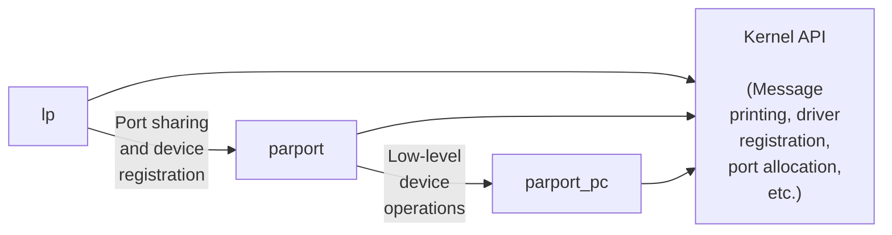

# Chapter 2: Building and Running Modules

It's almost time to begin programming. This chapter introduces all the essential concepts about modules and kernel programming. In these few pages, we build and run a complete (if relatively useless)module, and look at some of the basic code shared by all modules. Developing such expertise is an essential foundation for any kind of modularized driver. To avoid throwing in too many concepts at once, this chapter talks only about modules, without referring to any specific device class.

All the kernel items (functions, variables, header files, and macros)that are introduced here are described in a reference section at the end of the chapter.

## Setting Up Your Test System
Starting with this chapter, we present example modules to demonstrate programming concepts. (All of these examples are available on O'Reilly's FTP site, as explained in Chapter 1.)Building, loading, and modifying these examples are a good way to improve your understanding of how drivers work and interact with the kernel.

The example modules should work with almost any 2.6.x kernel, including those provided by distribution vendors. However, we recommend that you obtain a "mainline" kernel directly from the *kernel.org* mirror network, and install it on your system. Vendor kernels can be heavily patched and divergent from the mainline; at times, vendor patches can change the kernel API as seen by device drivers. If you are writing a driver that must work on a particular distribution, you will certainly want to build and test against the relevant kernels. But, for the purpose of learning about driver writing, a standard kernel is best.

Regardless of the origin of your kernel, building modules for 2.6.x requires that you have a configured and built kernel tree on your system. This requirement is a change from previous versions of the kernel, where a current set of header files was sufficient. 2.6 modules are linked against object files found in the kernel source tree; the result is a more robust module loader, but also the requirement that those object files

be available. So your first order of business is to come up with a kernel source tree (either from the *kernel.org* network or your distributor's kernel source package), build a new kernel, and install it on your system. For reasons we'll see later, life is generally easiest if you are actually running the target kernel when you build your modules, though this is not required.

You should also give some thought to where you do your module experimentation, development, and testing. We have done our best to make our example modules safe and correct, but the possibility of bugs is always present. Faults in kernel code can bring about the demise of a user process or, occasionally, the entire system. They do not normally create more serious problems, such as disk corruption. Nonetheless, it is advisable to do your kernel experimentation on a system that does not contain data that you cannot afford to lose, and that does not perform essential services. Kernel hackers typically keep a "sacrificial" system around for the purpose of testing new code.

So, if you do not yet have a suitable system with a configured and built kernel source tree on disk, now would be a good time to set that up. We'll wait. Once that task is taken care of, you'll be ready to start playing with kernel modules.

## The Hello World Module
Many programming books begin with a "hello world" example as a way of showing the simplest possible program. This book deals in kernel modules rather than programs; so, for the impatient reader, the following code is a complete "hello world" module:

```
#include <linux/init.h>
#include <linux/module.h>
MODULE_LICENSE("Dual BSD/GPL");
static int hello_init(void)
{
 printk(KERN_ALERT "Hello, world\n");
 return 0;
}
static void hello_exit(void)
{
 printk(KERN_ALERT "Goodbye, cruel world\n");
}
module_init(hello_init);
module_exit(hello_exit);
```

This module defines two functions, one to be invoked when the module is loaded into the kernel (*hello\_init*)and one for when the module is removed (*hello\_exit*). The

*module\_init* and *module\_exit* lines use special kernel macros to indicate the role of these two functions. Another special macro (*MODULE\_LICENSE*)is used to tell the kernel that this module bears a free license; without such a declaration, the kernel complains when the module is loaded.

The *printk* function is defined in the Linux kernel and made available to modules; it behaves similarly to the standard C library function *printf*. The kernel needs its own printing function because it runs by itself, without the help of the C library. The module can call *printk* because, after *insmod* has loaded it, the module is linked to the kernel and can access the kernel's public symbols (functions and variables, as detailed in the next section). The string KERN\_ALERT is the priority of the message.\* We've specified a high priority in this module, because a message with the default priority might not show up anywhere useful, depending on the kernel version you are running, the version of the *klogd* daemon, and your configuration. You can ignore this issue for now; we explain it in Chapter 4.

You can test the module with the *insmod* and *rmmod* utilities, as shown below. Note that only the superuser can load and unload a module.

```
% make
make[1]: Entering directory `/usr/src/linux-2.6.10'
 CC [M] /home/ldd3/src/misc-modules/hello.o
 Building modules, stage 2.
 MODPOST
 CC /home/ldd3/src/misc-modules/hello.mod.o
 LD [M] /home/ldd3/src/misc-modules/hello.ko
make[1]: Leaving directory `/usr/src/linux-2.6.10'
% su
root# insmod ./hello.ko
Hello, world
root# rmmod hello
Goodbye cruel world
root#
```

Please note once again that, for the above sequence of commands to work, you must have a properly configured and built kernel tree in a place where the makefile is able to find it (*/usr/src/linux-2.6.10* in the example shown). We get into the details of how modules are built in the section "Compiling and Loading."

According to the mechanism your system uses to deliver the message lines, your output may be different. In particular, the previous screen dump was taken from a text console; if you are running *insmod* and *rmmod* from a terminal emulator running under the window system, you won't see anything on your screen. The message goes to one of the system log files, such as */var/log/messages* (the name of the actual file

 The priority is just a string, such as <1>, which is prepended to the *printk* format string. Note the lack of a comma after KERN\_ALERT; adding a comma there is a common and annoying typo (which, fortunately, is caught by the compiler).

varies between Linux distributions). The mechanism used to deliver kernel messages is described in Chapter 4.

As you can see, writing a module is not as difficult as you might expect—at least, as long as the module is not required to do anything worthwhile. The hard part is understanding your device and how to maximize performance. We go deeper into modularization throughout this chapter and leave device-specific issues for later chapters.

## Kernel Modules Versus Applications
Before we go further, it's worth underlining the various differences between a kernel module and an application.

While most small and medium-sized applications perform a single task from beginning to end, every kernel module just registers itself in order to serve future requests, and its initialization function terminates immediately. In other words, the task of the module's initialization function is to prepare for later invocation of the module's functions; it's as though the module were saying, "Here I am, and this is what I can do." The module's exit function (*hello\_exit* in the example)gets invoked just before the module is unloaded. It should tell the kernel, "I'm not there anymore; don't ask me to do anything else." This kind of approach to programming is similar to eventdriven programming, but while not all applications are event-driven, each and every kernel module is. Another major difference between event-driven applications and kernel code is in the exit function: whereas an application that terminates can be lazy in releasing resources or avoids clean up altogether, the exit function of a module must carefully undo everything the *init* function built up, or the pieces remain around until the system is rebooted.

Incidentally, the ability to unload a module is one of the features of modularization that you'll most appreciate, because it helps cut down development time; you can test successive versions of your new driver without going through the lengthy shutdown/reboot cycle each time.

As a programmer, you know that an application can call functions it doesn't define: the linking stage resolves external references using the appropriate library of functions. *printf* is one of those callable functions and is defined in *libc*. A module, on the other hand, is linked only to the kernel, and the only functions it can call are the ones exported by the kernel; there are no libraries to link to. The *printk* function used in *hello.c* earlier, for example, is the version of *printf* defined within the kernel and exported to modules. It behaves similarly to the original function, with a few minor differences, the main one being lack of floating-point support.

Figure 2-1 shows how function calls and function pointers are used in a module to add new functionality to a running kernel.

```text
┌─────────────────────────────────────────────────────────────────────────┐
│                                                                         │
│  insmod ──→ ┌───────────────┐ ···→ blk_init_queue()                    │
│             │ init function │                                           │
│             └───────────────┘ ···→ add_disk()                          │
│                                         :                               │
│                                         :         ┌──────────────┐     │
│                                         :         │ struct       │     │
│   block_device ops                      ···→····→ │ gendisk      │     │
│  ┌──────────────────┐                             └──────┬───────┘     │
│  │ ════════════════ │ ←────────────────────────────────  │             │
│  │ ════════════════ │                                     ↓             │
│  │ ════════════════ │                          ┌──────────────────┐    │
│  └────────┬─────────┘                    ···→  │  request_queue_  │    │
│           │                                    └──────────────────┘    │
│  ┌────────┴──────┐                                      ↑              │
│  │  request()    │ ──→                                  │              │
│  └───────────────┘                                      │              │
│  ┌───────────────────┐ ···→ ─────────────────────────── │              │
│  │                   │ ···→ ──────────────────────────→ ┘              │
│  └───────────────────┘ ···→ ──────────────────────────→                │
│                                                                         │
│  rmmod ──→ ┌───────────────┐ ···→ del_gendisk()                        │
│            │   cleanup     │                                            │
│            │   function    │ ···→ blk_cleanup_queue()                  │
│            └───────────────┘                                            │
│                                                                         │
└─────────────────────────────────────────────────────────────────────────┘

LEGEND:
  ·····→   Data operation
  ─────→   Data pointer
  -- →     Function call
  ───→     Function pointer

  ╔══════════════════╗   Multiple functions
  ╚══════════════════╝

  ┌──────────────────┐   Single function
  └──────────────────┘

  ████████████████████   Data
```

Figure 2-1. Linking a module to the kernel

Because no library is linked to modules, source files should never include the usual header files, *<stdarg.h>* and very special situations being the only exceptions. Only functions that are actually part of the kernel itself may be used in kernel modules. Anything related to the kernel is declared in headers found in the kernel source tree you have set up and configured; most of the relevant headers live in include/linux and include/asm, but other subdirectories of include have been added to host material associated to specific kernel subsystems.

The role of individual kernel headers is introduced throughout the book as each of them is needed.

Another important difference between kernel programming and application programming is in how each environment handles faults: whereas a segmentation fault is harmless during application development and a debugger can always be used to trace the error to the problem in the source code, a kernel fault kills the current process at least, if not the whole system. We see how to trace kernel errors in Chapter 4.

### User Space and Kernel Space
A module runs in *kernel space*, whereas applications run in *user space*. This concept is at the base of operating systems theory.

The role of the operating system, in practice, is to provide programs with a consistent view of the computer's hardware. In addition, the operating system must account for independent operation of programs and protection against unauthorized access to resources. This nontrivial task is possible only if the CPU enforces protection of system software from the applications.

Every modern processor is able to enforce this behavior. The chosen approach is to implement different operating modalities (or levels)in the CPU itself. The levels have different roles, and some operations are disallowed at the lower levels; program code can switch from one level to another only through a limited number of gates. Unix systems are designed to take advantage of this hardware feature, using two such levels. All current processors have at least two protection levels, and some, like the x86 family, have more levels; when several levels exist, the highest and lowest levels are used. Under Unix, the kernel executes in the highest level (also called *supervisor mode*), where everything is allowed, whereas applications execute in the lowest level (the so-called *user mode*), where the processor regulates direct access to hardware and unauthorized access to memory.

We usually refer to the execution modes as *kernel space* and *user space*. These terms encompass not only the different privilege levels inherent in the two modes, but also the fact that each mode can have its own memory mapping—its own address space—as well.

Unix transfers execution from user space to kernel space whenever an application issues a system call or is suspended by a hardware interrupt. Kernel code executing a system call is working in the context of a process—it operates on behalf of the calling process and is able to access data in the process's address space. Code that handles interrupts, on the other hand, is asynchronous with respect to processes and is not related to any particular process.

The role of a module is to extend kernel functionality; modularized code runs in kernel space. Usually a driver performs both the tasks outlined previously: some functions in the module are executed as part of system calls, and some are in charge of interrupt handling.

### Concurrency in the Kernel
One way in which kernel programming differs greatly from conventional application programming is the issue of concurrency. Most applications, with the notable exception of multithreading applications, typically run sequentially, from the beginning to the end, without any need to worry about what else might be happening to change their environment. Kernel code does not run in such a simple world, and even the simplest kernel modules must be written with the idea that many things can be happening at once.

There are a few sources of concurrency in kernel programming. Naturally, Linux systems run multiple processes, more than one of which can be trying to use your driver at the same time. Most devices are capable of interrupting the processor; interrupt handlers run asynchronously and can be invoked at the same time that your driver is trying to do something else. Several software abstractions (such as kernel timers, introduced in Chapter 7)run asynchronously as well. Moreover, of course, Linux

can run on symmetric multiprocessor (SMP)systems, with the result that your driver could be executing concurrently on more than one CPU. Finally, in 2.6, kernel code has been made preemptible; this change causes even uniprocessor systems to have many of the same concurrency issues as multiprocessor systems.

As a result, Linux kernel code, including driver code, must be *reentrant*—it must be capable of running in more than one context at the same time. Data structures must be carefully designed to keep multiple threads of execution separate, and the code must take care to access shared data in ways that prevent corruption of the data. Writing code that handles concurrency and avoids race conditions (situations in which an unfortunate order of execution causes undesirable behavior)requires thought and can be tricky. Proper management of concurrency is required to write correct kernel code; for that reason, every sample driver in this book has been written with concurrency in mind. The techniques used are explained as we come to them; Chapter 5 has also been dedicated to this issue and the kernel primitives available for concurrency management.

A common mistake made by driver programmers is to assume that concurrency is not a problem as long as a particular segment of code does not go to sleep (or "block"). Even in previous kernels (which were not preemptive), this assumption was not valid on multiprocessor systems. In 2.6, kernel code can (almost)never assume that it can hold the processor over a given stretch of code. If you do not write your code with concurrency in mind, it will be subject to catastrophic failures that can be exceedingly difficult to debug.

### The Current Process
Although kernel modules don't execute sequentially as applications do, most actions performed by the kernel are done on behalf of a specific process. Kernel code can refer to the current process by accessing the global item current, defined in *<asm/ current.h>*, which yields a pointer to struct task\_struct, defined by *<linux/sched.h>*. The current pointer refers to the process that is currently executing. During the execution of a system call, such as *open* or *read*, the current process is the one that invoked the call. Kernel code can use process-specific information by using current, if it needs to do so. An example of this technique is presented in Chapter 6.

Actually, current is not truly a global variable. The need to support SMP systems forced the kernel developers to develop a mechanism that finds the current process on the relevant CPU. This mechanism must also be fast, since references to current happen frequently. The result is an architecture-dependent mechanism that, usually, hides a pointer to the task\_struct structure on the kernel stack. The details of the implementation remain hidden to other kernel subsystems though, and a device driver can just include *<linux/sched.h>* and refer to the current process. For example,

the following statement prints the process ID and the command name of the current process by accessing certain fields in struct task\_struct:

```
printk(KERN_INFO "The process is \"%s\" (pid %i)\n",
 current->comm, current->pid);
```

The command name stored in current->comm is the base name of the program file (trimmed to 15 characters if need be) that is being executed by the current process.

### A Few Other Details
Kernel programming differs from user-space programming in many ways. We'll point things out as we get to them over the course of the book, but there are a few fundamental issues which, while not warranting a section of their own, are worth a mention. So, as you dig into the kernel, the following issues should be kept in mind.

Applications are laid out in virtual memory with a very large stack area. The stack, of course, is used to hold the function call history and all automatic variables created by currently active functions. The kernel, instead, has a very small stack; it can be as small as a single, 4096-byte page. Your functions must share that stack with the entire kernel-space call chain. Thus, it is never a good idea to declare large automatic variables; if you need larger structures, you should allocate them dynamically at call time.

Often, as you look at the kernel API, you will encounter function names starting with a double underscore (\_\_). Functions so marked are generally a low-level component of the interface and should be used with caution. Essentially, the double underscore says to the programmer: "If you call this function, be sure you know what you are doing."

Kernel code cannot do floating point arithmetic. Enabling floating point would require that the kernel save and restore the floating point processor's state on each entry to, and exit from, kernel space—at least, on some architectures. Given that there really is no need for floating point in kernel code, the extra overhead is not worthwhile.

## Compiling and Loading
The "hello world" example at the beginning of this chapter included a brief demonstration of building a module and loading it into the system. There is, of course, a lot more to that whole process than we have seen so far. This section provides more detail on how a module author turns source code into an executing subsystem within the kernel.

### Compiling Modules
As the first step, we need to look a bit at how modules must be built. The build process for modules differs significantly from that used for user-space applications; the kernel is a large, standalone program with detailed and explicit requirements on how its pieces are put together. The build process also differs from how things were done with previous versions of the kernel; the new build system is simpler to use and produces more correct results, but it looks very different from what came before. The kernel build system is a complex beast, and we just look at a tiny piece of it. The files found in the *Documentation/kbuild* directory in the kernel source are required reading for anybody wanting to understand all that is really going on beneath the surface.

There are some prerequisites that you must get out of the way before you can build kernel modules. The first is to ensure that you have sufficiently current versions of the compiler, module utilities, and other necessary tools. The file *Documentation/Changes* in the kernel documentation directory always lists the required tool versions; you should consult it before going any further. Trying to build a kernel (and its modules) with the wrong tool versions can lead to no end of subtle, difficult problems. Note that, occasionally, a version of the compiler that is too new can be just as problematic as one that is too old; the kernel source makes a great many assumptions about the compiler, and new releases can sometimes break things for a while.

If you still do not have a kernel tree handy, or have not yet configured and built that kernel, now is the time to go do it. You cannot build loadable modules for a 2.6 kernel without this tree on your filesystem. It is also helpful (though not required)to be actually running the kernel that you are building for.

Once you have everything set up, creating a makefile for your module is straightforward. In fact, for the "hello world" example shown earlier in this chapter, a single line will suffice:

```
obj-m := hello.o
```

Readers who are familiar with *make*, but not with the 2.6 kernel build system, are likely to be wondering how this makefile works. The above line is not how a traditional makefile looks, after all. The answer, of course, is that the kernel build system handles the rest. The assignment above (which takes advantage of the extended syntax provided by GNU *make*)states that there is one module to be built from the object file *hello.o*. The resulting module is named *hello.ko* after being built from the object file.

If, instead, you have a module called *module.ko* that is generated from two source files (called, say, *file1.c* and *file2.c*), the correct incantation would be:

```
obj-m := module.o
module-objs := file1.o file2.o
```

For a makefile like those shown above to work, it must be invoked within the context of the larger kernel build system. If your kernel source tree is located in, say,

your *~/kernel-2.6* directory, the *make* command required to build your module (typed in the directory containing the module source and makefile) would be:

```
make -C ~/kernel-2.6 M=`pwd` modules
```

This command starts by changing its directory to the one provided with the -C option (that is, your kernel source directory). There it finds the kernel's top-level makefile. The M= option causes that makefile to move back into your module source directory before trying to build the modules target. This target, in turn, refers to the list of modules found in the obj-m variable, which we've set to *module.o* in our examples.

Typing the previous *make* command can get tiresome after a while, so the kernel developers have developed a sort of makefile idiom, which makes life easier for those building modules outside of the kernel tree. The trick is to write your makefile as follows:

```
# If KERNELRELEASE is defined, we've been invoked from the
# kernel build system and can use its language.
ifneq ($(KERNELRELEASE),)
 obj-m := hello.o
# Otherwise we were called directly from the command
# line; invoke the kernel build system.
else
 KERNELDIR ?= /lib/modules/$(shell uname -r)/build
 PWD := $(shell pwd)
default:
 $(MAKE) -C $(KERNELDIR) M=$(PWD) modules
endif
```

Once again, we are seeing the extended GNU *make* syntax in action. This makefile is read twice on a typical build. When the makefile is invoked from the command line, it notices that the KERNELRELEASE variable has not been set. It locates the kernel source directory by taking advantage of the fact that the symbolic link *build* in the installed modules directory points back at the kernel build tree. If you are not actually running the kernel that you are building for, you can supply a KERNELDIR= option on the command line, set the KERNELDIR environment variable, or rewrite the line that sets KERNELDIR in the makefile. Once the kernel source tree has been found, the makefile invokes the default: target, which runs a second *make* command (parameterized in the makefile as \$(MAKE))to invoke the kernel build system as described previously. On the second reading, the makefile sets obj-m, and the kernel makefiles take care of actually building the module.

This mechanism for building modules may strike you as a bit unwieldy and obscure. Once you get used to it, however, you will likely appreciate the capabilities that have been programmed into the kernel build system. Do note that the above is not a complete makefile; a real makefile includes the usual sort of targets for cleaning up

unneeded files, installing modules, etc. See the makefiles in the example source directory for a complete example.

### Loading and Unloading Modules
After the module is built, the next step is loading it into the kernel. As we've already pointed out, *insmod* does the job for you. The program loads the module code and data into the kernel, which, in turn, performs a function similar to that of *ld*, in that it links any unresolved symbol in the module to the symbol table of the kernel. Unlike the linker, however, the kernel doesn't modify the module's disk file, but rather an in-memory copy. *insmod* accepts a number of command-line options (for details, see the manpage), and it can assign values to parameters in your module before linking it to the current kernel. Thus, if a module is correctly designed, it can be configured at load time; load-time configuration gives the user more flexibility than compile-time configuration, which is still used sometimes. Load-time configuration is explained in the section "Module Parameters," later in this chapter.

Interested readers may want to look at how the kernel supports *insmod*: it relies on a system call defined in *kernel/module.c*. The function *sys\_init\_module* allocates kernel memory to hold a module (this memory is allocated with *vmalloc*; see the section "vmalloc and Friends" in Chapter 8); it then copies the module text into that memory region, resolves kernel references in the module via the kernel symbol table, and calls the module's initialization function to get everything going.

If you actually look in the kernel source, you'll find that the names of the system calls are prefixed with sys\_. This is true for all system calls and no other functions; it's useful to keep this in mind when grepping for the system calls in the sources.

The *modprobe* utility is worth a quick mention. *modprobe*, like *insmod*, loads a module into the kernel. It differs in that it will look at the module to be loaded to see whether it references any symbols that are not currently defined in the kernel. If any such references are found, *modprobe* looks for other modules in the current module search path that define the relevant symbols. When *modprobe* finds those modules (which are needed by the module being loaded), it loads them into the kernel as well. If you use *insmod* in this situation instead, the command fails with an "unresolved symbols" message left in the system logfile.

As mentioned before, modules may be removed from the kernel with the *rmmod* utility. Note that module removal fails if the kernel believes that the module is still in use (e.g., a program still has an open file for a device exported by the modules), or if the kernel has been configured to disallow module removal. It is possible to configure the kernel to allow "forced" removal of modules, even when they appear to be busy. If you reach a point where you are considering using this option, however, things are likely to have gone wrong badly enough that a reboot may well be the better course of action.

The *lsmod* program produces a list of the modules currently loaded in the kernel. Some other information, such as any other modules making use of a specific module, is also provided. *lsmod* works by reading the */proc/modules* virtual file. Information on currently loaded modules can also be found in the sysfs virtual filesystem under */sys/module*.

### Version Dependency
Bear in mind that your module's code has to be recompiled for each version of the kernel that it is linked to—at least, in the absence of modversions, not covered here as they are more for distribution makers than developers. Modules are strongly tied to the data structures and function prototypes defined in a particular kernel version; the interface seen by a module can change significantly from one kernel version to the next. This is especially true of development kernels, of course.

The kernel does not just assume that a given module has been built against the proper kernel version. One of the steps in the build process is to link your module against a file (called *vermagic.o*)from the current kernel tree; this object contains a fair amount of information about the kernel the module was built for, including the target kernel version, compiler version, and the settings of a number of important configuration variables. When an attempt is made to load a module, this information can be tested for compatibility with the running kernel. If things don't match, the module is not loaded; instead, you see something like:

#### # **insmod hello.ko**

Error inserting './hello.ko': -1 Invalid module format

A look in the system log file (*/var/log/messages* or whatever your system is configured to use) will reveal the specific problem that caused the module to fail to load.

If you need to compile a module for a specific kernel version, you will need to use the build system and source tree for that particular version. A simple change to the KERNELDIR variable in the example makefile shown previously does the trick.

Kernel interfaces often change between releases. If you are writing a module that is intended to work with multiple versions of the kernel (especially if it must work across major releases), you likely have to make use of macros and #ifdef constructs to make your code build properly. This edition of this book only concerns itself with one major version of the kernel, so you do not often see version tests in our example code. But the need for them does occasionally arise. In such cases, you want to make use of the definitions found in *linux/version.h*. This header file, automatically included by *linux/module.h*, defines the following macros:

UTS\_RELEASE

This macro expands to a string describing the version of this kernel tree. For example, "2.6.10".

#### LINUX\_VERSION\_CODE

This macro expands to the binary representation of the kernel version, one byte for each part of the version release number. For example, the code for 2.6.10 is 132618 (i.e., 0x02060a).\* With this information, you can (almost)easily determine what version of the kernel you are dealing with.

#### KERNEL\_VERSION(major,minor,release)

This is the macro used to build an integer version code from the individual numbers that build up a version number. For example, KERNEL\_VERSION(2,6,10) expands to 132618. This macro is very useful when you need to compare the current version and a known checkpoint.

Most dependencies based on the kernel version can be worked around with preprocessor conditionals by exploiting KERNEL\_VERSION and LINUX\_VERSION\_CODE. Version dependency should, however, not clutter driver code with hairy #ifdef conditionals; the best way to deal with incompatibilities is by confining them to a specific header file. As a general rule, code which is explicitly version (or platform)dependent should be hidden behind a low-level macro or function. High-level code can then just call those functions without concern for the low-level details. Code written in this way tends to be easier to read and more robust.

### Platform Dependency
Each computer platform has its peculiarities, and kernel designers are free to exploit all the peculiarities to achieve better performance in the target object file.

Unlike application developers, who must link their code with precompiled libraries and stick to conventions on parameter passing, kernel developers can dedicate some processor registers to specific roles, and they have done so. Moreover, kernel code can be optimized for a specific processor in a CPU family to get the best from the target platform: unlike applications that are often distributed in binary format, a custom compilation of the kernel can be optimized for a specific computer set.

For example, the IA32 (x86)architecture has been subdivided into several different processor types. The old 80386 processor is still supported (for now), even though its instruction set is, by modern standards, quite limited. The more modern processors in this architecture have introduced a number of new capabilities, including faster instructions for entering the kernel, interprocessor locking, copying data, etc. Newer processors can also, when operated in the correct mode, employ 36-bit (or

 This allows up to 256 development versions between stable versions.

larger)physical addresses, allowing them to address more than 4 GB of physical memory. Other processor families have seen similar improvements. The kernel, depending on various configuration options, can be built to make use of these additional features.

Clearly, if a module is to work with a given kernel, it must be built with the same understanding of the target processor as that kernel was. Once again, the *vermagic.o* object comes in to play. When a module is loaded, the kernel checks the processorspecific configuration options for the module and makes sure they match the running kernel. If the module was compiled with different options, it is not loaded.

If you are planning to write a driver for general distribution, you may well be wondering just how you can possibly support all these different variations. The best answer, of course, is to release your driver under a GPL-compatible license and contribute it to the mainline kernel. Failing that, distributing your driver in source form and a set of scripts to compile it on the user's system may be the best answer. Some vendors have released tools to make this task easier. If you must distribute your driver in binary form, you need to look at the different kernels provided by your target distributions, and provide a version of the module for each. Be sure to take into account any errata kernels that may have been released since the distribution was produced. Then, there are licensing issues to be considered, as we discussed in the section "License Terms" in Chapter 1. As a general rule, distributing things in source form is an easier way to make your way in the world.

We've seen how *insmod* resolves undefined symbols against the table of public kernel symbols. The table contains the addresses of global kernel items—functions and variables—that are needed to implement modularized drivers. When a module is loaded, any symbol exported by the module becomes part of the kernel symbol table. In the usual case, a module implements its own functionality without the need to export any symbols at all. You need to export symbols, however, whenever other modules may benefit from using them.

New modules can use symbols exported by your module, and you can stack new modules on top of other modules. Module stacking is implemented in the mainstream kernel sources as well: the *msdos* filesystem relies on symbols exported by the *fat* module, and each input USB device module stacks on the *usbcore* and *input* modules.

Module stacking is useful in complex projects. If a new abstraction is implemented in the form of a device driver, it might offer a plug for hardware-specific implementations. For example, the video-for-linux set of drivers is split into a generic module that exports symbols used by lower-level device drivers for specific hardware. According to your setup, you load the generic video module and the specific module for your installed hardware. Support for parallel ports and the wide variety of attachable

devices is handled in the same way, as is the USB kernel subsystem. Stacking in the parallel port subsystem is shown in Figure 2-2; the arrows show the communications between the modules and with the kernel programming interface.

Figure 2-2. Stacking of parallel port driver modules



When using stacked modules, it is helpful to be aware of the *modprobe* utility. As we described earlier, modprobe functions in much the same way as insmod, but it also loads any other modules that are required by the module you want to load. Thus, one modprobe command can sometimes replace several invocations of insmod (although you'll still need insmod when loading your own modules from the current directory, because *modprobe* looks only in the standard installed module directories).

Using stacking to split modules into multiple layers can help reduce development time by simplifying each layer. This is similar to the separation between mechanism and policy that we discussed in Chapter 1.

The Linux kernel header files provide a convenient way to manage the visibility of your symbols, thus reducing namespace pollution (filling the namespace with names that may conflict with those defined elsewhere in the kernel) and promoting proper information hiding. If your module needs to export symbols for other modules to use, the following macros should be used.

```
EXPORT SYMBOL(name);
EXPORT SYMBOL GPL(name);
```

Either of the above macros makes the given symbol available outside the module. The GPL version makes the symbol available to GPL-licensed modules only. Symbols must be exported in the global part of the module's file, outside of any function, because the macros expand to the declaration of a special-purpose variable that is expected to be accessible globally. This variable is stored in a special part of the module executible (an "ELF section") that is used by the kernel at load time to find the variables exported by the module. (Interested readers can look at < linux/module.h> for the details, even though the details are not needed to make things work.)

## Preliminaries
We are getting closer to looking at some actual module code. But first, we need to look at some other things that need to appear in your module source files. The kernel is a unique environment, and it imposes its own requirements on code that would interface with it.

Most kernel code ends up including a fairly large number of header files to get definitions of functions, data types, and variables. We'll examine these files as we come to them, but there are a few that are specific to modules, and must appear in every loadable module. Thus, just about all module code has the following:

```
#include <linux/module.h>
#include <linux/init.h>
```

*module.h* contains a great many definitions of symbols and functions needed by loadable modules. You need *init.h* to specify your initialization and cleanup functions, as we saw in the "hello world" example above, and which we revisit in the next section. Most modules also include *moduleparam.h* to enable the passing of parameters to the module at load time; we will get to that shortly.

It is not strictly necessary, but your module really should specify which license applies to its code. Doing so is just a matter of including a MODULE\_LICENSE line:

```
MODULE_LICENSE("GPL");
```

The specific licenses recognized by the kernel are "GPL" (for any version of the GNU General Public License), "GPL v2" (for GPL version two only), "GPL and additional rights," "Dual BSD/GPL," "Dual MPL/GPL," and "Proprietary." Unless your module is explicitly marked as being under a free license recognized by the kernel, it is assumed to be proprietary, and the kernel is "tainted" when the module is loaded. As we mentioned in the section "License Terms" in Chapter 1, kernel developers tend to be unenthusiastic about helping users who experience problems after loading proprietary modules.

Other descriptive definitions that can be contained within a module include MODULE\_AUTHOR (stating who wrote the module), MODULE\_DESCRIPTION (a human-readable statement of what the module does), MODULE\_VERSION (for a code revision number; see the comments in *<linux/module.h>* for the conventions to use in creating version strings), MODULE\_ALIAS (another name by which this module can be known), and MODULE\_DEVICE\_TABLE (to tell user space about which devices the module supports). We'll discuss MODULE\_ALIAS in Chapter 11 and MODULE\_DEVICE\_TABLE in Chapter 12.

The various MODULE\_ declarations can appear anywhere within your source file outside of a function. A relatively recent convention in kernel code, however, is to put these declarations at the end of the file.

## Initialization and Shutdown
As already mentioned, the module initialization function registers any facility offered by the module. By *facility*, we mean a new functionality, be it a whole driver or a new software abstraction, that can be accessed by an application. The actual definition of the initialization function always looks like:

```
static int __init initialization_function(void)
{
 /* Initialization code here */
}
module_init(initialization_function);
```

Initialization functions should be declared static, since they are not meant to be visible outside the specific file; there is no hard rule about this, though, as no function is exported to the rest of the kernel unless explicitly requested. The \_\_init token in the definition may look a little strange; it is a hint to the kernel that the given function is used only at initialization time. The module loader drops the initialization function after the module is loaded, making its memory available for other uses. There is a similar tag (\_\_initdata)for data used only during initialization. Use of \_\_init and \_\_initdata is optional, but it is worth the trouble. Just be sure not to use them for any function (or data structure)you will be using after initialization completes. You may also encounter \_\_devinit and \_\_devinitdata in the kernel source; these translate to \_\_init and \_\_initdata only if the kernel has not been configured for hotpluggable devices. We will look at hotplug support in Chapter 14.

The use of *module\_init* is mandatory. This macro adds a special section to the module's object code stating where the module's initialization function is to be found. Without this definition, your initialization function is never called.

Modules can register many different types of facilities, including different kinds of devices, filesystems, cryptographic transforms, and more. For each facility, there is a specific kernel function that accomplishes this registration. The arguments passed to the kernel registration functions are usually pointers to data structures describing the new facility and the name of the facility being registered. The data structure usually contains pointers to module functions, which is how functions in the module body get called.

The items that can be registered go beyond the list of device types mentioned in Chapter 1. They include, among others, serial ports, miscellaneous devices, sysfs entries, */proc* files, executable domains, and line disciplines. Many of those registrable items support functions that aren't directly related to hardware but remain in the "software abstractions" field. Those items can be registered, because they are integrated into the driver's functionality anyway (like */proc* files and line disciplines for example).

There are other facilities that can be registered as add-ons for certain drivers, but their use is so specific that it's not worth talking about them; they use the stacking technique, as described in the section "The Kernel Symbol Table." If you want to probe further, you can grep for EXPORT\_SYMBOL in the kernel sources, and find the entry points offered by different drivers. Most registration functions are prefixed with register\_, so another possible way to find them is to grep for register\_ in the kernel source.

### The Cleanup Function
Every nontrivial module also requires a cleanup function, which unregisters interfaces and returns all resources to the system before the module is removed. This function is defined as:

```
static void __exit cleanup_function(void)
{
 /* Cleanup code here */
}
module_exit(cleanup_function);
```

The cleanup function has no value to return, so it is declared void. The \_\_exit modifier marks the code as being for module unload only (by causing the compiler to place it in a special ELF section). If your module is built directly into the kernel, or if your kernel is configured to disallow the unloading of modules, functions marked \_\_exit are simply discarded. For this reason, a function marked \_\_exit can be called *only* at module unload or system shutdown time; any other use is an error. Once again, the *module\_exit* declaration is necessary to enable to kernel to find your cleanup function.

If your module does not define a cleanup function, the kernel does not allow it to be unloaded.

### Error Handling During Initialization
One thing you must always bear in mind when registering facilities with the kernel is that the registration could fail. Even the simplest action often requires memory allocation, and the required memory may not be available. So module code must always check return values, and be sure that the requested operations have actually succeeded.

If any errors occur when you register utilities, the first order of business is to decide whether the module can continue initializing itself anyway. Often, the module can continue to operate after a registration failure, with degraded functionality if necessary. Whenever possible, your module should press forward and provide what capabilities it can after things fail.

If it turns out that your module simply cannot load after a particular type of failure, you must undo any registration activities performed before the failure. Linux doesn't keep a per-module registry of facilities that have been registered, so the module must back out of everything itself if initialization fails at some point. If you ever fail to unregister what you obtained, the kernel is left in an unstable state; it contains internal pointers to code that no longer exists. In such situations, the only recourse, usually, is to reboot the system. You really do want to take care to do the right thing when an initialization error occurs.

Error recovery is sometimes best handled with the goto statement. We normally hate to use goto, but in our opinion, this is one situation where it is useful. Careful use of goto in error situations can eliminate a great deal of complicated, highly-indented, "structured" logic. Thus, in the kernel, goto is often used as shown here to deal with errors.

The following sample code (using fictitious registration and unregistration functions) behaves correctly if initialization fails at any point:

```
int __init my_init_function(void)
{
 int err;
 /* registration takes a pointer and a name */
 err = register_this(ptr1, "skull");
 if (err) goto fail_this;
 err = register_that(ptr2, "skull");
 if (err) goto fail_that;
 err = register_those(ptr3, "skull");
 if (err) goto fail_those;
 return 0; /* success */
 fail_those: unregister_that(ptr2, "skull");
 fail_that: unregister_this(ptr1, "skull");
 fail_this: return err; /* propagate the error */
 }
```

This code attempts to register three (fictitious)facilities. The goto statement is used in case of failure to cause the unregistration of only the facilities that had been successfully registered before things went bad.

Another option, requiring no hairy goto statements, is keeping track of what has been successfully registered and calling your module's cleanup function in case of any error. The cleanup function unrolls only the steps that have been successfully accomplished. This alternative, however, requires more code and more CPU time, so in fast paths you still resort to goto as the best error-recovery tool.

The return value of *my\_init\_function*, err, is an error code. In the Linux kernel, error codes are negative numbers belonging to the set defined in *<linux/errno.h>*. If you want to generate your own error codes instead of returning what you get from other

functions, you should include *<linux/errno.h>* in order to use symbolic values such as -ENODEV, -ENOMEM, and so on. It is always good practice to return appropriate error codes, because user programs can turn them to meaningful strings using *perror* or similar means.

Obviously, the module cleanup function must undo any registration performed by the initialization function, and it is customary (but not usually mandatory)to unregister facilities in the reverse order used to register them:

```
void __exit my_cleanup_function(void)
{
 unregister_those(ptr3, "skull");
 unregister_that(ptr2, "skull");
 unregister_this(ptr1, "skull");
 return;
}
```

If your initialization and cleanup are more complex than dealing with a few items, the goto approach may become difficult to manage, because all the cleanup code must be repeated within the initialization function, with several labels intermixed. Sometimes, therefore, a different layout of the code proves more successful.

What you'd do to minimize code duplication and keep everything streamlined is to call the cleanup function from within the initialization whenever an error occurs. The cleanup function then must check the status of each item before undoing its registration. In its simplest form, the code looks like the following:

```
struct something *item1;
struct somethingelse *item2;
int stuff_ok;
void my_cleanup(void)
{
 if (item1)
 release_thing(item1);
 if (item2)
 release_thing2(item2);
 if (stuff_ok)
 unregister_stuff( );
 return;
 }
int __init my_init(void)
{
 int err = -ENOMEM;
 item1 = allocate_thing(arguments);
 item2 = allocate_thing2(arguments2);
 if (!item2 || !item2)
 goto fail;
 err = register_stuff(item1, item2);
 if (!err)
```

```
 stuff_ok = 1;
 else
 goto fail;
 return 0; /* success */
 fail:
 my_cleanup( );
 return err;
}
```

As shown in this code, you may or may not need external flags to mark success of the initialization step, depending on the semantics of the registration/allocation function you call. Whether or not flags are needed, this kind of initialization scales well to a large number of items and is often better than the technique shown earlier. Note, however, that the cleanup function cannot be marked \_\_exit when it is called by nonexit code, as in the previous example.

### Module-Loading Races
Thus far, our discussion has skated over an important aspect of module loading: race conditions. If you are not careful in how you write your initialization function, you can create situations that can compromise the stability of the system as a whole. We will discuss race conditions later in this book; for now, a couple of quick points will have to suffice.

The first is that you should always remember that some other part of the kernel can make use of any facility you register immediately after that registration has completed. It is entirely possible, in other words, that the kernel will make calls into your module while your initialization function is still running. So your code must be prepared to be called as soon as it completes its first registration. Do not register any facility until all of your internal initialization needed to support that facility has been completed.

You must also consider what happens if your initialization function decides to fail, but some part of the kernel is already making use of a facility your module has registered. If this situation is possible for your module, you should seriously consider not failing the initialization at all. After all, the module has clearly succeeded in exporting something useful. If initialization must fail, it must carefully step around any possible operations going on elsewhere in the kernel until those operations have completed.

## Module Parameters
Several parameters that a driver needs to know can change from system to system. These can vary from the device number to use (as we'll see in the next chapter)to numerous aspects of how the driver should operate. For example, drivers for SCSI

adapters often have options controlling the use of tagged command queuing, and the Integrated Device Electronics (IDE)drivers allow user control of DMA operations. If your driver controls older hardware, it may also need to be told explicitly where to find that hardware's I/O ports or I/O memory addresses. The kernel supports these needs by making it possible for a driver to designate parameters that may be changed when the driver's module is loaded.

These parameter values can be assigned at load time by *insmod* or *modprobe*; the latter can also read parameter assignment from its configuration file (*/etc/modprobe. conf*). The commands accept the specification of several types of values on the command line. As a way of demonstrating this capability, imagine a much-needed enhancement to the "hello world" module (called *hellop*)shown at the beginning of this chapter. We add two parameters: an integer value called howmany and a character string called whom. Our vastly more functional module then, at load time, greets whom not just once, but howmany times. Such a module could then be loaded with a command line such as:

insmod hellop howmany=10 whom="Mom"

Upon being loaded that way, *hellop* would say "Hello, Mom" 10 times.

However, before *insmod* can change module parameters, the module must make them available. Parameters are declared with the module\_param macro, which is defined in *moduleparam.h*. module\_param takes three parameters: the name of the variable, its type, and a permissions mask to be used for an accompanying sysfs entry. The macro should be placed outside of any function and is typically found near the head of the source file. So *hellop* would declare its parameters and make them available to *insmod* as follows:

```
static char *whom = "world";
static int howmany = 1;
module_param(howmany, int, S_IRUGO);
module_param(whom, charp, S_IRUGO);
```

Numerous types are supported for module parameters:

bool

invbool

A boolean (true or false)value (the associated variable should be of type int). The invbool type inverts the value, so that true values become false and vice versa.

charp

A char pointer value. Memory is allocated for user-provided strings, and the pointer is set accordingly.

int long short uint ulong ushort

> Basic integer values of various lengths. The versions starting with u are for unsigned values.

Array parameters, where the values are supplied as a comma-separated list, are also supported by the module loader. To declare an array parameter, use:

module\_param\_array(name,type,num,perm);

Where name is the name of your array (and of the parameter), type is the type of the array elements, num is an integer variable, and perm is the usual permissions value. If the array parameter is set at load time, num is set to the number of values supplied. The module loader refuses to accept more values than will fit in the array.

If you really need a type that does not appear in the list above, there are hooks in the module code that allow you to define them; see *moduleparam.h* for details on how to do that. All module parameters should be given a default value; *insmod* changes the value only if explicitly told to by the user. The module can check for explicit parameters by testing parameters against their default values.

The final *module\_param* field is a permission value; you should use the definitions found in *<linux/stat.h>*. This value controls who can access the representation of the module parameter in sysfs. If perm is set to 0, there is no sysfs entry at all; otherwise, it appears under */sys/module*\* with the given set of permissions. Use S\_IRUGO for a parameter that can be read by the world but cannot be changed; S\_IRUGO|S\_IWUSR allows root to change the parameter. Note that if a parameter is changed by sysfs, the value of that parameter as seen by your module changes, but your module is not notified in any other way. You should probably not make module parameters writable, unless you are prepared to detect the change and react accordingly.

## Doing It in User Space
A Unix programmer who's addressing kernel issues for the first time might be nervous about writing a module. Writing a user program that reads and writes directly to the device ports may be easier.

Indeed, there are some arguments in favor of user-space programming, and sometimes writing a so-called user-space device driver is a wise alternative to kernel hacking. In this section, we discuss some of the reasons why you might write a driver in

 As of this writing, there is talk of moving parameters elsewhere within sysfs, however.

user space. This book is about kernel-space drivers, however, so we do not go beyond this introductory discussion.

The advantages of user-space drivers are:

- The full C library can be linked in. The driver can perform many exotic tasks without resorting to external programs (the utility programs implementing usage policies that are usually distributed along with the driver itself).
- The programmer can run a conventional debugger on the driver code without having to go through contortions to debug a running kernel.
- If a user-space driver hangs, you can simply kill it. Problems with the driver are unlikely to hang the entire system, unless the hardware being controlled is *really* misbehaving.
- User memory is swappable, unlike kernel memory. An infrequently used device with a huge driver won't occupy RAM that other programs could be using, except when it is actually in use.
- A well-designed driver program can still, like kernel-space drivers, allow concurrent access to a device.
- If you must write a closed-source driver, the user-space option makes it easier for you to avoid ambiguous licensing situations and problems with changing kernel interfaces.

For example, USB drivers can be written for user space; see the (still young)libusb project at libusb.sourceforge.net and "gadgetfs" in the kernel source. Another example is the X server: it knows exactly what the hardware can do and what it can't, and it offers the graphic resources to all X clients. Note, however, that there is a slow but steady drift toward frame-buffer-based graphics environments, where the X server acts only as a server based on a real kernel-space device driver for actual graphic manipulation.

Usually, the writer of a user-space driver implements a server process, taking over from the kernel the task of being the single agent in charge of hardware control. Client applications can then connect to the server to perform actual communication with the device; therefore, a smart driver process can allow concurrent access to the device. This is exactly how the X server works.

But the user-space approach to device driving has a number of drawbacks. The most important are:

- Interrupts are not available in user space. There are workarounds for this limitation on some platforms, such as the *vm86* system call on the IA32 architecture.
- Direct access to memory is possible only by *mmap*ping */dev/mem*, and only a privileged user can do that.
- Access to I/O ports is available only after calling *ioperm* or *iopl*. Moreover, not all platforms support these system calls, and access to */dev/port* can be too slow

to be effective. Both the system calls and the device file are reserved to a privileged user.

- Response time is slower, because a context switch is required to transfer information or actions between the client and the hardware.
- Worse yet, if the driver has been swapped to disk, response time is unacceptably long. Using the *mlock* system call might help, but usually you'll need to lock many memory pages, because a user-space program depends on a lot of library code. *mlock*, too, is limited to privileged users.
- The most important devices can't be handled in user space, including, but not limited to, network interfaces and block devices.

As you see, user-space drivers can't do that much after all. Interesting applications nonetheless exist: for example, support for SCSI scanner devices (implemented by the *SANE* package)and CD writers (implemented by *cdrecord* and other tools). In both cases, user-level device drivers rely on the "SCSI generic" kernel driver, which exports low-level SCSI functionality to user-space programs so they can drive their own hardware.

One case in which working in user space might make sense is when you are beginning to deal with new and unusual hardware. This way you can learn to manage your hardware without the risk of hanging the whole system. Once you've done that, encapsulating the software in a kernel module should be a painless operation.

## Quick Reference
This section summarizes the kernel functions, variables, macros, and */proc* files that we've touched on in this chapter. It is meant to act as a reference. Each item is listed after the relevant header file, if any. A similar section appears at the end of almost every chapter from here on, summarizing the new symbols introduced in the chapter. Entries in this section generally appear in the same order in which they were introduced in the chapter:

```
insmod
modprobe
rmmod
```

User-space utilities that load modules into the running kernels and remove them.

```
#include <linux/init.h>
module_init(init_function);
module_exit(cleanup_function);
```

Macros that designate a module's initialization and cleanup functions.

\_\_init

\_\_initdata

\_\_exit

\_\_exitdata

Markers for functions (\_\_init and \_\_exit)and data (\_\_initdata and \_\_exitdata) that are only used at module initialization or cleanup time. Items marked for initialization may be discarded once initialization completes; the exit items may be discarded if module unloading has not been configured into the kernel. These markers work by causing the relevant objects to be placed in a special ELF section in the executable file.

#### #include <linux/sched.h>

One of the most important header files. This file contains definitions of much of the kernel API used by the driver, including functions for sleeping and numerous variable declarations.

### struct task\_struct \*current;

The current process.

current->pid

current->comm

The process ID and command name for the current process.

obj-m

A makefile symbol used by the kernel build system to determine which modules should be built in the current directory.

*/sys/module*

*/proc/modules*

*/sys/module* is a sysfs directory hierarchy containing information on currentlyloaded modules. */proc/modules* is the older, single-file version of that information. Entries contain the module name, the amount of memory each module occupies, and the usage count. Extra strings are appended to each line to specify flags that are currently active for the module.

#### *vermagic.o*

An object file from the kernel source directory that describes the environment a module was built for.

#include <linux/module.h>

Required header. It must be included by a module source.

#include <linux/version.h>

A header file containing information on the version of the kernel being built.

LINUX\_VERSION\_CODE

Integer macro, useful to #ifdef version dependencies.

```
EXPORT_SYMBOL (symbol);
EXPORT_SYMBOL_GPL (symbol);
```

Macro used to export a symbol to the kernel. The second form exports without using versioning information, and the third limits the export to GPL-licensed modules.

```
MODULE_AUTHOR(author);
MODULE_DESCRIPTION(description);
MODULE_VERSION(version_string);
MODULE_DEVICE_TABLE(table_info);
MODULE_ALIAS(alternate_name);
```

Place documentation on the module in the object file.

```
module_init(init_function);
module_exit(exit_function);
```

Macros that declare a module's initialization and cleanup functions.

```
#include <linux/moduleparam.h>
module_param(variable, type, perm);
```

Macro that creates a module parameter that can be adjusted by the user when the module is loaded (or at boot time for built-in code). The type can be one of bool, charp, int, invbool, long, short, ushort, uint, ulong, or intarray.

```
#include <linux/kernel.h>
int printk(const char * fmt, ...);
```
