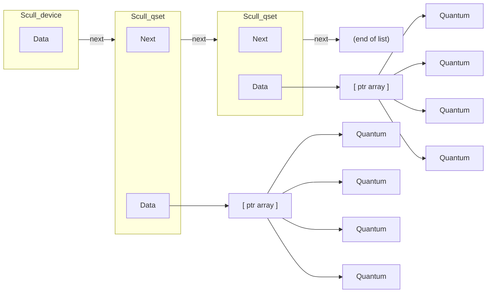
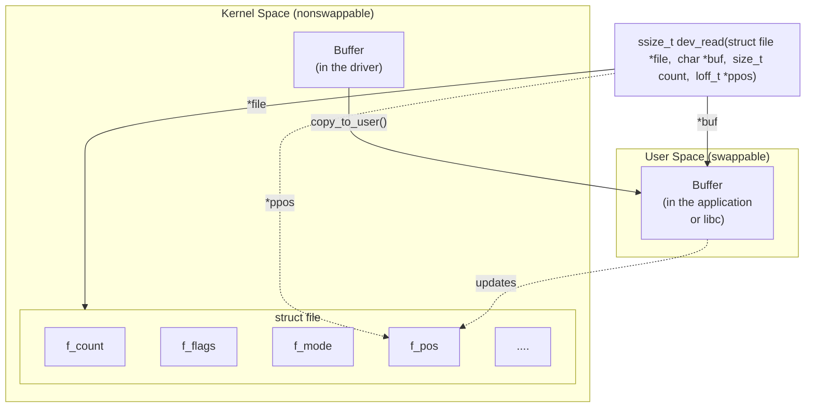

# Chapter 3: Char Drivers

The goal of this chapter is to write a complete char device driver. We develop a character driver because this class is suitable for most simple hardware devices. Char drivers are also easier to understand than block drivers or network drivers (which we get to in later chapters). Our ultimate aim is to write a *modularized* char driver, but we won't talk about modularization issues in this chapter.

Throughout the chapter, we present code fragments extracted from a real device driver: *scull* (Simple Character Utility for Loading Localities). *scull* is a char driver that acts on a memory area as though it were a device. In this chapter, because of that peculiarity of *scull*, we use the word *device* interchangeably with "the memory area used by *scull*."

The advantage of *scull* is that it isn't hardware dependent. *scull* just acts on some memory, allocated from the kernel. Anyone can compile and run *scull*, and *scull* is portable across the computer architectures on which Linux runs. On the other hand, the device doesn't do anything "useful" other than demonstrate the interface between the kernel and char drivers and allow the user to run some tests.

## The Design of scull
The first step of driver writing is defining the capabilities (the mechanism) the driver will offer to user programs. Since our "device" is part of the computer's memory, we're free to do what we want with it. It can be a sequential or random-access device, one device or many, and so on.

To make *scull* useful as a template for writing real drivers for real devices, we'll show you how to implement several device abstractions on top of the computer memory, each with a different personality.

The *scull* source implements the following devices. Each kind of device implemented by the module is referred to as a *type*.

*scull0 to scull3*

Four devices, each consisting of a memory area that is both global and persistent. Global means that if the device is opened multiple times, the data contained within the device is shared by all the file descriptors that opened it. Persistent means that if the device is closed and reopened, data isn't lost. This device can be fun to work with, because it can be accessed and tested using conventional commands, such as *cp*, *cat*, and shell I/O redirection.

### *scullpipe0 to scullpipe3*

Four FIFO (first-in-first-out) devices, which act like pipes. One process reads what another process writes. If multiple processes read the same device, they contend for data. The internals of *scullpipe* will show how blocking and nonblocking *read* and *write* can be implemented without having to resort to interrupts. Although real drivers synchronize with their devices using hardware interrupts, the topic of blocking and nonblocking operations is an important one and is separate from interrupt handling (covered in Chapter 10).

*scullsingle scullpriv sculluid scullwuid*

> These devices are similar to *scull0* but with some limitations on when an *open* is permitted. The first (*scullsingle*) allows only one process at a time to use the driver, whereas *scullpriv* is private to each virtual console (or X terminal session), because processes on each console/terminal get different memory areas. *sculluid* and *scullwuid* can be opened multiple times, but only by one user at a time; the former returns an error of "Device Busy" if another user is locking the device, whereas the latter implements blocking *open*. These variations of *scull* would appear to be confusing policy and mechanism, but they are worth looking at, because some real-life devices require this sort of management.

Each of the *scull* devices demonstrates different features of a driver and presents different difficulties. This chapter covers the internals of *scull0* to *scull3*; the more advanced devices are covered in Chapter 6. *scullpipe* is described in the section "A Blocking I/O Example," and the others are described in "Access Control on a Device File."

## Major and Minor Numbers
Char devices are accessed through names in the filesystem. Those names are called special files or device files or simply nodes of the filesystem tree; they are conventionally located in the */dev* directory. Special files for char drivers are identified by a "c" in the first column of the output of *ls –l*. Block devices appear in */dev* as well, but they are identified by a "b." The focus of this chapter is on char devices, but much of the following information applies to block devices as well.

If you issue the *ls –l* command, you'll see two numbers (separated by a comma) in the device file entries before the date of the last modification, where the file length normally appears. These numbers are the major and minor device number for the particular device. The following listing shows a few devices as they appear on a typical system. Their major numbers are 1, 4, 7, and 10, while the minors are 1, 3, 5, 64, 65, and 129.

| crw-rw-rw- | 1 root | root | 1,  |  | 3 Apr 11 2002 null       |  |
|------------|--------|------|-----|--|--------------------------|--|
| crw        | 1 root | root | 10, |  | 1 Apr 11 2002 psaux      |  |
| crw        | 1 root | root | 4,  |  | 1 Oct 28 03:04 tty1      |  |
| crw-rw-rw- | 1 root | tty  |     |  | 4, 64 Apr 11 2002 ttys0  |  |
| crw-rw     | 1 root | uucp |     |  | 4, 65 Apr 11 2002 ttyS1  |  |
| crww       | 1 vcsa | tty  | 7,  |  | 1 Apr 11 2002 vcs1       |  |
| crww       | 1 vcsa | tty  |     |  | 7, 129 Apr 11 2002 vcsa1 |  |
| crw-rw-rw- | 1 root | root | 1,  |  | 5 Apr 11 2002 zero       |  |

Traditionally, the major number identifies the driver associated with the device. For example, */dev/null* and */dev/zero* are both managed by driver 1, whereas virtual consoles and serial terminals are managed by driver 4; similarly, both *vcs1* and *vcsa1* devices are managed by driver 7. Modern Linux kernels allow multiple drivers to share major numbers, but most devices that you will see are still organized on the one-major-one-driver principle.

The minor number is used by the kernel to determine exactly which device is being referred to. Depending on how your driver is written (as we will see below), you can either get a direct pointer to your device from the kernel, or you can use the minor number yourself as an index into a local array of devices. Either way, the kernel itself knows almost nothing about minor numbers beyond the fact that they refer to devices implemented by your driver.

### The Internal Representation of Device Numbers
Within the kernel, the dev\_t type (defined in *<linux/types.h>*) is used to hold device numbers—both the major and minor parts. As of Version 2.6.0 of the kernel, dev\_t is a 32-bit quantity with 12 bits set aside for the major number and 20 for the minor number. Your code should, of course, never make any assumptions about the internal organization of device numbers; it should, instead, make use of a set of macros found in *<linux/kdev\_t.h>*. To obtain the major or minor parts of a dev\_t, use:

```
MAJOR(dev_t dev);
MINOR(dev_t dev);
```

If, instead, you have the major and minor numbers and need to turn them into a dev\_t, use:

```
MKDEV(int major, int minor);
```

Note that the 2.6 kernel can accommodate a vast number of devices, while previous kernel versions were limited to 255 major and 255 minor numbers. One assumes

that the wider range will be sufficient for quite some time, but the computing field is littered with erroneous assumptions of that nature. So you should expect that the format of dev\_t could change again in the future; if you write your drivers carefully, however, these changes will not be a problem.

### Allocating and Freeing Device Numbers
One of the first things your driver will need to do when setting up a char device is to obtain one or more device numbers to work with. The necessary function for this task is *register\_chrdev\_region*, which is declared in *<linux/fs.h>*:

```
int register_chrdev_region(dev_t first, unsigned int count,
 char *name);
```

Here, first is the beginning device number of the range you would like to allocate. The minor number portion of first is often 0, but there is no requirement to that effect. count is the total number of contiguous device numbers you are requesting. Note that, if count is large, the range you request could spill over to the next major number; but everything will still work properly as long as the number range you request is available. Finally, name is the name of the device that should be associated with this number range; it will appear in */proc/devices* and sysfs.

As with most kernel functions, the return value from *register\_chrdev\_region* will be 0 if the allocation was successfully performed. In case of error, a negative error code will be returned, and you will not have access to the requested region.

*register\_chrdev\_region* works well if you know ahead of time exactly which device numbers you want. Often, however, you will not know which major numbers your device will use; there is a constant effort within the Linux kernel development community to move over to the use of dynamicly-allocated device numbers. The kernel will happily allocate a major number for you on the fly, but you must request this allocation by using a different function:

```
int alloc_chrdev_region(dev_t *dev, unsigned int firstminor,
 unsigned int count, char *name);
```

With this function, dev is an output-only parameter that will, on successful completion, hold the first number in your allocated range. firstminor should be the requested first minor number to use; it is usually 0. The count and name parameters work like those given to *request\_chrdev\_region*.

Regardless of how you allocate your device numbers, you should free them when they are no longer in use. Device numbers are freed with:

```
void unregister_chrdev_region(dev_t first, unsigned int count);
```

The usual place to call *unregister\_chrdev\_region* would be in your module's cleanup function.

The above functions allocate device numbers for your driver's use, but they do not tell the kernel anything about what you will actually do with those numbers. Before a user-space program can access one of those device numbers, your driver needs to connect them to its internal functions that implement the device's operations. We will describe how this connection is accomplished shortly, but there are a couple of necessary digressions to take care of first.

### Dynamic Allocation of Major Numbers
Some major device numbers are statically assigned to the most common devices. A list of those devices can be found in *Documentation/devices.txt* within the kernel source tree. The chances of a static number having already been assigned for the use of your new driver are small, however, and new numbers are not being assigned. So, as a driver writer, you have a choice: you can simply pick a number that appears to be unused, or you can allocate major numbers in a dynamic manner. Picking a number may work as long as the only user of your driver is you; once your driver is more widely deployed, a randomly picked major number will lead to conflicts and trouble.

Thus, for new drivers, we strongly suggest that you use dynamic allocation to obtain your major device number, rather than choosing a number randomly from the ones that are currently free. In other words, your drivers should almost certainly be using *alloc\_chrdev\_region* rather than *register\_chrdev\_region*.

The disadvantage of dynamic assignment is that you can't create the device nodes in advance, because the major number assigned to your module will vary. For normal use of the driver, this is hardly a problem, because once the number has been assigned, you can read it from */proc/devices*.\*

To load a driver using a dynamic major number, therefore, the invocation of *insmod* can be replaced by a simple script that, after calling *insmod*, reads */proc/devices* in order to create the special file(s).

A typical */proc/devices* file looks like the following:

#### Character devices:

- 1 mem
- 2 pty
- 3 ttyp
- 4 ttyS
- 6 lp
- 7 vcs
- 10 misc
- 13 input
- 14 sound

 Even better device information can usually be obtained from sysfs, generally mounted on */sys* on 2.6-based systems. Getting *scull* to export information via sysfs is beyond the scope of this chapter, however; we'll return to this topic in Chapter 14.

```
 21 sg
180 usb
Block devices:
 2 fd
 8 sd
 11 sr
 65 sd
 66 sd
```

The script to load a module that has been assigned a dynamic number can, therefore, be written using a tool such as *awk* to retrieve information from */proc/devices* in order to create the files in */dev*.

The following script, *scull\_load*, is part of the *scull* distribution. The user of a driver that is distributed in the form of a module can invoke such a script from the system's *rc.local* file or call it manually whenever the module is needed.

```
#!/bin/sh
module="scull"
device="scull"
mode="664"
# invoke insmod with all arguments we got
# and use a pathname, as newer modutils don't look in . by default
/sbin/insmod ./$module.ko $* || exit 1
# remove stale nodes
rm -f /dev/${device}[0-3]
major=$(awk "\\$2= =\"$module\" {print \\$1}" /proc/devices)
mknod /dev/${device}0 c $major 0
mknod /dev/${device}1 c $major 1
mknod /dev/${device}2 c $major 2
mknod /dev/${device}3 c $major 3
# give appropriate group/permissions, and change the group.
# Not all distributions have staff, some have "wheel" instead.
group="staff"
grep -q '^staff:' /etc/group || group="wheel"
chgrp $group /dev/${device}[0-3]
chmod $mode /dev/${device}[0-3]
```

The script can be adapted for another driver by redefining the variables and adjusting the *mknod* lines. The script just shown creates four devices because four is the default in the *scull* sources.

The last few lines of the script may seem obscure: why change the group and mode of a device? The reason is that the script must be run by the superuser, so newly created special files are owned by root. The permission bits default so that only root has write access, while anyone can get read access. Normally, a device node requires a

different access policy, so in some way or another access rights must be changed. The default in our script is to give access to a group of users, but your needs may vary. In the section "Access Control on a Device File" in Chapter 6, the code for *sculluid* demonstrates how the driver can enforce its own kind of authorization for device access.

A *scull\_unload* script is also available to clean up the */dev* directory and remove the module.

As an alternative to using a pair of scripts for loading and unloading, you could write an init script, ready to be placed in the directory your distribution uses for these scripts.\* As part of the *scull* source, we offer a fairly complete and configurable example of an init script, called *scull.init*; it accepts the conventional arguments—start, stop, and restart—and performs the role of both *scull\_load* and *scull\_unload*.

If repeatedly creating and destroying */dev* nodes sounds like overkill, there is a useful workaround. If you are loading and unloading only a single driver, you can just use *rmmod* and *insmod* after the first time you create the special files with your script: dynamic numbers are not randomized,† and you can count on the same number being chosen each time if you don't load any other (dynamic) modules. Avoiding lengthy scripts is useful during development. But this trick, clearly, doesn't scale to more than one driver at a time.

The best way to assign major numbers, in our opinion, is by defaulting to dynamic allocation while leaving yourself the option of specifying the major number at load time, or even at compile time. The *scull* implementation works in this way; it uses a global variable, scull\_major, to hold the chosen number (there is also a scull\_minor for the minor number). The variable is initialized to SCULL\_MAJOR, defined in *scull.h*. The default value of SCULL\_MAJOR in the distributed source is 0, which means "use dynamic assignment." The user can accept the default or choose a particular major number, either by modifying the macro before compiling or by specifying a value for scull\_major on the *insmod* command line. Finally, by using the *scull\_load* script, the user can pass arguments to *insmod* on *scull\_load*'s command line.‡

Here's the code we use in *scull*'s source to get a major number:

```
if (scull_major) {
 dev = MKDEV(scull_major, scull_minor);
 result = register_chrdev_region(dev, scull_nr_devs, "scull");
} else {
 result = alloc_chrdev_region(&dev, scull_minor, scull_nr_devs,
```

- \* The Linux Standard Base specifies that init scripts should be placed in */etc/init.d*, but some distributions still place them elsewhere. In addition, if your script is to be run at boot time, you need to make a link to it from the appropriate run-level directory (i.e., *.../rc3.d*).
- † Though certain kernel developers have threatened to do exactly that in the future.
- ‡ The init script *scull.init* doesn't accept driver options on the command line, but it supports a configuration file, because it's designed for automatic use at boot and shutdown time.

```
 "scull");
 scull_major = MAJOR(dev);
}
if (result < 0) {
 printk(KERN_WARNING "scull: can't get major %d\n", scull_major);
 return result;
}
```

Almost all of the sample drivers used in this book use similar code for their major number assignment.

## Some Important Data Structures
As you can imagine, device number registration is just the first of many tasks that driver code must carry out. We will soon look at other important driver components, but one other digression is needed first. Most of the fundamental driver operations involve three important kernel data structures, called file\_operations, file, and inode. A basic familiarity with these structures is required to be able to do much of anything interesting, so we will now take a quick look at each of them before getting into the details of how to implement the fundamental driver operations.

### File Operations
So far, we have reserved some device numbers for our use, but we have not yet connected any of our driver's operations to those numbers. The file\_operations structure is how a char driver sets up this connection. The structure, defined in *<linux/fs.h>*, is a collection of function pointers. Each open file (represented internally by a file structure, which we will examine shortly) is associated with its own set of functions (by including a field called f\_op that points to a file\_operations structure). The operations are mostly in charge of implementing the system calls and are therefore, named *open*, *read*, and so on. We can consider the file to be an "object" and the functions operating on it to be its "methods," using object-oriented programming terminology to denote actions declared by an object to act on itself. This is the first sign of object-oriented programming we see in the Linux kernel, and we'll see more in later chapters.

Conventionally, a file\_operations structure or a pointer to one is called fops (or some variation thereof). Each field in the structure must point to the function in the driver that implements a specific operation, or be left NULL for unsupported operations. The exact behavior of the kernel when a NULL pointer is specified is different for each function, as the list later in this section shows.

The following list introduces all the operations that an application can invoke on a device. We've tried to keep the list brief so it can be used as a reference, merely summarizing each operation and the default kernel behavior when a NULL pointer is used.

As you read through the list of file\_operations methods, you will note that a number of parameters include the string \_\_user. This annotation is a form of documentation, noting that a pointer is a user-space address that cannot be directly dereferenced. For normal compilation, \_\_user has no effect, but it can be used by external checking software to find misuse of user-space addresses.

The rest of the chapter, after describing some other important data structures, explains the role of the most important operations and offers hints, caveats, and real code examples. We defer discussion of the more complex operations to later chapters, because we aren't ready to dig into topics such as memory management, blocking operations, and asynchronous notification quite yet.

#### struct module \*owner

The first file\_operations field is not an operation at all; it is a pointer to the module that "owns" the structure. This field is used to prevent the module from being unloaded while its operations are in use. Almost all the time, it is simply initialized to THIS\_MODULE, a macro defined in *<linux/module.h>*.

### loff\_t (\*llseek) (struct file \*, loff\_t, int);

The *llseek* method is used to change the current read/write position in a file, and the new position is returned as a (positive) return value. The loff\_t parameter is a "long offset" and is at least 64 bits wide even on 32-bit platforms. Errors are signaled by a negative return value. If this function pointer is NULL, seek calls will modify the position counter in the file structure (described in the section "The file Structure") in potentially unpredictable ways.

ssize\_t (\*read) (struct file \*, char \_\_user \*, size\_t, loff\_t \*); Used to retrieve data from the device. A null pointer in this position causes the *read* system call to fail with -EINVAL ("Invalid argument"). A nonnegative return value represents the number of bytes successfully read (the return value is a "signed size" type, usually the native integer type for the target platform).

ssize\_t (\*aio\_read)(struct kiocb \*, char \_\_user \*, size\_t, loff\_t); Initiates an asynchronous read—a read operation that might not complete before the function returns. If this method is NULL, all operations will be processed (synchronously) by *read* instead.

ssize\_t (\*write) (struct file \*, const char \_\_user \*, size\_t, loff\_t \*); Sends data to the device. If NULL, -EINVAL is returned to the program calling the *write* system call. The return value, if nonnegative, represents the number of bytes successfully written.

ssize\_t (\*aio\_write)(struct kiocb \*, const char \_\_user \*, size\_t, loff\_t \*); Initiates an asynchronous write operation on the device.

int (\*readdir) (struct file \*, void \*, filldir\_t);

This field should be NULL for device files; it is used for reading directories and is useful only for filesystems.

unsigned int (\*poll) (struct file \*, struct poll\_table\_struct \*);

The *poll* method is the back end of three system calls: *poll, epoll,* and *select*, all of which are used to query whether a read or write to one or more file descriptors would block. The *poll* method should return a bit mask indicating whether nonblocking reads or writes are possible, and, possibly, provide the kernel with information that can be used to put the calling process to sleep until I/O becomes possible. If a driver leaves its *poll* method NULL, the device is assumed to be both readable and writable without blocking.

int (\*ioctl) (struct inode \*, struct file \*, unsigned int, unsigned long); The *ioctl* system call offers a way to issue device-specific commands (such as formatting a track of a floppy disk, which is neither reading nor writing). Additionally, a few *ioctl* commands are recognized by the kernel without referring to the fops table. If the device doesn't provide an *ioctl* method, the system call returns an error for any request that isn't predefined (-ENOTTY, "No such ioctl for device").

int (\*mmap) (struct file \*, struct vm\_area\_struct \*); *mmap* is used to request a mapping of device memory to a process's address space. If this method is NULL, the *mmap* system call returns -ENODEV.

int (\*open) (struct inode \*, struct file \*); Though this is always the first operation performed on the device file, the driver is not required to declare a corresponding method. If this entry is NULL, opening the device always succeeds, but your driver isn't notified.

int (\*flush) (struct file \*);

The *flush* operation is invoked when a process closes its copy of a file descriptor for a device; it should execute (and wait for) any outstanding operations on the device. This must not be confused with the *fsync* operation requested by user programs. Currently, *flush* is used in very few drivers; the SCSI tape driver uses it, for example, to ensure that all data written makes it to the tape before the device is closed. If *flush* is NULL, the kernel simply ignores the user application request.

int (\*release) (struct inode \*, struct file \*); This operation is invoked when the file structure is being released. Like *open*, *release* can be NULL.\*

int (\*fsync) (struct file \*, struct dentry \*, int); This method is the back end of the *fsync* system call, which a user calls to flush any pending data. If this pointer is NULL, the system call returns -EINVAL.

\* Note that*release* isn't invoked every time a process calls *close*. Whenever a file structure is shared (for example, after a *fork* or a *dup*), *release* won't be invoked until all copies are closed. If you need to flush pending data when any copy is closed, you should implement the *flush* method.

int (\*aio\_fsync)(struct kiocb \*, int);

This is the asynchronous version of the *fsync* method.

int (\*fasync) (int, struct file \*, int);

This operation is used to notify the device of a change in its FASYNC flag. Asynchronous notification is an advanced topic and is described in Chapter 6. The field can be NULL if the driver doesn't support asynchronous notification.

int (\*lock) (struct file \*, int, struct file\_lock \*); The *lock* method is used to implement file locking; locking is an indispensable feature for regular files but is almost never implemented by device drivers.

ssize\_t (\*readv) (struct file \*, const struct iovec \*, unsigned long, loff\_t \*); ssize\_t (\*writev) (struct file \*, const struct iovec \*, unsigned long, loff\_t \*); These methods implement scatter/gather read and write operations. Applications occasionally need to do a single read or write operation involving multiple memory areas; these system calls allow them to do so without forcing extra copy operations on the data. If these function pointers are left NULL, the *read* and *write* methods are called (perhaps more than once) instead.

ssize\_t (\*sendfile)(struct file \*, loff\_t \*, size\_t, read\_actor\_t, void \*); This method implements the read side of the *sendfile* system call, which moves the data from one file descriptor to another with a minimum of copying. It is used, for example, by a web server that needs to send the contents of a file out a network connection. Device drivers usually leave *sendfile* NULL.

ssize\_t (\*sendpage) (struct file \*, struct page \*, int, size\_t, loff\_t \*, int);

*sendpage* is the other half of *sendfile*; it is called by the kernel to send data, one page at a time, to the corresponding file. Device drivers do not usually implement *sendpage*.

unsigned long (\*get\_unmapped\_area)(struct file \*, unsigned long, unsigned long, unsigned long, unsigned long);

The purpose of this method is to find a suitable location in the process's address space to map in a memory segment on the underlying device. This task is normally performed by the memory management code; this method exists to allow drivers to enforce any alignment requirements a particular device may have. Most drivers can leave this method NULL.

int (\*check\_flags)(int)

This method allows a module to check the flags passed to an *fcntl(F\_SETFL...)* call.

int (\*dir\_notify)(struct file \*, unsigned long);

This method is invoked when an application uses *fcntl* to request directory change notifications. It is useful only to filesystems; drivers need not implement *dir\_notify*.

The *scull* device driver implements only the most important device methods. Its file\_operations structure is initialized as follows:

```
struct file_operations scull_fops = {
 .owner = THIS_MODULE,
 .llseek = scull_llseek,
 .read = scull_read,
 .write = scull_write,
 .ioctl = scull_ioctl,
 .open = scull_open,
 .release = scull_release,
};
```

This declaration uses the standard C tagged structure initialization syntax. This syntax is preferred because it makes drivers more portable across changes in the definitions of the structures and, arguably, makes the code more compact and readable. Tagged initialization allows the reordering of structure members; in some cases, substantial performance improvements have been realized by placing pointers to frequently accessed members in the same hardware cache line.

### The file Structure
struct file, defined in *<linux/fs.h>*, is the second most important data structure used in device drivers. Note that a file has nothing to do with the FILE pointers of user-space programs. A FILE is defined in the C library and never appears in kernel code. A struct file, on the other hand, is a kernel structure that never appears in user programs.

The file structure represents an *open file*. (It is not specific to device drivers; every open file in the system has an associated struct file in kernel space.) It is created by the kernel on *open* and is passed to any function that operates on the file, until the last *close*. After all instances of the file are closed, the kernel releases the data structure.

In the kernel sources, a pointer to struct file is usually called either file or filp ("file pointer"). We'll consistently call the pointer filp to prevent ambiguities with the structure itself. Thus, file refers to the structure and filp to a pointer to the structure.

The most important fields of struct file are shown here. As in the previous section, the list can be skipped on a first reading. However, later in this chapter, when we face some real C code, we'll discuss the fields in more detail.

#### mode\_t f\_mode;

The file mode identifies the file as either readable or writable (or both), by means of the bits FMODE\_READ and FMODE\_WRITE. You might want to check this field for read/write permission in your *open* or *ioctl* function, but you don't need to check permissions for *read* and *write*, because the kernel checks before invoking your

method. An attempt to read or write when the file has not been opened for that type of access is rejected without the driver even knowing about it.

### loff\_t f\_pos;

The current reading or writing position. loff\_t is a 64-bit value on all platforms (long long in *gcc* terminology). The driver can read this value if it needs to know the current position in the file but should not normally change it; *read* and *write* should update a position using the pointer they receive as the last argument instead of acting on filp->f\_pos directly. The one exception to this rule is in the *llseek* method, the purpose of which is to change the file position.

### unsigned int f\_flags;

These are the file flags, such as O\_RDONLY, O\_NONBLOCK, and O\_SYNC. A driver should check the O\_NONBLOCK flag to see if nonblocking operation has been requested (we discuss nonblocking I/O in the section "Blocking and Nonblocking Operations" in Chapter 1); the other flags are seldom used. In particular, read/write permission should be checked using f\_mode rather than f\_flags. All the flags are defined in the header *<linux/fcntl.h>*.

#### struct file\_operations \*f\_op;

The operations associated with the file. The kernel assigns the pointer as part of its implementation of *open* and then reads it when it needs to dispatch any operations. The value in filp->f\_op is never saved by the kernel for later reference; this means that you can change the file operations associated with your file, and the new methods will be effective after you return to the caller. For example, the code for *open* associated with major number 1 (*/dev/null*, */dev/zero*, and so on) substitutes the operations in filp->f\_op depending on the minor number being opened. This practice allows the implementation of several behaviors under the same major number without introducing overhead at each system call. The ability to replace the file operations is the kernel equivalent of "method overriding" in object-oriented programming.

#### void \*private\_data;

The *open* system call sets this pointer to NULL before calling the *open* method for the driver. You are free to make its own use of the field or to ignore it; you can use the field to point to allocated data, but then you must remember to free that memory in the *release* method before the file structure is destroyed by the kernel. private\_data is a useful resource for preserving state information across system calls and is used by most of our sample modules.

#### struct dentry \*f\_dentry;

The directory entry (*dentry*) structure associated with the file. Device driver writers normally need not concern themselves with dentry structures, other than to access the inode structure as filp->f\_dentry->d\_inode.

The real structure has a few more fields, but they aren't useful to device drivers. We can safely ignore those fields, because drivers never create file structures; they only access structures created elsewhere.

### The inode Structure
The *inode* structure is used by the kernel internally to represent files. Therefore, it is different from the file structure that represents an open file descriptor. There can be numerous file structures representing multiple open descriptors on a single file, but they all point to a single inode structure.

The inode structure contains a great deal of information about the file. As a general rule, only two fields of this structure are of interest for writing driver code:

```
dev_t i_rdev;
```

For inodes that represent device files, this field contains the actual device number. struct cdev \*i\_cdev;

struct cdev is the kernel's internal structure that represents char devices; this field contains a pointer to that structure when the inode refers to a char device file.

The type of i\_rdev changed over the course of the 2.5 development series, breaking a lot of drivers. As a way of encouraging more portable programming, the kernel developers have added two macros that can be used to obtain the major and minor number from an inode:

```
unsigned int iminor(struct inode *inode);
unsigned int imajor(struct inode *inode);
```

In the interest of not being caught by the next change, these macros should be used instead of manipulating i\_rdev directly.

## Char Device Registration
As we mentioned, the kernel uses structures of type struct cdev to represent char devices internally. Before the kernel invokes your device's operations, you must allocate and register one or more of these structures.\* To do so, your code should include *<linux/cdev.h>*, where the structure and its associated helper functions are defined.

There are two ways of allocating and initializing one of these structures. If you wish to obtain a standalone cdev structure at runtime, you may do so with code such as:

```
struct cdev *my_cdev = cdev_alloc( );
my_cdev->ops = &my_fops;
```

 There is an older mechanism that avoids the use of cdev structures (which we discuss in the section "The Older Way"). New code should use the newer technique, however.

Chances are, however, that you will want to embed the cdev structure within a device-specific structure of your own; that is what *scull* does. In that case, you should initialize the structure that you have already allocated with:

```
void cdev_init(struct cdev *cdev, struct file_operations *fops);
```

Either way, there is one other struct cdev field that you need to initialize. Like the file\_operations structure, struct cdev has an owner field that should be set to THIS\_MODULE.

Once the cdev structure is set up, the final step is to tell the kernel about it with a call to:

```
int cdev_add(struct cdev *dev, dev_t num, unsigned int count);
```

Here, dev is the cdev structure, num is the first device number to which this device responds, and count is the number of device numbers that should be associated with the device. Often count is one, but there are situations where it makes sense to have more than one device number correspond to a specific device. Consider, for example, the SCSI tape driver, which allows user space to select operating modes (such as density) by assigning multiple minor numbers to each physical device.

There are a couple of important things to keep in mind when using *cdev\_add*. The first is that this call can fail. If it returns a negative error code, your device has not been added to the system. It almost always succeeds, however, and that brings up the other point: as soon as *cdev\_add* returns, your device is "live" and its operations can be called by the kernel. You should not call *cdev\_add* until your driver is completely ready to handle operations on the device.

To remove a char device from the system, call:

```
void cdev_del(struct cdev *dev);
```

Clearly, you should not access the cdev structure after passing it to *cdev\_del*.

### Device Registration in scull
Internally, *scull* represents each device with a structure of type struct scull\_dev. This structure is defined as:

```
struct scull_dev {
 struct scull_qset *data; /* Pointer to first quantum set */
 int quantum; /* the current quantum size */
 int qset; /* the current array size */
 unsigned long size; /* amount of data stored here */
 unsigned int access_key; /* used by sculluid and scullpriv */
 struct semaphore sem; /* mutual exclusion semaphore */
 struct cdev cdev; /* Char device structure */
};
```

We discuss the various fields in this structure as we come to them, but for now, we call attention to cdev, the struct cdev that interfaces our device to the kernel. This

structure must be initialized and added to the system as described above; the *scull* code that handles this task is:

```
static void scull_setup_cdev(struct scull_dev *dev, int index)
{
 int err, devno = MKDEV(scull_major, scull_minor + index);
 cdev_init(&dev->cdev, &scull_fops);
 dev->cdev.owner = THIS_MODULE;
 dev->cdev.ops = &scull_fops;
 err = cdev_add (&dev->cdev, devno, 1);
 /* Fail gracefully if need be */
 if (err)
 printk(KERN_NOTICE "Error %d adding scull%d", err, index);
}
```

Since the cdev structure is embedded within struct scull\_dev, *cdev\_init* must be called to perform the initialization of that structure.

### The Older Way
If you dig through much driver code in the 2.6 kernel, you may notice that quite a few char drivers do not use the cdev interface that we have just described. What you are seeing is older code that has not yet been upgraded to the 2.6 interface. Since that code works as it is, this upgrade may not happen for a long time. For completeness, we describe the older char device registration interface, but new code should not use it; this mechanism will likely go away in a future kernel.

The classic way to register a char device driver is with:

```
int register_chrdev(unsigned int major, const char *name,
 struct file_operations *fops);
```

Here, major is the major number of interest, name is the name of the driver (it appears in */proc/devices*), and fops is the default file\_operations structure. A call to *register\_chrdev* registers minor numbers 0–255 for the given major, and sets up a default cdev structure for each. Drivers using this interface must be prepared to handle *open* calls on all 256 minor numbers (whether they correspond to real devices or not), and they cannot use major or minor numbers greater than 255.

If you use *register\_chrdev*, the proper function to remove your device(s) from the system is:

```
int unregister_chrdev(unsigned int major, const char *name);
```

major and name must be the same as those passed to *register\_chrdev*, or the call will fail.

## open and release
Now that we've taken a quick look at the fields, we start using them in real *scull* functions.

### The open Method
The *open* method is provided for a driver to do any initialization in preparation for later operations. In most drivers, *open* should perform the following tasks:

- Check for device-specific errors (such as device-not-ready or similar hardware problems)
- Initialize the device if it is being opened for the first time
- Update the f\_op pointer, if necessary
- Allocate and fill any data structure to be put in filp->private\_data

The first order of business, however, is usually to identify which device is being opened. Remember that the prototype for the *open* method is:

```
int (*open)(struct inode *inode, struct file *filp);
```

The *inode* argument has the information we need in the form of its i\_cdev field, which contains the cdev structure we set up before. The only problem is that we do not normally want the cdev structure itself, we want the scull\_dev structure that contains that cdev structure. The C language lets programmers play all sorts of tricks to make that kind of conversion; programming such tricks is error prone, however, and leads to code that is difficult for others to read and understand. Fortunately, in this case, the kernel hackers have done the tricky stuff for us, in the form of the *container\_of* macro, defined in *<linux/kernel.h>*:

```
container_of(pointer, container_type, container_field);
```

This macro takes a pointer to a field of type container\_field, within a structure of type container\_type, and returns a pointer to the containing structure. In *scull\_open*, this macro is used to find the appropriate device structure:

```
struct scull_dev *dev; /* device information */
dev = container_of(inode->i_cdev, struct scull_dev, cdev);
filp->private_data = dev; /* for other methods */
```

Once it has found the scull\_dev structure, *scull* stores a pointer to it in the private\_data field of the file structure for easier access in the future.

The other way to identify the device being opened is to look at the minor number stored in the inode structure. If you register your device with *register\_chrdev*, you must use this technique. Be sure to use *iminor* to obtain the minor number from the inode structure, and make sure that it corresponds to a device that your driver is actually prepared to handle.

The (slightly simplified) code for *scull\_open* is:

```
int scull_open(struct inode *inode, struct file *filp)
{
 struct scull_dev *dev; /* device information */
 dev = container_of(inode->i_cdev, struct scull_dev, cdev);
 filp->private_data = dev; /* for other methods */
 /* now trim to 0 the length of the device if open was write-only */
 if ( (filp->f_flags & O_ACCMODE) = = O_WRONLY) {
 scull_trim(dev); /* ignore errors */
 }
 return 0; /* success */
}
```

The code looks pretty sparse, because it doesn't do any particular device handling when *open* is called. It doesn't need to, because the *scull* device is global and persistent by design. Specifically, there's no action such as "initializing the device on first open," because we don't keep an open count for *scull*s.

The only real operation performed on the device is truncating it to a length of 0 when the device is opened for writing. This is performed because, by design, overwriting a *scull* device with a shorter file results in a shorter device data area. This is similar to the way opening a regular file for writing truncates it to zero length. The operation does nothing if the device is opened for reading.

We'll see later how a real initialization works when we look at the code for the other *scull* personalities.

### The release Method
The role of the *release* method is the reverse of *open*. Sometimes you'll find that the method implementation is called *device*\_close instead of *device*\_release. Either way, the device method should perform the following tasks:

- Deallocate anything that *open* allocated in filp->private\_data
- Shut down the device on last close

The basic form of *scull* has no hardware to shut down, so the code required is minimal:\*

```
int scull_release(struct inode *inode, struct file *filp)
{
 return 0;
}
```

 The other flavors of the device are closed by different functions because *scull\_open* substituted a different filp->f\_op for each device. We'll discuss these as we introduce each flavor.

You may be wondering what happens when a device file is closed more times than it is opened. After all, the *dup* and *fork* system calls create copies of open files without calling *open*; each of those copies is then closed at program termination. For example, most programs don't open their *stdin* file (or device), but all of them end up closing it. How does a driver know when an open device file has *really* been closed?

The answer is simple: not every *close* system call causes the *release* method to be invoked. Only the calls that actually release the device data structure invoke the method—hence its name. The kernel keeps a counter of how many times a file structure is being used. Neither *fork* nor *dup* creates a new file structure (only *open* does that); they just increment the counter in the existing structure. The *close* system call executes the *release* method only when the counter for the file structure drops to 0, which happens when the structure is destroyed. This relationship between the *release* method and the *close* system call guarantees that your driver sees only one *release* call for each *open*.

Note that the *flush* method *is* called every time an application calls *close*. However, very few drivers implement *flush*, because usually there's nothing to perform at close time unless *release* is involved.

As you may imagine, the previous discussion applies even when the application terminates without explicitly closing its open files: the kernel automatically closes any file at process exit time by internally using the *close* system call.

## scull's Memory Usage
Before introducing the *read* and *write* operations, we'd better look at how and why *scull* performs memory allocation. "How" is needed to thoroughly understand the code, and "why" demonstrates the kind of choices a driver writer needs to make, although *scull* is definitely not typical as a device.

This section deals only with the memory allocation policy in *scull* and doesn't show the hardware management skills you need to write real drivers. These skills are introduced in Chapters 9 and 10. Therefore, you can skip this section if you're not interested in understanding the inner workings of the memory-oriented *scull* driver.

The region of memory used by *scull*, also called a *device*, is variable in length. The more you write, the more it grows; trimming is performed by overwriting the device with a shorter file.

The *scull* driver introduces two core functions used to manage memory in the Linux kernel. These functions, defined in *<linux/slab.h>*, are:

```
void *kmalloc(size_t size, int flags);
void kfree(void *ptr);
```

A call to *kmalloc* attempts to allocate size bytes of memory; the return value is a pointer to that memory or NULL if the allocation fails. The flags argument is used to

describe how the memory should be allocated; we examine those flags in detail in Chapter 8. For now, we always use GFP\_KERNEL. Allocated memory should be freed with *kfree*. You should never pass anything to *kfree* that was not obtained from *kmalloc*. It is, however, legal to pass a NULL pointer to *kfree*.

*kmalloc* is not the most efficient way to allocate large areas of memory (see Chapter 8), so the implementation chosen for *scull* is not a particularly smart one. The source code for a smart implementation would be more difficult to read, and the aim of this section is to show *read* and *write*, not memory management. That's why the code just uses *kmalloc* and *kfree* without resorting to allocation of whole pages, although that approach would be more efficient.

On the flip side, we didn't want to limit the size of the "device" area, for both a philosophical reason and a practical one. Philosophically, it's always a bad idea to put arbitrary limits on data items being managed. Practically, *scull* can be used to temporarily eat up your system's memory in order to run tests under low-memory conditions. Running such tests might help you understand the system's internals. You can use the command *cp /dev/zero /dev/scull0* to eat all the real RAM with *scull*, and you can use the *dd* utility to choose how much data is copied to the *scull* device.

In *scull*, each device is a linked list of pointers, each of which points to a scull\_dev structure. Each such structure can refer, by default, to at most four million bytes, through an array of intermediate pointers. The released source uses an array of 1000 pointers to areas of 4000 bytes. We call each memory area a *quantum* and the array (or its length) a *quantum set*. A *scull* device and its memory areas are shown in Figure 3-1.



Figure 3-1. The layout of a scull device

The chosen numbers are such that writing a single byte in *scull* consumes 8000 or 12,000 thousand bytes of memory: 4000 for the quantum and 4000 or 8000 for the quantum set (according to whether a pointer is represented in 32 bits or 64 bits on the target platform). If, instead, you write a huge amount of data, the overhead of the linked list is not too bad. There is only one list element for every four megabytes of data, and the maximum size of the device is limited by the computer's memory size.

Choosing the appropriate values for the quantum and the quantum set is a question of policy, rather than mechanism, and the optimal sizes depend on how the device is used. Thus, the *scull* driver should not force the use of any particular values for the quantum and quantum set sizes. In *scull*, the user can change the values in charge in several ways: by changing the macros SCULL\_QUANTUM and SCULL\_QSET in *scull.h* at compile time, by setting the integer values scull\_quantum and scull\_qset at module load time, or by changing both the current and default values using *ioctl* at runtime.

Using a macro and an integer value to allow both compile-time and load-time configuration is reminiscent of how the major number is selected. We use this technique for whatever value in the driver is arbitrary or related to policy.

The only question left is how the default numbers have been chosen. In this particular case, the problem is finding the best balance between the waste of memory resulting from half-filled quanta and quantum sets and the overhead of allocation, deallocation, and pointer chaining that occurs if quanta and sets are small. Additionally, the internal design of *kmalloc* should be taken into account. (We won't pursue the point now, though; the innards of *kmalloc* are explored in Chapter 8.) The choice of default numbers comes from the assumption that massive amounts of data are likely to be written to *scull* while testing it, although normal use of the device will most likely transfer just a few kilobytes of data.

We have already seen the scull\_dev structure that represents our device internally. That structure's quantum and qset fields hold the device's quantum and quantum set sizes, respectively. The actual data, however, is tracked by a different structure, which we call struct scull\_qset:

```
struct scull_qset {
 void **data;
 struct scull_qset *next;
};
```

The next code fragment shows in practice how struct scull\_dev and struct scull\_qset are used to hold data. The function *scull\_trim* is in charge of freeing the whole data area and is invoked by *scull\_open* when the file is opened for writing. It simply walks through the list and frees any quantum and quantum set it finds.

```
int scull_trim(struct scull_dev *dev)
{
 struct scull_qset *next, *dptr;
 int qset = dev->qset; /* "dev" is not-null */
 int i;
```

```
 for (dptr = dev->data; dptr; dptr = next) { /* all the list items */
 if (dptr->data) {
 for (i = 0; i < qset; i++)
 kfree(dptr->data[i]);
 kfree(dptr->data);
 dptr->data = NULL;
 }
 next = dptr->next;
 kfree(dptr);
 }
 dev->size = 0;
 dev->quantum = scull_quantum;
 dev->qset = scull_qset;
 dev->data = NULL;
 return 0;
```

*scull\_trim* is also used in the module cleanup function to return memory used by *scull* to the system.

## read and write
}

The *read* and *write* methods both perform a similar task, that is, copying data from and to application code. Therefore, their prototypes are pretty similar, and it's worth introducing them at the same time:

```
ssize_t read(struct file *filp, char __user *buff,
 size_t count, loff_t *offp);
ssize_t write(struct file *filp, const char __user *buff,
 size_t count, loff_t *offp);
```

For both methods, filp is the file pointer and count is the size of the requested data transfer. The buff argument points to the user buffer holding the data to be written or the empty buffer where the newly read data should be placed. Finally, offp is a pointer to a "long offset type" object that indicates the file position the user is accessing. The return value is a "signed size type"; its use is discussed later.

Let us repeat that the buff argument to the *read* and *write* methods is a user-space pointer. Therefore, it cannot be directly dereferenced by kernel code. There are a few reasons for this restriction:

- Depending on which architecture your driver is running on, and how the kernel was configured, the user-space pointer may not be valid while running in kernel mode at all. There may be no mapping for that address, or it could point to some other, random data.
- Even if the pointer does mean the same thing in kernel space, user-space memory is paged, and the memory in question might not be resident in RAM when the system call is made. Attempting to reference the user-space memory directly could generate a page fault, which is something that kernel code is not allowed

to do. The result would be an "oops," which would result in the death of the process that made the system call.

• The pointer in question has been supplied by a user program, which could be buggy or malicious. If your driver ever blindly dereferences a user-supplied pointer, it provides an open doorway allowing a user-space program to access or overwrite memory anywhere in the system. If you do not wish to be responsible for compromising the security of your users' systems, you cannot ever dereference a user-space pointer directly.

Obviously, your driver must be able to access the user-space buffer in order to get its job done. This access must always be performed by special, kernel-supplied functions, however, in order to be safe. We introduce some of those functions (which are defined in *<asm/uaccess.h>*) here, and the rest in the section "Using the ioctl Argument" in Chapter 1; they use some special, architecture-dependent magic to ensure that data transfers between kernel and user space happen in a safe and correct way.

The code for *read* and *write* in *scull* needs to copy a whole segment of data to or from the user address space. This capability is offered by the following kernel functions, which copy an arbitrary array of bytes and sit at the heart of most *read* and *write* implementations:

```
unsigned long copy_to_user(void __user *to,
 const void *from,
 unsigned long count);
unsigned long copy_from_user(void *to,
 const void __user *from,
 unsigned long count);
```

Although these functions behave like normal *memcpy* functions, a little extra care must be used when accessing user space from kernel code. The user pages being addressed might not be currently present in memory, and the virtual memory subsystem can put the process to sleep while the page is being transferred into place. This happens, for example, when the page must be retrieved from swap space. The net result for the driver writer is that any function that accesses user space must be reentrant, must be able to execute concurrently with other driver functions, and, in particular, must be in a position where it can legally sleep. We return to this subject in Chapter 5.

The role of the two functions is not limited to copying data to and from user-space: they also check whether the user space pointer is valid. If the pointer is invalid, no copy is performed; if an invalid address is encountered during the copy, on the other hand, only part of the data is copied. In both cases, the return value is the amount of memory still to be copied. The *scull* code looks for this error return, and returns -EFAULT to the user if it's not 0.

The topic of user-space access and invalid user space pointers is somewhat advanced and is discussed in Chapter 6. However, it's worth noting that if you don't need to

check the user-space pointer you can invoke *\_\_copy\_to\_user* and *\_\_copy\_from\_user* instead. This is useful, for example, if you know you already checked the argument. Be careful, however; if, in fact, you do *not* check a user-space pointer that you pass to these functions, then you can create kernel crashes and/or security holes.

As far as the actual device methods are concerned, the task of the *read* method is to copy data from the device to user space (using *copy\_to\_user*), while the *write* method must copy data from user space to the device (using *copy\_from\_user*). Each *read* or *write* system call requests transfer of a specific number of bytes, but the driver is free to transfer less data—the exact rules are slightly different for reading and writing and are described later in this chapter.

Whatever the amount of data the methods transfer, they should generally update the file position at \*offp to represent the current file position after successful completion of the system call. The kernel then propagates the file position change back into the file structure when appropriate. The *pread* and *pwrite* system calls have different semantics, however; they operate from a given file offset and do not change the file position as seen by any other system calls. These calls pass in a pointer to the user-supplied position, and discard the changes that your driver makes.

Figure 3-2 represents how a typical *read* implementation uses its arguments.



*Figure 3-2. The arguments to read*

Both the *read* and *write* methods return a negative value if an error occurs. A return value greater than or equal to 0, instead, tells the calling program how many bytes have been successfully transferred. If some data is transferred correctly and then an error happens, the return value must be the count of bytes successfully transferred,

and the error does not get reported until the next time the function is called. Implementing this convention requires, of course, that your driver remember that the error has occurred so that it can return the error status in the future.

Although kernel functions return a negative number to signal an error, and the value of the number indicates the kind of error that occurred (as introduced in Chapter 2), programs that run in user space always see –1 as the error return value. They need to access the errno variable to find out what happened. The user-space behavior is dictated by the POSIX standard, but that standard does not make requirements on how the kernel operates internally.

### The read Method
The return value for *read* is interpreted by the calling application program:

- If the value equals the count argument passed to the *read* system call, the requested number of bytes has been transferred. This is the optimal case.
- If the value is positive, but smaller than count, only part of the data has been transferred. This may happen for a number of reasons, depending on the device. Most often, the application program retries the read. For instance, if you read using the *fread* function, the library function reissues the system call until completion of the requested data transfer.
- If the value is 0, end-of-file was reached (and no data was read).
- A negative value means there was an error. The value specifies what the error was, according to *<linux/errno.h>*. Typical values returned on error include -EINTR (interrupted system call) or -EFAULT (bad address).

What is missing from the preceding list is the case of "there is no data, but it may arrive later." In this case, the *read* system call should block. We'll deal with blocking input in Chapter 6.

The *scull* code takes advantage of these rules. In particular, it takes advantage of the partial-read rule. Each invocation of *scull\_read* deals only with a single data quantum, without implementing a loop to gather all the data; this makes the code shorter and easier to read. If the reading program really wants more data, it reiterates the call. If the standard I/O library (i.e., *fread*) is used to read the device, the application won't even notice the quantization of the data transfer.

If the current read position is greater than the device size, the *read* method of *scull* returns 0 to signal that there's no data available (in other words, we're at end-of-file). This situation can happen if process A is reading the device while process B opens it for writing, thus truncating the device to a length of 0. Process A suddenly finds itself past end-of-file, and the next *read* call returns 0.

Here is the code for *read* (ignore the calls to *down\_interruptible* and *up* for now; we will get to them in the next chapter):

```
ssize_t scull_read(struct file *filp, char __user *buf, size_t count,
 loff_t *f_pos)
{
 struct scull_dev *dev = filp->private_data;
 struct scull_qset *dptr; /* the first listitem */
 int quantum = dev->quantum, qset = dev->qset;
 int itemsize = quantum * qset; /* how many bytes in the listitem */
 int item, s_pos, q_pos, rest;
 ssize_t retval = 0;
 if (down_interruptible(&dev->sem))
 return -ERESTARTSYS;
 if (*f_pos >= dev->size)
 goto out;
 if (*f_pos + count > dev->size)
 count = dev->size - *f_pos;
 /* find listitem, qset index, and offset in the quantum */
 item = (long)*f_pos / itemsize;
 rest = (long)*f_pos % itemsize;
 s_pos = rest / quantum; q_pos = rest % quantum;
 /* follow the list up to the right position (defined elsewhere) */
 dptr = scull_follow(dev, item);
 if (dptr = = NULL || !dptr->data || ! dptr->data[s_pos])
 goto out; /* don't fill holes */
 /* read only up to the end of this quantum */
 if (count > quantum - q_pos)
 count = quantum - q_pos;
 if (copy_to_user(buf, dptr->data[s_pos] + q_pos, count)) {
 retval = -EFAULT;
 goto out;
 }
 *f_pos += count;
 retval = count;
 out:
 up(&dev->sem);
 return retval;
}
```

### The write Method
*write*, like *read*, can transfer less data than was requested, according to the following rules for the return value:

- If the value equals count, the requested number of bytes has been transferred.
- If the value is positive, but smaller than count, only part of the data has been transferred. The program will most likely retry writing the rest of the data.
- If the value is 0, nothing was written. This result is not an error, and there is no reason to return an error code. Once again, the standard library retries the call to *write*. We'll examine the exact meaning of this case in Chapter 6, where blocking *write* is introduced.
- A negative value means an error occurred; as for *read*, valid error values are those defined in *<linux/errno.h>*.

Unfortunately, there may still be misbehaving programs that issue an error message and abort when a partial transfer is performed. This happens because some programmers are accustomed to seeing *write* calls that either fail or succeed completely, which is actually what happens most of the time and should be supported by devices as well. This limitation in the *scull* implementation could be fixed, but we didn't want to complicate the code more than necessary.

The *scull* code for *write* deals with a single quantum at a time, as the *read* method does:

```
ssize_t scull_write(struct file *filp, const char __user *buf, size_t count,
 loff_t *f_pos)
{
 struct scull_dev *dev = filp->private_data;
 struct scull_qset *dptr;
 int quantum = dev->quantum, qset = dev->qset;
 int itemsize = quantum * qset;
 int item, s_pos, q_pos, rest;
 ssize_t retval = -ENOMEM; /* value used in "goto out" statements */
 if (down_interruptible(&dev->sem))
 return -ERESTARTSYS;
 /* find listitem, qset index and offset in the quantum */
 item = (long)*f_pos / itemsize;
 rest = (long)*f_pos % itemsize;
 s_pos = rest / quantum; q_pos = rest % quantum;
 /* follow the list up to the right position */
 dptr = scull_follow(dev, item);
 if (dptr = = NULL)
 goto out;
 if (!dptr->data) {
 dptr->data = kmalloc(qset * sizeof(char *), GFP_KERNEL);
 if (!dptr->data)
```

```
 goto out;
 memset(dptr->data, 0, qset * sizeof(char *));
 }
 if (!dptr->data[s_pos]) {
 dptr->data[s_pos] = kmalloc(quantum, GFP_KERNEL);
 if (!dptr->data[s_pos])
 goto out;
 }
 /* write only up to the end of this quantum */
 if (count > quantum - q_pos)
 count = quantum - q_pos;
 if (copy_from_user(dptr->data[s_pos]+q_pos, buf, count)) {
 retval = -EFAULT;
 goto out;
 }
 *f_pos += count;
 retval = count;
 /* update the size */
 if (dev->size < *f_pos)
 dev->size = *f_pos;
 out:
 up(&dev->sem);
 return retval;
```

### readv and writev
}

Unix systems have long supported two system calls named *readv* and *writev*. These "vector" versions of *read* and *write* take an array of structures, each of which contains a pointer to a buffer and a length value. A *readv* call would then be expected to read the indicated amount into each buffer in turn. *writev*, instead, would gather together the contents of each buffer and put them out as a single write operation.

If your driver does not supply methods to handle the vector operations, *readv* and *writev* are implemented with multiple calls to your *read* and *write* methods. In many situations, however, greater efficiency is acheived by implementing *readv* and *writev* directly.

The prototypes for the vector operations are:

```
ssize_t (*readv) (struct file *filp, const struct iovec *iov,
 unsigned long count, loff_t *ppos);
ssize_t (*writev) (struct file *filp, const struct iovec *iov,
 unsigned long count, loff_t *ppos);
```

Here, the filp and ppos arguments are the same as for *read* and *write*. The iovec structure, defined in *<linux/uio.h>*, looks like:

```
struct iovec
{
```

```
 void _ _user *iov_base;
 __kernel_size_t iov_len;
};
```

Each iovec describes one chunk of data to be transferred; it starts at iov\_base (in user space) and is iov\_len bytes long. The count parameter tells the method how many iovec structures there are. These structures are created by the application, but the kernel copies them into kernel space before calling the driver.

The simplest implementation of the vectored operations would be a straightforward loop that just passes the address and length out of each iovec to the driver's *read* or *write* function. Often, however, efficient and correct behavior requires that the driver do something smarter. For example, a *writev* on a tape drive should write the contents of all the iovec structures as a single record on the tape.

Many drivers, however, gain no benefit from implementing these methods themselves. Therefore, *scull* omits them. The kernel emulates them with *read* and *write*, and the end result is the same.

## Playing with the New Devices
Once you are equipped with the four methods just described, the driver can be compiled and tested; it retains any data you write to it until you overwrite it with new data. The device acts like a data buffer whose length is limited only by the amount of real RAM available. You can try using *cp*, *dd*, and input/output redirection to test out the driver.

The *free* command can be used to see how the amount of free memory shrinks and expands according to how much data is written into *scull*.

To get more confident with reading and writing one quantum at a time, you can add a *printk* at an appropriate point in the driver and watch what happens while an application reads or writes large chunks of data. Alternatively, use the *strace* utility to monitor the system calls issued by a program, together with their return values. Tracing a *cp* or an *ls -l > /dev/scull0* shows quantized reads and writes. Monitoring (and debugging) techniques are presented in detail in Chapter 4

## Quick Reference
This chapter introduced the following symbols and header files. The list of the fields in struct file\_operations and struct file is not repeated here.

```
#include <linux/types.h>
dev_t
    dev_t is the type used to represent device numbers within the kernel.
int MAJOR(dev_t dev);
int MINOR(dev_t dev);
    Macros that extract the major and minor numbers from a device number.
dev_t MKDEV(unsigned int major, unsigned int minor);
    Macro that builds a dev_t data item from the major and minor numbers.
#include <linux/fs.h>
    The "filesystem" header is the header required for writing device drivers. Many
    important functions and data structures are declared in here.
int register_chrdev_region(dev_t first, unsigned int count, char *name)
int alloc_chrdev_region(dev_t *dev, unsigned int firstminor, unsigned int
 count, char *name)
void unregister_chrdev_region(dev_t first, unsigned int count);
    Functions that allow a driver to allocate and free ranges of device numbers.
    register_chrdev_region should be used when the desired major number is known
    in advance; for dynamic allocation, use alloc_chrdev_region instead.
int register_chrdev(unsigned int major, const char *name, struct file_operations
 *fops);
    The old (pre-2.6) char device registration routine. It is emulated in the 2.6 ker-
    nel but should not be used for new code. If the major number is not 0, it is used
    unchanged; otherwise a dynamic number is assigned for this device.
int unregister_chrdev(unsigned int major, const char *name);
    Function that undoes a registration made with register_chrdev. Both major and
    the name string must contain the same values that were used to register the
    driver.
struct file_operations;
struct file;
struct inode;
    Three important data structures used by most device drivers. The file_operations
    structure holds a char driver's methods; struct file represents an open file, and
    struct inode represents a file on disk.
#include <linux/cdev.h>
struct cdev *cdev_alloc(void);
void cdev_init(struct cdev *dev, struct file_operations *fops);
```

int cdev\_add(struct cdev \*dev, dev\_t num, unsigned int count);

Functions for the management of cdev structures, which represent char devices

void cdev\_del(struct cdev \*dev);

within the kernel.

#include <linux/kernel.h>

container\_of(pointer, type, field);

A convenience macro that may be used to obtain a pointer to a structure from a pointer to some other structure contained within it.

#include <asm/uaccess.h>

This include file declares functions used by kernel code to move data to and from user space.

unsigned long copy\_from\_user (void \*to, const void \*from, unsigned long count);

unsigned long copy\_to\_user (void \*to, const void \*from, unsigned long count); Copy data between user space and kernel space.
