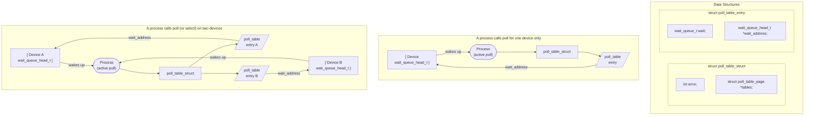

# Chapter 6: Advanced Char Driver Operations

In Chapter 3, we built a complete device driver that the user can write to and read from. But a real device usually offers more functionality than synchronous *read* and *write*. Now that we're equipped with debugging tools should something go awry and a firm understanding of concurrency issues to help keep things from going awry—we can safely go ahead and create a more advanced driver.

This chapter examines a few concepts that you need to understand to write fully featured char device drivers. We start with implementing the *ioctl* system call, which is a common interface used for device control. Then we proceed to various ways of synchronizing with user space; by the end of this chapter you have a good idea of how to put processes to sleep (and wake them up), implement nonblocking I/O, and inform user space when your devices are available for reading or writing. We finish with a look at how to implement a few different device access policies within drivers.

The ideas discussed here are demonstrated by way of a couple of modified versions of the *scull* driver. Once again, everything is implemented using in-memory virtual devices, so you can try out the code yourself without needing to have any particular hardware. By now, you may be wanting to get your hands dirty with real hardware, but that will have to wait until Chapter 9.

# ioctl
Most drivers need—in addition to the ability to read and write the device—the ability to perform various types of hardware control via the device driver. Most devices can perform operations beyond simple data transfers; user space must often be able to request, for example, that the device lock its door, eject its media, report error information, change a baud rate, or self destruct. These operations are usually supported via the *ioctl* method, which implements the system call by the same name.

In user space, the *ioctl* system call has the following prototype:

int ioctl(int fd, unsigned long cmd, ...);

The prototype stands out in the list of Unix system calls because of the dots, which usually mark the function as having a variable number of arguments. In a real system, however, a system call can't actually have a variable number of arguments. System calls must have a well-defined prototype, because user programs can access them only through hardware "gates." Therefore, the dots in the prototype represent not a variable number of arguments but a single optional argument, traditionally identified as char \*argp. The dots are simply there to prevent type checking during compilation. The actual nature of the third argument depends on the specific control command being issued (the second argument). Some commands take no arguments, some take an integer value, and some take a pointer to other data. Using a pointer is the way to pass arbitrary data to the *ioctl* call; the device is then able to exchange any amount of data with user space.

The unstructured nature of the *ioctl* call has caused it to fall out of favor among kernel developers. Each *ioctl* command is, essentially, a separate, usually undocumented system call, and there is no way to audit these calls in any sort of comprehensive manner. It is also difficult to make the unstructured *ioctl* arguments work identically on all systems; for example, consider 64-bit systems with a userspace process running in 32-bit mode. As a result, there is strong pressure to implement miscellaneous control operations by just about any other means. Possible alternatives include embedding commands into the data stream (we will discuss this approach later in this chapter) or using virtual filesystems, either sysfs or driverspecific filesystems. (We will look at sysfs in Chapter 14.) However, the fact remains that *ioctl* is often the easiest and most straightforward choice for true device operations.

The *ioctl* driver method has a prototype that differs somewhat from the user-space version:

```
int (*ioctl) (struct inode *inode, struct file *filp,
 unsigned int cmd, unsigned long arg);
```

The inode and filp pointers are the values corresponding to the file descriptor fd passed on by the application and are the same parameters passed to the *open* method. The cmd argument is passed from the user unchanged, and the optional arg argument is passed in the form of an unsigned long, regardless of whether it was given by the user as an integer or a pointer. If the invoking program doesn't pass a third argument, the arg value received by the driver operation is undefined. Because type checking is disabled on the extra argument, the compiler can't warn you if an invalid argument is passed to *ioctl*, and any associated bug would be difficult to spot.

As you might imagine, most *ioctl* implementations consist of a big switch statement that selects the correct behavior according to the cmd argument. Different commands have different numeric values, which are usually given symbolic names to simplify coding. The symbolic name is assigned by a preprocessor definition. Custom drivers usually declare such symbols in their header files; *scull.h* declares them for *scull*. User

programs must, of course, include that header file as well to have access to those symbols.

### Choosing the ioctl Commands
Before writing the code for *ioctl*, you need to choose the numbers that correspond to commands. The first instinct of many programmers is to choose a set of small numbers starting with 0 or 1 and going up from there. There are, however, good reasons for not doing things that way. The *ioctl* command numbers should be unique across the system in order to prevent errors caused by issuing the right command to the wrong device. Such a mismatch is not unlikely to happen, and a program might find itself trying to change the baud rate of a non-serial-port input stream, such as a FIFO or an audio device. If each *ioctl* number is unique, the application gets an EINVAL error rather than succeeding in doing something unintended.

To help programmers create unique *ioctl* command codes, these codes have been split up into several bitfields. The first versions of Linux used 16-bit numbers: the top eight were the "magic" numbers associated with the device, and the bottom eight were a sequential number, unique within the device. This happened because Linus was "clueless" (his own word); a better division of bitfields was conceived only later. Unfortunately, quite a few drivers still use the old convention. They have to: changing the command codes would break no end of binary programs, and that is not something the kernel developers are willing to do.

To choose *ioctl* numbers for your driver according to the Linux kernel convention, you should first check *include/asm/ioctl.h* and *Documentation/ioctl-number.txt*. The header defines the bitfields you will be using: type (magic number), ordinal number, direction of transfer, and size of argument. The *ioctl-number.txt* file lists the magic numbers used throughout the kernel,\* so you'll be able to choose your own magic number and avoid overlaps. The text file also lists the reasons why the convention should be used.

The approved way to define *ioctl* command numbers uses four bitfields, which have the following meanings. New symbols introduced in this list are defined in *<linux/ ioctl.h>*.

type

The magic number. Just choose one number (after consulting *ioctl-number.txt*) and use it throughout the driver. This field is eight bits wide (\_IOC\_TYPEBITS).

number

The ordinal (sequential) number. It's eight bits (\_IOC\_NRBITS) wide.

 Maintenance of this file has been somewhat scarce as of late, however.

direction

The direction of data transfer, if the particular command involves a data transfer. The possible values are \_IOC\_NONE (no data transfer), \_IOC\_READ, \_IOC\_WRITE, and \_IOC\_READ|\_IOC\_WRITE (data is transferred both ways). Data transfer is seen from the application's point of view; \_IOC\_READ means reading *from* the device, so the driver must write to user space. Note that the field is a bit mask, so \_IOC\_ READ and \_IOC\_WRITE can be extracted using a logical AND operation.

size

The size of user data involved. The width of this field is architecture dependent, but is usually 13 or 14 bits. You can find its value for your specific architecture in the macro \_IOC\_SIZEBITS. It's not mandatory that you use the size field—the kernel does not check it—but it is a good idea. Proper use of this field can help detect user-space programming errors and enable you to implement backward compatibility if you ever need to change the size of the relevant data item. If you need larger data structures, however, you can just ignore the size field. We'll see how this field is used soon.

The header file *<asm/ioctl.h>*, which is included by *<linux/ioctl.h>*, defines macros that help set up the command numbers as follows: \_IO(type,nr) (for a command that has no argument), \_IOR(type,nr,datatype) (for reading data from the driver), \_IOW(type,nr,datatype) (for writing data), and \_IOWR(type,nr,datatype) (for bidirectional transfers). The type and number fields are passed as arguments, and the size field is derived by applying *sizeof* to the datatype argument.

The header also defines macros that may be used in your driver to decode the numbers: \_IOC\_DIR(nr), \_IOC\_TYPE(nr), \_IOC\_NR(nr), and \_IOC\_SIZE(nr). We won't go into any more detail about these macros because the header file is clear, and sample code is shown later in this section.

Here is how some *ioctl* commands are defined in *scull*. In particular, these commands set and get the driver's configurable parameters.

```
/* Use 'k' as magic number */
#define SCULL_IOC_MAGIC 'k'
/* Please use a different 8-bit number in your code */
#define SCULL_IOCRESET _IO(SCULL_IOC_MAGIC, 0)
/*
 * S means "Set" through a ptr,
 * T means "Tell" directly with the argument value
 * G means "Get": reply by setting through a pointer
 * Q means "Query": response is on the return value
 * X means "eXchange": switch G and S atomically
 * H means "sHift": switch T and Q atomically
 */
#define SCULL_IOCSQUANTUM _IOW(SCULL_IOC_MAGIC, 1, int)
#define SCULL_IOCSQSET _IOW(SCULL_IOC_MAGIC, 2, int)
```

```
#define SCULL_IOCTQUANTUM _IO(SCULL_IOC_MAGIC, 3)
#define SCULL_IOCTQSET _IO(SCULL_IOC_MAGIC, 4)
#define SCULL_IOCGQUANTUM _IOR(SCULL_IOC_MAGIC, 5, int)
#define SCULL_IOCGQSET _IOR(SCULL_IOC_MAGIC, 6, int)
#define SCULL_IOCQQUANTUM _IO(SCULL_IOC_MAGIC, 7)
#define SCULL_IOCQQSET _IO(SCULL_IOC_MAGIC, 8)
#define SCULL_IOCXQUANTUM _IOWR(SCULL_IOC_MAGIC, 9, int)
#define SCULL_IOCXQSET _IOWR(SCULL_IOC_MAGIC,10, int)
#define SCULL_IOCHQUANTUM _IO(SCULL_IOC_MAGIC, 11)
#define SCULL_IOCHQSET _IO(SCULL_IOC_MAGIC, 12)
#define SCULL_IOC_MAXNR 14
```

The actual source file defines a few extra commands that have not been shown here.

We chose to implement both ways of passing integer arguments: by pointer and by explicit value (although, by an established convention, *ioctl* should exchange values by pointer). Similarly, both ways are used to return an integer number: by pointer or by setting the return value. This works as long as the return value is a positive integer; as you know by now, on return from any system call, a positive value is preserved (as we saw for *read* and *write*), while a negative value is considered an error and is used to set errno in user space.\*

The "exchange" and "shift" operations are not particularly useful for *scull*. We implemented "exchange" to show how the driver can combine separate operations into a single atomic one, and "shift" to pair "tell" and "query." There are times when atomic test-and-set operations like these are needed, in particular, when applications need to set or release locks.

The explicit ordinal number of the command has no specific meaning. It is used only to tell the commands apart. Actually, you could even use the same ordinal number for a read command and a write command, since the actual *ioctl* number is different in the "direction" bits, but there is no reason why you would want to do so. We chose not to use the ordinal number of the command anywhere but in the declaration, so we didn't assign a symbolic value to it. That's why explicit numbers appear in the definition given previously. The example shows one way to use the command numbers, but you are free to do it differently.

With the exception of a small number of predefined commands (to be discussed shortly), the value of the *ioctl* cmd argument is not currently used by the kernel, and it's quite unlikely it will be in the future. Therefore, you could, if you were feeling lazy, avoid the complex declarations shown earlier and explicitly declare a set of scalar numbers. On the other hand, if you did, you wouldn't benefit from using the bitfields, and you would encounter difficulties if you ever submitted your code for

 Actually, all *libc* implementations currently in use (including uClibc) consider as error codes only values in the range –4095 to –1. Unfortunately, being able to return large negative numbers but not small ones is not very useful.

inclusion in the mainline kernel. The header *<linux/kd.h>* is an example of this oldfashioned approach, using 16-bit scalar values to define the *ioctl* commands. That source file relied on scalar numbers because it used the conventions obeyed at that time, not out of laziness. Changing it now would cause gratuitous incompatibility.

### The Return Value
The implementation of *ioctl* is usually a switch statement based on the command number. But what should the default selection be when the command number doesn't match a valid operation? The question is controversial. Several kernel functions return -EINVAL ("Invalid argument"), which makes sense because the command argument is indeed not a valid one. The POSIX standard, however, states that if an inappropriate *ioctl* command has been issued, then -ENOTTY should be returned. This error code is interpreted by the C library as "inappropriate ioctl for device," which is usually exactly what the programmer needs to hear. It's still pretty common, though, to return -EINVAL in response to an invalid *ioctl* command.

### The Predefined Commands
Although the *ioctl* system call is most often used to act on devices, a few commands are recognized by the kernel. Note that these commands, when applied to your device, are decoded *before* your own file operations are called. Thus, if you choose the same number for one of your *ioctl* commands, you won't ever see any request for that command, and the application gets something unexpected because of the conflict between the *ioctl* numbers.

The predefined commands are divided into three groups:

- Those that can be issued on any file (regular, device, FIFO, or socket)
- Those that are issued only on regular files
- Those specific to the filesystem type

Commands in the last group are executed by the implementation of the hosting filesystem (this is how the *chattr* command works). Device driver writers are interested only in the first group of commands, whose magic number is "T." Looking at the workings of the other groups is left to the reader as an exercise; *ext2\_ioctl* is a most interesting function (and easier to understand than one might expect), because it implements the append-only flag and the immutable flag.

The following *ioctl* commands are predefined for any file, including device-special files:

#### FIOCLEX

Set the close-on-exec flag (File IOctl CLose on EXec). Setting this flag causes the file descriptor to be closed when the calling process executes a new program.

#### FIONCLEX

Clear the close-on-exec flag (File IOctl Not CLos on EXec). The command restores the common file behavior, undoing what FIOCLEX above does.

#### FIOASYNC

Set or reset asynchronous notification for the file (as discussed in the section "Asynchronous Notification," later in this chapter). Note that kernel versions up to Linux 2.2.4 incorrectly used this command to modify the O\_SYNC flag. Since both actions can be accomplished through *fcntl*, nobody actually uses the FIOASYNC command, which is reported here only for completeness.

#### FIOQSIZE

This command returns the size of a file or directory; when applied to a device file, however, it yields an ENOTTY error return.

#### FIONBIO

"File IOctl Non-Blocking I/O" (described in the section "Blocking and Nonblocking Operations"). This call modifies the O\_NONBLOCK flag in filp->f\_flags. The third argument to the system call is used to indicate whether the flag is to be set or cleared. (We'll look at the role of the flag later in this chapter.) Note that the usual way to change this flag is with the *fcntl* system call, using the *F\_SETFL* command.

The last item in the list introduced a new system call, *fcntl*, which looks like *ioctl*. In fact, the *fcntl* call is very similar to *ioctl* in that it gets a command argument and an extra (optional) argument. It is kept separate from *ioctl* mainly for historical reasons: when Unix developers faced the problem of controlling I/O operations, they decided that files and devices were different. At the time, the only devices with *ioctl* implementations were ttys, which explains why -ENOTTY is the standard reply for an incorrect *ioctl* command. Things have changed, but *fcntl* remains a separate system call.

## Using the ioctl Argument
Another point we need to cover before looking at the *ioctl* code for the *scull* driver is how to use the extra argument. If it is an integer, it's easy: it can be used directly. If it is a pointer, however, some care must be taken.

When a pointer is used to refer to user space, we must ensure that the user address is valid. An attempt to access an unverified user-supplied pointer can lead to incorrect behavior, a kernel oops, system corruption, or security problems. It is the driver's responsibility to make proper checks on every user-space address it uses and to return an error if it is invalid.

In Chapter 3, we looked at the *copy\_from\_user* and *copy\_to\_user* functions, which can be used to safely move data to and from user space. Those functions can be used in *ioctl* methods as well, but *ioctl* calls often involve small data items that can be more efficiently manipulated through other means. To start, address verification (without transferring data) is implemented by the function *access\_ok*, which is declared in *<asm/uaccess.h>*:

```
int access_ok(int type, const void *addr, unsigned long size);
```

The first argument should be either VERIFY\_READ or VERIFY\_WRITE, depending on whether the action to be performed is reading the user-space memory area or writing it. The addr argument holds a user-space address, and size is a byte count. If *ioctl*, for instance, needs to read an integer value from user space, size is sizeof(int). If you need to both read and write at the given address, use VERIFY\_WRITE, since it is a superset of VERIFY\_READ.

Unlike most kernel functions, *access\_ok* returns a boolean value: 1 for success (access is OK) and 0 for failure (access is not OK). If it returns false, the driver should usually return -EFAULT to the caller.

There are a couple of interesting things to note about *access\_ok*. First, it does not do the complete job of verifying memory access; it only checks to see that the memory reference is in a region of memory that the process might reasonably have access to. In particular, *access\_ok* ensures that the address does not point to kernel-space memory. Second, most driver code need not actually call *access\_ok*. The memory-access routines described later take care of that for you. Nonetheless, we demonstrate its use so that you can see how it is done.

The *scull* source exploits the bitfields in the *ioctl* number to check the arguments before the switch:

```
int err = 0, tmp;
int retval = 0;
/*
 * extract the type and number bitfields, and don't decode
 * wrong cmds: return ENOTTY (inappropriate ioctl) before access_ok( )
 */
 if (_IOC_TYPE(cmd) != SCULL_IOC_MAGIC) return -ENOTTY;
 if (_IOC_NR(cmd) > SCULL_IOC_MAXNR) return -ENOTTY;
/*
 * the direction is a bitmask, and VERIFY_WRITE catches R/W
 * transfers. `Type' is user-oriented, while
```

```
 * access_ok is kernel-oriented, so the concept of "read" and
 * "write" is reversed
 */
if (_IOC_DIR(cmd) & _IOC_READ)
 err = !access_ok(VERIFY_WRITE, (void __user *)arg, _IOC_SIZE(cmd));
else if (_IOC_DIR(cmd) & _IOC_WRITE)
 err = !access_ok(VERIFY_READ, (void __user *)arg, _IOC_SIZE(cmd));
if (err) return -EFAULT;
```

After calling *access\_ok*, the driver can safely perform the actual transfer. In addition to the *copy\_from\_user* and *copy\_to\_user* functions, the programmer can exploit a set of functions that are optimized for the most used data sizes (one, two, four, and eight bytes). These functions are described in the following list and are defined in *<asm/ uaccess.h>*:

```
put_user(datum, ptr)
__put_user(datum, ptr)
```

These macros write the datum to user space; they are relatively fast and should be called instead of *copy\_to\_user* whenever single values are being transferred. The macros have been written to allow the passing of any type of pointer to *put\_user*, as long as it is a user-space address. The size of the data transfer depends on the type of the ptr argument and is determined at compile time using the sizeof and typeof compiler builtins. As a result, if ptr is a char pointer, one byte is transferred, and so on for two, four, and possibly eight bytes.

*put\_user* checks to ensure that the process is able to write to the given memory address. It returns 0 on success, and -EFAULT on error. *\_\_put\_user* performs less checking (it does not call *access\_ok*), but can still fail if the memory pointed to is not writable by the user. Thus, *\_\_put\_user* should only be used if the memory region has already been verified with *access\_ok*.

As a general rule, you call *\_\_put\_user* to save a few cycles when you are implementing a *read* method, or when you copy several items and, thus, call *access\_ok* just once before the first data transfer, as shown above for *ioctl*.

```
get_user(local, ptr)
__get_user(local, ptr)
```

These macros are used to retrieve a single datum from user space. They behave like *put\_user* and *\_\_put\_user*, but transfer data in the opposite direction. The value retrieved is stored in the local variable local; the return value indicates whether the operation succeeded. Again, *\_\_get\_user* should only be used if the address has already been verified with *access\_ok*.

If an attempt is made to use one of the listed functions to transfer a value that does not fit one of the specific sizes, the result is usually a strange message from the compiler, such as "conversion to non-scalar type requested." In such cases, *copy\_to\_user* or *copy\_from\_user* must be used.

### Capabilities and Restricted Operations
Access to a device is controlled by the permissions on the device file(s), and the driver is not normally involved in permissions checking. There are situations, however, where any user is granted read/write permission on the device, but some control operations should still be denied. For example, not all users of a tape drive should be able to set its default block size, and a user who has been granted read/write access to a disk device should probably still be denied the ability to format it. In cases like these, the driver must perform additional checks to be sure that the user is capable of performing the requested operation.

Unix systems have traditionally restricted privileged operations to the superuser account. This meant that privilege was an all-or-nothing thing—the superuser can do absolutely anything, but all other users are highly restricted. The Linux kernel provides a more flexible system called *capabilities*. A capability-based system leaves the all-or-nothing mode behind and breaks down privileged operations into separate subgroups. In this way, a particular user (or program) can be empowered to perform a specific privileged operation without giving away the ability to perform other, unrelated operations. The kernel uses capabilities exclusively for permissions management and exports two system calls *capget* and *capset*, to allow them to be managed from user space.

The full set of capabilities can be found in *<linux/capability.h>*. These are the only capabilities known to the system; it is not possible for driver authors or system administrators to define new ones without modifying the kernel source. A subset of those capabilities that might be of interest to device driver writers includes the following:

#### CAP\_DAC\_OVERRIDE

The ability to override access restrictions (data access control, or DAC) on files and directories.

#### CAP\_NET\_ADMIN

The ability to perform network administration tasks, including those that affect network interfaces.

#### CAP\_SYS\_MODULE

The ability to load or remove kernel modules.

#### CAP\_SYS\_RAWIO

The ability to perform "raw" I/O operations. Examples include accessing device ports or communicating directly with USB devices.

#### CAP\_SYS\_ADMIN

A catch-all capability that provides access to many system administration operations.

#### CAP\_SYS\_TTY\_CONFIG

The ability to perform tty configuration tasks.

Before performing a privileged operation, a device driver should check that the calling process has the appropriate capability; failure to do so could result user processes performing unauthorized operations with bad results on system stability or security. Capability checks are performed with the *capable* function (defined in *<linux/sched.h>*):

```
 int capable(int capability);
```

In the *scull* sample driver, any user is allowed to query the quantum and quantum set sizes. Only privileged users, however, may change those values, since inappropriate values could badly affect system performance. When needed, the *scull* implementation of *ioctl* checks a user's privilege level as follows:

```
 if (! capable (CAP_SYS_ADMIN))
 return -EPERM;
```

In the absence of a more specific capability for this task, CAP\_SYS\_ADMIN was chosen for this test.

### The Implementation of the ioctl Commands
The *scull* implementation of *ioctl* only transfers the configurable parameters of the device and turns out to be as easy as the following:

```
switch(cmd) {
 case SCULL_IOCRESET:
 scull_quantum = SCULL_QUANTUM;
 scull_qset = SCULL_QSET;
 break;
 case SCULL_IOCSQUANTUM: /* Set: arg points to the value */
 if (! capable (CAP_SYS_ADMIN))
 return -EPERM;
 retval = __get_user(scull_quantum, (int __user *)arg);
 break;
 case SCULL_IOCTQUANTUM: /* Tell: arg is the value */
 if (! capable (CAP_SYS_ADMIN))
 return -EPERM;
 scull_quantum = arg;
 break;
 case SCULL_IOCGQUANTUM: /* Get: arg is pointer to result */
 retval = __put_user(scull_quantum, (int __user *)arg);
 break;
 case SCULL_IOCQQUANTUM: /* Query: return it (it's positive) */
 return scull_quantum;
 case SCULL_IOCXQUANTUM: /* eXchange: use arg as pointer */
 if (! capable (CAP_SYS_ADMIN))
```

```
 return -EPERM;
 tmp = scull_quantum;
 retval = __get_user(scull_quantum, (int __user *)arg);
 if (retval = = 0)
 retval = __put_user(tmp, (int __user *)arg);
 break;
 case SCULL_IOCHQUANTUM: /* sHift: like Tell + Query */
 if (! capable (CAP_SYS_ADMIN))
 return -EPERM;
 tmp = scull_quantum;
 scull_quantum = arg;
 return tmp;
 default: /* redundant, as cmd was checked against MAXNR */
 return -ENOTTY;
}
return retval;
```

*scull* also includes six entries that act on scull\_qset. These entries are identical to the ones for scull\_quantum and are not worth showing in print.

The six ways to pass and receive arguments look like the following from the caller's point of view (i.e., from user space):

```
int quantum;
ioctl(fd,SCULL_IOCSQUANTUM, &quantum); /* Set by pointer */
ioctl(fd,SCULL_IOCTQUANTUM, quantum); /* Set by value */
ioctl(fd,SCULL_IOCGQUANTUM, &quantum); /* Get by pointer */
quantum = ioctl(fd,SCULL_IOCQQUANTUM); /* Get by return value */
ioctl(fd,SCULL_IOCXQUANTUM, &quantum); /* Exchange by pointer */
quantum = ioctl(fd,SCULL_IOCHQUANTUM, quantum); /* Exchange by value */
```

Of course, a normal driver would not implement such a mix of calling modes. We have done so here only to demonstrate the different ways in which things could be done. Normally, however, data exchanges would be consistently performed, either through pointers or by value, and mixing of the two techniques would be avoided.

### Device Control Without ioctl
Sometimes controlling the device is better accomplished by writing control sequences to the device itself. For example, this technique is used in the console driver, where so-called escape sequences are used to move the cursor, change the default color, or perform other configuration tasks. The benefit of implementing device control this way is that the user can control the device just by writing data, without needing to use (or sometimes write) programs built just for configuring the device. When devices can be controlled in this manner, the program issuing commands often need not even be running on the same system as the device it is controlling.

For example, the *setterm* program acts on the console (or another terminal) configuration by printing escape sequences. The controlling program can live on a different computer from the controlled device, because a simple redirection of the data stream does the configuration job. This is what happens every time you run a remote tty session: escape sequences are printed remotely but affect the local tty; the technique is not restricted to ttys, though.

The drawback of controlling by printing is that it adds policy constraints to the device; for example, it is viable only if you are sure that the control sequence can't appear in the data being written to the device during normal operation. This is only partly true for ttys. Although a text display is meant to display only ASCII characters, sometimes control characters can slip through in the data being written and can, therefore, affect the console setup. This can happen, for example, when you *cat* a binary file to the screen; the resulting mess can contain anything, and you often end up with the wrong font on your console.

Controlling by write *is* definitely the way to go for those devices that don't transfer data but just respond to commands, such as robotic devices.

For instance, a driver written for fun by one of your authors moves a camera on two axes. In this driver, the "device" is simply a pair of old stepper motors, which can't really be read from or written to. The concept of "sending a data stream" to a stepper motor makes little or no sense. In this case, the driver interprets what is being written as ASCII commands and converts the requests to sequences of impulses that manipulate the stepper motors. The idea is similar, somewhat, to the AT commands you send to the modem in order to set up communication, the main difference being that the serial port used to communicate with the modem must transfer real data as well. The advantage of direct device control is that you can use *cat* to move the camera without writing and compiling special code to issue the *ioctl* calls.

When writing command-oriented drivers, there's no reason to implement the *ioctl* method. An additional command in the interpreter is easier to implement and use.

Sometimes, though, you might choose to act the other way around: instead of turning the *write* method into an interpreter and avoiding *ioctl*, you might choose to avoid *write* altogether and use *ioctl* commands exclusively, while accompanying the driver with a specific command-line tool to send those commands to the driver. This approach moves the complexity from kernel space to user space, where it may be easier to deal with, and helps keep the driver small while denying use of simple *cat* or *echo* commands.

# Blocking I/O
Back in Chapter 3, we looked at how to implement the *read* and *write* driver methods. At that point, however, we skipped over one important issue: how does a driver respond if it cannot immediately satisfy the request? A call to *read* may come when

no data is available, but more is expected in the future. Or a process could attempt to *write*, but your device is not ready to accept the data, because your output buffer is full. The calling process usually does not care about such issues; the programmer simply expects to call *read* or *write* and have the call return after the necessary work has been done. So, in such cases, your driver should (by default) *block* the process, putting it to sleep until the request can proceed.

This section shows how to put a process to sleep and wake it up again later on. As usual, however, we have to explain a few concepts first.

### Introduction to Sleeping
What does it mean for a process to "sleep"? When a process is put to sleep, it is marked as being in a special state and removed from the scheduler's run queue. Until something comes along to change that state, the process will not be scheduled on any CPU and, therefore, will not run. A sleeping process has been shunted off to the side of the system, waiting for some future event to happen.

Causing a process to sleep is an easy thing for a Linux device driver to do. There are, however, a couple of rules that you must keep in mind to be able to code sleeps in a safe manner.

The first of these rules is: never sleep when you are running in an atomic context. We got an introduction to atomic operation in Chapter 5; an atomic context is simply a state where multiple steps must be performed without any sort of concurrent access. What that means, with regard to sleeping, is that your driver cannot sleep while holding a spinlock, seqlock, or RCU lock. You also cannot sleep if you have disabled interrupts. It *is* legal to sleep while holding a semaphore, but you should look very carefully at any code that does so. If code sleeps while holding a semaphore, any other thread waiting for that semaphore also sleeps. So any sleeps that happen while holding semaphores should be short, and you should convince yourself that, by holding the semaphore, you are not blocking the process that will eventually wake you up.

Another thing to remember with sleeping is that, when you wake up, you never know how long your process may have been out of the CPU or what may have changed in the mean time. You also do not usually know if another process may have been sleeping for the same event; that process may wake before you and grab whatever resource you were waiting for. The end result is that you can make no assumptions about the state of the system after you wake up, and you must check to ensure that the condition you were waiting for is, indeed, true.

One other relevant point, of course, is that your process cannot sleep unless it is assured that somebody else, somewhere, will wake it up. The code doing the awakening must also be able to find your process to be able to do its job. Making sure that a wakeup happens is a matter of thinking through your code and knowing, for each

sleep, exactly what series of events will bring that sleep to an end. Making it possible for your sleeping process to be found is, instead, accomplished through a data structure called a *wait queue*. A wait queue is just what it sounds like: a list of processes, all waiting for a specific event.

In Linux, a wait queue is managed by means of a "wait queue head," a structure of type wait\_queue\_head\_t, which is defined in *<linux/wait.h>*. A wait queue head can be defined and initialized statically with:

```
DECLARE_WAIT_QUEUE_HEAD(name);
or dynamicly as follows:
    wait_queue_head_t my_queue;
    init_waitqueue_head(&my_queue);
```

We will return to the structure of wait queues shortly, but we know enough now to take a first look at sleeping and waking up.

### Simple Sleeping
When a process sleeps, it does so in expectation that some condition will become true in the future. As we noted before, any process that sleeps must check to be sure that the condition it was waiting for is really true when it wakes up again. The simplest way of sleeping in the Linux kernel is a macro called *wait\_event* (with a few variants); it combines handling the details of sleeping with a check on the condition a process is waiting for. The forms of *wait\_event* are:

```
wait_event(queue, condition)
wait_event_interruptible(queue, condition)
wait_event_timeout(queue, condition, timeout)
wait_event_interruptible_timeout(queue, condition, timeout)
```

In all of the above forms, queue is the wait queue head to use. Notice that it is passed "by value." The condition is an arbitrary boolean expression that is evaluated by the macro before and after sleeping; until condition evaluates to a true value, the process continues to sleep. Note that condition may be evaluated an arbitrary number of times, so it should not have any side effects.

If you use *wait\_event*, your process is put into an uninterruptible sleep which, as we have mentioned before, is usually not what you want. The preferred alternative is *wait\_event\_interruptible*, which can be interrupted by signals. This version returns an integer value that you should check; a nonzero value means your sleep was interrupted by some sort of signal, and your driver should probably return -ERESTARTSYS. The final versions (*wait\_event\_timeout* and *wait\_event\_interruptible\_timeout*) wait for a limited time; after that time period (expressed in jiffies, which we will discuss in Chapter 7) expires, the macros return with a value of 0 regardless of how condition evaluates.

The other half of the picture, of course, is waking up. Some other thread of execution (a different process, or an interrupt handler, perhaps) has to perform the wakeup for you, since your process is, of course, asleep. The basic function that wakes up sleeping processes is called *wake\_up*. It comes in several forms (but we look at only two of them now):

```
void wake_up(wait_queue_head_t *queue);
void wake_up_interruptible(wait_queue_head_t *queue);
```

*wake\_up* wakes up all processes waiting on the given queue (though the situation is a little more complicated than that, as we will see later). The other form (*wake\_up\_ interruptible*) restricts itself to processes performing an interruptible sleep. In general, the two are indistinguishable (if you are using interruptible sleeps); in practice, the convention is to use *wake\_up* if you are using *wait\_event* and *wake\_up\_interruptible* if you use *wait\_event\_interruptible*.

We now know enough to look at a simple example of sleeping and waking up. In the sample source, you can find a module called *sleepy*. It implements a device with simple behavior: any process that attempts to read from the device is put to sleep. Whenever a process writes to the device, all sleeping processes are awakened. This behavior is implemented with the following *read* and *write* methods:

```
static DECLARE_WAIT_QUEUE_HEAD(wq);
static int flag = 0;
ssize_t sleepy_read (struct file *filp, char __user *buf, size_t count, loff_t *pos)
{
 printk(KERN_DEBUG "process %i (%s) going to sleep\n",
 current->pid, current->comm);
 wait_event_interruptible(wq, flag != 0);
 flag = 0;
 printk(KERN_DEBUG "awoken %i (%s)\n", current->pid, current->comm);
 return 0; /* EOF */
}
ssize_t sleepy_write (struct file *filp, const char __user *buf, size_t count,
 loff_t *pos)
{
 printk(KERN_DEBUG "process %i (%s) awakening the readers...\n",
 current->pid, current->comm);
 flag = 1;
 wake_up_interruptible(&wq);
 return count; /* succeed, to avoid retrial */
}
```

Note the use of the flag variable in this example. Since *wait\_event\_interruptible* checks for a condition that must become true, we use flag to create that condition.

It is interesting to consider what happens if *two* processes are waiting when *sleepy\_write* is called. Since *sleepy\_read* resets flag to 0 once it wakes up, you might think that the second process to wake up would immediately go back to sleep. On a single-processor

system, that is almost always what happens. But it is important to understand why you cannot count on that behavior. The *wake\_up\_interruptible* call *will* cause both sleeping processes to wake up. It is entirely possible that they will both note that flag is nonzero before either has the opportunity to reset it. For this trivial module, this race condition is unimportant. In a real driver, this kind of race can create rare crashes that are difficult to diagnose. If correct operation required that exactly one process see the nonzero value, it would have to be tested in an atomic manner. We will see how a real driver handles such situations shortly. But first we have to cover one other topic.

### Blocking and Nonblocking Operations
One last point we need to touch on before we look at the implementation of full-featured *read* and *write* methods is deciding when to put a process to sleep. There are times when implementing proper Unix semantics requires that an operation not block, even if it cannot be completely carried out.

There are also times when the calling process informs you that it does not *want* to block, whether or not its I/O can make any progress at all. Explicitly nonblocking I/O is indicated by the O\_NONBLOCK flag in filp->f\_flags. The flag is defined in *<linux/ fcntl.h>*, which is automatically included by *<linux/fs.h>*. The flag gets its name from "open-nonblock," because it can be specified at open time (and originally could be specified only there). If you browse the source code, you find some references to an O\_NDELAY flag; this is an alternate name for O\_NONBLOCK, accepted for compatibility with System V code. The flag is cleared by default, because the normal behavior of a process waiting for data is just to sleep. In the case of a blocking operation, which is the default, the following behavior should be implemented in order to adhere to the standard semantics:

- If a process calls *read* but no data is (yet) available, the process must block. The process is awakened as soon as some data arrives, and that data is returned to the caller, even if there is less than the amount requested in the count argument to the method.
- If a process calls *write* and there is no space in the buffer, the process must block, and it must be on a different wait queue from the one used for reading. When some data has been written to the hardware device, and space becomes free in the output buffer, the process is awakened and the *write* call succeeds, although the data may be only partially written if there isn't room in the buffer for the count bytes that were requested.

Both these statements assume that there are both input and output buffers; in practice, almost every device driver has them. The input buffer is required to avoid losing data that arrives when nobody is reading. In contrast, data can't be lost on *write*, because if the system call doesn't accept data bytes, they remain in the user-space buffer. Even so, the output buffer is almost always useful for squeezing more performance out of the hardware.

The performance gain of implementing an output buffer in the driver results from the reduced number of context switches and user-level/kernel-level transitions. Without an output buffer (assuming a slow device), only one or a few characters are accepted by each system call, and while one process sleeps in *write*, another process runs (that's one context switch). When the first process is awakened, it resumes (another context switch), *write* returns (kernel/user transition), and the process reiterates the system call to write more data (user/kernel transition); the call blocks and the loop continues. The addition of an output buffer allows the driver to accept larger chunks of data with each *write* call, with a corresponding increase in performance. If that buffer is big enough, the *write* call succeeds on the first attempt—the buffered data will be pushed out to the device later—without control needing to go back to user space for a second or third *write* call. The choice of a suitable size for the output buffer is clearly device-specific.

We don't use an input buffer in *scull*, because data is already available when *read* is issued. Similarly, no output buffer is used, because data is simply copied to the memory area associated with the device. Essentially, the device *is* a buffer, so the implementation of additional buffers would be superfluous. We'll see the use of buffers in Chapter 10.

The behavior of *read* and *write* is different if O\_NONBLOCK is specified. In this case, the calls simply return -EAGAIN ("try it again") if a process calls *read* when no data is available or if it calls *write* when there's no space in the buffer.

As you might expect, nonblocking operations return immediately, allowing the application to poll for data. Applications must be careful when using the *stdio* functions while dealing with nonblocking files, because they can easily mistake a nonblocking return for EOF. They always have to check errno.

Naturally, O\_NONBLOCK is meaningful in the *open* method also. This happens when the call can actually block for a long time; for example, when opening (for read access) a FIFO that has no writers (yet), or accessing a disk file with a pending lock. Usually, opening a device either succeeds or fails, without the need to wait for external events. Sometimes, however, opening the device requires a long initialization, and you may choose to support O\_NONBLOCK in your *open* method by returning immediately with -EAGAIN if the flag is set, after starting the device initialization process. The driver may also implement a blocking *open* to support access policies in a way similar to file locks. We'll see one such implementation in the section "Blocking open as an Alternative to EBUSY" later in this chapter.

Some drivers may also implement special semantics for O\_NONBLOCK; for example, an open of a tape device usually blocks until a tape has been inserted. If the tape drive is opened with O\_NONBLOCK, the open succeeds immediately regardless of whether the media is present or not.

Only the *read*, *write*, and *open* file operations are affected by the nonblocking flag.

### A Blocking I/O Example
Finally, we get to an example of a real driver method that implements blocking I/O. This example is taken from the *scullpipe* driver; it is a special form of *scull* that implements a pipe-like device.

Within a driver, a process blocked in a *read* call is awakened when data arrives; usually the hardware issues an interrupt to signal such an event, and the driver awakens waiting processes as part of handling the interrupt. The *scullpipe* driver works differently, so that it can be run without requiring any particular hardware or an interrupt handler. We chose to use another process to generate the data and wake the reading process; similarly, reading processes are used to wake writer processes that are waiting for buffer space to become available.

The device driver uses a device structure that contains two wait queues and a buffer. The size of the buffer is configurable in the usual ways (at compile time, load time, or runtime).

```
struct scull_pipe {
 wait_queue_head_t inq, outq; /* read and write queues */
 char *buffer, *end; /* begin of buf, end of buf */
 int buffersize; /* used in pointer arithmetic */
 char *rp, *wp; /* where to read, where to write */
 int nreaders, nwriters; /* number of openings for r/w */
 struct fasync_struct *async_queue; /* asynchronous readers */
 struct semaphore sem; /* mutual exclusion semaphore */
 struct cdev cdev; /* Char device structure */
};
```

The *read* implementation manages both blocking and nonblocking input and looks like this:

```
static ssize_t scull_p_read (struct file *filp, char __user *buf, size_t count,
 loff_t *f_pos)
{
 struct scull_pipe *dev = filp->private_data;
 if (down_interruptible(&dev->sem))
 return -ERESTARTSYS;
 while (dev->rp = = dev->wp) { /* nothing to read */
 up(&dev->sem); /* release the lock */
 if (filp->f_flags & O_NONBLOCK)
 return -EAGAIN;
 PDEBUG("\"%s\" reading: going to sleep\n", current->comm);
 if (wait_event_interruptible(dev->inq, (dev->rp != dev->wp)))
 return -ERESTARTSYS; /* signal: tell the fs layer to handle it */
 /* otherwise loop, but first reacquire the lock */
 if (down_interruptible(&dev->sem))
 return -ERESTARTSYS;
 }
 /* ok, data is there, return something */
```

}

```
 if (dev->wp > dev->rp)
 count = min(count, (size_t)(dev->wp - dev->rp));
 else /* the write pointer has wrapped, return data up to dev->end */
 count = min(count, (size_t)(dev->end - dev->rp));
 if (copy_to_user(buf, dev->rp, count)) {
 up (&dev->sem);
 return -EFAULT;
 }
 dev->rp += count;
 if (dev->rp = = dev->end)
 dev->rp = dev->buffer; /* wrapped */
 up (&dev->sem);
 /* finally, awake any writers and return */
 wake_up_interruptible(&dev->outq);
 PDEBUG("\"%s\" did read %li bytes\n",current->comm, (long)count);
 return count;
```

As you can see, we left some PDEBUG statements in the code. When you compile the driver, you can enable messaging to make it easier to follow the interaction of different processes.

Let us look carefully at how *scull\_p\_read* handles waiting for data. The while loop tests the buffer with the device semaphore held. If there is data there, we know we can return it to the user immediately without sleeping, so the entire body of the loop is skipped. If, instead, the buffer is empty, we must sleep. Before we can do that, however, we must drop the device semaphore; if we were to sleep holding it, no writer would ever have the opportunity to wake us up. Once the semaphore has been dropped, we make a quick check to see if the user has requested non-blocking I/O, and return if so. Otherwise, it is time to call *wait\_event\_interruptible*.

Once we get past that call, something has woken us up, but we do not know what. One possibility is that the process received a signal. The if statement that contains the *wait\_event\_interruptible* call checks for this case. This statement ensures the proper and expected reaction to signals, which could have been responsible for waking up the process (since we were in an interruptible sleep). If a signal has arrived and it has not been blocked by the process, the proper behavior is to let upper layers of the kernel handle the event. To this end, the driver returns -ERESTARTSYS to the caller; this value is used internally by the virtual filesystem (VFS) layer, which either restarts the system call or returns -EINTR to user space. We use the same type of check to deal with signal handling for every *read* and *write* implementation.

However, even in the absence of a signal, we do not yet know for sure that there is data there for the taking. Somebody else could have been waiting for data as well, and they might win the race and get the data first. So we must acquire the device semaphore again; only then can we test the read buffer again (in the while loop) and truly know that we can return the data in the buffer to the user. The end result of all

this code is that, when we exit from the while loop, we know that the semaphore is held and the buffer contains data that we can use.

Just for completeness, let us note that *scull\_p\_read* can sleep in another spot after we take the device semaphore: the call to *copy\_to\_user*. If *scull* sleeps while copying data between kernel and user space, it sleeps with the device semaphore held. Holding the semaphore in this case is justified since it does not deadlock the system (we know that the kernel will perform the copy to user space and wakes us up without trying to lock the same semaphore in the process), and since it is important that the device memory array not change while the driver sleeps.

### Advanced Sleeping
Many drivers are able to meet their sleeping requirements with the functions we have covered so far. There are situations, however, that call for a deeper understanding of how the Linux wait queue mechanism works. Complex locking or performance requirements can force a driver to use lower-level functions to effect a sleep. In this section, we look at the lower level to get an understanding of what is really going on when a process sleeps.

#### How a process sleeps
If you look inside *<linux/wait.h>*, you see that the data structure behind the wait\_ queue\_head\_t type is quite simple; it consists of a spinlock and a linked list. What goes on to that list is a wait queue entry, which is declared with the type wait\_queue\_t. This structure contains information about the sleeping process and exactly how it would like to be woken up.

The first step in putting a process to sleep is usually the allocation and initialization of a wait\_queue\_t structure, followed by its addition to the proper wait queue. When everything is in place, whoever is charged with doing the wakeup will be able to find the right processes.

The next step is to set the state of the process to mark it as being asleep. There are several task states defined in *<linux/sched.h>*. TASK\_RUNNING means that the process is able to run, although it is not necessarily executing in the processor at any specific moment. There are two states that indicate that a process is asleep: TASK\_INTERRUPTIBLE and TASK\_UNINTERRUPTIBLE; they correspond, of course, to the two types of sleep. The other states are not normally of concern to driver writers.

In the 2.6 kernel, it is not normally necessary for driver code to manipulate the process state directly. However, should you need to do so, the call to use is:

```
void set_current_state(int new_state);
```

In older code, you often see something like this instead:

```
current->state = TASK_INTERRUPTIBLE;
```

But changing current directly in that manner is discouraged; such code breaks easily when data structures change. The above code does show, however, that changing the current state of a process does not, by itself, put it to sleep. By changing the current state, you have changed the way the scheduler treats a process, but you have not yet yielded the processor.

Giving up the processor is the final step, but there is one thing to do first: you must check the condition you are sleeping for first. Failure to do this check invites a race condition; what happens if the condition came true while you were engaged in the above process, and some other thread has just tried to wake you up? You could miss the wakeup altogether and sleep longer than you had intended. Consequently, down inside code that sleeps, you typically see something such as:

```
if (!condition)
 schedule( );
```

By checking our condition *after* setting the process state, we are covered against all possible sequences of events. If the condition we are waiting for had come about before setting the process state, we notice in this check and not actually sleep. If the wakeup happens thereafter, the process is made runnable whether or not we have actually gone to sleep yet.

The call to *schedule* is, of course, the way to invoke the scheduler and yield the CPU. Whenever you call this function, you are telling the kernel to consider which process should be running and to switch control to that process if necessary. So you never know how long it will be before *schedule* returns to your code.

After the if test and possible call to (and return from) *schedule*, there is some cleanup to be done. Since the code no longer intends to sleep, it must ensure that the task state is reset to TASK\_RUNNING. If the code just returned from *schedule*, this step is unnecessary; that function does not return until the process is in a runnable state. But if the call to *schedule* was skipped because it was no longer necessary to sleep, the process state will be incorrect. It is also necessary to remove the process from the wait queue, or it may be awakened more than once.

#### Manual sleeps
In previous versions of the Linux kernel, nontrivial sleeps required the programmer to handle all of the above steps manually. It was a tedious process involving a fair amount of error-prone boilerplate code. Programmers can still code a manual sleep in that manner if they want to; *<linux/sched.h>* contains all the requisite definitions, and the kernel source abounds with examples. There is an easier way, however.

The first step is the creation and initialization of a wait queue entry. That is usually done with this macro:

DEFINE\_WAIT(my\_wait);

in which name is the name of the wait queue entry variable. You can also do things in two steps:

```
wait_queue_t my_wait;
init_wait(&my_wait);
```

But it is usually easier to put a DEFINE\_WAIT line at the top of the loop that implements your sleep.

The next step is to add your wait queue entry to the queue, and set the process state. Both of those tasks are handled by this function:

```
void prepare_to_wait(wait_queue_head_t *queue,
 wait_queue_t *wait,
 int state);
```

Here, queue and wait are the wait queue head and the process entry, respectively. state is the new state for the process; it should be either TASK\_INTERRUPTIBLE (for interruptible sleeps, which is usually what you want) or TASK\_UNINTERRUPTIBLE (for uninterruptible sleeps).

After calling *prepare\_to\_wait*, the process can call *schedule*—after it has checked to be sure it still needs to wait. Once *schedule* returns, it is cleanup time. That task, too, is handled by a special function:

```
void finish_wait(wait_queue_head_t *queue, wait_queue_t *wait);
```

Thereafter, your code can test its state and see if it needs to wait again.

We are far past due for an example. Previously we looked at the *read* method for *scullpipe*, which uses *wait\_event*. The *write* method in the same driver does its waiting with *prepare\_to\_wait* and *finish\_wait*, instead. Normally you would not mix methods within a single driver in this way, but we did so in order to be able to show both ways of handling sleeps.

First, for completeness, let's look at the *write* method itself:

```
/* How much space is free? */
static int spacefree(struct scull_pipe *dev)
{
 if (dev->rp = = dev->wp)
 return dev->buffersize - 1;
 return ((dev->rp + dev->buffersize - dev->wp) % dev->buffersize) - 1;
}
static ssize_t scull_p_write(struct file *filp, const char __user *buf, size_t count,
 loff_t *f_pos)
{
 struct scull_pipe *dev = filp->private_data;
 int result;
 if (down_interruptible(&dev->sem))
 return -ERESTARTSYS;
```

```
 /* Make sure there's space to write */
 result = scull_getwritespace(dev, filp);
 if (result)
 return result; /* scull_getwritespace called up(&dev->sem) */
 /* ok, space is there, accept something */
 count = min(count, (size_t)spacefree(dev));
 if (dev->wp >= dev->rp)
 count = min(count, (size_t)(dev->end - dev->wp)); /* to end-of-buf */
 else /* the write pointer has wrapped, fill up to rp-1 */
 count = min(count, (size_t)(dev->rp - dev->wp - 1));
 PDEBUG("Going to accept %li bytes to %p from %p\n", (long)count, dev->wp, buf);
 if (copy_from_user(dev->wp, buf, count)) {
 up (&dev->sem);
 return -EFAULT;
 }
 dev->wp += count;
 if (dev->wp = = dev->end)
 dev->wp = dev->buffer; /* wrapped */
 up(&dev->sem);
 /* finally, awake any reader */
 wake_up_interruptible(&dev->inq); /* blocked in read( ) and select( ) */
 /* and signal asynchronous readers, explained late in chapter 5 */
 if (dev->async_queue)
 kill_fasync(&dev->async_queue, SIGIO, POLL_IN);
 PDEBUG("\"%s\" did write %li bytes\n",current->comm, (long)count);
 return count;
```

This code looks similar to the *read* method, except that we have pushed the code that sleeps into a separate function called *scull\_getwritespace*. Its job is to ensure that there is space in the buffer for new data, sleeping if need be until that space comes available. Once the space is there, *scull\_p\_write* can simply copy the user's data there, adjust the pointers, and wake up any processes that may have been waiting to read data.

The code that handles the actual sleep is:

```
/* Wait for space for writing; caller must hold device semaphore. On
 * error the semaphore will be released before returning. */
static int scull_getwritespace(struct scull_pipe *dev, struct file *filp)
{
 while (spacefree(dev) = = 0) { /* full */
 DEFINE_WAIT(wait);
 up(&dev->sem);
 if (filp->f_flags & O_NONBLOCK)
 return -EAGAIN;
```

}

```
 PDEBUG("\"%s\" writing: going to sleep\n",current->comm);
 prepare_to_wait(&dev->outq, &wait, TASK_INTERRUPTIBLE);
 if (spacefree(dev) = = 0)
 schedule( );
 finish_wait(&dev->outq, &wait);
 if (signal_pending(current))
 return -ERESTARTSYS; /* signal: tell the fs layer to handle it */
 if (down_interruptible(&dev->sem))
 return -ERESTARTSYS;
 }
 return 0;
}
```

Note once again the containing while loop. If space is available without sleeping, this function simply returns. Otherwise, it must drop the device semaphore and wait. The code uses *DEFINE\_WAIT* to set up a wait queue entry and *prepare\_to\_wait* to get ready for the actual sleep. Then comes the obligatory check on the buffer; we must handle the case in which space becomes available in the buffer after we have entered the while loop (and dropped the semaphore) but before we put ourselves onto the wait queue. Without that check, if the reader processes were able to completely empty the buffer in that time, we could miss the only wakeup we would ever get and sleep forever. Having satisfied ourselves that we must sleep, we can call *schedule*.

It is worth looking again at this case: what happens if the wakeup happens between the test in the if statement and the call to *schedule*? In that case, all is well. The wakeup resets the process state to TASK\_RUNNING and *schedule* returns—although not necessarily right away. As long as the test happens after the process has put itself on the wait queue and changed its state, things will work.

To finish up, we call *finish\_wait*. The call to *signal\_pending* tells us whether we were awakened by a signal; if so, we need to return to the user and let them try again later. Otherwise, we reacquire the semaphore, and test again for free space as usual.

#### Exclusive waits
We have seen that when a process calls *wake\_up* on a wait queue, all processes waiting on that queue are made runnable. In many cases, that is the correct behavior. In others, however, it is possible to know ahead of time that only one of the processes being awakened will succeed in obtaining the desired resource, and the rest will simply have to sleep again. Each one of those processes, however, has to obtain the processor, contend for the resource (and any governing locks), and explicitly go back to sleep. If the number of processes in the wait queue is large, this "thundering herd" behavior can seriously degrade the performance of the system.

In response to real-world thundering herd problems, the kernel developers added an "exclusive wait" option to the kernel. An exclusive wait acts very much like a normal sleep, with two important differences:

- When a wait queue entry has the WQ\_FLAG\_EXCLUSIVE flag set, it is added to the end of the wait queue. Entries without that flag are, instead, added to the beginning.
- When *wake\_up* is called on a wait queue, it stops after waking the first process that has the WQ\_FLAG\_EXCLUSIVE flag set.

The end result is that processes performing exclusive waits are awakened one at a time, in an orderly manner, and do not create thundering herds. The kernel still wakes up all nonexclusive waiters every time, however.

Employing exclusive waits within a driver is worth considering if two conditions are met: you expect significant contention for a resource, and waking a single process is sufficient to completely consume the resource when it becomes available. Exclusive waits work well for the Apache web server, for example; when a new connection comes in, exactly one of the (often many) Apache processes on the system should wake up to deal with it. We did not use exclusive waits in the *scullpipe* driver, however; it is rare to see readers contending for data (or writers for buffer space), and we cannot know that one reader, once awakened, will consume all of the available data.

Putting a process into an interruptible wait is a simple matter of calling *prepare\_to\_ wait\_exclusive*:

```
void prepare_to_wait_exclusive(wait_queue_head_t *queue,
 wait_queue_t *wait,
 int state);
```

This call, when used in place of *prepare\_to\_wait*, sets the "exclusive" flag in the wait queue entry and adds the process to the end of the wait queue. Note that there is no way to perform exclusive waits with *wait\_event* and its variants.

#### The details of waking up
The view we have presented of the wakeup process is simpler than what really happens inside the kernel. The actual behavior that results when a process is awakened is controlled by a function in the wait queue entry. The default wakeup function\* sets the process into a runnable state and, possibly, performs a context switch to that process if it has a higher priority. Device drivers should never need to supply a different wake function; should yours prove to be the exception, see *<linux/wait.h>* for information on how to do it.

 It has the imaginative name *default\_wake\_function*.

We have not yet seen all the variations of *wake\_up*. Most driver writers never need the others, but, for completeness, here is the full set:

```
wake_up(wait_queue_head_t *queue);
wake_up_interruptible(wait_queue_head_t *queue);
```

*wake\_up* awakens every process on the queue that is not in an exclusive wait, and exactly one exclusive waiter, if it exists. *wake\_up\_interruptible* does the same, with the exception that it skips over processes in an uninterruptible sleep. These functions can, before returning, cause one or more of the processes awakened to be scheduled (although this does not happen if they are called from an atomic context).

```
wake_up_nr(wait_queue_head_t *queue, int nr);
wake_up_interruptible_nr(wait_queue_head_t *queue, int nr);
```

These functions perform similarly to *wake\_up*, except they can awaken up to nr exclusive waiters, instead of just one. Note that passing 0 is interpreted as asking for *all* of the exclusive waiters to be awakened, rather than none of them.

```
wake_up_all(wait_queue_head_t *queue);
wake_up_interruptible_all(wait_queue_head_t *queue);
```

This form of *wake\_up* awakens all processes whether they are performing an exclusive wait or not (though the interruptible form still skips processes doing uninterruptible waits).

```
wake_up_interruptible_sync(wait_queue_head_t *queue);
```

Normally, a process that is awakened may preempt the current process and be scheduled into the processor before *wake\_up* returns. In other words, a call to *wake\_up* may not be atomic. If the process calling *wake\_up* is running in an atomic context (it holds a spinlock, for example, or is an interrupt handler), this rescheduling does not happen. Normally, that protection is adequate. If, however, you need to explicitly ask to not be scheduled out of the processor at this time, you can use the "sync" variant of *wake\_up\_interruptible*. This function is most often used when the caller is about to reschedule anyway, and it is more efficient to simply finish what little work remains first.

If all of the above is not entirely clear on a first reading, don't worry. Very few drivers ever need to call anything except *wake\_up\_interruptible*.

#### Ancient history: sleep\_on
If you spend any time digging through the kernel source, you will likely encounter two functions that we have neglected to discuss so far:

```
void sleep_on(wait_queue_head_t *queue);
void interruptible_sleep_on(wait_queue_head_t *queue);
```

As you might expect, these functions unconditionally put the current process to sleep on the given queue. These functions are strongly deprecated, however, and you

should never use them. The problem is obvious if you think about it: *sleep\_on* offers no way to protect against race conditions. There is always a window between when your code decides it must sleep and when *sleep\_on* actually effects that sleep. A wakeup that arrives during that window is missed. For this reason, code that calls *sleep\_on* is never entirely safe.

Current plans call for *sleep\_on* and its variants (there are a couple of time-out forms we haven't shown) to be removed from the kernel in the not-too-distant future.

### Testing the Scullpipe Driver
We have seen how the *scullpipe* driver implements blocking I/O. If you wish to try it out, the source to this driver can be found with the rest of the book examples. Blocking I/O in action can be seen by opening two windows. The first can run a command such as cat /dev/scullpipe. If you then, in another window, copy a file to */dev/scullpipe*, you should see that file's contents appear in the first window.

Testing nonblocking activity is trickier, because the conventional programs available to a shell don't perform nonblocking operations. The *misc-progs* source directory contains the following simple program, called *nbtest*, for testing nonblocking operations. All it does is copy its input to its output, using nonblocking I/O and delaying between retries. The delay time is passed on the command line and is one second by default.

```
int main(int argc, char **argv)
{
 int delay = 1, n, m = 0;
 if (argc > 1)
 delay=atoi(argv[1]);
 fcntl(0, F_SETFL, fcntl(0,F_GETFL) | O_NONBLOCK); /* stdin */
 fcntl(1, F_SETFL, fcntl(1,F_GETFL) | O_NONBLOCK); /* stdout */
 while (1) {
 n = read(0, buffer, 4096);
 if (n >= 0)
 m = write(1, buffer, n);
 if ((n < 0 || m < 0) && (errno != EAGAIN))
 break;
 sleep(delay);
 }
 perror(n < 0 ? "stdin" : "stdout");
 exit(1);
}
```

If you run this program under a process tracing utility such as *strace*, you can see the success or failure of each operation, depending on whether data is available when the operation is tried.

# poll and select
Applications that use nonblocking I/O often use the *poll*, *select*, and *epoll* system calls as well. *poll*, *select*, and *epoll* have essentially the same functionality: each allow a process to determine whether it can read from or write to one or more open files without blocking. These calls can also block a process until any of a given set of file descriptors becomes available for reading or writing. Therefore, they are often used in applications that must use multiple input or output streams without getting stuck on any one of them. The same functionality is offered by multiple functions, because two were implemented in Unix almost at the same time by two different groups: *select* was introduced in BSD Unix, whereas *poll* was the System V solution. The *epoll* call\* was added in 2.5.45 as a way of making the polling function scale to thousands of file descriptors.

Support for any of these calls requires support from the device driver. This support (for all three calls) is provided through the driver's *poll* method. This method has the following prototype:

```
unsigned int (*poll) (struct file *filp, poll_table *wait);
```

The driver method is called whenever the user-space program performs a *poll*, *select*, or *epoll* system call involving a file descriptor associated with the driver. The device method is in charge of these two steps:

- 1. Call *poll\_wait* on one or more wait queues that could indicate a change in the poll status. If no file descriptors are currently available for I/O, the kernel causes the process to wait on the wait queues for all file descriptors passed to the system call.
- 2. Return a bit mask describing the operations (if any) that could be immediately performed without blocking.

Both of these operations are usually straightforward and tend to look very similar from one driver to the next. They rely, however, on information that only the driver can provide and, therefore, must be implemented individually by each driver.

The poll\_table structure, the second argument to the *poll* method, is used within the kernel to implement the *poll*, *select*, and *epoll* calls; it is declared in *<linux/poll.h>*, which must be included by the driver source. Driver writers do not need to know anything about its internals and must use it as an opaque object; it is passed to the driver method so that the driver can load it with every wait queue that could wake up the process and change the status of the *poll* operation. The driver adds a wait queue to the poll\_table structure by calling the function *poll\_wait*:

```
 void poll_wait (struct file *, wait_queue_head_t *, poll_table *);
```

 Actually, *epoll* is a set of three calls that together can be used to achieve the polling functionality. For our purposes, though, we can think of it as a single call.

The second task performed by the *poll* method is returning the bit mask describing which operations could be completed immediately; this is also straightforward. For example, if the device has data available, a *read* would complete without sleeping; the *poll* method should indicate this state of affairs. Several flags (defined via *<linux/ poll.h>*) are used to indicate the possible operations:

#### POLLIN

This bit must be set if the device can be read without blocking.

#### POLLRDNORM

This bit must be set if "normal" data is available for reading. A readable device returns (POLLIN | POLLRDNORM).

#### POLLRDBAND

This bit indicates that out-of-band data is available for reading from the device. It is currently used only in one place in the Linux kernel (the DECnet code) and is not generally applicable to device drivers.

#### POLLPRI

High-priority data (out-of-band) can be read without blocking. This bit causes *select* to report that an exception condition occurred on the file, because *select* reports out-of-band data as an exception condition.

#### POLLHUP

When a process reading this device sees end-of-file, the driver must set POLLHUP (hang-up). A process calling *select* is told that the device is readable, as dictated by the *select* functionality.

#### POLLERR

An error condition has occurred on the device. When *poll* is invoked, the device is reported as both readable and writable, since both *read* and *write* return an error code without blocking.

#### POLLOUT

This bit is set in the return value if the device can be written to without blocking. POLLWRNORM

This bit has the same meaning as POLLOUT, and sometimes it actually is the same number. A writable device returns (POLLOUT | POLLWRNORM).

#### POLLWRBAND

Like POLLRDBAND, this bit means that data with nonzero priority can be written to the device. Only the datagram implementation of *poll* uses this bit, since a datagram can transmit out-of-band data.

It's worth repeating that POLLRDBAND and POLLWRBAND are meaningful only with file descriptors associated with sockets: device drivers won't normally use these flags.

The description of *poll* takes up a lot of space for something that is relatively simple to use in practice. Consider the *scullpipe* implementation of the *poll* method:

```
static unsigned int scull_p_poll(struct file *filp, poll_table *wait)
{
 struct scull_pipe *dev = filp->private_data;
 unsigned int mask = 0;
 /*
 * The buffer is circular; it is considered full
 * if "wp" is right behind "rp" and empty if the
 * two are equal.
 */
 down(&dev->sem);
 poll_wait(filp, &dev->inq, wait);
 poll_wait(filp, &dev->outq, wait);
 if (dev->rp != dev->wp)
 mask |= POLLIN | POLLRDNORM; /* readable */
 if (spacefree(dev))
 mask |= POLLOUT | POLLWRNORM; /* writable */
 up(&dev->sem);
 return mask;
}
```

This code simply adds the two *scullpipe* wait queues to the poll\_table, then sets the appropriate mask bits depending on whether data can be read or written.

The *poll* code as shown is missing end-of-file support, because *scullpipe* does not support an end-of-file condition. For most real devices, the *poll* method should return POLLHUP if no more data is (or will become) available. If the caller used the *select* system call, the file is reported as readable. Regardless of whether *poll* or *select* is used, the application knows that it can call *read* without waiting forever, and the *read* method returns, 0 to signal end-of-file.

With real FIFOs, for example, the reader sees an end-of-file when all the writers close the file, whereas in *scullpipe* the reader never sees end-of-file. The behavior is different because a FIFO is intended to be a communication channel between two processes, while *scullpipe* is a trash can where everyone can put data as long as there's at least one reader. Moreover, it makes no sense to reimplement what is already available in the kernel, so we chose to implement a different behavior in our example.

Implementing end-of-file in the same way as FIFOs do would mean checking dev-> nwriters, both in *read* and in *poll*, and reporting end-of-file (as just described) if no process has the device opened for writing. Unfortunately, though, with this implementation, if a reader opened the *scullpipe* device before the writer, it would see endof-file without having a chance to wait for data. The best way to fix this problem would be to implement blocking within *open* like real FIFOs do; this task is left as an exercise for the reader.

### Interaction with read and write
The purpose of the *poll* and *select* calls is to determine in advance if an I/O operation will block. In that respect, they complement *read* and *write*. More important, *poll* and *select* are useful, because they let the application wait simultaneously for several data streams, although we are not exploiting this feature in the *scull* examples.

A correct implementation of the three calls is essential to make applications work correctly: although the following rules have more or less already been stated, we summarize them here.

#### Reading data from the device
- If there is data in the input buffer, the *read* call should return immediately, with no noticeable delay, even if less data is available than the application requested, and the driver is sure the remaining data will arrive soon. You can always return less data than you're asked for if this is convenient for any reason (we did it in *scull*), provided you return at least one byte. In this case, *poll* should return POLLIN|POLLRDNORM.
- If there is no data in the input buffer, by default *read* must block until at least one byte is there. If O\_NONBLOCK is set, on the other hand, *read* returns immediately with a return value of -EAGAIN (although some old versions of System V return 0 in this case). In these cases, *poll* must report that the device is unreadable until at least one byte arrives. As soon as there is some data in the buffer, we fall back to the previous case.
- If we are at end-of-file, *read* should return immediately with a return value of 0, independent of O\_NONBLOCK. *poll* should report POLLHUP in this case.

#### Writing to the device
- If there is space in the output buffer, *write* should return without delay. It can accept less data than the call requested, but it must accept at least one byte. In this case, *poll* reports that the device is writable by returning POLLOUT|POLLWRNORM.
- If the output buffer is full, by default *write* blocks until some space is freed. If O\_NONBLOCK is set, *write* returns immediately with a return value of -EAGAIN (older System V Unices returned 0). In these cases, *poll* should report that the file is not writable. If, on the other hand, the device is not able to accept any more data, *write* returns -ENOSPC ("No space left on device"), independently of the setting of O\_NONBLOCK.
- Never make a *write* call wait for data transmission before returning, even if O\_NONBLOCK is clear. This is because many applications use *select* to find out whether a *write* will block. If the device is reported as writable, the call must not block. If the program using the device wants to ensure that the data it enqueues

in the output buffer is actually transmitted, the driver must provide an *fsync* method. For instance, a removable device should have an *fsync* entry point.

Although this is a good set of general rules, one should also recognize that each device is unique and that sometimes the rules must be bent slightly. For example, record-oriented devices (such as tape drives) cannot execute partial writes.

#### Flushing pending output
We've seen how the *write* method by itself doesn't account for all data output needs. The *fsync* function, invoked by the system call of the same name, fills the gap. This method's prototype is

int (\*fsync) (struct file \*file, struct dentry \*dentry, int datasync);

If some application ever needs to be assured that data has been sent to the device, the *fsync* method must be implemented regardless of whether O\_NONBLOCK is set. A call to *fsync* should return only when the device has been completely flushed (i.e., the output buffer is empty), even if that takes some time. The datasync argument is used to distinguish between the *fsync* and *fdatasync* system calls; as such, it is only of interest to filesystem code and can be ignored by drivers.

The *fsync* method has no unusual features. The call isn't time critical, so every device driver can implement it to the author's taste. Most of the time, char drivers just have a NULL pointer in their fops. Block devices, on the other hand, always implement the method with the general-purpose *block\_fsync*, which, in turn, flushes all the blocks of the device, waiting for I/O to complete.

## The Underlying Data Structure
The actual implementation of the *poll* and *select* system calls is reasonably simple, for those who are interested in how it works; *epoll* is a bit more complex but is built on the same mechanism. Whenever a user application calls *poll*, *select*, or *epoll\_ctl*,\* the kernel invokes the *poll* method of all files referenced by the system call, passing the same poll\_table to each of them. The poll\_table structure is just a wrapper around a function that builds the actual data structure. That structure, for *poll* and *select*, is a linked list of memory pages containing poll\_table\_entry structures. Each poll\_table\_entry holds the struct file and wait\_queue\_head\_t pointers passed to *poll\_wait*, along with an associated wait queue entry. The call to *poll\_wait* sometimes also adds the process to the given wait queue. The whole structure must be maintained by the kernel so that the process can be removed from all of those queues before *poll* or *select* returns.

If none of the drivers being polled indicates that I/O can occur without blocking, the *poll* call simply sleeps until one of the (perhaps many) wait queues it is on wakes it up.

 This is the function that sets up the internal data structure for future calls to *epoll\_wait*.

What's interesting in the implementation of *poll* is that the driver's *poll* method may be called with a NULL pointer as a poll\_table argument. This situation can come about for a couple of reasons. If the application calling *poll* has provided a timeout value of 0 (indicating that no wait should be done), there is no reason to accumulate wait queues, and the system simply does not do it. The poll\_table pointer is also set to NULL immediately after any driver being *poll*ed indicates that I/O is possible. Since the kernel knows at that point that no wait will occur, it does not build up a list of wait queues.

When the *poll* call completes, the poll\_table structure is deallocated, and all wait queue entries previously added to the poll table (if any) are removed from the table and their wait queues.

We tried to show the data structures involved in polling in Figure 6-1; the figure is a simplified representation of the real data structures, because it ignores the multipage nature of a poll table and disregards the file pointer that is part of each poll\_table\_entry. The reader interested in the actual implementation is urged to look in *<linux/poll.h>* and *fs/select.c*.



*Figure 6-1. The data structures behind poll*

At this point, it is possible to understand the motivation behind the new *epoll* system call. In a typical case, a call to *poll* or *select* involves only a handful of file descriptors, so the cost of setting up the data structure is small. There are applications out there, however, that work with thousands of file descriptors. At that point, setting up and tearing down this data structure between every I/O operation becomes prohibitively expensive. The *epoll* system call family allows this sort of application to set up the internal kernel data structure exactly once and to use it many times.

# Asynchronous Notification
Although the combination of blocking and nonblocking operations and the *select* method are sufficient for querying the device most of the time, some situations aren't efficiently managed by the techniques we've seen so far.

Let's imagine a process that executes a long computational loop at low priority but needs to process incoming data as soon as possible. If this process is responding to new observations available from some sort of data acquisition peripheral, it would like to know immediately when new data is available. This application could be written to call *poll* regularly to check for data, but, for many situations, there is a better way. By enabling asynchronous notification, this application can receive a signal whenever data becomes available and need not concern itself with polling.

User programs have to execute two steps to enable asynchronous notification from an input file. First, they specify a process as the "owner" of the file. When a process invokes the F\_SETOWN command using the *fcntl* system call, the process ID of the owner process is saved in filp->f\_owner for later use. This step is necessary for the kernel to know just whom to notify. In order to actually enable asynchronous notification, the user programs must set the FASYNC flag in the device by means of the F\_SETFL *fcntl* command.

After these two calls have been executed, the input file can request delivery of a SIGIO signal whenever new data arrives. The signal is sent to the process (or process group, if the value is negative) stored in filp->f\_owner.

For example, the following lines of code in a user program enable asynchronous notification to the current process for the stdin input file:

```
signal(SIGIO, &input_handler); /* dummy sample; sigaction( ) is better */
fcntl(STDIN_FILENO, F_SETOWN, getpid( ));
oflags = fcntl(STDIN_FILENO, F_GETFL);
fcntl(STDIN_FILENO, F_SETFL, oflags | FASYNC);
```

The program named *asynctest* in the sources is a simple program that reads stdin as shown. It can be used to test the asynchronous capabilities of *scullpipe*. The program is similar to *cat* but doesn't terminate on end-of-file; it responds only to input, not to the absence of input.

Note, however, that not all the devices support asynchronous notification, and you can choose not to offer it. Applications usually assume that the asynchronous capability is available only for sockets and ttys.

There is one remaining problem with input notification. When a process receives a SIGIO, it doesn't know which input file has new input to offer. If more than one file is enabled to asynchronously notify the process of pending input, the application must still resort to *poll* or *select* to find out what happened.

### The Driver's Point of View
A more relevant topic for us is how the device driver can implement asynchronous signaling. The following list details the sequence of operations from the kernel's point of view:

- 1. When F\_SETOWN is invoked, nothing happens, except that a value is assigned to filp->f\_owner.
- 2. When F\_SETFL is executed to turn on FASYNC, the driver's *fasync* method is called. This method is called whenever the value of FASYNC is changed in filp->f\_flags to notify the driver of the change, so it can respond properly. The flag is cleared by default when the file is opened. We'll look at the standard implementation of the driver method later in this section.
- 3. When data arrives, all the processes registered for asynchronous notification must be sent a SIGIO signal.

While implementing the first step is trivial—there's nothing to do on the driver's part—the other steps involve maintaining a dynamic data structure to keep track of the different asynchronous readers; there might be several. This dynamic data structure, however, doesn't depend on the particular device involved, and the kernel offers a suitable general-purpose implementation so that you don't have to rewrite the same code in every driver.

The general implementation offered by Linux is based on one data structure and two functions (which are called in the second and third steps described earlier). The header that declares related material is *<linux/fs.h>* (nothing new here), and the data structure is called struct fasync\_struct. As with wait queues, we need to insert a pointer to the structure in the device-specific data structure.

The two functions that the driver calls correspond to the following prototypes:

```
int fasync_helper(int fd, struct file *filp,
 int mode, struct fasync_struct **fa);
void kill_fasync(struct fasync_struct **fa, int sig, int band);
```

fasync\_helper is invoked to add or remove entries from the list of interested processes when the FASYNC flag changes for an open file. All of its arguments except the last are provided to the *fasync* method and can be passed through directly. kill\_fasync is used

to signal the interested processes when data arrives. Its arguments are the signal to send (usually SIGIO) and the band, which is almost always POLL\_IN\* (but that may be used to send "urgent" or out-of-band data in the networking code).

Here's how *scullpipe* implements the *fasync* method:

```
static int scull_p_fasync(int fd, struct file *filp, int mode)
{
 struct scull_pipe *dev = filp->private_data;
 return fasync_helper(fd, filp, mode, &dev->async_queue);
}
```

It's clear that all the work is performed by *fasync\_helper*. It wouldn't be possible, however, to implement the functionality without a method in the driver, because the helper function needs to access the correct pointer to struct fasync\_struct \* (here &dev->async\_queue), and only the driver can provide the information.

When data arrives, then, the following statement must be executed to signal asynchronous readers. Since new data for the *scullpipe* reader is generated by a process issuing a *write*, the statement appears in the *write* method of *scullpipe*.

```
if (dev->async_queue)
 kill_fasync(&dev->async_queue, SIGIO, POLL_IN);
```

Note that some devices also implement asynchronous notification to indicate when the device can be written; in this case, of course, *kill\_fasync* must be called with a mode of POLL\_OUT.

It might appear that we're done, but there's still one thing missing. We must invoke our *fasync* method when the file is closed to remove the file from the list of active asynchronous readers. Although this call is required only if filp->f\_flags has FASYNC set, calling the function anyway doesn't hurt and is the usual implementation. The following lines, for example, are part of the *release* method for *scullpipe*:

```
/* remove this filp from the asynchronously notified filp's */
scull_p_fasync(-1, filp, 0);
```

The data structure underlying asynchronous notification is almost identical to the structure struct wait\_queue, because both situations involve waiting on an event. The difference is that struct file is used in place of struct task\_struct. The struct file in the queue is then used to retrieve f\_owner, in order to signal the process.

# Seeking a Device
One of the last things we need to cover in this chapter is the *llseek* method, which is useful (for some devices) and easy to implement.

 POLL\_IN is a symbol used in the asynchronous notification code; it is equivalent to POLLIN|POLLRDNORM.

### The llseek Implementation
The *llseek* method implements the *lseek* and *llseek* system calls. We have already stated that if the *llseek* method is missing from the device's operations, the default implementation in the kernel performs seeks by modifying filp->f\_pos, the current reading/writing position within the file. Please note that for the *lseek* system call to work correctly, the *read* and *write* methods must cooperate by using and updating the offset item they receive as an argument.

You may need to provide your own *llseek* method if the seek operation corresponds to a physical operation on the device. A simple example can be seen in the *scull* driver:

```
loff_t scull_llseek(struct file *filp, loff_t off, int whence)
{
 struct scull_dev *dev = filp->private_data;
 loff_t newpos;
 switch(whence) {
 case 0: /* SEEK_SET */
 newpos = off;
 break;
 case 1: /* SEEK_CUR */
 newpos = filp->f_pos + off;
 break;
 case 2: /* SEEK_END */
 newpos = dev->size + off;
 break;
 default: /* can't happen */
 return -EINVAL;
 }
 if (newpos < 0) return -EINVAL;
 filp->f_pos = newpos;
 return newpos;
}
```

The only device-specific operation here is retrieving the file length from the device. In *scull* the *read* and *write* methods cooperate as needed, as shown in Chapter 3.

Although the implementation just shown makes sense for *scull*, which handles a welldefined data area, most devices offer a data flow rather than a data area (just think about the serial ports or the keyboard), and seeking those devices does not make sense. If this is the case for your device, you can't just refrain from declaring the *llseek* operation, because the default method allows seeking. Instead, you should inform the kernel that your device does not support *llseek* by calling *nonseekable\_open* in your *open* method:

int nonseekable\_open(struct inode \*inode; struct file \*filp);

This call marks the given filp as being nonseekable; the kernel never allows an *lseek* call on such a file to succeed. By marking the file in this way, you can also be assured that no attempts will be made to seek the file by way of the *pread* and *pwrite* system calls.

For completeness, you should also set the *llseek* method in your file\_operations structure to the special helper function *no\_llseek*, which is defined in *<linux/fs.h>*.

# Access Control on a Device File
Offering access control is sometimes vital for the reliability of a device node. Not only should unauthorized users not be permitted to use the device (a restriction is enforced by the filesystem permission bits), but sometimes only one authorized user should be allowed to open the device at a time.

The problem is similar to that of using ttys. In that case, the *login* process changes the ownership of the device node whenever a user logs into the system, in order to prevent other users from interfering with or sniffing the tty data flow. However, it's impractical to use a privileged program to change the ownership of a device every time it is opened just to grant unique access to it.

None of the code shown up to now implements any access control beyond the filesystem permission bits. If the *open* system call forwards the request to the driver, *open* succeeds. We now introduce a few techniques for implementing some additional checks.

Every device shown in this section has the same behavior as the bare *scull* device (that is, it implements a persistent memory area) but differs from *scull* in access control, which is implemented in the *open* and *release* operations.

### Single-Open Devices
The brute-force way to provide access control is to permit a device to be opened by only one process at a time (single openness). This technique is best avoided because it inhibits user ingenuity. A user might want to run different processes on the same device, one reading status information while the other is writing data. In some cases, users can get a lot done by running a few simple programs through a shell script, as long as they can access the device concurrently. In other words, implementing a singleopen behavior amounts to creating policy, which may get in the way of what your users want to do.

Allowing only a single process to open a device has undesirable properties, but it is also the easiest access control to implement for a device driver, so it's shown here. The source code is extracted from a device called *scullsingle*.

The *scullsingle* device maintains an atomic\_t variable called scull\_s\_available; that variable is initialized to a value of one, indicating that the device is indeed available. The *open* call decrements and tests scull\_s\_available and refuses access if somebody else already has the device open:

```
static atomic_t scull_s_available = ATOMIC_INIT(1);
static int scull_s_open(struct inode *inode, struct file *filp)
{
 struct scull_dev *dev = &scull_s_device; /* device information */
 if (! atomic_dec_and_test (&scull_s_available)) {
 atomic_inc(&scull_s_available);
 return -EBUSY; /* already open */
 }
 /* then, everything else is copied from the bare scull device */
 if ( (filp->f_flags & O_ACCMODE) = = O_WRONLY)
 scull_trim(dev);
 filp->private_data = dev;
 return 0; /* success */
}
```

The *release* call, on the other hand, marks the device as no longer busy:

```
static int scull_s_release(struct inode *inode, struct file *filp)
{
 atomic_inc(&scull_s_available); /* release the device */
 return 0;
}
```

Normally, we recommend that you put the open flag scull\_s\_available within the device structure (Scull\_Dev here) because, conceptually, it belongs to the device. The *scull* driver, however, uses standalone variables to hold the flag so it can use the same device structure and methods as the bare *scull* device and minimize code duplication.

### Restricting Access to a Single User at a Time
The next step beyond a single-open device is to let a single user open a device in multiple processes but allow only one user to have the device open at a time. This solution makes it easy to test the device, since the user can read and write from several processes at once, but assumes that the user takes some responsibility for maintaining the integrity of the data during multiple accesses. This is accomplished by adding checks in the *open* method; such checks are performed *after* the normal permission checking and can only make access more restrictive than that specified by the owner and group permission bits. This is the same access policy as that used for ttys, but it doesn't resort to an external privileged program.

Those access policies are a little trickier to implement than single-open policies. In this case, two items are needed: an open count and the uid of the "owner" of the

device. Once again, the best place for such items is within the device structure; our example uses global variables instead, for the reason explained earlier for *scullsingle*. The name of the device is *sculluid*.

The *open* call grants access on first open but remembers the owner of the device. This means that a user can open the device multiple times, thus allowing cooperating processes to work concurrently on the device. At the same time, no other user can open it, thus avoiding external interference. Since this version of the function is almost identical to the preceding one, only the relevant part is reproduced here:

```
 spin_lock(&scull_u_lock);
 if (scull_u_count &&
 (scull_u_owner != current->uid) && /* allow user */
 (scull_u_owner != current->euid) && /* allow whoever did su */
 !capable(CAP_DAC_OVERRIDE)) { /* still allow root */
 spin_unlock(&scull_u_lock);
 return -EBUSY; /* -EPERM would confuse the user */
 }
 if (scull_u_count = = 0)
 scull_u_owner = current->uid; /* grab it */
 scull_u_count++;
 spin_unlock(&scull_u_lock);
```

Note that the *sculluid* code has two variables (scull\_u\_owner and scull\_u\_count) that control access to the device and that could be accessed concurrently by multiple processes. To make these variables safe, we control access to them with a spinlock (scull\_u\_lock). Without that locking, two (or more) processes could test scull\_u\_count at the same time, and both could conclude that they were entitled to take ownership of the device. A spinlock is indicated here, because the lock is held for a very short time, and the driver does nothing that could sleep while holding the lock.

We chose to return -EBUSY and not -EPERM, even though the code is performing a permission check, in order to point a user who is denied access in the right direction. The reaction to "Permission denied" is usually to check the mode and owner of the */dev* file, while "Device busy" correctly suggests that the user should look for a process already using the device.

This code also checks to see if the process attempting the open has the ability to override file access permissions; if so, the open is allowed even if the opening process is not the owner of the device. The CAP\_DAC\_OVERRIDE capability fits the task well in this case.

The *release* method looks like the following:

```
static int scull_u_release(struct inode *inode, struct file *filp)
{
 spin_lock(&scull_u_lock);
 scull_u_count--; /* nothing else */
```

```
 spin_unlock(&scull_u_lock);
 return 0;
}
```

Once again, we must obtain the lock prior to modifying the count to ensure that we do not race with another process.

### Blocking open as an Alternative to EBUSY
When the device isn't accessible, returning an error is usually the most sensible approach, but there are situations in which the user would prefer to wait for the device.

For example, if a data communication channel is used both to transmit reports on a regular, scheduled basis (using *crontab*) and for casual usage according to people's needs, it's much better for the scheduled operation to be slightly delayed rather than fail just because the channel is currently busy.

This is one of the choices that the programmer must make when designing a device driver, and the right answer depends on the particular problem being solved.

The alternative to EBUSY, as you may have guessed, is to implement blocking *open*. The *scullwuid* device is a version of *sculluid* that waits for the device on *open* instead of returning -EBUSY. It differs from *sculluid* only in the following part of the *open* operation:

```
spin_lock(&scull_w_lock);
while (! scull_w_available( )) {
 spin_unlock(&scull_w_lock);
 if (filp->f_flags & O_NONBLOCK) return -EAGAIN;
 if (wait_event_interruptible (scull_w_wait, scull_w_available( )))
 return -ERESTARTSYS; /* tell the fs layer to handle it */
 spin_lock(&scull_w_lock);
}
if (scull_w_count = = 0)
 scull_w_owner = current->uid; /* grab it */
scull_w_count++;
spin_unlock(&scull_w_lock);
```

The implementation is based once again on a wait queue. If the device is not currently available, the process attempting to open it is placed on the wait queue until the owning process closes the device.

The *release* method, then, is in charge of awakening any pending process:

```
static int scull_w_release(struct inode *inode, struct file *filp)
{
 int temp;
 spin_lock(&scull_w_lock);
 scull_w_count--;
 temp = scull_w_count;
 spin_unlock(&scull_w_lock);
```

```
 if (temp = = 0)
 wake_up_interruptible_sync(&scull_w_wait); /* awake other uid's */
 return 0;
}
```

Here is an example of where calling *wake\_up\_interruptible\_sync* makes sense. When we do the wakeup, we are just about to return to user space, which is a natural scheduling point for the system. Rather than potentially reschedule when we do the wakeup, it is better to just call the "sync" version and finish our job.

The problem with a blocking-open implementation is that it is really unpleasant for the interactive user, who has to keep guessing what is going wrong. The interactive user usually invokes standard commands, such as *cp* and *tar*, and can't just add O\_NONBLOCK to the *open* call. Someone who's making a backup using the tape drive in the next room would prefer to get a plain "device or resource busy" message instead of being left to guess why the hard drive is so silent today, while *tar* should be scanning it.

This kind of problem (a need for different, incompatible policies for the same device) is often best solved by implementing one device node for each access policy. An example of this practice can be found in the Linux tape driver, which provides multiple device files for the same device. Different device files will, for example, cause the drive to record with or without compression, or to automatically rewind the tape when the device is closed.

### Cloning the Device on open
Another technique to manage access control is to create different private copies of the device, depending on the process opening it.

Clearly, this is possible only if the device is not bound to a hardware object; *scull* is an example of such a "software" device. The internals of */dev/tty* use a similar technique in order to give its process a different "view" of what the */dev* entry point represents. When copies of the device are created by the software driver, we call them *virtual devices*—just as virtual consoles use a single physical tty device.

Although this kind of access control is rarely needed, the implementation can be enlightening in showing how easily kernel code can change the application's perspective of the surrounding world (i.e., the computer).

The */dev/scullpriv* device node implements virtual devices within the *scull* package. The *scullpriv* implementation uses the device number of the process's controlling tty as a key to access the virtual device. Nonetheless, you can easily modify the sources to use any integer value for the key; each choice leads to a different policy. For example, using the uid leads to a different virtual device for each user, while using a pid key creates a new device for each process accessing it.

The decision to use the controlling terminal is meant to enable easy testing of the device using I/O redirection: the device is shared by all commands run on the same

virtual terminal and is kept separate from the one seen by commands run on another terminal.

The *open* method looks like the following code. It must look for the right virtual device and possibly create one. The final part of the function is not shown because it is copied from the bare *scull*, which we've already seen.

```
/* The clone-specific data structure includes a key field */
struct scull_listitem {
 struct scull_dev device;
 dev_t key;
 struct list_head list;
};
/* The list of devices, and a lock to protect it */
static LIST_HEAD(scull_c_list);
static spinlock_t scull_c_lock = SPIN_LOCK_UNLOCKED;
/* Look for a device or create one if missing */
static struct scull_dev *scull_c_lookfor_device(dev_t key)
{
 struct scull_listitem *lptr;
 list_for_each_entry(lptr, &scull_c_list, list) {
 if (lptr->key = = key)
 return &(lptr->device);
 }
 /* not found */
 lptr = kmalloc(sizeof(struct scull_listitem), GFP_KERNEL);
 if (!lptr)
 return NULL;
 /* initialize the device */
 memset(lptr, 0, sizeof(struct scull_listitem));
 lptr->key = key;
 scull_trim(&(lptr->device)); /* initialize it */
 init_MUTEX(&(lptr->device.sem));
 /* place it in the list */
 list_add(&lptr->list, &scull_c_list);
 return &(lptr->device);
}
static int scull_c_open(struct inode *inode, struct file *filp)
{
 struct scull_dev *dev;
```

```
 dev_t key;
 if (!current->signal->tty) {
 PDEBUG("Process \"%s\" has no ctl tty\n", current->comm);
 return -EINVAL;
 }
 key = tty_devnum(current->signal->tty);
 /* look for a scullc device in the list */
 spin_lock(&scull_c_lock);
 dev = scull_c_lookfor_device(key);
 spin_unlock(&scull_c_lock);
 if (!dev)
 return -ENOMEM;
 /* then, everything else is copied from the bare scull device */
```

The *release* method does nothing special. It would normally release the device on last close, but we chose not to maintain an open count in order to simplify the testing of the driver. If the device were released on last close, you wouldn't be able to read the same data after writing to the device, unless a background process were to keep it open. The sample driver takes the easier approach of keeping the data, so that at the next *open*, you'll find it there. The devices are released when *scull\_cleanup* is called.

This code uses the generic Linux linked list mechanism in preference to reimplementing the same capability from scratch. Linux lists are discussed in Chapter 11.

Here's the *release* implementation for */dev/scullpriv*, which closes the discussion of device methods.

```
static int scull_c_release(struct inode *inode, struct file *filp)
{
 /*
 * Nothing to do, because the device is persistent.
 * A `real' cloned device should be freed on last close
 */
 return 0;
}
```

# Quick Reference
This chapter introduced the following symbols and header files:

#include <linux/ioctl.h>

Declares all the macros used to define *ioctl* commands. It is currently included by *<linux/fs.h>*.

```
_IOC_NRBITS
_IOC_TYPEBITS
_IOC_SIZEBITS
_IOC_DIRBITS
```

The number of bits available for the different bitfields of *ioctl* commands. There are also four macros that specify the MASKs and four that specify the SHIFTs, but they're mainly for internal use. \_IOC\_SIZEBITS is an important value to check, because it changes across architectures.

```
_IOC_NONE
_IOC_READ
_IOC_WRITE
```

The possible values for the "direction" bitfield. "Read" and "write" are different bits and can be ORed to specify read/write. The values are 0-based.

```
_IOC(dir,type,nr,size)
_IO(type,nr)
_IOR(type,nr,size)
_IOW(type,nr,size)
_IOWR(type,nr,size)
```

Macros used to create an *ioctl* command.

```
_IOC_DIR(nr)
_IOC_TYPE(nr)
_IOC_NR(nr)
_IOC_SIZE(nr)
```

Macros used to decode a command. In particular, \_IOC\_TYPE(nr) is an OR combination of \_IOC\_READ and \_IOC\_WRITE.

```
#include <asm/uaccess.h>
```

int access\_ok(int type, const void \*addr, unsigned long size);

Checks that a pointer to user space is actually usable. *access\_ok* returns a nonzero value if the access should be allowed.

```
VERIFY_READ
VERIFY_WRITE
```

The possible values for the type argument in *access\_ok*. VERIFY\_WRITE is a superset of VERIFY\_READ.

```
#include <asm/uaccess.h>
int put_user(datum,ptr);
int get_user(local,ptr);
int __put_user(datum,ptr);
int __get_user(local,ptr);
```

Macros used to store or retrieve a datum to or from user space. The number of bytes being transferred depends on sizeof(\*ptr). The regular versions call

*access\_ok* first, while the qualified versions (*\_\_put\_user* and *\_\_get\_user*) assume that *access\_ok* has already been called.

```
#include <linux/capability.h>
```

Defines the various CAP\_ symbols describing the capabilities a user-space process may have.

```
int capable(int capability);
```

Returns nonzero if the process has the given capability.

```
#include <linux/wait.h>
typedef struct { /* ... */ } wait_queue_head_t;
void init_waitqueue_head(wait_queue_head_t *queue);
DECLARE_WAIT_QUEUE_HEAD(queue);
```

The defined type for Linux wait queues. A wait\_queue\_head\_t must be explicitly initialized with either *init\_waitqueue\_head* at runtime or *DECLARE\_WAIT\_ QUEUE\_HEAD* at compile time.

```
void wait_event(wait_queue_head_t q, int condition);
int wait_event_interruptible(wait_queue_head_t q, int condition);
int wait_event_timeout(wait_queue_head_t q, int condition, int time);
int wait_event_interruptible_timeout(wait_queue_head_t q, int condition,
 int time);
```

Cause the process to sleep on the given queue until the given condition evaluates to a true value.

```
void wake_up(struct wait_queue **q);
void wake_up_interruptible(struct wait_queue **q);
void wake_up_nr(struct wait_queue **q, int nr);
void wake_up_interruptible_nr(struct wait_queue **q, int nr);
void wake_up_all(struct wait_queue **q);
void wake_up_interruptible_all(struct wait_queue **q);
void wake_up_interruptible_sync(struct wait_queue **q);
```

Wake processes that are sleeping on the queue q. The *\_interruptible* form wakes only interruptible processes. Normally, only one exclusive waiter is awakened, but that behavior can be changed with the *\_nr* or *\_all* forms. The *\_sync* version does not reschedule the CPU before returning.

```
#include <linux/sched.h>
set_current_state(int state);
```

Sets the execution state of the current process. TASK\_RUNNING means it is ready to run, while the sleep states are TASK\_INTERRUPTIBLE and TASK\_UNINTERRUPTIBLE.

```
void schedule(void);
```

Selects a runnable process from the run queue. The chosen process can be current or a different one.

```
typedef struct { /* ... */ } wait_queue_t;
init_waitqueue_entry(wait_queue_t *entry, struct task_struct *task);
    The wait_queue_t type is used to place a process onto a wait queue.
void prepare_to_wait(wait_queue_head_t *queue, wait_queue_t *wait, int state);
void prepare_to_wait_exclusive(wait_queue_head_t *queue, wait_queue_t *wait,
 int state);
void finish_wait(wait_queue_head_t *queue, wait_queue_t *wait);
    Helper functions that can be used to code a manual sleep.
void sleep_on(wiat_queue_head_t *queue);
void interruptible_sleep_on(wiat_queue_head_t *queue);
    Obsolete and deprecated functions that unconditionally put the current process
    to sleep.
#include <linux/poll.h>
void poll_wait(struct file *filp, wait_queue_head_t *q, poll_table *p)
    Places the current process into a wait queue without scheduling immediately. It
    is designed to be used by the poll method of device drivers.
int fasync_helper(struct inode *inode, struct file *filp, int mode, struct
 fasync_struct **fa);
    A "helper" for implementing the fasync device method. The mode argument is the
    same value that is passed to the method, while fa points to a device-specific
    fasync_struct *.
void kill_fasync(struct fasync_struct *fa, int sig, int band);
    If the driver supports asynchronous notification, this function can be used to
    send a signal to processes registered in fa.
int nonseekable_open(struct inode *inode, struct file *filp);
```

method.
