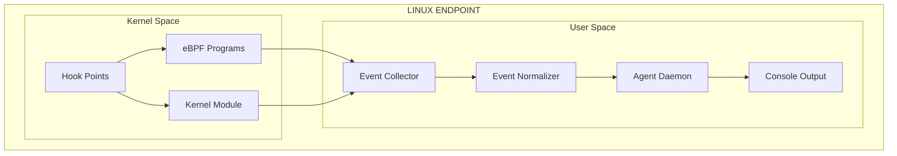
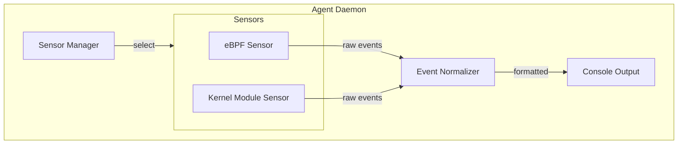
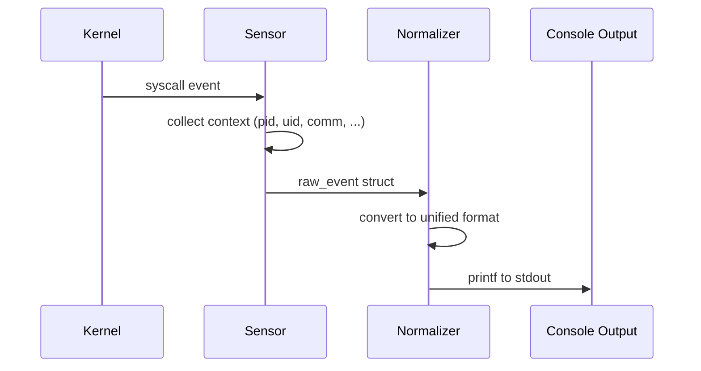
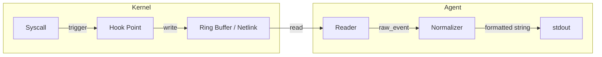

# Software Architecture — Linux EDR Agent

**Version:** 1.1
**Date:** 2026-02-05
**Author:** Vinalinux Team

---

## 1. Introduction

### 1.1. Purpose

Tài liệu này mô tả kiến trúc phần mềm của Linux EDR Agent - một component trong hệ thống Endpoint Detection and Response. Agent có nhiệm vụ thu thập các security events từ Linux endpoint.

### 1.2. Scope

Tài liệu này cover:
- Kiến trúc tổng thể của EDR Agent
- Các component và mối quan hệ giữa chúng
- Data flow giữa các component

Tài liệu này KHÔNG cover:
- Server-side architecture (do đội khác phụ trách)
- Transport layer / gRPC (Phase 2)
- Windows/macOS agent (phát triển sau)

### 1.3. Phân pha

| Phase | Scope | Output |
|-------|-------|--------|
| **Phase 1 (hiện tại)** | Kernel module → thu thập events → console output | Chạy được, log ra stdout |
| Phase 2 | Thêm transport layer, gRPC, gửi events lên server | Kết nối server |
| Phase 3 | Offline buffer, self-protection, health monitor | Production-ready |

### 1.4. Tài liệu liên quan

| Tài liệu | Mô tả |
|-----------|-------|
| [decisions/](decisions/) | Architecture Decision Records |
| [use-cases.md](use-cases.md) | Use cases chi tiết |
| [api.md](api.md) | Internal C interfaces, event output format |
| [data-format.md](data-format.md) | Event formats (C structs) |
| [deployment.md](deployment.md) | Deployment guide, configuration |

### 1.5. Definitions

| Term | Definition |
|------|------------|
| EDR | Endpoint Detection and Response |
| eBPF | Extended Berkeley Packet Filter |
| MITRE ATT&CK | Framework mô tả các kỹ thuật tấn công |
| Sensor | Component thu thập events từ kernel |
| Agent | Toàn bộ software chạy trên endpoint |
| Kprobe | Kernel probe - cơ chế hook kernel functions |
| Netlink | Socket protocol để giao tiếp kernel-userspace |

---

## 2. System Overview (Phase 1)

### 2.1. High-Level Architecture

### 2.2. Key Requirements (Phase 1)

| ID | Requirement | Priority |
|----|-------------|----------|
| R1 | Thu thập process events (exec, fork, exit) | Must |
| R2 | Thu thập file events (open, write, unlink) | Must |
| R3 | Thu thập network events (connect, accept, bind) | Must |
| R4 | Output events ra console (stdout) | Must |
| R5 | Support kernel >= 5.8 (via eBPF) hoặc kernel module (fallback) | Must |
| R6 | Resource usage < 5% CPU, < 100MB RAM | Should |

> Chi tiết architecture decisions: xem [decisions/](decisions/)

---

## 3. Component Architecture (Phase 1)

### 3.1. Component Diagram

### 3.2. Components

| Component | Responsibility |
|-----------|---------------|
| **Sensor Manager** | Detect kernel version, chọn sensor phù hợp (eBPF hoặc Kernel Module), quản lý lifecycle |
| **eBPF Sensor** | Load eBPF programs vào kernel, read events từ ring buffer |
| **Kernel Module Sensor** | Load kernel module (insmod), read events via Netlink socket |
| **Event Normalizer** | Convert raw events từ sensor-specific format sang unified format |
| **Console Output** | Format và print events ra stdout |

> Chi tiết C interfaces: xem [api.md](api.md)

### 3.3. Component Interaction

---

## 4. Data Flow (Phase 1)

### 4.1. Event Collection Flow

---

## References

1. eBPF Documentation: https://ebpf.io/
2. MITRE ATT&CK: https://attack.mitre.org/
3. libbpf: https://github.com/libbpf/libbpf
