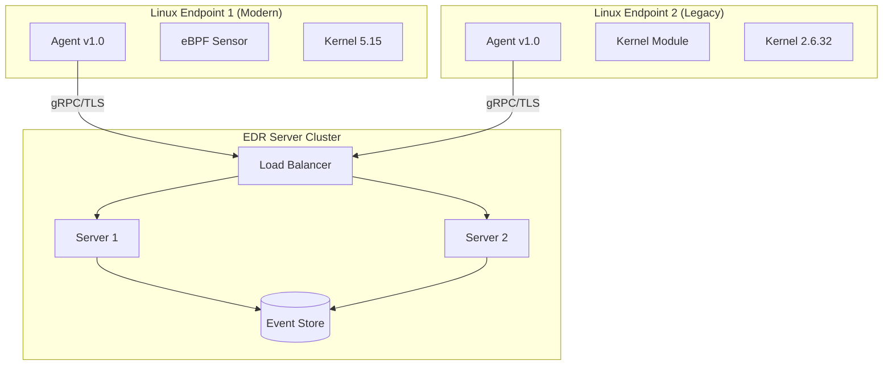

# Deployment — Linux EDR Agent

**Version:** 1.0
**Date:** 2026-02-04

---

## 1. System Requirements

| Component | Minimum | Recommended |
|-----------|---------|-------------|
| CPU | 1 core | 2 cores |
| Memory | 64 MB | 128 MB |
| Disk | 100 MB | 500 MB |
| Kernel | 2.6.32 | 5.8+ |
| OS | RHEL 6+ / Ubuntu 16.04+ | RHEL 8+ / Ubuntu 22.04+ |

---

## 2. Deployment Diagram



---

## 3. Installation Steps

```bash
# 1. Download package
wget https://releases.example.com/edr-agent-1.0.0.tar.gz

# 2. Extract
tar -xzf edr-agent-1.0.0.tar.gz
cd edr-agent-1.0.0

# 3. Run installer
sudo ./install.sh --server=edr.example.com:443 --token=<auth_token>

# 4. Verify
sudo systemctl status edr-agent
sudo edr-agent --version
```

---

## 4. Configuration File

```yaml
# /etc/edr-agent/agent.yaml

server:
  address: "edr.example.com:443"
  tls_enabled: true
  tls_cert_path: "/etc/edr-agent/certs/ca.pem"
  auth_token: "${EDR_AUTH_TOKEN}"

sensor:
  type: "auto"                    # auto, ebpf, kmodule
  process_events: true
  file_events: true
  network_events: true
  exclude_paths:
    - "/proc"
    - "/sys"
    - "/var/log/edr-agent"
  exclude_procs:
    - "edr-agent"

transport:
  batch_size: 100
  batch_timeout: "1s"
  compression: "gzip"
  offline_buffer_path: "/var/lib/edr-agent/buffer"
  max_buffer_size: 104857600      # 100MB
  retry_interval: "5s"
  max_retries: 3

logging:
  level: "info"                   # debug, info, warn, error
  file: "/var/log/edr-agent/agent.log"
  max_size: 100                   # MB
  max_backups: 3
  max_age: 7                      # days

health:
  check_interval: "30s"
  cpu_threshold: 5.0              # percent
  memory_threshold: 104857600     # 100MB
```
