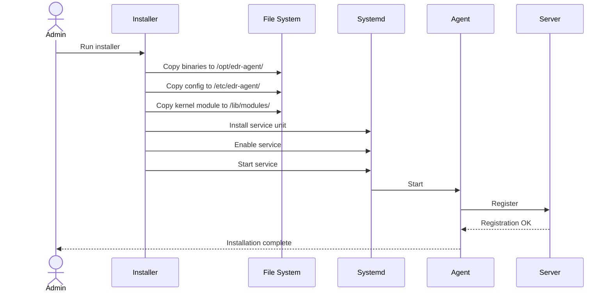
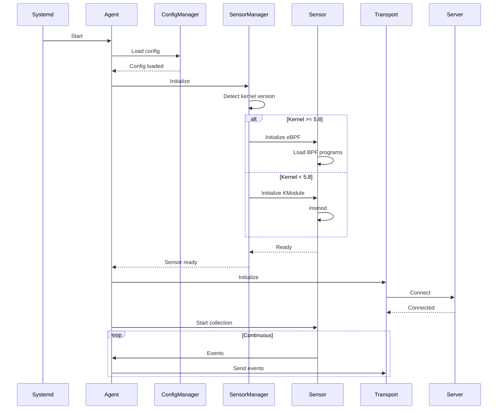
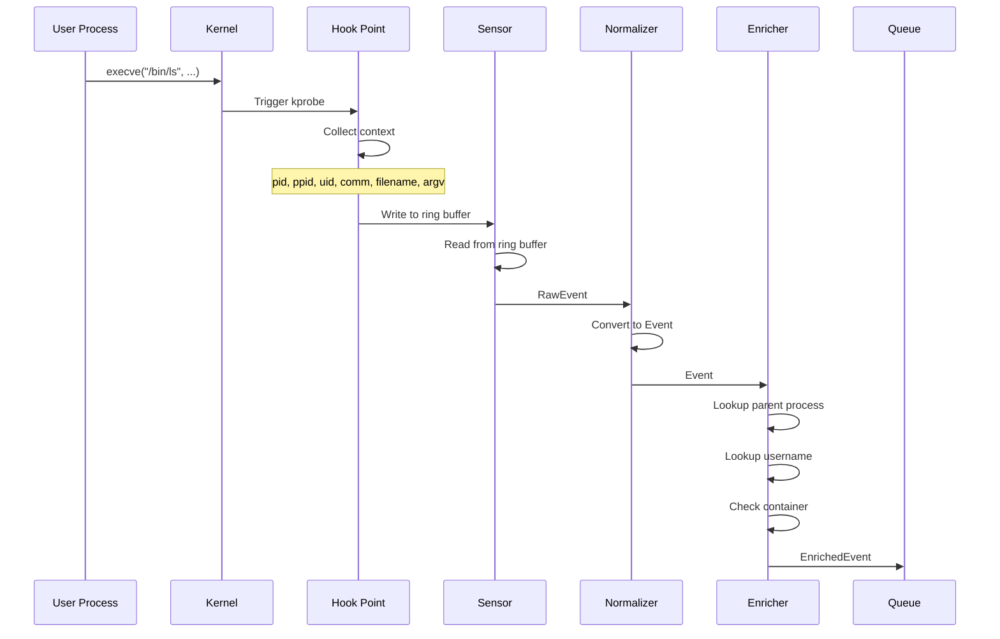
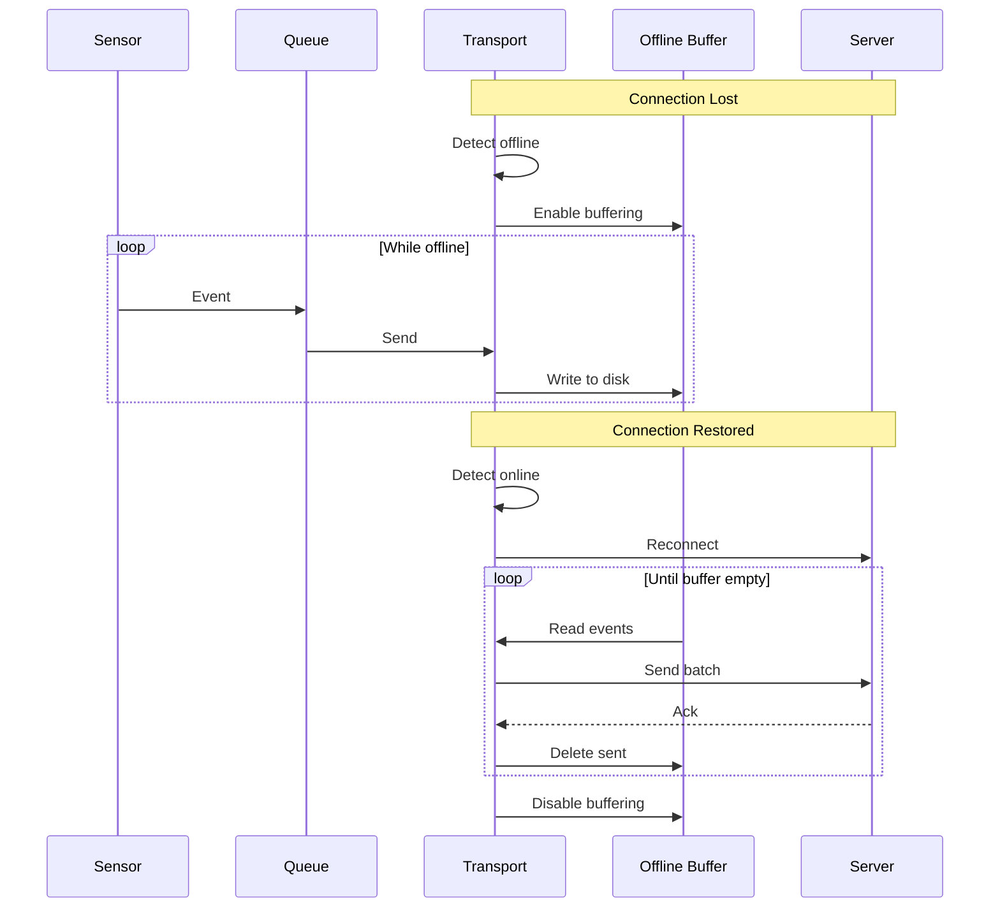

# Use Cases — Linux EDR Agent

**Version:** 1.0
**Date:** 2026-02-04

---

## 1. Use Case Diagram

```mermaid
graph TB
    Admin((Admin))
    Server((Server))
    Agent((Agent))

    subgraph Lifecycle["Lifecycle Management"]
        UC1[Install Agent]
        UC2[Uninstall Agent]
        UC3[Start Agent]
        UC4[Stop Agent]
        UC5[Upgrade Agent]
        UC6[Rollback Agent]
    end

    subgraph Config["Configuration"]
        UC7[Load Config]
        UC8[Update Config]
        UC9[Validate Config]
    end

    subgraph Communication["Server Communication"]
        UC10[Register Agent]
        UC11[Connect to Server]
        UC12[Send Events]
        UC13[Send Heartbeat]
        UC14[Receive Commands]
    end

    subgraph Collection["Event Collection"]
        UC15[Monitor Process]
        UC16[Monitor File]
        UC17[Monitor Network]
        UC18[Filter Events]
        UC19[Enrich Events]
    end

    subgraph Offline["Offline Mode"]
        UC20[Detect Offline]
        UC21[Store Locally]
        UC22[Sync Events]
    end

    subgraph Health["Health & Monitoring"]
        UC23[Check Health]
        UC24[Report Status]
        UC25[Throttle Load]
    end

    subgraph Sensor["Sensor Management"]
        UC26[Detect Kernel]
        UC27[Select Sensor]
        UC28[Load eBPF]
        UC29[Load Module]
    end

    Admin --> UC1
    Admin --> UC2
    Admin --> UC3
    Admin --> UC4
    Admin --> UC5
    Admin --> UC23

    Server --> UC8
    Server --> UC14

    Agent --> UC7
    Agent --> UC10
    Agent --> UC11
    Agent --> UC12
    Agent --> UC13
    Agent --> UC15
    Agent --> UC16
    Agent --> UC17
    Agent --> UC18
    Agent --> UC19
    Agent --> UC20
    Agent --> UC21
    Agent --> UC22
    Agent --> UC24
    Agent --> UC25
    Agent --> UC26
    Agent --> UC27
    Agent --> UC28
    Agent --> UC29
```

---

## 2. Use Case Details

### UC-001: Install Agent

### UC-002: Start Agent

### UC-003: Monitor Process Events

### UC-004: Handle Offline Mode

---

## 3. Use Case Summary Table

| ID | Use Case | Actor | Priority | Phase |
|----|----------|-------|----------|-------|
| UC-001 | Install Agent | Admin | Must | 1 |
| UC-002 | Uninstall Agent | Admin | Must | 1 |
| UC-003 | Start Agent | Admin/System | Must | 1 |
| UC-004 | Stop Agent | Admin | Must | 1 |
| UC-005 | Upgrade Agent | Admin | Should | 2 |
| UC-006 | Rollback Agent | Admin | Should | 2 |
| UC-007 | Load Config | Agent | Must | 1 |
| UC-008 | Update Config | Server | Should | 2 |
| UC-009 | Validate Config | Agent | Must | 1 |
| UC-010 | Register Agent | Agent | Must | 1 |
| UC-011 | Connect to Server | Agent | Must | 1 |
| UC-012 | Send Events | Agent | Must | 1 |
| UC-013 | Send Heartbeat | Agent | Should | 2 |
| UC-014 | Receive Commands | Agent | Should | 2 |
| UC-015 | Monitor Process | Agent | Must | 1 |
| UC-016 | Monitor File | Agent | Must | 1 |
| UC-017 | Monitor Network | Agent | Must | 1 |
| UC-018 | Filter Events | Agent | Should | 2 |
| UC-019 | Enrich Events | Agent | Must | 1 |
| UC-020 | Detect Offline | Agent | Should | 2 |
| UC-021 | Store Locally | Agent | Should | 2 |
| UC-022 | Sync Events | Agent | Should | 2 |
| UC-023 | Check Health | Agent/Admin | Should | 2 |
| UC-024 | Report Status | Agent | Should | 2 |
| UC-025 | Throttle Load | Agent | Should | 3 |
| UC-026 | Detect Kernel | Agent | Must | 1 |
| UC-027 | Select Sensor | Agent | Must | 1 |
| UC-028 | Load eBPF | Agent | Must | 1 |
| UC-029 | Load Module | Agent | Must | 1 |
